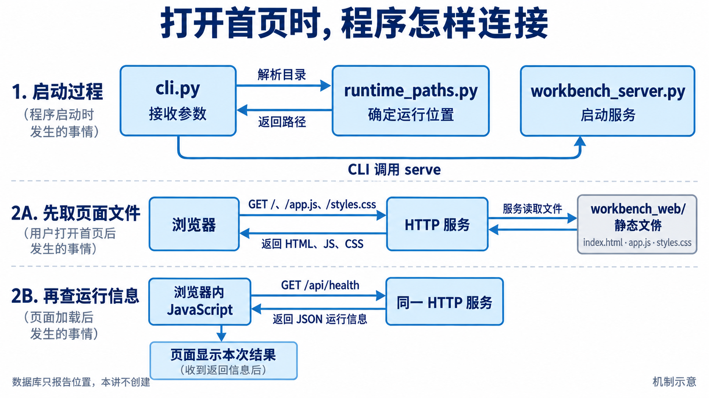
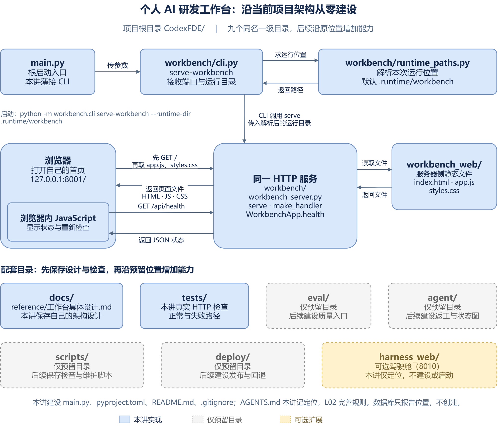
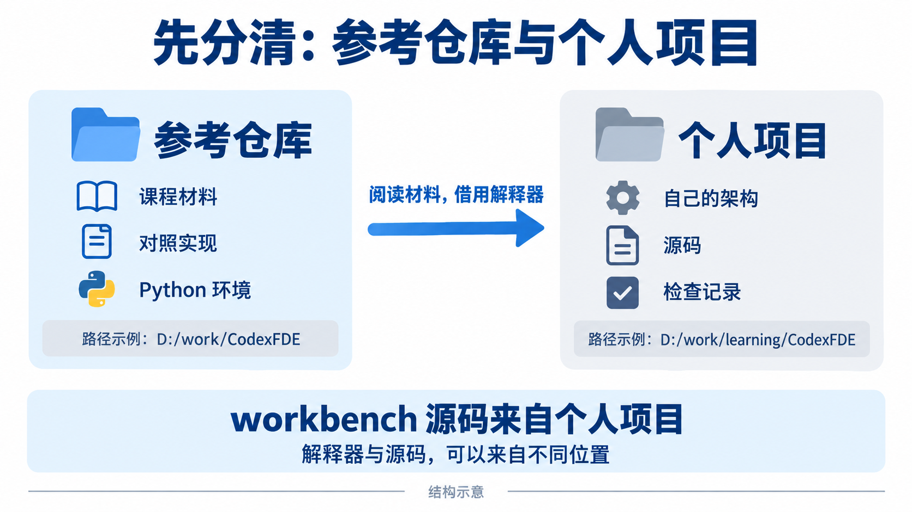
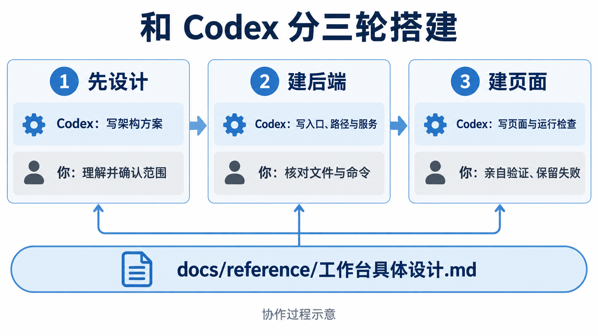
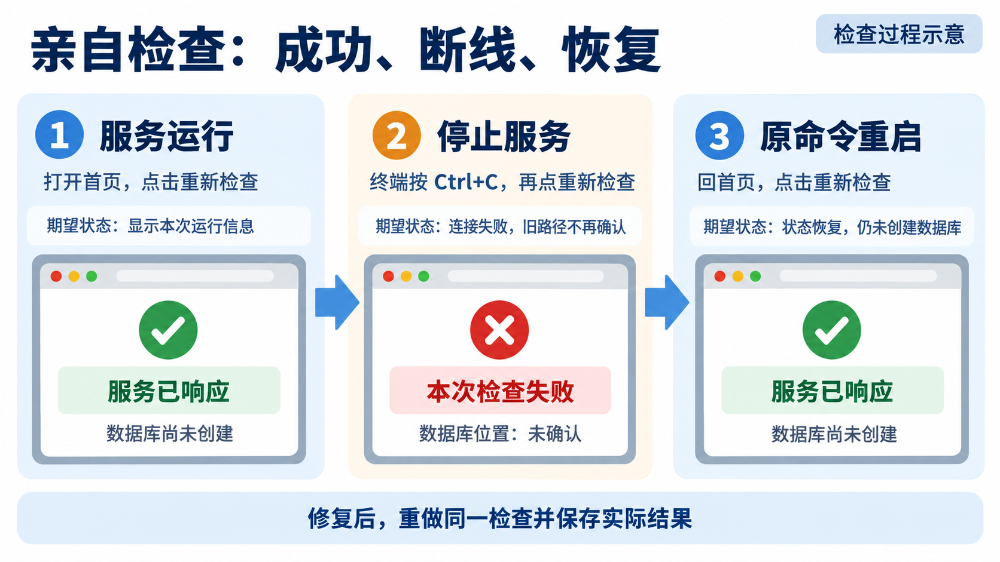
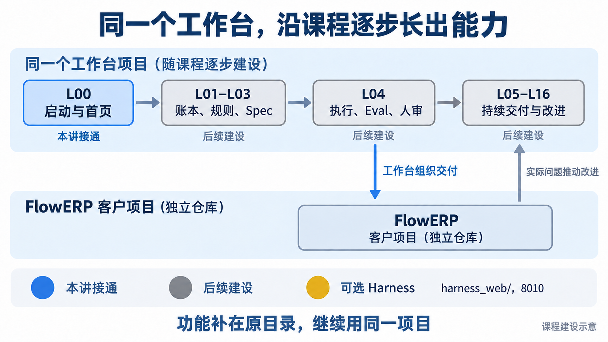

# L00｜从 0 开始搭建个人 AI 研发工作台

> **参考选做**：课程已提供工作台项目壳。建议另外创建一个新的工作台项目，依据本文档，与 Codex 一起从 0 开始搭建。

使用现成壳时，完成[环境准备](./L00｜课前准备：装好工具，跑通第一次环境自检.md)后，直接进入 [L01 的课程壳入口](../L01/实践操作手册.md#provided-shell)。下面六步供选择从 0 搭建的学员使用。

完成后，你的工作台应能**打开首页、查清运行位置、在断线后恢复检查**。后续课程可以继续在这个新项目里逐步完善功能。

按六步完成：**准备目录 → 确认架构 → 分两轮建设 → 亲自检查 → 保存版本 → 进入 L01。** 图帮助你理解过程；提示词交给 Codex，命令输入终端。下方 ImageGen 图均为教学示意。

## 先看懂要搭什么

工作台有两个配合的部分：**Python 服务处理请求，网页显示结果。** 先看一次运行怎样把它们接起来。



沿图读两条线：上面是**启动服务**，下面是**页面取回结果**。服务先提供网页文件；页面中的 JavaScript 再请求 `/api/health`，取回服务类型、运行目录和计划数据库位置。

分开以后，改样式找 `styles.css`，改启动参数找 `cli.py`，增加接口找 `workbench_server.py`。本讲只报告数据库位置，尚不创建数据库。

### 从一开始采用当前项目的目录结构

个人项目使用 `CodexFDE/` 作为目录名，例如 `D:\work\learning\CodexFDE`。九个一级目录和职责与参考项目对应：

| 当前状态 | 位置 |
|---|---|
| 本讲接通 | `main.py`、`workbench/`、`workbench_web/`、`tests/` |
| 保存设计与说明 | `docs/`；根目录的配置与定位文件 |
| 后续补功能 | `agent/`、`eval/`、`scripts/`、`deploy/` |
| 可选扩展 | `harness_web/`，完整驾驶舱默认 8010 |

<details>
<summary>完整目录树：建设时展开，逐项核对</summary>

```text
CodexFDE/
├── main.py                         # 根启动入口，本讲接到已有 CLI
├── AGENTS.md                       # 先写项目定位，L02 再制定并实验协作规则
├── pyproject.toml                  # 包配置与命令入口
├── README.md                       # 本项目的运行与建设状态
├── .gitignore
├── workbench/                      # 工作台后端
│   ├── __init__.py
│   ├── cli.py
│   ├── runtime_paths.py
│   └── workbench_server.py
├── workbench_web/                  # 必做工作台页面，默认 8001
│   ├── index.html
│   ├── app.js
│   └── styles.css
├── tests/                         # 本讲的真实运行检查
│   ├── __init__.py
│   └── test_workbench_server.py
├── agent/                         # 预留返工 Loop 与状态图
│   └── __init__.py
├── eval/                          # 预留统一质量检查
│   └── __init__.py
├── docs/                          # 本项目设计与使用说明
│   ├── README.md
│   └── reference/
│       ├── README.md
│       └── 工作台具体设计.md
├── scripts/                       # 预留检查与维护脚本
│   └── .gitkeep
├── deploy/                        # 预留部署与冷启动
│   └── .gitkeep
└── harness_web/                   # 可选完整驾驶舱，本讲不启用
    └── __init__.py
```

预留目录中的 `__init__.py` 只说明用途；`.gitkeep` 让空目录能随 Git 保存。`bootstrap.py`、`spec.py`、`task_store.py`、`eval/harness.py`、`agent/loop.py` 等在后续课程建设。

`main.py` 本讲转交 CLI；`AGENTS.md` 先记定位，L02 再完善规则。自己的架构写在 `docs/reference/工作台具体设计.md`。运行数据放在 `.runtime/workbench/`，不提交；`.github/`、`.codex/` 等配置按相关课程补齐。

</details>

<details>
<summary>完整架构图：需要核对九个目录的分工时展开</summary>



[可编辑源图](../assets/l00-architecture/personal-workbench-v0.drawio)。独立 FlowERP 从 L04 接入，业务代码和数据库保存在客户仓库。

</details>

<details>
<summary>连接约定：给 Codex 形成架构计划时使用</summary>

<a id="connection-contract"></a>

### 连接约定

以下约定只写一次。第 2 步让 Codex 将它纳入 `docs/reference/工作台具体设计.md`，后续建设提示词都读取该设计。

- `workbench/cli.py` 提供 `main(argv=None) -> int` 与模块启动入口。`serve-workbench` 支持 `--host`、`--port`、`--runtime-dir`，默认地址为 `127.0.0.1:8001`。
- 根目录 `main.py` 提供 `main(argv=None) -> int`，将参数交给 CLI；无参数时补入 `serve-workbench`。本讲的根入口不导入后续桌面模块，不启动 FlowERP。`AGENTS.md` 只记录定位和设计文件位置，正式协作规则留到 L02 实验。
- `workbench/runtime_paths.py` 提供 `service_runtime(surface, explicit=None, *, root=ROOT) -> Path`。`ROOT` 从源码位置确定项目根目录；新项目默认运行目录为 `.runtime/workbench`，显式位置解析为绝对路径，不创建目录。
- CLI 先解析运行目录，再传给服务。服务提供 `WorkbenchApp.health()`、`make_handler(app)`，以及下面的启动函数：

```text
serve(host="127.0.0.1", port=8001, runtime_dir=".runtime", *,
      enable_code_execution=False,
      erp_url="http://127.0.0.1:8000",
      enable_advanced_runtime=False)
```

后三项参数为后续功能保留，本次不启用。CLI 总会传入解析后的绝对运行目录；上面的 `.runtime` 是直接调用服务函数时的默认值，命令行默认仍为个人项目的 `.runtime/workbench`。

- 页面目录依据源码位置找到 `workbench_web/`。只提供 `GET /`、`/app.js`、`/styles.css` 和 `/api/health`；未知路径返回 404，写入请求被拒绝。
- 健康信息包含 `surface="workbench"`、`capabilities=["shell"]`、`runtime`、`database` 和实际的 `database_exists`。`database` 为本次运行目录下的 `workbench.db`；不创建或读写数据库，也不声明任务已经完成。
- 页面加载和点击“重新检查”都请求健康接口。核对响应身份，使用 `textContent` 显示数据；失败时清除旧路径确认，重启服务后能重新检查。

</details>

## 第 1 步：准备一个自己的空项目

先完成[环境准备](./L00｜课前准备：装好工具，跑通第一次环境自检.md)，再分清两个位置：



左边用来**读材料、借 Python 环境**；右边用来**保存自己的设计、源码和记录**。两个目录都叫 `CodexFDE`，所在位置不同。

选择参考仓库之外的新目录或空目录，例如 `D:\work\learning\CodexFDE`。下面只运行自己系统的一组命令，已有实验保留原内容。

<details>
<summary>Windows：在参考仓库根目录准备个人项目</summary>

使用 PowerShell，整段执行。提示输入路径时，粘贴个人项目的绝对路径，不加引号。

```powershell
& {
    $ErrorActionPreference = 'Stop'
    $courseRoot = (Get-Location).Path
    $coursePython = (Resolve-Path -LiteralPath .\.venv\Scripts\python.exe).Path
    . .\.venv\Scripts\Activate.ps1
    $personalRoot = Read-Host '输入新个人项目的绝对路径'
    if (-not [System.IO.Path]::IsPathRooted($personalRoot)) { throw '请输入绝对路径。' }
    $personalRoot = [System.IO.Path]::GetFullPath($personalRoot)
    if ($personalRoot -eq $courseRoot -or $personalRoot.StartsWith($courseRoot + [System.IO.Path]::DirectorySeparatorChar, [System.StringComparison]::OrdinalIgnoreCase)) { throw '个人项目应放在参考仓库之外。' }
    if (Test-Path -LiteralPath $personalRoot) {
        if (-not (Test-Path -LiteralPath $personalRoot -PathType Container)) { throw '目标不是目录。' }
        if (Get-ChildItem -LiteralPath $personalRoot -Force) { throw '目标非空，请选择新目录。' }
    } else {
        New-Item -ItemType Directory -Path $personalRoot | Out-Null
    }
    Set-Location -LiteralPath $personalRoot
    git init
    if ($LASTEXITCODE -ne 0) { throw 'Git 初始化失败，请先排查。' }
    Write-Host "参考材料：$courseRoot"
    Write-Host "个人源码：$((Get-Location).Path)"
    & $coursePython -X utf8 -c "import sys; print('Python:', sys.executable)"
}
```

</details>

<details>
<summary>macOS：在参考仓库根目录准备个人项目</summary>

使用 zsh，整段执行。输入完整路径，例如 `/Users/你的用户名/work/learning/CodexFDE`，不使用 `~` 缩写。

```zsh
prepare_workbench_project() {
  local courseRoot="$(pwd -P)"
  local coursePython="$courseRoot/.venv/bin/python"
  local personalRoot
  [ -x "$coursePython" ] || { printf '先完成参考仓库的环境准备。\n'; return 1; }
  source "$courseRoot/.venv/bin/activate" || return 1
  printf '输入参考仓库之外的新个人项目绝对路径：\n'
  read -r personalRoot || return 1
  case "$personalRoot" in /*) ;; *) printf '请输入绝对路径。\n'; return 1 ;; esac
  personalRoot=$("$coursePython" -X utf8 -c 'import sys; from pathlib import Path; print(Path(sys.argv[1]).resolve())' "$personalRoot") || return 1
  case "$personalRoot/" in "$courseRoot/"*) printf '个人项目应放在参考仓库之外。\n'; return 1 ;; esac
  if [ -e "$personalRoot" ]; then
    [ -d "$personalRoot" ] || { printf '目标不是目录。\n'; return 1; }
    [ -z "$(ls -A "$personalRoot")" ] || { printf '目标非空，请选择新目录。\n'; return 1; }
  else
    mkdir -p "$personalRoot" || return 1
  fi
  cd "$personalRoot" || return 1
  git init || return 1
  printf '参考材料：%s\n个人源码：%s\n' "$courseRoot" "$PWD"
  "$coursePython" -X utf8 -c "import sys; print('Python:', sys.executable)"
}
prepare_workbench_project
```

</details>

记下输出的两个目录和 Python 路径。在 Codex 与编辑器中打开**个人目录**。

**可以继续的条件：**个人目录只有 Git 起点，尚没有程序；终端使用参考仓库的 `.venv`。下面的提示词发到 Codex 对话框，运行命令则输入终端。

## 第 2 步：与 Codex 把架构说清楚

三轮协作都使用同一份设计：先确认怎么搭，再让 Codex 分两轮实现。



**你决定范围并核对结果，Codex 负责形成方案和实现。** 第 1 轮产物是 `docs/reference/工作台具体设计.md`；后面两轮继续读取它。

### 提示词 1：设计项目骨架

先填写参考仓库路径和第 1 步输出的 Python 路径，再发送：

```text
请与我一起搭建一个在本机运行的个人 AI 研发工作台。
先完成项目结构、启动入口和首页：能查看服务的运行位置，
连接失败时有明确提示，服务恢复后可以重新检查。
任务管理、执行与审核功能以后逐步增加。

参考仓库绝对路径：〈填入你的参考仓库路径〉。
本次检查的 Python 绝对路径：〈填入第 1 步输出的解释器路径〉。
个人源码写在当前项目，请先核对当前绝对路径。
将这两个位置和个人项目路径记入设计；后续执行检查使用该解释器，
从个人项目根目录加载源码，核对 sys.executable 与 workbench.__file__。

请读取参考仓库中的
docs/courses/L00/从0开始搭建个人AI研发工作台.md 的“连接约定”，
并只读核对参考仓库的根目录、main.py、AGENTS.md、pyproject.toml，
以及 workbench/、workbench_web/、tests/、agent/、eval/、
docs/、scripts/、deploy/、harness_web/ 的实际位置和职责。

采用文档中的九个一级目录和根文件位置，为当前空项目设计骨架。
明确本次实现、后续预留、可选扩展；后续功能沿同一项目增长。
用一次“启动服务→打开首页→查看运行信息”的过程说明：
每个文件负责什么、参数和结果怎样传递，
以及以后增加任务管理时可以在哪些位置扩展。

将目标、目录树、调用顺序、连接约定、与参考项目的对应表和检查方法
保存到当前项目的 docs/reference/工作台具体设计.md。
只创建这个设计文件及其父目录；不提前实现预留功能。
不要复制参考实现；先让我理解并确认计划，再开始编程。
```

读完设计，用自己的话回答：**谁处理启动参数？页面怎样取到运行信息？任务管理以后放哪里？** 看不懂时，让 Codex 沿图 1 解释一次请求，再把自己的理解和确认范围写入设计。

**可以继续的条件：**设计文件已保存，其中规划的九个目录、根入口和核心文件位置与参考项目对应；你已确认本次范围。此时尚未建设程序，正式的任务需求合同将在 L01 另行形成。

## 第 3 步：按计划分两轮建设

按图 3 的第 2、3 轮继续：**先建后端，再接页面。** 两轮都在当前个人项目执行，读取已确认的设计。

### 提示词 2：建设后端

这一轮先接通后端，页面在下一轮建设。先抓住三个文件的分工：

| 文件 | 负责什么 |
|---|---|
| `cli.py` | 接收终端启动命令和参数，再调用服务 |
| `runtime_paths.py` | 确定运行数据的位置，将路径返回给启动命令 |
| `workbench_server.py` | 接收浏览器请求，返回本次运行信息 |

根入口 `main.py` 转交 `cli.py`。本轮检查语法、命令帮助和源码位置；首页能否打开，在下一轮接好页面后检查。

展开后，将完整提示词发送给 Codex。文件清单与工程配置都包含在其中，阅读时先把握上面的分工，再按下方命令核对结果。

<details>
<summary>提示词 2：展开复制完整后端任务与工程配置</summary>

```text
按我已确认的 docs/reference/工作台具体设计.md 建设项目骨架和后端。
使用 Python 3.11 标准库，遵守计划中的连接约定。
所有检查从个人项目根目录运行，使用设计中记录的 Python 绝对路径。

本轮写入：
workbench/__init__.py
workbench/cli.py
workbench/runtime_paths.py
workbench/workbench_server.py
main.py、AGENTS.md、pyproject.toml、README.md、.gitignore
agent/__init__.py、eval/__init__.py、harness_web/__init__.py
docs/README.md、docs/reference/README.md
scripts/.gitkeep、deploy/.gitkeep

预留目录只说明用途，不创建未来功能的空模块。
AGENTS.md 只写项目定位和架构文件位置，正式规则后续再制定。
main.py 无参数时启动已有工作台 CLI；不导入未建设的桌面模块。
保留已确认的设计文件，不用参考成熟设计覆盖个人设计。

接通“启动命令→运行目录解析→HTTP服务→健康信息”。
服务启动时打印实际 URL、源码根目录和运行目录。
暂不保存事项或创建数据库，页面文件下一轮再建设。

README 写清当前范围和启动方法。
pyproject.toml 沿参考项目的基础配置：Python>=3.10、无第三方运行依赖，
构建依赖 setuptools>=68 与 wheel，构建后端 setuptools.build_meta，
py-modules 包含 main，package-data 用 "*" 包含 html/css/js，
包发现包含 workbench*、eval*、agent*、harness_web*。
沿用发行名 flowerp-fde-camp，并在 README 解释它不是 flowerp 导入包。
登记 codexfde=main:main、flowerp-workbench=workbench.cli:main；
尚未建设的 harness-workbench 命令不登记。
.gitignore 排除 .venv、.runtime、
字节码和 lesson-*-submission/。

完成后检查语法、CLI 帮助和实际模块位置。
报告修改文件、真实命令、退出码，以及仍未完成的部分。
```

</details>

完成后，在个人项目根目录运行：

```text
python -X utf8 -m compileall -q workbench
python -X utf8 -m workbench.cli --help
python -X utf8 main.py --help
python -X utf8 -c "import sys, workbench; print('Python:', sys.executable); print('源码:', workbench.__file__)"
```

应看到 `serve-workbench` 命令；根入口帮助与 CLI 相同；解释器来自参考环境，`workbench` 来自个人项目。失败时保留输出，请 Codex 修复本轮文件，再重跑。此时页面尚未建设，不要求首页已经能打开。

### 提示词 3：建设页面并接通检查

```text
读取 docs/reference/工作台具体设计.md 和已完成的后端，继续建设页面。
所有检查从个人项目根目录运行，使用设计中记录的 Python 绝对路径。
本轮新增：
workbench_web/index.html
workbench_web/app.js
workbench_web/styles.css
tests/__init__.py
tests/test_workbench_server.py
并更新 README.md。

首页显示“个人 AI 研发工作台”。
“事项与决策”区域说明任务管理待建设；
“本次运行”区域显示实际服务状态和计划数据库位置。
加载页面与点击“重新检查”都请求健康接口。
按计划核对响应身份；失败时显示原因并清除旧路径确认，
恢复服务后能够再检查。内容、交互和样式分别放在对应文件。

建立标准库测试，实际核对首页、JS/CSS、健康信息，
默认与显式运行目录、未知路径404、写入请求被拒绝，
以及运行后没有创建数据目录或数据库。
核对九个一级目录与根入口；预留目录存在不算功能通过。
使用临时目录和空闲端口，不导入后续尚未建设的模块。

运行 python -X utf8 -m unittest tests.test_workbench_server -v，
报告用例数量、退出码和未验证项。
后端需要调整时说明原因，保持原文件分工与本次范围。
浏览器中的断线提示和恢复由我下一步亲自核对。
```

建设完成后，展开前面的目录树逐项核对：文件位置一致，本讲检查通过，后续功能仍标为待建设。路径偏离时先修正源码、引用和配置。

**可以继续的条件：**文件已保存，实际测试数量大于零，测试通过。测试文件缺失、零用例或环境错误都应先处理，不能算项目完成。

## 第 4 步：亲自打开工作台，检查正常与失败

这一步由你操作。图中的三次状态变化，都要在自己的工作台中实际看到。



先在个人项目根目录查看改动并复验：

```text
git status --short
git add -N -- .gitignore README.md pyproject.toml main.py AGENTS.md workbench workbench_web tests agent eval docs scripts deploy harness_web
git diff --check
git diff --stat
python -X utf8 -m unittest tests.test_workbench_server -v
```

`git add -N` 让新文件出现在差异中，尚未提交。对照设计核对文件位置，让 Codex 指出两处连接依据，再由你打开源码确认。

随后启动服务：

```text
python -X utf8 -m workbench.cli serve-workbench --runtime-dir .runtime/workbench
```

保持启动终端运行，在浏览器打开 [http://127.0.0.1:8001/](http://127.0.0.1:8001/)。需要另一个终端时，激活同一参考环境，再进入个人目录。

| 检查 | 你要做什么 | 正常结果 |
|---|---|---|
| 首页 | 打开根路径 `/`，核对启动终端中的源码位置 | 显示工作台标题和“本次运行”，任务管理待建设 |
| 运行信息 | 打开 `/api/health` | `surface` 为 `workbench`，运行目录属于本项目，`database_exists` 为 `false` |
| 失败提示 | 打开 `/not-found`；保留首页，在服务终端按 `Ctrl+C`，回首页点击“重新检查” | 未知页面返回 404；首页显示连接失败，旧路径不再显示为已确认 |
| 重启恢复 | 用原命令重启，回首页重新检查 | 服务状态恢复，仍未创建数据库 |

默认计划数据库是 `.runtime/workbench/workbench.db`。本次只报告位置，不实际存储数据。

上面四项检查通过后，再停止服务并复验根入口：未改参数时运行 `python -X utf8 main.py`；已改参数时使用 `python -X utf8 main.py serve-workbench` 并附上原参数。复查首页与健康信息，确认根入口也启动同一个工作台。

核对完成后，在服务终端按 `Ctrl+C`，看到命令提示符再进入第 5 步。

<details>
<summary>检查失败时：怎样让 Codex 帮你修复</summary>

端口被占用时先保留错误。可以增加 `--port 8002`，对应打开 [http://127.0.0.1:8002/](http://127.0.0.1:8002/)；看到其他项目的页面不算自己的服务启动成功。

其他错误用下面的提示词，把空项补为实际事实：

```text
工作台在检查〈名称〉时失败，
请按 docs/reference/工作台具体设计.md 定位并修复。
当前个人项目：
实际命令或浏览器动作：
完整输出与退出码：
预期结果：
已经核对的文件：

先解释原因，再在本次范围内做最小修复，保留原失败记录。
修复后重跑同一检查，列出实际差异和仍未验证的部分。
不要改弱检查标准，也不要替我填写现场复验结果。
```

后端修复后，在服务终端按 `Ctrl+C`，再运行原启动命令，回浏览器重做失败项。Python 服务不会自动加载修改后的源码。

重开终端时，先激活参考仓库的 `.venv`，再进入个人目录。核对 `sys.executable` 与 `workbench.__file__`，双系统恢复方式见[执行与排错说明](../../reference/实操手册执行与排错.md)。

</details>

**可以继续的条件：**四项现场检查都完成，失败与修复能解释；参考测试结果和 Codex 的完成声明不能代替你的现场结果。

## 第 5 步：留下自己的记录，保存这个版本

<a id="run-records"></a>

在个人项目保存 `lesson-00-submission/L00-壳验收.md`。文件名沿用课程约定，内容填写自己的事实：

| 记录项 | 写什么 |
|---|---|
| 位置与版本 | 参考目录、个人目录、解释器、`docs/reference/工作台具体设计.md` 版本 |
| 架构核对 | 九个目录的对应结果、两处实际源码依据，以及你怎样理解它们的连接 |
| 检查结果 | 测试命令、数量、退出码和四项现场结果 |
| 失败与修订 | 原错误、修改文件、同一标准下的复验结果；未运行项如实标明 |

更新 README 的“下一步”：当前可用什么、已检查什么、还需建设什么。然后保存源码版本：

```text
git add .gitignore README.md pyproject.toml main.py AGENTS.md workbench workbench_web tests agent eval docs scripts deploy harness_web
git diff --cached --check
git commit -m "chore: build personal workbench foundation"
git log -1 --oneline
git status --short
```

提交前核对清单，运行目录、数据库和个人学习记录保留在本地或课程指定入口。Git 身份未配置时按错误提示处理后重试。把实际提交编号补记到检查记录。

**完成判断：**源码版本能找回，你能解释启动、路径、服务与页面的分工，运行与失败检查有自己的记录。

## 第 6 步：沿这个项目继续建设

打开 [L01 的已有壳接续入口](../L01/实践操作手册.md#continue-shell)，选择“A. 已有个人工作台壳”，继续使用**同一个个人目录**。承接工具只接入课程采集工具，不替换你的实现。

<details>
<summary>承接工具的输出怎样核对</summary>

这一步的 `prepare_shell.py --continue-l01` 只核对已有文件、补两份课程采集工具和位置记录，不替换你的实现。`layout="aligned_directory_skeleton"` 表示必需文件的位置齐备，不检查可选的 `harness_web/`，也不证明程序或本人验收通过。九个目录的对应关系仍按自己的设计核对。

若旧版项目报告 `missing_layout_files`，保留原实现，先按本页设计与提示词补齐缺失位置，再核对。工具不会替你写架构或验收结论。

记录中的 `source_root` 指参考材料，`path` 指个人源码；具体命令按 L01 手册执行。

</details>

后续始终使用这个工作台。L04 开始，由它组织 Codex 开发独立的 FlowERP 客户项目。



沿上面的工作台主线读，再看下面的客户项目：**先建研发工具，再用它交付产品；交付中的问题推动工具继续改进。**

<details>
<summary>各讲具体补在哪些文件</summary>

| 阶段 | 增加的位置 | 解决什么问题 |
|---|---|---|
| L01 | `workbench/bootstrap.py`，接入原 CLI | 保存项目、任务和命令证据，记录自身建设 |
| L02 | 完善原 `AGENTS.md` | 用本人制定的协作规则约束修改，并通过对照实验验证 |
| L03 | `workbench/spec.py` | 将需求合同变为可检查的输入 |
| L04 | `workbench/task_store.py`、`workbench/execution.py`、`workbench/workflow.py` 和 `eval/harness.py` | 接通受控任务、执行、复验与人审 |
| 后续 | 在原 `agent/` 加入 `loop.py`、`graph.py`；在原 `scripts/`、`deploy/` 补检查与部署；扩展原页面 | 管理返工、审核和交付，让已实现能力在页面可用 |

</details>

[课程提供的壳](./starter/)也可用于对照和排错。选择从 0 搭建时，自己的建设过程保留在设计、源码、检查记录和 Git 版本中。

**再做一个小变化：**换端口和显式运行目录，重新启动。解释为什么换端口改变访问地址，而换运行目录改变计划数据库位置，并保存实际结果。

返回 [L00 入口](./README.md)。
