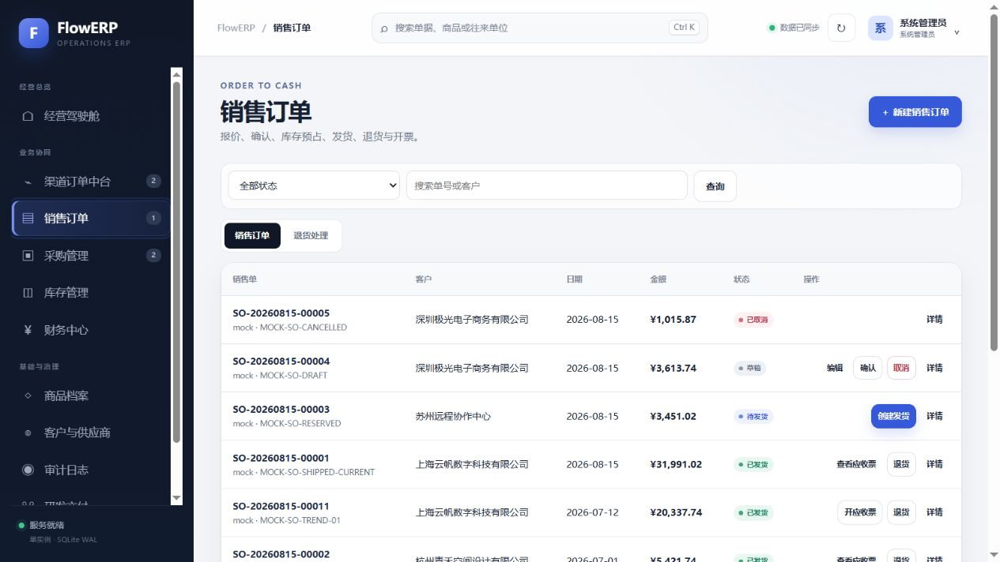
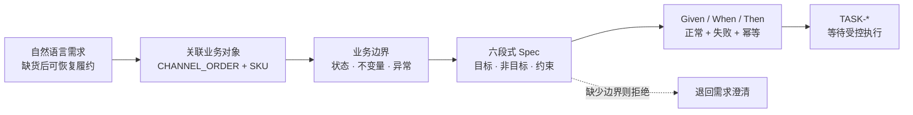
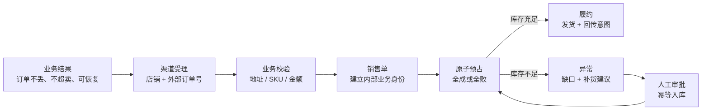
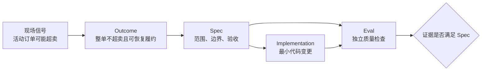
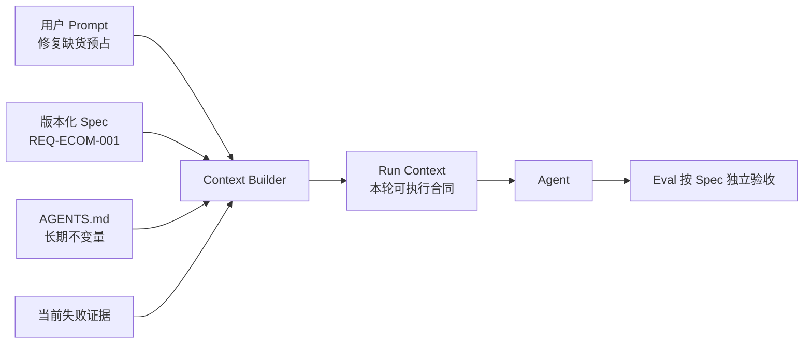
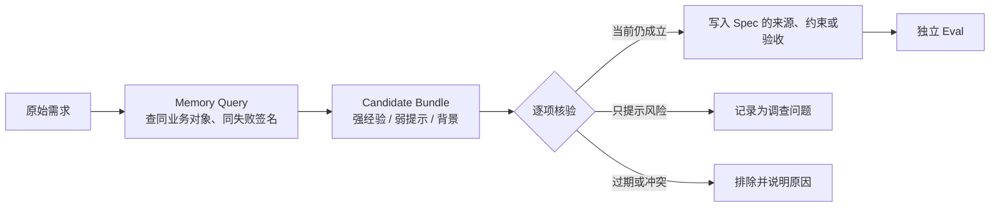
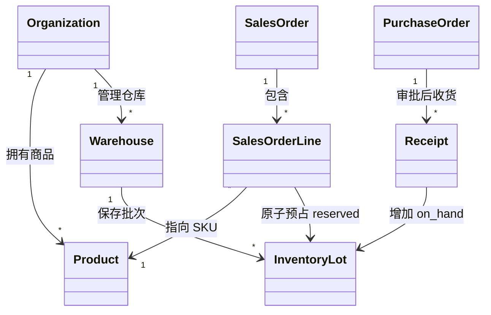
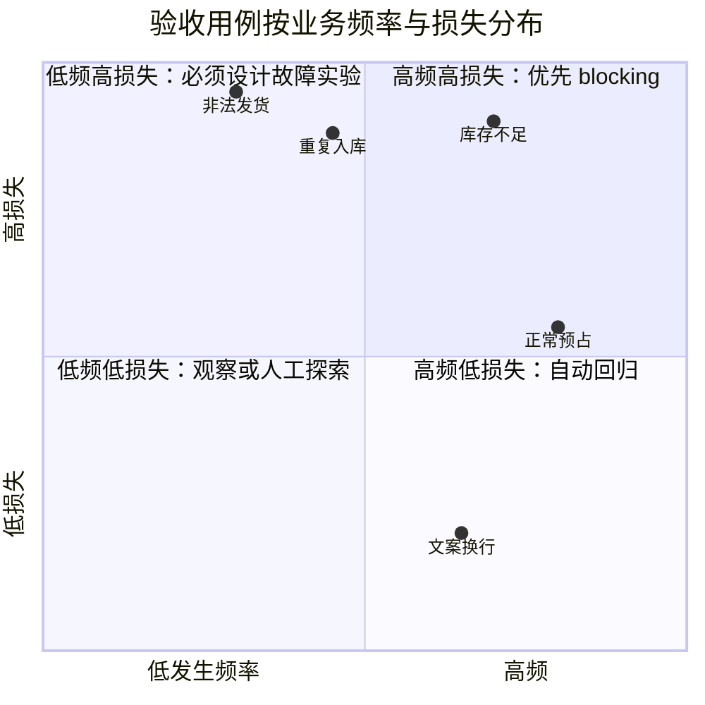
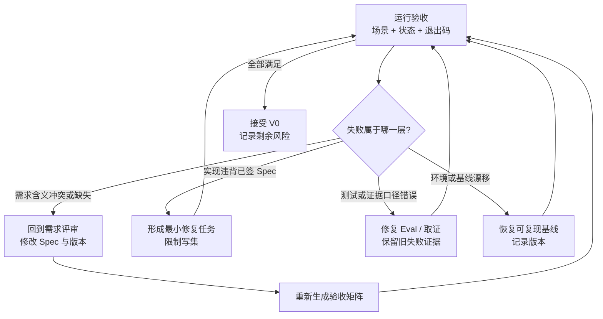

# L03｜把模糊需求变成可验收 Spec

- **核心内容**：目标与非目标、正常与错误路径、边界条件、可执行验收项、最小变更原则。
- **演示结果**：把“增加导出功能”拆成结构化 `FDE_SPEC.md`。
- **课内增量**：实现 Spec 模板与最小解析器，只负责生成和校验结构，不执行编码。
- **通过标准**：Spec 至少包含目标、非目标、约束、验收用例和来源；缺失必要字段时返回明确错误。
- **挑战任务**：从 Issue 或需求文档导入并保留来源追踪信息。

> 课程建设状态说明：本讲的 Spec 模板、解析器、活动与评价规则属于已经形成的课程设计；学生首次需求判断、协商过程、跨组复述和达成数据属于待真实开课采集。参考 Spec 或解析器通过不能替代学生的需求判定能力。

## 国家级一流本科课程教学设计卡

| 维度 | 本讲设计 |
|---|---|
| 对应课程目标 | CLO-2：把模糊愿望转化为包含正反路径的可执行 Spec |
| 工作台主线增量 | 形成 Spec 模板、结构校验与来源追踪能力，不在本讲执行编码 |
| FlowERP 的作用 | 把库存导出从模糊愿望推进为 L04 必须实现的签字合同 |
| 高阶性 | 从多方冲突中分析目标、非目标、约束和边界，创造可由陌生人一致解释的合同 |
| 创新性 | 解析器只检查结构，同伴反向复述检查语义，形成“机器校验 + 人际协商”双评价 |
| 挑战度 | 正常、失败、边界和失败后不变状态必须同时成立；结构完整不能抵消业务歧义 |
| 学生中心活动 | 学生先标记待澄清项，再共同谈判 Spec，跨组只看验收项反推需求并提出反例 |
| 课程思政融入 | 通过来源追踪、具名决策和不替业务方偷改口径，训练契约意识与协作责任 |
| 形成性评价 | Spec 初稿 + 结构校验 + 用例矩阵 + 跨组复述与修订记录 |
| 持续改进数据 | 统计必要字段缺失率、语义歧义率和跨组理解一致率，改进模板与示例 |

> **核心与迁移案例边界**：大纲规定的课堂演示是把“增加导出功能”拆成结构化 Spec。正文中的缺货补货场景用于课后迁移和提高任务，不能替代导出需求演示，也不进入基础通过线。

## 本讲知识合同

| 合同项 | 本讲约定 |
|---|---|
| 主线起点 | L02 只规定永远不能破坏什么，仍未回答这次“增加库存可用量导出”究竟要交付什么 |
| 唯一技术命题 | 如何把多方歧义压成不绑定实现、却能唯一判定业务结果的短期合同 |
| 必须掌握 | 来源/目标/非目标/约束/验收/DoD；Given-When-Then；失败后不变状态；需求缺陷与实现缺陷分层 |
| 能力判据 | 另一组只看验收场景，就能一致还原导出对象、字段、顺序、空集、错误行为和来源口径 |
| 本讲不做 | 不选技术方案，不写函数，不改库存，不用解析器通过代替业务评审 |

## 大纲锚点与前沿校准（2026-08-19）

- **大纲锚点**：课堂唯一基础案例是“增加导出功能”，课内只生成和校验结构化 Spec，不执行编码。
- **前沿采用**：采用契约优先、来源追踪、正反/边界用例和失败后不变状态；结构化输出检查 Schema，人类签署业务语义。
- **不越界**：不把实现方案、模型生成的字段或缺货补货迁移案例偷换成大纲基础任务。
- **链路交接**：向 L04 交付一个带非目标、来源和可执行验收项的唯一导出合同。详见[校准矩阵](./16讲主线与前沿校准矩阵.md)。

**主线坐标**：FlowERP 早期需求争执催生了工作台的 Spec 解析和任务入口；现在这套能力必须回到 `REQ-ECOM-001`，回答“这一次究竟要做成什么”。`AGENTS.md` 已说明永远不能破坏什么，业务账仍未补货；产品账新增一份有目标、非目标、场景、验收和证据格式的短期合同。

**这一讲把系统推进到哪里**：FlowERP 第一次拥有唯一的库存可用量导出合同；工作台学会把相互冲突的自然语言压成可解析 Spec；删掉非目标后解析失败，授权导出、空集、稳定顺序、特殊字符和失败不留半成品等正反场景可判定，构成本讲证据。缺货—补货案例只用于课后迁移。读者带走的不是“会写需求文档”，而是减少多人和多 Agent 解释分叉的合同技术。

## 本讲行动工单：把多方争议压成机器可检、人能签字的合同

学员先形成歧义账和具名决策，再实现 Spec 模板与最小解析器；随后主动删除字段、调乱结构、写入语义错误但结构完整的用例，让机器校验和同伴盲审分别失败。另一组只能看最终 Spec，不得听作者解释；能否一致还原导出对象、字段、顺序、空集和失败行为，才是验收。

- **工作台增量**：Spec Schema、解析器、来源追踪、正反用例和评审记录；
- **FlowERP 产品状态**：库存导出从模糊需求晋级为具名签字的可验收合同；本讲不提前编码，L04 必须消费该合同交付实现；
- **失败证据**：至少一个结构失败和一个语义失败，并保留修订前后；
- **迁移证据**：把同一合同方法迁移到第二需求，列出项目特有字段；
- **讲师硬门槛**：准备互相冲突的运营/仓库/财务口径，而不是直接给完整需求。

详见[可执行任务卡](../../course/tasks/L03-Spec驱动.md)。

## 本讲教学设计总览

| 项目 | 设计 |
|---|---|
| 建议学时 | 30 分钟线上精讲 + 70 分钟线下行动 + 45 分钟 Spec 迁移作业 |
| 课堂类型 | **合同谈判**：四方冲突陈述必须收敛为唯一可验收合同 |
| 核心问题 | 怎样把“增加导出功能”变成既不绑死实现、又能判定对错的 Spec？ |
| 教学重点 | 目标/非目标、约束、正反场景、失败后不变状态、来源追溯 |
| 教学难点 | 区分结构合法与语义充分；区分需求变更与实现缺陷 |
| 课堂产出 | 六段式 `FDE_SPEC.md` + Spec Review Record |
| 价值塑造 | 尊重多方职责与事实边界，不让技术便利替代业务协商和具名决定 |

### 可测学习成果

| 编号 | 学习者能够 | 达成证据 | 达成标准 |
|---|---|---|---|
| L03-O1 | 从模糊需求中识别对象、状态、规则、异常、责任和证据 | 七层需求拆解表 | 无关键层缺失 |
| L03-O2 | 写出目标、非目标、约束、验收和 DoD 清晰的 Spec | `FDE_SPEC.md` | 解析器通过，范围不绑定具体函数 |
| L03-O3 | 为授权导出、空集、稳定顺序、特殊字符和写入失败建立用例矩阵 | 验收矩阵 | 至少 5 项且包含失败后不留半成品 |
| L03-O4 | 仅凭验收项反向还原导出产品口径并发现歧义 | 跨组反向复述 | 两组对对象、字段、格式和失败行为理解一致 |

### 30 分钟线上精讲 + 70 分钟线下行动

| 场域与时间 | 学习活动 | 学生当场证据 |
|---|---|---|
| 线上 0–8 分钟 | 展示“增加导出功能”的三种冲突解释，学生先判需要澄清什么 | AI 介入前歧义清单 |
| 线上 8–20 分钟 | 讲解来源、目标、非目标、约束、验收和 DoD，并示范 Given–When–Then | 六段合同定位表 |
| 线上 20–30 分钟 | 对比结构完整但语义错误的 Spec，发布跨组反向复述任务 | 错误类型判断与反例预测 |
| 线下 0–18 分钟 | 用七层需求模型拆解导出需求；提高组可迁移到补货争议 | 对象—状态—责任图、待澄清项 |
| 线下 18–38 分钟 | 小组谈判并形成六段式 Spec，保留来源与具名决定 | Spec 初稿与决策记录 |
| 线下 38–52 分钟 | 删除必要字段并运行解析器，再注入结构合法的语义缺陷 | 结构红灯与语义反例 |
| 线下 52–70 分钟 | 交换 Spec，仅看验收项反向复述并依据量规修订 | Review Record、Spec 终稿与离场票 |

### 达成度与持续改进

采集 Spec 解析通过率、反向复述一致率、失败后不变状态覆盖率和非目标缺失率。解析通过但反向复述一致率低于 80%，说明结构教学掩盖了语义歧义，下一轮增加“最小错误实现”对抗；超过 20% 学员把函数名写成验收目标，则增加结果契约与实现方案对照练习。

## 基础课堂案例：把“增加导出功能”压成唯一合同

基础通过线只处理库存可用量导出。运营关心能否在表格中筛选，仓库关心 `available` 的计算，财务关心来源时间和字段口径，开发关心空集、特殊字符、稳定顺序和写入失败。学生必须把这些冲突压成至少五个可执行场景，并明确非目标：本讲不编码、不自动补货、不改变库存、不引入外部报表平台。

基础 Spec 必须让陌生组只看验收项就能回答：导出谁的数据、有哪些字段、怎样排序、空集怎样表示、特殊字符怎样转义、失败后是否留下半成品、什么证据支持完成。完成该任务并通过跨组复述后，才能进入下面的提高案例。

## 迁移提高案例：缺货—补货合同

这一集是一场需求争执。运营说“缺货就自动补 12 台”，仓库说“要补到安全库存”，财务说“没有审批不能形成到货”，开发说“先允许预占 8 台也能减少损失”。四句话都像有道理，但不能同时成立。

课堂不是让模型总结会议，而是现场把争执压成五个可执行场景：5 预占 3；剩 2 再预占 3 必须整单失败；取消释放 3；未审批不能收货；同键到货两次只增加一次。随后删掉“非目标”再跑解析器，让合同在缺边界时当场报错。

真实销售页面会同时出现草稿、待预占、待发货、已发货与已取消。Spec 不能只写“订单流程可用”，而要明确哪些操作使状态发生什么变化、失败后哪些字段必须保持不变。页面帮助学员发现状态空间，状态机和场景矩阵才负责把它压成可执行合同。




页面截图不是“已经实现”的证明，它把需求拆解结果公开给审核者：左侧是目标、约束和 13 条可执行验收，右侧是同一个 Task 的状态事件。需求必须先关联订单与 SKU，再形成合同；不能直接从一句自然语言跳到代码。



```bash
python -X utf8 -m workbench.cli spec FDE_SPEC.md
```

主线状态仍是 `on_hand=8, reserved=0, shortage=12`。本讲唯一推进，是这组数字第一次获得正式名字 `REQ-ECOM-001`，并明确“不做多仓、不自动审批、不直接写库”。如果课程讲完 L03 后库存发生变化，说明 Spec 和执行已经被混在一起。

把验收反着读，会更有力量：只看五条用例，另一位学员能否还原产品？如果有人仍认为允许部分预占，说明 Spec 还不够硬，不能进入 L04。

## 从一句愿望开始拆雷

“缺货时帮我补货”听起来很清楚，实际至少隐藏了十个决定：缺货是 `on_hand` 不足还是 `available` 不足；缺口按单个订单还是补货点计算；是否允许部分预占；采购建议由谁审批；制单人与审批人能否是同一人；审批前是否能入库；供应商事件重放怎么办；取消订单是否释放预占；多仓库存是否合并；完成后用什么证据验收。

如果这些问题不在编码前回答，模型会用自己的默认假设补齐。默认假设可能让 Demo 通过，却不一定符合业务。Spec 的作用不是写更多文字，而是把决定提前、把歧义暴露、把业务结果连接到可执行证据。

## 把“做一个电商 ERP”拆成七层需求

“做一个电商 ERP”不是可以直接交给 Agent 的任务，它只是一个投资方向。工作台真正能够领取的，是边界明确、身份稳定、状态可观察、失败可恢复的一条业务切片。第一周把它拆成七层，每一层回答一个不同问题：

| 需求层 | 必须回答的问题 | `REQ-ECOM-001` 的决定 | 若不决定会发生什么 |
|---|---|---|---|
| 业务结果 | 为什么值得做 | 平台已付款订单不丢失、不超卖，缺货后可以恢复履约 | 只做出一堆页面和表 |
| 触发与边界 | 何时开始、何时结束 | 从渠道“已付款”事件开始，到 ERP 发货并形成回传意图结束 | 把营销、支付、总账全部拖进首周 |
| 对象与身份 | 哪些对象必须唯一 | `shop_code + external_order_id` 标识渠道订单，SKU 映射到内部商品 | 重放产生重复销售单 |
| 状态与迁移 | 业务事实如何变化 | `received → blocked / exception / imported → shipped`；非法边拒绝 | 页面显示和持久化状态互相打架 |
| 不变量 | 什么永远不能被破坏 | 可用库存不为负；整单预占；审批后才能收货；入库幂等 | 绿灯测试掩盖账实错误 |
| 异常与补偿 | 失败后如何继续 | 地址、SKU、金额进入 blocker；缺货保留销售单和缺口；修复后重审 | 失败订单只能靠人工改数据库 |
| 证据与验收 | 用什么证明做成 | 测试状态、持久化记录、回调队列、命令退出码和 Harness 报告 | “Agent 说完成了”成为唯一证据 |



这张图不是实施架构图，而是需求边界图。它故意不承诺某个框架、消息中间件或数据库表，却固定了必须存在的业务事实。任何人如果想加入真实平台 OAuth、多仓拆单、运费试算或财务凭证，必须新开需求；不能把它们藏进 `REQ-ECOM-001` 的 Diff。

## 合同签字前，你要拿回六项判定权

完成本讲后，学员能够：

1. 区分需求愿望、功能描述、实现方案和验收结果；
2. 使用来源、目标、非目标、约束、验收用例、完成定义六个章节；
3. 把形容词改写成给定输入下可观察的状态变化；
4. 同时设计正常、失败、边界、幂等和状态迁移用例；
5. 使用 `workbench.spec.parse_spec` 检查结构完整性；
6. 明确解析器只校验合同，不擅自编码。

## Spec 在交付链中的位置



Spec 同时约束实现和验证。只约束实现，会出现测试跟着代码走；只约束测试，会让实现范围失控。好的 Spec 允许开发者和验证者各自工作，最后在同一业务结果上会合。

### Prompt 能启动任务，Spec 才能稳定验收

Prompt 是一次运行的入口，Spec 是跨运行、跨角色、跨版本的交付合同。两者可以引用同一句业务需求，但生命周期不同：Prompt 会随着本轮问题改变；Spec 要被编号、评审和版本化，开发 Agent、Eval 作者和审核人都以它为公共依据。

| 对比 | Prompt | Spec |
|---|---|---|
| 主要问题 | “这轮请做什么？” | “这个需求何时算正确交付？” |
| 生命周期 | 一次任务或一个阶段 | 从需求确认持续到验收与变更 |
| 典型内容 | 当前目标、优先级、输出格式 | 来源、目标、非目标、约束、用例、DoD |
| 是否授权 | 只能表达请求 | 只定义合同，仍不等于系统权限 |
| 是否可验收 | 单独通常不足 | 验收项必须能映射到 Eval |
| FlowERP 示例 | “修复 20 对 8 的预占问题” | 不足时订单保持 draft、reserved 为 0、库存流水无残留 |



一个高质量 Prompt 应引用 Spec，而不是复制并改写全部规则。例如：“执行 `REQ-ECOM-001` 的原子预占切片；读取 `FDE_SPEC.md` 和根规则；仅处理当前 blocking 失败；输出 Diff、命令和剩余风险。”如果 Prompt 与 Spec 冲突，不能让最后一句话悄悄改合同；应暂停、记录冲突并发起 Spec 变更。

### Spec 管当前承诺，Memory 管历史候选

团队记忆最适合出现在 Spec 形成之前，帮助需求负责人发现过去的约束、失败路径和已经验证的方法；它不能在 Spec 评审之后静默改写合同。两者的关系不是“Memory 自动生成 Spec”，而是“Memory 提供带来源的候选，产品和工程共同决定哪些进入本次合同”。



以“增加多仓库存”为例，历史资产可能召回三条内容：上次单仓版本坚持整单原子预占；某个旧分支允许跨仓拆单；一次客户访谈提到“希望优先从华东仓发货”。这三条都相关，但权重不同：第一条是已验证不变量，必须进入约束；第二条需要核对分支和版本，不能直接复用；第三条只是需求信号，必须继续确认成本、时效和异常策略。

在 Spec Review Record 中增加一张“历史经验采用表”：

| Memory Asset | 来源与版本 | 关系等级 | 本次决定 | 为什么 |
|---|---|---|---|---|
| 库存不足整单回滚 | `EVO-*` / 当前主线 | 强经验 | 进入约束与失败用例 | 当前业务对象和状态机一致 |
| 旧版跨仓拆单方案 | legacy branch | 背景 | 不采用 | 分支、数据模型和权限边界不同 |
| 华东仓优先建议 | 访谈 FB | 弱提示 | 保留调研 | 缺少成本和异常验收口径 |

每次采用历史经验都要能回答五问：它来自哪个前序 Task；在本任务发生前是否已经存在；适用的 Repo/Branch/业务对象是什么；有什么可执行证据支持；若不采用或采用后失败，怎样留下负反馈。这样既防止未来答案泄漏，也防止语义相似的旧方案污染当前合同。

## 六段式合同逐项拆解

### 4.1 来源：为什么做，谁提出，如何回看

当前需求使用 `REQ-ECOM-001`。来源不是装饰字段，它让后续反馈、变更和回滚可以追溯。合格写法说明业务事件和原始问题；不合格写法是“老板说的”或“优化体验”。

### 4.2 目标：描述可观察结果

目标应写成：创建订单并原子预占；后续订单库存不足时返回明确缺口；不允许部分预占；生成采购建议；人工批准后通过幂等入库恢复履约。它没有规定必须写哪个函数或用哪个框架，却明确了系统最终状态。

### 4.3 非目标：主动关闭范围

本次不做财务总账、税务、复杂价格、多仓调拨、真实供应商接入，也不允许模型绕过规则直接改库。非目标不是“以后都不做”，而是保护当前交付能够完成。没有非目标，任何合理建议都可能进入本次改动，Diff 会越来越大，验证范围也失控。

### 4.4 约束：定义不可破坏的边界

约束来自 L02 的长期规则：可用库存不为负；同一入库键只生效一次；订单和采购只走合法迁移；所有验收通过 blocking Harness 复验。Spec 可以引用根规则，但还要指出本次最相关的部分。

### 4.5 验收用例：给定—当—那么

验收用例必须可执行。推荐格式：给定初始库存、订单和状态；当执行某个业务动作；那么返回什么、状态如何变化、哪些状态保持不变。尤其要写“保持不变”，因为失败路径的核心是证明没有部分副作用。

### 4.6 完成定义：代码之外还交付什么

完成定义要求代码、测试、阻断级 Eval、运行摘要通过，仓库内无密钥和运行数据库。它把“能运行”提升为“可交付”。

## 在写验收前先统一业务语言：FlowERP 的最小 Ontology

Spec 失败有时不是因为少写了一条用例，而是参与者对同一个词理解不同。`allocated` 在仓储里可能指库存已经锁定，在采购里可能指供应量已分配；“库存”也可能指现存、可用、在途或可承诺量。企业 Agent 若只依靠字符串和常识猜测，后面的计划越长，错误传播得越远。

Ontology（本体）在本课程里不是昂贵的知识图谱平台，而是一份**可版本化的业务语义合同**：有哪些业务对象，它们具有什么关系，关键术语如何计算，哪些规则永远不能被自然语言覆盖。



最小语义词典至少固定以下口径：

| 术语 | 课程定义 | 不能偷换成什么 |
|---|---|---|
| `on_hand` | 已完成合法入库、当前实际持有的数量 | 在途采购量 |
| `reserved` | 已被有效订单原子锁定、尚未发出的数量 | 草稿订单需求量 |
| `available` | `on_hand - reserved`，且不得小于 0 | 页面缓存或人工估算 |
| `approved purchase` | 有审核人、时间和决定证据的采购单 | Agent 在文本里说“已批准” |
| `receipt_key` | 一次业务到货事件的稳定幂等身份 | 每次重试新生成的随机值 |

本体不等于数据库表结构：数据库可能为性能拆表或冗余字段，业务语义仍应保持一致；本体也不会在修改后“自动让所有 Agent 变正确”。每次术语或规则版本变化，都要同步评估 Spec、服务、API、页面、Eval 和迁移兼容性。课堂验收要求学员随机抽取一个术语，沿着“定义 → 持久化字段 → 服务规则 → API 字段 → 页面文案 → Eval”追踪到底，任一层口径不同就算失败。

## 五条验收用例的业务含义

| 编号 | 初始状态 | 动作 | 预期结果 | 保护的风险 |
|---|---|---|---|---|
| AC-01 | on_hand=5,reserved=0 | 预占 3 | available=2,reserved=3 | 正常扣减正确 |
| AC-02 | available=2 | 再预占 3 | 报缺口 1，库存不变 | 超卖与部分写入 |
| AC-03 | 订单 reserved=3 | 取消订单 | available=5,reserved=0 | 库存泄漏 |
| AC-04 | 采购 proposed | 尝试收货 | `ApprovalRequired`，库存不变 | 绕过人工审批 |
| AC-05 | 采购 approved | 同键收货两次 | 只增加一次，第二次 replay | 网络重试重复入账 |

“库存不变”必须包含相关字段，而不是只看异常。AC-02 应检查 `available==5` 且 `reserved==0`（若用独立初始场景）；AC-04 应检查 `on_hand` 没有增加。异常只是控制流信号，持久化状态才是业务事实。

### 把库存规则装回真实渠道订单

上面的五条是库存、采购和入库的最小规则探针，但第一周不能停在孤立函数。真实入口是平台订单，因此还要建立渠道订单验收矩阵，让同一条需求从“已付款事件”一直追到“发货回传”。

| 编号 | Given | When | Then：业务状态与不变状态 | 主要证据 |
|---|---|---|---|---|
| AC-CH-01 | 店铺、SKU 映射有效且库存充足 | 导入已付款订单 | 创建唯一渠道订单和销售单；销售单为 `reserved`；发货后产生回传意图 | 订单 ID、销售单状态、callback 队列 |
| AC-CH-02 | 同一平台事件已经成功处理 | 用相同载荷重放 | 复用原渠道订单；`replay_count + 1`；不新增销售单、不重复预占 | 相同 `channel_order_id` 与销售单数量 |
| AC-CH-03 | 外部订单号已经存在 | 用相同身份但不同金额重放 | 标记失败并报告“内容不一致”；原业务单和金额不得被覆盖 | 错误码、原销售单快照 |
| AC-CH-04 | 收件人、电话、地址、SKU 或金额无效 | 审核订单 | 状态为 `blocked`，列出 blocker；不得创建 `sales_document_id` | blocker 代码与空业务单关联 |
| AC-CH-05 | SKU 已映射，需求 20、可用 8 | 导入并尝试预占 | 渠道订单进入 `exception`；保留销售单；返回 `INVENTORY_SHORTAGE` 与缺口 12；库存不变 | 异常、缺口、销售单 ID、库存前后值 |
| AC-CH-06 | 缺失映射或库存不足已经修复 | 人工重新审核 | blocker 被解除；沿原订单继续导入；不得复制外部订单 | 原渠道订单 ID、最新状态、审计事件 |
| AC-CH-07 | 订单尚未发货 | 平台提交合法地址变更 | 更新内部销售单地址，并排队 `address_change` 回传；已发货订单拒绝修改 | 地址快照、回调类型、非法状态错误 |

这些用例已经对应仓库里的 `tests/test_channels.py`，它们不是课堂编造的“预期截图”。学员要能从用例追到测试，再从测试追到持久化状态。页面截图适合说明人在什么工作面上发现异常；验收则必须落到权威状态和可重复命令。

```bash
python -X utf8 -m unittest tests.test_channels -v
```

建立最小追溯链时，不要只写“需求有测试”：

| 需求事实 | 验收项 | 自动化检查 | 人工仍要判断什么 |
|---|---|---|---|
| 同一外部订单只形成一份业务事实 | AC-CH-02、03 | 幂等重放和冲突重放测试 | 复合身份是否符合真实平台规则 |
| 无效订单不污染 ERP | AC-CH-04 | blocker 与空销售单断言 | blocker 文案是否足以让运营处理 |
| 缺货不丢单也不超卖 | AC-CH-05、AC-02 | 异常状态、缺口和库存不变断言 | 整单失败是否符合当前经营策略 |
| 修复后可以继续履约 | AC-CH-06、AC-05 | 重审与幂等入库测试 | 是否需要人工审批以及职责是否分离 |
| 对外动作可追踪 | AC-CH-01、07 | 回调队列断言 | 真实平台失败后的重试与告警策略 |

## 原子预占的数学合同

设 SKU 集合为 `L`，每行需求量为 `q_i`，可用量为 `a_i = on_hand_i - reserved_i`。整单预占的前置条件为：

```text
∀ i ∈ L, a_i ≥ q_i
```

只有全体成立，才执行：

```text
reserved_i' = reserved_i + q_i
available_i' = on_hand_i - reserved_i'
```

任一行不成立时，合同要求：

```text
∀ i ∈ L, reserved_i' = reserved_i
订单状态保持原状态
返回至少一个不足 SKU 的 required、available、shortage
```

这段数学表达比“不要超卖”更精确，也能直接导出测试。它还揭示一个常见漏洞：只检查总库存不够，多 SKU 订单必须逐行检查；只在应用层先查再写也可能有并发竞态，需要事务或条件更新保护。

## 课内实操：解析真实 Spec

执行：

```bash
python -X utf8 -m workbench.cli spec FDE_SPEC.md
```

`workbench/spec.py` 使用正则识别二级标题，检查六个必填章节非空，再返回不可变的 `ParsedSpec`。重点不是正则技巧，而是合同边界：解析器负责结构校验，不负责猜测缺失内容，也不调用 Codex 写代码。

```python
REQUIRED_SECTIONS = ("来源", "目标", "非目标", "约束", "验收用例", "完成定义")

missing = [name for name in REQUIRED_SECTIONS if not sections.get(name)]
if missing:
    raise ValueError(f"Spec 缺少必要章节：{', '.join(missing)}")
```

机器可解析不等于业务正确。解析器只能证明章节存在，不能证明“缺口算法”合理。因此 Spec 需要两类审核：结构审核由程序完成，语义审核由懂业务和风险的人完成。

## 失败实验：删除“非目标”

不要修改正式 `FDE_SPEC.md`。复制到临时文件：

```powershell
Copy-Item FDE_SPEC.md .tmp/FDE_SPEC-missing-non-goals.md
```

在临时副本中删除 `## 非目标` 章节及内容，然后执行：

```bash
python -X utf8 -m workbench.cli spec .tmp/FDE_SPEC-missing-non-goals.md
```

预期是非零退出和明确的 `Spec 缺少必要章节：非目标`。课程不追求漂亮异常页面，而追求故障可定位。如果只出现长堆栈而没有缺失章节名，调用层还需要改善错误呈现；但不要让解析器自动补写非目标，因为那会把关键产品决定交给机器猜。

第二个失败实验是把验收项改成“实现 `reserve_order` 函数”。解析器会通过，但语义评审必须退回，因为函数存在不代表业务结果正确。这个实验让学员看到结构验证和语义验证之间的边界。

## 从模糊词到可测指标

| 模糊表达 | 问题 | 可验收改写 |
|---|---|---|
| “自动补货” | 谁批准、补多少不清楚 | 缺口为 12 时生成建议 12，状态 proposed，不自动入库 |
| “避免超卖” | 没有失败后的状态 | 20 对 8 预占失败，reserved 仍为 0 |
| “支持重试” | 重试副作用不清楚 | 同一 event_key 重放，on_hand 只增加一次 |
| “错误友好” | 主观 | 返回 SKU、required、available、shortage |
| “完成后可追踪” | 追踪对象不清楚 | 订单、采购、入库键、任务 ID 和事件链可查询 |

改写方法是连续追问：给定什么输入；触发什么动作；观察哪个权威状态；成功阈值是什么；失败时哪些字段必须保持不变；证据由哪个命令产生。

### 问数也必须先有 Spec

“现在有多少库存”并不是一个确定问题：可能指账面 `on_hand`、可用 `on_hand-reserved`、预计 `on_hand-reserved+incoming`、可售库存或库存价值。“本月销售额”也可能按订单、发货、开票或收款确认。Agent 回答得越快，口径错误造成的决策风险越大。

一个可验收的问数合同至少写清：

```json
{
  "question": "NOTEBOOK-AI 现在还能承诺多少台？",
  "metric": "available",
  "definition": "on_hand - reserved",
  "filters": {"organization": "ORG-001", "sku": "NOTEBOOK-AI"},
  "as_of": "查询执行时间",
  "permission": "inventory.read",
  "source": "stock_balance"
}
```

这不是当前 API 的固定响应，而是 Spec 应覆盖的语义字段。验收还要构造权限不足、SKU 不存在、数据时间过旧和口径冲突等失败路径。不要让模型自由生成 SQL 再把查询结果称为经营事实；优先调用 `ReportService.dashboard`、`sales_summary`、`inventory_valuation`、`ar_aging` 等受权限控制的语义接口。

## 用例覆盖矩阵



风险分级不是只看发生频率。未审批收货也许不常发生，但一旦发生会破坏库存来源和职责分离，仍应进入阻断级验收。文案换行高频但损失较低，可以观察，不应和库存负数使用同一处理强度。

## Spec 评审会怎么开

评审者不需要逐字润色，而要提出可改变实现与验证的问题：库存口径是什么；多行订单任一不足是否整单失败；采购建议和采购订单是不是同一对象；审批身份如何记录；幂等键作用域和冲突语义是什么；取消处于哪个状态时释放预占；报告与退出码由谁负责。

评审结果分三类：接受，信息足够进入实现；带条件接受，非阻断文字问题可在提交前补齐；退回，目标、边界或高风险失败路径不清。不要让“先写了再说”成为默认，因为越晚澄清，返工的代码、测试和数据越多。

## 验收不是终点：失败必须回到正确的一层

闭环最容易做假的地方，是所有红灯都被叫作“代码 Bug”。同一个失败可能来自合同缺失、实现错误、测试取证错误或运行环境漂移；修错层会让 Agent 越改越乱。验收负责人必须先分类，再决定下一步。



例如，`20 对 8` 被部分预占：如果 Spec 已写明整单失败，这是实现缺陷；如果运营突然要求“有多少先发多少”，这是经营策略变更，必须先更新 Spec，不能直接改代码迎合测试；如果状态正确但页面仍显示旧缓存，则是证据链或读取模型的问题。一次验收记录必须写明分类、负责人、回到哪一层以及重新验证的命令。

## 本讲提交模板

```markdown
# Spec Review Record

- 需求编号：REQ-ECOM-001
- 业务负责人：
- 工程负责人：
- 目标状态：
- 明确非目标：
- 最高风险失败路径：
- 幂等与并发口径：
- 权威状态来源：
- 验收命令：
- 评审结论：accept / conditional / reject
- 未决问题及负责人：
```

提交时同时附 `FDE_SPEC.md`、解析命令、成功输出、缺章节失败输出和语义评审记录。这样下一讲 Codex 接到的是一份有来源、有边界、有正反例的任务合同。

## 常见错误与纠偏

- 目标写成“做完整 ERP”：拆成当前业务闭环，其他能力列入非目标。
- 验收写成“实现一个函数”：改成输入、动作、状态和证据。
- 只有正常路径：至少补库存不足、未审批、重复事件和非法迁移。
- 把实现方案写死：保留必要技术约束，但优先表达业务结果。
- 解析通过就宣布需求正确：增加人工语义评审。
- 非目标过于宽泛：“暂不优化性能”不如明确“不做多仓与真实供应商接入”。

<details>
<summary>讲师用：验收、练习与评分</summary>

## 本讲验收、作业与下一讲

### 验收

- [ ] 六个章节存在且非空；
- [ ] 来源编号可追溯；
- [ ] 至少一个正常、一个失败、一个边界、一个幂等用例；
- [ ] 失败用例说明哪些状态保持不变；
- [ ] 删除章节时错误指出章节名；
- [ ] 解析器不执行编码；
- [ ] blocking Harness 被写入完成定义。

### 作业

把自己项目中的一句模糊需求改成六段式 Spec。要求不超过两页，但至少五条验收用例。另写一条“结构上合法、语义上错误”的用例，说明人工评审为什么必须退回。

### 评分

| 项目 | 分值 | 合格表现 |
|---|---:|---|
| 目标与非目标 | 25 | 结果可观察、边界明确，不绑定具体实现 |
| 约束与业务语言 | 20 | 对应长期不变量，关键术语口径一致 |
| 正反验收 | 30 | 覆盖正常、失败、不变状态、审批和幂等 |
| 可解析性与反向复述 | 15 | 成功/失败命令可复现，另一组能据用例还原产品 |
| 追溯与责任 | 10 | 来源、变更、评审结论和责任人明确 |

下一讲会把这份合同交给 Codex，但授权范围只覆盖一个最小增量。Spec 决定“什么结果正确”，最小变更流程决定“用多大的改动得到这个结果”。


</details>
## 讲师加餐：用“反向验收”检验 Spec 是否真的可执行

评审结束前，让另一组学员只看验收用例，不看目标文字，尝试复述产品行为。如果他们能准确说出库存口径、失败后的不变状态、审批人与幂等重放，说明验收合同信息充分；如果不同小组得出不同实现，例如一组允许部分预占、一组要求整单失败，歧义仍然存在。

还可以进行“最小反证”练习：为每条验收写出一个最小错误实现。AC-02 的错误实现是先扣可用的 2 件再报缺口；AC-04 的错误实现是收货成功后才检查审批；AC-05 的错误实现是用随机事件键绕过重放。若验收无法区分正确与这些错误实现，它就不够有辨识力，需要增加状态断言。

Spec 变更也要管理兼容性。若课程后来把低库存口径从 `<` 改为 `<=`，这不是“改一行测试”，而是业务合同变化。应修改来源或增加决策记录，评估现有页面、补货建议和报表影响，更新 Eval，再执行先红后绿。对外 API 或持久化字段发生变化时，还要说明迁移和旧客户端行为。通过这种练习，学员会理解 Spec 不是写完即冻结的文档，而是可以演进、但每次演进都必须有理由和证据的版本化合同。

## 合同落笔之后，没有一行代码会自动改变

### 不只写示例：把不变量、状态模型和变形关系放进 Spec

单个 Given/When/Then 容易被实现“背答案”。更强的 Spec 同时包含三种可生成大量反例的结构：

- **不变量**：任何时刻 `available = on_hand - reserved >= 0`；
- **状态模型**：只有 `draft → confirmed → reserved → shipped` 等合法边可以发生；
- **变形关系**：同一 `receipt_key` 重放 N 次与执行 1 次的库存结果相同；取消已预占订单后，可用库存应恢复到预占前；调换多行订单顺序不应改变“整单成功或整单失败”。

这三类合同让后续 Eval 不再局限于五个固定样例。学员可以从 Spec 生成边界组合、属性检查和状态迁移路径，从而对抗 Agent 只修当前测试的过拟合。前沿 Spec 工程的核心不是把 PRD 写得更长，而是让合同具有生成反例的能力。

我们终于能判断结果对不对，却还没有授权任何人修改仓库。一次宽泛的“按 Spec 全部实现”会把领域代码、页面、测试和文档同时推入写集，让错误因果无法定位。第 4 讲只领取 Spec 中一个最小切片：先声明读集、写集、禁止项和验证命令，再让 Codex 产生一份可以逐行审判的 Diff。合同负责定终点，最小委托负责控制爆炸半径。
