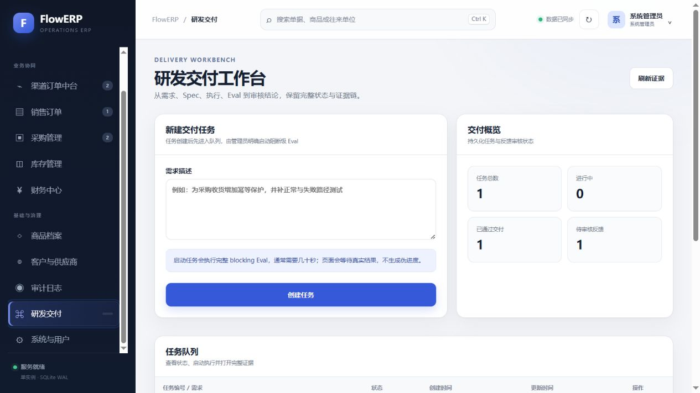
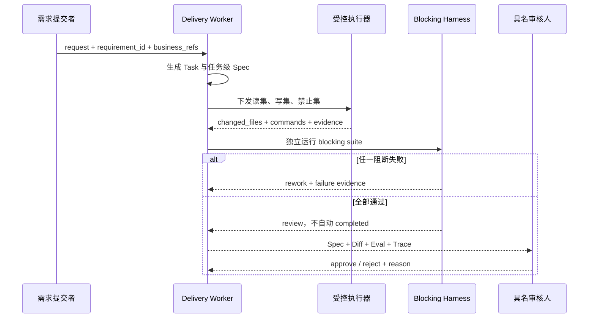
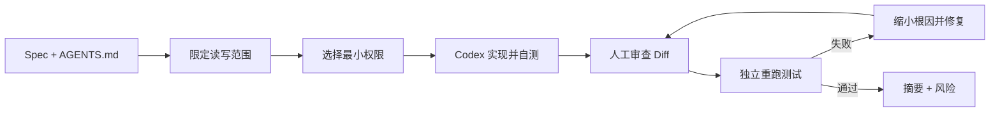
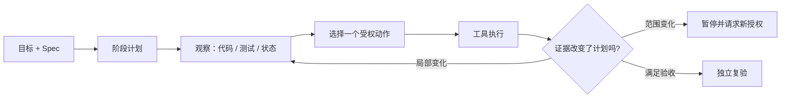
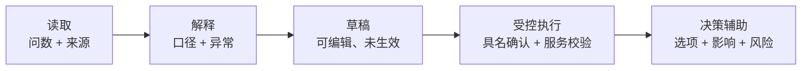
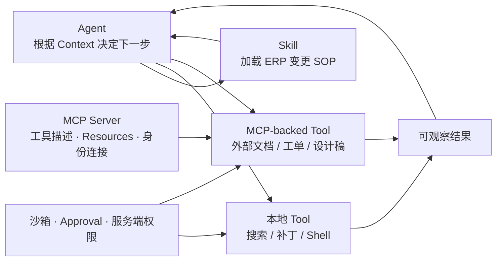
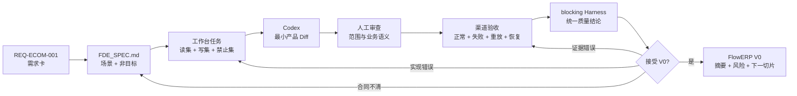
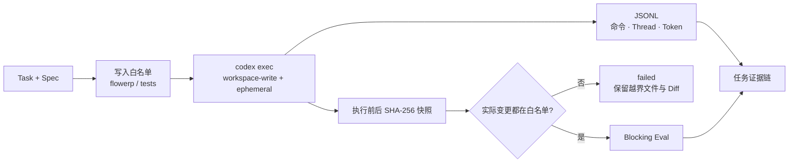

# L04｜委托 Codex 执行一次最小变更

- **核心内容**：非交互执行、工作目录、权限边界、结果采集与人工确认点。
- **演示结果**：读取第 3 讲 Spec，委托 Codex 完成一个小型代码变更并运行测试。
- **课内增量**：完成执行入口和结果摘要；仓库文件由 Codex 在授权工作区直接处理，不额外包装为文件读写 MCP。
- **通过标准**：变更能够运行；基础测试通过；摘要包含修改文件、验证命令和剩余风险；密钥和环境文件未提交。

> 课程建设状态说明：本讲执行入口、能力信封、活动和评价规则属于已经形成的课程设计；学生实际授权、AI 运行轨迹、Diff、独立复验和达成数据属于待真实开课采集。参考仓库已有实现或测试绿色不能冒充学生完成了受控委托。

## 国家级一流本科课程教学设计卡

| 维度 | 本讲设计 |
|---|---|
| 对应课程目标 | CLO-2：在明确权限和最小变更原则下完成可独立复验的实现 |
| 工作台主线增量 | 形成 Codex 非交互执行入口、工作目录/写集约束和结果摘要 |
| FlowERP 的作用 | 由 Workbench V0 实现库存导出首个产品增量，用真实 Diff 检验授权边界 |
| 高阶性 | 从 Spec 反推读写集、人工确认点和最小 Diff，并评价每个文件与验收项的因果关系 |
| 创新性 | 把 Codex 作为受约束执行者，结合能力信封、真实 Diff 和独立复验形成新型人机协作 |
| 挑战度 | 完成需求、控制变更半径、覆盖边界值和避免秘密入库必须同时满足 |
| 学生中心活动 | 学生先设计授权再委托执行，随后交换 Diff 审查并由非执行者重跑验证 |
| 课程思政融入 | 以最小权限、尊重授权和如实报告剩余风险训练安全意识与职业责任 |
| 形成性评价 | 能力信封 + 实际 Diff + 边界测试 + 独立复验 + 风险摘要 |
| 持续改进数据 | 统计越界修改率、无关改动率、边界漏测率和模型自述代替复验的比例 |

> **核心与迁移案例边界**：基础任务必须读取 L03 的导出 Spec，完成一个可运行的小型变更并生成摘要。正文中的低库存标记可作为同构迁移练习，但不能取代“消费上一讲 Spec”的依赖关系。

## 本讲知识合同

| 合同项 | 本讲约定 |
|---|---|
| 主线起点 | L03 已固定可验收合同，但合同尚未约束 Agent 的实际读写范围和执行预算 |
| 唯一技术命题 | 如何把一次代码生成限制为最小、可解释、可独立复验的授权变更 |
| 必须掌握 | 能力信封；读集/写集/禁止集；最小 Diff；边界值测试；人工 Diff 审查与独立复验 |
| 能力判据 | 能逐文件解释变更与验收项的因果关系，并机器阻断白名单外写入 |
| 本讲不做 | 不扩建通用 Agent 平台，不顺手重构，不让模型自述替代测试，不写运行数据库 |

## 大纲锚点与前沿校准（2026-08-19）

- **大纲锚点**：必须消费 L03 Spec，完成一个可运行小变更，并提交修改文件、验证命令和剩余风险摘要。
- **前沿采用**：采用显式工作目录、读/写/禁止集、最小权限与独立 Diff 复验；JSONL、输出 Schema 和显式 sandbox 属当前增强。
- **不越界**：不扩建通用 Agent 平台，不用 MCP 包装仓库基本文件操作，不把“工具调用成功”当业务验收。
- **链路交接**：把真实 Diff 及其风险交给 L05，用失败优先 Eval 检查现有测试的盲区。详见[校准矩阵](./16讲主线与前沿校准矩阵.md)。

**主线坐标**：围绕 FlowERP 演化的工作台已经形成可用基线，项目规则和本次合同也已落笔；现在让它第一次产生受约束的 ERP 产品 Diff。业务账仍不能被 Agent 直接改写。本讲只训练一件事：把模型的强生成能力压进可解释的读集、写集、禁止集和复验入口；交付暴露的问题会成为后续工作台继续演化的输入。

**这一讲把系统推进到哪里**：FlowERP 获得由 L03 合同约束的库存可用量导出；工作台获得真实 Codex Runner、写入白名单、超时和执行锁；实际修改文件、命令、退出码、用量与 Diff 共同证明“代码确实由受控执行产生”。低库存标记保留为同构迁移案例。真正的价值不是让 Agent 写得更多，而是让它只能在被授权的地方写，并让越界可被机器阻断。

## 本讲行动工单：把强生成能力压进可验证的能力信封

学员先从 L03 验收项推导读/写/禁止集和确认点，再让宽泛委托只生成计划、预测其越界；随后执行受控委托，主动请求一次白名单外修改并证明被阻断。实现完成后，执行者不得判自己成功，由同伴逐文件审查因果关系并重跑空集、特殊字符和写失败用例。

- **工作台增量**：能力信封、执行入口、写集控制、运行记录和独立复验；
- **FlowERP 产品状态**：通过 Workbench V0 实现并验收库存导出，覆盖正常、空集和写失败；不扩展无关采购、API 或 Web；
- **失败证据**：一次可解释的白名单外写入拒绝或无关 Diff 退回；
- **迁移证据**：在第二个小 Spec 上先设计授权，再比较写集差异；
- **讲师硬门槛**：隔离工作区、可恢复分支和非执行者复验席位缺一不可。

详见[可执行任务卡](../../course/tasks/L04-Codex最小变更.md)。

## 本讲教学设计总览

| 项目 | 设计 |
|---|---|
| 建议学时 | 30 分钟线上精讲 + 70 分钟线下行动 + 45 分钟最小变更复盘 |
| 课堂类型 | **外科手术**：在固定 Spec 和允许写集内完成一个可解释切片 |
| 核心问题 | 如何证明 Codex 改得足够少、权限足够窄、结果又足够完整？ |
| 教学重点 | 能力信封、写集、最小 Diff、边界测试、独立复验 |
| 教学难点 | 区分“少改代码”和“最小闭环”；识别顺手重构造成的因果污染 |
| 课堂产出 | 委托合同 + 真实 Diff + 独立复验记录 + 风险摘要 |
| 价值塑造 | 尊重授权边界，拒绝以效率为名扩大修改范围或掩盖不确定性 |

### 可测学习成果

| 编号 | 学习者能够 | 达成证据 | 达成标准 |
|---|---|---|---|
| L04-O1 | 从 Spec 导出允许写集、禁止写集和必要工具权限 | 能力信封 | 文件与动作边界均明确 |
| L04-O2 | 编写包含目标、范围、验证与停止条件的委托 | Prompt/Task 合同 | 陌生执行者无需猜测即可行动 |
| L04-O3 | 审查 Diff 是否存在越界重构、重复逻辑或共享错误公式 | Diff 审查表 | 五个审查问题都有文件级证据 |
| L04-O4 | 用边界测试和独立命令复验最小增量 | 复验记录 | 空集、稳定顺序、特殊字符和写入失败至少覆盖三类，退出码可查 |

### 30 分钟线上精讲 + 70 分钟线下行动

| 场域与时间 | 学习活动 | 学生当场证据 |
|---|---|---|
| 线上 0–8 分钟 | 比较最小 Diff 与顺手重构，学生先判哪份可签收 | AI 介入前变更半径判断 |
| 线上 8–20 分钟 | 从 L03 Spec 反推读集、写集、禁止集、工具和停止条件 | 能力信封草图 |
| 线上 20–30 分钟 | 示范六段式委托、MCP/Tool/Skill 边界与独立复验 | 委托合同和越界预测 |
| 线下 0–22 分钟 | 在受控工作区执行最小变更，记录权限、文件、命令和异常 | 真实 Diff、执行轨迹与失败证据 |
| 线下 22–38 分钟 | 为导出空集、稳定顺序、特殊字符和写入失败补先红后绿测试 | 红绿证据对 |
| 线下 38–55 分钟 | 非执行者重跑命令并用五问审查 Diff，越界版本必须退回 | 独立复验和审查意见 |
| 线下 55–70 分钟 | 完成 Week 1 Acceptance Record，说明结论、证据与剩余风险 | 第一周 Gate 与离场票 |

### 达成度与持续改进

采集写集命中率、越界文件数、边界用例覆盖率、独立复验一致率和学员实际 Diff 半径。若超过 10% 任务触碰禁止文件，下一轮先做纸面能力信封再开放写权限；若“测试通过但审查退回”超过 20%，增加共享错误公式与因果定位案例；独立复验一致率低于 90% 时，统一记录仓库版本、命令和环境。

## 基础课堂案例：受控实现 L03 导出 Spec

基础通过线必须消费 L03 已评审的库存可用量导出 Spec，只授权修改实现导出所需的最小领域文件和相应测试。验收至少覆盖字段与 `available` 口径、空集合法表头、稳定顺序、特殊字符以及写入失败不留半成品中的三类；不得顺手增加低库存提醒、自动补货、数据库迁移或 Web 改版。

学生先提交能力信封和六段式委托，再开放 `workspace-write`。执行者保留实际 Diff 与命令轨迹，非执行者按同一提交独立复验。低库存标记只能在基础 Gate 通过后作为同构迁移任务。

## 迁移提高案例：低库存标记

这一讲终于允许工作台写产品代码，但只给一把小刀：先为库存查询增加 `is_low_stock`，让运营能识别需要处理的库存风险；不碰订单状态机，不碰采购审批，不迁移数据库。它只是 `REQ-ECOM-001` 的第一个实现切片，不是电商 ERP 已经完成。为什么不直接让 Codex 修完全部缺货链路？因为第一轮必须先证明工作台能够接受合同、守住写集、生成可解释 Diff 并独立复验，然后才能继续领取渠道订单、异常和履约切片。

在真实研发交付页中，“创建任务”“受控执行”“运行评测”“进入审核”仍是不同的服务端状态，但产品入口已经收敛为一次提交：平台生成 Task 与 Spec 后由有界 Worker 自动推进，只有具名验收仍必须由人决定。手工 `prepare/start/evaluate` 接口只保留给课堂拆解、调试和恢复，不能继续要求普通用户点击多次。






课前把允许写集写在白板上：

```text
R = {AGENTS.md, FDE_SPEC.md, flowerp/service.py, relevant tests}
W = {flowerp/service.py, tests/test_flowerp.py}
Forbidden = {schema, deploy, runtime db, secrets, unrelated formatting}
```

Codex 完成后先不听总结，直接看事实：

```powershell
git status --short
git diff -- flowerp/service.py tests/test_flowerp.py
```

硬核点在边界：`available=5, reorder_point=5` 到底算不算低库存？一个等号决定页面报警、补货建议和测试口径。学员必须先在 Spec 中做决定，再让代码实现；不能让 SQL 表达式替产品经理决定。

主线订单仍未履约，但系统已经能在库存列表上准确暴露低量状态。下一集将故意破坏预占逻辑，检验我们的质量检查到底有没有牙齿。

## 为什么“能改很多”不是优势

当 Codex 能快速理解整个仓库时，最诱人的做法是顺手重构：改库存查询、抽象 Repository、升级前端、调整 Schema，再补几个测试。改动看起来更“完整”，但任何失败都难以定位，代码审查也无法区分需求变更与个人偏好。

本讲训练的是相反的能力：把授权压缩到足以完成目标的最小范围。目标不是追求最少代码行，而是让因果关系清楚——这几处修改为什么足够，这些测试为什么能证明边界，没有修改的部分为什么不受影响。

## 迁移提高任务合同

库存列表已有 `sku`、`name`、`on_hand`、`reserved`、`available` 和 `reorder_point`。课内任务增加布尔字段 `is_low_stock`，口径需要在 Spec 中明确。例如课程可采用：

```text
is_low_stock = available <= reorder_point
```

这里必须讨论等号。如果补货点是“达到该点就需要提醒”，等于时为低库存；如果产品口径是“低于才提醒”，应使用 `<`。函数名或页面文案不能替代业务决定，测试要锁定等于边界。

非目标：不改数据库 Schema；不增加外部依赖；不重写库存服务；不改变预占、入库或采购状态；不把该提示自动转换为采购审批。

## 这次不比代码量，只比变更半径是否可解释

完成本讲后，学员能够：

1. 写出包含输入、范围、禁止事项、验收和输出的委托合同；
2. 根据任务选择只读或工作区写入沙箱；
3. 使用 `codex exec` 的非交互模式获得可重复执行入口；
4. 审查 Diff 是否越界，而不是只看最终摘要；
5. 独立重跑测试，不以 Agent 自述代替证据；
6. 输出修改文件、验证命令和剩余风险三段式交付摘要。

## 最小变更闭环



每一步都有独立职责。Codex 自测用于快速反馈，人工 Diff 审查用于发现越界，独立复验用于排除摘要误报。三者并非重复劳动，而是不同信任边界。

### Execution Model：计划管航线，观察—行动管局部

委托合同决定“允许做什么”，Execution Model 决定“按什么节奏推进”。两种常见外部执行模式各有位置：

| 模式 | 适用任务 | FlowERP 示例 | 主要风险 |
|---|---|---|---|
| Plan-then-Execute | 距离较长、阶段边界清楚 | 调查 → 修改 → 测试 → 摘要 | 计划过早锁死，遇到新证据仍机械执行 |
| Observe-Decide-Act | 下一步强依赖工具结果 | 运行失败用例后再定位事务边界 | 漫无目的地试命令、变成无界探索 |
| 混合模式 | 有稳定航线，但局部需要反馈 | 用计划守住范围，在测试阶段按红灯调整 | 局部行动悄悄扩大原计划授权 |



课程只要求保存可审查的外部轨迹：读了哪些文件、执行了什么命令、Diff 是什么、测试如何变化、为什么暂停或升级；不把模型未公开的内部推理当成交付证据。对本讲的“低库存字段”任务，计划最多四步；每次工具结果只允许改变下一项局部动作，若发现必须修改持久化 Schema，就超出了原能力信封，应暂停而不是自行重写计划。

### Agent 接入 ERP 也必须逐级扩大授权



本讲只做 `is_low_stock`，属于读取和解释层；它没有获得创建采购单、审批或收货权限。今后即使生成补货草稿，也要保持 `proposed` 或 `draft`，由业务用户检查；真正执行时重新经过服务端身份、状态机和幂等检查。最小 Diff 与最小授权是同一原则：能力每升一级，必须同时增加失败用例、审计和人工接管，而不是因为模型在低风险查询上表现良好就一次开放全部 ERP 写权限。

## 写出高质量委托

推荐委托内容：

```text
读取根 AGENTS.md 与 FDE_SPEC.md。
只为库存列表增加 is_low_stock 字段，口径为 available <= reorder_point。
允许修改 flowerp/service.py 与相关测试；如认为必须修改其他文件，先说明原因。
不得修改数据库 Schema、订单/采购状态机、运行数据库、依赖和密钥文件。
补三类测试：高于补货点为 false、等于补货点为 true、低于补货点为 true。
运行相关测试，再运行完整 unittest。
最后输出：修改文件、验证命令与退出码、剩余风险。
```

好委托不需要指定每一行实现，但必须定义允许的写集。若任务只涉及 `ERPService.inventory` 和测试，出现 `deploy/`、`web/`、`schema_v2.py` 修改就是风险信号。

## MCP、Tools 与 Skills：连接、动作和方法不能混为一谈

当 Agent 真正开始工作，最常被混用的是三个词：MCP、Tool、Skill。它们对应三个不同工程问题：**怎么接进来、能做什么、怎样稳定地做。**



### Tool：一次有 Schema 的外部动作

Tool 是 Agent 作用于环境的最小动作接口。一个合格工具至少要明确：名字、用途、输入 Schema、输出 Schema、副作用、超时、幂等语义和所需权限。`run_tests(suite="blocking")`、`read_file(path=...)`、`query_inventory(sku=...)` 都是工具；“做完 ERP”不是工具，因为它没有有限参数、有限副作用和可判定返回。

对写工具做六项审计：

| 审计项 | `receive_purchase` 的要求 | 缺失后的风险 |
|---|---|---|
| 输入 | `po_id`、行项目、`receipt_key`、actor | 自然语言参数无法稳定校验 |
| 身份 | 服务端验证收货权限 | Agent 自报身份即可越权 |
| 前置状态 | 采购必须 `approved` | 未审批直接入库 |
| 原子性 | 状态、库存、流水同事务 | 半成功状态 |
| 幂等 | 同一 `receipt_key` 只生效一次 | 重试导致重复库存 |
| 返回证据 | 单号、版本、流水 ID、是否重放 | 无法审计和复验 |

本讲的最小变更只开放文件读取、补丁和测试工具。即使 Agent 能描述正确的补货方案，也不授予 `approve_purchase` 或生产数据库写入工具。

### MCP：连接协议，不是万能工具箱

MCP 负责让客户端发现并调用外部工具或读取外部上下文。对 FlowERP，它可以连接渠道文档、需求系统、设计稿或只读报表；本地文件工具并不因为没有 MCP 就“不专业”。协议解决互操作，不自动解决授权、业务正确性和数据新鲜度。

课程评审一个 MCP Server 时必须问：

1. 这是本地进程还是远程服务，失败和超时如何表现？
2. 暴露的是只读 Resource 还是有副作用 Tool？
3. 身份由谁签发，凭据是否只通过安全配置引用？
4. 是否设置工具 allowlist、写操作审批与最小 Scope？
5. 返回值是否带来源、对象 ID、版本或抓取时间？
6. 服务不可用时任务是降级、暂停还是失败，是否会伪造空结果？

```yaml
mcp_connection_review:
  server: channel-docs
  transport: streamable_http
  purpose: "读取平台订单字段与回传协议"
  enabled_tools: [search_docs, get_schema]
  forbidden_tools: [update_order, refund_order]
  auth_source: environment_reference
  timeout_seconds: 30
  failure_policy: stop_and_report
```

OpenAI 官方文档将 MCP 描述为连接模型与第三方工具、上下文的协议，并明确区分本地 STDIO 与远程 Streamable HTTP、认证、工具 allowlist/denylist 和审批模式。这些配置是连接控制，但 FlowERP 的采购、库存和订单服务仍需再次做服务端授权与状态校验。[OpenAI Docs：MCP](https://learn.chatgpt.com/docs/extend/mcp?surface=cli)

### Skill：可复用 SOP，不是新 Agent

Skill 把完成一类任务所需的说明、参考资料、模板和可选脚本封装起来。它适合保存“如何审查 ERP 状态机变更”“怎样制作发布证据包”这类可重复方法。触发 Skill 后，Agent 仍然是当前 Agent；Skill 也不会凭空获得工具或权限。

```text
erp-change-review/
├─ SKILL.md              # 触发条件、步骤、输入输出、停止点
├─ references/
│  └─ state-machines.md  # 领域参考
├─ scripts/
│  └─ collect-evidence.py
└─ assets/
   └─ review-template.md
```

好的 Skill 必须写清“何时用”和“何时不用”。例如 `erp-change-review` 可在库存、订单、采购服务发生变更时触发；纯文案修改不触发。Skill 中的脚本只能调用当前授权范围内的工具，不能把“课程 SOP”包装成绕过审批的后门。官方机制采用渐进加载：先提供名称和描述，选中后再读取完整 `SKILL.md`，这正好对应 Context Engineering 的按需装载。[OpenAI Docs：Skills](https://learn.chatgpt.com/docs/build-skills)

三者的验收口诀是：**Tool 看副作用，MCP 看连接与身份，Skill 看流程复用；三者都要服从权限和 Eval。**

## 使用非交互模式与最小权限

根据当前官方 OpenAI 文档，`codex exec` 用于脚本和 CI 等非交互场景；默认运行在只读沙箱，需要编辑时显式使用 `--sandbox workspace-write`。结构化下游消费可使用 `--json` 或 `--output-schema`；`danger-full-access` 只应在受控隔离环境使用。录课前请复核[非交互模式官方文档](https://learn.chatgpt.com/docs/non-interactive-mode)。

本讲命令：

```bash
codex exec --sandbox workspace-write --ephemeral "读取 AGENTS.md 与 L03 的导出 Spec；只实现库存可用量导出并补空集、稳定顺序和失败路径测试；运行相关测试；输出修改文件、验证命令、剩余风险"
```

`--ephemeral` 表示不持久化本次会话 rollout 文件，适合一次性练习；它不等于“改动不会写入工作区”。是否能写文件由沙箱决定。若仅让 Codex阅读仓库并提出方案，不应给 `workspace-write`。

机器需要消费结果时，可以设计 JSON Schema，要求最终输出固定字段：

```json
{
  "type": "object",
  "properties": {
    "changed_files": {"type": "array", "items": {"type": "string"}},
    "verification": {"type": "array", "items": {"type": "string"}},
    "remaining_risks": {"type": "array", "items": {"type": "string"}}
  },
  "required": ["changed_files", "verification", "remaining_risks"],
  "additionalProperties": false
}
```

自然语言摘要适合人读，Schema 适合流水线消费。不要用脆弱的正则从自由文本中猜退出码。

## 代码层面的最小实现选择

本任务有三种常见实现：在 SQL 查询中计算布尔值；查询后在 Python 中添加；在数据库新增持久化字段。第三种明显过重，因为 `is_low_stock` 是由 `available` 和 `reorder_point` 派生，不应制造可漂移的冗余状态。

在 SQLite 中可以使用表达式：

```sql
SELECT p.sku,
       p.name,
       s.on_hand,
       s.reserved,
       s.on_hand - s.reserved AS available,
       p.reorder_point,
       (s.on_hand - s.reserved <= p.reorder_point) AS is_low_stock
FROM products p
JOIN stock s USING(sku)
ORDER BY p.sku;
```

SQLite 返回的布尔表达式通常是 0/1。如果 API 合同要求 JSON `true/false`，服务层应显式转换，避免前端依赖数据库特性。课程可以选择在 Python 中做：

```python
items = self.store.rows("...")
for item in items:
    item["is_low_stock"] = item["available"] <= item["reorder_point"]
return items
```

两种都能完成目标，取舍看现有代码风格和 API 合同。最小变更不等于机械追求一行 SQL，而是避免新增不必要状态和跨层改动。

## 测试设计：边界比正常值更值钱

至少覆盖：

| available | reorder_point | 预期 | 证明什么 |
|---:|---:|---|---|
| 6 | 5 | false | 高于阈值不报警 |
| 5 | 5 | true | 等于边界口径被锁定 |
| 4 | 5 | true | 低于阈值报警 |

若只测 4 和 5，很可能 `<` 与 `<=` 都能让一条用例通过；等于边界才能证明业务口径。还要考虑 `reserved`：on_hand 10、reserved 6、reorder_point 5 时，available 是 4，应为低库存。若实现误用 on_hand，会得到错误结果。

## 人工审查 Diff 的五个问题

执行：

```powershell
git status --short
git diff -- flowerp tests
```

逐项问：

1. 修改文件是否都在授权写集？
2. 代码是否引入第二份库存口径？
3. 等于补货点的边界是否有明确测试？
4. 是否出现依赖升级、Schema 迁移或无关格式化？
5. 工作区是否出现 `.env`、`.db`、报告或会话产物？

如果发现无关重构，不要因为“看起来更优雅”就默认接受。先把它从本次变更剥离，另开 Spec 和验收。小 Diff 的价值是降低审查认知负担和回滚半径。

## 独立复验

先运行相关测试，再运行完整测试：

```bash
python -X utf8 -m unittest tests.test_flowerp -v
python -X utf8 -m unittest discover -s tests -v
python -X utf8 -m eval.harness --suite blocking
```

如果 Codex 摘要声称“全部通过”，而你没有在自己的终端执行，就只有自述，没有独立证据。记录命令、结束时间和退出码。不要只截取最后一行绿色；失败时保留首个相关错误和完整日志位置。

## 失败实验：故意扩大范围

在不实际采纳改动的前提下，让 Codex评估以下请求：

```text
顺便把库存模块重构成 Repository，引入 ORM，修改数据库字段，
并把前端列表一起重做，这样更专业。
```

要求学员指出为什么退回：需求没有授权新依赖；Schema 迁移增加数据风险；前端不在验收范围；多个变化混在一起无法判断低库存标记的因果。正确处理是把这些建议记录为候选技术债，分别建立 Spec，而不是在当前 Diff 偷渡。

第二个失败实验是只测试 `available=4`，然后让实现使用 `<`。测试会绿，但等于边界仍错。这证明“测试通过”必须结合测试设计质量，绿灯不天然可信。

## 成本与风险模型

可以用一个简单公式评估变更：

```text
变更风险 ≈ 影响文件数 × 业务关键度 × 不可逆程度 × 验证盲区
```

这不是精确数学，而是审查提示。低库存派生字段业务关键度中等、可逆，但若触及 Schema、库存事务和 Web，影响文件数与验证盲区会扩大。最小变更通过减少乘数中的多个项来降风险。

## 交付摘要模板

```markdown
## 修改文件
- flowerp/service.py：库存列表返回 is_low_stock 派生字段。
- tests/test_flowerp.py：覆盖高于、等于、低于补货点及 reserved 影响。

## 验证命令
- python -X utf8 -m unittest tests.test_flowerp -v → exit 0
- python -X utf8 -m unittest discover -s tests -v → exit 0
- python -X utf8 -m eval.harness --suite blocking → exit 0

## 剩余风险
- 当前口径按单仓课程模型计算；多仓聚合需要单独 Spec。
- is_low_stock 是提示，不自动创建或批准采购。
```

剩余风险不是给交付找借口，而是防止范围被误解。尤其要声明“提示不等于审批”，否则下游可能把一个派生字段当成自动采购授权。

## 第一周集成验收：工作台交付第一个电商 ERP V0

`is_low_stock` 只证明工作台能安全交付一个产品切片，不能代表 `REQ-ECOM-001` 已完成。第一周结束时，要把后续切片按同样方法接进工作台，最终对渠道订单闭环做一次集成验收。验收不是现场点几下页面，而是依次穿过四道门：

| 质量门 | 必答问题 | 不通过时回到哪里 |
|---|---|---|
| 合同门 | 目标、非目标、身份、状态和失败后不变状态是否唯一 | L03 需求评审与 Spec |
| 变更门 | Diff 是否只修改授权文件，是否偷渡 Schema、依赖或规则 | 本讲的能力信封与任务拆分 |
| 业务门 | 正常、阻断、缺货、重放、冲突、恢复路径是否符合合同 | 对应的最小实现任务 |
| 证据门 | 命令、退出码、权威状态和风险是否可追溯 | Eval、Harness 或环境基线 |



先跑与本需求最贴近的渠道场景，再跑全仓单元测试和唯一阻断入口：

```bash
python -X utf8 -m unittest tests.test_channels -v
python -X utf8 -m unittest discover -s tests -v
python -X utf8 -m eval.harness --suite blocking
```

第一条证明电商订单切片的业务行为，第二条发现跨模块回归，第三条给 Hook、CI、Loop 和 Graph 提供同一个可消费结论。三条都退出 0 也不等于“完整 ERP 已完成”；它只表示 `REQ-ECOM-001` 当前约定的 V0 可以接受。

第一周最终交付一份可追溯记录，而不是一句“测试通过”：

```markdown
# Week 1 Acceptance Record

- requirement_id: REQ-ECOM-001
- baseline_commit:
- spec_version:
- workbench_health: pass / fail
- decision: accept / conditional / reject

| AC | 场景 | 测试或命令 | 权威状态证据 | 结果 |
|---|---|---|---|---|
| AC-CH-01 | 正常导入、预占、发货回传 | tests.test_channels... | channel_order / sales_order / callback | |
| AC-CH-04 | 无效数据阻断 | tests.test_channels... | blockers / sales_document_id | |
| AC-CH-05 | 20 对 8 缺货 | tests.test_channels... | exception / shortage=12 / stock unchanged | |
| AC-CH-02/03 | 相同重放与冲突重放 | tests.test_channels... | replay_count / original snapshot | |
| AC-CH-06 | 修复后恢复 | tests.test_channels... | same channel_order_id / imported | |

## 修改文件

## 执行命令、时间与退出码

## 被拒绝的越界改动

## 未决问题、负责人和期限

## 剩余风险与下一切片
```

这份记录把 PPT 中“读仓库—写规则—生成 Spec—完成变更”的承诺，落实为可检查的课程产物：仓库由已完成的工作台读取；规则成为 FlowERP 的项目宪法；短期需求成为 Spec；Codex 只做受控 Diff；最终由独立验收决定接受、退回需求还是退回实现。

## 第一周结束，读者已经能做一次三分钟交付演示

不需要等到结业才看到成果。第一周的演示只做四个动作：提交 `REQ-ECOM-001`；展开工作台生成的 Spec 和允许写集；查看 Codex 产生的真实 Diff；用 20/8/12 场景证明错误请求被完整阻断。最后展示 Week 1 Acceptance Record，而不是让模型做一段成功总结。

这三分钟同时回答老板、Reviewer 和业务方最关心的三个问题：做的是不是同一件事，Agent 有没有超范围，结果为什么可以相信。即使读者暂时不继续搭 Loop、Graph 和 API，第一周形成的需求合同、执行协议与验收记录也能直接进入下一次真实开发任务。这是课程设置早期回报点的原因。

<details>
<summary>讲师用：验收、练习与评分</summary>

## 本讲验收、作业与下一讲

### 验收

- [ ] 委托包含输入、范围、禁止事项、验收和输出；
- [ ] 写权限与任务匹配，没有使用不必要的广泛权限；
- [ ] 修改文件都在预期范围，没有无关重构；
- [ ] 高于、等于、低于补货点以及 reserved 影响有测试；
- [ ] 学员独立执行完整测试与 blocking Harness；
- [ ] 摘要列出文件、命令、退出码与剩余风险；
- [ ] 工作区无密钥、运行数据库和报告产物被纳入提交。

### 作业

在自己的项目中选择一个“不需要 Schema 迁移”的派生字段或校验，完成最小 Diff。提交前后 `git diff --stat`、相关测试、完整验证和风险摘要。若修改超过三个业务模块，必须解释为什么无法继续拆分。

### 评分量规

| 项目 | 分值 | 合格表现 |
|---|---:|---|
| 范围与因果控制 | 30 | 写集清楚，无偷渡重构，Diff 半径可解释 |
| 权限与执行记录 | 20 | 只给任务所需沙箱，实际工具和写入均可追溯 |
| 边界测试 | 20 | 等于阈值、相邻值与派生口径被证明 |
| 独立复验 | 20 | 非作者按记录复验，命令和退出码真实可查 |
| 风险摘要 | 10 | 说明未覆盖边界、影响与下一项最小验证 |

下一讲会改变视角：不再从“怎样实现”出发，而是先故意制造缺陷，证明 Eval 真能把它抓出来。最小 Diff 让我们能够清楚地把红灯与某个业务规则建立因果关系。


</details>
## 讲师加餐：把一次 Agent 运行当成可审查的工程实验

建议记录任务开始前的 commit、工作区状态、委托文本、沙箱、实际修改文件、执行命令和结束状态。这样当两名学员得到不同 Diff 时，可以比较差异来自仓库版本、规则、Prompt 还是模型执行，而不是笼统归因于“AI 不稳定”。

课堂上可让一组只给“增加低库存字段”，另一组使用完整五段委托。比较无关改动、边界测试、复验次数和摘要质量。重点不是证明某种 Prompt 永远更好，而是观察清晰合同怎样降低返工。若完整委托仍出现越界，继续收紧写集或先做只读方案评审，而不是盲目增加更多形容词。

## 一份漂亮 Diff，可能只是在迎合现有测试

### 能力信封：把 Prompt 之外的授权做成机器边界

高质量委托不能只靠一句“请勿修改其他文件”。把一次 Agent 运行视为能力信封，至少包含：

```json
{
  "read_roots": ["flowerp", "tests", "FDE_SPEC.md"],
  "write_allowlist": ["flowerp/service.py", "tests/test_flowerp.py"],
  "commands": ["python -X utf8 -m unittest tests.test_flowerp -v"],
  "network": "deny",
  "time_budget_seconds": 900,
  "evidence_required": ["diff", "exit_code", "test_output"],
  "approval_on_expand": true
}
```

现在这份能力信封已经进入工作台代码，不再只是设计目标。任务表持久化 `execution_mode`、`write_scope` 和 `execution_timeout_seconds`；`CodexExecutionRunner` 使用 `workspace-write` 沙箱、一次性会话和结构化输出 Schema。Prompt 负责表达意图，沙箱限制总体权限，工作台再对执行前后文件做 SHA-256 快照：Agent 即使漏报或错报，`changed_files` 与 Diff 仍由平台独立得出。发现白名单外文件变化时，执行阶段直接失败，Blocking Eval 不会开始。



课堂操作不再直接手写一条无法追踪的 Agent 命令，而是提交同一个交付任务：

```bash
python -X utf8 -m workbench.cli task-submit \
  --request "为补货建议增加边界测试并修复实现" \
  --requirement-id REQ-REPLENISH-004 \
  --execute-code \
  --write-scope flowerp \
  --write-scope tests \
  --execution-timeout 900 \
  --timeout 1200
```

最终审核看的不是“Codex 说做完了”，而是平台保存的真实变更文件、统一 Diff、命令与退出码、Token 用量、独立 Eval 和剩余风险。未来模型更强时，这份信封仍然有效，因为它控制的是能力和证据，不依赖模型自律。

候选实现改动很小，单元测试全绿，人工审查也没有看到明显异味。但如果测试和实现共享同一个错误口径，绿灯只说明二者彼此同意。下一讲不继续庆祝成功，而是先植入三个已知缺陷：部分预占、重复入库、越权收货。只有 Eval 能稳定让错误版本变红、让正确版本恢复绿色，我们才有资格把“通过”当作证据。
