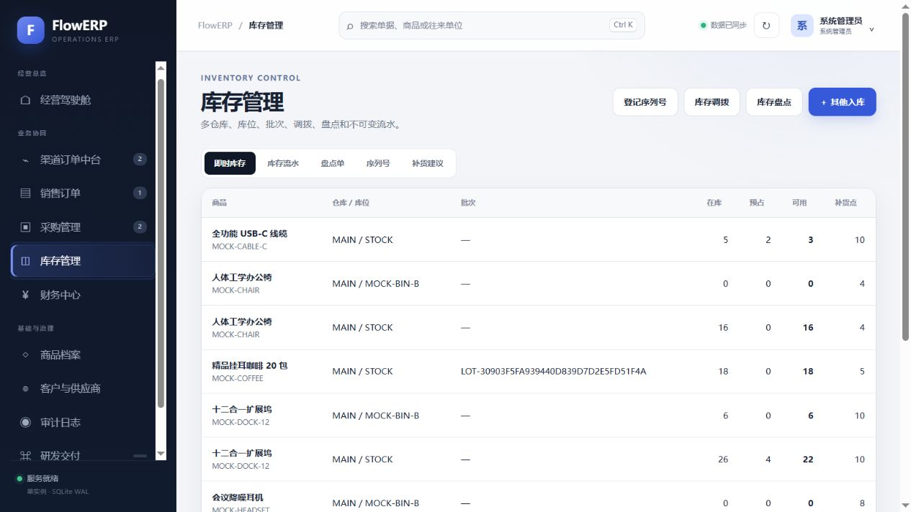
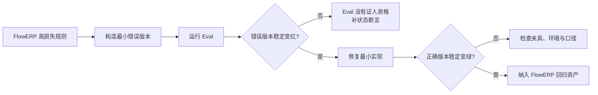
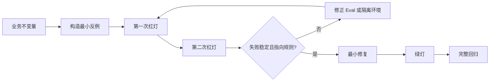
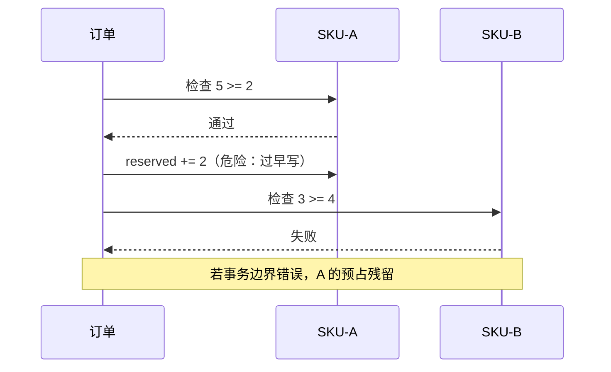

# L05｜先设计失败，再编写 Eval

- **核心内容**：示例测试与 Eval 的区别；逻辑错误、边界缺失、规范违规和危险修改四类失败模式。
- **演示结果**：一个故意带缺陷的基线稳定触发失败。
- **课内增量**：编写一个业务结果 Eval 和一个工程约束 Eval。
- **通过标准**：缺陷基线连续运行两次均失败；失败信息能够定位到具体要求。

> 课程建设状态说明：本讲缺陷夹具、Eval 入口、活动和评价规则属于已经形成的课程设计；学生风险排序、两次稳定红灯、修订过程和达成数据属于待真实开课采集。不得只展示参考仓库修复后的绿色结果来替代失败优先学习证据。

## 国家级一流本科课程教学设计卡

| 维度 | 本讲设计 |
|---|---|
| 对应课程目标 | CLO-3：针对真实业务损失设计稳定、可定位的反例 Eval |
| 工作台主线增量 | 新增业务结果 Eval 与工程约束 Eval，建立先红后绿证据协议 |
| FlowERP 的作用 | 以重复入库高损失缺陷推动失败优先 Eval，并交付幂等入库 |
| 高阶性 | 从损失和不变量反推错误实现、输入、权威状态与失败后不变状态，评价 Eval 是否有证人资格 |
| 创新性 | 先红后绿并保留失败签名，用对抗实验评价评测本身，而不是迷信现有测试 |
| 挑战度 | 同一缺陷须稳定失败两次，修复后用同一命令转绿；放宽断言或删除证据直接退回 |
| 学生中心活动 | 学生设计反例、预测状态、运行失败、交换断言审查，再完成最小修复和复验 |
| 课程思政融入 | 正视失败、保留不利证据、不为交付期限降低标准，形成求真与质量责任意识 |
| 形成性评价 | 风险—反例表 + 两次红灯 + 失败签名 + 修复 Diff + 同命令绿灯 |
| 持续改进数据 | 统计只断言异常不检查状态的比例、反例稳定率和错误归因率，更新缺陷样本 |

## 本讲知识合同

| 合同项 | 本讲约定 |
|---|---|
| 主线起点 | L04 的 Diff 和现有测试都可能共享同一个错误业务假设 |
| 唯一技术命题 | 如何用真实反例证明一个 Eval 具备发现目标缺陷的能力 |
| 必须掌握 | 失败优先顺序；Test/Eval 边界；原子性、幂等和审批反例；稳定失败签名；可操作失败信息 |
| 能力判据 | 同一 Eval 在错误实现上稳定红两次、修复后绿，并检查失败后业务状态没有被污染 |
| 本讲不做 | 不汇总多个 Eval，不设计放行等级，不以修复后绿色反推 Eval 有效 |

## 大纲锚点与前沿校准（2026-08-19）

- **大纲锚点**：一个业务结果 Eval、一个工程约束 Eval，必须在缺陷基线上连续两次稳定失败并定位具体要求。
- **前沿采用**：确定性业务不变量坚持代码断言和先红后绿；Trace grading 只作为工具使用、移交等非确定性轨迹的增强评价。
- **不越界**：不让模型 grader 裁决库存、幂等和审批，不在本讲汇总等级或触发自动修复。
- **链路交接**：把有身份、有失败签名的单项 Eval 交给 L06 统一聚合。详见[校准矩阵](./16讲主线与前沿校准矩阵.md)。

**主线坐标**：Codex 已产生第一个受控 Diff，但“测试通过”还不能证明它能抓住真正的超卖事故。工程账因此新增反例与红灯；业务账仍以原子预占、审批和幂等作为不可交换的风险单位。

**这一讲把系统推进到哪里**：FlowERP 的“多行订单不得部分成功”从口头原则变成可执行反例；工作台获得“允许候选失败、但不能不知道为什么失败”的判断能力；同一用例在缺陷版本变红、修复版本变绿是核心证据。读者由此学会检验评测本身，而不是迷信一串绿色勾号。

## 本讲行动工单：先证明裁判会抓错，再允许修产品

学员从业务损失反推错误实现、输入和失败后不变状态，制作隔离缺陷夹具；同一 Eval 必须在错误版本连续两次得到稳定失败签名。随后冻结 Eval，只做最小修复并用原命令转绿；同伴再尝试通过删除断言、改 expected 或换输入“攻击”裁判，学员必须识别并拒绝。

- **工作台增量**：失败优先协议、业务/工程 Eval、稳定签名和红绿证据保留；
- **FlowERP 产品状态**：围绕重复入库缺陷建立两次稳定红灯，冻结 Eval 后交付幂等入库，重复键只能生效一次；
- **失败证据**：两次稳定红灯和失败后权威状态，绿灯不能覆盖红灯；
- **迁移证据**：为第二条规则先写损失—反例—不变状态，再写 Eval；
- **讲师硬门槛**：错误版本必须隔离且可恢复，不能让学员在正式数据库制造事故。

详见[可执行任务卡](../../course/tasks/L05-失败优先Eval.md)。

## 本讲教学设计总览

| 项目 | 设计 |
|---|---|
| 建议学时 | 30 分钟线上精讲 + 70 分钟线下行动 + 45 分钟反例设计作业 |
| 课堂类型 | **对抗实验**：先评价三个错误实现，再允许查看正确实现 |
| 核心问题 | 一个检查怎样证明自己真的能抓住业务缺陷，而不是只会在正确代码上变绿？ |
| 教学重点 | 先红后绿、最小反例、权威状态断言、失败后不变式 |
| 教学难点 | 识别测试与实现共享错误公式的共同失效 |
| 课堂产出 | Failure-first Record + 一项新增或强化的 Blocking Eval |
| 价值塑造 | 尊重失败事实，不删除红灯、不降低门禁来迎合交付期限 |

### 可测学习成果

| 编号 | 学习者能够 | 达成证据 | 达成标准 |
|---|---|---|---|
| L05-O1 | 从业务损失反推最小错误实现和反例 | 风险—反例表 | 三类高风险错误均有可执行反例 |
| L05-O2 | 区分 Test、Eval 与 Eval Harness 的职责 | 分类题 | 6 个对象至少 5 个归属正确 |
| L05-O3 | 编写同时观察结果、权威状态和不变式的断言 | Eval Diff | 缺陷版本稳定红，正确版本稳定绿 |
| L05-O4 | 保留可复现的红绿证据并解释失败签名 | Failure-first Record | 命令、版本、退出码、失败信息完整 |

### 30 分钟线上精讲 + 70 分钟线下行动

| 场域与时间 | 学习活动 | 学生当场证据 |
|---|---|---|
| 线上 0–8 分钟 | 展示三份都会报错的错误实现，学生先排序业务风险 | AI 介入前风险排序 |
| 线上 8–20 分钟 | 讲解 Test、Eval、Harness 边界和失败优先证据顺序 | 职责卡与反例草图 |
| 线上 20–30 分钟 | 深读 `stock_never_negative` 的观察面、权威状态与清理边界 | Eval 解剖图和失败预测 |
| 线下 0–20 分钟 | 在隔离夹具注入多行订单缺陷，连续两次运行并保存稳定红灯 | 两次红灯与失败签名 |
| 线下 20–38 分钟 | 完成正常、失败、不变状态三联断言并实施最小修复 | Eval Diff 与状态证据 |
| 线下 38–55 分钟 | 用同一命令复验转绿，交换 Eval 以最小错误实现进行对抗 | 红绿证据对和反证意见 |
| 线下 55–70 分钟 | 修订 Eval，完成 Failure-first Record 和离场票 | L05-O1–O4 达成证据 |

### 达成度与持续改进

采集缺陷检出率、红灯稳定复现率、不变式断言覆盖率、假阳性率和临时数据清理成功率。缺陷检出率低于 90% 时，下一轮增加错误实现库；超过 15% 用例只断言异常文本，则强制加入状态快照；红灯不稳定超过 5% 时先治理隔离与时间依赖，不进入自动门禁。


这一集不加功能，反而主动拆掉一块安全护栏：在临时分支移除 `reserve_order` 的全部行预检查。然后构造两行订单——A 库存足，B 库存不足——观察 A 是否先被预占。单行缺货只能验证“会不会报错”，多行缺货才能验证“会不会半成功”。

库存页面把在库、预占、可用、批次与补货点放在一起，适合发现异常；但 Eval 必须越过页面聚合，直接断言订单状态、每个 SKU 的 `reserved` 和库存事件数量。UI 测试证明“用户看见什么”，领域 Eval 证明“账本事实上是什么”。




库存页回答“运营此刻看见什么”，Eval 表回答“候选实现是否守住账本”。例如 `stock_never_negative` 与 `sales_credit_and_atomic_reservation` 必须同时出现，前者守可用量，后者守多行订单的整单回滚；只截一张绿色汇总图不能替代逐项证据。

事故判定不是看到 `InsufficientStock` 就结束，而是查三处：

```text
sales_orders.status 仍为 draft
stock.reserved 对所有 SKU 都未变化
inventory_events 没有留下 reserve:* 半条流水
```

同一缺陷连续跑两次 blocking Harness。两次都红、失败签名和关键状态一致，才说明它适合自动化；一次是断言、一次是文件锁，先修环境，不要把噪声交给 Loop。恢复正确实现后再绿。L05 留下的不是一张绿色截图，而是一对能互相证明的红/绿证据。

## 质量能力是被三类 ERP 假成功逼出来的

FlowERP 最危险的错误通常不是崩溃，而是返回成功、页面也正常，却把账写错。第一批 Eval 不从“测试覆盖率还不够”出发，而从三个可能造成真实损失的假成功出发：

| 错误实现 | 表面看起来 | 实际破坏 | 必须观察的反证 |
|---|---|---|---|
| 逐行预占，第二行不足才报错 | 接口返回库存不足 | 第一行已经残留预占，订单半成功 | 异常后所有行的 `reserved` 与订单状态保持原值 |
| 每次重试都执行入库 | 两次请求都返回 200 | 同一批货被记入两次，库存虚增 | 相同 `receipt_key` 重放 N 次与执行一次结果相同 |
| 先收货、后检查审批 | 最终也抛出审批异常 | 库存已经增加，异常只遮住副作用 | 未审批时库存流水和 `on_hand` 均不变化 |



这里形成工作台的第二次关键演化：L04 只能约束 Agent“改哪里”，L05 开始约束“什么行为绝不能被改出来”。前者是能力边界，后者是业务判据。没有红色样本，工作台只有执行能力；能用错误版本证明检查有辨识力，才开始拥有质量能力。

## 为什么修复后才写测试，证据是不完整的

假设库存预占代码已经“修好”，我们补了一条测试并看到绿色。这个结果只能说明测试与当前实现一致，不能证明测试真的能发现超卖。它可能没有走到危险分支，可能断言了错误字段，也可能在缺陷版本上同样通过。

失败优先的顺序是：定义不变量；构造最小缺陷或回到缺陷提交；连续两次运行同一 Eval 并稳定失败；确认失败信息指向业务规则；修复代码；再次运行变绿；最后跑完整回归。只有经历过红灯的检查，才证明自己有检出能力。

本讲继续使用 20 台订单与 8 台库存。我们故意破坏“先检查全部行，再写入全部行”的顺序，使多行订单可能发生部分预占。目标不是训练大家制造 bug，而是训练对质量门本身做验收。

## Test、Eval 与 Eval Harness 的职责

| 对象 | 回答的问题 | 典型粒度 | 本仓库例子 |
|---|---|---|---|
| 单元/集成测试 | 某个实现或业务行为是否符合预期 | 函数、事务、HTTP | `tests/` |
| Eval | 交付是否满足一条关键质量要求 | 业务不变量、工程风险 | `eval/cases.py` |
| Eval Harness | 如何统一发现、分级、执行和汇总质量结论 | 整个交付门 | `eval/harness.py` |

这里的 Eval Harness 是广义 Agent Harness 中的质量组件。广义外壳还包含上下文、工具、状态、权限与可观测性；第 6 讲会直接拆开两种含义，并说明为什么 Loop 与 Graph 都不能取代质量裁判。

Eval 可以调用真实服务和临时数据库，也可以检查仓库资产。它不是模型给自己打分，更不是测试的时髦别名。课程中的 Eval 选取“值得决定交付是否放行”的规则：库存非负、幂等入库、取消释放、非法迁移、采购审批、秘密扫描等。

## 失败优先闭环



为什么要求两次红灯？一次失败可能来自文件锁、网络、随机数据或残留状态。连续两次相同失败签名能初步排除偶发噪声。若两次原因不同，应先修复环境或测试隔离，不能把不稳定结果交给自动修复 Loop。

## Eval 设计的四类失败

### 4.1 业务规则失败

例如缺货仍预占成功、取消后 reserved 未释放、未审批采购已入库。这类通常直接阻断交付。

### 4.2 工程安全失败

例如仓库出现疑似密钥、备份不可恢复、任务可以跳过状态机。这类不一定来自 ERP 页面，却决定系统能否安全交付。

### 4.3 环境失败

例如 Python 版本不支持、Windows 文件锁、Docker 不可用。环境失败不能伪装成业务失败；报告需要记录平台、命令和异常，让责任边界清楚。

### 4.4 观察性失败

例如课程资产缺失、体验提示或维护性警告。它们值得记录，但不一定阻断本次业务交付。下一讲会正式分级。

## 深读 `stock_never_negative`

核心 Eval 在临时目录创建数据库，添加 SKU-A，入库 5，创建需求 6 的订单，然后调用 `reserve_order`：

```python
def stock_never_negative() -> str:
    tmp, service = _service()
    try:
        service.receive_stock("SKU-A", 5, "open")
        order = service.create_order("客户", [OrderLine("SKU-A", 6, 1000)], "SO-EVAL-NEG")
        try:
            service.reserve_order(order["id"])
        except InsufficientStock:
            pass
        else:
            raise AssertionError("库存不足仍然预占成功")
        stock = service.product("SKU-A")
        assert stock["available"] == 5 and stock["reserved"] == 0
        return "缺货请求被拒绝，库存未发生部分写入"
    finally:
        tmp.cleanup()
```

这条 Eval 有四个值得复用的设计：使用临时数据库隔离；检查明确异常；检查失败后的权威状态；无论成功失败都清理临时资源。仅断言抛异常不够，因为代码可能先写入再抛异常。`available==5` 与 `reserved==0` 才证明没有部分副作用。

## 多行订单为什么更能暴露原子性缺陷

单行订单需求 6、库存 5，只要在更新前做一个检查就能通过。真正危险的是多行：SKU-A 需求 2、可用 5；SKU-B 需求 4、可用 3。如果实现对每行“检查后立即写入”，A 会先预占 2，B 再失败。即使事务异常能整体回滚，也需要验证连接上下文和异常传播确实触发回滚；若每行使用不同事务，就会留下部分成功。



更强的 Eval 应在失败后检查所有相关 SKU、订单状态和库存事件，证明系统没有留下“幽灵预占”。

## 课内缺陷实验

只在临时分支或工作副本操作，先记录当前提交：

```powershell
git status --short
git rev-parse --short HEAD
```

故意将 `reserve_order` 改成逐行检查并写入，或临时移除预检查。不要删除数据库事务保护以外的无关逻辑。然后连续运行：

```bash
python -X utf8 -m eval.harness --suite blocking
python -X utf8 -m eval.harness --suite blocking
```

保存两次 `.runtime/reports/harness-blocking.json` 的副本到课程证据包，而不是提交到仓库。记录 `stock_never_negative` 的 `passed=false`、`evidence` 和退出码 1。若 Eval 没有失败，先不要修业务代码；这说明反例不够强或 Eval 没覆盖缺陷。

恢复正确实现后再运行两次：相关 Eval 应绿，完整 blocking 也应绿。禁止通过删除 Eval、把 blocking 改成 observing、降低断言或直接修改报告文件制造通过。

## 稳定失败的判定标准

两次失败至少比较：失败用例名称、异常类型、业务消息、受影响 SKU 和初始数据。可以定义失败签名：

```text
signature = sort(name for each failed blocking eval)
```

若签名相同但证据不同，例如一次是 `InsufficientStock`，一次是数据库锁，仍不能认为稳定。进入自动修复前，还应比较关键证据或根因类别。L10 的 Loop 当前以阻断用例名作为简化签名，它适合课程最小基线，但生产系统可扩展为错误类别、堆栈摘要和相关文件哈希。

## 工程 Eval：秘密扫描

`no_committed_secrets` 遍历文本源文件，查找常见特征并忽略 `.git`、`.tmp`、`.runtime` 和缓存目录。这是最小安全护栏，不是完整秘密扫描产品。它证明了 Eval 不只检查业务函数，也检查交付资产。

失败实验可以在 `.tmp` 外的受控测试夹具中放一个明显的假特征，再确认扫描报警；实验后立即删除夹具。绝不能使用真实 API key。还要理解局限：特征扫描会漏掉未知格式、编码内容和历史提交中的秘密，生产环境需要专业扫描、密钥轮换和最小权限。

## 好的失败信息长什么样

| 差的证据 | 问题 | 更好的证据 |
|---|---|---|
| “assertion failed” | 不知道哪个业务对象 | `SKU-A required=6 available=5 shortage=1` |
| “库存错误” | 不知道副作用 | `reserved expected=0 actual=2` |
| 完整千行日志 | 噪声淹没决策 | 用例名、异常、关键状态、复现命令 |
| “偶尔失败” | 不可自动修复 | 两次签名、平台、时间、隔离信息 |

Eval 的 evidence 最终会进入 Harness 报告、Repair Task、Hook 尾部和 Graph Trace。越接近源头把证据写清楚，后续上下文越小，修复决策越可靠。

## 正常、失败与不变式的三联断言

高价值用例往往同时断言：返回或异常；目标状态；不应变化的旁路状态。例如采购审批：未审批收货抛 `ApprovalRequired`；采购状态仍为 proposed；库存 on_hand 不变；没有 receive 事件。审批后再收货：状态变 received；on_hand 增加；事件键存在；同键重放 on_hand 不再变化。

这比只测试一个返回值更接近业务。ERP 的错误通常不是“函数没返回”，而是几个子账之间悄悄不一致。

## 本讲证据模板

```markdown
# Failure-first Record

- 规则：库存不足不得部分预占
- 缺陷变更：移除全部行预检查（临时分支）
- 复现命令：python -X utf8 -m eval.harness --suite blocking
- 红灯 1：时间、退出码、失败签名、关键 evidence
- 红灯 2：时间、退出码、失败签名、关键 evidence
- 根因：
- 最小修复：
- 绿灯：时间、退出码、报告摘要
- 完整回归：
- 剩余盲区：并发、跨进程、数据库差异等
```

<details>
<summary>讲师用：验收、练习与评分</summary>

## 验收、作业与下一讲

### 本讲验收

- [ ] 缺陷在隔离环境中连续两次稳定失败；
- [ ] 失败信息指向 SKU、规则和不变状态；
- [ ] 修复后同一 Eval 变绿；
- [ ] 完整 blocking Harness 通过；
- [ ] 没有删除、跳过或降级 Eval；
- [ ] 红灯证据被保留，正式业务代码恢复正确；
- [ ] 能解释 Test、Eval、Harness 的职责差异。

### 作业

为自己的项目选择一个高损失不变量，提交“反例—两次红灯—最小修复—绿灯—完整回归”。如果无法安全制造缺陷，可以使用历史缺陷提交或构造假的服务实现，但必须证明 Eval 对正确实现和错误实现给出不同结果。

### 评分量规

| 项目 | 分值 | 合格表现 |
|---|---:|---|
| 风险与反例质量 | 30 | 能触发真实业务损失，错误实现最小且可解释 |
| 红灯稳定性 | 20 | 至少两次红灯同根因，环境和数据隔离 |
| 权威状态断言 | 20 | 同时验证结果、账本状态和副作用未发生 |
| 修复与回归 | 20 | 最小修复后目标 Eval 与完整门禁通过 |
| 证据诚实 | 10 | 红灯、命令、版本和退出码保留且不降级门禁 |

下一讲将把这些分散 Eval 纳入统一 Eval Harness，规定稳定的报告 Schema、等级和退出码。失败优先证明“检查有牙齿”，Eval Harness 再让所有自动化共享同一副牙齿。


</details>
## Eval 评审诊所：先评反例，再评代码

一次 Eval 评审建议按“风险—反例—检测点—隔离—证据”顺序进行。先让提交者说明错误结果会造成什么损失，再展示最小反例，不要一上来讨论断言语法。评审者随后检查：反例是否真的能触发风险；断言是否观察权威状态；临时数据是否隔离；失败信息能否直接用于修复；正确实现上是否稳定通过。

针对库存，可以增加变形测试思路：在订单需求不变时增加 on_hand，不应让原本成功的预占失败；在 on_hand 不变时增加 reserved，可用量只能下降；同一缺货请求重复执行，不应产生额外预占事件。变形关系不依赖某个具体数字，能补充样例测试的盲区。

还要防止 Eval 与实现共用同一错误公式。例如业务代码和测试都把 available 写成 `on_hand + reserved`，断言会自洽但业务错误。解决办法是让验收数据和期望值在 Spec 中独立计算，关键规则由不同层次交叉验证，并在失败实验中使用已知错误实现做突变测试。Eval 的可信度来自它能够否定候选实现，而不是来自代码看起来复杂。

### 评审者追问清单

1. 这条用例在缺陷版本上是否实际红过？
2. 如果先写入再抛异常，它能否发现副作用？
3. 如果运行两次，结果和失败签名是否一致？
4. 它会不会依赖正式数据库、网络或当前时间？
5. evidence 能否让不了解代码的人知道哪个业务规则失败？
6. 它应该 blocking 还是 observing，依据是什么？
7. 若误报，团队会采取什么动作？

只有这些问题有清楚答案，Eval 才适合进入公共 Eval Harness。

## 多盏各自发光的灯，仍然不能决定是否放行

### Eval 组合拳：确定性断言、轨迹评分与人工裁决

不是所有质量问题都该交给同一种 grader。FlowERP 把 Eval 分成三层：

| 层 | 适合判断 | 例子 | 风险 |
|---|---|---|---|
| 确定性领域断言 | 可精确计算的账本和状态 | 库存非负、借贷平衡、幂等、合法迁移 | 覆盖不到未知交互 |
| 轨迹规则或评分 | 工具选择、写集、交接和门禁行为 | 是否改 Eval、是否越界、是否重复无效动作 | 评分规则本身需要校准 |
| 人工裁决 | 价值、风险接受和模糊体验 | 是否发布、是否接受剩余风险 | 成本高、可能不一致 |

前沿 Agent 评测已经从“只评最终回答”走向“同时评结果与完整工作流轨迹”。官方评测指南也把 trace、grader、dataset 和 repeatable eval run 分成从调试到规模化回归的连续路径。[OpenAI Docs：Evaluate agent workflows](https://developers.openai.com/api/docs/guides/agent-evals) 本课程先用确定性业务 Eval 打底，再在 L09–L12 加入 History 与 Trace；任何模型评分都不得覆盖库存、金额和审批这些可计算事实。

库存 Eval 返回失败、秘密扫描返回通过、备份检查超时、一个观察项出现波动——此时“多数通过”毫无意义。不同用例有不同等级、证据和处置语义，调用者不能各写一套聚合规则。第 6 讲会把这些分散判断收束到唯一 Eval Harness：同一份报告同时驱动退出码、Hook、CI、修复任务、Loop、Graph 和 Web，不允许六个消费者得出六种真相。
