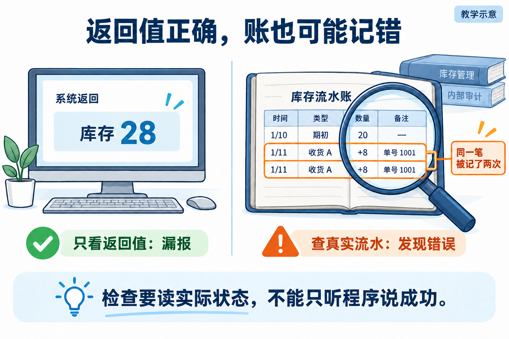
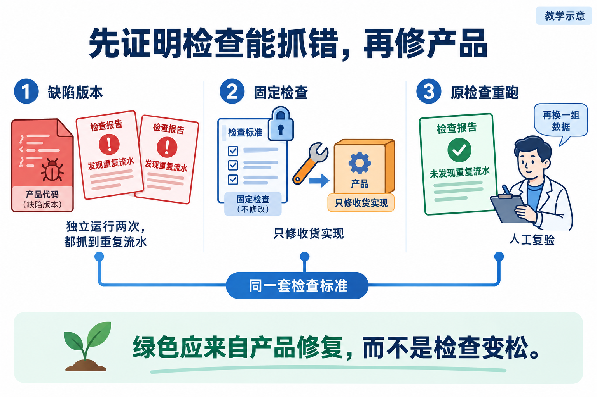

# L05｜先设计失败，再编写 Eval

L04 已经完成一次有检查、有人工决定的库存导出交付。现在要让 FlowERP 继续支持仓库收货：一批货只来了一次，操作员因为页面没响应又点一次，系统会不会记成两批？

已有检查能运行，并不代表它能抓住这种错误。我们先让检查遇到一个已知会重复记账的版本，看看它是否真的报错，再让 Codex 修复收货。**L04 练习完成一次交付，L05 要证明交付使用的检查有辨别对错的能力。**

你确认收货规则与修改范围，Codex 协助写检查和修复，工作台运行并保留结果，复验者按原要求判断。最终既要得到不重复入账的收货功能，也要留下后续任务可以继续运行的检查。

## 1｜先把“同一笔收货”说清楚

仓库期初有 20 件，今天到货 8 件。操作员提交收货后，页面迟迟没有响应，于是重试。页面没有响应，并不意味着服务器没有记账；直接再加 8，可能把库存变成 36。

要识别重试，给这笔收货一个稳定编号 A：第一次用 A，重试仍用 A。后来真正又到了一批 8 件，才使用新编号 B。这个编号称为**幂等键**；同一笔业务重复请求只产生一次效果，称为**幂等**。

为什么不能只比较商品和数量？因为 A、B 都是 8 件，却是两笔真实业务。为什么不能每次点击都生成新编号？因为这样就无法认出重试了。

**图 5-1　同一笔收货重试与另一笔新收货**

沿图从左向右看：库存是 20 → 28 → 28 → 36。**流水**是每笔入库留下的业务记录；图中期初库存也通过入库建立，所以流水数是 1 → 2 → 2 → 3。重试 A 时，两者都不能增加。

现在有一个容易漏掉的错误：程序返回 28，库存也是 28，但它又写了一条 A 的流水。只看页面数字，会以为正确；后续按流水对账，就会发现重复。因此，先写下业务要求：**同一笔收货既不能重复增加库存，也不能重复留下入账记录。**

## 2｜把要求写成一项能重复运行的检查

本讲的 **Eval** 就是把要求变成可执行检查。普通测试函数也能完成这件事。关键在于它是否真的执行操作、读取状态，并把实际结果与独立确定的预期比较。

先按下面的顺序写检查思路，再交给 Codex 实现：

| 操作 | 应看到什么 | 这一步排除什么错误 |
|---|---|---|
| 建立期初 20 件，用 A 收货 8 件 | 库存 28；新增一条属于 A 的正确流水 | 正常收货时就算错或漏记 |
| 再用 A 收货 8 件 | 库存仍为 28；流水内容与上一步一致 | 重试重复入账 |
| 改用 B 收货 8 件 | 库存 36；新增属于 B 的流水 | 把所有后续收货都拦住 |
| 在独立用例中提交 0 或负数 | 拒绝；相关库存与流水保持原样 | 报了错，却已经改动数据 |

预期的 28 来自“20＋8”。不能先读程序返回值，再把它填成预期；那相当于让被检查者给自己出答案。也不能只看重试前后相等：若第一次就错成 36，第二次仍为 36，仍然不符合要求。

流水也要比较业务相关内容，不能只数条数。删掉一条旧流水、再多写一条新流水，数量没变，账却变了。这样的反例帮助我们决定检查到底应该读什么。

你可以先给 Codex 这段任务，方括号换成自己的路径和范围：

> 在【课程候选目录】中，依据“同一笔收货只入账一次”实现业务检查。覆盖 A 首次、A 重试、B 新收货，以及无效数量。预期由规则独立计算，读取实际库存和流水，不只检查返回值。先说明各步骤会抓住什么错误；这一阶段只在【允许的检查文件】中建设检查，暂不修收货实现。

**图 5-2　返回值与实际流水不一致**

*读图：左边只看返回的 28，漏掉了右边两条相同收货记录。图中每条 A 都是 8 件；重复流水正是要发现的缺陷。*

## 3｜故意让检查遇到一次它必须抓住的错误

检查在正确程序上通过，只能说明它没有报错。要知道它能不能发现重复流水，还要让它检查一个已知带此缺陷的版本。这个可重复使用的坏版本，叫**缺陷基线**。

课堂对照保留“重试多写流水，但仍返回正确库存”的错误。旧检查只看返回值，会显示通过；新检查读取流水，应指出：

> 教学示例：重试收货 A 后，库存仍为 28，但流水由 2 条变成 3 条，违反同一笔收货只入账一次的要求。

保持代码和检查标准一致，每次从相同的干净数据开始，连续运行两次。两次都因这条业务要求失败，才说明检查可以稳定发现该缺陷。若第二次沿用第一次污染的数据，失败可能只是残留状态造成的，无法做同样的判断。

“模块不存在”也会失败，但检查还没执行到收货。先排除环境问题，再判断业务。个人课程候选也可能已经能报红，不必为了复现“旧检查绿”而删弱原检查；课堂对照与个人起始状态分别记录。

设计其他检查时，可以沿四个方向找反例：

| 失败类型 | 收货例子 | 检查关注点 |
|---|---|---|
| 逻辑错误 | A 重试又入账 | 库存和流水是否重复变化 |
| 边界缺失 | 接受数量 0 | 拒绝及失败后状态 |
| 规范违规 | 每次重试换业务编号 | 是否遵守确认的业务身份规则 |
| 危险修改 | 删除失败检查或改无关文件 | 实际差异与授权范围 |

## 4｜再加一项检查，防止“为了通过而改标准”

假设 Codex 没有修复重复流水，只删掉了检查流水的判断，报告也可能变绿。删掉的这种“必须满足某个条件”的判断，在测试代码里叫作断言。因此，仅凭绿色报告不能说明原来的问题已经解决，还要看产品和检查分别改了什么。

所以还需要**工程约束 Eval**：检查这次改动有没有遵守约定。修复前记录允许修改的文件和必须保留的检查；修复后核对实际差异，包括新增、删除和重命名。业务检查回答“结果对不对”，范围检查回答“是否按约定修改”，两项都需要。

这里有明确的先后顺序：**先建设检查并接入工作台实际运行的候选，再固定检查标准，最后修产品。** 固定标准意味着保存检查版本或文件指纹，并核对修复前后未被偷偷改动。文件指纹是内容标识，只能帮助发现变化，不能证明内容正确。

如果检查本身确实写错，应单独说明修改理由、保留旧结果，再建立新的对照。这样才能知道结论变化来自产品修复，还是来自验收要求调整。

**图 5-3　固定检查后修复产品并复验**

*读图：先在独立环境中两次抓到同一缺陷，再固定检查、修改产品。最后仍用原标准复验，并换数据排除写死答案。*

## 5｜现在修复，并证明没有只记住课堂答案

将已经定位的失败、实际候选路径和授权文件交给 Codex：

> 原检查已经两次发现【填写实际失败】。只修改【允许的收货实现文件】，修复同一笔收货的重复入账。保留已固定的检查与历史报告；说明代码差异，并在同一候选重新运行业务与范围检查。

修复后先用原检查复验，再做一次更换数据的迁移检查：期初 11、A 收货 3、重试 A、B 再收货 3，库存应为 11 → 14 → 14 → 17。这样可以排除永远返回 28，或把后续所有请求都忽略的实现。

本讲的顺序调用实验不自动覆盖并发、进程崩溃、同一编号携带不同内容等情况。把这些边界留在交接记录中，复验者才知道绿色报告具体证明了什么。

打开[实践操作手册](实践操作手册.md)：第 1～3 步准备并观察缺陷，第 4～5 步完成范围约定与检查接入，第 6～7 步修复和复验；异常按第 8 步定位。完成时应能拿出两次业务红报告、固定的检查、实际修改差异、原标准下的绿报告和复验意见。所有数字与结论都填写自己的实际结果。

需要查旧检查、源码及更完整的边界时，阅读[实现细节与扩展阅读](实现细节与扩展阅读.md)或[参考详解](参考详解.md)。

## 本讲留下什么，下一讲怎样接着用

本讲交出收货修复、两次原始失败及固定的业务与范围检查。L06 要把它们带入库存维护，与新检查一起运行、分级、汇总；原检查继续有效，不在下一讲另写一份更宽松的版本。

[课程蓝图与学习路线](../课程蓝图.md#l01l12-的连续学习路线) · [实践操作手册](实践操作手册.md) · [上一讲](../L04/辅导资料.md) · [下一讲](../L06/辅导资料.md)

## 课程大纲中的本讲要求

- **核心内容**：示例测试与 Eval 的区别；逻辑错误、边界缺失、规范违规和危险修改四类失败模式。
- **演示结果**：一个故意带缺陷的基线稳定触发失败。
- **课内增量**：编写一个业务结果 Eval 和一个工程约束 Eval。
- **通过标准**：缺陷基线连续运行两次均失败；失败信息能够定位到具体要求。

配图为教学示意；来源与提示词：[查看原配图设计与提示词](assets/reading-figures-v2/设计与提示词.md)、[查看新增配图与完整生成提示词](assets/reading-story-20260926/生成说明.md)。
