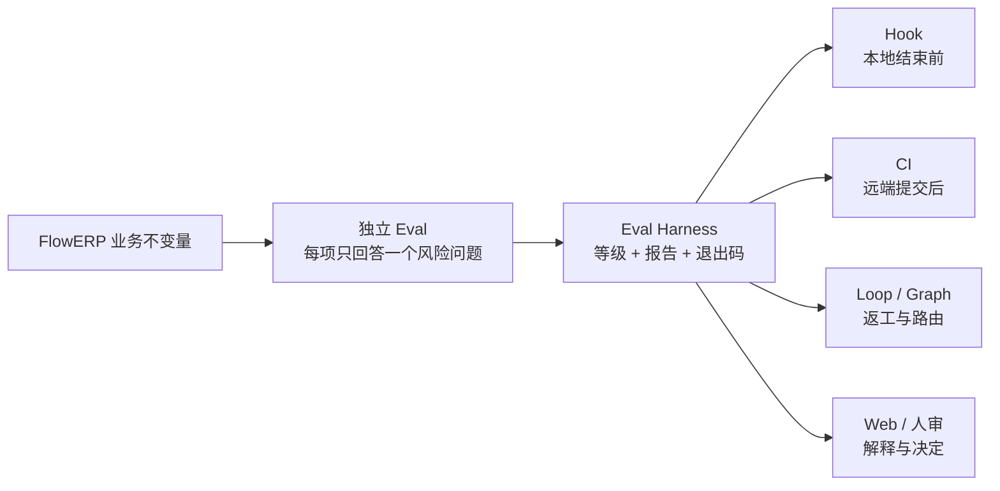
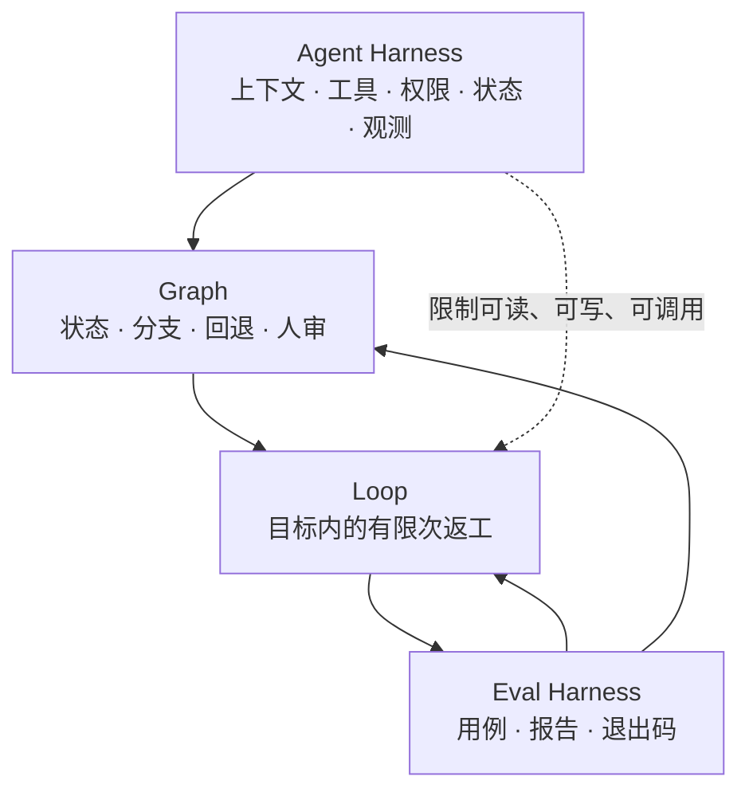
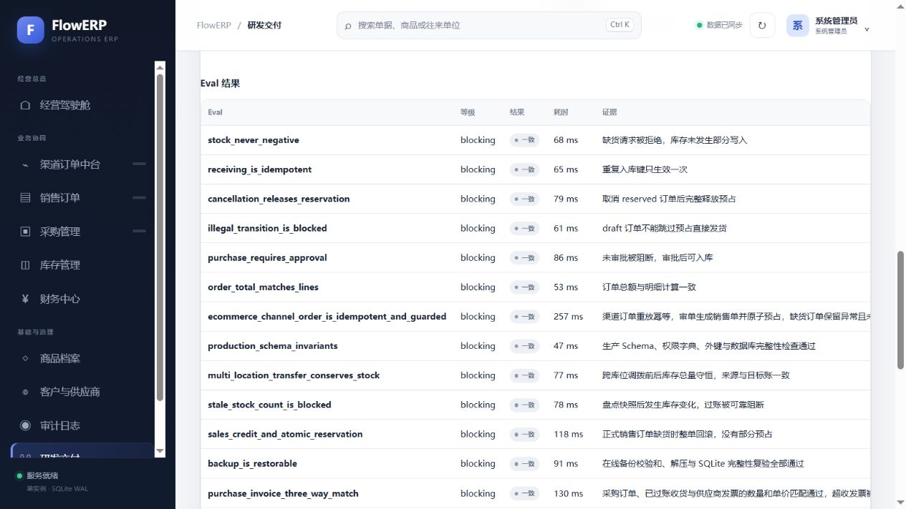
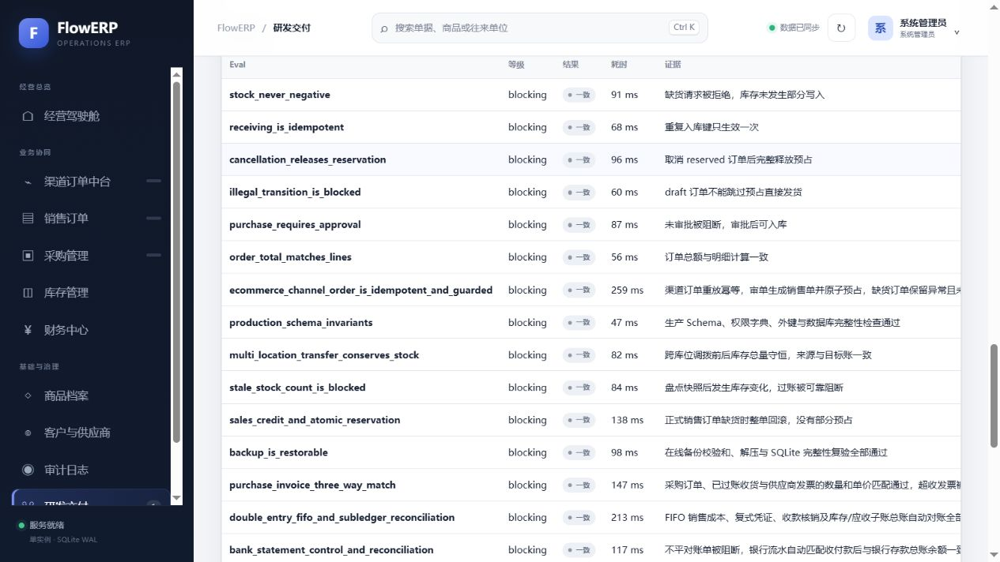
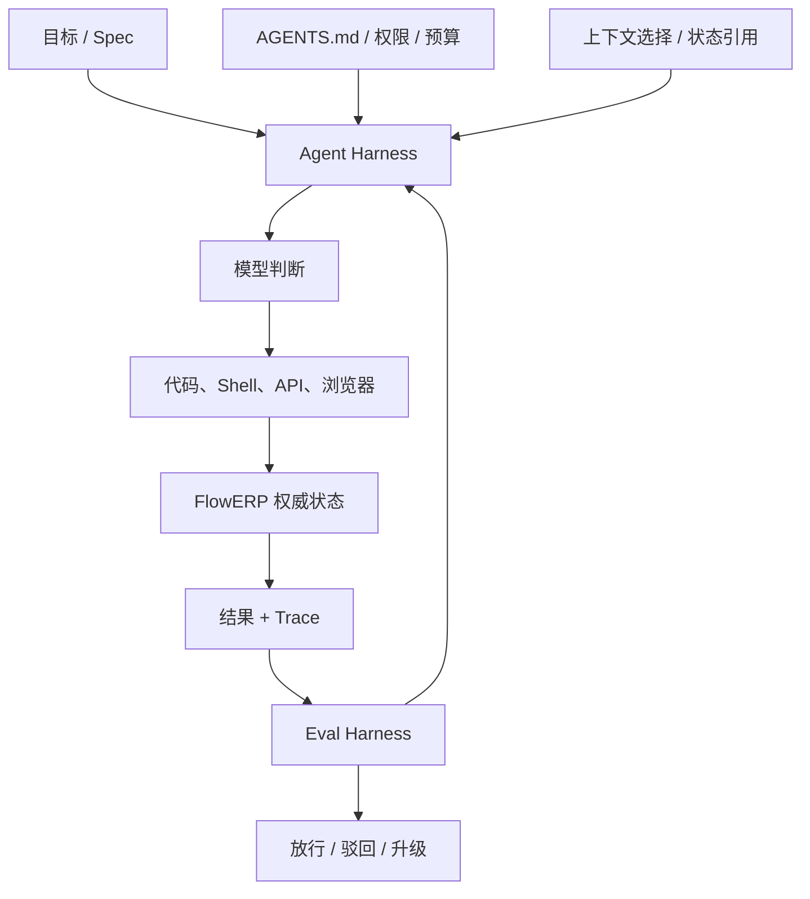
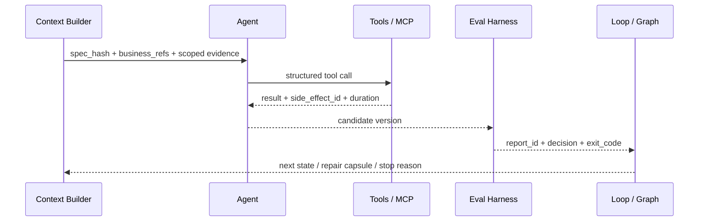
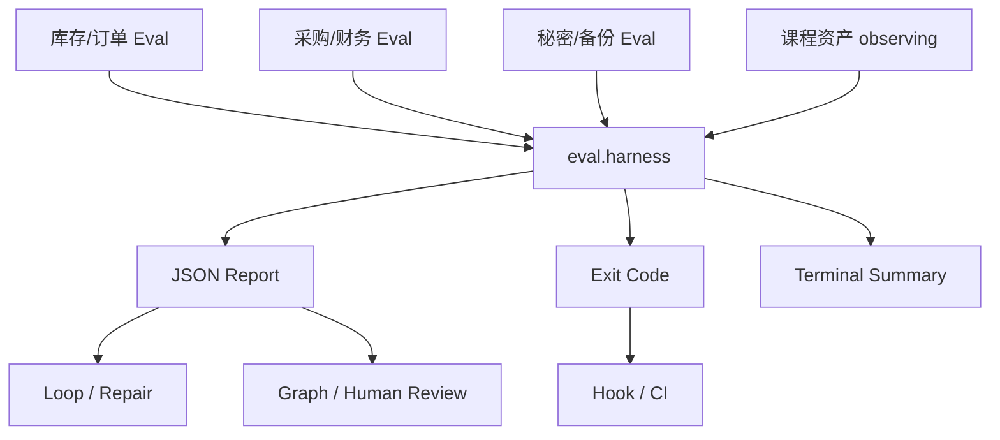
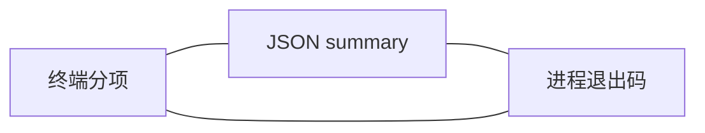
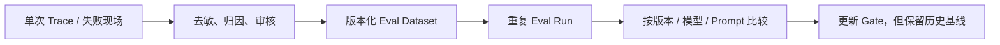
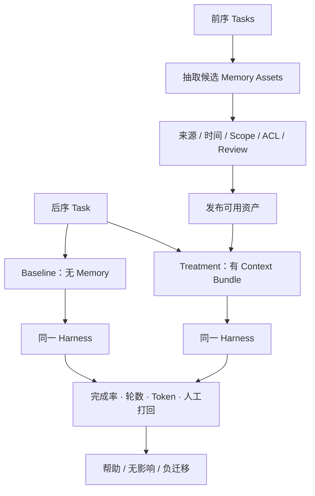

# L06｜用 Harness 汇总证据和等级

- **核心内容**：用例发现、统一退出码、阻断级与观察级指标、机器可读报告。
- **演示结果**：Harness 输出分项结果、阻断结论和 JSON 报告。
- **课内增量**：实现最小 Harness，将第 5 讲用例纳入统一执行。
- **通过标准**：阻断用例失败时返回非零退出码；观察项失败只记录告警；报告保留运行时间和失败原因。
- **挑战任务**：增加跨项目回归用例并说明其适用边界。

> 课程建设状态说明：本讲 Harness、报告 Schema、活动与评价规则属于已经形成的课程设计；学生预测、三类运行记录、具名裁决和达成数据属于待真实开课采集。参考仓库 17 项通过不能替代学生对分级、异常和退出码的判断。

## 国家级一流本科课程教学设计卡

| 维度 | 本讲设计 |
|---|---|
| 对应课程目标 | CLO-3：将分散 Eval 汇总为一致、机器可读的质量判决 |
| 工作台主线增量 | 建立唯一 Harness、等级语义、稳定 JSON 报告和退出码合同 |
| FlowERP 的作用 | 交付可用库存口径，并把幂等、非负和口径 Eval 纳入统一 Harness |
| 高阶性 | 分析阻断、观察、异常和未执行信号的风险差异，设计报告 Schema 与退出码合同 |
| 创新性 | 用同一 Harness 同时服务人、Hook、CI、Loop 和 Graph，避免不同自动化各自改写质量标准 |
| 挑战度 | 学生必须制造三类结果并准确预测 JSON、decision 与退出码，任何矛盾都不能放行 |
| 学生中心活动 | 小组扮演用例作者、质量负责人和消费者，评审等级后进行故障注入与三角校验 |
| 课程思政融入 | 以公开、一致、不可临时降级的裁判规则体现公平、公正和工程质量责任 |
| 形成性评价 | 三类运行报告 + 退出码对照 + 等级评审理由 + 消费者字段合同 |
| 持续改进数据 | 统计分级误判率、报告/退出码矛盾数和用例异常被吞比例，改进示例与支架 |

## 本讲知识合同

| 合同项 | 本讲约定 |
|---|---|
| 主线起点 | L05 已有可信单项 Eval，但多个结果、告警和运行异常还不能形成一致机器判决 |
| 唯一技术命题 | 如何用稳定报告 Schema、等级语义和退出码合同形成唯一质量入口 |
| 必须掌握 | Harness 职责；blocking/observing/error/未执行语义；报告 Schema；decision 与 exit code 一致性；消费者合同 |
| 能力判据 | 能分别制造观察失败、阻断失败和执行异常，并准确预测 JSON 与退出码 |
| 本讲不做 | 不自动触发，不修复失败，不猜唯一根因，不让下游消费者复制质量规则 |

## 大纲锚点与前沿校准（2026-08-19）

- **大纲锚点**：只实现用例发现、阻断/观察等级、统一退出码和机器可读报告，并纳入 L05 用例。
- **前沿采用**：稳定 Schema 和退出码是基础；Trace 调试、版本化 Dataset 与重复 Eval run 是评测资产化增强。
- **不越界**：Harness 不猜根因、不修代码；快速演进的生成式观测字段只作观察项，不进入基础通过线。
- **链路交接**：向 L07 交付唯一质量入口及稳定消费者合同。详见[校准矩阵](./16讲主线与前沿校准矩阵.md)。

**主线坐标**：第 5 讲已经让一个 Eval 在真实缺陷上变红；现在工程账需要把分散检查汇成唯一结论。业务账没有新动作，本讲只建立一块所有自动化共同读取、任何自动化都无权篡改的质量仪表。

**这一讲把系统推进到哪里**：FlowERP 的库存、订单、采购、幂等、财务和恢复规则不再散落为孤立测试；工作台获得唯一阻断入口、等级、结构化报告和可信退出码；当前基线中逐项结果及 `evidence` 字段构成本讲证据，具体数量以当次报告为准。Harness 的商业价值是让 Hook、CI、Loop、Graph 和人审不再各说一套“通过”。

## 本讲行动工单：自己造三种信号，再让 Harness 作一致判决

学员先写报告 Schema 和消费者合同，再实现或补齐用例发现、隔离、分级、报告与退出码。课堂必须主动制造 observing 失败、blocking 失败和用例异常三种输入，并再让报告写入失败；学生先预测 decision/exit code，运行后解释偏差。最后写一个只读稳定字段的最小消费者，证明下游不需要复制质量逻辑。

- **工作台增量**：通用 Harness、等级语义、机器报告、退出码和消费者合同；
- **FlowERP 产品状态**：交付“在库—预占=可用”的统一口径，并与幂等、非负库存用例共同进入 Harness；聚合异常不得改变业务账；
- **失败证据**：blocking、observing、error、报告写入失败四类记录；
- **迁移证据**：第二项目或非 FlowERP 命名用例进入同一 Schema，并声明适用边界；
- **讲师硬门槛**：不得预先给出三类成品报告，必须由学生运行生成。

详见[可执行任务卡](../../course/tasks/L06-Harness证据汇总.md)。

## 本讲教学设计总览

| 项目 | 设计 |
|---|---|
| 建议学时 | 30 分钟线上精讲 + 70 分钟线下行动 + 45 分钟 Harness 迁移作业 |
| 课堂类型 | **质量控制室**：对阻断、观察、异常和超时信号作统一放行决策 |
| 核心问题 | 多个 Eval 怎样形成一份机器可消费、退出码可信、又不夸大结论的质量报告？ |
| 教学重点 | 单一入口、报告 Schema、等级语义、异常隔离、退出码一致性 |
| 教学难点 | 区分运行条件、质量读数和放行责任；处理 observing 误分级 |
| 课堂产出 | Harness JSON + 三角校验表 + 等级误配复盘 |
| 价值塑造 | 裁判规则公开一致，不能因负责人、环境或交付压力临时改口径 |

### 可测学习成果

| 编号 | 学习者能够 | 达成证据 | 达成标准 |
|---|---|---|---|
| L06-O1 | 解释广义 Agent Harness 与本课程 Eval Harness 的关系 | 责任边界图 | 不把 Harness 当 Agent、Loop 或审批人 |
| L06-O2 | 读取并验证报告 Schema、等级、decision 与退出码 | 三角校验表 | 三项矛盾样例均能正确裁决 |
| L06-O3 | 为新检查选择 blocking 或 observing 并说明损失依据 | 等级评审记录 | 高风险不降级，波动指标不误阻断 |
| L06-O4 | 证明单项异常不会吞掉其他证据 | 故障注入报告 | 异常被记录，总结和退出码仍可信 |

### 30 分钟线上精讲 + 70 分钟线下行动

| 场域与时间 | 学习活动 | 学生当场证据 |
|---|---|---|
| 线上 0–8 分钟 | 面对“16 绿 1 红”“全绿但报告缺失”先作放行表决 | AI 介入前首次裁决 |
| 线上 8–20 分钟 | 讲解 Harness 职责、blocking/observing/error 语义与消费者合同 | 风险—Eval 地图 |
| 线上 20–30 分钟 | 追踪报告 Schema、decision 和退出码，示范三角校验 | 字段责任表与结果预测 |
| 线下 0–18 分钟 | 运行 Blocking Suite，核对终端、JSON 和退出码 | Harness 证据包 |
| 线下 18–36 分钟 | 制造 observing 失败并故意误分级，修订等级依据 | 误分级红灯与修订记录 |
| 线下 36–54 分钟 | 注入用例异常或报告写入失败，检查证据是否完整保留 | 异常隔离记录 |
| 线下 54–70 分钟 | 同伴扮演报告消费者，给出放行、观察或退回的具名裁决 | 消费者合同、裁决与离场票 |

### 达成度与持续改进

采集 Schema 读取正确率、等级判断一致率、报告/退出码一致率和异常证据保留率。任何学员将 observing 失败解释为自动放行或自动阻断，都记为等级语义未达成；一致率低于 90% 时增加损失×波动二维分级练习；报告与退出码矛盾样例识别率低于 95% 时，不进入 Hook 与 CI 讲次。

先校准术语：本讲实现的是狭义 **Eval Harness**——`eval/harness.py` 负责组织 Eval、生成报告和退出码。广义 **Agent Harness** 是模型之外的运行外壳，还包括 Codex 的上下文装配、工具、仓库、状态、沙箱、权限、Hook 和可观测性。前者是后者的一件质量仪器，不是整个运行外壳。

Harness、Loop、Graph 不是三段首尾相接的流水线，而是三种相互嵌套的责任：Harness 规定 Agent 在什么条件下工作，Graph 规定跨节点的合法控制流，Loop 只在某个需要返工的节点内重复“动作—评测—反馈”。Eval Harness 则像嵌在外壳里的仪表，向 Loop、Graph、Hook、CI 和人审提供同一份质量读数。

## 多盏质量灯不是测试清单，而是 FlowERP 控制模型

当渠道订单、库存、采购、财务和交付任务都进入同一个项目后，“跑过很多测试”已经不足以放行。工作台需要知道哪些失败必须阻断、哪些只记录观察、结论由哪份报告负责。于是狭义 Eval Harness 从 FlowERP 的风险分级中演化出来：它不发明业务规则，只把已经签字的规则组织成唯一裁决。

| FlowERP 风险域 | 代表性 Eval | 为什么必须进入统一裁决 |
|---|---|---|
| 渠道订单 | `ecommerce_channel_order_is_idempotent_and_guarded` | 重放、审单、缺货异常必须作为一条业务链判断 |
| 库存 | `stock_never_negative`、`multi_location_transfer_conserves_stock` | 局部成功不能掩盖总量或可用量被破坏 |
| 采购 | `purchase_requires_approval`、`purchase_invoice_three_way_match` | 技术成功不能替代审批与三单匹配 |
| 财务 | `double_entry_fifo_and_subledger_reconciliation` | 单张单据正确不代表子账与总账一致 |
| 交付治理 | `delivery_evidence_and_review_controls` | Agent 完成状态不能越过证据和具名审核 |



这张图要从右往左读一遍：如果 Hook、CI、Loop 各有自己的测试集合，FlowERP 会出现四套“什么算正确”；如果 Harness 直接修改库存或自动批准采购，它又越过了裁判边界。唯一入口的价值，是让所有自动化消费同一份业务判决，而不是让一份脚本包办整个研发流程。



一旦把这四者画在同一张图上，常见误解就会消失：给 Loop 增加轮数不能修复过宽权限；给 Graph 增加节点不能替代业务 Eval；Eval 全绿也不能代替具名审批；Agent Harness 有日志也不代表已经建立了可用的质量 Gate。

广义 Agent Harness 至少要兑现六份合同：

| 合同 | 必须回答的问题 | FlowERP 中的落点 |
|---|---|---|
| Context | 模型本轮看见哪些事实，版本是否明确 | `AGENTS.md`、Spec、Repair Task、报告引用 |
| Tools | 能调用什么命令与服务，返回值是否可信 | 受控 Shell、文件工具、任务 API、Eval 入口 |
| State | 轮次、任务、报告和审核如何持久化 | TaskStore、Loop History、Graph State |
| Permission | 能读什么、写什么、谁能批准 | 写集边界、服务端鉴权、具名审核 |
| Observability | 动作、用量、退出码和状态是否可追溯 | JSON 报告、事件、Trace、Request ID |
| Failure | 超时、工具错误、无进展和中断如何退出 | 非零退出、明确终态、恢复点、证据保留 |

本讲只实现其中的“质量仪器”。这条边界很重要：`eval.harness` 不负责给模型分配工具，也不负责把任务挂起等待经理批准。

当报告进入 Web，它必须保留每条 Eval 的名字、等级、证据与结论，而不是只画一个绿色总分。下面的项目截图让审核者从 summary 下钻到具体证据；页面仍只是报告消费者，不能重新计算或覆盖 Harness 的 decision。






第一张说明报告能下钻，第二张说明不同业务域共用同一 Schema，第三张说明报告不只是页面表格，还会驱动任务状态迁移。三张图合起来才是 Harness 的完整责任：汇总、裁决、输出可消费证据；它不负责自动批准。

上一讲已经证明某条 Eval 会红。这一讲要解决更难的问题：仓库里有 18 类检查，究竟谁有资格说“可以交付”？答案不能是测试数量最多的人，也不能是终端最后一行绿色，而是一个稳定的数据合同。

课堂先打开真实报告，不先看 Harness 源码：

```powershell
python -X utf8 -m eval.harness --suite all
Get-Content .runtime/reports/harness-all.json -Raw -Encoding UTF8
```

让学员在 JSON 中找到五个下游会依赖的钉子：`schema_version`、`level`、`passed`、`evidence`、`summary.decision`。再故意让 observing 失败，确认它产生 WARN 却不改变退出码；最后让 blocking 失败，确认报告写 `block` 且进程返回 1。

这一讲没有新业务数据，只有一条新的工程事实：从现在起，Hook、CI、Repair、Loop、Graph 和 Web 都不准自己发明质量口径，只消费这份报告。所谓 Eval Harness 的“硬货”，就是把组织争论压成一个可版本化、可被机器拒绝的协议。

## Harness 不是 SDK 名称，而是 Agent 的运行控制面

入门材料常用 `Agent = LLM + Harness` 帮助理解：同一个模型装进不同运行外壳，最终行为可能完全不同。课程需要再向前一步——这不是严格公式。可交付的 Agent 系统至少还依赖业务环境、工具、权限和可验证合同：

```text
Agent System = Model
             + Harness（调度、上下文、状态、工具、权限、重试）
             + Domain Environment（FlowERP 权威业务状态）
             + Contract & Evidence（Spec、Eval、Trace、人审）
```



图里有两个容易混淆的 Harness。**Agent Harness** 管“模型如何运行和行动”；**Eval Harness** 管“多项评测如何汇总成质量裁决”。本课程亲手实现的是后者，同时借 Codex 的工具、权限、上下文与生命周期机制观察前者。两者必须解耦：运行框架可以更换，`available >= 0`、未经审批不得入库以及报告退出码合同不能随之改变。

课堂检查不要问“用了哪个 Agent 框架”，而要问六个可验证问题：工具是谁提供的；状态存在哪里；上下文如何选择；写权限如何限制；失败怎样停止；最后由谁判定。答不出来，所谓 Harness 就仍是一层品牌包装。

### Harness 要观察整条因果链，而不只看最终答案

一个 Agent 把结果做对，可能是因为 Context 正确、工具可靠，也可能只是偶然猜中。要让结果可复现，Harness 至少保存五类外部可审查信号：

| 信号面 | 最小记录 | 20/8/12 事件的检查点 |
|---|---|---|
| 输入身份 | `requirement_id`、`spec_hash`、候选版本 | 本轮确实处理 `REQ-ECOM-001` |
| Context 来源 | 规则、报告、业务对象版本、检索时间 | 使用的是可用 8，而不是旧 Memory 中的 20 |
| Tool 轨迹 | 工具名、参数摘要、状态码、耗时、副作用 ID | 没有直接改运行库，没有调用采购批准 |
| 结果证据 | Eval 名称、expected/actual、report ID | 不足时 `reserved` 仍为 0 |
| 控制状态 | Loop 轮次、停止原因、Graph 节点、reviewer | 全绿后停在 review，未匿名完成 |



课程不要求保存模型隐藏的内部思维，也不把长篇自述当轨迹。要保存的是能由外部系统核对的事件：读了什么版本、调用了哪个工具、产生了什么副作用、哪个 Eval 判错、为何继续或停止。这样既能诊断“Prompt 错了”“Context 过期”“Tool 返回旧数据”，也能避免把所有失败都粗暴归因于模型。

## 为什么“测试很多”仍可能无法放行

一个仓库可以有上百条测试，但交付时仍会争论：哪个失败必须阻断；哪些只是提示；报告在哪里；失败时进程为何仍返回 0；Hook 和 CI 为什么跑了不同命令。测试数量不能自动生成治理。

Harness 的职责是把用例发现、分级、执行、计时、证据、汇总、报告和退出码组织成公共协议。它不重复实现库存规则，而是调用 Eval；不决定如何修复，而是提供事实；不替代人工审核，而是给审核者一致输入。

## 课程中的统一入口

```bash
python -X utf8 -m eval.harness --suite blocking
python -X utf8 -m eval.harness --suite observing
python -X utf8 -m eval.harness --suite all
```

`blocking` 选择业务不变量、安全边界、状态机和恢复能力；`observing` 选择不改变放行结论的观察项；`all` 生成完整视图。无论入口如何选择，报告字段和分项结构保持一致。

## Eval Harness 在系统中的位置



箭头体现单向依赖：Hook 不再自己枚举测试；CI 不再复制规则；Loop 不解析人类日志猜失败；Graph 不自己判断库存是否正确。它们消费 Harness 的公共合同。

## 报告 Schema 深读

报告顶层字段：

```json
{
  "schema_version": "1.0",
  "suite": "blocking",
  "generated_at": "2026-08-14T...+00:00",
  "summary": {
    "total": 17,
    "passed": 17,
    "blocking_failed": 0,
    "observing_failed": 0,
    "decision": "pass"
  },
  "results": []
}
```

每个结果包含 `name`、`level`、`passed`、`duration_ms` 和 `evidence`。`schema_version` 允许下游识别合同变化；`suite` 防止把 observing 报告误当 blocking；UTC 时间使跨环境记录可比较；`duration_ms` 帮助发现性能退化或卡死；`evidence` 给人和 Repair Task 直接上下文。

报告写入 `.runtime/reports/harness-{suite}.json`。它是运行产物，不应提交 Git。CI 应将它作为 Artifact 归档，与具体提交和运行绑定。

## 决策与退出码必须一致

决策公式非常简单：

```text
blocking_failed = count(result.level == blocking and result.passed == false)
decision = pass  if blocking_failed == 0 else block
exit_code = 0    if blocking_failed == 0 else 1
```

观察项失败不增加 `blocking_failed`，因此不改变退出码。最危险的实现是“打印红字但返回 0”，因为 CI 和脚本通常只看退出码。另一个危险是 JSON 写 `pass`，进程却返回 1，导致事实源冲突。测试 Harness 本身时必须同时断言 summary、分项与退出码。

## 分级不是给失败贴颜色

| 等级 | 适用条件 | 自动化行为 | 示例 |
|---|---|---|---|
| blocking | 破坏核心业务、资金、安全、审批或可恢复性 | 非零退出，阻断交付 | 库存负数、重复入库、备份不可恢复 |
| observing | 值得跟踪但本次可接受，或规则仍在校准 | 记录 WARN，不改变放行 | 课程资产提示、体验指标 |

分级必须由风险决定，而不是由当前修复难度决定。不能因为某条 blocking 很难修就降级，也不能因为团队在意某个格式就把它提升为 blocking。每次等级变化都应有具名审核、理由和影响说明。

一个实用判断框架：失败是否会造成不可逆数据损坏；是否触及资金、库存、权限和合规；是否让交付结论失真；是否有可靠人工替代；误报成本是否可接受。前三项为是时通常进入 blocking。

## 课内增量：新增 observing 用例

设计一个不会影响业务放行的观察项，例如检查课程文档是否包含一张 Mermaid 图，或检查交付摘要模板是否存在。将它注册为 `observing`，故意让其失败，然后运行：

```bash
python -X utf8 -m eval.harness --suite all
```

预期终端标记 `WARN`，`observing_failed=1`，`blocking_failed=0`，`decision=pass`，退出码 0。接着运行 `--suite observing`，仍应返回 0；观察套件不是另一种阻断套件。

实验的核心是证明等级有实际控制语义，而不是只改变输出颜色。修复观察项后报告归零，但无需把一次纯文档提示包装成业务事故。

## 异常捕获的边界

Harness 对每个 Eval 使用 `try/except Exception`，把异常转成 `TypeName: message` 并继续执行其他用例。这样单个失败不会吞掉剩余证据。它不应捕获 `BaseException`，否则键盘中断、系统退出等控制信号也可能被误当普通失败。

继续执行的好处是一次获得完整失败集，代价是后续用例必须隔离，不能依赖前一用例污染的全局状态。本仓库大量使用临时数据库正是为了避免连锁假失败。

## 报告稳定性的工程细节

稳定不等于字段永不变化，而是变化有版本。下游至少依赖：

- `summary.decision` 控制放行；
- `summary.blocking_failed` 做断言；
- `results[].name` 构造失败签名；
- `results[].level` 过滤修复范围；
- `results[].evidence` 生成修复上下文。

如果重命名字段或用例，Repair Task、Loop、Web 和课程证据都会受影响。应提升 `schema_version`，提供兼容读取或迁移说明，而不是静默修改。

## 失败实验：让 observing 误阻断

在临时副本中把主函数改成“只要任意失败就返回 1”，运行一个故意失败的 observing 用例。观察 CI 语义会如何被破坏：低风险课程资产提示阻断所有交付，团队可能转而忽略整个门禁，最后连真正的库存失败也失去威信。

再做相反实验：让 blocking 失败仍返回 0。这个版本更危险，因为表面流水线绿色。将两种错误写入对照表：

| 错误 | 短期现象 | 长期后果 |
|---|---|---|
| observing 返回 1 | 误阻断、交付变慢 | 团队绕过门禁 |
| blocking 返回 0 | 假绿、合并成功 | 核心规则失守 |

恢复代码后运行 Harness 自身相关测试和完整回归。

## 质量结论的三角校验



三角任意一边不一致都属于 Harness 缺陷。课堂验收不要只展示报告文件：报告可能是上一次运行留下的。应记录 `generated_at`、当前提交、命令和退出码，确认它们属于同一次执行。

PowerShell 示例：

```powershell
python -X utf8 -m eval.harness --suite all
$exit = $LASTEXITCODE
$report = Get-Content .runtime/reports/harness-all.json -Raw -Encoding UTF8 | ConvertFrom-Json
[pscustomobject]@{
  exit_code = $exit
  generated_at = $report.generated_at
  decision = $report.summary.decision
  blocking_failed = $report.summary.blocking_failed
  observing_failed = $report.summary.observing_failed
}
```

## Harness 判结果，不替 Agent 编根因故事

`stock_never_negative` 报红，Harness 能确定失败规则、实际状态和放行结论，却不能仅凭一条断言证明 Agent“没有理解事务”。根因判断还要看候选 Diff、实际命令、每轮失败签名和状态迁移。换句话说，Harness 是结果通道；L09 的 Repair Task、L10 的 History 与 L12 的 Trace 组成轨迹通道。

课堂可做一个反证：让两个错误实现产生同名失败。版本 A 先写第一行再检查第二行；版本 B 业务逻辑正确，但旧 SQLite 被文件锁污染。两者的 Harness 名称可能相同，处理动作却完全不同。把报告名直接翻译成根因，会让自动修复从一开始就走偏。

因此全书采用两条证据通道：**结果证据**回答“当前候选是否满足合同”，由 Eval、报告、退出码和权威业务状态提供；**轨迹证据**回答“它做了什么、在哪一步偏离、是否越权”，由命令、Diff、Loop History、Graph Trace 和审核事件提供。结果负责否定不合格候选，轨迹负责缩小解释范围；二者都不能单独证明唯一根因，最终结论仍要回到可复现命令、直接错误和具体 Diff。

## Harness 不负责什么

Harness 不决定产品需求，不自动修代码，不授权模型写入，不批准采购，不替代代码审查，也不证明所有未知风险都不存在。它只对已注册 Eval 在当前环境中的结果负责。把边界讲清楚，能避免团队拿一张全绿报告过度宣称“生产就绪”。

性能、并发和合规等领域若没有 Eval，Harness 绿色只能说明“当前题库通过”，不能说明那些领域已验证。报告摘要应与覆盖矩阵一起阅读。

## 本讲提交与验收

证据包包括：`harness-all.json`；一次 observing 失败的 WARN 记录；对应退出码 0；一次隔离的 blocking 失败记录和退出码 1；恢复后的全绿报告；报告 Schema 说明。

### 验收清单

- [ ] blocking 失败返回 1；
- [ ] observing 失败只产生 WARN 并返回 0；
- [ ] JSON 含版本、套件、时间、汇总、分项、耗时和证据；
- [ ] 终端、JSON、退出码结论一致；
- [ ] 报告写入运行目录且不提交；
- [ ] Hook、CI、Loop、Graph 没有复制第二套用例列表；
- [ ] 能解释绿色结论的覆盖边界。

<details>
<summary>讲师用：验收、练习与评分</summary>

## 作业、评分与下一讲

### 作业

为自己的项目实现最小 Harness，至少包含两个 blocking、一个 observing；提交报告 Schema、三角校验和一次等级误配的复盘。若已有测试框架，可以封装现有入口，不要求重写用例。

### 评分

| 项目 | 分值 | 合格表现 |
|---|---:|---|
| 公共合同 | 25 | Schema 稳定、机器可读、版本和身份明确 |
| 等级语义 | 20 | blocking/observing 行为不同且有风险依据 |
| 决策与退出码 | 25 | 终端、JSON、decision 与进程退出完全一致 |
| 失败隔离 | 20 | 单项异常或超时不吞掉全局证据 |
| 边界说明 | 10 | 不把 Harness 冒充根因分析、自动修复或业务审批 |

下一讲把这一入口接到 Codex 的 Stop 生命周期。Hook 只负责“什么时候跑”和“怎样把失败交还给当前回合”，质量标准仍然只来自 Harness。


</details>
## Harness 演进练习：兼容、隔离与可观测

当 Eval 数量增长，Harness 需要处理选择、超时和报告体积，但不应牺牲合同稳定性。可以为每个用例增加 tags、owner 和 timeout，同时保留既有字段；新增字段通常向后兼容，删除或改义则要提升 Schema 版本。下游读取器应拒绝未知的破坏性版本，而不是用默认值悄悄给出 pass。

执行顺序也值得讨论。阻断用例彼此隔离时可以并行以缩短时间，但共享 SQLite、端口或全局环境的用例会产生竞态。课程基线串行执行，优先保证确定性。若挑战线并行，必须为每项提供独立临时目录，聚合时保持稳定排序，并证明并行与串行给出相同 decision。

可观测性不能只看总耗时。连续版本中某条 `backup_is_restorable` 从 200ms 增长到 8s，虽然仍通过，也可能预示文件系统或数据规模问题。报告已有 `duration_ms`，可以在不改变阻断语义的前提下建立趋势观察；只有阈值、平台和样本稳定后，才考虑提升为门禁。

### 报告消费者合同清单

- Hook 只读退出码和可操作尾部；
- CI 归档整份 JSON，不修改内容；
- Repair Builder 只选失败 blocking；
- Loop 以失败签名判断进展；
- Graph 以 blocking_failed 决定边；
- Web 展示 suite、generated_at、summary 和分项 evidence；
- 人工审核同时查看覆盖边界与剩余风险。

如果任一消费者开始复制用例列表，应立即收敛回 Harness，否则“唯一入口”只剩口号。

## 唯一入口已经存在，但人和 Agent 仍可能忘记运行

### 从单次红绿到评测资产：数据集必须版本化

一份 Harness 报告只回答当前代码和当前题库。要支撑持续改进，还要把失败演进为版本化评测资产：输入场景、期望不变量、环境、首次出现版本、修复版本、风险等级和是否进入 holdout。公开回归集防止旧错重现，隔离 holdout 用来识别只针对已知题目优化的候选。



这与官方所说的“先用 trace 调试，再用 dataset 和 eval run 获得可重复性”一致，但 FlowERP 额外坚持：业务账本的确定性断言优先于模型 grader，数据集更新也必须经评审，不能让修复者同时改题和答题。[OpenAI Docs：Agent Evals](https://developers.openai.com/api/docs/guides/agent-evals)

### Memory 不能用“召回了几条”验收，要用后序任务结果验收

团队记忆的评测单位不是资产数量，而是一对按时间排序的任务：前序 Case 产生经验，后序 Case 在不知道答案的前提下决定是否使用。对同一组后序任务至少运行两条基线：不装配 Memory 与装配经过治理的 Memory；模型、代码版本、工具权限、预算和 Eval 集保持一致。



最低指标应包括：Blocking 通过率；首次通过轮次；重复失败签名数；总 Token 与墙钟时间；人工打回次数；资产召回后实际采用率；负迁移率。所谓负迁移，是本来可以正确完成的任务因为错误、过期或越界 Memory 而失败。它比“没有帮助”更严重，必须形成 blocking 或至少高优先级 observing 信号。

课程实验使用 20/8/12 主线构造三组资产：正确强经验“库存不足整单不写入”；过期事实“当前库存为 20”；相似但越界方案“从另一组织仓库拆 12 台”。合格的 Context Builder 应采用第一条，丢弃第二条并实时查库存，阻断第三条的跨组织复用。Harness 不只检查最终订单是否失败，还检查采用/排除理由和资产版本是否留下事件。

TencentDB Agent Memory 实践材料报告了特定 SWE-bench 相关任务中的完成率提升和超长任务成本变化。课程只借鉴其“前序学习、后序验证、禁止未来信息泄漏”的实验设计，不把该数字外推为 FlowERP 的承诺。学员必须在自己的版本、模型和任务集上重新建立基线，并同时报告样本数、失败项和负迁移。

Harness 能给出权威结论，却只在有人主动输入命令时生效。最危险的时刻恰好是执行者准备宣布“完成”：注意力已经转向摘要，最容易跳过复验。第 7 讲把同一入口挂到 Codex 的停止时机，用一个严格受限的 Hook 读取新鲜报告、阻断错误结束，并证明它既不会复制测试，也不会陷入自触发循环。
