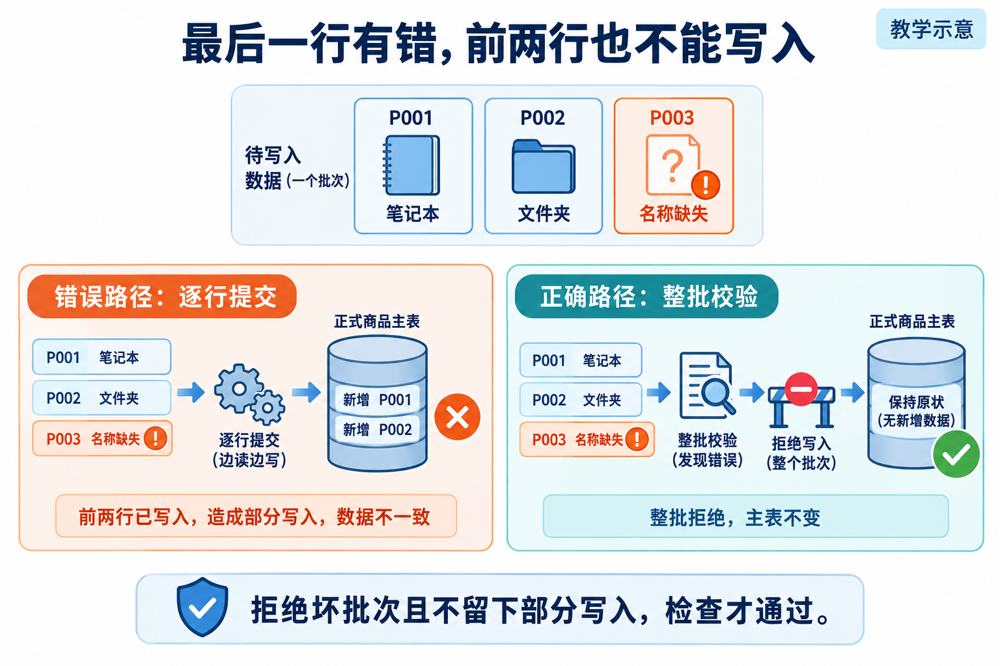
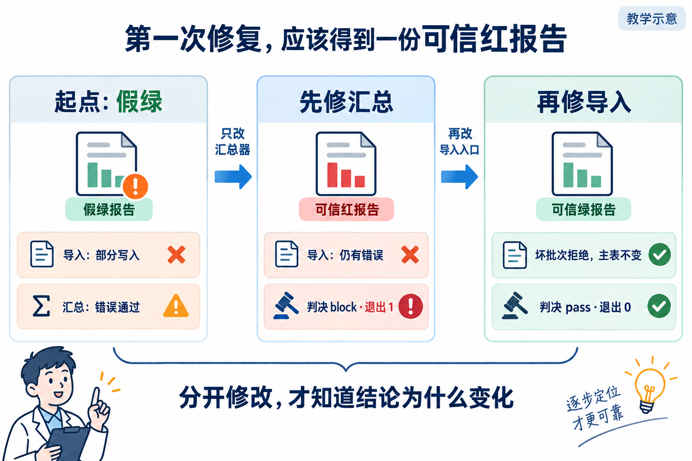

# L06 案例配图生成说明

生成日期：2026-09-26。使用内置 ImageGen，全部为教学示意，不是运行截图或个人验收证据。

图片已嵌入[辅导资料](../../辅导资料.md)。初稿与修订源图保留于生成目录，本目录仅保存采用的最终图片。

## 逐行提交与整批拒绝的区别



### 原始提示词

```text
Use case: scientific-educational. Generate one landscape Chinese textbook illustration 3:2. White background, navy headings, blue teal orange accents, tasteful editorial line illustrations, large legible simplified Chinese, ample whitespace, no fake screenshots. Small corner label “教学示意”. Visual explanations not text-heavy slides. All specified Chinese labels exact. 标题“最后一行有错，前两行也不能写入”。顶部三张输入卡“P001 笔记本”“P002 文件夹”“P003 名称缺失”，第三张橙色警示。下半部两条清晰独立的对照路径：错误路径“逐行提交”到正式商品主表显示“新增 P001、P002”，橙色叉；正确路径“整批校验”到拒绝闸门，再到保持原状数据库“整批拒绝，主表不变”，绿色勾。不要把两个路径连在一起。底部“拒绝坏批次且不留下部分写入，检查才通过”。
```

## 两次修改各自改变什么



### 原始提示词

```text
Use case: scientific-educational. Generate one landscape Chinese textbook illustration 3:2. White background, navy headings, blue teal orange accents, tasteful editorial line illustrations, large legible simplified Chinese, ample whitespace, no fake screenshots. Small corner label “教学示意”. Visual explanations not text-heavy slides. All specified Chinese labels exact. 标题“第一次修复，应该得到一份可信红报告”。三列从左到右：第一列“起点：假绿”，小卡“导入：部分写入”橙色叉，小卡“汇总：错误通过”橙色警示；第二列“先修汇总”，小卡“导入：仍有错误”橙色叉，小卡“判决 block · 退出 1”红色；第三列“再修导入”，小卡“坏批次拒绝，主表不变”绿色勾，小卡“判决 pass · 退出 0”绿色。第一到第二箭头文字“只改汇总器”，第二到第三箭头文字“再改导入入口”。底部“分开修改，才知道结论为什么变化”。不要暗示拒绝坏批次是业务错误。
```

### 修订提示词

```text
保留标题、三列、下方两行判断卡和箭头。删除三列中部全部小流程（导入数据、汇总器、红报告及相关图标），每列仅用一个大报告插画替代：第一列绿色报告带橙色警示，标签“假绿报告”；第二列红色报告，标签“可信红报告”；第三列绿色报告，标签“可信绿报告”。第三列绝不能保留红报告或红色失败标记。各列下面既有的业务和判决文字完全保留。
```

已目视复核最终图的数字、文字和方向。
