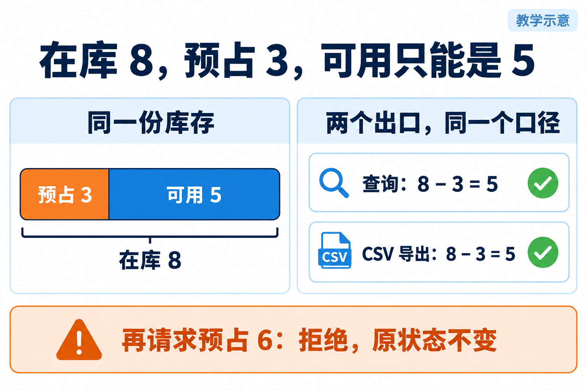
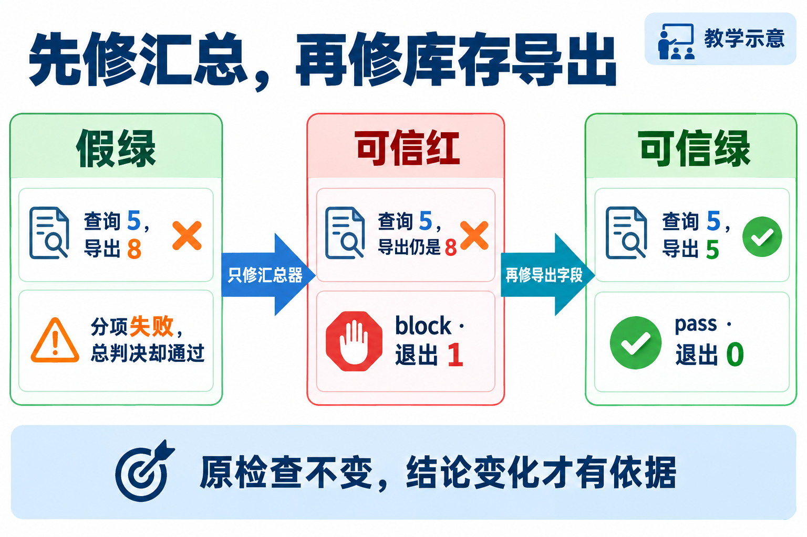

# L06｜用 Harness 汇总证据和等级

L05 留下了收货检查和修改范围检查。接下来维护库存时，还要检查查询、导出和超额预占。检查一多，就需要一个统一入口回答：哪些运行了、哪里失败、这次能否继续交付。

本讲回到库存口径：在库 8、预占 3，查询和导出都应显示可用 5。**L04 已验收的导出不应被人为改坏。** 这里使用另建的隔离副本，准备程序明确植入“CSV 错写在库数”和“汇总漏算失败”两个教学缺陷，用来验证你的检查组织能力。

你先让总报告如实承认失败，再让 Codex 修复副本中的导出错误，最后用原检查复验。客户功能的目标是统一可用库存口径；工作台新增的是分级、报告与退出码一致的检查入口。两个原始缺陷和每次修复都留在本次实验记录中。


## 1｜先确定哪个数字才对

**在库**是实际存放的数量，**预占**是已留给订单但尚未出库的数量，**可用**是还能供其他订单使用的数量。本例没有其他冻结或分仓因素，约定：可用＝在库－预占。

因此预期是 8−3＝5。这是从业务规则独立算出的答案，不能把查询页面的返回值直接当作导出的预期；否则两处同时算错也可能通过。



**图 6-1　同一份库存的查询与导出口径**

*读图：预占改变分配，不表示货已离库。查询和 CSV 导出都应得到在库 8、预占 3、可用 5。再请求预占 6 必须拒绝，原状态保持不变。*

本讲准备程序在隔离副本里植入一个明确缺陷：CSV 的 available 字段误用了在库数。查询返回 5，导出返回 8。学生要修的是本次副本中可实际运行的出口差异，不能只把报告改成绿色。这里调用预置服务建立“已经预占 3 件”的测试条件。它不是学员已交付的订单功能，也不替代 L07 的订单创建与 L08 的整单预占。当前只验证单商品数量关系；L04 的多仓明细、CSV 特殊字符及文件保护要求仍需保留原检查，不能用本讲这一项替代全部导出验收。

## 2｜一项检查要观察什么

检查在临时数据库中建立商品、入库 8 件，再为已有订单预占 3 件。然后分别读取查询与 CSV，要求两者都给出 `[8, 3, 5]`，并且导出只有一条对应商品记录。

接着新建一张请求 6 件的订单，保存操作前的库存、流水、订单和明细，再调用预占。正确结果是明确拒绝，保存的状态不变。这个拒绝检查用于防止可用库存被减成负数；它没有覆盖并发、数据库中断或多行原子提交，不能把本例通过推广为所有故障都可靠。

拒绝业务请求可以是正确行为。这里“预占 6 被拒绝，状态不变”会让检查通过；接受了超额请求或留下变动，才让检查失败。

L05 的原收货检查与范围检查也继续运行，确认这次修改没有破坏已有能力。四个登记项分别是：库存一致性、L05 收货、L05 范围、一个明确标注的教学观察项。前三项必须通过；观察项模拟非阻断提示，不代表实际缺少某张图。

## 3｜检查已经失败，总结果为什么仍然通过

**Eval** 是具体检查；本讲的 **Eval Harness** 按登记清单运行检查，保存每项结果、原因和耗时，再计算总判决。它只是完整研发 Harness 的质量环节，不自动实现修复、授权或人审。

课程给出的最小运行器还有一个缺陷：阻断失败数被固定为 0。因此你会看到这样的教学预期：

```text
l06_stock_consistency：blocking，失败，查询 5、CSV 8
summary：blocking_failed=0，decision=pass
检查运行器退出码：0
```

分项发现了必须修复的错误，摘要却放行，这就是假绿灯。先修汇总器，再修库存导出，才能知道最终变绿来自哪项改动。

| 等级 | 失败后的决定 |
|---|---|
| blocking，阻断级 | 只要一项失败，总判决就必须 block，命令返回非零 |
| observing，观察级 | 保存告警；若全部阻断项通过，可以 pass |

等级是事先确认的规则，passed 是本次运行结果，两者不能混淆。不能临时把库存一致性降级为观察项。



**图 6-2　先修汇总，再修库存导出**

*读图：中间仍是查询 5、导出 8，业务没有修好；可信红报告恰好证明汇总修好了。最后修复导出字段，原检查才应通过。*

## 4｜第一次只修汇总，保留业务红灯

按[实践操作手册](实践操作手册.md)第 1～3 步建立个人候选，查看 `02-false-green.json`。先确认四项检查齐全，再读库存项的 `level`、`passed` 和原因，最后对照 `summary`。

> 给 Codex：候选目录是【实际路径】。只修改 `eval/l06_runner.py`，根据实际分项统计阻断和观察失败。任一阻断失败时判决为 block、返回非零。保留原检查、等级、异常和耗时；暂不修改库存服务及历史报告。

修后，九项运行器合同测试应通过，业务报告却仍应为 block、退出 1。两者并不矛盾：合同测试检查“运行器会不会如实报错”，业务检查判断“库存出口是否正确”。第一次修改修好的是前者。

**退出码**是命令结束交给调用者的状态数字。经过验证的业务运行器才应遵守“阻断项都通过则返回 0”的约定；坏运行器返回 0 不能证明通过。`review` 命令又有不同职责：它复核报告与来源是否一致，因此可信红报告也可以通过 review。是否返工仍看业务判决。

## 5｜第二次修导出，再换一组库存数据

> 给 Codex：只修改同一候选的 `flowerp/service.py`，使 CSV 的可用量来自正确库存口径，与查询都符合在库减预占。保留在库、预占及其他导出字段，保留超额预占拒绝行为。检查和已修好的运行器保持不变。

按手册重跑。预期三个阻断项通过、一个观察告警，decision 为 pass、业务退出 0；九项运行器合同仍通过。

随后把输入换成在库 13、预占 4，查询与导出都应为可用 9，请求 10 应拒绝且状态不变。这个迁移检查排除写死 5 的实现。每次使用新报告名：旧红报告留作历史，新版本结论用新报告。

正式交接前核对三件事：分项、摘要与退出码一致；报告来自当前候选和本次运行；原检查没有漏跑或被改松。复验者独立重跑，具名给出接受或返工意见，未完成就记录待办。

## 6｜怎样把这些检查带到 L07

L06 的小运行器是 `eval/l06_runner.py`；L07 的命令入口是 `eval.harness`。两者不必是同一个文件，但必须执行同一份业务检查，不能只复制标题或绿色报告。

本次接入脚本会先复核 L06 绿报告、源码指纹与修改范围，再把个人 L05 检查、L06 检查和修好的小运行器复制到独立 L07 候选，在 `eval.harness` 中登记这些函数及运行器合同测试。它不复制 FlowERP 产品实现；L07 的产品仍需在自己的候选中实现与复验。

随后按[检查接入手册](../L07/L06检查接入手册.md)运行七项明确命名的阻断检查，再看完整阻断集合。这样，手动检查和 Hook 才能确实走到已经登记的同一入口。注册成功只证明接好了，必须运行报告确认检查真的执行。

本讲与大纲一致的产品成果是查询、导出统一可用库存口径；工作台成果是可复用的分级、报告与失败传递。具体实验支架、参考实现与个人完成证据必须分别记录。本地练习完成不会自动生成工作台的人审或 `course-submit` 接受记录。

商品整批导入保留为[选读案例](商品导入选读.md)和[旧实验手册](商品导入实验手册.md)，用于比较同一机制如何迁移到另一种业务。旧图和历史失败记录继续保留，不再作为本讲必做主线。

## 本讲留下什么，下一讲怎样接着用

本讲交出可信的分项报告、库存口径修复及原检查。进入 L07 后，先在该讲候选中按接入手册完成注册，确认各项检查实际运行；订单尚未实现时应保留对应红灯，再用它验证事件触发与阻断。统一入口解决“怎样检查”，下一讲继续解决“什么时候实际检查”。

[课程蓝图与学习路线](../课程蓝图.md#l01l12-的连续学习路线) · [实践操作手册](实践操作手册.md) · [上一讲](../L05/辅导资料.md) · [下一讲](../L07/辅导资料.md)

## 课程大纲中的本讲要求

- **核心内容**：用例发现、统一退出码、阻断级与观察级指标、机器可读报告。
- **演示结果**：Harness 输出分项结果、阻断结论和 JSON 报告。
- **课内增量**：实现最小 Harness，将第 5 讲用例纳入统一执行。
- **通过标准**：阻断用例失败时返回非零退出码；观察项失败只记录告警；报告保留运行时间和失败原因。

配图为教学示意；来源与提示词：[查看生成提示词](assets/stock-mainline-20260926/生成说明.md)。
