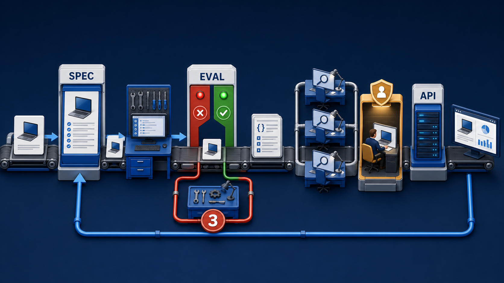
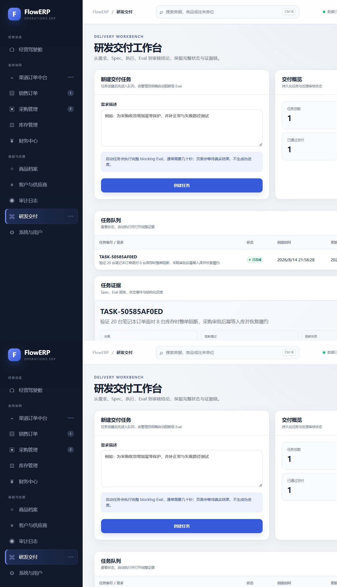
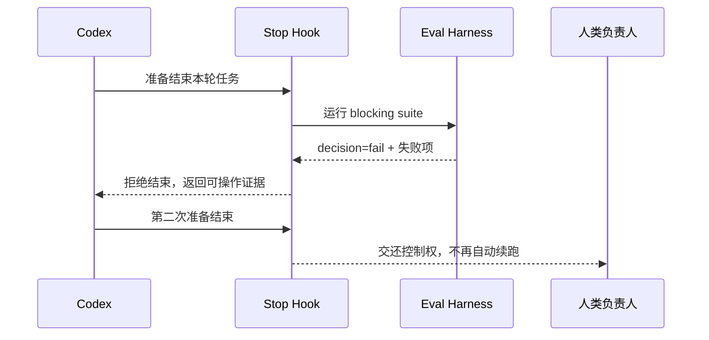
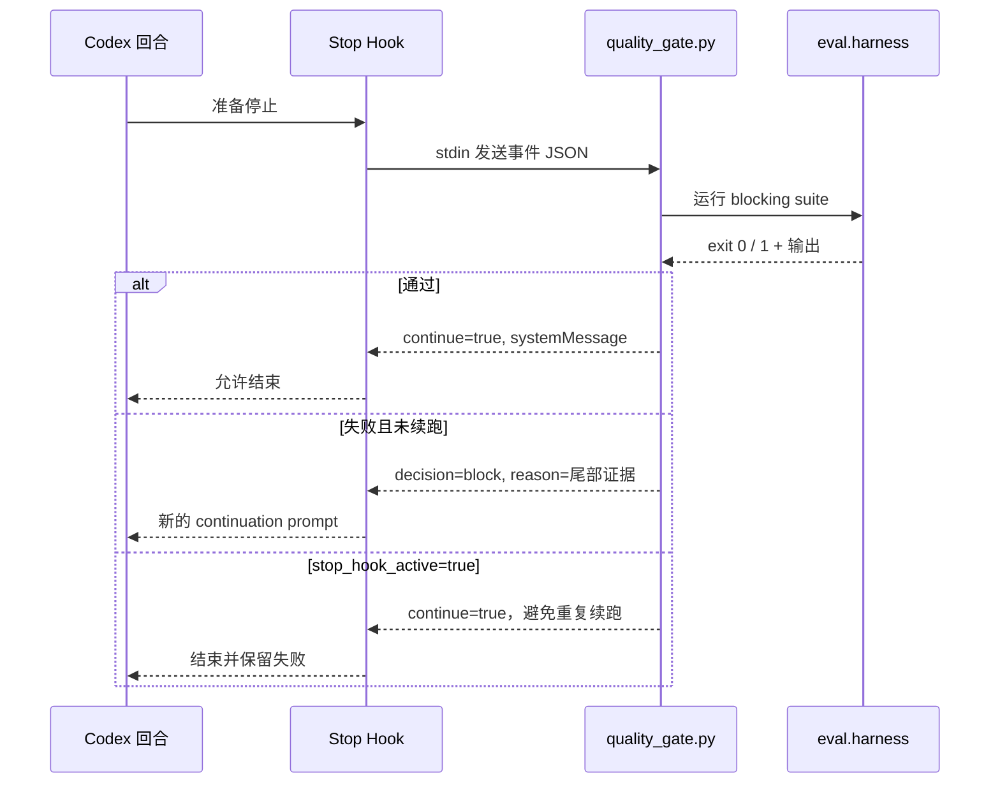
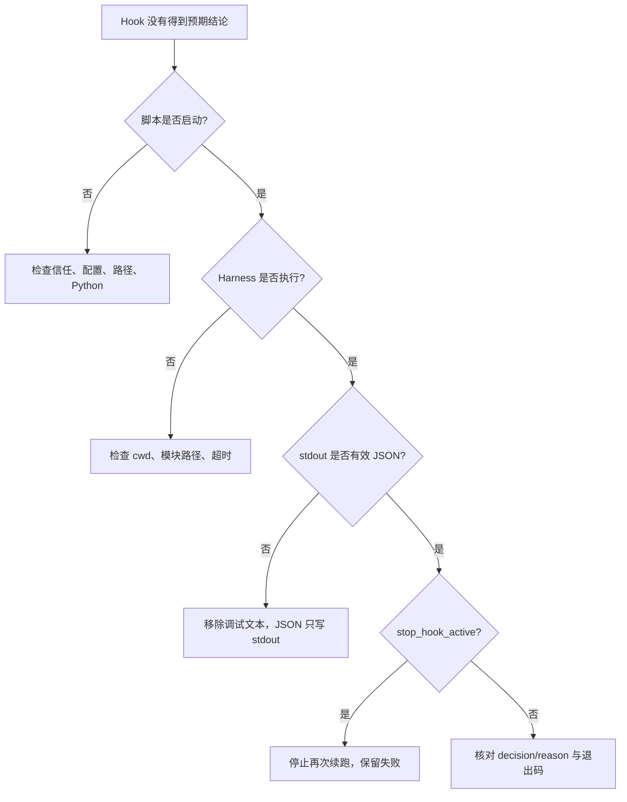

# L07｜用 Codex Hooks 建立本地护栏

<details>
<summary>本讲课程合同与建设状态（教师/助教）</summary>

- **核心内容**：生命周期 Hook、信任边界、超时、失败策略，以及 Hook 与 Git Hook 的区别。
- **演示结果**：Codex 在关键生命周期节点运行质量检查并反馈失败。
- **课内增量**：配置一个项目级质量 Hook，调用统一 Harness，而不是复制另一套质量逻辑。
- **通过标准**：Hook 来源可检查；故意引入违规时流程被阻断；恢复后重新通过。

> 课程建设状态说明：本讲 Hook 配置、处理器、协议样例和评价规则属于已经形成的课程设计；学生信任审查、三组事件证据、故障修订和达成数据属于待真实开课采集。不得用参考配置存在或讲师机器运行成功替代学生对本地护栏的理解与复验。

> **基础线唯一性**：本讲交付销售订单创建，并让项目级 Hook 只调用统一 Harness；缺货必须失败且不留脏状态，Hook 不承担修复职责。

</details>

## 连续案例｜第二幕：被遗忘的最后一道检查

**时间**：周四 10:05　**地点**：销售订单群

销售新建了一张超出可用库存的订单。服务返回缺货错误，看起来业务规则起作用了；但陈予刷新库存后发现预占数量发生过短暂变化，数据库里还留下了一条不完整订单。开发者承认自己修改后只跑了相关单测，没有执行统一 Harness。

周岚建议把验证命令写进团队群公告，顾宁摇头：“靠人记住的护栏会在最忙的时候失效。”于是团队准备在本地生命周期中加入 Hook，让关键动作结束时自动调用同一个 Harness。

Agent 随即给出一个更积极的方案：如果测试失败，Hook 自动撤销变更、重新生成代码并再跑一次。这个方案看起来减少了人工等待，却会销毁首次失败和现场状态，也让一个触发器悄悄拥有修复权限。

林默需要划清一条细线：Hook 应该可靠触发和阻断，但不能成为第二个 Harness，更不能在无人知情时改变业务代码或账本。失败后的订单、预占和库存状态还必须被明确核对。

> **决策时刻**：请写出 Hook 可以做的三件事和绝不能做的三件事。然后构造一次缺货请求，验证它既被阻断，又没有留下订单和预占脏状态；任何自动清理都必须留下原始失败证据。

本地护栏建立后，团队第一次感觉绿色更可信了。可渠道合作方不在林默的电脑上工作，远程合并依赖 CI。当天晚上，流水线给出了一个漂亮绿勾，却没有保存 Harness 报告。

## 图文学习导航

### 先进入现场：本地修改结束的那一刻，谁负责阻止脏状态离开电脑



*观察重点：Hook 是证据链中的自动触发点，不是新的质量裁判。它应复用统一 Harness，诚实传递失败，并确认缺货订单失败后没有残留预占或订单脏状态。*

**先别看答案**：如果 Hook 把失败测试自动改成跳过，开发者会看到什么“好消息”，系统又失去什么证据？先写出禁止 Hook 执行的三类动作。

本讲按“手工遗漏 → 生命周期触发 → 统一 Harness → 拒绝与清理 → 绕过实验”学习。以 [OpenAI Hooks](https://learn.chatgpt.com/docs/hooks) 核对生命周期和匹配行为，以 [Codex Security](https://developers.openai.com/codex/security) 校准最小权限与不受信任输入边界。

## 学员正文｜护栏的价值发生在你准备说“完成”的一秒前

上午十点，林默交付了销售订单创建。金额正确、明细完整，手工演示也没有异常。下午同事只改了一处状态文案，提交前忘了运行 Harness；同一批订单数据被带进候选提交。团队已经拥有裁判，却仍然依赖“记得请裁判出场”。

第一反应通常是把所有测试复制进 Hook。这条错误路线很有诱惑力：一个脚本自包含，似乎最稳定。但规则一旦变化，原 Eval、Hook 和 CI 会出现三个版本；更危险的是，Hook 可能执行仓库中的不受信任代码、打印敏感环境变量，甚至因递归触发自己而无法停止。Hook 不是第二套 Harness，它只负责在正确时机调用唯一入口，并把结果翻译成可操作的阻断消息。

先查看本讲合同和当前 Hook 配置：

```powershell
.\.venv\Scripts\python.exe -X utf8 -m workbench.cli course-contract --lesson 7
.\.venv\Scripts\python.exe -X utf8 -m workbench.cli course-eval --lesson 7
```

然后审查 `.codex/hooks.json` 与 `.codex/hooks/quality_gate.py`。你要能指出四条边界：它在什么事件运行；工作目录从哪里来；允许读取和执行什么；超时、无报告或 Harness 异常时如何表达。一个“失败后仍返回成功，只在消息里提醒”的 Hook 没有护栏作用；一个“任何 warning 都永久阻断”的 Hook 又会把观察项误写成业务门禁。

### 把关键代码读懂｜Hook 为什么不会递归续跑

```python
event = json.load(sys.stdin)
if event.get("stop_hook_active"):
    return 0
result = subprocess.run(
    [sys.executable, "-X", "utf8", "-m", "eval.harness", "--suite", "blocking"],
    text=True, capture_output=True, check=False,
)
```

- 第一行读取 Codex 传入的当前生命周期事件，不能假设每次调用都是第一次。
- `stop_hook_active` 为真时立即返回，防止 Hook 的续跑再次触发同一个 Hook。
- `sys.executable` 复用当前 Python 环境，避免 Hook 悄悄换成系统解释器。
- `check=False` 不是忽略失败；它让处理器取得 Harness 的退出码和输出，再按协议明确返回“继续”或“阻断”。

行动课先跑全绿路径：创建合法订单，确认金额与明细一致，Hook 读取新鲜报告并允许结束。随后主动制造非法数量或阻断用例失败，记录订单表在失败前后没有新增残留，再观察 Hook 是否给出具体 case、报告位置和下一条复验命令。最后模拟报告过期和处理器超时：没有新鲜证据时，系统应明确说“无法证明通过”，而不是沿用昨天的绿色。

**看似合理的错误路线**是把业务守卫搬进 Hook，例如在脚本里重新判断订单金额或库存。这样页面、服务和 Hook 会对同一业务事实作三次解释。领域不变量必须由 FlowERP 事务和 Eval 负责；Hook 只能消费 Harness 的权威结论。它防止遗漏检查，却不能代替数据库原子性和审批责任。

**第二次签字**：请说明这次提交能否结束，并列出 Hook 看到的报告身份、Harness 结论、失败后 ERP 状态和超时策略。如果你的理由只剩“Hook 返回了 0”，仍然没有证明它调用的是本次候选、同一套 Eval。

本讲结束时，本地遗忘被一道可审查的门截住。但顾宁仍不接受“我电脑上拦住了”作为合并依据：远端评审者看不到本地 Hook 的运行环境和报告。下一讲要把同一个裁判搬到独立 Runner，并证明绿色不是工作流配置制造的假象。

<details>
<summary>附录：课程合同、教师活动、技术参考与证据模板</summary>

<details>
<summary>教师备课区：课程目标、评价与持续改进</summary>

## 三载体课堂交接

- **PPT 引导决策**：使用 [PPT 逐讲决策脚本](./PPT逐讲决策脚本.md) 的“L07”四个镜头；在学生提交第一次选择、依据和最大风险前，不揭示后果页。
- **Markdown 承载教材**：本讲连续案例、图文导航与学员正文/核心章节负责查证和建模；学生必须保留第一次判断与证据驱动的第二次签字。
- **VS Code 完成行动**：打开 [课程工作区](../../course/FlowERP-AI研发工作台.code-workspace)，先运行“查看本讲合同”，再按 [L07 行动卡](../../course/tasks/L07-Codex-Hook.md) 构造失败、完成受控修改并复验。
- **回收证据**：命令、输入、退出码、报告 ID、权威状态、Diff 和剩余风险回写本讲提交包；只交投票、代码或绿色截图均退回。

> 载体顺序固定为：PPT 第一次签字 → Markdown 查证 → VS Code 行动 → Markdown 第二次签字。完整规则见 [三载体课程实施方案](./三载体课程实施方案.md)。

## 国家级一流本科课程教学设计卡

| 维度 | 本讲设计 |
|---|---|
| 对应课程目标 | CLO-3：在本地生命周期中建立可信且可恢复的质量护栏 |
| 工作台主线增量 | 将统一 Harness 接入项目级 Codex Hook，并补齐信任、超时和重入保护 |
| FlowERP 的作用 | 交付销售订单创建，用缺货失败证明领域守卫与本地结束门同时生效 |
| 高阶性 | 评价触发时机、信任边界、超时、失败策略和重入风险，设计协议而非拼接脚本 |
| 创新性 | 通过真实 stdin/stdout 事件推演 Codex 生命周期，将 Harness 结论转化为及时反馈 |
| 挑战度 | 正常、阻断、超时与重入路径都要验证；Hook 不能复制 Eval 或形成无限自触发 |
| 学生中心活动 | 学生审查 Hook 来源，预测事件输出，注入违规并恢复，最后互换安全审查记录 |
| 课程思政融入 | 启用项目脚本前先审查来源与权限，训练网络安全、供应链责任和审慎授权 |
| 形成性评价 | Hook 配置 + 三组输入输出 + Harness 引用 + 超时/重入审查 |
| 持续改进数据 | 统计重入误判率、协议输出损坏率和复制质量逻辑数量，修订模板与故障样本 |

</details>

<details>
<summary>课程合同、边界与前沿校准</summary>

## 本讲知识合同

| 合同项 | 本讲约定 |
|---|---|
| 主线起点 | L06 已有唯一 Harness，但本地执行者仍可能在结束前漏跑 |
| 唯一技术命题 | 如何在 Codex 生命周期的正确时点调用既有门禁，同时保持协议、信任和重入安全 |
| 必须掌握 | Hook 触发点；stdin/stdout JSON；项目脚本信任；`stop_hook_active`；最小可操作失败消息 |
| 能力判据 | 能解释并复现全绿结束、红灯续跑和重入不续跑三种协议路径 |
| 本讲不做 | 不复制 Eval，不扩大 Hook 权限，不证明远端提交可信，不用 Hook 代替服务端守卫 |

## 大纲锚点与前沿校准（2026-08-19）

- **大纲锚点**：项目级 Hook 只负责在关键生命周期调用 L06 Harness，并证明违规阻断、恢复后通过。
- **前沿采用**：按当前官方协议验证 stdin/stdout、结构化决定和 `stop_hook_active`；每期开课前复核协议版本。
- **不越界**：Hook 不是 Git Hook、CI、事务或授权系统，不在处理器里复制或弱化 Eval。
- **链路交接**：把可审查的本地触发合同交给 L08 做独立远程复验。详见[校准矩阵](./16讲主线与前沿校准矩阵.md)。

**主线坐标**：统一质量裁判已经存在，但仍依赖人记得运行。工程账现在增加“生命周期触发点”；它不创造新标准，只保证 Agent 准备结束、调用高风险工具或子 Agent 停止时，已有标准有机会介入。

**这一讲把系统推进到哪里**：FlowERP 交付销售订单创建，合法订单可建立，缺货订单保持订单与库存不变；工作台获得在正确时机复用 Harness 的生命周期护栏。一次缺货路径被业务守卫拒绝、一次违规候选被 Stop Hook 阻断、补齐验证后才能结束的轨迹共同构成本讲证据。Hook 不代替领域守卫，它只降低“明明有标准却忘了执行”的操作风险。

</details>

## 本讲行动工单：把仓库代码当成不受信任 Hook 来审判

学员不能直接启用讲师配置。先审查 Hook 来源、命令、权限、路径、哈希和超时，再实现处理器并用保存的事件 JSON 做协议测试：全绿、阻断、重入、畸形输入和超时。stdout 只保留协议，诊断进入 stderr；失败消息必须让陌生人能重跑 Harness。

- **工作台增量**：生命周期触发器、协议处理、信任审计、重入与超时控制；
- **FlowERP 产品状态**：由工作台交付销售订单创建；合法订单成功，缺货订单不改变订单和库存，并由 Hook 自动复用 Harness；
- **失败证据**：协议污染、无限续跑或超时中的至少一项先失败后修订；
- **迁移证据**：为另一个不可逆风险选择不同触发点并说明理由；
- **讲师硬门槛**：必须提供未启用的 Hook 和可离线重放事件，禁止让学生信任预装代码。

详见[可执行任务卡](../../course/tasks/L07-Codex-Hook.md)。

<details>
<summary>教师备课区：教学活动与达成度设计</summary>

## 本讲教学设计总览

| 项目 | 设计 |
|---|---|
| 建议学时 | 30 分钟线上精讲 + 70 分钟线下行动 + 30 分钟协议推演作业 |
| 课堂类型 | **协议推演**：用输入/输出 JSON 逐步扮演 Codex 与 Hook 处理器 |
| 核心问题 | 怎样在正确生命周期点复用既有质量门，又避免 Hook 自触发、越权和吞错？ |
| 教学重点 | 事件选择、stdin/stdout 合同、Stop 续跑语义、信任与超时 |
| 教学难点 | 区分事前阻断、事后审查和停止检查；理解 Hook 不是完整安全边界 |
| 课堂产出 | 三路径 Hook Evidence + 上线前威胁检查表 |
| 价值塑造 | 自动化护栏本身也接受审查；不能把未经信任的仓库脚本包装成安全机制 |

### 可测学习成果

| 编号 | 学习者能够 | 达成证据 | 达成标准 |
|---|---|---|---|
| L07-O1 | 为危险工具、运行后审查和完成检查选择正确事件 | 事件路由题 | 8 个场景至少 7 个正确 |
| L07-O2 | 解释 Hook 输入、输出、退出与大输出处理合同 | 协议注释 | 关键字段和错误路径完整 |
| L07-O3 | 复现全绿、阻断续跑和防循环三条路径 | Hook Evidence | 三条路径结果与 Harness 一致 |
| L07-O4 | 审查项目 Hook 的信任、权限、路径和平台差异 | 威胁检查表 | 无“写了 Hook 就安全”的结论 |

### 30 分钟线上精讲 + 70 分钟线下行动

| 场域与时间 | 学习活动 | 学生当场证据 |
|---|---|---|
| 线上 0–8 分钟 | 展示漏跑 Blocking Eval 的“完成”消息，学生先选择介入事件 | AI 介入前事件判断 |
| 线上 8–20 分钟 | 桌面推演 Stop、PreToolUse、PostToolUse 的可逆性、权限与失败策略 | 生命周期卡 |
| 线上 20–30 分钟 | 解剖最小 Hook 协议、来源信任和重入标记 | 协议注释与故障预测 |
| 线下 0–16 分钟 | 审查项目 Hook 来源、命令、工作目录、网络和最小权限后再启用 | 信任审查记录 |
| 线下 16–34 分钟 | 运行全绿与阻断续跑路径，确认二者调用同一 Harness | Hook Evidence A/B |
| 线下 34–52 分钟 | 注入重复 Stop、非法 JSON、大输出或超时 | 防循环、协议与诊断记录 |
| 线下 52–70 分钟 | 同伴执行上线评审并验证恢复后重新通过 | 威胁检查表、复验与离场票 |

### 达成度与持续改进

采集事件选择正确率、协议解析成功率、防循环成功率、错误可诊断率和误阻断率。若超过 10% 学员把 `PostToolUse` 当作事前阻断，则增加不可逆副作用推演；防循环成功率未达 100% 时不得进入真实项目配置；平台命令失败集中出现时，分设 Windows 与 POSIX 夹具而不修改质量口径。

这一集从一个很真实的疏忽开始：Codex 改完代码、总结得很好，但忘了跑 blocking。Hook 不是再造测试，而是在“准备结束”这个时间点插入一次事实检查。

当前 Codex Hooks 已不只是 Stop 一种事件：官方文档列出了 `PreToolUse`、`PermissionRequest`、`PostToolUse`、`PreCompact`、`PostCompact`、`SubagentStart`、`SubagentStop` 等生命周期点。前沿用法不是“处处挂脚本”，而是按可逆性选点：危险命令要在 `PreToolUse` 阻断；`PostToolUse` 只能审查已经发生的副作用；`Stop` 适合检查完成条件，并必须读取 `stop_hook_active` 防止无限续跑。[OpenAI Docs：Hooks](https://learn.chatgpt.com/docs/hooks)




事件链里没有“Hook 自己判定通过”的节点。Hook 只能在生命周期点触发 Harness，并把真实退出码与失败尾部送回当前回合；最终状态仍由工作流根据统一报告迁移。

</details>

## Hook 是一次漏跑 Eval 之后长出来的

事故很小，却足够真实：Codex 修复了库存函数，相关单测通过，于是准备结束；但它没有运行 blocking Harness。若此时接受摘要，`purchase_requires_approval` 或渠道幂等的回归可能直到下一次上线才暴露。团队已经有正确标准，缺的只是一个在正确时间强制调用标准的机制。



Hook 的演化目标不是“尽可能多地自动执行”，而是消灭三类时间差：改动已经发生但高风险命令尚未审查；Agent 准备结束但质量门尚未运行；子 Agent 已返回但主 Agent 还没收到结构化结果。每个触发点必须绑定一个明确的 ERP 风险：

| 触发点 | FlowERP 风险 | 合法动作 | 绝不能做的事 |
|---|---|---|---|
| `PreToolUse` | 直接改运行数据库、越权操作发布环境 | 在副作用前阻断或请求授权 | 先执行再补日志 |
| `PostToolUse` | 文件越界、测试命令异常 | 记录结果、提示复验 | 假装能够撤销已经发生的写入 |
| `Stop` | 未运行 blocking 就宣布完成 | 调用唯一 Harness，最多按策略续跑 | 在失败时把退出码改成 0 |
| `SubagentStop` | 调查结论无来源或写集冲突 | 检查结构化输出和文件范围 | 自动把子结论当最终裁决 |

本讲因此推进的不是 ERP 库存数量，而是 ERP 交付的时间控制：高风险规则不再依赖“某个人记得在最后运行”。

课堂直接向处理器喂两份事件 JSON。第一份 `stop_hook_active=false` 且仓库有 blocking 失败，预期输出：

```json
{"decision":"block","reason":"阻断级 Eval 未通过……"}
```

第二份把 `stop_hook_active` 改成 true。即使仍有失败，处理器也必须停止再次续跑，返回清楚消息，把控制权交还给人，而不是形成无穷 continuation。

```text
第一次 Stop：可以再给一次修复机会
第二次 Stop：保留失败，安全结束
完整报告：仍在 .runtime/reports，不把千行日志塞回上下文
```

主线业务没有变化，工程链却多了一个“结束前必查”的刹车。L07 的重点不是配置字段背诵，而是生命周期、协议 stdout 和防循环三个边界同时成立。

## 为什么需要“恰好在结束前”复验

开发者可以记得在提交前跑测试，但 Agent 的一轮工作可能在修改文件、解释结果后直接结束。如果验证只是 Prompt 里的一句话，它可能因上下文压缩、时间限制或失败误判而遗漏。Hook 提供生命周期触发点：当 Codex 准备停止时，项目可以运行一个受审查命令，把质量结论反馈给当前回合。

Hook 的价值是反馈时机，不是新建一套规则。`.codex/hooks/quality_gate.py` 调用 `python -m eval.harness --suite blocking`，读取退出码；通过就给出系统消息，失败就返回 `decision: block` 和最后十行证据，让 Codex继续一轮。

## Hook 运行图



官方文档明确说明，Stop Hook 成功退出时 stdout 需要是 JSON；`decision: block` 对 Stop 的含义是让 Codex继续，而不是拒绝整个任务；输入中的 `stop_hook_active` 表示当前回合已被 Stop 续跑过。详见 [OpenAI Hooks 官方文档](https://learn.chatgpt.com/docs/hooks)。

## 配置文件深读

仓库 `.codex/hooks.json` 的核心：

```json
{
  "hooks": {
    "Stop": [{
      "hooks": [{
        "type": "command",
        "command": "python3 \"$(git rev-parse --show-toplevel)/.codex/hooks/quality_gate.py\"",
        "commandWindows": "powershell -NoProfile -Command \"$r = git rev-parse --show-toplevel; python (Join-Path $r '.codex/hooks/quality_gate.py')\"",
        "statusMessage": "Running FlowERP blocking evals",
        "timeout": 120
      }]
    }]
  }
}
```

`git rev-parse --show-toplevel` 让脚本不依赖当前子目录；`commandWindows` 为 Windows 提供独立命令覆盖；`timeout` 限制门禁卡住的时间；`statusMessage` 告诉用户正在发生什么。根据当前官方文档，`commandWindows` 是 Windows 专用覆盖字段，目前实际执行的是 `type: command` 处理器。产品行为会变化，录课前需要重新核对文档与本机版本。

## Hook 处理器逐行拆解

第一步从 stdin 读取事件：

```python
event = json.load(sys.stdin)
```

第二步防循环：

```python
if event.get("stop_hook_active"):
    print(json.dumps({
        "continue": True,
        "systemMessage": "质量 Hook 已运行过一次，避免重复续跑。"
    }, ensure_ascii=False))
    return 0
```

第三步使用当前 Python 解释器运行 Harness，捕获输出但不因非零退出自动抛异常：

```python
result = subprocess.run(
    [sys.executable, "-X", "utf8", "-m", "eval.harness", "--suite", "blocking"],
    text=True, capture_output=True, check=False,
)
```

第四步把结果转成 Hook JSON。失败只附最后十行，避免把完整日志塞回上下文；完整报告仍保存在 `.runtime/reports/`。这是一种上下文压缩：给当前修复足够线索，不丢失原始证据。

## 信任与安全边界

项目 Hook 是仓库代码触发的命令，能执行的权限取决于本机环境。打开陌生仓库时，不应无条件信任。课程要求在 Codex CLI 使用 `/hooks` 检查来源、哈希和状态，阅读配置与处理器后再决定是否启用。

审查至少回答：命令运行哪个文件；是否解析了不可信参数；是否上传数据；是否读取秘密；超时是多少；失败会不会吞掉；Windows 与 Unix 命令是否等价；脚本是否只调用统一 Harness。Hook 配置本身不是安全证明，沙箱和仓库信任仍是独立控制。

## 本地实验一：全绿路径

先独立运行：

```bash
python -X utf8 -m eval.harness --suite blocking
```

确认退出 0 后，在 Codex 会话完成一个只读小任务，观察 Stop Hook 的状态消息和 `FlowERP 阻断级 Eval 已通过`。检查 `.runtime/reports/harness-blocking.json` 的时间是否对应当前回合。

如果 Hook 未触发，依次检查：当前客户端版本是否支持；项目 Hook 是否被信任；配置路径与 JSON 是否有效；命令是否能从当前目录找到 Git 根；Python 是否可用；超时是否足够。不要直接修改业务代码来“修 Hook”。

## 本地实验二：阻断与续跑

在临时分支引入 L05 的库存缺陷，先手工确认 blocking Eval 返回 1。然后让 Codex结束一轮。预期 Hook 返回 `decision: block`，`reason` 包含失败尾部，Codex得到一个 continuation prompt 并尝试修复。

关键观察：

- Hook 没有把失败伪装成工具崩溃；
- 续跑上下文只包含必要尾部，不是整份报告；
- 修复后重新验证；
- 若第二次仍失败，`stop_hook_active` 防止无穷续跑；
- 最终若未通过，任务不能宣称完成。

Hook 只允许一次续跑是保守策略。复杂修复交给 L10 的有界 Loop，它有轮数、时间、Token 和无进展控制；不要把 Stop Hook 偷偷变成无限 Agent。

## 失败模式与诊断树



尤其注意 stdout：Stop Hook 要输出 JSON，调试日志若混入 stdout 会破坏协议。调试信息应写 stderr 或文件。另一个常见错误是 Hook 脚本自己返回非零，客户端把它当执行故障；本实现通过 JSON 表达业务阻断，脚本本身正常退出。

## Hook 与 CI 的区别

| 维度 | Hook | CI |
|---|---|---|
| 时机 | 本地 Agent 回合结束前 | push / pull request |
| 环境 | 开发者当前工作区 | 独立远程 runner |
| 反馈速度 | 快 | 较慢但更独立 |
| 信任 | 项目命令需本地审查 | Workflow、Action、权限需审查 |
| 证据 | 本地报告和续跑消息 | 日志、状态、Artifact |
| 结论来源 | 同一 Harness | 同一 Harness |

Hook 不能替代 CI，因为本地环境可能有未提交文件、缓存和特殊配置；CI 也不能替代 Hook，因为远程反馈更晚、修复成本更高。二者用同一入口形成快慢两层反馈。

## 为什么不在 Hook 里复制测试

如果 Hook 写自己的 `python -m unittest ...` 清单，CI 写另一份，Harness 又有第三份，用例增删时三者很快漂移。更严重的是等级语义不同：Hook 可能把 observing 当 blocking，CI 可能漏掉备份 Eval。

正确结构是 Hook 只执行一条命令并解释退出码。质量题库、等级和报告全部在 `eval/`。这样变更一处即可影响本地、CI、Loop 和 Graph，同时也要求对 Harness 变更做更严格审查。

## 大输出、超时与可操作消息

失败时给模型多少日志是一个工程决策。太少无法定位，太多造成上下文污染。当前“最后十行 + 完整 JSON 报告路径”是课程基线。生产中可按失败项提取用例名、证据、复现命令和报告 URI。

超时也要区分：Harness 内某个 Eval 超时属于质量执行失败；Hook 命令达到 120 秒属于生命周期基础设施失败。两者应使用不同错误消息。用户必须知道是业务规则没过，还是门禁没能完成。

## 本讲证据包

```markdown
# Hook Evidence

- Codex 版本：
- 配置来源与哈希：
- 审查人/时间：
- 正常路径：Harness exit 0，Hook systemMessage：
- 阻断路径：失败用例、decision、reason 尾部：
- 防循环：第二次事件 stop_hook_active=true 的输出：
- 完整报告位置：
- Windows/Unix 命令差异：
- 剩余风险：项目 Hook 仍是本地可执行代码，需要仓库信任。
```

<details>
<summary>讲师用：验收、练习与评分</summary>

## 验收、作业与下一讲

### 验收

- [ ] Hook 只调用统一 blocking Harness；
- [ ] 首次使用前审查来源、内容和信任状态；
- [ ] 全绿时允许结束并返回清楚消息；
- [ ] 阻断时返回 `decision: block` 和可操作证据；
- [ ] `stop_hook_active` 防止无限续跑；
- [ ] Windows 使用正确路径覆盖；
- [ ] 超时和大输出有边界；
- [ ] 未收敛时不宣称成功。

### 作业

为自己的项目接入一个 Stop Hook，要求调用现有唯一质量入口。提交一次全绿、一次阻断、一次防循环证据，并写出陌生仓库启用 Hook 前的审查清单。

### 评分

| 项目 | 分值 | 合格表现 |
|---|---:|---|
| 单一质量入口 | 25 | Hook 只负责时机和反馈，不复制 Eval 逻辑 |
| 协议正确 | 20 | stdin/stdout JSON、事件字段和退出行为正确 |
| 防循环与超时 | 20 | 一次续跑后安全停止，异常与超时有界 |
| 安全审查 | 25 | 信任、权限、路径、平台命令和失效边界明确 |
| 诊断体验 | 10 | 消息可操作，完整报告可追溯，大输出不污染上下文 |

下一讲把同一个 Harness 接到 GitHub Actions。远程 runner 会帮我们发现“只在我的电脑通过”的隐式依赖，并把报告与提交永久关联。


</details>
## Hook 上线前的桌面推演

把 Hook 当成会自动执行的仓库程序，至少推演五种输入：正常 Stop；blocking 失败；`stop_hook_active=true`；stdin 不是合法 JSON；Python/Harness 无法启动。当前脚本前三种有清楚路径，后两种会作为处理器异常暴露。正式使用可以将协议错误写到 stderr，并保证不会输出半截 JSON。

还要检查 Hook 是否改变用户正在处理的工作区。质量 Hook 应只读业务代码，只在 `.runtime/reports` 写报告；它不自动格式化、不更新依赖、不提交文件。若门禁需要网络，应明确网络失败语义和数据边界。FlowERP 主线全部使用本地标准库，避免 Hook 因外部服务波动阻断。

最后做一次“证据新鲜度”检查：在 Hook 触发前记下时间，结束后读取报告 `generated_at` 和当前 commit。旧报告即使全绿也不能放行。Hook 的专业价值不在于自动多跑一条命令，而在于把正确命令放到正确时机，并把新鲜、可操作、不会无限续跑的反馈交还给执行者。

## 本地门拦住了你，却还没有说服远端评审者

### Hook 选点矩阵：越不可逆，越要提前拦

| 事件 | 适合做什么 | 不应做什么 | FlowERP 示例 |
|---|---|---|---|
| `PreToolUse` | 参数校验、危险命令阻断、输入改写 | 执行耗时完整测试 | 拦截直接改运行数据库 |
| `PermissionRequest` | 根据任务合同辅助审批 | 用模型自述替代真实授权人 | 检查写集扩张理由 |
| `PostToolUse` | 审查输出、记录证据、触发后验告警 | 假装撤销已完成副作用 | 标记命令无退出码或报告缺失 |
| `SubagentStop` | 检查子任务证据是否完整 | 无限要求“再想一次” | 要求返回文件位置与验证命令 |
| `Stop` | 运行完成 Gate、有限续跑 | 复制 Harness 或吞掉最终失败 | blocking 失败时一次续跑 |

Hook 的高级用法不是数量，而是时机语义。对不可逆动作，后验提醒已经太晚；对长测试，在每个工具调用前执行又会拖垮体验。学员要能根据副作用、成本和恢复能力选择事件，并为 Hook 自身写超时、输出上限和递归保护测试。

Hook 与当前工作区、当前解释器和当前操作者绑在一起；它可以被未安装、被配置差异或本机残留环境绕过。第 8 讲把相同 Harness 放进干净的 CI Runner，让 commit、退出码和完整 JSON Artifact 形成第三方可复验关系。注意：远程红灯也不是修复方案，它只是下一章要压缩的原始案卷。

</details>
