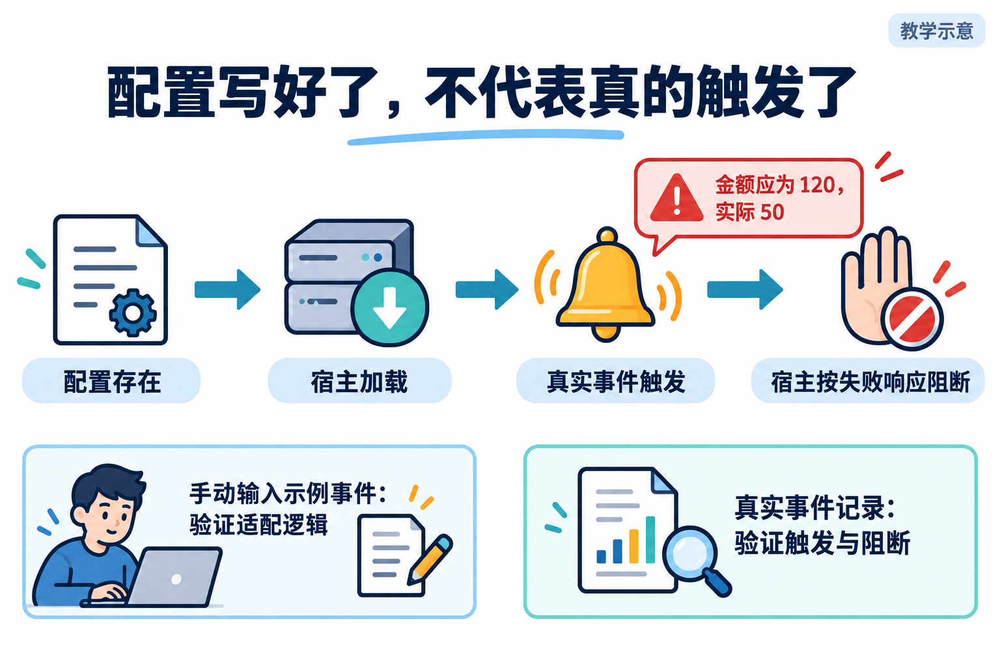
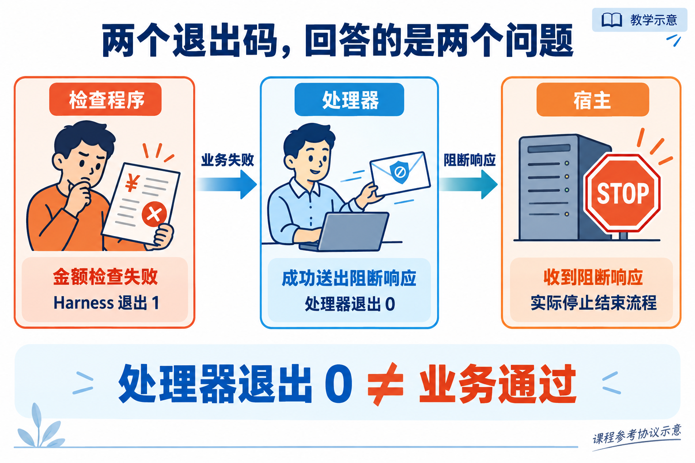

# L07 案例配图生成说明

生成日期：2026-09-26。使用内置 ImageGen，全部为教学示意，不是运行截图或个人验收证据。

图片已嵌入[辅导资料](../../辅导资料.md)。初稿与修订源图保留于生成目录，本目录仅保存采用的最终图片。

## 配置到真实阻断的证据链



### 原始提示词

```text
Use case: scientific-educational. Generate one landscape Chinese textbook illustration 3:2. White background, navy headings, blue teal orange accents, tasteful editorial line illustrations, large legible simplified Chinese, ample whitespace, no fake screenshots. Small corner label “教学示意”. Visual explanations not text-heavy slides. All specified Chinese labels exact. 标题“配置写好了，不代表真的触发了”。四个沿水平单向箭头的阶段，分别配文件、加载器、铃铛、停止手势插画。文字依次“配置存在”“宿主加载”“真实事件触发”“宿主按失败响应阻断”。在第三和第四之间显示小红检查报告“金额应为 120，实际 50”。底部左侧独立小框“手动输入示例事件：验证适配逻辑”，底部右侧“真实事件记录：验证触发与阻断”，两框无连接箭头，不可混淆。不要出现具体软件UI或版本号。
```

## 业务退出码与处理器退出码



### 原始提示词

```text
Use case: scientific-educational. Generate one landscape Chinese textbook illustration 3:2. White background, navy headings, blue teal orange accents, tasteful editorial line illustrations, large legible simplified Chinese, ample whitespace, no fake screenshots. Small corner label “教学示意”. Visual explanations not text-heavy slides. All specified Chinese labels exact. 标题“两个退出码，回答的是两个问题”。左至右三个清晰面板：检查程序面板“金额检查失败”“Harness 退出 1”，橙红色；处理器面板“成功送出阻断响应”“处理器退出 0”，蓝色，以递送封信形象表现；宿主面板“收到阻断响应”“实际停止结束流程”，橙色停止标志。左到中箭头“业务失败”，中到右箭头“阻断响应”。底部大字“处理器退出 0 ≠ 业务通过”。角落补充小字“课程参考协议示意”，不添加任何其他退出数字。
```
