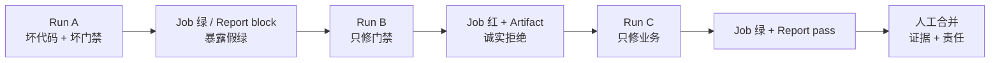
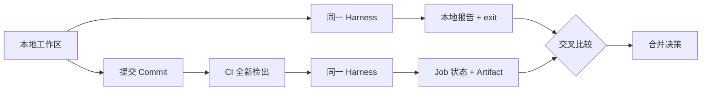
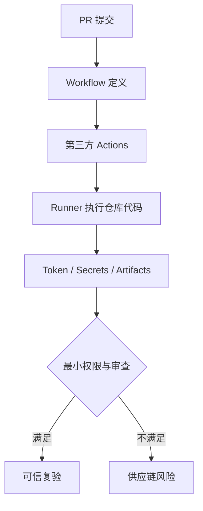

# L08｜把同一套 Eval 接入 CI

<details>
<summary>本讲课程合同与建设状态（教师/助教）</summary>

- **核心内容**：本地快速反馈与远程可信复验；候选分支、报告归档和人工合并。
- **演示结果**：不合格变更在 CI 中失败，修复后生成通过报告。
- **课内增量**：配置 CI 工作流并上传 Harness 报告。
- **通过标准**：本地与 CI 使用同一入口；非零退出码阻断候选变更；自动修复不直接合并主分支。
- **挑战任务**：失败后只创建候选分支或草稿 PR，并附上失败证据。

> 课程建设状态说明：本讲 Workflow 故障工单、证据信封接口和评价规则属于已经形成的课程设计；学生 A/B/C 三次真实 Run、Artifact 取证、同伴法证和达成数据属于待真实开课采集。已有 CI 绿灯或模拟 Run ID 不能替代绑定真实提交的学生复验证据。

> **基础线唯一性**：本讲用 A 缺证据、B 真实红灯、C 原子预占绿灯三次 Run 完成 `stock_never_negative` 的 CI 证据链；本讲不扩建 ERP，不再新增第二项业务功能。

</details>

## 连续案例｜第二幕：一枚没有证据的绿色徽标

**时间**：周四 21:15　**地点**：远程代码评审

渠道接入分支的 CI 结束了。提交页上只有一个绿色徽标和“workflow completed”，没有 Harness 原始输出、JSON 报告、执行命令或提交身份。周岚问：“既然系统都判绿了，我们为什么还不合并？”

顾宁把这次运行标为 Run A：结论不是通过，而是“证据不足”。为了证明这不是吹毛求疵，林默让团队故意把原子预占缺陷带入隔离分支。Run B 稳定出现红灯，并保留了两个并发订单争抢库存时的状态；只有在这个真实红灯可复现之后，学生才被允许修复。

修复后的 Run C 使用与本地相同的 Harness 入口，保存提交哈希、命令、退出码、逐项结果和产物。另一组同学不看作者解释，只根据证据信封判断能否合并。此时三次运行都“执行结束”，但只有一次有资格证明交付。

周岚终于看见，CI 不是把本地命令搬到云端；它的价值是让不在现场的人能够对同一提交作出同一裁决。绿色如果没有来源和原始证据，比红灯更危险，因为它会终止追问。

> **决策时刻**：在 Run A、B、C 中分别签署“通过、失败、未知”之一，并写出合并条件。你必须保留可信红灯，不能只提交最终绿图；同伴应能从产物独立还原裁决。

第二周结束时，团队终于拥有本地与远程一致的质量链。但质量链下一次失败时，报告会长到几百行。怎样把失败压缩成一个既足够小、又不丢失证据的修复授权，将成为第三周的第一个难题。

## 图文学习导航

### 先进入现场：绿色徽标可能只说明工作流结束，没有说明质量被检查


*观察重点：可信 CI 需要身份、提交、命令、退出码、产物和业务状态共同组成证据信封。缺少原始日志与产物的绿色，只能判为“未知”。*

**先别看答案**：先比较三张证据卡——A 只有绿色徽标，B 有真实红灯与原始日志，C 有同一提交的绿灯、报告和状态。你会允许哪一张进入合并，为什么？

本讲按“Run A 假绿 → Run B 可信红 → 原子预占修复 → Run C 可信绿 → 同伴法证”学习。用 [GitHub Workflow Artifacts](https://docs.github.com/en/actions/concepts/workflows-and-actions/workflow-artifacts) 核对运行后证据持久化，用 [GitHub Actions 安全指南](https://docs.github.com/en/actions/how-tos/secure-your-work?tool=webui) 检查不受信任输入与最小权限。

## 学员正文｜绿色徽标不是证据，它只是一个待审讯的结论

顾宁把 PR 页面投到大屏上：徽标是绿色，日志末尾写着 success。周岚准备点击合并，却发现页面没有 Harness JSON，也找不到运行的提交 SHA。继续向上翻，Workflow 对测试步骤设置了忽略失败，后面的“发布成功”仍然执行。这个绿色不是质量结论，而是配置事实。

本讲不从编写 YAML 开始，而从三次运行开始。Run A 必须保留假绿：原子预占仍有缺陷，工作流却返回成功。它证明门禁会撒谎。Run B 修复门禁但不修业务，让同一缺陷可靠变红，并上传即使失败也能下载的 Evidence Envelope。Run C 才允许修复业务，让同一入口转绿。把三步压成一次提交，会丢失“是门坏了，还是产品坏了”的因果证据。

先确认本讲合同与本地入口：

```powershell
.\.venv\Scripts\python.exe -X utf8 -m workbench.cli course-contract --lesson 8
.\.venv\Scripts\python.exe -X utf8 -m workbench.cli course-eval --lesson 8
```

接着阅读 `.github/workflows/`：触发条件是否覆盖目标分支；Runner 是否固定 Python 版本；依赖是否来自可审查来源；失败时报告上传步骤是否仍执行；最终 job 结论是否保留 Harness 的退出码。最常见的错误路线是“为了拿到 Artifact，把整个 job 设成继续执行”，结果上传成功覆盖了测试失败。正确做法是只让证据收集步骤在失败后继续，质量步骤本身保持红色。

### 把关键配置读懂｜失败时上传证据，不能把失败改绿

```yaml
- name: Unified blocking gate
  run: python -X utf8 -m eval.harness --suite blocking
- name: Upload machine-readable evidence
  if: always()
  uses: actions/upload-artifact@v4
```

- 第一项直接运行与本地相同的阻断入口；它的非零退出码必须让 job 保持红色。
- `if: always()` 只属于证据上传步骤，意思是前一步失败后仍保存报告。
- 上传成功只证明 Artifact 已归档，不能覆盖质量步骤的失败结论。
- 审计时同时检查 gate 结论和 Artifact 身份；二者缺一都不能叫可信绿灯。

Run A、B、C 都要记录 workflow 文件版本、提交 SHA、Harness schema、Artifact 身份和 job 结论。同伴只能拿到远端材料，不听作者解释，然后回答：哪一次是假绿；哪一次证明门禁有效；哪一次同时证明门禁和业务候选有效。若必须打开聊天记录才能回答，证据信封还不完整。

**看似合理的错误路线**还包括用另一套“更快的 CI 测试”代替本地 Harness。短期节省分钟，长期让同一提交在两个环境得到不同裁判。允许差异的是执行环境和证据包装，不允许差异的是 case 身份、等级语义和总决策合同。

**第二次签字**：你是否允许合并 Run C？必须同时引用 A 的假绿证据、B 的可信红、C 的可信绿，以及同伴法证结论。只展示最终绿色会掩盖你是否真正修复过门禁。

CI 终于能独立复验原子预占，但红色 Artifact 仍然只是事实集合。下一次取消订单失败时，Agent 面前会出现数千行日志；如果没有最小授权，自动修复仍可能越界。下一讲把红灯压缩成一张可执行、可拒绝的 Repair Task。

<details>
<summary>附录：课程合同、教师活动、技术参考与证据模板</summary>

<details>
<summary>教师备课区：课程目标、评价与持续改进</summary>

## 三载体课堂交接

- **PPT 引导决策**：使用 [PPT 逐讲决策脚本](./PPT逐讲决策脚本.md) 的“L08”四个镜头；在学生提交第一次选择、依据和最大风险前，不揭示后果页。
- **Markdown 承载教材**：本讲连续案例、图文导航与学员正文/核心章节负责查证和建模；学生必须保留第一次判断与证据驱动的第二次签字。
- **VS Code 完成行动**：打开 [课程工作区](../../course/FlowERP-AI研发工作台.code-workspace)，先运行“查看本讲合同”，再按 [L08 行动卡](../../course/tasks/L08-CI远程复验.md) 构造失败、完成受控修改并复验。
- **回收证据**：命令、输入、退出码、报告 ID、权威状态、Diff 和剩余风险回写本讲提交包；只交投票、代码或绿色截图均退回。

> 载体顺序固定为：PPT 第一次签字 → Markdown 查证 → VS Code 行动 → Markdown 第二次签字。完整规则见 [三载体课程实施方案](./三载体课程实施方案.md)。

## 国家级一流本科课程教学设计卡

| 维度 | 本讲设计 |
|---|---|
| 对应课程目标 | CLO-3：让确定提交在独立远端环境接受同入口复验 |
| 工作台主线增量 | 增加 CI 门禁 Spec、远端复验、证据信封、失败归档、提交身份和最小权限配置 |
| FlowERP 的作用 | 提供原子预占真实缺陷：A 假绿、B 只修门禁诚实红、C 再交付业务修复可信绿 |
| 高阶性 | 比较本地与 CI 的信任差异，评价提交身份、环境、Artifact、最小权限和供应链风险 |
| 创新性 | 以“报告阻断但 Job 假绿”驱动门禁抢修，再用 A/B/C 因果隔离与同伴法证替代成品演示 |
| 挑战度 | 必须复现假绿、只修门禁得到诚实红、冻结裁判后修业务得到可信绿；身份错配或证据缺失均退回 |
| 学生中心活动 | 学生写门禁 Spec、实现证据信封、完成 A/B/C 三次 Run，并交换证据包进行盲判 |
| 课程思政融入 | 用最小权限、可追责提交和不隐藏失败落实网络安全、团队责任与工程诚信 |
| 形成性评价 | 门禁 Spec + Workflow/Python Diff + A/B/C 身份 + Artifact 哈希 + 同伴法证结论 |
| 持续改进数据 | 统计假绿识别率、失败报告缺失率、两阶段修改越界率和同伴盲判正确率，更新故障夹具 |

</details>

<details>
<summary>课程合同、边界与前沿校准</summary>

## 本讲知识合同

| 合同项 | 本讲约定 |
|---|---|
| 主线起点 | L07 只能保护一个本地工作区，团队还不能独立复验确定提交 |
| 唯一技术命题 | 如何把同一质量入口绑定到 commit SHA、远端环境和失败时仍存在的 Artifact |
| 必须掌握 | 本地/远端同源入口；SHA 与 Run 身份；失败仍归档；最小权限；供应链与环境故障分类 |
| 能力判据 | 能用 A/B/C 三次 Run 证明“坏门禁假绿—门禁修复诚实红—产品修复可信绿”，并由同伴重算证据身份 |
| 本讲不做 | 不自动合并，不自动修复，不给不受信任代码部署密钥，不用最终截图覆盖红灯历史 |

## 大纲锚点与前沿校准（2026-08-19）

- **大纲锚点**：本地与 CI 必须使用同一入口；非零退出码阻断候选变更；失败报告仍归档，合并保持人工决定。
- **前沿采用**：最小权限、提交 SHA 与运行环境绑定是基础；Artifact Attestation 和 SBOM 只作供应链增强。
- **不越界**：来源证明不等于制品安全，不自动修复或合并，也不把 CI 平台功能数量当学习成果。
- **链路交接**：向 L09 交付绑定提交、报告身份和复现命令的失败事实。详见[校准矩阵](./16讲主线与前沿校准矩阵.md)。

**主线坐标**：Hook 把质量门放到本地生命周期，CI 要把同一结论搬到团队共同控制的远端环境。FlowERP 从一个会部分预占的缺陷候选 A 出发，先只修门禁得到诚实红 B，再修业务得到原子预占可信绿 C；本讲不再增加第二项 ERP 功能。

**这一讲把系统推进到哪里**：FlowERP 关键规则开始与不可混淆的提交身份绑定；工作台从个人会话能力升级为团队可独立复验的远端控制；假绿 A、诚实红 B、可信绿 C 和可复算 Evidence Envelope 构成证据。它解决的不是“自动跑测试”，而是作者不能让坏门禁替自己挑选有利结果。

- **FlowERP 产品状态**：A 保留部分预占缺陷并假绿，B 只修门禁得到诚实红，C 再交付整单原子预占得到可信绿。

</details>

## 本讲行动工单：不是看 CI，而是修一条会撒谎的门禁

如果课堂只让学员阅读一份已经正确的 YAML、看讲师推送一次红灯，再填写 Run ID，这一讲没有达到行动课标准。L08 必须给学员一条**会把阻断报告显示成绿色的故障流水线**，并要求学员亲手完成三次远端实验：

| Run | 产品代码 | CI 门禁 | 预期现象 | 学员必须证明什么 |
|---|---|---|---|---|
| A：假绿 | 保留原子预占缺陷 | 吞掉 Harness 非零退出码 | Job 绿色，但报告 `decision=block` | 颜色与裁判矛盾，CI 会撒谎 |
| B：诚实红 | 与 A 的业务代码相同 | 学员修复 Workflow 和证据绑定 | Job 红色，失败报告仍可下载 | 门禁修复没有偷偷修业务代码 |
| C：可信绿 | 交付整单原子预占 | 与 B 使用同一门禁 | Job 绿色，报告 `decision=pass` | 绿色来自 ERP 产品增量，不是再次放宽门禁 |

学员不是“配置一下 CI”，而是完成一张真实工程工单：

> 修复 FlowERP 远程质量门禁中的假绿和失败失明；把报告绑定到不可混淆的 Run；证明门禁修复与业务修复是两个独立提交；将 B/C 证据包交给陌生评审者复验。

### 主次账本：FlowERP 提供事故，工作台吸收能力

原子预占是本讲唯一 ERP 产品增量；除此之外，本讲不扩建 ERP 产品面。事故用于校准门禁，能力沉淀在工作台。

| 层次 | 本讲只承担什么 | 本讲不承担什么 | 时间与评分约束 |
|---|---|---|---|
| FlowERP 案例 | 提供 L08 原子预占缺陷候选、签字验收项和真实业务损失，使 CI 有确定性 A/B 输入，并在 C 完成最小修复 | 不新增第二项 ERP 功能，不扩展库存、采购、API 或页面，不用代码量替代门禁证据 | C 只做签字范围内最小修复；不单独按 ERP 代码量评分 |
| 个人研发自动化工作台 | 新增门禁 Spec、可信 Workflow、Evidence Envelope、失败归档和远程身份核验 | 不复制第二套业务规则，不把 CI 写成 FlowERP 专用脚本 | 占主要课堂时间和至少 80% 评分证据 |
| 学生能力证据 | 证明能发现假绿、隔离门禁/业务因果、让陌生人复验，并识别可迁移边界 | 不以参考仓库已实现、讲师 Run 或截图替代本人操作 | 必须有首次判断、失败、修订、互评和非 FlowERP 耦合检查 |

Run C 是本讲唯一真实 ERP 交付，而不是预装答案。学生必须冻结 Workflow、Harness、Eval、等级和期望值，再依据签字验收项完成最小原子预占修复；若扩展库存、采购、页面或接口，视为偏离课程主线。

### 学员必须亲手产生的六项作品

1. **`CI_GATE_SPEC.md`**：先写六条门禁不变量，包括非零不吞、非取消场景仍产报告、报告缺失显式失败、最小权限、结果绑定 Run、禁止自动合并。
2. **Workflow Diff**：从故障版修到可信版，不能复制参考答案后只改文件名。
3. **`workbench/ci_evidence.py` 与对应测试**：读取 Harness JSON，计算 SHA-256，绑定 `GITHUB_SHA`、`GITHUB_RUN_ID`、Workflow、runner 和 Python；缺报告或缺身份必须非零退出。
4. **Run A/B/C 证据包**：三个 SHA、三个 Run、B/C 两份不可混淆 Artifact、命令、结论与报告哈希。
5. **同伴法证结论**：不看作者解释，只用 Evidence Envelope 判断 B 为什么必须拒绝、C 为什么可以进入人工合并。
6. **可迁移性检查**：`ci_evidence.py` 不导入 `flowerp`，并能在测试中消费第二份非 FlowERP 命名、但遵循同一报告合同的夹具；学生列出可复用字段与项目特定字段。

这些产物共同形成约 40～80 行 Python、一个 Workflow 补丁、至少三次远端运行和一次陌生人复验。只交截图、只改 YAML 缩进或只交 Run C，均不算完成。

### 讲师开课前硬门槛

- 为每名学员或每两人小组准备可触发 CI 的独立训练仓库/分支，开启 Run 与 Artifact 保留；
- 起点必须是故障版 Workflow 和 L08 原子预占缺陷候选，不得把修复补丁或完整答案预装给学员；
- 保留受保护主分支，学员只在 `lab/l08-*` 候选分支工作；不配置生产秘密；
- 预先验证 Run A 能稳定出现“Job 绿、Harness block”的矛盾，Run B 能红且可下载报告；
- 没有真实远端 Runner、不可下载 Artifact 或无法保存 Run 身份时，只能进行预习，不能判定 L08 达成。

<details>
<summary>教师备课区：教学活动与达成度设计</summary>

## 本讲教学设计总览

| 项目 | 设计 |
|---|---|
| 建议学时 | 30 分钟线上精讲 + 110 分钟线下工程工单；远程排队时间不计入有效操作时长 |
| 课堂类型 | **假绿门禁抢修 + CI 尸检**：先让 CI 当场撒谎，再修门禁、修业务并交换取证 |
| 核心问题 | 怎样让远端对同一质量合同独立作证，并在失败时仍留下完整材料？ |
| 教学重点 | 本地/远端同一入口、提交身份、失败 Artifact、最小权限、分支保护 |
| 教学难点 | 区分代码缺陷、环境漂移、Workflow 缺陷和证据缺失 |
| 课堂产出 | `CI_GATE_SPEC.md` + Workflow Diff + Evidence Envelope 生成器及测试 + A/B/C 三次 Run + 同伴法证报告 |
| 价值塑造 | 不挑选有利 Run，不因失败删除 Artifact，让团队共享同一事实基础 |

### 可测学习成果

| 编号 | 学习者能够 | 达成证据 | 达成标准 |
|---|---|---|---|
| L08-O1 | 证明本地与 CI 调用同一 Harness 和等级协议 | Workflow 对照表 | 命令与报告路径一致 |
| L08-O2 | 从红色 Run 还原 commit、runner、首个失败和 Artifact | CI 尸检报告 | 四项身份无混淆 |
| L08-O3 | 设计失败时也上传证据的 Workflow | Workflow Diff | B/C 均有可下载报告，缺报告显式失败 |
| L08-O4 | 审查 token、第三方 Action 和分支保护边界 | 供应链检查表 | 权限最小且版本策略明确 |
| L08-O5 | 实现并验证远程证据信封 | `ci_evidence.py`、测试与 JSON | 缺报告/身份会失败，哈希可由同伴重算 |

### 30 分钟线上精讲 + 110 分钟线下工程工单

| 场域与时间 | 学习活动 | 学生当场证据 |
|---|---|---|
| 线上 0–8 分钟 | 只给一张红灯截图，学生先判断能否证明当前提交有缺陷 | AI 介入前证据充分性判断 |
| 线上 8–20 分钟 | 建立 commit、Workflow、Run、Artifact 和环境身份链 | 远程证据身份索引 |
| 线上 20–30 分钟 | 只审读故障版 Workflow，不给答案；学生预测哪项规则会造成假绿或失明 | 故障假设与门禁不变量初稿 |
| 线下 0–15 分钟 | 推送 L08 原子预占缺陷候选和故障 Workflow，触发 Run A；比较绿色 Job 与 `decision=block` | 假绿矛盾截图、SHA、Run ID、报告字段 |
| 线下 15–30 分钟 | 写 `CI_GATE_SPEC.md`，把假绿、早停、缺报告、过宽权限变成六条可测不变量 | 门禁 Spec 与同伴反例 |
| 线下 30–60 分钟 | 实现 `ci_evidence.py` 及正常/缺报告/缺身份测试；补 Workflow 失败续跑与最小权限 | Python Diff、测试红绿、Workflow Diff |
| 线下 60–78 分钟 | 产品代码不变，只提交门禁修复，触发 Run B；下载报告和证据信封并重算哈希 | 诚实红、A→B 文件边界、Artifact B |
| 线下 78–88 分钟 | 冻结 Workflow/Harness/Eval，依据签字验收项完成最小原子预占修复，触发 Run C | 可信绿、B→C 文件边界、Artifact C |
| 线下 88–100 分钟 | 用非 FlowERP 命名的第二报告夹具验证证据信封无业务耦合，列出通用/项目字段 | 迁移测试与边界表 |
| 线下 100–110 分钟 | 与另一组交换 B/C 证据包，盲判结论并审查权限与 Action 固定策略 | 同伴法证报告、具名人工合并结论 |

### 达成度与持续改进

采集假绿识别率、A→B 业务代码不变证明率、失败 Artifact 可得率、Evidence Envelope 测试通过率、B→C Workflow 不变证明率和同伴盲判正确率。失败 Artifact 可得率必须为 100%；若超过 10% 学员只保留 C 的绿色结果，则下一期先验收 A/B/C 身份索引再允许修业务代码。

本讲不是“一红一绿”演示，而是三段因果隔离：先证明坏门禁会撒谎，再证明只修门禁就能让同一缺陷诚实变红，最后证明只修产品才能转绿。三次 Run 必须并排展示：

```text
Run A / broken gate: product=bad, report=block, job=success  -> false green
Run B / fixed gate:  product=bad, report=block, job=failure  -> honest red
Run C / fixed code:  product=fix, report=pass,  job=success  -> trustworthy green
```


课堂对照 CI Artifact 与页面时，不比颜色，只比数据合同：Eval 名称、`level`、`passed`、`evidence` 与 summary 必须一致。截图只是辅助说明，不能替代学生自己的 Run、Artifact、哈希和代码边界证明。

</details>

## CI 是 FlowERP 从“我电脑上正确”走向“这个提交可接受”的产物

本地 Hook 解决的是执行者忘记复验，仍解决不了团队协作中的身份问题：运营看到的是哪次构建？评审者下载的报告属于哪个 commit？修复提交是否真的覆盖了上一份红色证据？当渠道订单和采购模块可能由不同人员修改时，工作台必须把 FlowERP 的质量结论绑定到不可含糊的代码版本。

一份可审计的远程证据至少包含下面这个五元组：

```text
Evidence = (commit_sha, workflow_run_id, suite, report_digest, conclusion)
```

少一个字段都会产生漏洞。没有 `commit_sha`，绿色可能属于旧代码；没有 `suite`，无法知道是否只跑了快速检查；没有 `report_digest`，下载文件可能被替换；没有独立 `conclusion` 与退出码核对，页面颜色可能和实际命令不一致。

| 远端场景 | FlowERP 事实 | CI 必须留下什么 |
|---|---|---|
| 假绿 A | L08 原子预占缺陷仍在，坏门禁吞掉非零 | 绿色 Job 与 `decision=block` 的矛盾、A 的 commit 与报告 |
| 诚实红 B | 业务代码与 A 相同，只修门禁 | 非零 Job、失败 Eval、B 的 commit、失败 Artifact 与信封 |
| 可信绿 C | 门禁与 B 相同，只修业务缺陷 | 绿色 Job、同一 Eval、C 的 commit、新 Artifact 与信封 |
| Workflow 自身失败 | 依赖安装或脚本语法错误 | `infrastructure_error`，不能伪装成业务失败 |
| Observing 失败 | 低风险指标未达标 | 报告保留，但不改变 blocking 决策 |



这一步让工作台从个人自动化演化为团队可共同验证的交付系统。它仍不替业务负责人批准补货，也不自动部署 FlowERP；它只回答一个更窄但关键的问题：当前候选提交是否满足已经签字的 ERP 质量合同。

如果单测先挂导致 Harness 没跑，结论只能是“评测未完成”，不能写“blocking=0”。如果失败时没有 Artifact，最需要证据的时候反而失明。`if: ${{ !cancelled() }}` 与缺文件显式失败不是 YAML 小技巧，而是本讲要用反例验证的证据完整性控制。

本讲结束，FlowERP 已在可信门禁下交付整单原子预占，工程账第一次拥有独立于开发者电脑且与提交绑定的 A/B/C 证据。我们还没有授权任何自动修复；下一讲将使用新的“取消未释放预占”红色报告，把失败压成一页修复合同。

## “我本地通过”还缺什么

本地工作区可能有未提交文件、缓存、环境变量、预热数据库和不同 Python 版本。开发者说“测试通过”是重要证据，但它不是独立证据。CI 从提交内容重新检出代码，在已声明环境执行固定命令，能揭示隐式依赖，并把结果绑定到 commit 和 pull request。

CI 的信任也不是天然的。云上跑过不等于正确：Workflow 可能漏跑 blocking，失败步骤后报告没有上传，Job 权限过大，秘密暴露给仓库代码，或者脚本用 `|| true` 吞掉退出码。可信 CI 需要最小权限、唯一入口、失败可见和产物不可省略。

## 故障版 Workflow：学员的起点，不是参考答案

讲师在训练分支提供以下等价故障，不公布修复版。具体 Action 版本由开课时锁定；这里故意省略无关步骤，让学员聚焦门禁语义：

```yaml
name: Broken FlowERP Gate

on: [pull_request]

permissions: write-all

jobs:
  blocking-evals:
    runs-on: ubuntu-latest
    steps:
      - uses: actions/checkout@<teaching-pinned-version>
      - uses: actions/setup-python@<teaching-pinned-version>
        with:
          python-version: "3.12"
      - name: Blocking gate
        run: python -X utf8 -m eval.harness --suite blocking || true
      - name: Upload report
        uses: actions/upload-artifact@<teaching-pinned-version>
        with:
          name: harness-report
          path: .runtime/reports/harness-blocking.json
```

学生不得先看仓库成品 Workflow。先触发 Run A，再用报告里的 `decision=block` 反证绿色 Job。随后根据自己的 `CI_GATE_SPEC.md` 修复，而不是逐行猜讲师答案。

修复后的 Workflow 必须通过行为验证，而不是靠 YAML 目测：

| 不变量 | 必须制造的反例 | 合格行为 |
|---|---|---|
| Harness 非零不可吞 | L08 原子预占缺陷仍存在 | Run B 失败，不能 `continue-on-error` 或 `|| true` |
| 前置测试失败不能让证据消失 | 临时让 unittest 失败 | 未取消的 Run 仍执行 Harness 或明确标记评测未完成 |
| 失败仍归档 | Harness 返回 1 | 报告和证据信封均可下载；缺文件显式失败 |
| 权限最小 | Workflow 执行仓库代码 | 主线只需 `contents: read`，无模型或部署秘密 |
| 身份不可混淆 | 交换两个 Run 的报告 | 报告摘要哈希、SHA、Run ID 不匹配时拒绝 |
| 业务修复不改裁判 | 从 B 修到 C | B→C 不修改 Workflow、Harness 或 Eval 等级 |

对于失败后的取证步骤，课程采用 `if: ${{ !cancelled() }}`：它能覆盖前序失败，又不会把已取消 Run 当作必须继续执行的正常任务。GitHub 当前文档提示 `always()` 更适合确实需要在取消后仍运行的步骤，并建议避免把它用于可能卡住的关键任务；讲师应在开课前复核最新表达式语义。

### Evidence Envelope 编程任务

学生实现下面这个稳定接口，禁止在 Workflow 中拼一段无法测试的临时脚本：

```powershell
python -X utf8 -m workbench.ci_evidence `
  --report .runtime/reports/harness-blocking.json `
  --output .runtime/reports/ci-evidence.json
```

输出至少包含：

```json
{
  "commit_sha": "GITHUB_SHA",
  "run_id": "GITHUB_RUN_ID",
  "workflow": "GITHUB_WORKFLOW",
  "runner_os": "RUNNER_OS",
  "python": "3.12.x",
  "suite": "blocking",
  "report_sha256": "...",
  "report_decision": "block"
}
```

至少编写三个标准库测试：正常生成；报告不存在时非零且不留下假文件；`GITHUB_SHA` 或 `GITHUB_RUN_ID` 缺失时拒绝生成。加分测试是下载后重算报告哈希，以及把 B 的证据信封配给 C 的报告时能检出错配。

```powershell
python -X utf8 -m unittest tests.test_ci_evidence -v
```

## 本地与远程的证据关系



本地快，适合迭代；CI 独立，适合候选分支门禁。只有两者使用相同命令，差异才有诊断价值。若本地和 CI 跑不同题库，结果不一致无法说明是环境差异还是质量口径差异。

## 线下工程工单：五张 Ticket 必须逐张关闭

### Ticket 1｜证明门禁会撒谎

1. 从 L08 原子预占缺陷候选创建 `lab/l08-<student-id>`，记录当前 SHA 和 `git status`；
2. 本地运行 blocking Harness，保存非零退出与报告摘要；
3. 推送故障 Workflow，触发 Run A；
4. 下载 Artifact，指出“Job success”与“report decision=block”的直接矛盾；
5. 在 `CI_GATE_SPEC.md` 写下哪条控制被破坏，禁止此时修业务代码。

通过线：能用同一 SHA 下的 Run 与报告证明假绿，而不是只说“`|| true` 不好”。

### Ticket 2｜把门禁规则写成可反驳合同

学生先写 Spec，再改 YAML。每条规则必须包含反例和可观察结果：

```markdown
| Gate invariant | Counterexample | Expected job | Required artifact |
|---|---|---|---|
| blocking exit != 0 cannot be swallowed | L08 reservation defect | failure | harness + envelope |
| missing report cannot pass | wrong output path | failure | explicit missing-file error |
| ... | ... | ... | ... |
```

同伴必须再增加一个学生没有想到的反例。只写“CI 要安全、要可靠”退回。

### Ticket 3｜写代码绑定远程身份

先为 `workbench.ci_evidence` 写失败测试，再实现最小模块。模块只读取报告和明确的 CI 环境变量，不访问网络、不接触密钥、不修改业务数据库。学生需说明：Artifact 平台页面能显示 Run 身份，为什么下载离开平台后仍需要自描述信封和内容哈希。

通过线：三个基础测试全绿；删掉报告、清空 SHA 或替换报告后至少一个测试/验证命令稳定失败；模块不导入 FlowERP，并能消费一份非 FlowERP 命名的同合同报告夹具。

### Ticket 4｜只修门禁，得到诚实红

1. 删除吞退出码逻辑，加入完整 unittest 与同一 blocking Harness；
2. 让未取消 Run 即使前序失败也继续生成 Harness 报告和 Evidence Envelope；
3. 将权限降到 `contents: read`，不添加任何模型、部署或云密钥；
4. 使用 `if-no-files-found: error` 或等价机制让缺报告显式失败；
5. 提交 Run B，并用 A→B 文件清单证明业务模块没有变化。

通过线：Run B 必须红，Artifact 必须存在；若 B 变绿，先查门禁，不允许继续修业务。

### Ticket 5｜冻结裁判，只修产品，再让同伴判案

1. 在不修改 Workflow、Harness、Eval、等级和期望值的前提下，依据签字验收项实现整单原子预占；不扩展第二项 ERP 功能；
2. 触发 Run C，下载报告和 Evidence Envelope；
3. 用 B→C Diff 证明只改业务实现及必要测试；
4. 把 B/C 两个证据包交给另一组，隐藏作者说明；
5. 对方重算哈希、核对 SHA/Run、复现一个失败，并具名给出“拒绝 B、允许 C 进入人工合并”或退回结论。

通过线：Workflow、Harness 与 Eval 在 B/C 间保持同一内容哈希；FlowERP 改动没有超出 L08 签字写集；同伴能在十分钟内仅凭证据包完成判断。

如果没有 GitHub Actions，可使用学校 GitLab CI、Azure Pipelines 等真实独立 Runner，但必须具备不可混淆的提交、Run、权限和可下载 Artifact。讲师代跑、截图或作者在另一个本地目录自演不能替代学生远程复验，只能记为未完成待补。

## Artifact 为什么是交付证据

终端日志适合诊断，状态检查适合分支保护，JSON Artifact 适合机器消费和审计。它让后续能够回答：某个提交通过了哪些 Eval；失败的 evidence 是什么；耗时是否异常；当时使用哪个报告 Schema。

Artifact 要和运行身份绑定。文件名固定没有问题，因为 CI 平台在每次 Run 下独立存储；下载后进入长期证据包时，应重命名包含 commit 和 run id，避免混淆。运行产物不应回写仓库制造噪声。

官方参考：[GitHub｜Store and share data with workflow artifacts](https://docs.github.com/en/actions/tutorials/store-and-share-data)。课堂只引用 Artifact 的存储与传递语义，不把平台托管本身写成不可篡改证明。

## 权限与秘密边界

本 Workflow 不需要 API key，因为它只运行标准库测试和 Eval。不要为了“以后可能用 Codex”预先给整个 Job 注入密钥。仓库代码、测试、构建脚本和第三方 Action 都可能读取 Job 级环境变量。

当前 OpenAI 非交互文档也强调，不应把 API key 设为会检出并运行仓库代码的整个 Job 环境；若需要在 GitHub Actions 调用 Codex，应优先采用受支持的 Codex Action 和受控安全策略，并最小化凭据暴露。详见[非交互模式官方文档](https://learn.chatgpt.com/docs/non-interactive-mode)。本课程主线 CI 不调用模型，因此完全不需要该权限。

## 固定环境与矩阵的取舍

固定 Python 3.12 让门禁可重复，但项目声明支持 Python 3.10+，只跑一个版本不能证明完整支持矩阵。主线先用单版本保持课程速度；发布候选可增加 3.10、3.11、3.12 的矩阵，至少在 Windows 和 Linux 抽样。

矩阵越大，反馈越慢、成本越高。风险驱动选择：若项目大量依赖 SQLite 文件操作，Windows 文件锁差异值得专门验证；若纯标准库且跨平台是产品承诺，至少要有双平台证据。不能在文档承诺支持，却只在讲师电脑验证。

## 失败分类与处理

| CI 现象 | 可能类别 | 下一步 |
|---|---|---|
| 本地/CI 同一 Eval 失败 | 代码或规则缺陷 | 用报告生成 Repair Task |
| 本地绿、CI 业务 Eval 红 | 未提交文件、数据或版本差异 | 比较 commit、环境、报告 |
| 报告文件缺失 | Harness 未执行或路径错误 | 修 Workflow，不伪装业务失败 |
| checkout/setup 失败 | CI 基础设施 | 重试并记录，不进入自动改代码 |
| 只在 Windows 失败 | 平台兼容问题 | 建立平台复现和专项用例 |
| observing 告警 | 低风险观察 | 记录，不阻断主线 |

自动修复只适合稳定、阻断级、范围明确的代码失败。Action 下载失败、配额耗尽、临时网络故障不应生成“修改库存代码”的任务。

## 分支保护与人工合并

CI 通过是合并的必要条件，不一定是充分条件。关键业务变更还需要代码审查、风险确认和可能的人工审批。自动修复也不能直接推送主分支再宣布完成。

推荐策略：`blocking-evals` 设为 required check；主分支禁止直接 push；至少一名审查者；高风险目录需要代码所有者；Workflow 变更本身需要更严格审查。因为攻击者若能把 Harness 改成永远返回 0，所有下游都会被骗。

## Workflow 自身的供应链风险

第三方 Action 也是代码。固定主版本标签便于更新，但更高安全场景可固定提交 SHA，并由自动更新工具提议升级。权限在 Workflow 或 Job 层显式声明；默认令牌只给所需权限；Fork PR 不暴露秘密；产物不包含数据库或客户数据。

GitHub 当前安全指南指出，固定到完整 commit SHA 才是不可移动的 Action 版本引用；课程演示若为可读性使用标签，讲师必须说明信任与更新取舍，挑战线要求核验来源后固定完整 SHA。官方参考：[GitHub Actions secure use](https://docs.github.com/en/actions/reference/security/secure-use)。



## 失败之后哪些步骤还应该运行

GitHub Actions 的普通后续步骤默认受 `success()` 约束。若 unittest 先红，Harness、证据信封和上传步骤可能全部跳过，这正是 Run B 要修复的“失败失明”。本讲要求未取消的 Run 继续完成质量取证，因此在相应步骤使用 `if: ${{ !cancelled() }}`；如果 Workflow 已被取消，则不得继续执行可能耗时或产生副作用的关键任务。

`if: ${{ always() }}` 仍适合确实需要在取消后运行的轻量清理或日志场景，但不是“失败后续跑”的无脑默认值。无论选哪种条件，都必须用三种状态实测：前序成功、前序失败、运行取消。`if-no-files-found: error` 只负责暴露缺文件，不能替代让 Harness 真正执行。

官方参考：[GitHub｜Evaluate expressions in workflows and actions](https://docs.github.com/en/actions/reference/workflows-and-actions/expressions)。

## 远程复验记录模板

```markdown
# CI Evidence

- Repository / branch：
- Run A：commit / run id / job / report decision / digest：
- Run B：commit / run id / job / report decision / digest：
- Run C：commit / run id / job / report decision / digest：
- A→B 仅门禁相关文件变化的证明：
- B→C Workflow/Harness/Eval 未变化的证明：
- Runner OS / Python / Workflow identity：
- 本地与远端命令对照：
- Artifact B/C 名称与 Evidence Envelope：
- Workflow 权限与未使用秘密：
- 同伴复算哈希与具名结论：
- 剩余风险：平台矩阵、Action 固定策略、Artifact 保留期等：
```

## 本讲验收

- [ ] Run A 真实复现 `job=success` 与 `report=block` 的假绿；
- [ ] `CI_GATE_SPEC.md` 至少有六条带反例的门禁不变量；
- [ ] `ci_evidence.py` 的正常、缺报告、缺身份测试通过；
- [ ] 本地和 CI 使用相同 unittest 与 blocking Harness 入口；
- [ ] blocking 失败使 Run B 失败，不使用 `continue-on-error` 或 `|| true`；
- [ ] 未取消的失败 Run 仍生成 Harness 报告与 Evidence Envelope；
- [ ] 缺报告会明确失败，下载后哈希可重算；
- [ ] A→B 不修改业务实现，B→C 不修改 Workflow/Harness/Eval；
- [ ] Job 权限最小，主线不注入 API key；
- [ ] Run A/B/C 全部保留，不用最终绿色覆盖失败历史；
- [ ] 同伴能盲判 B/C，CI 不自动绕过人工合并策略。

<details>
<summary>讲师用：验收、练习与评分</summary>

## 作业、评分与下一讲

### 作业

把课堂修复迁移到自己的项目：先人为制造一个“报告判阻断但 Job 假绿”的门禁反例，再提交修复前/后 Run、Evidence Envelope、权限说明和同伴复验。只在干净虚拟机或容器本地运行不能替代远程 CI；若所在项目无法使用外部平台，应使用学校提供的独立 Runner 后补达成证据。

### 评分量规

| 项目 | 分值 | 合格表现 |
|---|---:|---|
| 门禁 Spec 与假绿诊断 | 15 | 六条不变量带反例，Run A 的 Job/报告矛盾证据完整 |
| Workflow 修复 | 25 | Run B 诚实阻断，失败仍取证，A→B 未改业务代码 |
| Evidence Envelope 编程 | 25 | 模块、失败测试、SHA/Run/哈希与非 FlowERP 夹具验证通过 |
| 三段因果隔离 | 15 | A/B/C 结论成立；C 只改 L08 签字业务写集，B→C 不改裁判 |
| 身份、权限与供应链 | 10 | Artifact 双向可查、最小 token、无秘密、Action 策略明确 |
| 同伴法证与迁移 | 10 | 陌生人能盲判 B/C，并说明工作台能力的跨仓复用边界 |

下一讲不再把整份 CI 日志交给模型，而是从 Harness JSON 中提取阻断级失败，压缩成 `repair-task.json`。这是从“看见失败”到“可控修复”的转折点。


</details>
## CI 诊所：从一次红灯还原事实链

给学员一条失败 Run，不先告诉根因，让他们按固定顺序调查：确认分支和 commit；读取 Job 使用的 Workflow 版本；确认 runner 与 Python；定位第一条失败步骤；下载 Artifact；比较 report 的 generated_at、suite 和失败 evidence；在同一 commit 的干净本地目录复现。这个顺序能防止在错误分支上“修复”不存在的问题。

若单元测试步骤先失败而 Harness 报告缺失，结论应是“阻断级评测未完成”，不是“blocking 为 0”。缺证据不能按成功处理。若 Artifact 来自缓存或上一次 Run，也必须退回。可以在证据包中记录 run id、commit SHA 和报告哈希，建立强关联。

### 一次可靠 CI 变更的审查问题

1. 触发范围是否覆盖 pull request 和受保护主分支？
2. `permissions` 是否显式最小化？
3. Action 版本与供应链策略是否明确？
4. 命令是否与本地事实源一致？
5. 任何失败是否被 `continue-on-error`、`|| true` 或错误 shell 行为吞掉？
6. 失败时 Artifact 是否仍上传，缺文件是否显式报错？
7. Workflow 是否把秘密暴露给会执行仓库代码的进程？
8. 平台与 Python 矩阵是否支持对外承诺？
9. 谁可以修改 Workflow 和 Harness，是否需要额外审查？

### 从课程 CI 到发布 CI

课程 CI 追求十分钟内给出确定性反馈。发布流水线还可增加构建镜像、生成 SBOM、秘密与依赖扫描、签名、冷启动冒烟和备份兼容验证，但应保持分层：快速 blocking 门先失败，昂贵检查随后执行。新增阶段必须说明它消费哪个版本、生成什么 Artifact、失败是否阻断以及谁负责处置。堆叠工具而没有对象合同，只会让红灯更难解释。

## 红色 Artifact 有事实，却没有给出修复授权

### 证据信封：让 Artifact 不再是一只无主 ZIP

生产级远程证据至少要绑定以下身份：

```json
{
  "commit_sha": "...",
  "workflow": "blocking-eval",
  "run_id": "...",
  "runner_image": "...",
  "python": "3.12.x",
  "harness_schema": "1.0",
  "report_sha256": "...",
  "decision": "block",
  "exit_code": 1
}
```

这不是为了多收集元数据，而是回答四个法证问题：它评的是哪份代码；在什么执行环境；报告是否被替换；结论与退出码是否一致。再进一步可以加入依赖锁、SBOM、构建来源证明和签名，但课程先要求“身份可追、哈希可核、失败也归档”。没有这些，下载到本地的 `report.json` 可能只是另一次运行的绿色纪念品。

CI 日志可以有数千行，其中同时混着业务失败、环境噪声和 observing 提醒。把整份日志扔给修复 Agent，等于让它自己决定目标、范围和禁区。第 9 讲只保留六类不可丢信息：报告身份、失败规则、可复现命令、允许范围、禁止事项、验收条件；每个字段都能回指原始 Harness。压缩不是省 Token，而是把诊断事实转换成一份有边界的 Repair Task。

</details>
