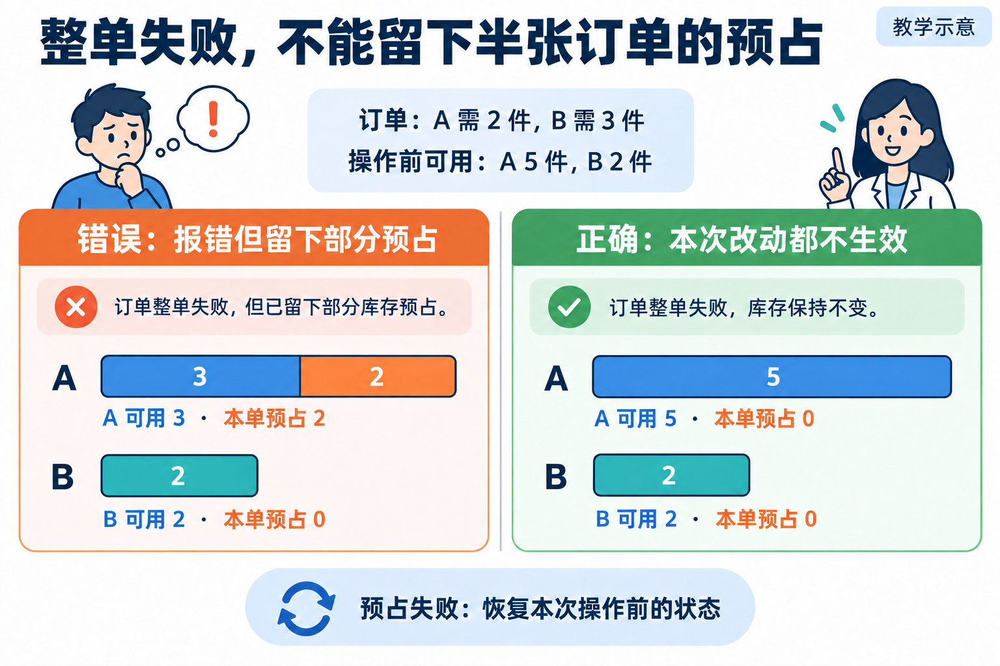
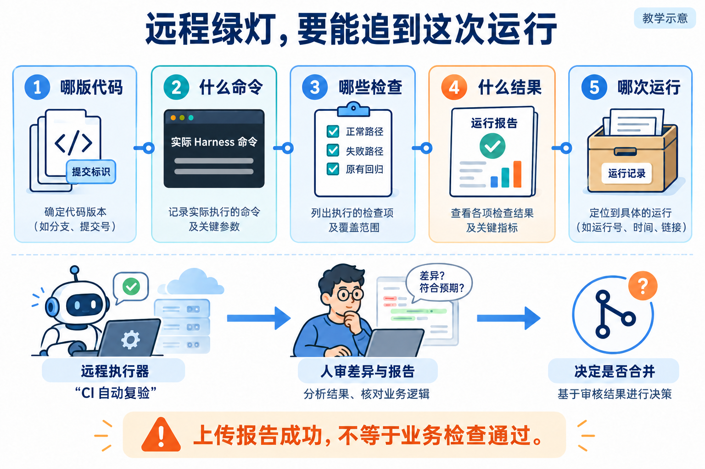

# L08 案例配图生成说明

生成日期：2026-09-26。使用内置 ImageGen，全部为教学示意，不是运行截图或个人验收证据。

图片已嵌入[辅导资料](../../辅导资料.md)。初稿与修订源图保留于生成目录，本目录仅保存采用的最终图片。

## 整单预占失败后的状态对照



### 原始提示词

```text
Use case: scientific-educational. Generate one landscape Chinese textbook illustration 3:2. White background, navy headings, blue teal orange accents, tasteful editorial line illustrations, large legible simplified Chinese, ample whitespace, no fake screenshots. Small corner label “教学示意”. Visual explanations not text-heavy slides. All specified Chinese labels exact. 标题“整单失败，不能留下半张订单的预占”。两幅并排，对比相同缺货订单，顶部共同信息“订单：A 需 2 件，B 需 3 件”“操作前可用：A 5 件，B 2 件”。左幅橙色标题“错误：报错但留下部分预占”，连续库存分配条A完整长度5分为可用3与本单预占2，标签“A 可用 3 · 本单预占 2”；B条标签“B 可用 2 · 本单预占 0”。右幅绿色标题“正确：本次改动都不生效”，A完整条全可用标签“A 可用 5 · 本单预占 0”；B条“B 可用 2 · 本单预占 0”。不画可数箱子，不画出库卡车。底部“预占失败：恢复本次操作前的状态”。
```

### 修订提示词

```text
只修库存条尺寸及虚线：两侧A条总长度必须完全相同。左A条60%蓝色写3，40%橙色写2，合为完整5；右A条100%蓝色写5。删除所有条右侧的空白虚线区域。两侧B条完全同长，占A条长度40%，均写2。其他所有文字数字保持原样。
```

已目视复核最终图的数字、文字和方向。

## CI 报告来源和人工合并决定



### 原始提示词

```text
Use case: scientific-educational. Generate one landscape Chinese textbook illustration 3:2. White background, navy headings, blue teal orange accents, tasteful editorial line illustrations, large legible simplified Chinese, ample whitespace, no fake screenshots. Small corner label “教学示意”. Visual explanations not text-heavy slides. All specified Chinese labels exact. 标题“远程绿灯，要能追到这次运行”。五个有序的大卡片用一条蓝色线连接：代码文件“哪版代码”；终端“什么命令”；检查清单“哪些检查”；报告“什么结果”；归档盒“哪次运行”。卡片下方一条独立流程，用角色插画：远程执行器“CI 自动复验”箭头到人类审核者“人审差异与报告”箭头到合并图标“决定是否合并”。底部“上传报告成功，不等于业务检查通过”。清楚区分五项追溯信息和下方审核流程；没有自动直连主分支的箭头。
```

### 修订提示词

```text
保留布局标题及底部人审流程。第二卡终端内删除make test、pytest、bash等所有虚构命令，改成大字“实际 Harness 命令”，下方仅画两条无文字灰线。第一卡把v1.2.3替换成“提交标识”。第三卡检查单改成三个全部勾选项目：“正常路径”“失败路径”“原有回归”。不要添加任何可执行示例命令。
```

已目视复核最终图的数字、文字和方向。
