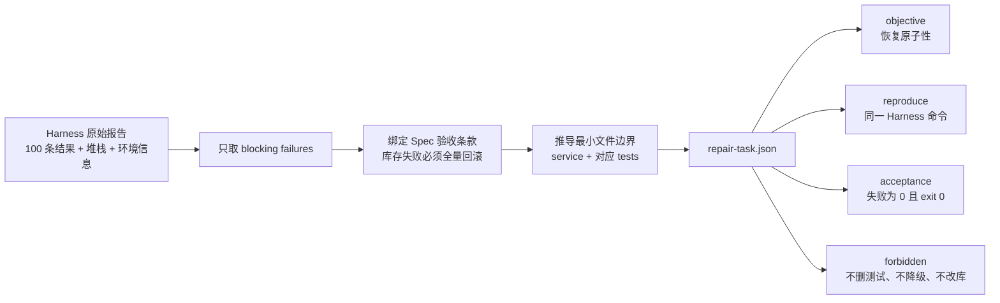
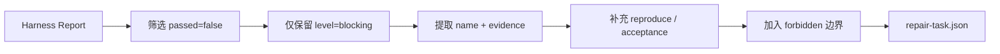
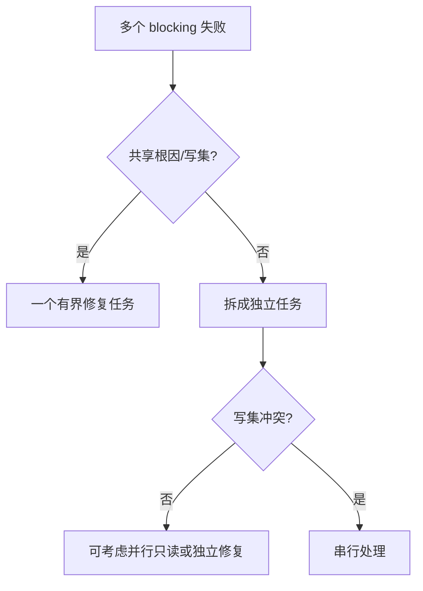
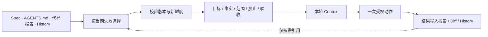
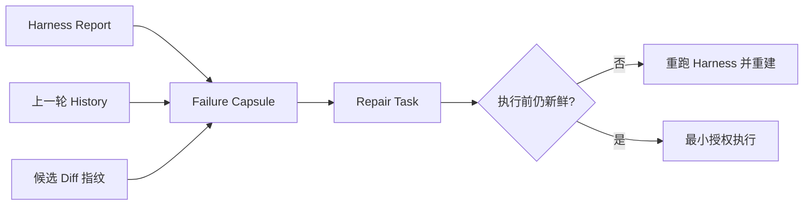
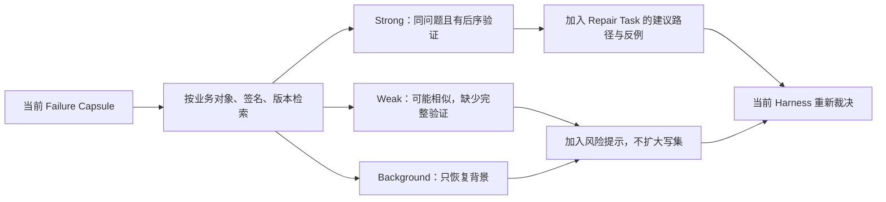

# L09｜把失败报告翻译成修复任务

<details>
<summary>本讲课程合同与建设状态（教师/助教）</summary>

- **核心内容**：从失败证据提取范围、复现命令、目标状态和禁止变更。
- **演示结果**：Harness 失败报告生成一个只针对失败项的修复任务。
- **课内增量**：实现失败报告到修复任务的映射器。
- **通过标准**：任务包含复现步骤和验收命令；不把观察级告警误判为阻断任务。

> 课程建设状态说明：本讲映射器、Repair Task Schema、活动和评价规则属于已经形成的课程设计；学生事实冻结、任务初稿、盲测修订和达成数据属于待真实开课采集。参考映射器输出不能替代学生对授权范围、证据等级和上下文压缩损失的判断。

> **基础线唯一性**：本讲交付“取消订单释放预占”，并把一次真实失败压缩为一张可执行 Repair Task；只完成单轮修复授权，不建立多轮 Loop。

</details>

## 连续案例｜第三幕：日志知道发生了什么，却没人知道该改什么

**时间**：第三周周一 09:05　**地点**：缺货异常看板

一张客户订单被取消后，销售页面显示“已取消”，可库存仍有 6 台处于预占状态。Harness 给出阻断失败，报告包含调用栈、SQL、多个 Eval 结果和环境信息，足足两百多行。每个人都知道系统有问题，却没有人愿意把整份报告直接交给 Agent。

陈予认为根因是“取消接口忘了释放库存”，周岚则怀疑页面状态更新太早。两种解释都合理，但报告只证明取消后状态不一致，没有证明是哪一层先出错。如果把猜测写进任务，Agent 很可能只修改最符合标题的文件。

林默开始删减报告：保留失败身份、最小输入、预期、实际、失败后业务状态和复验命令；把根因降级为待验证假设；写集只允许触碰与取消和预占直接相关的文件。删得太少，任务仍不可执行；删得太多，修复又失去事实基础。

顾宁要求这张 Repair Task 必须让一个没有参加事故会的人读完就能复现，并且知道自己没有被授权顺手重构订单模块。

> **决策时刻**：请在原报告中给每句话标记“事实、推断、建议”。Repair Task 只能把事实写入验收合同，把推断写入调查提示。提交前，让同伴只拿任务卡复现失败并指出允许写集。

单轮修复恢复了取消订单的预占，但团队很快希望自动完成“报告转任务—修改—复验”。一旦允许多轮执行，新的风险不再是任务太宽，而是系统不知道什么时候应该停。

## 图文学习导航

### 先进入现场：一份 200 行失败日志，究竟授权开发者改哪三行附近


*观察重点：事件链告诉我们失败发生在哪个阶段，但 Repair Task 还必须提取失败身份、最小复现、期望/实际、允许写集和复验命令，才能从“报告”变成“可执行授权”。*

**先别看答案**：从原始报告中分别标记事实、推断和建议。任何未经复现实验支持的根因都只能保留为假设，不能写入任务标题冒充结论。

本讲按“真实失败 → 证据压缩 → 最小写集 → 单轮修复 → 原报告复验”学习。用 [Google SRE Postmortem Culture](https://sre.google/workbook/postmortem-culture/) 约束无责且基于事实的失败分析，用 [RFC 9457 Problem Details](https://www.rfc-editor.org/rfc/rfc9457.html) 借鉴稳定、机器可处理的问题描述结构。

## 学员正文｜日志告诉你发生了什么，却没有授权你改什么

取消订单后，页面显示 `cancelled`，库存却仍有 8 台预占。Harness 报告准确指出 `cancellation_releases_reservation` 失败，并附上数据库状态、调用栈和数千行日志。林默把整份文件交给 Agent：“分析并修好所有相关问题。”十分钟后，Agent 同时改了取消逻辑、库存查询和测试夹具，还顺手清理了两个 observing 告警。

这条错误路线之所以常见，是因为日志看起来“上下文最完整”。但完整不等于授权。报告可以包含敏感信息、旧提交噪声和与当前阻断无关的观察项；一个修复者无法从日志自行获得产品范围、允许写集和禁止事项。Repair Task 的工作不是把日志缩短，而是把失败事实变成最小、可追溯、可拒绝的授权对象。

先从当前提交生成真实报告，再调用课程入口：

```powershell
.\.venv\Scripts\python.exe -X utf8 -m workbench.cli course-contract --lesson 9
.\.venv\Scripts\python.exe -X utf8 -m workbench.cli course-eval --lesson 9
```

检查 `agent/repair.py::build_repair_task` 和生成的 `.runtime/repair-task.json`。一张合格任务至少保留：报告与提交身份、blocking case、预期与实际、失败后权威状态、允许写集、明确禁止项、复验命令。把“可能与库存有关”写成 scope 不够；你要解释为什么取消服务和对应测试属于写集，而采购、网页和测试夹具为什么不属于。

### 把关键代码读懂｜报告怎样变成最小授权

```python
failed = [r for r in report.get("results", [])
          if not r.get("passed") and r.get("level") == "blocking"]
task = {
    "scope": [r["name"] for r in failed],
    "evidence": [{"eval": r["name"], "reason": r["evidence"]} for r in failed],
    "forbidden": ["删除或跳过 Eval", "把 blocking 降级为 observing", "直接修改运行数据库"],
}
```

- 前两行只接收当前阻断失败，观察级告警不会自动获得修复授权。
- `scope` 使用稳定 case 身份，而不是把“相关模块”写成无限范围。
- `evidence` 保留失败理由，使任务仍能回指原报告并被反证。
- `forbidden` 先封住最诱人的捷径；任务告诉修复者哪些动作即使能变绿也不合法。

行动课先生成正常任务，再进行三次污染实验：混入 observing 告警；换成旧 SHA 报告；删除来源字段。系统应该拒绝、隔离或明确标记无授权，而不是凭语义相似就扩大范围。随后让一名没有参加故障分析的同学只读取 Repair Task：他能否复现失败、指出允许修改的位置，并知道什么情况下必须停下来问人？

**看似合理的错误路线**是把所有失败合成一个“大修复任务”，认为一次调用更省成本。不同 case 可能有不同责任人和写集，合并会让证据无法映射到具体 Diff。任务应按能独立复验、写集不混杂的最小单元拆分；共同根因只能作为待验证假设，不能先写成事实。

**第二次签字**：这张任务是否足以授权修复？请引用来源、最小写集、禁止项和复验入口，并说明一个会导致你拒绝执行的条件。若答案仍是“Agent 看完日志会判断”，你还没有建立工程责任边界。

取消释放得到受控修复后，团队很快提出下一步：既然任务可重跑，是否让系统自动尝试直到绿色？Repair Task 只限制一轮，无法保证多轮不会振荡、耗尽或假成功。下一讲开始设计真正有停止权的 Loop。

<details>
<summary>附录：课程合同、教师活动、技术参考与证据模板</summary>

<details>
<summary>教师备课区：课程目标、评价与持续改进</summary>

## 三载体课堂交接

- **PPT 引导决策**：使用 [PPT 逐讲决策脚本](./PPT逐讲决策脚本.md) 的“L09”四个镜头；在学生提交第一次选择、依据和最大风险前，不揭示后果页。
- **Markdown 承载教材**：本讲连续案例、图文导航与学员正文/核心章节负责查证和建模；学生必须保留第一次判断与证据驱动的第二次签字。
- **VS Code 完成行动**：打开 [课程工作区](../../course/FlowERP-AI研发工作台.code-workspace)，先运行“查看本讲合同”，再按 [L09 行动卡](../../course/tasks/L09-失败转修复任务.md) 构造失败、完成受控修改并复验。
- **回收证据**：命令、输入、退出码、报告 ID、权威状态、Diff 和剩余风险回写本讲提交包；只交投票、代码或绿色截图均退回。

> 载体顺序固定为：PPT 第一次签字 → Markdown 查证 → VS Code 行动 → Markdown 第二次签字。完整规则见 [三载体课程实施方案](./三载体课程实施方案.md)。

## 国家级一流本科课程教学设计卡

| 维度 | 本讲设计 |
|---|---|
| 对应课程目标 | CLO-4：将失败事实综合为可复现、有范围、有禁止项的修复任务 |
| 工作台主线增量 | 实现 Harness 报告到 Repair Task 的映射器和最小授权合同 |
| FlowERP 的作用 | 提供取消未释放预占的真实报告，并接受最小 Repair Task 的受控修复 |
| 高阶性 | 在长日志中区分事实、推断和授权，综合出最小上下文并评价证据是否过期 |
| 创新性 | 用 Repair Task 作为失败证据与 Agent 行动之间的显式合同，降低上下文噪声与越权 |
| 挑战度 | 陌生同伴只看任务就要能复现并说清允许/禁止动作；observing 不能误纳 |
| 学生中心活动 | 学生冻结报告、独立生成任务、进行盲测，再根据误解位置修订合同 |
| 课程思政融入 | 不猜唯一根因、不扩大授权、不把历史经验冒充当前事实，训练审慎判断与责任意识 |
| 形成性评价 | Failure Capsule + Repair Task + 来源引用 + 盲测与修订记录 |
| 持续改进数据 | 统计不可复现任务率、观察项误纳率和盲测误解类型，改进字段约束 |

</details>

<details>
<summary>课程合同、边界与前沿校准</summary>

## 本讲知识合同

| 合同项 | 本讲约定 |
|---|---|
| 主线起点 | L08 的红色 Artifact 证明候选不可接受，却没有定义修复者获得什么授权 |
| 唯一技术命题 | 如何把当前失败事实无失真地压成短寿命、最小范围、可复现的 Repair Task |
| 必须掌握 | 事实/授权分离；六字段合同；报告身份与过期检测；当前证据优先；显式 forbidden |
| 能力判据 | 未读原始长日志的修复者仅凭任务就能复现失败、说清写集、验收和禁止动作 |
| 本讲不做 | 不猜唯一根因，不混入 observing，不启动多轮修复，不让历史经验覆盖当前报告 |

## 大纲锚点与前沿校准（2026-08-19）

- **大纲锚点**：只从失败证据提取范围、复现命令、目标状态和禁止变更，并实现报告到任务的映射器。
- **前沿采用**：采用最小充分上下文、来源与时效校验；Failure Capsule 和上下文预算服务于防失真与成本控制。
- **不越界**：不猜唯一根因，不让历史相似案例覆盖当前报告，不启动 Loop，也不把不受信任日志变成工具指令。
- **链路交接**：向 L10 交付短寿命、可重放、有明确停止边界的 Repair Task。详见[校准矩阵](./16讲主线与前沿校准矩阵.md)。

**主线坐标**：L08 已交付原子预占，但取消订单后 `reserved` 未释放的新报告说明质量链还会遇到不同缺陷。红灯本身没有授权“随便修”；工程账现在把这份报告压成短寿命、最小范围、带禁止事项的 Repair Task，不允许借修复之名扩展到采购或页面重做。

**这一讲把系统推进到哪里**：FlowERP 的取消释放缺陷被压成最小授权并完成一次受控修复；工作台获得从长日志提取失败签名、复现命令、允许写集和禁止事项的诊断能力；`repair-task.json`、修复 Diff 与同一 Eval 转绿共同构成本讲证据。修复质量首先取决于问题被压缩得是否准确，而不是模型收到多少日志。

</details>

## 本讲行动工单：把失败事实压成最小授权，而不是日志摘要

学员冻结“取消订单未释放预占”红色报告的 SHA、报告哈希和时效，先写 Repair Task Schema，再实现映射器。课堂注入 observing 告警、过期报告、缺来源字段和伪装成指令的日志文本，映射器必须拒绝或隔离；陌生同伴不看原日志，只凭任务复述允许写集、禁止项、复现和验收。盲测通过后，执行一次受控修复并用同一命令证明预占完整释放。

- **工作台增量**：报告→Repair Task 映射、时效/来源校验、上下文压缩和授权边界；
- **FlowERP 产品状态**：由取消释放红色报告生成最小 Repair Task，并完成一次受控修复；本讲不启动多轮 Loop；
- **失败证据**：observing 误纳、过期证据或提示注入污染至少一项被稳定阻断；
- **迁移证据**：映射一个非 FlowERP 失败报告，不能硬编码库存字段；
- **讲师硬门槛**：必须给真实报告身份和污染版夹具，不能用一页干净示例替代。

详见[可执行任务卡](../../course/tasks/L09-失败转修复任务.md)。

<details>
<summary>教师备课区：教学活动与达成度设计</summary>

## 本讲教学设计总览

| 项目 | 设计 |
|---|---|
| 建议学时 | 30 分钟线上精讲 + 70 分钟线下行动 + 30 分钟盲测作业 |
| 课堂类型 | **案卷压缩**：从长日志中冻结事实、缩小授权并保留原始索引 |
| 核心问题 | 怎样删除噪声而不删除会改变修复范围、风险或责任的事实？ |
| 教学重点 | 失败签名、复现命令、允许/禁止写集、来源追溯、上下文预算 |
| 教学难点 | 区分摘要与授权；防止 observing、旧经验和相似错误污染当前范围 |
| 课堂产出 | `repair-task.json` + 压缩说明 + 陌生修复者盲测记录 |
| 价值塑造 | 诊断结论必须忠于原始证据，不能为方便执行者剪掉不利事实 |

### 可测学习成果

| 编号 | 学习者能够 | 达成证据 | 达成标准 |
|---|---|---|---|
| L09-O1 | 从 Harness/CI 材料中识别稳定 Blocking 事实 | 失败冻结表 | 无 observing 或无关日志进入修复范围 |
| L09-O2 | 生成包含六个不可丢字段的最小修复合同 | `repair-task.json` | Schema 完整且能回指源报告 |
| L09-O3 | 说明被删除内容为何不影响授权和复现 | 压缩说明 | 每类删除均有理由和恢复索引 |
| L09-O4 | 让陌生修复者只凭任务稳定复现但不能越权修改 | 盲测记录 | 首次复现成功，禁止动作明确 |

### 30 分钟线上精讲 + 70 分钟线下行动

| 场域与时间 | 学习活动 | 学生当场证据 |
|---|---|---|
| 线上 0–8 分钟 | 给出长日志和“修复所有问题”，学生先圈定授权风险 | AI 介入前风险标注 |
| 线上 8–20 分钟 | 讲解事实冻结、失败签名和 Repair Task 六个不可丢字段 | 事实冻结表 |
| 线上 20–30 分钟 | 示范事实、推断、历史线索和 observing 告警的分层 | 字段来源图与污染预测 |
| 线下 0–18 分钟 | 从真实失败报告生成最小 Repair Task，写复现、允许和禁止集 | 任务初稿与运行溯源 |
| 线下 18–34 分钟 | 注入 observing 失败和相似旧经验，逐项说明采用或排除理由 | 污染检测记录 |
| 线下 34–54 分钟 | 与陌生组交换，仅凭任务复现并提出最小 Diff 计划 | 盲测执行记录和误解点 |
| 线下 54–70 分钟 | 依据盲测修订任务，说明压缩保真与剩余未知 | 最终 Repair Task、修订对照和离场票 |

### 达成度与持续改进

采集首次复现成功率、无关信息混入率、源报告回链率、禁止事项覆盖率和盲测追问次数。首次复现率低于 90% 时增加环境与输入身份字段；无关信息混入超过 10% 时强化 Blocking/observing 分诊；盲测需要口头补充才能行动的任务一律不计达成。

</details>

## 本讲现场｜一份红色报告，到底授权了什么

第 8 讲的 CI 红了。日志里同时出现 100 条测试记录、依赖信息、耗时和一个真正的阻断失败：库存不足时，第一行商品已经被预占，第二行失败后事务却没有完全回滚。此时最危险的指令是“请修复所有问题”。它没有文件边界，没有完成条件，也没有禁止事项；修复者甚至可能删掉失败用例来制造绿色。

这一讲像急诊分诊：不写新功能，只把失败事实压缩成可执行合同。压缩后的任务必须保留四个不能丢的信息：哪条不变式被破坏、用什么命令能稳定复现、允许触碰哪些文件、怎样证明没有通过降级门禁作弊。

真实任务详情页已经能把结构化 Spec、状态事件链和 Eval 证据并排展示。Repair Task 不应复制整页内容，而要保存 Task ID、报告身份和最小失败切片，让修复者随时回到权威上下文核对。


这组三联图定义 Repair Task 的上下文边界：Spec 给目标与约束，失败报告给状态差，事件链给本轮授权和历史。任何修复任务若无法回到这三类来源，就只是一个更长的 Prompt。



课堂上先做一个删减实验：把绿色用例的逐行输出删掉，任务仍可执行；再把复现命令删掉，另一个人立刻无法判断失败是否稳定。前者是去噪，后者是失真。修复任务不是日志摘要，而是带授权边界的工程处方。

## 从 ERP 失败事实到修复授权，中间不能靠猜

CI 报告说的是“哪里不满足质量合同”，Repair Task 说的是“下一位执行者可以采取什么行动”。两者之间必须有一条可审计转换，而不能让模型从堆栈自由联想出重构计划。

| 报告中的事实 | 转换后的任务字段 | 为什么不能省略 |
|---|---|---|
| `stock_never_negative` blocking 失败 | `objective: 恢复整单预占原子性` | 把技术名字还原成业务目标 |
| 第二行不足后第一行 `reserved=3` | `evidence_snapshot` | 防止只修异常文案，不修残留副作用 |
| `python -X utf8 -m eval.harness --suite blocking` | `reproduce` | 让陌生修复者看到同一个红灯 |
| 失败位于预占事务路径 | `write_allowlist` | 限制到领域服务和对应测试 |
| 采购、页面、Schema 未被本次失败触及 | `forbidden` | 防止借机扩大产品范围 |
| CI Run 与 commit | `source_report` | 修复后能够回指原始事故 |

```json
{
  "business_rule": "多行销售订单必须整单预占或整单失败",
  "observed_state": {"line_a_reserved": 3, "line_b_reserved": 0, "order_status": "draft"},
  "expected_state": {"line_a_reserved": 0, "line_b_reserved": 0, "order_status": "draft"},
  "write_allowlist": ["flowerp/service.py", "tests/test_flowerp.py"],
  "forbidden": ["delete_or_weaken_eval", "edit_runtime_db", "change_purchase_policy"],
  "acceptance": ["blocking_failed == 0", "process_exit_code == 0"]
}
```

这不是仓库中固定 Schema 的逐字复制，而是课堂上用来审查信息完整性的业务切片。真正生成时仍以 `workbench` 当前 Repair Task 合同为准。关键原则是：压缩后必须同时保留**错误前后的权威状态、复现身份和授权半径**。只有错误消息，没有状态差；只有状态差，没有写集；都不足以启动自动修复。

## 为什么不能把全部日志交给模型“随便看看”

一次 CI 可能产生数千行日志，其中包含环境安装、通过用例、堆栈、警告和多个失败。把整份日志交给修复者看似信息最全，实际会扩大注意力范围：模型可能修观察项、重构无关模块、把测试降级，或者被首个噪声带偏。

修复任务是一种有损压缩。它主动删除不影响决策的内容，只保留阻断用例、直接证据、复现命令、目标状态和禁止变更。所谓“有损但不失真”，是可以丢掉绿色用例的详细日志，却不能丢掉会改变修复范围和安全判断的信息。

## 把 6,000 行日志压成六个不可丢字段

输入是 Harness JSON，不是终端截图。输出合同：

```json
{
  "objective": "仅修复阻断级 Eval，保持现有公共接口和业务不变量",
  "scope": ["stock_never_negative"],
  "evidence": [
    {"eval": "stock_never_negative", "reason": "AssertionError: ..."}
  ],
  "reproduce": "python -X utf8 -m eval.harness --suite blocking",
  "acceptance": "阻断级失败为 0，退出码为 0",
  "forbidden": [
    "删除或跳过 Eval",
    "把 blocking 降级为 observing",
    "直接修改运行数据库",
    "提交密钥"
  ]
}
```

这六组字段分别回答：为什么修、修什么、依据什么、怎样重现、怎样算完成、哪些捷径绝对禁止。

## 压缩不是摘要，而是一条授权管道



注意筛选顺序：失败且 blocking。一个 observing 警告即使很显眼，也不自动进入修复任务。若它需要修，先由人工决定优先级和范围，或者建立单独任务。自动修复只处理已经被质量治理确认的阻断事实。

## 逐行审讯 `build_repair_task`

`agent/repair.py::build_repair_task` 的核心只有几行：

```python
failed = [
    r for r in report.get("results", [])
    if not r.get("passed") and r.get("level") == "blocking"
]
```

然后由失败结果构造 `scope` 和 `evidence`，把 JSON 写入运行目录。实现简单是优点：没有调用模型重新解释失败，没有从自由文本猜等级，也没有修改业务代码。它只是确定性地把公共报告转换为下一个对象合同。

简单实现也有边界：没有验证输入 `schema_version`；没有检查用例名是否存在；空失败时仍会生成空任务；多个根因可能被放在一个任务中。课程主线保留最小实现，挑战线可以增加 Schema 校验、大小限制、报告哈希和任务拆分策略。

## 好任务与坏任务

| 坏任务 | 风险 | 好任务 |
|---|---|---|
| “测试失败了，全修” | 范围无限 | “仅修 stock_never_negative” |
| 粘贴完整 CI 日志 | 上下文噪声 | 直接 evidence + 报告路径 |
| “让测试通过” | 可删除或降级测试 | 业务目标 + 禁止作弊 |
| 没有复现命令 | 无法先红 | 固定 blocking Harness 命令 |
| “尽量别改太多” | 不可审计 | 明确允许/禁止文件与接口 |
| 没有完成标准 | 容易自述成功 | blocking_failed=0 且 exit=0 |

目标不是限制修复者思考，而是限制副作用。如果证据不足以定位，修复者可以先做只读调查，但不能擅自扩大写集。

## 业务失败示例：库存负数

假设报告包含：

```json
{
  "name": "stock_never_negative",
  "level": "blocking",
  "passed": false,
  "evidence": "AssertionError: 缺货请求后 reserved expected=0 actual=2"
}
```

修复任务应引导先复现、定位 `reserve_order` 的事务顺序、检查相关测试，再做最小改动。不能建议直接把临时数据库 `reserved` 改回 0，因为那只修数据，不修规则；也不能将不足订单改成部分成功，因为这改变了 Spec。

## 多失败如何拆分

当 `stock_never_negative` 与 `cancellation_releases_reservation` 同时失败，可能共享库存事务根因；与 `no_committed_secrets` 同时失败则明显独立。可用读写集和根因相关性判断：

```text
共享业务对象 + 共享代码入口 + 一个修复可能同时解决 → 可放同一任务
不同目录 + 不同风险 + 可独立验收 → 拆分任务
```

课程最小 `build_repair_task` 把所有 blocking 失败放入一个 scope，由 Loop 统一处理。生产化扩展应在人工或确定性规则下聚类，避免一个 Agent 同时改库存事务与秘密治理。



## 手术台：从真实红灯生成 Repair Task

先运行 Harness：

```bash
python -X utf8 -m eval.harness --suite blocking
```

在全绿仓库中，Repair Task scope 为空，不应该授权 Codex修改。为了演示，在临时分支制造一个 blocking 失败，然后用 Python 入口调用 `build_repair_task`，或运行会调用它的 Loop dry-run：

```bash
python -X utf8 -m agent.loop --max-rounds 3
```

检查：

```powershell
Get-Content .runtime/loop/repair-round-1.json -Raw -Encoding UTF8
```

确认只有 blocking 失败；`reproduce` 可复制；`acceptance` 可计算；`forbidden` 完整；文件位于 `.runtime` 且不提交。

## 失败实验：把 observing 混入 scope

故意让一个 observing 用例失败，并临时移除 level 过滤。生成的任务会把低风险告警交给自动修复。讨论后果：Agent 可能把课程文档调整与库存故障混成一个 Diff；自动化成本上升；主线修复被拖延；如果 observing 本身不稳定，Loop 可能无法收敛。

恢复过滤后验证 observing 不再进入 scope。这个实验说明“报告里出现的失败”不等于“允许自动修改的任务”。等级治理是权限治理的一部分。

## 禁止事项为什么必须显式

模型最容易走的捷径往往在技术上合法：跳过失败用例、降低等级、扩大异常捕获、硬编码测试数据、直接改数据库、改报告 JSON。若任务只说“让 CI 绿”，这些方案都能达到表面目标。

`forbidden` 把结果优化约束在业务合法空间。还可以按任务补充：不得改变公共 API；不得新增依赖；不得修改 Schema；不得改动某些目录；不得删除失败证据。禁止项越具体，审查越容易，但不要无限罗列与当前失败无关的规则。

## 报告与任务的追溯

当前任务没有保存输入报告哈希。生产化可以增加：

```json
{
  "source_report": ".runtime/reports/harness-blocking.json",
  "source_schema_version": "1.0",
  "source_generated_at": "...",
  "source_sha256": "...",
  "created_at": "..."
}
```

这样可以证明修复任务来自哪次评测，防止旧任务消费新代码。若代码或报告已变化，应重新评测再生成任务，而不是继续执行过期 scope。

## Repair Task 还要引用“怎么失败的”

两份 Harness 报告都可能写 `stock_never_negative=false`：一次是候选实现从未运行验证，一次是连续两轮修改后仍留下 `reserved=2`。结果相同，授权却不同。前者应先补执行证据，后者可能已触发无进展停止。因此 Repair Task 除了引用结果报告，还应能回到上一轮 History 或 Graph Trace，而不是把上下游截断。

挑战线可增加一个小而可核对的轨迹摘要：

```json
{
  "source_trace": ".runtime/loop/history.json",
  "round": 2,
  "failure_signature_before": ["stock_never_negative"],
  "failure_signature_after": ["stock_never_negative"],
  "files_changed": ["flowerp/service.py"],
  "diagnostic_flags": ["same_failure_again"]
}
```

`diagnostic_flags` 只能记录确定性发现，不能伪装成唯一根因。`same_failure_again` 表示外部结果没有变化，不等于两轮内部错误完全相同；仍需阅读直接 evidence 和 Diff。当前 `build_repair_task` 尚未写入这些字段，所以它们必须标为扩展合同，而不能出现在基线运行截图里。

轨迹摘要的价值不在“让模型写一段复盘”，而在把可机械判定的异常先筛出来。下面是一组适合 FlowERP 的确定性规则：

| 诊断标记 | 可机械观察的事实 | 能下的结论 | 不能武断下的结论 |
|---|---|---|---|
| `same_failure_again` | 相邻两轮稳定化失败签名相同 | 本轮没有改变外部失败集合 | 模型完全没理解问题 |
| `write_set_expanded` | 实际修改超出任务允许写集 | 发生范围扩张，必须暂停或升级授权 | 越界文件一定与根因无关 |
| `gate_tampered` | Eval、等级、Harness 或报告生成逻辑被修改 | 候选可能劫持裁判，立即停止 | 所有门禁修改都是恶意行为 |
| `claimed_without_command` | 声称完成却无命令、退出码或报告身份 | 完成声明没有证据 | 实现一定错误 |
| `decision_exit_mismatch` | 报告 decision 与进程退出码矛盾 | 自动化合同已损坏 | 业务逻辑就是唯一根因 |
| `stale_report` | 报告版本或代码指纹早于当前候选 | 任务基于旧事实，不得继续执行 | 旧报告中的缺陷已经消失 |
| `edit_churn` | 同一区域反复改回，Diff 方向振荡 | 需要停止并重构诊断假设 | 只要换一个模型就会解决 |

这张表把“事实”和“解释”强制分栏。系统可以确定某轮越过了写集，却不能只凭越界就发明动机；可以确定报告过期，却不能假装知道当前版本已通过。确定性标记的任务是缩小调查面和触发控制动作，不是替评审者编故事。

还要保存一份最小失败记忆。它至少包含候选 Diff 指纹、触发的 Gate、失败签名、报告 ID 和拒绝原因。下一轮若再次提交同一指纹，执行器应直接引用旧证据并停止；若只是文字解释不同而代码与结果不变，也不能把它算作进展。当前课程基线只保存 History，Diff 指纹与自动拒绝属于生产化挑战线，课堂演示时必须明确区分“已经实现”和“应该实现”。

## 上下文预算

修复任务越小，模型上下文可用于真正的代码理解。一个实用预算：目标 1–2 句；scope 1–5 个用例；每个 evidence 保留直接错误和关键状态；复现一条权威命令；禁止事项 4–8 条。完整日志通过路径引用，不直接嵌入。

压缩不能丢失平台信息。如果失败只在 Windows 发生，evidence 必须带 OS、Python 与文件锁信息，否则修复者可能在 Linux 上修改无关逻辑。

### Context Engineering：状态很多，不等于本轮都要看见

Agent State 是系统掌握的事实空间，Context 是某一轮交给模型的可见视野。仓库、历史报告、全部日志和旧 Diff 可以存在于状态或外部存储中，但不应该原样挤进每一轮输入。Context Engineering 的工程任务，是在每个决策点完成四次选择：取哪些事实、丢哪些噪声、按什么结构排序、把哪些结果写回可追溯存储。



这里有一条硬边界：摘要可以压缩表达，不能压缩授权。若原始报告证明失败只发生在 Windows，摘要就不能删掉平台；若 Scope 只允许改 `flowerp/service.py`，上下文选择器也不能因为检索到了其他文件就自动扩大写集。正确的信息进入 Context 之前，要先通过来源、版本、权限和相关性检查。

### Prompt 是 Context 的控制头，不是 Context 的全部

工程任务送入模型前，可把输入理解成一个编译产物，而不是一段越写越长的话：

```text
RunContext = InstructionPrecedence
           + CurrentPrompt
           + RepositoryRules
           + TaskSpec
           + SelectedEvidence
           + ToolSchemas
           + CurrentState
           + OutputContract
```

`CurrentPrompt` 负责本轮目标，例如“只修复 `stock_never_negative`”；`RepositoryRules` 负责长期约束；`TaskSpec` 负责验收；`SelectedEvidence` 负责证明当前失败；`ToolSchemas` 限定可做动作；`CurrentState` 防止重复执行；`OutputContract` 要求返回 Diff、命令、退出码和剩余风险。只优化 Prompt 措辞，却把过期报告、无关文件和危险工具全部装入 Context，仍会得到不稳定执行。

构建本轮 Context 时给每个片段打四个标签：

| 标签 | 问题 | FlowERP 示例 |
|---|---|---|
| `authority` | 它是权威事实、规则、证据还是猜测？ | 数据库快照高于聊天转述 |
| `freshness` | 它属于哪个 commit、报告和业务版本？ | 报告 A 不能证明候选 B |
| `relevance` | 它是否改变本轮决策？ | 财务报表不进入库存原子性修复 |
| `permission` | 它允许读取，是否也允许写入？ | 检索到 Schema 不等于获准迁移 |

Memory 召回和 MCP 检索都只能进入 `SelectedEvidence` 候选池，必须先经过这四项检查。这样 Prompt、Context、Memory、MCP 的关系才可测试：Prompt 给方向，Memory 给线索，MCP 给外部来源，Context Builder 决定本轮真正可见什么。

### Context Rot：窗口更长，注意力不一定更可靠

上下文腐化不是“超过最大 Token 才发生”。旧日志、重复规则、过期报告、互相冲突的猜测和大段无关工具输出，都会稀释当前任务。课程把它变成可测实验，而不是一个流行词：

| 实验组 | 输入 | 固定条件 | 观察指标 |
|---|---|---|---|
| A：日志直塞 | 完整终端记录、三轮旧报告、所有历史解释 | 同一模型、同一失败 commit、同一权限 | 首次正确定位率、越界文件数、总 Token、复验次数 |
| B：Failure Capsule | 当前报告哈希、直接错误、状态、范围、禁止项和原始证据路径 | 与 A 完全相同 | 同上 |

只有 B 在代表性样本上更稳定，才能证明压缩策略有效；不能凭“输入更短”宣布质量更高。若 Capsule 丢失关键堆栈导致定位率下降，应调整选择和排序，而不是继续盲目删字。Context Rot 的治理循环是：记录输入组成 → 找出无贡献或误导片段 → 一次只移除一类 → 重跑同一 Eval Dataset。

### Prompt Caching：成本优化，不是记忆，也不是质量护栏

稳定的项目规则、工具定义和任务背景经常跨轮重复。支持提示词缓存的平台可能复用稳定前缀的计算，从而降低延迟或成本；但缓存不会让错误规则变正确，也不会替代 State 持久化、检索和压缩。课程只在调用层记录 `input_tokens`、`cached_tokens`、延迟、成本与任务通过率，不把“命中缓存”计作质量进展。

实现时把稳定、经过版本控制的内容放在相对稳定的位置，把本轮用户输入、最新报告和工具结果放在变化区域；规则或工具 Schema 改变时，缓存身份也必须改变。缓存策略依赖具体模型和 API，应以实际使用平台的当前文档与遥测为准。OpenAI Docs 当前同时区分隐式与显式缓存，并建议跟踪上下文随长会话增长的影响，课程因此把缓存列为可替换优化，而不是 Harness 的永久语义：[OpenAI Model Guidance](https://developers.openai.com/api/docs/guides/latest-model)。

## 交给陌生修复者做一次盲测

- [ ] 输入来自 Harness JSON，而非截图或口头描述；
- [ ] scope 只包含失败的 blocking；
- [ ] evidence 为每个 scope 提供直接原因；
- [ ] reproduce 可复制且指向唯一门禁；
- [ ] acceptance 同时要求失败为 0 和退出码 0；
- [ ] forbidden 禁止删 Eval、降级、改运行库和提交密钥；
- [ ] 观察告警不会自动进入修复；
- [ ] 空 scope 不授权写入；
- [ ] 任务文件位于运行目录并可追溯。

<details>
<summary>讲师用：验收、练习与评分</summary>

## 作业、评分与下一讲

### 作业

从自己的失败报告生成一个不超过一页的修复合同。提交原报告、压缩后任务和删除内容说明：哪些日志被丢弃，为什么不影响决策。再设计一个“看似能变绿但被 forbidden 禁止”的作弊方案。

### 评分

| 项目 | 分值 | 合格表现 |
|---|---:|---|
| 范围与分诊 | 30 | 只含稳定 Blocking，无 observing 或历史噪声越权 |
| 证据压缩 | 20 | 可定位且不过载，删除内容有理由和恢复索引 |
| 可复现性 | 20 | 命令、输入、版本和环境明确，陌生人首次复现 |
| 安全边界 | 20 | 允许/禁止写集明确，阻止删用例和降门禁等表面修复 |
| 追溯 | 10 | 报告、失败签名、Repair Task 与责任人可关联 |

下一讲让 Loop 每轮消费这个任务，但默认只做 dry-run。只有显式 `--codex` 才授权模型修改，并且必须受轮数、时间、Token 和无进展停止条件约束。


</details>
## 修复任务评审工作坊

将同一份失败报告交给三组，分别写“最宽任务”“最窄任务”和“风险平衡任务”。最宽任务往往把所有失败和日志塞进去；最窄任务可能只写一个用例名，缺少复现与状态；风险平衡任务应让不了解背景的人能够先红、定位相关入口、做最小 Diff、再绿，同时清楚知道不能碰什么。

评审时用可判定问题替代“写得是否详细”：scope 中每项是否都在输入报告中失败且为 blocking；evidence 是否包含直接业务状态；reproduce 在干净工作区能否执行；acceptance 是否可由机器判断；forbidden 是否能阻止最可能的作弊；是否引用了输入报告版本。任何答案为否，任务都还不能进入自动执行。

### 过期任务场景

假设任务在周一从报告 A 生成，周二另一位开发者已修复库存并新增采购失败，周三 Loop 仍消费周一任务。即使 Prompt 很清楚，它也会在错误事实基础上工作。正确做法是在执行前重新运行 Harness：若原 scope 已消失，任务标记 stale 并关闭；若失败仍在但 evidence 变化，重新生成；若出现新失败，由当前报告决定新 scope。修复合同不是长期需求池，它是某个代码状态的短期控制对象。

### 最小文件边界扩展

课程对象可以增加建议读集和允许写集：

```json
{
  "read_hint": ["flowerp/service.py", "eval/cases.py", "tests/test_flowerp.py"],
  "write_allowlist": ["flowerp/service.py", "tests/test_flowerp.py"],
  "requires_review_if_write_outside": true
}
```

allowlist 不是绝对正确：真实根因可能在事务存储层。它的作用是触发升级——若修复者认为必须越界，先给出证据并请求新的授权，而不是悄悄扩大范围。这样“最小修复”从一句期望变成可审查动作。

## 修复任务可以重跑，但重跑本身可能成为故障

### Failure Capsule：给下一轮最小但不可歪曲的上下文

长日志压缩后最怕两件事：丢掉改变授权的事实，或把上一轮的推测当成当前事实。一个可移植的 Failure Capsule 可以由七个引用组成：候选版本、报告哈希、失败签名、直接 evidence、允许写集、禁止项、上一轮动作与结果。原始日志仍保存在受控路径，Capsule 只做索引，不做文学总结。



这个对象让上下文压缩从 Token 技巧升级为安全协议：没有当前报告哈希就不能证明 scope 新鲜，没有 Diff 指纹就识别不了重复候选，没有写集就无法判定范围扩张。

### 在 Repair Task 之前查历史，但不让历史替当前报告发号施令

Failure Capsule 形成后，工作台可以用 `business_refs + failure_signature + repo/branch + environment` 查询团队 Memory。顺序不能反过来：先固定当前失败，再找历史经验；如果先搜历史再解释当前日志，Agent 很容易把新问题套进旧故事。



强经验至少同时满足：发生时间早于当前任务；失败签名和 ERP 业务对象可对应；代码作用域仍有效；原始证据可访问；过去的修复确实经过下一 Task、Blocking 和具名验收。仅仅命中文件名或错误文本，只能算弱提示。比如历史上 `OperationalError: database is locked` 来自 Windows 备份锁，而本轮来自两个测试共享临时库，两者文本相同，修复路径却不同。

Repair Task 增加 `memory_refs` 与 `memory_decisions` 两个字段：前者保存候选资产 ID、来源和版本；后者明确 `adopt / warn / reject` 以及理由。被拒绝的相似经验同样重要，它会成为检索负例，防止下一轮继续把“像”误判成“可执行”。

```json
{
  "memory_refs": ["MEM-EVO-001", "MEM-INCIDENT-017"],
  "memory_decisions": [
    {"id": "MEM-EVO-001", "decision": "adopt", "reason": "同一失败签名与业务对象，已由后序任务验证"},
    {"id": "MEM-INCIDENT-017", "decision": "reject", "reason": "错误文本相同，但 OS 和锁持有者不同"}
  ]
}
```

Repair Task 已经足够清楚，执行器却可能连续三轮提交同一种无效改动，或在报告没有变化时持续消耗时间和 Token。第 10 讲把“再试一次”改造成控制系统：每轮采样 Harness、计算失败签名、记账预算，并把全绿、无进展、超时、计量缺失和最大轮数分别变成可审计终态。自动化的能力不由它能跑多久证明，而由它知道何时停止证明。

</details>
