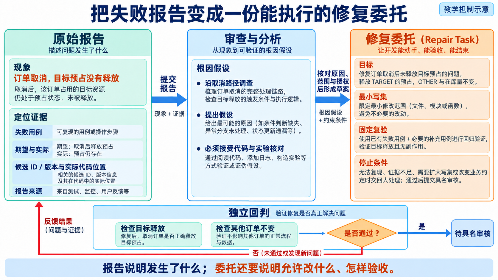
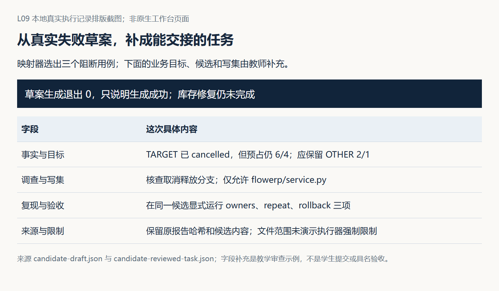
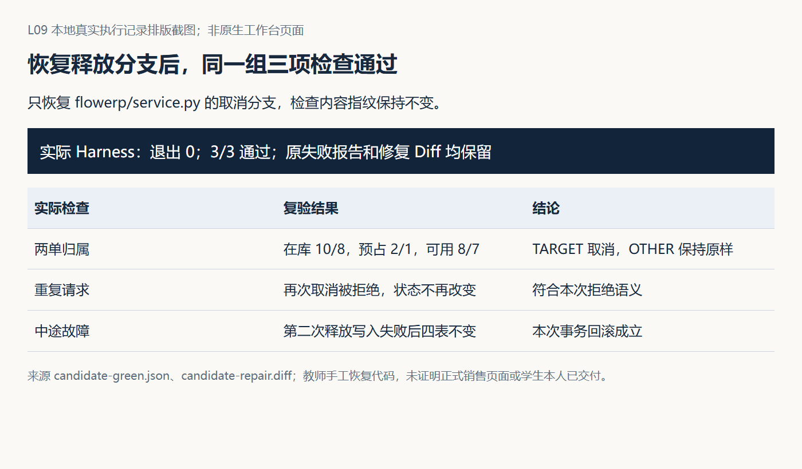
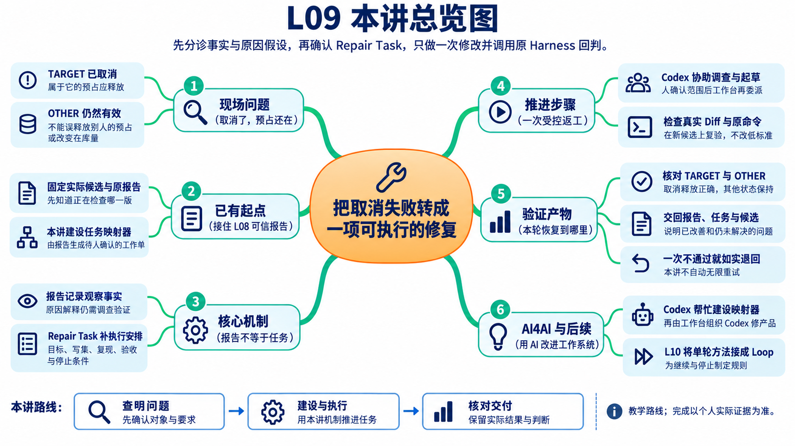

# L09｜参考详解

> 按需查阅：先读[辅导资料](辅导资料.md)，再按问题查询下面的原有实验、源码解释和进阶讨论。
>
> 本文件保留原详细材料及其图片、证据与来源。下文的章节编号独立于新版辅导资料；原核验日期和参考记录不表示本轮重新运行，更不代表学员已经通过。操作步骤以[实践操作手册](实践操作手册.md)为准。


> 本资料先解释问题、原理和判断方法；实际操作与提交按配套实践手册完成。

## 先看一张取消订单：不买了，为什么库存还没放出来

为便于手算，先设一个教学例子：在库 10 件，目标订单占用 3 件，另一张订单占用 2 件，当前可用量是 **10 − 3 − 2 = 5 件**。

取消目标订单后，应该只释放它的 3 件。因此在库仍是 10，另一张订单仍占用 2，可用量回到 **8 件**。若把全部预占清零，虽然可用量变成 10，看上去“更多了”，却破坏了另一张订单。后文用 TARGET 表示目标订单，用 OTHER 表示另一张订单；这组手算数字用于理解要求，不冒充参考运行输出。

现在检查报告告诉你“取消以后仍有预占”。直接把整份报告发给 Codex，说“全部修好”，还缺几项决定：修哪个版本、允许改哪些文件、怎样复现、修到什么程度就停止？

本讲把这些安排写成一份**修复工作单（Repair Task）**。报告说明发生了什么，工作单说明接下来允许做什么。

### 本讲只做一轮，先把交接做完整

先确认失败事实和共同原因，再请 Codex 协助补齐工作台的任务生成器。这个生成器又叫**映射器**：按已确认的规则，把报告中的事实和人的范围决定整理成任务草案，不是自动猜出全部原因。

你确认草案后，工作台再委托 Codex 修复 FlowERP，最后用原来的检查判断结果。这里有两项不同修改：先改工作台的任务生成能力，再用它组织产品修复，各自有独立的文件范围。

第 1～2 节看事实与调查，第 3 节看工作单怎样生成，第 4～5 节看一次修改怎样执行与复验。若这一轮仍然失败，就如实交回，不自动无限重试；多轮修复留给 L10。

人物为虚构教学情境，已有教师候选不等于你的交付。具体步骤见[实践操作手册](实践操作手册.md)。读完应能说清：你交给 Codex 的不是“所有红字”，而是一项有目标、有范围、能复验的工作。

## 1 收到失败：订单取消了，库存仍被占用

先把候选理解为“本次正在检查和准备修改的代码版本”。所有调查、任务和报告都要指向这个版本，否则接手者可能在另一个已经正确的版本上工作。

本讲参考场景中，TARGET 和 OTHER 是两张订单。TARGET 已取消，OTHER 仍然有效。原始报告表明，TARGET 的预占仍然存在。后续订单因此无法使用本应释放的库存。

已确认的业务目标只有一句话：

> 取消 TARGET 时释放属于它的预占，保留 OTHER 的预占，在库量保持不变。

这些规则以及检查命令作为输入提供。你现在要决定的是：怎样把这次观察转成一项能够交给 Codex 的工作？

### 1.1 报告给出了现象，还需要补上工作安排

报告可能包含多个失败条目，却没有直接回答谁来处理、允许改哪里、出现新问题时怎么办。只说“把失败都修好”，接手者还得自行猜测这些决定。

修复任务需要在事实之外补齐目标和范围。例如“TARGET 取消后仍占用库存”告诉 Codex 从哪里调查，“只恢复本次取消行为”限制了本轮目标，“允许修改具体取消服务文件”才确定了执行边界。

从工作台首页“事项与决策”组织这次需求，将报告关联到已有事项。首页尚未贯通的步骤应使用实际可用的后端或命令行入口，并说明入口位置。工作台组织研发，客户仍在 FlowERP 办理订单。

### 1.2 本阶段的产物

你应得到一组清楚的输入：原任务、候选位置与版本、原始失败报告、既有业务要求和检查命令。缺少其中某项时先补齐材料。

本文已有候选实验使用入门 ERPService，正式销售页面使用 SalesService。实际任务必须写明自己的服务入口，不能用入门服务结果代表正式页面已经修好。本文后续沿同一个入门候选解释组织方法。

材料准备好以后，下一步才是判断这些失败应由哪一项任务处理。

## 2 分诊：把相关失败收敛成一项工作

林舟把取消状态、预占记录和可用量的相关失败放在一起，请 Codex 区分已观察事实与原因假设。他需要的是针对 TARGET 的一项工作，而不是让每条报错各自带出一轮修改。

### 2.1 三个失败，先看它们发生在哪里

本讲参考候选出现三项失败：

| 失败条目 | 实际观察 | 对任务组织的提示 |
|---|---|---|
| 取消后的预占归属 | TARGET 取消后仍有它的预占 | 调查取消与释放之间的调用 |
| 重复取消 | 第一次取消就未达到预期 | 暂时不能断言重复请求机制另有缺陷 |
| 中途故障处理 | 没有进入预期释放路径 | 先确认释放分支是否运行 |

三项观察提示一个共同调查方向：取消路径是否跳过释放。此时可以先组织一次共同调查。只有沿实际调用确认以后，才把相应文件列入修复范围。

下面是一段本阶段可用的调查指令：

```text
请读取本次候选的三个取消失败条目，核对它们实际停在哪里。
沿取消服务的调用路径检查是否存在共同原因。
返回已观察事实、原因假设、支持或推翻假设的发现，
以及建议修改的具体文件和必要性。此阶段先不修改产品代码。
```

教师参考候选人为跳过了释放分支。这个设置可以解释三项失败，但学员仍应从自己的实际报告和代码得出结论，不能把教学答案直接写成个人调查发现。

### 2.2 根据调查决定合并、拆分或继续调查

若确认同一个释放分支导致这些失败，而且必要修改集中在同一处，可以形成一个取消修复任务。若发现另一项失败来自独立的数据迁移问题，应另行安排。若证据尚不支持具体写集，就继续调查，不急于填写一个猜测出来的文件范围。

“允许写集”就是本轮允许修改的文件清单。失败用例名称标识问题，不能直接充当文件权限。观察级告警可以留在背景材料中，但不自动获得阻断修复任务的优先级。

### 2.3 本阶段的产物

以共同原因得到确认的分支为例，学生应能写出这样一项决定：

> 三项失败先合并处理，修复目标是恢复目标订单的释放路径。只授权调查证据支持的取消实现文件。其他独立问题暂缓，既有业务要求与检查标准保持不变。

这是一份教学决定示例。个人材料中还要填写实际文件、发现和范围确认者。

到这里，已经知道下一项工作应怎样安排。继续靠人每次整理报告和填写任务会重复劳动，所以接下来把这个过程做成工作台能力。

## 3 建设并使用映射器：把报告生成 Repair Task

林舟把确认后的目标、允许动作和结束条件整理成修复工作单，这就是 Repair Task。报告保留观察，工作单补上执行安排；映射器可以帮忙生成草案，却不能自行扩大已确认范围。

### 3.1 先确定这份工作单应该长什么样

下面是取消问题的任务设计示例。方括号表示必须从本次材料补入的值，不能原样作为可执行命令提交。

```text
来源：[原任务编号]、[候选版本]、[原报告位置]
目标：取消 TARGET 时释放其预占，保留 OTHER，在库量不变
事实：TARGET 已取消，但其预占仍存在
调查结论：[实际调用路径与共同原因，附证据]
允许修改：[逐项列出具体文件及必要性]
复现命令：[在该候选环境中实际运行的既有命令]
验收命令：[目标用例命令]、[完整 blocking 命令]
保持不变：业务目标、检查标准、其他订单行为
交回条件：无法复现、需要扩大文件范围或改变业务约定
```

这份工作单有三种不同性质的信息。原报告中的“取消后仍有预占”是观察；“取消路径漏掉释放动作”是待代码和实验核对的原因判断；“只修改指定服务文件”是授权。把原因猜测写成事实，会让执行者沿错误方向修复；把报告里出现的所有路径都加入允许写集，又会不必要地扩大权限。



*读图：报告先经过定位与范围判断，才成为 Repair Task。右侧修复完成后仍回到原检查，不能靠改任务描述关闭问题。*

林舟应让每个允许文件回答“为什么必须改这里”，让每条复验命令回答“观察哪项要求”。例如释放 TARGET 的预占，还要检查 OTHER 不变和在库量不变；只检查 TARGET 变成 cancelled，会漏掉开场的原问题。映射器保留这些已确认的输入和来源，材料不足则列出缺项，把调查交回人处理。它不应凭失败名称猜出完整修复权限。

### 3.2 用 Codex 补齐工作台能力

当前参考函数 `agent/repair.py` 中的 `build_repair_task` 已能筛选阻断失败、提取名称和证据，并写出基本任务文件。它尚未完整绑定实际候选、具体允许文件和具体验收命令。这个缺口就是本讲的工作台建设任务。

学生可以把以下建设要求交给 Codex：

```text
请在现有失败报告映射器基础上补齐修复任务生成能力。

输入使用本次可信报告、原任务与候选信息，
以及已经确认的分诊决定、允许文件和已有命令。
保留阻断失败的原始证据，生成待确认的 Repair Task。
有有效报告且没有阻断失败时，返回“无需修复”。
材料不足时列出缺项，不能写成已经通过。
沿用现有调用方的数据约定，说明新增字段怎样交给执行器使用。

本建设任务只修改已确认的工作台相关文件。
此阶段不修改 FlowERP 的取消实现。
```

执行前按已有工作台流程确认具体文件范围。这里升级的是工作台的任务生成能力，后续修复 FlowERP 会有另一份任务和允许范围。学生监督 Codex 完成前者，再由工作台组织后者，这就是本讲的建设与使用顺序。

映射器按规则筛选和组装材料，Codex 协助处理需要理解代码的调查，人确认业务取舍。将分诊决定作为输入，可以避免把“程序生成任务文件”误讲成“程序已自动识别全部根因”。

### 3.3 用刚建好的能力生成本次任务

建设完成后，把第 1 阶段的报告和第 2 阶段的决定送入映射器。它应生成可以阅读、修改和确认的任务草案。

学生核对草案是否遗漏关键事实，允许写集是否与决定一致，以及命令能否在指定候选运行。确认本轮任务后，工作台保存对应任务版本，准备分派。



图 1｜现有教师材料区分了映射器草案和教师补充内容，用于说明工作单应包含什么。该图没有证明学生版映射器和执行衔接已经完成。

### 3.4 AI4AI 在这里发生了什么

本课程将 AI4AI（AI for AI）用于一个具体工程含义：用 AI 帮助建设和改进 AI 的工作系统。学生刚才指导 Codex 建设任务生成能力，接下来用这项能力组织 Codex 修复产品。任务组织方法因此成为可再次使用的工作台能力。

怎样判断 AI4AI 在这里真的发生？先看工作台变化：原先需要人逐条整理的失败，现在能生成保留来源、范围和检查入口的草案；再看一次实际使用：这份草案是否被审查、采用，并支持了取消问题的受控修复。只让 Codex 写出“以后应自动生成任务”的建议，尚未形成能力；生成器存在但没有被后续执行使用，也只完成了建设的一部分。改进对象是程序、上下文和流程，基础模型权重没有在本讲更新。

本阶段结束时，应有一个可使用的任务生成器和一份确认后的 Repair Task。接下来把这份工作单交给执行者。

## 4 分派任务：Codex 完成一次受控修改

林舟确认草案后，工作台将 Repair Task、项目规则、原始报告与实际候选位置交给 Codex。执行时检查允许范围，结束后再看 Diff，避免约定只停留在提示词里。

### 4.1 Codex 接到什么，应该返回什么

候选 V0 表示修改前的版本，V1 表示本次修改后的版本。工作台保留 V0，让本轮修改发生在对应候选中。Codex 接手以后先运行既有复现命令，再根据实际调用完成范围内修改。

本阶段的执行指令可以写成：

```text
读取这份已确认的 Repair Task，在其中指定的候选环境工作。
先用已有命令复现，再依据调查结果完成一次范围内修改。
保持原有业务要求和检查标准。
如果实际发现与任务不一致，或需要修改未授权文件，
保存发现和当前改动，交回范围决定。
完成后返回实际修改文件、Diff、执行输出和未解决问题。
```

任务编号、候选位置和真实执行输出将这次修改与前面的工作单关联起来。工作台应能据此回答：谁执行了哪一份任务，对哪个版本做了什么。

### 4.2 在取消案例中观察实际修改

若实际调查确认遗漏了释放动作，Codex 的修改应恢复目标订单的释放路径。它可能涉及调用或条件修正，具体实现由候选代码决定。学生关注修改与已确认原因之间的关系，以及是否引入无关变化。

不能为了展示自动修复，把教师预设的恢复补丁改称为 Codex 的推理结果。已有参考 Diff 可以帮助阅读，个人交付必须保留自己的真实执行记录。

### 4.3 需要越界时如何交回

假设 Codex 发现还需要修改公共库存模块，而这不在当前写集中。它应返回“新增发现、必要文件、影响范围和当前候选状态”。负责人判断是扩大这项任务，还是拆出新的工作。

本讲的正常路径只执行一次已确认修改。越界情况作为交回分支保留，不自行进入另一次无限扩展的开发。

至此，工作台拿到 V1 和执行记录。下一步用原有 Harness 判断修改是否恢复目标。

## 5 Harness 回判：本轮究竟改善了什么

修改得到 V1，林舟让工作台运行任务中原有的目标检查和完整 blocking 入口。陈珂读取本次结果，核对 TARGET 是否释放、OTHER 是否保留；不能在看见失败后放宽标准。

### 5.1 将新结果与原失败对照

V0 的问题是 TARGET 已取消但其预占仍在。V1 的目标是释放 TARGET，同时保留 OTHER，且在库量不变。

如果 V1 把 OTHER 的预占也清掉，就算某个数量变得更好，也没有完成原任务。结果比较必须回到原先确认的要求。Codex 可以解释它为什么这样改，Harness 给出实际候选的观察，两者共同供负责人判断。



图 2｜这是教师手工恢复后的真实 Harness 结果，用于说明结果材料。它不代表本轮已执行 Codex 修复，也不代表学生已经完成交付。

### 5.2 一轮工作的结束决定

| 实际结果 | 本轮如何结束 |
|---|---|
| 目标恢复，完整 blocking 通过，改动符合范围 | 负责人核对后接受，保存对应候选与理由 |
| 仍有阻断失败 | 退回，记录剩余问题和本次尝试 |
| 发现目标冲突、需要越界或无法继续判断 | 转人工，带着发现重新安排工作 |

正常路径由负责人作出第二次签字接受。失败路径可能停在无法复现、执行异常、需要越界或回判仍失败。失败后状态应保留当前候选、已发生的修改、最后报告和未决问题，供下一步接续。

此处完成一轮反馈驱动的改进：原报告指出问题，Repair Task 确定行动，Codex 产生新候选，Harness 给出新反馈。即使没有修好，也应能清楚解释本轮尝试改变了什么，以及为什么结束。

## 本讲回顾：工作台组织了一次什么工作

从头回看本案，主线只有五步：

1. 接住 TARGET 取消失败的报告。
2. 调查关联失败，明确本次修复范围。
3. 用 Codex 补齐映射器，生成并确认 Repair Task。
4. 通过工作台调用 Codex 完成一次范围内修改。
5. 用已有 Harness 判断结果，接受或退回。

本讲留下两个相互关联的成果：FlowERP 的取消行为得到修复，工作台得到可复用的修复任务生成与执行衔接能力。学生本人要能解释分诊和范围取舍，而不只是展示文件已经生成。

这也是 FDE 的现场、交付、能力三循环：现场取消问题提出要求，产品修复接受反馈，重复发生的任务组织工作沉淀为工作台能力。实际使用效果仍应回到原入口确认。

## 个人实践与迁移

交付材料跟着这条主线保存即可：

- 原始失败与候选：这次修复针对什么版本。
- 分诊决定：为什么合并、拆分或先调查。
- 工作台改动与 Repair Task：新增了什么能力，怎样生成本次任务。
- Codex 执行与 Diff：实际修改是否在范围内。
- V0、V1 结果和负责人决定：本轮恢复了什么，还剩什么。

课后请同伴换一份失败报告，追问你的映射器能否继续使用、哪些业务目标和范围必须重新确认。保留首次判断、同伴意见及本人修订，这能说明你理解了可迁移的方法。没有真实 Codex 执行时，就把进度记为“完成任务生成，执行待完成”，不把教师材料写成个人交付。

## 下一讲：让一轮改进可以继续

如果 V1 仍未恢复，是否组织下一轮？如果 V2 反而退步，怎样保留之前较好的版本？达到多少轮、用了多少资源以后应该停止？

L10 将接续这些问题，建立有停止条件的修复 Loop。L09 先把一次任务交接和修改做完整，L10 再比较多轮候选、保存尝试记忆和决定何时结束。

## 课后思考与判断提示

1. 三个失败为何可以先合并调查？看它们实际停在哪里及是否存在共同调用路径，不能只按用例数量分派。
2. 映射器建设与产品修复为何分开？两者修改对象和授权范围不同，先建设组织能力，再用它处理产品任务。
3. 什么信息使草案变成可执行任务？实际候选、具体写集、可运行命令和对应范围确认。
4. Codex 需要越界时交回什么？新发现、必要文件、影响说明和当前候选状态。
5. 本轮失败还有什么价值？原始失败、实际尝试和新反馈为下一轮提供依据，避免无记录地重复。
6. AI4AI 在本讲的产物是什么？学生借助 Codex 建成能够组织后续 Codex 工作的任务生成与执行衔接能力。

## 离开这一讲之前

这一轮结束时，林舟向陈珂交代修改范围、原命令的复验结果和剩余问题。取消问题即使修好，也没有替后续发货作保证。下一讲遇到发货状态修复仍未通过时，他要把这次返工方法接成有停止条件的循环。

## 配套材料

现有行动卡、个人提交模板和旧版课堂 PPT 可用于查阅已有实验材料。它们尚未全部同步本轮讲义。新版 PPT 大纲为包含目录页的 25 页规划。

## 读完后回看：先回答，再看总览图

**取消 TARGET 后，把 OTHER 的预占也释放，算修复成功吗？**

不算。目标是只释放 TARGET，保留 OTHER 与在库量；修复工作单和原检查都要保护这一点。



这张图用于复习，不是阅读起点。先沿本讲案例的先后顺序回看，能解释上面的问题后，再查图中的分支和术语。

### 接下来到实践手册做什么

先按手册第 2～4 步理解状态、检查生成器和草案，再按第 5～6 步组织本人交付与同伴复验。具体命令见[实践操作手册](实践操作手册.md)。实验示例用于理解；提交材料必须对应自己的输入、版本、实际结果和判断。

## 附录 A：本讲课程大纲合同

本讲对应 CLO-4：受控返工。以下四项保持上位课程合同原文。

- **核心内容**：从失败证据提取范围、复现命令、目标状态和禁止变更。
- **演示结果**：Harness 失败报告生成一个只针对失败项的修复任务。
- **课内增量**：实现失败报告到修复任务的映射器。
- **通过标准**：任务包含复现步骤和验收命令；不把观察级告警误判为阻断任务。

## 本讲一手来源

本轮核对的实现与材料：

- 本仓库 `agent/repair.py`：参考映射器当前只提取基础字段，新增候选、文件范围和实际命令属于建设内容。
- `assets/latest/candidate-reviewed-task.json`：教师补齐后的任务示例，标明候选、范围和命令。
- `assets/latest/candidate-repair.diff` 与候选红绿报告：教师注入并手工恢复的参考记录。
- GEPA，arXiv:2507.19457：反馈反思与提示词候选改进的相关研究。本讲借鉴反馈指导下一次行动的思想，没有实现该优化算法或模型训练。

参考实验支持对工作过程的解释。学生版映射器、执行衔接和真实 Codex 产品修复应分别留下自己的结果。

配套执行与个人提交见[实践操作手册](实践操作手册.md)。
