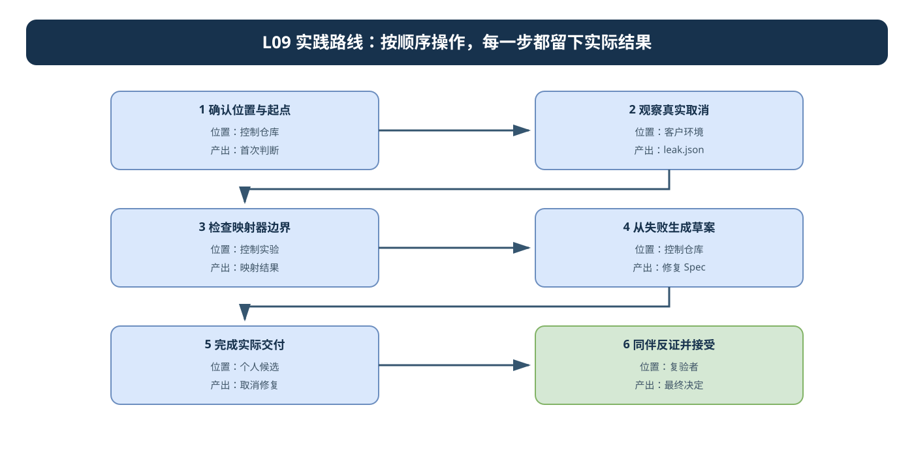
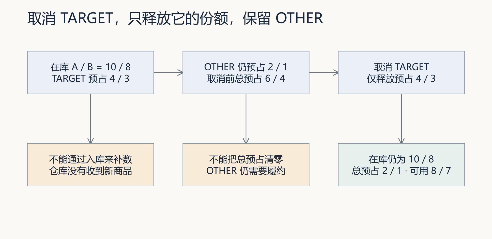
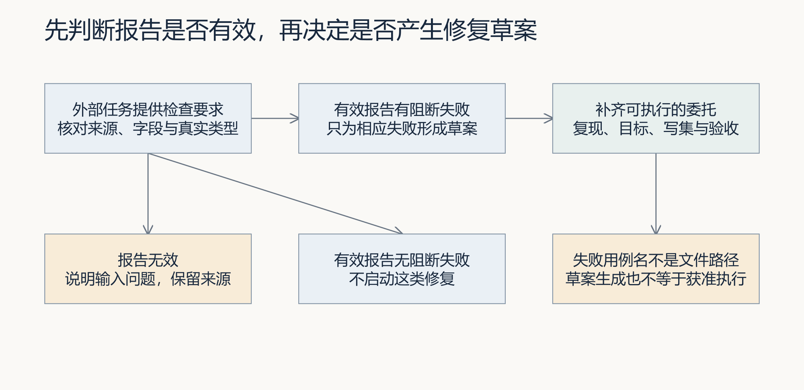
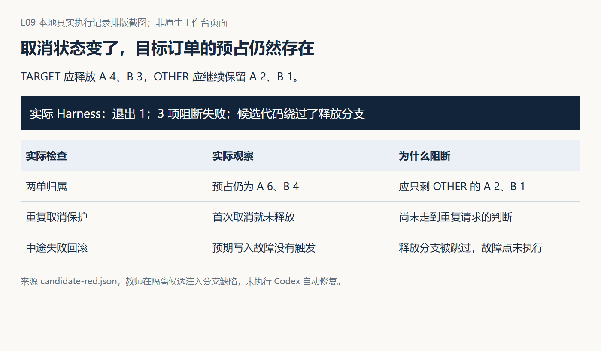

# L09 实践操作手册

> 本资料由 AI 辅助整理，为课程赠送资料，用来辅助你实践练习，非必读资料。

本实践分为参考实验和自己的交付。参考实验帮助理解状态与映射，自己的交付需要实现映射器并修复隔离候选中的取消行为。先读[讲义](辅导资料.md)，在[提交模板](SUBMISSION.md)写下判断，不把预期结果抄成运行证据。

第 2 节会生成 `leak.json`，第 4 节才读取它形成修复草稿。报告必须来自同一次实验，并与真实退出码一起使用；任务编号和个人候选则由后续工作台执行返回。示例 TARGET、OTHER 是教学对象，自己的任务应引用实际订单与预占。

开始操作前，遇到解释器、路径或输出问题，按[执行与排错说明](../../reference/实操手册执行与排错.md)核对。

### 本讲目录地图

```text
〈CodexFDE 控制仓库〉/                ← 起点；参考实验和工作台命令从这里运行
├─ .venv/
└─ .runtime/l09-lab-01/              ← 参考实验报告，如 leak.json

〈独立 FlowERP 仓库〉/               ← 参考实验调用的客户源码
〈course-submit 返回的个人候选〉/    ← 实现映射器并修复取消行为
├─ flowerp/、eval/、tests/
└─ .course/                          ← 来源与任务记录
```

`.runtime/l09-lab-01/leak.json` 是控制仓库中的失败输入，不是个人候选。第 4 节读取它形成草案；工作台返回候选后，才在候选中实现和复验。

本次产品目标是释放 TARGET 的预占并保留 OTHER，工作台目标是把有效失败形成有来源、可复现、可验收的委托。人确认范围，Codex 协助调查和实现，复验者检查原报告与实际候选；三者的结果分别记录。

## 先看流程图，再开始操作



参考实验的 `leak.json` 只是失败输入；个人候选才是实际修复对象。沿图逐步推进，不要混用两者。可编辑源文件：[l09-practice-flow.drawio](./assets/l09-practice-flow.drawio)。

### 按图执行的完成标志

| 步骤 | 在哪里操作 | 进入下一步前必须留下什么 |
|---|---|---|
| 1. 确认位置与起点 | 控制仓库 | 首次判断 |
| 2. 观察真实取消 | 客户环境 | leak.json |
| 3. 检查映射器边界 | 控制实验 | 映射结果 |
| 4. 从失败生成草案 | 控制仓库 | 修复 Spec |
| 5. 完成实际交付 | 个人候选 | 取消修复 |
| 6. 同伴反证并接受 | 复验者 | 最终决定 |

## 第 1 步：确认位置与能力起点

<!-- step-guide-1 -->
> **一句话说明：**先确认当前目录和已有能力，再写下取消订单后预占应该怎样变化。

开始本讲 FDE 实践时，先在[提交模板](SUBMISSION.md)的首次判断与需求记录回答：取消后谁仍无法使用库存，观察对应哪张订单和哪个时点，为什么当前证据支持这份修复范围？注明来源是实际观察、同伴试用还是教学设置，写下本次选择和暂缓范围，再请 Codex 协助调查。

沿用 L04 接受的控制工作台。在项目根目录，Windows PowerShell 激活本项目环境：

```powershell
. ./.venv/Scripts/Activate.ps1
python -c "import sys; print(sys.executable)"
git rev-parse HEAD
git status --short
python -X utf8 -m workbench.cli course-contract --lesson 9
git rev-parse --verify course/l09-start
```

macOS/Linux 激活命令为 `source .venv/bin/activate`。环境未准备好时先看[学生入口](../../README.md)。记录工作区位置、未提交修改和课程起点；控制工作区、参考实验临时库与个人产品候选是不同对象。

用自己的话写出：TARGET 预占 A/B 为 4/3，OTHER 为 2/1，在库为 10/8，取消 TARGET 后四组数字怎样变化。再预测取消草稿、重复取消和已发货取消的结果。

## 2 用真实服务观察取消

<!-- step-guide-2 -->
> **一句话说明：**用真实服务复现“订单取消但预占没有释放”，保存取消前后的业务状态。

**运行前确认：** `cancellation_lab.py` 自动使用独立 FlowERP 的解释器，生成本轮真实报告。先完成[客户环境检查](../../reference/实操手册执行与排错.md#product-environment)。`leak` 应退出 1 并生成报告，第 4 节再使用该报告和实际退出码生成草案；其余模式预期退出 0。重复实验换新目录，保留旧报告。



图 1｜先按图计算 TARGET 取消后的预占与可用量，再运行。OTHER 不能被误释放，在库量也不能因取消而增加。

以下路径用于第一次运行；再次运行换一个新目录，脚本会拒绝覆盖旧报告。

```bash
python -X utf8 docs/courses/L09/examples/cancellation_lab.py normal --report-path .runtime/l09-lab-01/normal.json
python -X utf8 docs/courses/L09/examples/cancellation_lab.py draft --report-path .runtime/l09-lab-01/draft.json
python -X utf8 docs/courses/L09/examples/cancellation_lab.py repeat --report-path .runtime/l09-lab-01/repeat.json
python -X utf8 docs/courses/L09/examples/cancellation_lab.py shipped --report-path .runtime/l09-lab-01/shipped.json
python -X utf8 docs/courses/L09/examples/cancellation_lab.py write-error --report-path .runtime/l09-lab-01/write-error.json
python -X utf8 docs/courses/L09/examples/cancellation_lab.py leak --report-path .runtime/l09-lab-01/leak.json
```

每条之后立即记录退出码，PowerShell 使用 `$LASTEXITCODE`，macOS/Linux 使用 `$?`。前五条预期 0，leak 预期 1。正常、草稿与重复模式最终总预占为 2/1，可用为 8/7，OTHER 不变。草稿模式不为 TARGET 生成释放事件；重复请求应拒绝且第二次请求前后四表不变。

shipped 检查发货完成后的取消被拒绝，write-error 在第二条释放事件写入时注入故障；两者均比较请求前后四表。脚本退出 0 表示正确观察了拒绝与回滚，不表示取消请求成功。

leak 明确只在临时库把 TARGET 改为 cancelled，遗漏释放，因此实际总预占仍为 6/4。报告来自真实 Harness 执行，但业务缺陷是人为教学注入，没有修改当前参考服务。将 leak 换成 normal 是对照实验，不是个人产品修复。

## 3 检查参考映射器边界

<!-- step-guide-3 -->
> **一句话说明：**检查参考映射器能否把失败报告变成范围受限的修复任务，而不是授权随意修改。



图 2｜图中是个人实现的目标流程。将参考转换器的实际输出逐项对照，记录它在哪些无效输入上没有做到区分，不能把设计图当成运行结果。

```bash
python -X utf8 docs/courses/L09/examples/repair_mapping_lab.py mixed
python -X utf8 docs/courses/L09/examples/repair_mapping_lab.py empty
python -X utf8 docs/courses/L09/examples/repair_mapping_lab.py missing-passed
python -X utf8 docs/courses/L09/examples/repair_mapping_lab.py string-false
python -X utf8 docs/courses/L09/examples/repair_mapping_lab.py missing-evidence
python -X utf8 docs/courses/L09/examples/repair_mapping_lab.py instruction-text
```

实验输出为观察结果：混合报告只选阻断失败；空对象仍生成空任务；缺 passed 被选中；字符串 false 被漏选；缺证据抛 KeyError；指令性证据被复制。包装脚本退出 0 表示观察符合当前参考行为，不表示这些都是应实现的设计。

写出自己准备如何处理三种情况：有效报告有阻断失败、有效报告无阻断失败、无效报告。明确区分“无需这类修复”和“尚不能判断”。

## 4 从真实教学报告生成草案

<!-- step-guide-4 -->
> **一句话说明：**从真实失败报告生成修复草案，再由你补齐草案缺少的业务边界和验收用例。

先确认第 2 节的 leak 模式已运行并保存退出码，在 PowerShell 用 `Test-Path -LiteralPath .runtime/l09-lab-01/leak.json` 核对报告。换了实验目录时，下方输入与输出路径一起替换。报告缺失先查生成步骤，不能继续映射。

使用上一步实际生成的 leak.json，不手写一份假报告替代。下面的参考辅助程序对显式用例和证据类型做检查，再调用原映射器，附加来源路径与哈希。

```bash
python -X utf8 docs/courses/L09/examples/map_report.py .runtime/l09-lab-01/leak.json --case l09_teaching_cancellation --observed-exit 1 --output .runtime/l09-lab-01/repair-draft.json
```

参数 1 必须来自刚才实际观察，不能为了通过校验随便填写。辅助程序可以核对它与报告的逻辑一致，不能证明调用者填写的退出码来自真实进程。文件哈希也不认证来源。

检查输出的 scope 是否只有 `l09_teaching_cancellation`。它是教学用例名，普通 `python -m eval.harness` 没有注册这个临时用例；参考映射器固定生成的全套复现命令不能复现教学注入。请在自己的草案中分别保留上述 leak 完整复现命令和 normal 对照命令，并标注这是机制实验。个人产品任务则使用自己登记的实际用例。

对 normal.json 用 `--observed-exit 0` 和新的输出路径运行，应得到 `no_blocking_repair` 且不生成任务。再把原失败报告配上错误的 `--observed-exit 0`，应非零拒绝。这两项分别验证有效无阻断和证据矛盾，不要混成同一结果。

辅助程序是课程提供的参考支架。它没有补全候选身份、文件授权和验收命令，也不调用执行器。学生需要在个人候选中完成自己的映射实现。

### 4.1 对照真实候选实验，判断草案还缺什么

先打开[候选证据索引](assets/latest/candidate-index.json)。本轮在真正的隔离代码副本中跳过释放分支，生成红灯报告；参考映射器生成草案后，由教师补齐实际文件范围、来源、业务目标和命令，再手工恢复原分支并复验。检查内容不变。



图 3｜两单检查发现预占仍为 6/4；重复检查在第一次取消就失败；故障检查尚未触发写入。先解释这些区别，再确定它们是否需要同一修复任务。

并排读取 candidate-draft.json 与 candidate-reviewed-task.json：标出哪些字段由映射器提取，哪些由教师补充。候选目录中的命令针对三个实际登记的用例；重复运行要使用新的报告和状态目录。图中记录属于教师实验，不是你已执行的任务。

最后比较 candidate-red.json、candidate-repair.diff 与 candidate-green.json。仅服务文件恢复，三个检查内容指纹相同。用你自己的候选重建这条关系，不能复制绿灯来代替执行；复现和验收命令必须在实际目录、解释器和已登记检查上可运行。

## 5 设计本次实际交付

<!-- step-guide-5 -->
> **一句话说明：**在个人候选中修复取消释放预占，只改授权范围，并保留修复前后的复验结果。

先用[调查提示词](prompts/01-区分事实与原因.md)查真实入口与失败来源。Spec 至少写清：

- 产品入口使用哪个服务，取消与重复请求的约定是什么。
- 目标订单和其他订单的状态变化、在库量不变、失败后状态。
- 报告输入约定、等级筛选、无效输入及无阻断失败的不同结果。
- 来源任务与版本、原报告、复现和完整验收命令。
- 调查后确认的具体写集，禁止削弱的业务与检查规则。

先区分两个项目：取消服务属于独立 FlowERP，Repair 映射器属于 CodexFDE 工作台。本讲课程命令返回的是组合教学候选；其中 `flowerp/` 来自独立客户项目，`agent/` 来自工作台，`eval/`、`tests/` 按具体检查的来源区分。允许路径均相对于返回的候选目录，不是 CodexFDE 根目录，也不授权直接修改独立客户仓库。通过候选来源记录核对原路径与哈希，再收窄到必要文件。用[实施提示词](prompts/02-实现有界修复.md)先形成范围决定，再核对实际任务和执行器中的范围。

工作台可通过项目调用 Codex，无需桌面 App：

```bash
python -X utf8 -m workbench.cli course-submit --lesson 9 --execute-code --actor "实际构建者姓名" --runtime-dir .runtime/l04-learning --execution-timeout 900
```

返回后按[提交结果与续做说明](../../reference/实操手册执行与排错.md#course-result)先保存退出码、任务编号和候选路径。退出 0 且状态为 `review` 才继续候选复验；非零先查原任务错误，不重复提交，不用控制仓库替代缺失候选。

需要可用执行器与认证。保存真实任务编号、隔离候选路径、起始红灯、任务 Spec 和执行输出。若任务仅含课程通用描述，继续按 L04 的任务审查流程补齐本次来源与具体范围后再委托，不能声称命令已经自动完成这些决定。

在实际候选的环境中运行默认入口，并使用每轮新报告路径：

```bash
python -X utf8 -m eval.harness --suite blocking --case cancellation_releases_reservation --report-path .runtime/l09-review-01/selected.json
```

默认用例只检查一次入门取消后的可用量与预占。个人新增检查应覆盖两单隔离、草稿、重复、非法状态和中途回滚，并登记到同一 Harness。针对正式页面的交付还要测它实际调用的服务。不要在参考库运行脚本、却把结果归给个人候选。

实现自己的映射器，核对输出不仅有描述，也有可以运行的验收命令与经过确认的允许写集。修复后运行同一用例与新增用例，再运行完整 blocking 套件。保留失败、Diff 与新报告，解释测试本身的任何修改。

## 6 同伴反证与接受

<!-- step-guide-6 -->
> **一句话说明：**同伴使用不同数据反证取消路径，最后由实际负责人决定接受还是继续返工。

请同伴用[复验提示词](prompts/03-复验与反证.md)从原报告重新判断。改变 OTHER 的数量，检查它的预占是否被保留；再挑一项拒绝路径复验。记录实际同伴反馈、本人回应和修订后的结果。

用 [repair-task-review Skill](skills/repair-task-review/SKILL.md)审查四个参考反例与个人任务，保留实际响应，指出一项正确判断或遗漏。没有模型行为记录时只写“结构已准备”；没有同伴时写“自查、待同伴复验”。

回到同一工作台任务，依据 L04 的具名接受或打回流程作出决定。检查通过不替代负责人接受。若有实际使用条件，再确认取消后新订单能使用释放的库存；没有条件就保留效果待验证。

| 遇到的问题 | 下一步判断 |
|---|---|
| 报告不存在 | 检查是否运行、写到哪里、进程是否提前失败 |
| 映射输出 scope 为空 | 先区分有效无阻断和无效输入 |
| 教学用例在普通 Harness 找不到 | 它仅在实验进程临时登记，用实验命令复现 |
| 默认用例绿但页面仍错 | 核对入门服务与正式服务入口 |
| 修复需要越出写集 | 提交证据与新增范围，等待实际范围决定 |
| 第二次取消报错 | 对照已确认的拒绝语义，检查状态未重复改变 |
| 修复后只保存了新报告 | 补回来源关系，保留已有失败，不能改造旧证据 |

**交接时回到使用现场**：先由业务确认者核对目标订单与其他订单的保留要求，再请同伴增加 OTHER 数量反证；关联原报告、修订和具名接受理由。迁移到采购申请原因丢失时保留事实与假设分离方法，重新定义持久化预期，并记录实际采用版本或待验证状态。沿用本讲已有证据位置，不另交重复表格。
