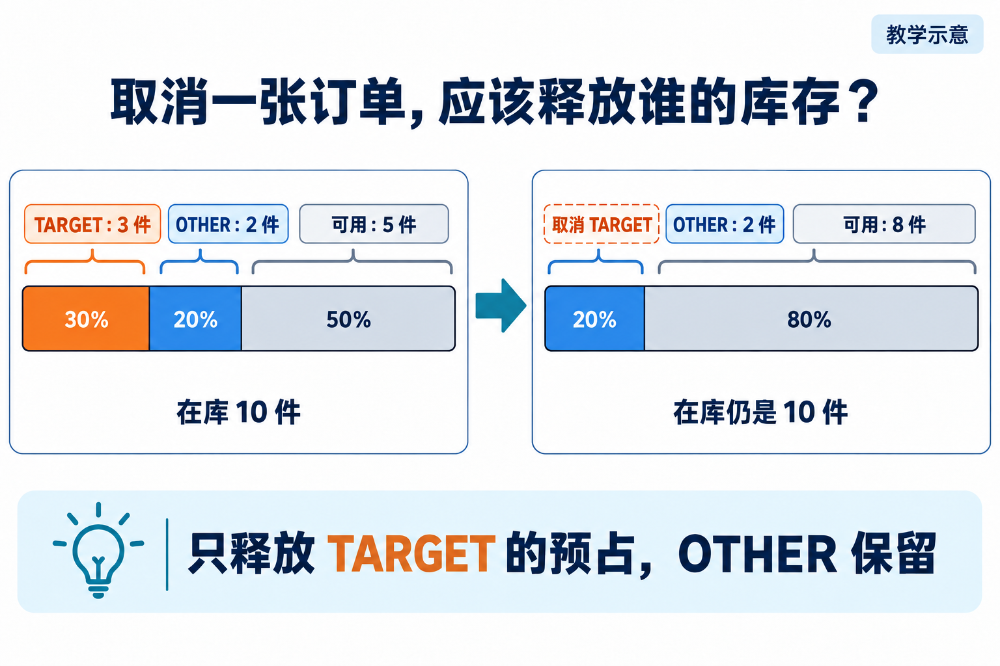
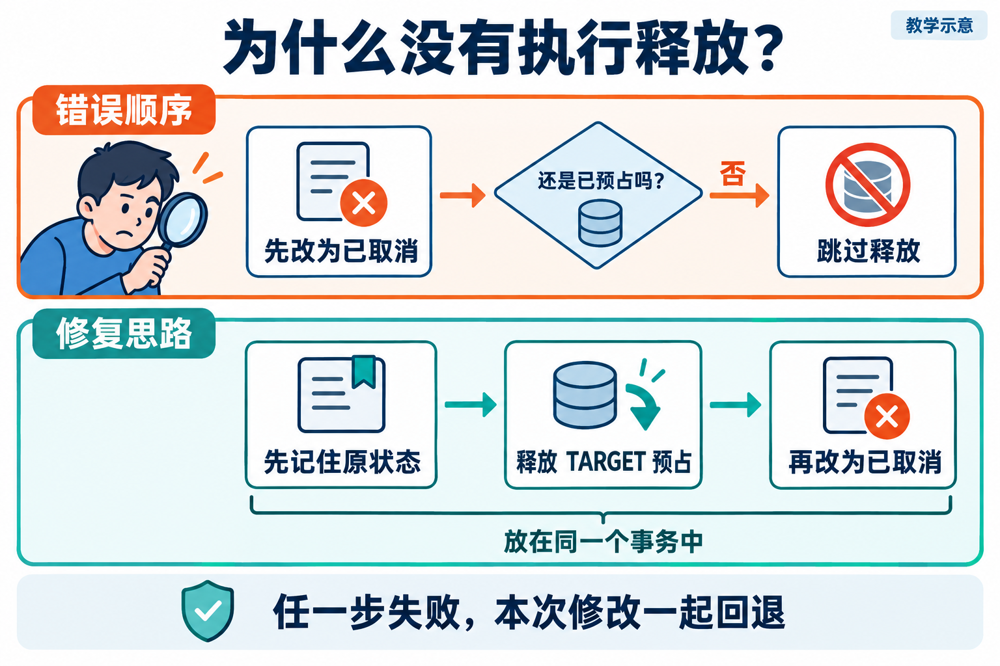
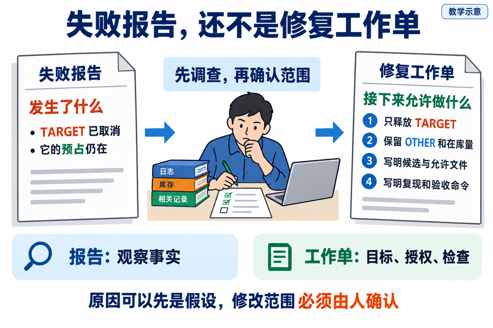

# L09｜把失败报告翻译成修复任务

L08 已经让订单能够整单预占，并把检查放进远程复验。接下来客户取消一张已预占订单：订单显示“已取消”，那三件货却仍不能卖。原来的成功报告不能证明这次取消也正确，必须运行对应检查。

检查发现失败后，工作台已经能保存报告。但“报告里有一个红灯”还不是可以交给 Codex 的任务：哪里能改，怎样复现，修好后应看到什么，仍需说清。

这一讲跟着取消故障走完“确认业务差异 → 调查原因 → 形成修复任务 → 原检查复验”。你作范围判断，Codex 协助调查和修改，工作台把可信报告中的信息整理成任务。目标是释放正确订单的预占，并留下以后可复用的任务转换方式。


## 1｜先别改代码，看看这三件货属于谁

先用一组教学数据算清楚：仓库里有商品 A 共 10 件。我们把要取消的订单记为 TARGET，另一张要保留的订单记为 OTHER。TARGET 预占了 3 件，OTHER 预占了 2 件，剩下 5 件可以卖。“预占”就是先留给某张订单，货还在仓库里。

TARGET 取消后，它的 3 件应该重新变得可用，OTHER 的 2 件仍要保留。所以正确结果是：在库仍为 10，可用从 5 变为 8。



**图 9-1　取消 TARGET 后，只释放它的三件预占，OTHER 的两件保留**

*左边的色块表示三种占用情况，右边变为两种。总量仍是 10，释放的是预占，不是把货移出仓库。*

这时有两个看起来都很“简单”的改法。第一种只把订单文字改成“已取消”，库存不动，客户的问题仍在。第二种把所有预占清零，可用量变成 10，却把 OTHER 的货也放出去了。

因此，修复目标不能只写“可用量增加”。我们已经从现场算出了更准确的要求：**只释放 TARGET 的预占，OTHER 保留，在库不变。** 后两项是在这次操作中必须保持的关系，也叫不变量。

目标清楚后，才轮到调查代码。

## 2｜沿着一次取消往下查，找到没有执行的那一步

你先请 Codex 做只读调查：“确认这份报告来自哪版代码，找到 TARGET 的取消入口，沿调用顺序说明订单状态和预占分别在哪里修改。”

这里先固定被检查的那版代码，后面称它为“候选 V0”。这样你与 Codex 就在讨论同一版代码，后续也能确认检查的是不是刚改过的版本。

假设调查发现下面的顺序。这是教学用的错误写法，用来解释原因，不是当前产品源码：

```python
order.status = "cancelled"
if order.status == "reserved":
    release_reservation(order.id)
```

cancelled 表示“已取消”，reserved 表示“已预占”。第一行已经把状态改为“已取消”，第二行再判断它是不是“已预占”，结果就为否，第三行的释放操作因此被跳过。此时去重写释放函数，反而修错了地方。



**图 9-2　先改状态使释放分支被跳过，修复时用原状态决定释放并放在同一事务中**

*上排看错误怎样发生；下排看修复顺序。先记住原状态，才能知道这张订单原来有没有预占。*

修改思路随之明确：先读取原状态；若原来已预占，就释放 TARGET 的数量，并记下一条“哪张订单释放了多少”的记录，这条记录叫释放流水；最后改为已取消。这组修改放进同一个**事务**，成功时一起保存，出错时全部撤回。

为什么还要事务？配套实验有 A、B 两个商品。释放 A 成功、释放 B 失败时，如果只完成一半，账还是错的。增加第二个商品，正好能检验“中途出错时，前面的修改是否也撤回”。

到这里，我们才有理由建议修改取消方法及其事务边界。调查前，“释放函数可能有问题”只是猜测；调查后，可以说清具体哪一步与预期不符。

## 3｜把发现交给 Codex：一份工作单如何形成

假设这次有两个红灯：“取消后预占未释放”和“没有释放流水”。沿代码查下来，它们都因为同一个分支没执行，就可以放进同一份修复任务，分别保留两项验收。若另有“导出表头乱码”，与这条调用路径无关，就另建任务。

这一步叫分诊：根据共同原因和修改范围决定合并、拆分或继续调查，而不是按错误行数派任务。连接超时但不知道请求是否执行，就先查请求和提交状态，暂不猜一个业务修复。

现在写工作单。它不需要很长，却要让接手者知道改哪份代码、允许改哪里、做到什么算完成：

> **本次修复工作单示例**
>
> 修复候选 V0 的取消行为。依据是这次失败报告及其原始复现命令。
>
> 目标：取消 TARGET 后，只释放它自己的预占；OTHER 与在库保持不变。
>
> 范围：逐一列明调查确认后允许修改的文件。其他程序调用取消功能的方式、原验收规则和历史报告保持不变。
>
> 检查：先在 V0 重现同一个错误；修改后重跑原检查，再检查其他订单、重复取消和中途写入失败。
>
> 若需要扩大范围，先说明原因。交回修改前后的代码差异（Diff）、运行结果和剩余问题。

实际使用时，要把“候选 V0”“实现文件”“原用例”换成真实目录、版本、具体文件及完整命令。这些信息不能让接手者猜。



**图 9-3　失败报告经过调查和范围确认，才能成为修复工作单**

*左边说明发生了什么；右边说明接下来允许做什么。中间的判断，正是本讲要练的能力。*

每次都手抄这份工作单容易漏项，于是我们给工作台增加一个“映射器”：把检查报告里的信息整理成修复任务。它先核对报告，再提取会阻止当前交付的失败，也就是**阻断失败**，并带上原始证据与来源。你已经确认的目标和允许修改的文件，一起填入草案。

只用于提醒、暂不阻止交付的**观察级告警**另行登记；若报告缺失或无效，就先补齐报告，不能按“没有失败”处理。

它自动整理的是已取得的信息，不能凭错误名称自动知道所有应改文件。你先确认草案，再让 Codex 执行。这样，工作台增加的映射能力就真正用在了 FlowERP 修复上。

## 4｜改完以后，回到刚才那张订单

Codex 交回修改，形成 V1。你先看差异是否在约定范围，再用原检查运行 V1。

如果结果显示 TARGET 已取消、可用量为 8，还要接着核对：OTHER 的预占是否仍为 2，在库是否仍为 10，释放流水是否属于 TARGET。全部对上，才符合第一节算出的结果。

接着检查两个容易遗漏的地方。按当前参考实现约定的处理规则，再次取消同一订单应被拒绝，不能再释放一次；若第二个商品写入失败，本次变化应一起回退。正常路径回答“该发生的有没有发生”，失败路径回答“出错以后有没有留下半成品”。

这组结果满足要求，就将 V1 和报告交给审核者；仍失败，就保留当前代码、失败项和已尝试办法，交回判断。L09 到此完成一次修复交接。是否值得再修一轮，是 L10 接着解决的问题。

## 5｜现在把这条路线做一遍

打开[实践操作手册](实践操作手册.md)，先按第 1～4 步认识输入、取消实验和任务草案，再到第 5 步组织自己的真实交付，第 6 步请同伴复验。手册改用两个商品检验中途失败：TARGET 预占 A 商品 4 件、B 商品 3 件；OTHER 分别预占 2 件、1 件。取消 TARGET 后，A/B 的总预占应分别剩 2 件、1 件，在库仍分别为 10 件、8 件。先算，再核对输出。

请特别分清：脚本的 leak 模式是人为注入故障，normal 是参考对照。仅切换模式得到红灯和绿灯，不能说明你修过同一版代码。自己的工作单、代码差异、前后检查和反馈，写进[提交模板](SUBMISSION.md)。

完成后让同伴把 OTHER 的预占从 2 改为 4，再问你正确可用量是多少。按开头单商品案例应为 6。如果程序仍输出 8，就暴露了写死示例答案的问题。你能解释并处理这个反例，才说明掌握了可迁移的修复方法。

**本讲要学会的能力：根据失败事实确定修复范围，把任务交代清楚，再判断修改是否有效。**

需要实现映射器时，再读[实现细节与扩展阅读](实现细节与扩展阅读.md)，其中区分基础映射器、严格映射器与教学命令；更完整的历史实验见[参考详解](参考详解.md)。

## 本讲留下什么，下一讲怎样接着用

本讲交出取消修复，以及把阻断报告变成任务的映射方式。L10 会在每轮检查后复用它：成功就停止，有失败则判断是否值得继续，不能无条件循环同一句修复要求。

[课程蓝图与学习路线](../课程蓝图.md#l01l12-的连续学习路线) · [实践操作手册](实践操作手册.md) · [上一讲](../L08/辅导资料.md) · [下一讲](../L10/辅导资料.md)

## 课程大纲中的本讲要求

- **核心内容**：从失败证据提取范围、复现命令、目标状态和禁止变更。
- **演示结果**：Harness 失败报告生成一个只针对失败项的修复任务。
- **课内增量**：实现失败报告到修复任务的映射器。
- **通过标准**：任务包含复现步骤和验收命令；不把观察级告警误判为阻断任务。

配图为教学示意；来源与提示词：[新增案例图](assets/reading-story-20260926/生成说明.md)。
