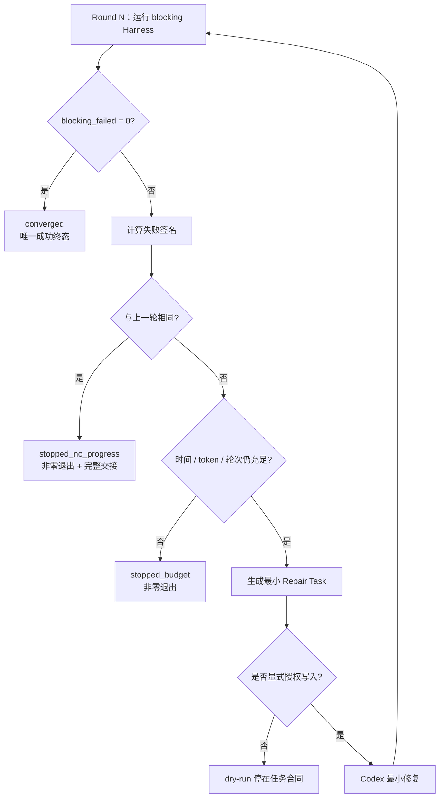
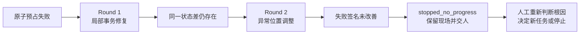
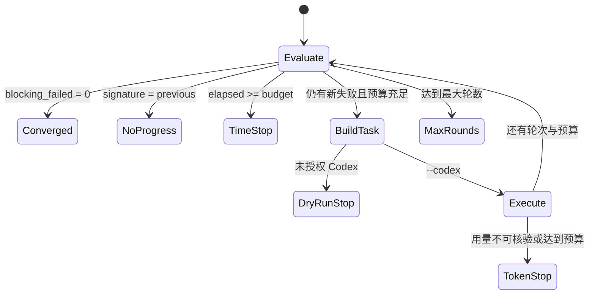
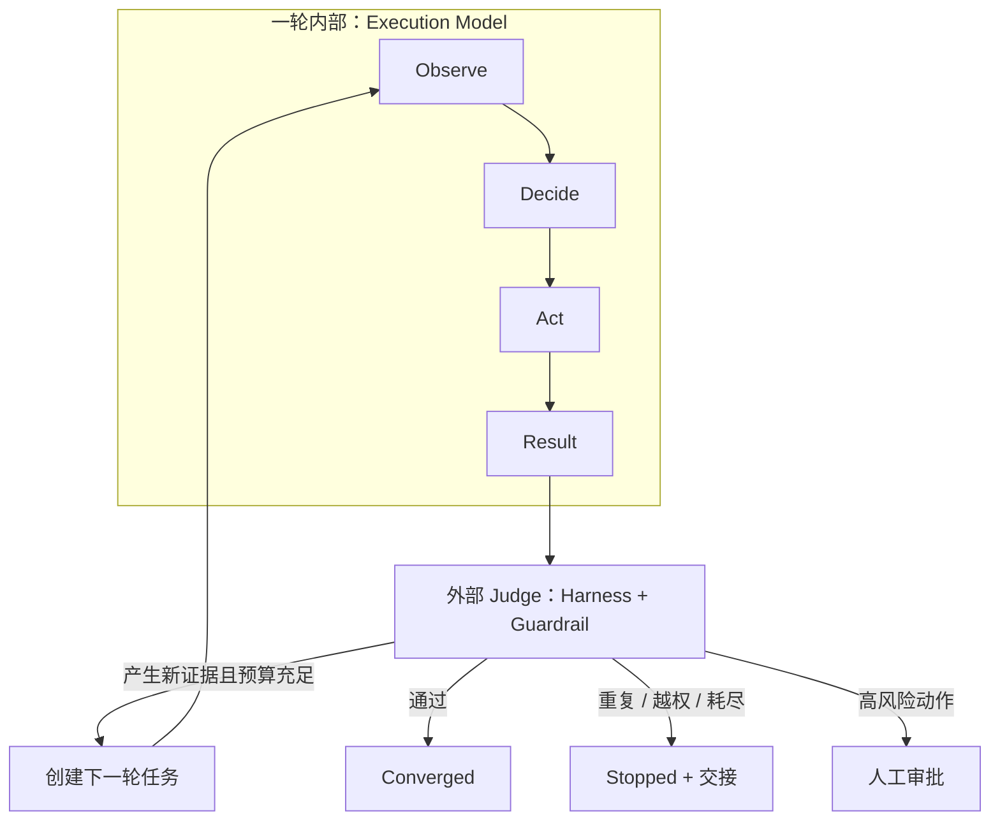
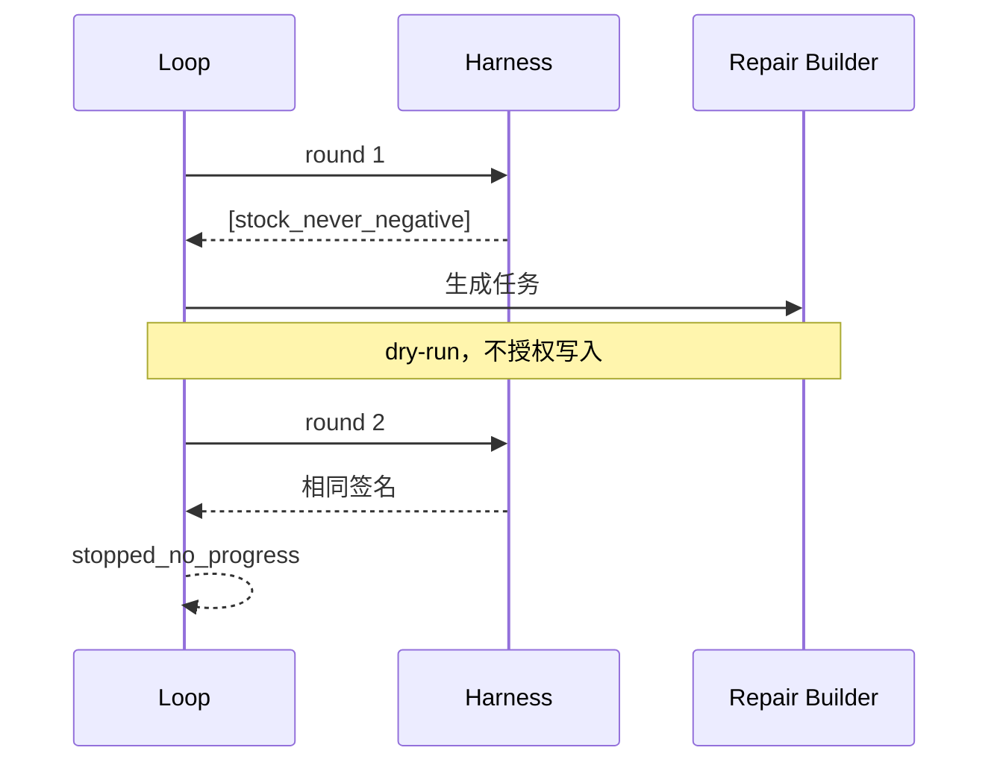
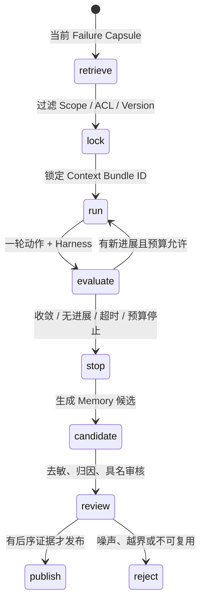

# L10｜建立有停止条件的修复 Loop

<details>
<summary>本讲课程合同与建设状态（教师/助教）</summary>

- **核心内容**：最大轮数、达标即停、无进展检测、时间与 Token 预算、安全退出。
- **演示结果**：修复循环成功收敛一次，并展示一次未收敛退出。
- **课内增量**：串联“执行 → Eval → 生成修复任务 → 再执行”。
- **验收命令**：`python -X utf8 -m agent.loop --max-rounds 3`
- **通过标准**：最多三轮；达标即停止；无进展或预算耗尽时输出剩余失败，不宣称成功。

> 课程建设状态说明：本讲 Loop 控制器、故障场景、活动和评价规则属于已经形成的课程设计；学生控制合同、三类轨迹、停止判决和达成数据属于待真实开课采集。参考 Loop 成功收敛不能替代学生证明其会在无进展、振荡或预算耗尽时安全停止。

> **基础线唯一性**：本讲交付一条合法订单状态迁移，并用最多三轮的有界 Loop 处理其失败；全绿、无进展和预算耗尽必须给出不同停止证据。

</details>

## 连续案例｜第三幕：第三轮结束，不代表问题解决

**时间**：第三周周一 16:30　**地点**：自动修复实验室

团队把上一讲的单轮修复连接成 Loop，并把最大轮数设为三。第一个实验顺利转绿，大家开始讨论把轮数提高到十。第二个实验却连续三轮生成几乎相同的 Diff，每轮都绕过真正失败的订单状态迁移。

运行器最后输出“completed after 3 rounds”。周岚把它理解为任务完成，顾宁却认为这是预算耗尽。更糟的是，三轮历史只保留最后一次结果，没人能判断系统是在接近目标、原地踏步，还是让其他 Eval 退化。

林默必须给“进展”一个可观察定义：阻断失败是否减少，失败身份是否改变，Diff 是否提供新信息，旧绿灯是否保持。停止也必须有不同语义——全绿是成功，无进展是安全停止，预算耗尽是未完成；它们不能共享一个 `completed` 状态。

自动化真正危险的时刻不是报错，而是消耗完预算后用完成语气结束。Loop 的价值也不在多跑几次，而在更早识别何时继续已经没有证据支持。

> **决策时刻**：请分别写出“继续、成功停止、安全停止”的判据，并运行一次注定无进展的修复器。若 History 不能让第三方解释每轮为何继续或停止，本实验不得通过。

有界 Loop 让自动返工第一次可控，但速度仍然不够。采购模块同时需要规格审查、Eval 设计和风险分析，团队准备让多个 Agent 并行工作；他们尚未画出共享文件的冲突边界。

## 图文学习导航

### 先进入现场：自动修复跑了三轮，最后一句“已停止”究竟是成功还是失控


*观察重点：Loop 的核心不是“再试一次”，而是每轮都有输入、Diff、Eval、进展判断和预算；收敛、无进展、预算耗尽是三种不同结论。*

**先别看答案**：为同一个失败分别设计“继续”“成功停止”“安全停止”条件。随后运行一个注定无进展的修复器，验证系统不会因为到达最大轮数而自报成功。

本讲按“失败任务 → 单轮结果 → 进展函数 → 三种停止 → History 审计”学习。以 [OpenAI Evaluation Best Practices](https://developers.openai.com/api/docs/guides/evaluation-best-practices) 校准目标和失败样本，以 [Google SRE Automation at Google](https://sre.google/sre-book/automation-at-google/) 讨论自动化收益、复杂度与人工控制边界。

## 学员正文｜自动修复最重要的能力，是知道什么时候必须停

订单状态缺陷进入第三轮。每轮 Agent 都改了一点代码，失败数量也从 3 变成 2，但关键 case `illegal_transition_is_blocked` 的签名没有变化：草稿订单仍能跳过预占直接发货。系统准备开启第四轮，理由是“仍有进展”。林默意识到，轮次、Diff 大小和失败数量都可能制造勤奋的假象。

Loop 不是把 Repair Task 放进 `while`。它是一套跨轮控制权：谁判断进展，预算怎样扣减，哪些风险立即停止，停止后如何把完整轨迹交给人。最诱人的错误路线是把 `max_rounds=3` 当作安全设计；跑满三轮只说明预算耗尽，不能把最终状态改写成成功。

先运行观察模式，分清基线评估与真实修复授权：

```powershell
.\.venv\Scripts\python.exe -X utf8 -m workbench.cli course-contract --lesson 10
.\.venv\Scripts\python.exe -X utf8 -m agent.loop --max-rounds 3
```

然后为五类停止条件写出可判定信号：全部 blocking 转绿；最大轮数；Token 或时间预算耗尽；连续失败签名无变化；失败集合在两个状态之间振荡。若执行器无法报告实际用量，也不能假设预算充足。每轮 History 应保存输入任务、候选提交、写集、Eval 报告、失败签名、资源消耗和停止判断，而不是只保留最后一轮摘要。

### 把关键代码读懂｜停止原因为什么不能共用 `completed`

```python
report = suite_runner("blocking", write_report=True)
failures = _signature(report)
if not failures:
    return finish("converged", round_no, [])
if failures == previous:
    return finish("stopped_no_progress", round_no, failures)
if time.monotonic() - started >= timeout_seconds:
    return finish("stopped_time_budget", round_no, failures)
```

- 第一、二行每轮都重新读取统一 Harness，并把失败压成可比较的稳定签名。
- 失败集合为空才叫 `converged`，这是唯一成功停止。
- 与上一轮完全相同表示没有新证据，系统应交还控制权，而不是继续烧预算。
- 时间耗尽是未完成的安全停止；它与成功使用不同状态，第三方不需要读安慰性总结来猜结论。

行动课需要两条真实轨迹。收敛轨迹中，合法订单状态迁移修复后同一 Eval 转绿，Loop 在达到上限前结束。未收敛轨迹中，故障注入器重复返回相同失败或在 A/B 之间振荡，Loop 必须安全停止，ERP 状态保持可解释，并生成下一位人工处理者能继续使用的交接包。

**看似合理的错误路线**是用模型自评“本轮有进展”。模型可以提出解释，但停止信号必须来自可比较的证据：case 身份、失败签名、权威状态和实际预算。否则一段更乐观的总结就能绕过控制器。

同伴复核时，把 History 中的轮次编号和总结文字暂时隐藏，只给出每轮失败签名、Diff 哈希、预算消耗和 ERP 状态，让复核者判断轨迹是否收敛。若结论与系统不同，先修停止判据，不要让模型补写更有说服力的理由。控制系统必须在不依赖作者叙述时仍能被审计。

**第二次签字**：对当前轨迹选择继续、停止或升级人工，并引用失败签名变化、剩余预算、ERP 状态与最后可接受候选。若你只引用“已运行三轮”，结论没有工程含义。

有界 Loop 让一个任务不会无限消耗，却不意味着所有调查都应串行。采购申请涉及业务规则、测试覆盖和权限审计，独立证据可以并行收集；共享事实不能并行写入。下一讲从任务冲突图开始，而不是从“多开几个 Agent”开始。

<details>
<summary>附录：课程合同、教师活动、技术参考与证据模板</summary>

<details>
<summary>教师备课区：课程目标、评价与持续改进</summary>

## 三载体课堂交接

- **PPT 引导决策**：使用 [PPT 逐讲决策脚本](./PPT逐讲决策脚本.md) 的“L10”四个镜头；在学生提交第一次选择、依据和最大风险前，不揭示后果页。
- **Markdown 承载教材**：本讲连续案例、图文导航与学员正文/核心章节负责查证和建模；学生必须保留第一次判断与证据驱动的第二次签字。
- **VS Code 完成行动**：打开 [课程工作区](../../course/FlowERP-AI研发工作台.code-workspace)，先运行“查看本讲合同”，再按 [L10 行动卡](../../course/tasks/L10-有界Loop.md) 构造失败、完成受控修改并复验。
- **回收证据**：命令、输入、退出码、报告 ID、权威状态、Diff 和剩余风险回写本讲提交包；只交投票、代码或绿色截图均退回。

> 载体顺序固定为：PPT 第一次签字 → Markdown 查证 → VS Code 行动 → Markdown 第二次签字。完整规则见 [三载体课程实施方案](./三载体课程实施方案.md)。

## 国家级一流本科课程教学设计卡

| 维度 | 本讲设计 |
|---|---|
| 对应课程目标 | CLO-4：设计能收敛或诚实停止的有界自动修复控制器 |
| 工作台主线增量 | 串联执行、Eval、Repair Task 和再执行，加入轮次、时间、Token 与无进展停止 |
| FlowERP 的作用 | 用非法订单状态迁移验证 Loop 收敛，并保留不可收敛安全退出轨迹 |
| 高阶性 | 用失败签名评价进展，权衡轮次、时间、Token 和质量回归，设计多种合法停止状态 |
| 创新性 | 把生成式 AI 修复建模为反馈控制问题，Harness 是传感器，预算和守卫是安全边界 |
| 挑战度 | 必须分别展示成功与未收敛；轮数用完、用量失明或失败减少都不能冒充成功 |
| 学生中心活动 | 学生先画控制回路并预测停止原因，再运行两条路径、审计历史、互换反例 |
| 课程思政融入 | 承认能力和预算边界，遇到未知或无进展及时交还控制权，强化安全与责任伦理 |
| 形成性评价 | 控制图 + Loop History + 用量记录 + stop reason + 剩余失败 |
| 持续改进数据 | 统计假成功率、无进展识别率、预算超限率和停止原因解释正确率 |

</details>

<details>
<summary>课程合同、边界与前沿校准</summary>

## 本讲知识合同

| 合同项 | 本讲约定 |
|---|---|
| 主线起点 | L09 已限定单轮修复授权，但失败后继续几轮、花多少成本和何时停仍未定义 |
| 唯一技术命题 | 如何用失败签名、进展规则和多重预算控制跨轮自动修复 |
| 必须掌握 | 唯一成功态；稳定失败签名；Target/Guardrail 进展；轮次/时间/Token 预算；安全停止交接 |
| 能力判据 | 能让全绿立即停、同签名无进展停、预算耗尽停，并对每个终态给出不同证据与退出语义 |
| 本讲不做 | 不并行任务，不中途暗换上下文，不让失败数量下降抵消新回归，不把用完轮数称为成功 |

## 大纲锚点与前沿校准（2026-08-19）

- **大纲锚点**：串联“执行 → Eval → Repair Task → 再执行”，最多三轮，并展示成功收敛和未收敛安全退出。
- **前沿采用**：采用失败签名、无进展/振荡、墙钟与可核验用量预算；长任务 Goal 不扩大原有 sandbox 与 approval。
- **不越界**：本讲只做串行控制，不引入 Subagents；轮数用完、失败变少或模型自述都不是成功。
- **链路交接**：把安全停止且需要独立调查的问题交给 L11 判断能否并行。详见[校准矩阵](./16讲主线与前沿校准矩阵.md)。

**主线坐标**：Repair Task 已经限定“改什么”，Loop 开始限定“最多改几轮、用多少时间和 Token、看见什么证据后停止”。本讲目标是修复订单非法状态迁移；工程账新增跨轮状态、失败记忆和非成功终态，循环不得扩展到采购审批。

**这一讲把系统推进到哪里**：FlowERP 的订单状态机通过有界 Loop 恢复合法迁移，同时保留一条故意不能收敛的轨迹；工作台获得轮次、时间、用量、无进展签名和安全停止。目标 Eval 转绿与 `stopped_no_progress` 两类 History 共同构成本讲证据。Loop 最值钱的能力不是“继续”，而是知道什么时候继续已经不再经济。

</details>

## 本讲行动工单：让循环接受五条失败轨迹的压力测试

学员先以订单非法状态迁移为真实 Repair Task，写 Loop 控制合同和状态表，再实现失败签名、预算、停止原因与 History。必须运行一条真实收敛轨迹，以及同签名无进展、A/B 振荡或新回归、墙钟超时、Token 未知/耗尽等受控轨迹；每条轨迹都要有明确终态和退出语义。执行器不能修改 Eval，裁判不能顺手修代码。

- **工作台增量**：有界控制器、失败签名、可核验预算、History 和安全交接；
- **FlowERP 产品状态**：用有界 Loop 修复订单非法状态迁移，同时保留一条未收敛安全退出轨迹；不扩展到采购审批；
- **失败证据**：未收敛轨迹必须保留剩余失败，不能用轮数耗尽冒充成功；
- **迁移证据**：为一个不应自动修复的非 ERP 任务写禁止启动判决；
- **讲师硬门槛**：提供可重复执行器/夹具，不能用随机模型输出冒充五条稳定轨迹。

详见[可执行任务卡](../../course/tasks/L10-有界Loop.md)。

<details>
<summary>教师备课区：教学活动与达成度设计</summary>

## 本讲教学设计总览

| 项目 | 设计 |
|---|---|
| 建议学时 | 30 分钟线上精讲 + 70 分钟线下行动 + 45 分钟控制器实验 |
| 课堂类型 | **控制系统实验**：在启动前写清采样、动作、预算和停止条件 |
| 核心问题 | 自动修复什么时候应继续，什么时候必须诚实停止并交还控制权？ |
| 教学重点 | 失败签名、轮次/时间/Token 预算、无进展、计量失明、History |
| 教学难点 | 区分失败数量下降与真实进展；识别振荡和假收敛 |
| 课堂产出 | 三条 Loop 轨迹 + 停止原因审计 + 人工交接包 |
| 价值塑造 | 承认“不知道”和“预算耗尽”是负责任的工程终态，不伪装成功 |

### 可测学习成果

| 编号 | 学习者能够 | 达成证据 | 达成标准 |
|---|---|---|---|
| L10-O1 | 为 Loop 定义可区分的成功、无进展、超时、预算和失明终态 | 状态合同 | 只有 converged 被解释为成功 |
| L10-O2 | 用稳定失败签名识别收敛、停滞和振荡 | 三轮 History 判读 | 4 个轨迹全部判断正确 |
| L10-O3 | 证明轮次、时间和实测 Token 预算真实生效 | 边界实验 | 到达边界即停止，无多执行一轮 |
| L10-O4 | 在停止后生成不丢失败证据的人工交接包 | 交接记录 | 最后报告、Diff、原因和下一步齐全 |

### 30 分钟线上精讲 + 70 分钟线下行动

| 场域与时间 | 学习活动 | 学生当场证据 |
|---|---|---|
| 线上 0–8 分钟 | 展示连续两轮相同失败，学生先决定继续或停止并估算成本 | AI 介入前控制决策 |
| 线上 8–20 分钟 | 讲解最大轮数、达标即停、无进展、振荡、时间和 Token 预算 | 控制合同草图 |
| 线上 20–30 分钟 | 比较 A→A、A→B→A、A+B→B→空三类 History | 失败签名判读表 |
| 线下 0–16 分钟 | 运行全绿立即收敛路径并核对没有多余轮次 | 轨迹 A |
| 线下 16–34 分钟 | 运行无进展与振荡路径，确认不会伪装成功 | 轨迹 B 和剩余失败 |
| 线下 34–50 分钟 | 卡住 Token/时间边界并模拟计量缺失 | 轨迹 C 和预算证据 |
| 线下 50–70 分钟 | 同伴主持控制器听证，决定重试、分拆、转人、改 Spec 或停止 | 具名停止判决、交接包与离场票 |

### 达成度与持续改进

采集终态判断正确率、预算越界次数、无进展多跑轮数、振荡识别率和交接字段完整率。任何预算越界均为硬性未达成；超过 15% 学员把最大轮数耗尽称为成功，则增加状态语义对抗题；同签名误判集中出现时，补充证据指纹稳定化实验而不是直接增加重试轮数。

</details>

## 本讲现场｜修复器连续两轮给出同一种失败

上一讲已经得到最小修复合同。现在第一次修改把事务包住了单行操作，Harness 仍报告“第二行失败后第一行残留预占”；第二次修改只是换了异常捕获位置，失败用例、异常类型和关键断言完全相同。系统究竟该继续试，还是停下来交给人？

答案不由“模型还愿不愿意想”决定，而由控制合同决定。当前课程实现把每轮失败的 **blocking 用例名集合**作为签名；连续相同签名就按 `stopped_no_progress` 停止，保存两轮报告、修复任务和最后变更。随后课堂会审查这种简化的代价：同一个用例的根因可能已经变化，生产版应考虑加入稳定化后的错误类别或证据指纹，但又不能把时间戳等噪声误当成进展。



这张图的硬点在于“失败也有正常出口”。Loop 的职责不是保证修好，而是保证成功可证明、失败不伪装、成本有上限、现场可恢复。


审计页展示业务动作，交付轨迹展示工程动作。Loop History 至少要达到同样的可追溯度：哪一轮、使用什么失败签名、做了什么受权动作、Harness 返回什么、为什么继续或停止。否则“自动修了三轮”只是一句无法复盘的描述。

## Loop 是同一个 ERP 缺陷连续两轮没有进展后长出来的

一次 Repair Task 可以约束一轮修改，却不能回答跨轮问题：上一轮改了什么；失败是否真的变化；还剩多少预算；第三轮是否只是重复第一轮。若把“继续”交给模型的主观判断，最常见结果不是更聪明，而是范围逐轮膨胀。

本讲把每轮视为一笔不可覆盖的工程流水：

| 轮次字段 | FlowERP 修复中记录什么 | 它阻止什么假象 |
|---|---|---|
| `input_failure_signature` | 本轮开始时的 blocking 失败集合与证据指纹 | 把旧失败冒充新输入 |
| `repair_task_id` | 本轮实际消费的最小合同 | 修改范围漂移后无法追责 |
| `changed_files` | 实际写集 | 声称只改事务却顺手改页面 |
| `harness_report_id` | 修复后报告身份 | 用模型摘要冒充复验 |
| `usage` 与 `elapsed` | 可核对的 Token、轮次和时间 | “再试一次”无限续费 |
| `transition_reason` | 收敛、无进展、预算耗尽或异常 | 把停止统一写成 failed 或 completed |



这里要特别防止把业务恢复交给 Loop：即使代码修复并通过 Harness，Loop 也无权把那笔缺货订单改成已发货，更无权批准 12 台采购。它只修“交付候选”，业务动作仍由 FlowERP 服务、权限和状态机执行。工作台由此学会了一种重要能力：**安全地承认本轮不会成功**。

这里的 Loop 始终运行在 Agent Harness 提供的工作条件中：Harness 决定它能读哪些上下文、调用哪些工具、写哪些目录、如何计量和持久化；Loop 决定何时再次执行、给下一轮什么反馈、何时停止。若工具本身返回旧状态或权限过宽，应修 Harness，而不是增加重试。若出现多分支、人审和跨进程恢复，应把 Loop 放进 Graph 节点，而不是继续堆 `if/else`。

一个可审计 Loop 不是 `while not success`，而是七个槽位都写清楚的控制合同：

| 槽位 | 要回答的问题 | FlowERP 修复 Loop |
|---|---|---|
| Trigger | 什么事实允许进入循环 | blocking Harness 存在失败 |
| Target | 这一轮究竟要改变什么 | Repair Task 中的最小 scope |
| State | 哪些跨轮事实必须保存 | round、报告、签名、用量、修改摘要 |
| Action | 本轮允许执行什么动作 | 默认只生成任务；`--codex` 才授权修改 |
| Evidence | 用什么判断动作结果 | 新 Harness 报告、退出码、Diff、命令记录 |
| Feedback | 下一轮获得什么新信息 | 直接失败、剩余 scope、诊断标记 |
| Stop | 哪些条件无论如何都退出 | 全绿、无进展、超时、预算、最大轮数、计量失明 |

Loop 也不只有“自动修代码”这一种。**验证 Loop**围绕候选反复评测和最小返工；**事件 Loop**持续消费队列消息并依赖幂等与死信；**改进 Loop**从线上反馈形成下一版 Spec。三者的触发、状态和停止不同，本讲实现的只是第一种。把消费者常驻循环或产品迭代飞轮硬套进 `agent.loop`，会产生错误的恢复与预算设计。

## 无限自动修复为什么比人工慢更危险

如果 Agent 每次看到失败就继续修改，可能反复在两种实现之间摆动、扩大 Diff、消耗大量 Token，甚至通过降低门禁制造假成功。自动化需要的不只是循环语句，而是可观察状态、明确预算和停止语义。

FlowERP Loop 以 blocking Harness 为传感器，以 Repair Task 为控制输入，以 Codex 为可选执行器。每轮先评测，再决定是否修；默认不调用模型；显式 `--codex` 才允许工作区写入。任何非收敛结束都保留剩余失败并返回非零。

## 四类停止条件

| 条件 | 状态 | 是否成功 | 证据 |
|---|---|---|---|
| blocking 为 0 | `converged` | 是 | 报告 pass、exit 0 |
| 失败签名与上轮相同 | `stopped_no_progress` | 否 | 连续 history |
| 超过时间或 Token | `stopped_time_budget` / `stopped_token_budget` | 否 | 实测时间/用量 |
| 达到最大轮数 | `stopped_max_rounds` | 否 | rounds 与剩余失败 |

另外，如果 Codex JSONL 没提供可核验 Token 用量，状态是 `stopped_token_usage_unavailable`。声明了预算却无法测量，不能假装预算生效。

## 控制系统图



准确地说，dry-run 不在第一轮立即结束：它生成任务后进入下一轮，下一次发现相同签名并以 no progress 停止。这让默认命令既能产出修复合同，又不会隐式修改代码。

## Execution Model 管一轮，Loop Engineering 管跨轮控制权

L04 的 Execution Model 回答“这一轮怎样观察和行动”；Loop Engineering 回答“谁根据上一轮结果决定继续、停止、回退或升级”。把两者混在一起，常见后果是模型每轮都说“再试一次”，却没有任何外部控制器判断是否值得继续。



所谓“让人跳出 Loop”，不是删除人，而是把人从重复催促者变成 Loop 的设计者和高风险裁决者。控制权必须落在系统可检查的状态、预算、失败签名和审批边上，而不是藏在一句“持续优化直到满意”的 Prompt 里。内部推理文字也不能代替控制证据；Loop 只消费外部可验证事实，如报告哈希、退出码、Diff 指纹、实际用量和状态迁移。

判断是否需要 Loop，可使用四项门槛：目标能判定；每轮会产生新证据；动作可撤销或隔离；停止后有人能够接管。四项不齐，不启动自动推进。这样，Loop Engineering 才是一套控制系统，而不是把同一请求重复发送给模型。

## 代码深读：失败签名

```python
def _signature(report: dict) -> tuple[str, ...]:
    return tuple(sorted(
        r["name"] for r in report["results"]
        if not r["passed"] and r["level"] == "blocking"
    ))
```

签名只含用例名，足以演示“完全没有进展”。若失败从 A+B 变成 B，签名变化，Loop 可以继续；若仍是 A+B，就停止。局限是同名用例的根因可能变化，所以生产实现可加入错误类别、证据摘要或堆栈指纹。签名太细会把每次时间戳变化当进展，太粗会误判真正修复。

## 三档授权：只观察、真修复、故障注入

安全演示：

```bash
python -X utf8 -m agent.loop --max-rounds 3
```

显式授权：

```bash
python -X utf8 -m agent.loop --max-rounds 3 --codex
```

完整预算：

```bash
python -X utf8 -m agent.loop --max-rounds 3 --timeout 900 --token-budget 30000 --codex
```

默认 dry-run 是重要安全边界。自动生成 Repair Task 与允许模型写代码是两个不同授权动作，不应由一次“跑 Loop”暗中合并。

## Codex 执行器

`_run_codex` 把每轮任务写入 `.runtime/loop/repair-round-N.json`，构造最小 Prompt，然后运行：

```text
codex exec --json --sandbox workspace-write --ephemeral -o <result-file> <prompt>
```

Prompt 要求先复现、再修改、再运行 acceptance，并禁止删除 Eval、降低等级和改写失败证据。`--json` 将 stdout 变成 JSONL，Loop 从 `turn.completed.usage` 累计可核验 Token；`-o` 保存最终消息。当前官方行为见 [OpenAI 非交互模式文档](https://learn.chatgpt.com/docs/non-interactive-mode)。

## Token 预算的正确执行

预算不能用“估计大约用了多少”执行。Loop 遍历 JSONL，读取 usage 中的 `input_tokens`、`output_tokens`、`total_tokens`，保留累计值。每轮后若达到预算，不再启动下一轮。

```text
tokens_remaining = max(0, token_budget - tokens_used)
```

若执行器没有返回 usage，Loop 立即停止。这种保守行为可能降低自动化成功率，却保持承诺真实。无法测量时继续执行，相当于没有预算。

## 时间预算与子进程超时

总时间从 Loop 开始用单调时钟计算，避免系统时间调整。调用 Codex 前计算剩余秒数，并作为子进程 timeout。若子进程超时，当前实现可能由异常上抛，需要上层记录；生产实现应捕获 `TimeoutExpired`，写入明确状态和剩余失败。

时间预算和轮数互补：一轮可能卡很久，只有轮数不够；十轮都很快，只有时间又可能修改过多。Token 预算控制模型成本，三者共同构成资源边界。

## 课内实验一：全绿立即收敛

在正确仓库运行默认命令，第一轮 Harness 应无失败，结果：

```json
{
  "status": "converged",
  "rounds": 1,
  "remaining_failures": [],
  "tokens_used": 0
}
```

这证明“达标即停”。Loop 不应因为配置最大三轮就机械跑三轮，更不应在全绿时调用模型“顺便优化”。

## 课内实验二：无进展停止

在临时分支制造稳定失败，运行 dry-run。第一轮生成 Repair Task，不修改；第二轮签名相同，状态应为 `stopped_no_progress`，退出码 2。检查 history 中每轮 failure、decision、remaining budget 和修复任务。



未收敛返回 2 是合同的一部分。终端打印 JSON 不等于成功。

## 课内实验三：Token 边界

单元测试使用假的 executor 返回 `total_tokens=60`，预算为 50，预期状态 `stopped_token_budget`、used=60、remaining=0。另一个 executor 不返回 usage，预期 `stopped_token_usage_unavailable`。这两条测试验证预算由实测数据执行。

真实运行时还要注意用量字段可能随产品版本变化。解析应以当前官方 JSONL 事件合同为准，版本变化时先更新适配与测试，不能默默把缺失用量当 0。

## 进展不等于失败数量下降

从失败 A 变成失败 B 可能是修复 A 后引入 B，也可能只是环境噪声。Loop 目前看到签名变化会继续，但人工审查 history 时应判断：总风险是否下降；Diff 是否扩大；新失败是否来自修复；是否需要回滚本轮。

生产化可以定义进展分数：高风险失败权重、失败数、重复签名、Diff 大小和新失败惩罚。课程不在 Loop 中加入复杂启发式，避免把不可解释打分伪装成确定事实。

更稳妥的判断不是只比较一个总分，而是让候选依次过四道门：

| Gate | 问题 | FlowERP 证据 | 失败动作 |
|---|---|---|---|
| Target | 原失败是否至少一项转绿 | 本轮 scope 对应 Eval | 拒绝候选，记录无改善 |
| Guardrail | 历史通过规则是否出现新红灯 | 完整 blocking Harness | 拒绝候选，不以净提升抵消回归 |
| Scenario | 未参与诊断的组合场景是否退化 | 多 SKU、幂等重放、重启恢复 | 标记过拟合，交给人审 |
| Trace / Diff | 过程是否越界或劫持门禁 | 写集、命令、报告身份、Diff | 立即停止并保留现场 |

当前 Loop 每轮执行完整 blocking Harness，因此已有 Target 与 Guardrail 的共同基础；尚未实现独立 Holdout 数据集，也没有自动完成所有 Diff Gate。Scenario 与轨迹门是挑战线，必须明确这一边界。也就是说，目前的绿色只能证明已注册 blocking 题库通过，不能声称已自动识别过拟合或所有门禁劫持。

这也解释为什么“修好 2 项、新坏 1 项、净提升 1 项”不能接受。采购审批回归不能被库存修复抵消；业务不变量不是可互换分数。防止旧账变坏，比让总分看起来更高更重要。

下面这组四轮轨迹适合课堂做“越改越乱”的尸检：

| 轮次 | 候选动作 | 结果证据 | 轨迹信号 | 控制器结论 |
|---|---|---|---|---|
| R0 | 只运行基线 | 原子预占失败 | 无写入 | 建立失败基线，允许生成任务 |
| R1 | 在第二行失败后补偿第一行 | 原用例仍失败 | 修改位于业务服务，方向相关 | 还不能判死刑，保留新证据 |
| R2 | 降低 Eval 等级并扩大异常捕获 | 表面 blocking 减少 | `gate_tampered`、写集扩张 | 立即拒绝，不把绿灯算进展 |
| R3 | 回到事务边界做原子提交 | Target 转绿且 Guardrail 无回归 | 写集受控，命令与 Diff 齐全 | 候选进入 Scenario 与人审 |

这个案例揭示一个关键区别：R2 的数字可能比 R1 好看，但它破坏了裁判，所以是更差的候选。Loop 的进展必须同时得到结果通道和轨迹通道认可，不能只优化失败计数。

## 哪些任务不该启动 Loop

三类任务应停在人工诊断或单次受控执行：第一，目标不可判定，例如“把架构改得更优雅”，没有可执行验收；第二，动作高影响且不可安全回滚，例如自动批准采购、删除正式账本、批量发货；第三，每轮不会产生新证据，只是把相同 Prompt 再发一次。缺少目标、证据或安全停止中的任何一个，循环只会放大不确定性。

还有一种常见误判：一次命令失败就立即进入修复 Loop。若失败来自解释器、权限、文件锁或过期报告，应先修运行条件并重建基线；环境仍不稳定时，Loop 比单次诊断更容易制造噪声。自动化的起点不是“发生了错误”，而是“错误已经稳定复现，且下一轮动作的权限和评测合同都已定义”。

## 安全停止后的交接

停止不是失败处理的终点。输出必须告诉人：状态、轮数、剩余失败、每轮任务、Codex 返回码、实际用量、最后报告和工作区 Diff。审核者据此决定继续人工修复、修改 Spec、修环境或回滚。

绝对不能在 `stopped_max_rounds` 时返回 0，也不能把“已经尝试三轮”写成“问题解决”。努力程度不是完成标准。

<details>
<summary>讲师用：验收、练习与评分</summary>

## 让控制器接受一次振荡审判

### 验收

- [ ] 全绿第一轮立即 `converged`；
- [ ] 相同失败签名触发 no progress；
- [ ] 最大轮数、时间和 Token 都有独立停止状态；
- [ ] Token 使用来自可核验 JSONL；
- [ ] 用量缺失时保守停止；
- [ ] 默认不调用模型，`--codex` 才授权写入；
- [ ] 非收敛退出码非零并保留剩余失败；
- [ ] 禁止删除/降级 Eval 与修改失败证据。

### 作业

提交三段 Loop History：全绿、无进展、预算停止。解释每段为何停止、是否可以称为成功、下一位接手者需要什么信息。挑战题：设计更稳健的失败签名，但说明过细与过粗的代价。

### 评分

| 项目 | 分值 | 合格表现 |
|---|---:|---|
| 停止语义 | 25 | 终态完整且只有 converged 被解释为成功 |
| 权限与执行模式 | 15 | dry-run 与授权执行分离，写集不扩大 |
| 预算执行 | 25 | 时间、轮数、实测 Token 和计量失明均真实生效 |
| 进展与振荡检测 | 20 | 重复失败或振荡安全停止，不把噪声当进展 |
| 交接证据 | 15 | History、最后报告、Diff、停止原因与下一步完整 |

下一讲讨论并行：哪些任务可以交给 Subagents 同时做，哪些写入必须保持串行。并行不是解除 Loop 边界，而是对独立读写集进行调度。


</details>
## Loop 运行诊所：怎样判断是在收敛还是振荡

观察三轮 History 时，不只数失败项。把每轮的失败签名、修改文件、Diff 大小、测试耗时、Token 和新引入失败放在一张表里。如果 A→B→A，系统在振荡；如果 A+B→B→空，明显收敛；如果 A→A 且 evidence 完全相同，没有进展；如果 A→A 但根因从断言变成文件锁，需要人工判断是推进还是环境噪声。

| 轮次 | 失败签名 | 新失败 | Diff 文件 | Token | 判断 |
|---:|---|---|---:|---:|---|
| 1 | A+B | 0 | 2 | 6200 | 初始 |
| 2 | B | 0 | 1 | 4800 | 有进展 |
| 3 | 空 | 0 | 0 | 0 | 收敛 |

Loop 不应在每轮开始前自动清理用户工作区，也不应提交代码。执行前记录基线，执行后由人审查 Diff；若本来就有未提交改动，必须区分归属。自动回滚同样危险，因为可能覆盖用户修改。课程将文件恢复留给明确的人类决策。

## 停止后的五种下一步

`stopped_no_progress` 通常进入根因分析：证据是否充分、任务范围是否错误、模型是否反复选择同一方案。`stopped_time_budget` 需要判断 Eval 太慢还是修复复杂。`stopped_token_budget` 需要缩小上下文或人工接管，不能偷偷提高预算。`stopped_token_usage_unavailable` 先修计量合同。`stopped_max_rounds` 则评估回滚本轮、拆分任务或修改 Spec。

这些状态都要向上层返回非零，但处置不同。把所有非成功都叫 `failed` 会丢失操作语义，也让 Web 无法给出正确下一步。

## 生产化威胁模型

自动修复执行仓库代码，可能遇到恶意测试、提示注入、秘密读取和网络外传。即使 Repair Task 正确，运行环境仍需最小沙箱、审批策略、网络限制、临时凭据和不可变基础镜像。CI 中不应把长期 API key 暴露给同一个执行仓库脚本的 Job。

还要防止“门禁劫持”：修复者修改 Harness 或报告生成器让失败消失。关键质量文件可设 CODEOWNERS、独立检查和更高审查门槛。Loop 的 acceptance 最好由未被本轮写入的外部验证入口执行。课程以 forbidden 和人工 Diff 审查作为基线，但必须说明这不是密码学隔离。

## Loop History 最小审计字段

除现有 round、failures、decision、budget 之外，挑战线可记录 commit、工作区摘要、repair task hash、executor returncode、报告 hash、elapsed_ms 和 stop_reason。敏感 stdout 不应无限保存；可存受控文件路径和摘要。审计字段服务于复盘和责任，不是把每个思考过程永久归档。

一条专业交付结论应写：“第 2 轮因相同 blocking 签名停止，退出 2；剩余 `stock_never_negative`；未授权第三轮；建议人工检查事务边界。”而不是“AI 尝试过但没修好”。前者可行动、可追溯，后者只有情绪。

### Memory 进入 Loop 的位置：启动前读一次，结束后写候选

让 Loop 每一轮重新自由检索历史，看起来“更聪明”，实际会改变实验条件：第一轮采用资产 A，第二轮突然读到冲突资产 B，失败签名没有变化，策略却在隐式漂移。课程要求在 Loop 启动时生成一次带版本的 Context Bundle，并在本轮 Loop 生命周期内锁定；除非当前证据证明资产过期并由控制器显式重建，否则不能静默换包。



Loop History 为每轮增加 `context_bundle_id`、`memory_asset_ids` 和 `memory_effect`。`memory_effect` 不是模型自评，而是由轨迹和结果归类：使用后减少了一个稳定失败，可标记 `helped_candidate`；没有改变失败或动作，可标记 `no_effect`；引入新 blocking、越界写或错误环境方案，则标记 `harmful_candidate`。真正升降权要等 Loop 结束后的独立审核。

Loop 也不能把自己的成功轨迹直接发布为 Skill。修复器既是资产生产者又是受益者，容易把偶然方案包装成通用 SOP。正确流程是：当前 Loop 只产生候选；Evolution Record 链接失败、Diff、报告和人工决定；后序独立 Task 再用相同或相邻问题验证；通过后才进入团队 Memory。这样“经验写回”不会成为自我认证通道。

## 一个安全 Loop，也不该独自承担所有调查

### 让修复者和裁判解耦：避免同一轮既改题又判卷

Loop 的前沿难点不是“多跑几轮”，而是维持评测独立性。至少采用四层隔离：Target 允许修当前红灯；Guardrail 运行全部历史 blocking；Scenario 使用未参与诊断的组合场景；Trace/Diff 检查门禁、命令和写集。修复执行器不能在同一授权中修改这些裁判输入。

还要区分三种“看起来有进展”：文字解释更长不算；Diff 更大不算；失败数量减少但引入高风险回归也不算。只有新候选通过预先声明的 Gate，且轨迹没有劫持 Gate，才算可接受进展。若报告噪声导致签名振荡，应先稳定环境和采样，而不是提高轮数。

官方当前把长时任务也表述为“明确 outcome、constraints、verification，并保持原沙箱和审批边界”；启动 Goal 不会扩大权限，平行工作也应避免同时写同一来源。[OpenAI Docs：Long-running work](https://learn.chatgpt.com/docs/long-running-work) 这与本讲结论一致：持续时间不是授权，目标模式也不是无限循环。

库存失败可能同时需要审计事务边界、检查测试覆盖和核对文档引用；这些只读调查彼此独立，串行会浪费等待时间。但“多开几个 Agent”若没有读写集分析，会把速度问题升级为冲突问题。第 11 讲从任务图而不是角色名出发，只并行证据生产单元，再由主 Agent 对冲突结论和集成后的 Harness 负责。

</details>
