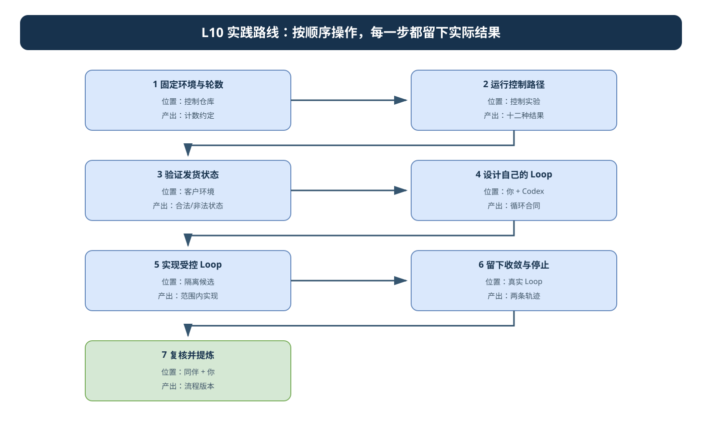
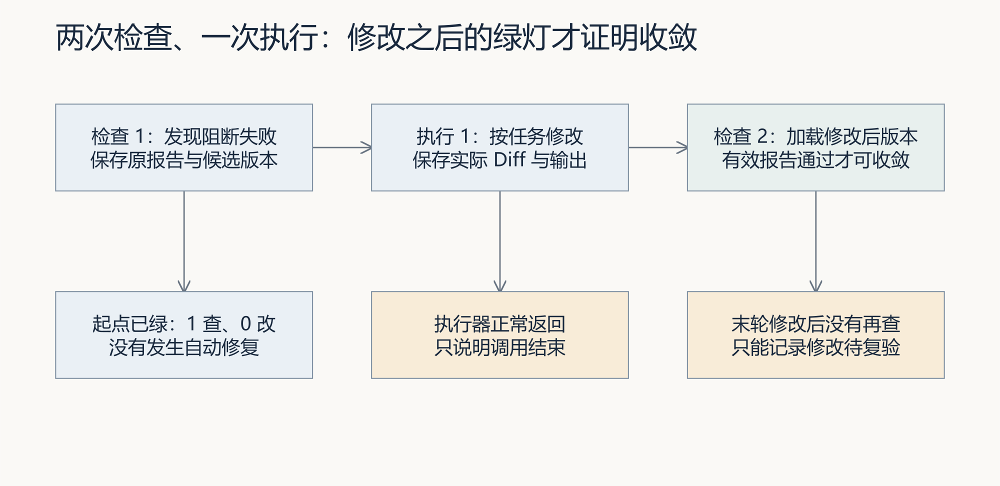
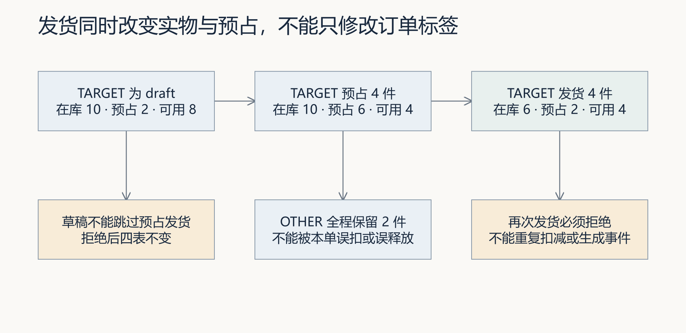
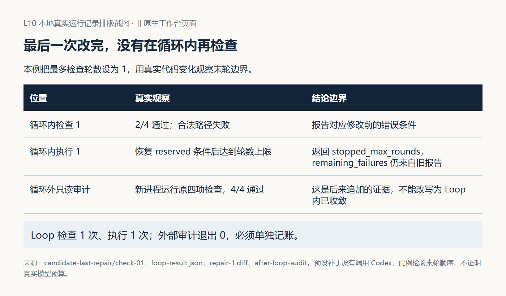

# L10 实践操作手册

> 本资料由 AI 辅助整理，为课程赠送资料，用来辅助你实践练习，非必读资料。

先读[讲义](辅导资料.md)，在[提交模板](SUBMISSION.md)记录首次预测。实践分为控制机制、真实业务状态和个人 Loop 交付。前两部分是课程支架，第三部分才能形成自己的修复轨迹。

控制实验不会替本人执行 Codex；候选实验会修改自己新建的实验目录；`agent.loop --codex` 才会进入真实修改。三段分别记录运行位置与来源。真实 Loop 只在已授权候选运行，先核对失败输入、写集、轮数和资源上限，不能在控制仓库顺手续跑。

开始操作前，遇到解释器、路径或输出问题，按[执行与排错说明](../../reference/实操手册执行与排错.md)核对。

### 本讲目录地图

```text
〈CodexFDE 控制仓库〉/                ← 控制实验、业务观察和任务提交的起点
├─ .venv/
├─ agent/loop.py
└─ .runtime/l10-…/                   ← 控制报告与会话索引

〈独立 FlowERP 仓库〉/               ← 业务观察使用的客户源码
〈新建的 Loop 隔离候选〉/            ← 真实 --codex 修复只能在这里运行
├─ flowerp/、eval/、tests/
└─ .course/experiment-source.json
```

控制实验不修改候选；候选实验只改脚本创建的新目录；真实 Loop 也必须以该候选为工作目录。后文没有明确要求切换时，当前目录仍是 CodexFDE 控制仓库。

## 先看流程图，再开始操作



控制实验不修改候选；真实 `--codex` Loop 只能在授权候选中运行。图中的每条轨迹都要留下检查次数、执行次数和停止原因。可编辑源文件：[l10-practice-flow.drawio](./assets/l10-practice-flow.drawio)。

### 按图执行的完成标志

| 步骤 | 在哪里操作 | 进入下一步前必须留下什么 |
|---|---|---|
| 1. 固定环境与轮数 | 控制仓库 | 计数约定 |
| 2. 运行控制路径 | 控制实验 | 十二种结果 |
| 3. 验证发货状态 | 客户环境 | 合法/非法状态 |
| 4. 设计自己的 Loop | 你 + Codex | 循环合同 |
| 5. 实现受控 Loop | 隔离候选 | 范围内实现 |
| 6. 留下收敛与停止 | 真实 Loop | 两条轨迹 |
| 7. 复核并提炼 | 同伴 + 你 | 流程版本 |

## 第 1 步：环境和计数约定

<!-- step-guide-1 -->
> **一句话说明：**先约定“最多几轮、每轮算什么、何时停止”，避免自动修复无限循环。

开始本讲 FDE 实践时，先在[提交模板](SUBMISSION.md)的首次判断与需求记录回答：订单状态问题影响哪项发货操作，继续一轮能获得什么新证据，什么条件下应交回人处理？注明来源是实际观察、同伴试用还是教学设置，写下本次选择和暂缓范围，再请 Codex 协助调查。

在项目根目录使用本项目 `.venv`。Windows PowerShell：

```powershell
. ./.venv/Scripts/Activate.ps1
python -c "import sys; print(sys.executable)"
git rev-parse HEAD
git status --short
python -X utf8 -m workbench.cli course-contract --lesson 10
git rev-parse --verify course/l10-start
```

macOS/Linux 使用 `source .venv/bin/activate`。起点异常先查看[学生入口](../../README.md)。写清自己的控制工作台、隔离候选、已有修改和实际业务入口。

先回答：最多三轮限制什么？最后一次修改后有没有检查？一次用量超过剩余额度如何处理？执行器出错以后哪些材料应该还在？本讲最多三轮的约定不能因为参考函数允许更大参数而自行放宽。

## 2 十二种控制路径

<!-- step-guide-2 -->
> **一句话说明：**运行十二种控制路径，观察通过、继续修复、到限停止和异常停止分别长什么样。



图 1｜对照图中的三种轨迹，先预测每项实验的检查次数、执行次数与最后已验证版本。

分别运行下列命令，不调用真实 Codex：

```bash
python -X utf8 docs/courses/L10/examples/loop_control_lab.py already-green
python -X utf8 docs/courses/L10/examples/loop_control_lab.py converge
python -X utf8 docs/courses/L10/examples/loop_control_lab.py repeated
python -X utf8 docs/courses/L10/examples/loop_control_lab.py changed-reason
python -X utf8 docs/courses/L10/examples/loop_control_lab.py oscillating
python -X utf8 docs/courses/L10/examples/loop_control_lab.py last-repair
python -X utf8 docs/courses/L10/examples/loop_control_lab.py token-budget
python -X utf8 docs/courses/L10/examples/loop_control_lab.py missing-usage
python -X utf8 docs/courses/L10/examples/loop_control_lab.py time-budget
python -X utf8 docs/courses/L10/examples/loop_control_lab.py executor-error
python -X utf8 docs/courses/L10/examples/loop_control_lab.py empty-report
python -X utf8 docs/courses/L10/examples/loop_control_lab.py dry-run
```

输出包含每次检查与替身调用。包装脚本退出 0 表示符合参考行为，不能据此把其中的 stopped 状态当成产品通过。

| 模式 | 核对重点 |
|---|---|
| already-green | 一次检查、零次执行，没有修复 |
| converge | 两次检查、一次执行，第二次才通过 |
| repeated / changed-reason | 都在第二次检查后停止，比较名称与原因 |
| oscillating | A/B/A 交替，到三轮上限而非提前无进展 |
| last-repair | 替身已改变状态，停止前却没有再检查 |
| token-budget | 合成使用 150，大于预算 100，剩余归零 |
| missing-usage | 缺正用量，停止核算而非当成免费 |
| time-budget | 替身时钟超时，不是真实等待或进程终止 |
| executor-error | 真实 Loop 抛异常，包装器记录观察 |
| empty-report | 替换生产者的接口反例，不是默认 Harness 输出 |
| dry-run | 只生成任务，没有调用执行器 |

为每项记录自己原来的判断和实际区别。阅读代码中的 suite_runner、executor 和时钟替身，解释为什么不能将它们当成真实模型修复与真实 Token 消耗。

## 3 验证合法和非法发货

<!-- step-guide-3 -->
> **一句话说明：**用真实订单验证合法发货成功、非法状态迁移被拒绝，并保存失败后的不变状态。

**运行前确认：** 业务观察自动使用独立 FlowERP 的解释器；候选循环实验从两个仓库创建隔离副本，并记录 `.course/experiment-source.json`。先完成[客户环境检查](../../reference/实操手册执行与排错.md#product-environment)。候选内的业务 Eval 检查该副本，修复与未修复模式均须核对报告中的状态，不能只看外层命令退出 0。



图 2｜先分别计算在库、总预占和可用量，再检查状态标签。不能用“全部拒绝”代替恢复合法发货。

以下用全新报告目录；再次运行换目录，避免覆盖已有报告。

```bash
python -X utf8 docs/courses/L10/examples/order_transition_lab.py legal --report-path .runtime/l10-order-01/legal.json
python -X utf8 docs/courses/L10/examples/order_transition_lab.py draft-ship --report-path .runtime/l10-order-01/draft-ship.json
python -X utf8 docs/courses/L10/examples/order_transition_lab.py cancelled-ship --report-path .runtime/l10-order-01/cancelled-ship.json
python -X utf8 docs/courses/L10/examples/order_transition_lab.py double-ship --report-path .runtime/l10-order-01/double-ship.json
python -X utf8 docs/courses/L10/examples/order_transition_lab.py refuse-all --report-path .runtime/l10-order-01/refuse-all.json
```

每条后立即保存退出码，PowerShell 用 `$LASTEXITCODE`，macOS/Linux 用 `$?`。前四条预期 0，refuse-all 预期 1。合法发货后在库／总预占／可用为 6／2／4，OTHER 不变；三种拒绝比较完整四表；refuse-all 是人为错误修复，使合法路径失败。

将 OTHER 的数量改为另一组，先手算后运行自己的实验。新增个人用例应加载实际候选，并登记到统一 Harness。实验中的临时名称不是默认套件中的注册项。

## 4 对照真实代码轨迹，再设计自己的循环

<!-- step-guide-4 -->
> **一句话说明：**对照真实代码轨迹，写清自己的 Loop 每轮读取什么、能改什么和何时停止。

前面的控制实验使用合成反馈。接下来让真实 Harness 在新进程中检查实际代码变化。下面命令只在新目录复制候选并运行预设补丁，不调用 Codex；修改的不是根仓库产品。

```bash
python -X utf8 docs/courses/L10/examples/candidate_loop_lab.py repair --run-dir .runtime/l10-candidate-01/repair
python -X utf8 docs/courses/L10/examples/candidate_loop_lab.py no-change --run-dir .runtime/l10-candidate-01/no-change
python -X utf8 docs/courses/L10/examples/candidate_loop_lab.py last-repair --run-dir .runtime/l10-candidate-01/last-repair
```

再次执行必须使用新的目录。先预测每条命令的循环检查次数、动作次数和最后已验证位置，再对照输出。脚本的退出 0 表示实验观察符合预期，三条循环结论并不相同。

| 模式 | 循环内检查／执行 | Loop 结论 | 循环外审计 |
|---|---|---|---|
| repair | 2／1 | converged | 原四项通过 |
| no-change | 2／1 | stopped_no_progress | 仍有两项失败 |
| last-repair | 1／1 | stopped_max_rounds，修改待复验 | 后来单独检查才通过 |



图 3｜先辨认最后报告在补丁之前还是之后，再判断新版本。图中循环外审计是实验另加的步骤，不属于原 Loop 的轮次，也不是负责人接受。

每个运行目录内，先读 `index.json` 与 `loop-result.json`，再按时间读 `check-01/report.json`、`execution-1.json`、`repair-1.diff` 以及存在时的 `check-02/report.json`。`after-loop-audit` 单独保存结束后的审计。`check-*/states` 记录实际状态；错误版本的重复用例在第一次发货时就失败，尚未到达后续快照，因此不能把缺失快照补写为“重复请求已验证”。

三条候选实验的检查内容不变。repair 的服务条件恢复，no-change 的内容不变，last-repair 的修复发生在最后一份内部报告之后。教师参考材料在[证据目录](assets/README.md)，个人记录必须来自自己的新运行。

适配器将 `use_codex=True` 用于进入执行分支，但实际注入的是预设补丁函数；用量 1 明确为合成协议占位。识别真实执行器必须看调用对象和实际命令，不能只凭参数名。此处不评价真实 Token 预算，原控制实验的预算用量也仍是合成数据。

## 5 实现自己的受控 Loop

<!-- step-guide-5 -->
> **一句话说明：**在隔离候选中实现受控 Loop，确保每轮修改和退出原因都能追溯。

用[设计提示词](prompts/01-确定循环与停止.md)确认 Spec，明确目标、实际服务、允许文件、报告协议、最多三轮的计数、停止优先顺序和末轮复验方案。计划至少覆盖达标、稳定失败、预算不足和执行器异常。

订单服务属于独立 FlowERP，Loop 属于工作台。当前课程组合候选中的 `flowerp/` 来自客户项目，`agent/` 来自工作台，`eval/`、`tests/` 须按来源记录区分。路径相对于返回的候选目录，不是 CodexFDE 根目录；本次允许文件应按具体原因收敛。工作台通过项目组织建设：

```bash
python -X utf8 -m workbench.cli course-submit --lesson 10 --execute-code --actor "实际构建者姓名" --runtime-dir .runtime/l04-learning --execution-timeout 900
```

返回后按[提交结果与续做说明](../../reference/实操手册执行与排错.md#course-result)先保存退出码、任务编号和候选路径。退出 0 且状态为 `review` 才继续候选复验；非零先查原任务错误，不重复提交，不用控制仓库替代缺失候选。

这需要可用执行器与认证。记录真实任务与隔离候选，核对生成的任务是否已经含本次范围与停止要求。该命令组织 L10 建设，不等于已完成一次真实 Loop 内部修复。

用[实施提示词](prompts/02-实现循环与记录.md)串联执行、Eval、任务映射与再执行。每次 Loop 分配新运行编号，每轮保存原报告、任务、完整输出、资源观察和候选身份。将历史摘要和原始材料分开，异常时保留最后已知结果与待复验动作。

参考程序的 `runtime_dir` 并不控制所有写入位置。检查自己的报告生产者、任务生成器和执行器分别写到哪里，不要仅修改外层目录名。输入无效时拒绝业务结论，禁止空报告变成收敛。

文件权限需要复用已建设的工作台执行约束。默认 Loop 的 workspace-write 不是逐文件写集，也没有把 scope 列表转换成文件权限。运行真实修复前核对实际执行器与允许范围，必要时先完成接线；不要只在提示词里写“不得越界”。

## 6 留下一次真实收敛与一次停止

<!-- step-guide-6 -->
> **一句话说明：**至少留下“一次成功收敛”和“一次到限或遇险停止”两条真实历史。

先在隔离候选的项目环境中观察默认入口：

```bash
python -X utf8 -m agent.loop --max-rounds 3
```

默认只检查和生成草案。当前参考全绿可能第一轮结束；这不算真实修复。参考 CLI 没有 `--runtime-dir` 参数，不要自行添加。首次观察应在专用候选中进行；已有 `.runtime/loop` 或报告时先保留完整记录，在另一独立实验副本中重做。本人新增的目录参数必须先实现并验证，才可写入实际运行命令。

确认实现已经满足自己的记录与权限约定后，在该隔离候选中执行：

```bash
python -X utf8 -m agent.loop --max-rounds 3 --timeout 900 --token-budget 30000 --codex
```

该命令会调用本机 Codex。若仍使用未完善的参考版本，应如实记录它的权限、异常与历史缺口，不能声称已实现完整受控交付。缺少可用执行器或认证时，先完成本地机制与实现，真实轨迹保留待完成，不用替身记录改名补位。

收敛轨迹至少包含真实目标失败、实际修复 Diff、之后的独立验证和合法路径通过。未收敛轨迹保存真实停止原因、最后已验证版本、已有改动与待复验项。覆盖预算分支可以用明确替身，实际调用用量则必须来自真实事件，二者分开标注。

针对业务的默认复验入口：

```bash
python -X utf8 -m eval.harness --suite blocking --case illegal_transition_is_blocked --report-path .runtime/l10-review-01/selected.json
```

再运行个人新增合法发货、重复、取消后拒绝及 OTHER 保护用例，最后运行完整 blocking 套件。默认非法路径用例不能证明合法发货可用。检查前后标准保持一致；确需修订错误测试时保留理由和原版本。

## 7 同伴复核与流程提炼

<!-- step-guide-7 -->
> **一句话说明：**同伴回查两条轨迹，再把可复用的修复流程和不适用边界写成版本化规则。

请同伴使用[复核提示词](prompts/03-核对停止与复验.md)，从原始材料重建检查次数与执行次数。重点检查最后修改是否经过验证、失败名称变化是否真有进展、预算是否越界以及异常后状态是否清楚。

用 [loop-stop-review Skill](skills/loop-stop-review/SKILL.md)审查四个反例和个人轨迹，保留实际响应、遗漏与本人修订。负责人对同一任务作接受、退回或依据不足的决定。没有同伴或使用反馈时如实写待复验。

| 现象 | 优先核对 |
|---|---|
| rounds=1 且 converged | 是否起点已绿，执行次数是否零 |
| same name 后停止 | 原因、候选、测试版本是否变化 |
| max rounds 后仍列旧失败 | 最后一份报告在修改前还是修改后 |
| 预算剩余为 0 | 实际累计是否已经超过上限 |
| 超时只有异常 | 已有 Diff、最后报告、运行输出在哪里 |
| 下一次运行覆盖上一份 | 每个写入者是否使用本次运行目录 |
| 反例全绿但产品不可用 | 合法路径是否被一并拒绝 |

**交接时回到使用现场**：业务确认者核对合法发货及拒绝后状态，同伴复验收敛与未收敛两条历史；停止时交代最后候选、已知结果、未验证项和接手动作。将继续和停止的判断方法用于下一修复任务，重新确认预算与进展标准，标明来源版本和采用后的结果。沿用本讲已有证据位置，不另交重复表格。
