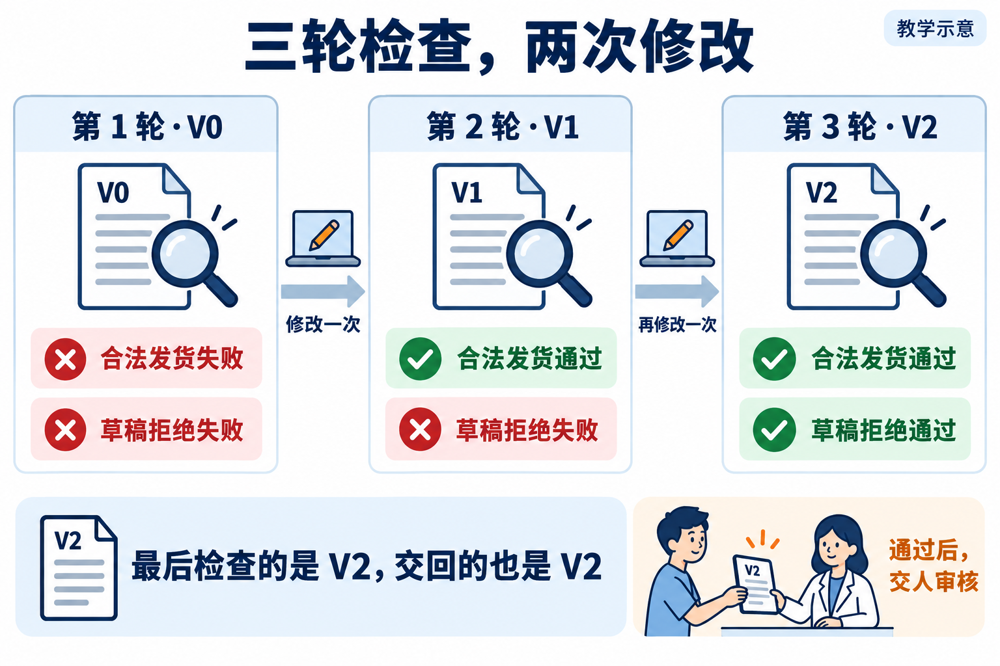
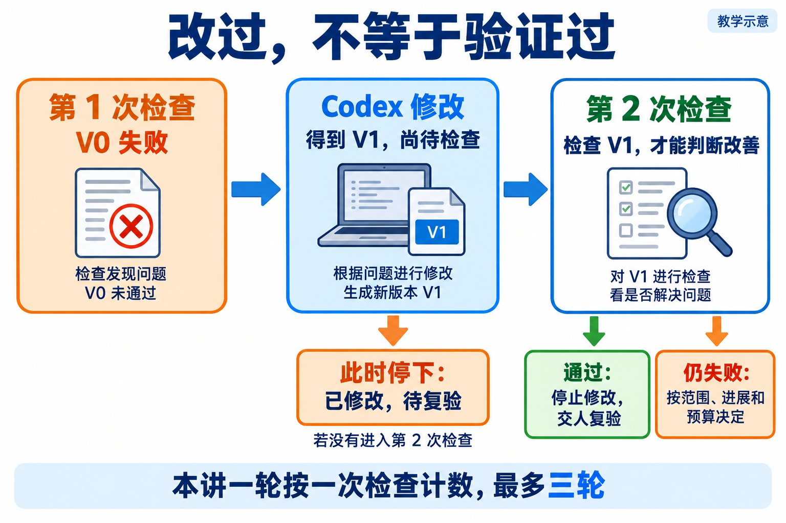
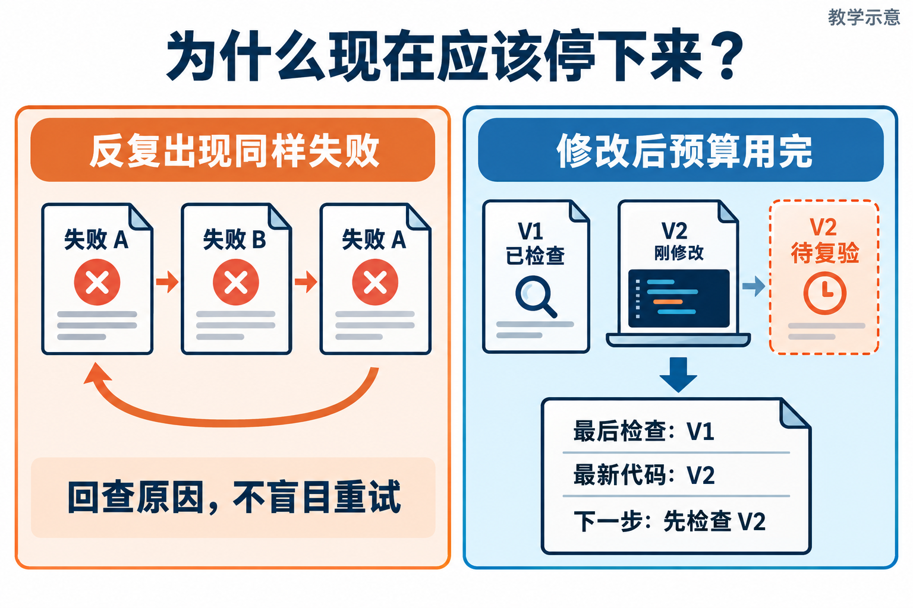

# L10｜建立有停止条件的修复 Loop

L09 已经能把一个失败写成范围明确的修复任务。现在继续 FlowERP 的订单流程：已预占订单要发货，非法状态必须拒绝。第一次修改后，检查却没有全过；还要不要让 Codex 再试一次？

这次不再由你每轮重复说“继续”。你先规定最多几轮、什么算进展、何时停止，再让工作台组织修改和复验。**L09 解决一次返工怎样交代，L10 解决多次返工怎样有依据地继续与结束。**

把“修改—检查—决定下一步”有条件地重复执行，叫作 **Loop，修复循环**。沿用已有检查，不因失败而换掉标准；每次改出新版本，都要知道它是否已经接受检查。


## 1｜先看这次发货到底哪里错了

本例沿用课堂订单服务的规则：订单只有已经预占，才允许正常发货；草稿、已取消和已发货订单都不能直接再发一次。

下面设定一个故障作教学推演：错误版本 V0 一边拒绝了合法发货，一边又放行了草稿单。两项检查都失败。只修其中一项还不够，因为“全部拒绝”也能挡住草稿，“全部放行”也能让合法发货成功，二者都不是完整规则。

这次先把验收要求固定下来：合法状态允许发货，非法状态拒绝；拒绝后业务状态不变；其他订单（例中记为 OTHER）与它们的预占不受影响。后续每轮都用这组要求判断。

下面用 V0、V1、V2 标记前后代码版本。图中演示一条成功修复的路线，稍后还会讨论失败时怎样停下。



**图 10-1　三轮分别检查 V0、V1、V2，中间只发生两次修改**

*先只看三列检查结果：两个失败、一个失败、全部通过；再看列间两次修改。*

我们给工作台最多三轮检查机会。接下来跟着它走，不预设第三轮一定成功。

## 2｜第一轮之后，为什么允许再改一次

第 1 轮检查 V0，两项失败。工作台按 L09 的方法生成任务，由你确认允许修改的文件后，交给 Codex。它调整了发货判断，得到 V1。

此时只知道代码改过，还不知道是否有效，所以要有第 2 轮。检查 V1，发现合法发货已通过，草稿拒绝仍失败。工作台比较完整结果：原失败少了一项，没有新增失败，修改也在范围内，而且还剩一次检查机会。

这就是继续的依据。下一份任务聚焦草稿拒绝，同时重跑已经通过的合法发货检查，确认它没有被新修改破坏。这种对既有功能的再次检查叫**回归检查**。

Codex 再改一次，得到 V2。第 3 轮检查 V2，如果原要求全部通过，工作台就停止修改，把 V2 和报告交人审核。**三轮检查只用了两次修改；不需要为了凑次数继续改。**



**图 10-2　修改形成新版本后，必须检查新版本才能判断结果**

*如果停在中间“得到 V1”这个位置，准确结论是待复验；右侧检查发生后，才有关于 V1 的结果。*

如果第 3 轮仍失败呢？你编写的循环控制程序可以直接交回已经检查过的 V2。若允许最后再改出 V3，却没有检查机会，就必须把 V3 标为待复验。配套参考程序可能留下这种末轮修改，读它的输出时也要分清“检查了哪版”和“最后改成哪版”。

## 3｜假如第二轮没有变好，还要继续吗

刚才的轨迹很顺利，但真实修复可能卡住。

第一种情况是同一失败连续出现。先问：实际改动有没有落到被检查的文件？运行的是否仍是旧代码？原因假设有没有被证据支持？如果没有新的判断，只重复同一句“继续修”，通常只会重复投入。

再看另一条独立的失败轨迹，与前面的两项同时失败不同：第 1 轮只有合法发货失败（记为 A），第 2 轮修好了合法发货，却放行了草稿单（记为 B），第 3 轮挡住草稿后，又把合法发货一起挡住，回到 A。这叫失败振荡：修改在两个要求之间来回摇摆。此时需要同时分析 A、B，找到能兼顾两项的条件。



**图 10-3　遇到失败振荡或修改后预算耗尽时，保留明确的停止与交接信息**

*左边看失败 A 怎样绕一圈又回来；右边看“最后检查的版本”为什么可能不是“最新代码”。*

失败数变少也不一定代表改善。若少了两项状态错误，却新增了库存重复扣减，风险反而可能变大。继续的依据应是原要求下的实际改善，而不是单看红灯数量。

把这些判断写进程序时，先确认报告有效、检查的确实是当前版本。通过了，就停止修改；仍失败，再看剩余预算、进展和允许范围。连续无进展、预算不足或需要越界时，就交回人处理。

如果检查根本没启动，或只拿到一份空报告，就先排查检查为什么没完成。此时还没有足够信息判断业务对错。

## 4｜停下时，怎样让下一位接得上

假设 Codex 刚生成 V2，用量预算就耗尽了。最新代码是 V2，最后检查的却是 V1。工作台不能拿 V1 的报告替 V2 下结论，而应交回：

> 最新代码是 V2；最后完成检查的是 V1。
>
> V1 的剩余失败是“草稿发货未被拒绝”。V2 还未检查。
>
> 本次因预算耗尽停止。下一步先检查 V2，再决定要不要继续改。

这里保存的不只是聊天摘要，而是一条能对上的历史：检查哪版、发现什么、派了什么任务、实际改成哪版、为什么停止。这份逐轮记录叫**修复历史（Loop History）**。下一轮先看当前失败、原要求、已尝试方案和允许范围，需要细节时再按记录中的路径查看完整报告与代码差异。

轮数、时间和 Token 是不同预算。Token 是模型输入输出的用量单位。当前执行用量未知时，不能按零计算；达到用量上限后不再启动新的调用，也不等于保证最后一次调用绝不超支。时间超时后还要核对动作是否停止、是否留下新修改。

这些限制的共同作用，是让停止后仍能说清已经做过什么、尚未证明什么。控制器正确停止，与发货业务已经通过，要分别报告。

## 5｜用三个小实验检验自己的理解

在课程根目录，用已有 `.venv` 运行：

```powershell
.\.venv\Scripts\python.exe -X utf8 docs/courses/L10/examples/loop_control_lab.py converge
.\.venv\Scripts\python.exe -X utf8 docs/courses/L10/examples/loop_control_lab.py repeated
.\.venv\Scripts\python.exe -X utf8 docs/courses/L10/examples/loop_control_lab.py last-repair
```

第一条应观察到两次检查、一次修改调用后通过并停止，这种结果叫收敛；第二条两次检查结果相同而停止；第三条一次检查、一次修改后用完轮次，留下待复验状态。看输出的 `result.status`、`checks` 与 `executor_calls`，不要只看脚本退出码。

这些实验预先准备了检查结果，并用一个简单函数代替 Codex 修改代码。它们让你观察控制程序怎样决定继续或停止，没有实际调用 Codex。随后按[实践操作手册](实践操作手册.md)第 3～4 步连接真实发货与同一候选的改动，第 5～6 步建设并执行自己的 Loop，第 7 步请同伴复核。把一次真实收敛与一次未收敛退出写入[提交模板](SUBMISSION.md)。

同伴可以给你一份练习材料：包含修改前的报告和修改后的代码，却不包含修改后的报告。请你说明还能证明什么。原始报告仍保留，不需要删除任何证据。你若能准确指出“最新候选待复验”，并说出接手后的第一步，就掌握了这次交接的关键。这种判断还可以迁移到导出、退款等修复任务。

**本讲要学会的能力：依据每轮结果决定是否继续，停止时交代清楚已检查和未检查的内容。**

更多停止策略、交给下一轮的材料怎样整理，以及参考程序还缺哪些能力，放在[实现细节与扩展阅读](实现细节与扩展阅读.md)，原实验分析见[参考详解](参考详解.md)。

## 本讲留下什么，下一讲怎样接着用

本讲交出发货修复，以及达标、无进展和预算耗尽时都能停止的循环。下一讲进入采购申请交付，仍保留这些停止规则；新增的问题是两个独立工作能否同时做，以及返回结果怎样整合。

[课程蓝图与学习路线](../课程蓝图.md#l01l12-的连续学习路线) · [实践操作手册](实践操作手册.md) · [上一讲](../L09/辅导资料.md) · [下一讲](../L11/辅导资料.md)

## 课程大纲中的本讲要求

- **核心内容**：最大轮数、达标即停、无进展检测、时间与 Token 预算、安全退出。
- **演示结果**：修复循环成功收敛一次，并展示一次未收敛退出。
- **课内增量**：串联“执行 → Eval → 生成修复任务 → 再执行”。
- **通过标准**：最多三轮；达标即停止；无进展或预算耗尽时输出剩余失败，不宣称成功。

配图为教学示意；来源与提示词：[新增案例图](assets/reading-story-20260926/生成说明.md)。
