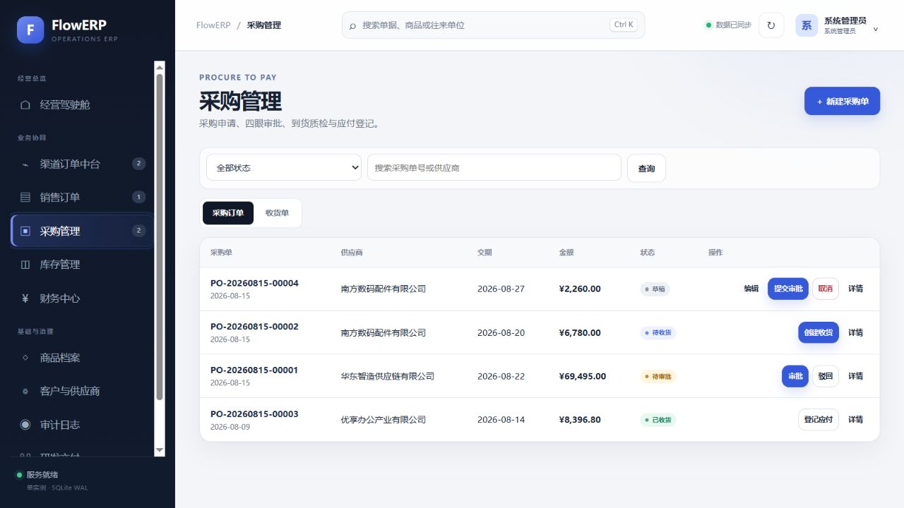
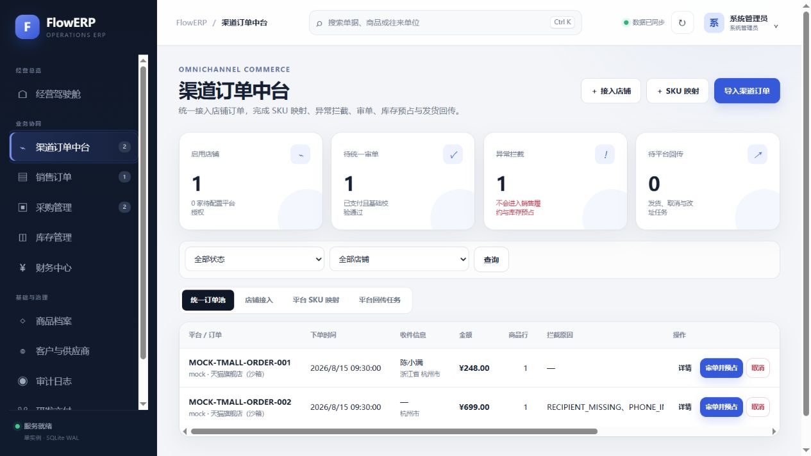
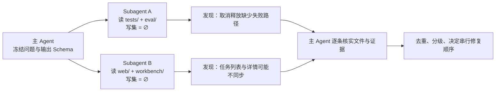
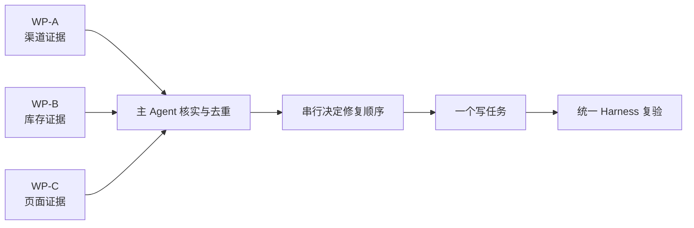
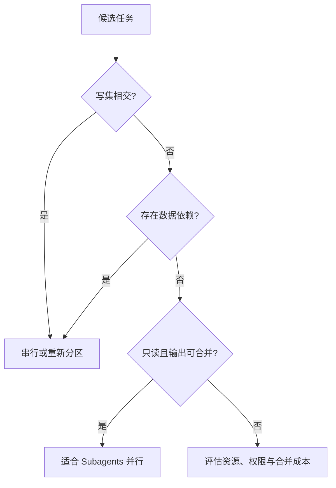
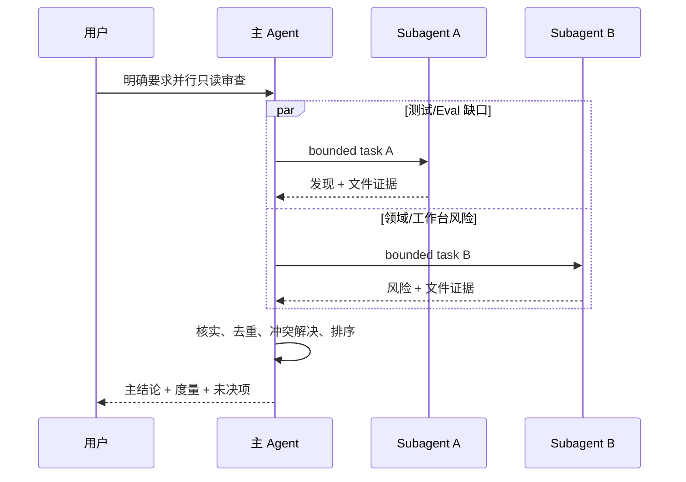
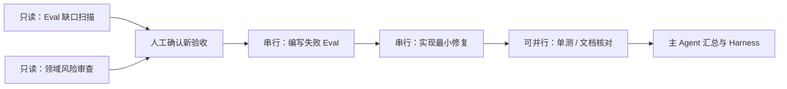
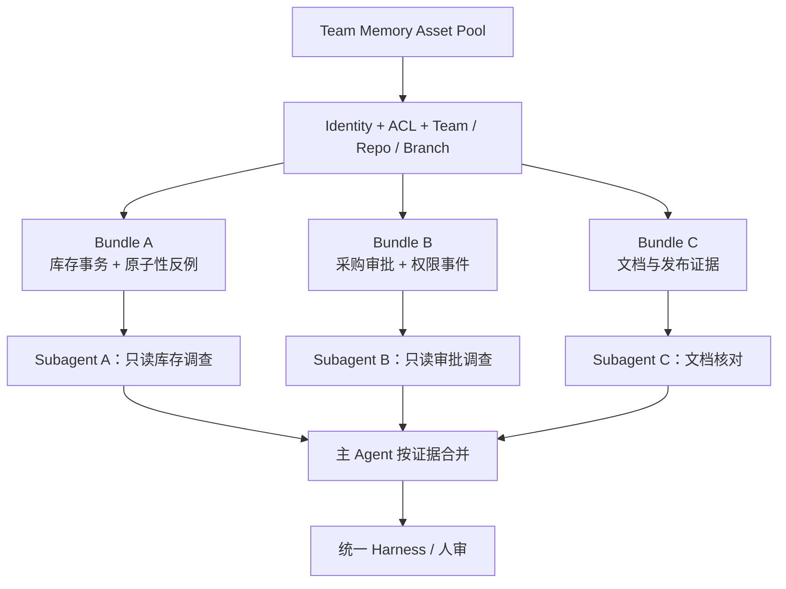

# L11｜用 Codex 原生 Subagents 并行处理独立任务

<details>
<summary>本讲课程合同与建设状态（教师/助教）</summary>

- **核心内容**：可并行任务识别、上下文隔离、结果汇总、冲突风险与额外 Token 成本。
- **演示结果**：测试补全与风险审查并行执行，由主 Agent 汇总结论。
- **课内增量**：为两个无文件写入冲突的任务定义清晰输入、输出和验收标准。
- **通过标准**：子任务边界清晰；主 Agent 能追溯每个结论；有写入冲突的任务不强行并行。
- **挑战任务**：比较单 Agent 与 Subagents 在耗时、Token 和结果质量上的差异。

> 课程建设状态说明：本讲冲突图方法、子任务合同、活动和评价规则属于已经形成的课程设计；学生初始排程、原始子任务输出、主 Agent 核验和净收益数据属于待真实开课采集。不能用 Agent 数量、并行截图或模拟 Token 数据替代学生的并行决策能力。

> **基础线唯一性**：本讲以采购申请为唯一产品增量；规格、Eval 与风险只读分析可并行，任何共享文件写入与最终集成都必须由主 Agent 串行完成。

</details>

## 连续案例｜第三幕：三名聪明同事写坏了同一个文件

**时间**：第三周周二 10:20　**地点**：采购需求评审

20 台订单的缺口再次出现，这次团队决定把“采购申请”做成正式产品增量。林默将工作分给三个 Agent：一个分析 Spec，一个设计 Eval，一个审查审批风险。为了追求速度，他允许它们直接补充同一份采购服务和测试文件。

十分钟后，三份结果各自都很完整。合并时却发现：一个 Agent 把“申请”实现成了“已批准采购”，另一个假设申请不会写数据库，第三个修改了同一组状态常量。没有一个结果单独越界，组合起来却形成了无法解释的业务状态。

周岚问是否应该彻底放弃并行。顾宁认为问题不在 Agent 数量，而在任务合同没有区分读集、写集和最终裁决权。规格、Eval 和风险可以并行产出独立只读报告；共享文件写入、冲突解释和业务结论必须回到主 Agent 串行完成。

团队还要保留原始子报告。如果只提交主 Agent 的顺滑总结，学生就无法证明自己识别和处理过冲突，也无法知道哪项风险在汇总时被遗漏。

> **决策时刻**：先画三个子任务的读写集矩阵，再决定哪些真正独立。请保留一次刻意制造的写冲突，并说明为什么“并行分析、串行集成”比“所有人同时改代码”更快、更可信。

采购申请完成后，下一个问题无法靠并行解决：谁有权批准它入库？团队已经可以用 Graph 表达暂停与恢复，但工程流程节点不能冒充财务和采购授权。

## 图文学习导航

### 先进入现场：三个 Agent 同时开工，为什么可能比一个人更慢、更不可信



*观察重点：跨角色不等于并行写代码。规格分析、Eval 设计和风险审查可以产生独立只读产物；共享文件写入、冲突解决和最终裁决仍需要明确责任人。*

**先别看答案**：先为三个子任务画读集/写集矩阵。只要两个任务写入同一文件或共同修改同一业务不变量，就先判为不可并行，再提出拆分或串行集成方案。

本讲按“任务分解 → 冲突图 → 独立委托 → 原始子报告 → 主 Agent 串行集成”学习。以 [OpenAI Subagents](https://learn.chatgpt.com/docs/agent-configuration/subagents) 核对角色配置与独立上下文，以 [CDIO Standards](https://cdio.org/implementing-cdio/standards/12-cdio-standards) 检查团队是否仍对完整产品生命周期负责。

## 学员正文｜并行的单位不是角色，而是不冲突的证据

采购申请进入开发后，林默同时派出“架构师”“测试专家”和“安全专家”。三个名字听起来职责清楚，实际任务却都包含“必要时修改采购服务”。十分钟后，他们同时改写 `flowerp/purchasing.py`，每一份局部测试都通过，合并时却丢失了审批字段和失败原因。

这不是 Agent 不够聪明，而是调度合同没有描述读写集。角色名不能替代文件和事实边界。适合并行的是彼此独立的调查、反证和候选方案；共享状态的最终写入、数据库迁移和同一测试夹具通常需要串行集成。最常见的错误路线是先启动 Agent，再根据输出猜测是否冲突。

先读取本讲机器合同：

```powershell
.\.venv\Scripts\python.exe -X utf8 -m workbench.cli course-contract --lesson 11
.\.venv\Scripts\python.exe -X utf8 -m workbench.cli course-eval --lesson 11
```

在启动任何子任务前，画出冲突图。任务 A 只读 `tests/` 与 `eval/`，列出采购申请缺失的不变量；任务 B 只读 `flowerp/` 与 `workbench/`，审计状态、幂等和权限风险。两者写集为空，可以并行。最终实现采购申请的任务 C 消费 A/B 的具名报告，由主 Agent 决定采纳、拒绝和最小写集，再串行修改。

子任务合同必须写清目标、输入版本、read set、write set、禁止项、输出 Schema、停止条件和证据引用。行动课还要设计一个“两个 Agent 同写一文件”的反例，但不要真的互相覆盖；冲突图应在执行前判定它们必须串行。这样保留的是调度能力，而不是一次偶然没有冲突的演示。

### 把关键合同读懂｜角色名不能代替读写集

```json
{
  "task": "audit-purchase-risk",
  "read_set": ["flowerp/", "tests/"],
  "write_set": [],
  "output": "risk-report.json",
  "stop_when": "需要修改共享业务事实"
}
```

- `task` 描述可验收目标，而不是只写“安全专家”这类角色名。
- `read_set` 限定子任务获得的事实范围，也帮助主 Agent 判断输入是否足够。
- 空 `write_set` 使只读审计具备并行资格；一旦两个任务共享写集，就要重新拆分或串行。
- `output` 让原始发现可追溯，主 Agent 不能只保留自己的顺滑摘要。
- `stop_when` 把越界时的交还条件写进合同；发现需要修改共享事实时，子任务必须停下来。

**看似合理的错误路线**是让主 Agent 把子报告直接拼接成总结。子报告可能互相矛盾，主 Agent 必须回到原始证据，记录哪条建议被采纳、哪条被拒绝、最终责任为何仍属于主 Agent。并行不能稀释作者身份，也不能让匿名输出成为审批依据。

要证明并行真的有价值，还要与串行基线比较墙钟时间、重复读取量、冲突次数和人工返工，而不是只报告“启动了三个 Agent”。如果并行节省十分钟却制造一次不可解释的合并，收益为负。速度指标必须与证据完整性和产品正确性一起解释。

**第二次签字**：哪些任务可以并行，哪些必须串行？请用读写集交集和权威事实所有者证明，而不是引用角色名。再说明主 Agent 如何处理两份冲突报告，以及哪条命令能推翻最终结论。

采购申请交付后，团队仍缺一张共同状态图：质量绿、Agent 完成、采购已审批、库存已入库是四个不同事实。下一讲把这些事实拆开，并把不可委托的批准责任交还给具名的人。

<details>
<summary>附录：课程合同、教师活动、技术参考与证据模板</summary>

<details>
<summary>教师备课区：课程目标、评价与持续改进</summary>

## 三载体课堂交接

- **PPT 引导决策**：使用 [PPT 逐讲决策脚本](./PPT逐讲决策脚本.md) 的“L11”四个镜头；在学生提交第一次选择、依据和最大风险前，不揭示后果页。
- **Markdown 承载教材**：本讲连续案例、图文导航与学员正文/核心章节负责查证和建模；学生必须保留第一次判断与证据驱动的第二次签字。
- **VS Code 完成行动**：打开 [课程工作区](../../course/FlowERP-AI研发工作台.code-workspace)，先运行“查看本讲合同”，再按 [L11 行动卡](../../course/tasks/L11-Subagents并行.md) 构造失败、完成受控修改并复验。
- **回收证据**：命令、输入、退出码、报告 ID、权威状态、Diff 和剩余风险回写本讲提交包；只交投票、代码或绿色截图均退回。

> 载体顺序固定为：PPT 第一次签字 → Markdown 查证 → VS Code 行动 → Markdown 第二次签字。完整规则见 [三载体课程实施方案](./三载体课程实施方案.md)。

## 国家级一流本科课程教学设计卡

| 维度 | 本讲设计 |
|---|---|
| 对应课程目标 | CLO-5：依据读写集判断并行资格，并对汇总结论负责 |
| 工作台主线增量 | 形成原生 Subagents 的子任务合同、冲突分析、证据汇总和成本度量方法 |
| FlowERP 的作用 | 以采购申请推动并行规格/Eval/风险审查，再由主 Agent 串行集成 |
| 高阶性 | 分析任务依赖与冲突，设计子任务合同，评价并行的时间、Token、重复发现和汇总成本 |
| 创新性 | 将原生 Subagents 变成可测的协作实验，而不是用 Agent 数量展示技术热闹 |
| 挑战度 | 每个结论都要回指子任务证据；写集冲突必须串行；并行无净收益也要如实报告 |
| 学生中心活动 | 小组绘制冲突图、扮演主/子 Agent、运行单 Agent 对照并进行结果仲裁 |
| 课程思政融入 | 明确分工、尊重协作边界、引用他人贡献并由主 Agent 承担最终判断责任 |
| 形成性评价 | 读写集 + 冲突图 + 子任务合同 + 证据化汇总 + 单/多 Agent 对照 |
| 持续改进数据 | 统计写冲突率、无引用结论率、重复工作率和并行净收益，更新调度案例 |

</details>

<details>
<summary>课程合同、边界与前沿校准</summary>

## 本讲知识合同

| 合同项 | 本讲约定 |
|---|---|
| 主线起点 | L10 能控制一个串行修复目标，但跨模块只读调查可能占用不必要的墙钟时间 |
| 唯一技术命题 | 如何用读写集、冲突图和合并成本判断任务是否值得并行 |
| 必须掌握 | 并行资格；子任务合同；最小上下文；主 Agent 核验责任；启动税/冲突税/汇总税 |
| 能力判据 | 能在执行前判定两个只读审计可并行、两个同写任务必须串行，并用对照数据评价净收益 |
| 本讲不做 | 不以 Agent 数量评分，不并行修改共享事实，不伪造自建调度器，不把子 Agent 摘要直接当结论 |

## 大纲锚点与前沿校准（2026-08-19）

- **大纲锚点**：只并行两个无文件写入冲突、输入输出和验收清晰的任务，并由主 Agent 汇总结论。
- **前沿采用**：原生 Subagents 优先用于搜索、测试、分诊等读密集工作；主 Agent 回查引用并计算启动、重复和汇总税。
- **不越界**：写集冲突任务必须串行或另做隔离挑战，不以 Agent 数量、并行动画或绝对速度评分。
- **链路交接**：向 L12 交付可追溯但尚无共同持久状态的多方结论。详见[校准矩阵](./16讲主线与前沿校准矩阵.md)。

**主线坐标**：Loop 能在一个失败目标上返工，现在采购申请需求同时需要规格分析、Eval 设计和风险审查。工程账学习并行“独立证据生产”，而不是并行修改同一份采购事实；共享接口和业务代码仍由主 Agent 串行集成并承担最终结论。

**这一讲把系统推进到哪里**：FlowERP 交付保留 SKU、数量、原因和稳定身份的采购申请；工作台获得基于读集、写集、依赖和合并成本的并行判断。规格、Eval、风险三份原始报告、冲突图、串行集成 Diff 和统一复验共同构成本讲证据。并行的价值不是多开几个 Agent，而是更快获得彼此独立、不会互相覆盖的审查结论。

</details>

## 本讲行动工单：用冲突图证明该并行，而不是用人数证明先进

学员围绕采购申请先画依赖、读写集和合并规则，再为规格澄清、Eval 设计和风险审查等只读任务写独立输入、禁止项、输出 Schema 与停止条件；实际运行 Subagents 后，主 Agent 必须回查引用、处理分歧，并串行集成采购申请。再与单 Agent 基线比较墙钟、Token、有效独立发现和汇总税。

- **工作台增量**：调度判定、子任务合同、上下文隔离、汇总核验和净收益度量；
- **FlowERP 产品状态**：并行产出服务于同一采购申请增量；共享接口和业务代码由主 Agent 串行集成并统一复验；
- **失败证据**：无引用结论、重复发现或分歧至少一项被主 Agent 退回；
- **迁移证据**：为个人项目重新绘制冲突图，不能照抄角色名称；
- **讲师硬门槛**：保留原始子输出和单 Agent 基线，只有汇总稿不能评分。

详见[可执行任务卡](../../course/tasks/L11-Subagents并行.md)。

<details>
<summary>教师备课区：教学活动与达成度设计</summary>

## 本讲教学设计总览

| 项目 | 设计 |
|---|---|
| 建议学时 | 30 分钟线上精讲 + 70 分钟线下行动 + 30 分钟并行收益复盘 |
| 课堂类型 | **调度桌游**：按读写集与依赖边排程，不按角色名或 Agent 数量排程 |
| 核心问题 | 哪些工作值得并行，怎样证明提速没有以冲突、越权和上下文污染为代价？ |
| 教学重点 | 任务合同、读写集、依赖图、只读优先、主 Agent 核实与合并 |
| 教学难点 | 文件不同不等于任务独立；并行时间缩短不等于总成本下降 |
| 课堂产出 | 冲突图 + 两份独立证据报告 + 主 Agent 核实表 |
| 价值塑造 | 协作不稀释责任：子 Agent 产出证据，主 Agent 对最终结论负责 |

### 可测学习成果

| 编号 | 学习者能够 | 达成证据 | 达成标准 |
|---|---|---|---|
| L11-O1 | 为候选任务标注代码与外部状态读写集、依赖和验收物 | 任务合同 | 无隐含共享写入 |
| L11-O2 | 用冲突图决定并行、串行或先后依赖 | 调度方案 | 全部冲突边被识别 |
| L11-O3 | 组织两项只读调查并返回带来源的结构化摘要 | 子任务输出 | 原始证据可回查，无越权可见性 |
| L11-O4 | 比较墙钟时间、总 Token、返工和合并成本 | 收益表 | 不预设并行更优，结论有数据 |

### 30 分钟线上精讲 + 70 分钟线下行动

| 场域与时间 | 学习活动 | 学生当场证据 |
|---|---|---|
| 线上 0–8 分钟 | 发放三项任务和隐藏依赖，学生先按直觉排程 | AI 介入前初始排程 |
| 线上 8–20 分钟 | 讲解读写集、输入版本、外部状态、输出 Schema 和停止条件 | 子任务合同草图 |
| 线上 20–30 分钟 | 用冲突图识别“不同文件但接口依赖”的伪独立任务 | 修正排程与并行预测 |
| 线下 0–22 分钟 | 明确授权后并行执行两个只读审计，主线程保留决策上下文 | 原始子任务输出和运行溯源 |
| 线下 22–38 分钟 | 纸面注入同写集冲突或上下文越权，不实施覆盖性写入 | 冲突证据和串行改判 |
| 线下 38–54 分钟 | 主 Agent 回查引用、去重、处理矛盾并形成唯一结论 | 证据核实表和分歧处理 |
| 线下 54–70 分钟 | 与单 Agent 基线比较墙钟、Token、返工和汇总成本 | 净收益裁决与离场票 |

### 达成度与持续改进

采集冲突边识别率、越权读取次数、子任务证据回链率、合并返工量和相对墙钟收益。出现任何未声明共享写入即硬性退回；若平均墙钟改善不足 15% 且 Token 增幅超过 50%，下轮缩小并行粒度；主 Agent 未复核原始证据的报告不得计入成果。

</details>

## 本讲现场｜两名审计者能否同时开工

库存原子性修复通过后，团队要做两次审计：一名审计者检查 `tests/` 与 `eval/` 是否漏测取消释放、幂等重放等业务不变式；另一名审计者检查 `web/` 与 `workbench/` 是否存在页面状态和持久化状态不一致。两项都是只读调查，输出都是带文件位置的风险清单，可以并行。

但“一个人改 `flowerp/service.py`，另一个人同时补依赖该实现的测试”并不独立。后者的输入会被前者改变，哪怕文件不相同也存在数据依赖。并行判断不能只看文件名，要同时看读集、写集、接口依赖和合并成本。

渠道订单中台同时包含店铺连接、SKU 映射、外部订单接入、审单和回传。它很适合做并行只读审计：一名 Subagent 查幂等与外部单号冲突，另一名查 SKU 映射和库存预占，但两者只返回证据，不在同一账套同时执行写操作。




第一张图适合拆出渠道、库存与异常三项只读调查；第二张图说明所有调查最终必须回到同一个 Task。Subagent 可以并行搜集证据，但主 Agent 要在共享 Spec、写集冲突图和统一 Harness 上合并，不能把三份“看起来都对”的摘要直接拼成完成结论。

当前官方说明把 Subagents 的主要收益描述为隔离上下文噪声、并行探索和返回压缩结果，同时明确提醒写密集型并行会带来冲突与协调成本。FlowERP 因此坚持“先读后写、先证明独立、主线程保留决策上下文”；这比简单增加 Agent 数量更接近当代 Agent 工程。[OpenAI Docs：Subagents](https://learn.chatgpt.com/docs/agent-configuration/subagents)



本讲不追求“多 Agent 演示效果”，而是现场计算一次并行收益：节省的调查时间，减去上下文复制、等待、核实与合并成本。如果结果小于零，串行就是更成熟的选择。

## 电商 ERP 变大以后，先并行证据，不并行事实

FlowERP 进入渠道订单、采购和 Web 后，一次发布前审计会同时出现多个问题。工作台因此需要并行能力，但业务账本不适合作为并发实验场。课程把任务先拆成三个证据包：

| Work Package | 读集 | 写集 | 输出 | 是否可并行 |
|---|---|---|---|---|
| WP-A 渠道幂等审计 | `flowerp/channels.py`、`tests/test_channels.py` | ∅ | 外部订单重放、冲突重放证据 | 是 |
| WP-B 库存不变量审计 | `flowerp/`、`eval/cases.py` | ∅ | 预占、释放、入库风险清单 | 是 |
| WP-C 页面一致性审计 | `web/`、`workbench/api_v2.py` | ∅ | 列表—详情—持久化对照结果 | 是 |
| WP-D 修改订单事务 | `flowerp/service.py` | `flowerp/service.py` | 候选 Diff | 否，等待 A/B 结论后串行 |
| WP-E 修改依赖该实现的测试 | `flowerp/service.py`、`tests/` | `tests/` | 新验收用例 | 否，与 D 存在接口依赖 |



真正的独立性需要同时满足四个条件：输出可以单独验收；任务不会读取另一个任务正在改变的接口；任务不会争写同一权威事实；主 Agent 能用来源引用核实结果。仅仅“文件不同”不够，例如一个 Agent 修改返回字段，另一个同时编写依赖旧字段的 Web，就存在隐含写冲突。

这一讲让工作台从单路径修复器演化为证据调度器，但没有把最终判断下放。Subagent 负责缩短调查时间，主 Agent 负责统一业务口径、冲突消解、授权与验收；FlowERP 服务端仍负责真正的数据一致性。

## Agent 数量不是工程成熟度

“多开几个 Agent”很容易制造热闹：每个 Agent 重复读仓库、输出相似建议、争抢同一个文件，主线程最后花更多时间解决冲突。并行只有在任务独立且合并成本低时才有价值。

本讲选择两个真实只读任务。任务 A 阅读 `tests/` 与 `eval/`，找未覆盖业务不变量；任务 B 阅读 `flowerp/` 与 `workbench/`，找状态、幂等、权限和持久化风险。两者读集不同、写集为空，可以同时探索；主 Agent 等待两者完成后，用文件引用核实结论。

## 读写集模型

定义任务 A 的读集 `R(A)` 和写集 `W(A)`。判断规则：

```text
若 W(A) ∩ W(B) ≠ ∅，通常不应并行写；
若 W(A) 会改变 B 的输入，B 依赖 A，应串行；
若 W(A)=W(B)=∅ 且结论独立，适合并行探索；
若共享昂贵外部资源，还要考虑限流和配额。
```



## 为什么从只读任务开始

只读探索不会制造文件冲突，失败也更容易回收。适合并行的任务包括：测试缺口扫描、风险审查、日志分析、文档分段总结、不同方案调研。写密集任务需要更强分区，例如一个 Agent 只改后端、另一个只改完全独立的文档，并且公共接口已冻结。

库存事务和对应测试通常不宜由两个 Agent 同时修改：测试设计可能改变实现假设，实现又改变测试输入。串行可以保持一个清晰因果链。

## Subagent 任务合同

任务 A：

```text
只读 tests/ 与 eval/。
输出未覆盖的 FlowERP 不变量，最多 5 条。
每条必须包含文件引用、现有证据、缺口、建议的最小 Eval。
不得修改文件，不得重复已有用例，不得把体验建议列为 blocking。
```

任务 B：

```text
只读 flowerp/ 与 workbench/。
检查状态迁移、幂等键、权限、持久化和失败追踪风险，最多 5 条。
每条包含具体文件/符号、触发条件、影响和建议验证。
不得修改文件，不根据名称猜测实现；证据不足要明确标注。
```

主 Agent 合同：等待两者；核实文件引用；合并重复发现；按风险排序；区分事实、推断和建议；不直接把发现升级为 blocking。

## 当前官方产品边界

OpenAI 当前 Subagents 文档建议直接提出“spawn two agents”“delegate in parallel”等请求，并明确划分工作、是否等待全部结果、最终摘要格式。文档也提醒多 Agent 会消耗更多 Token，读重探索通常更适合并行，写重流程要谨慎。录课前复核 [Subagents 官方文档](https://learn.chatgpt.com/docs/agent-configuration/subagents)。

本讲交付物不是在仓库里自建一个假的调度器，而是现场使用 Codex 原生 Subagents，保留任务边界、子任务结论、主 Agent 核实与度量。

## 推荐现场 Prompt

```text
请 spawn two agents 并行做只读审查。
Agent A 只读 tests/ 与 eval/，按现有证据、缺口、建议 Eval 输出最多 5 条。
Agent B 只读 flowerp/ 与 workbench/，检查状态、幂等、权限和持久化风险，输出最多 5 条。
两者都不得修改文件，必须引用具体文件或符号。
等待两者完成后，由主 Agent 核实引用、去重、按风险排序，
并输出“事实 / 推断 / 建议”三列。不要自动改代码。
```

Prompt 明确要求等待，避免主 Agent 在子任务未完成时提前总结；明确只读，避免并行写；限制条数，控制合并成本；要求引用，便于核实。

## 主 Agent 不是转发器

子 Agent 输出不能原样拼接。主 Agent至少做四步：

1. 证据核实：文件、行或符号是否真实存在；
2. 去重：两个视角是否描述同一根因；
3. 冲突解决：一个说已覆盖、另一个说未覆盖时回到代码；
4. 风险排序：业务损失、发生概率、可检测性和修复成本。

如果子 Agent 给出“库存可能并发超卖”但没有指出事务或条件更新，主 Agent 应标为待验证推断，而不是事实。责任不会因为委托而转移。

## 并行现场流程



## 何时绝对不要并行

- 两个任务修改同一个 Schema 或迁移文件；
- 一个任务的输出是另一个任务的必要输入；
- 两个任务共享无法并发使用的数据库或测试环境；
- 高风险决策还没有统一 Spec；
- 合并规则不清楚，最终责任人缺失；
- 任务太小，启动和汇总成本高于执行本身。

例如“Agent A 修改 reserve_order，Agent B 同时修改相关库存测试”看似前后端分工，实际上实现与验收互相依赖，容易让测试迁就代码。更安全的流程是先由只读 Agent提出测试缺口，主 Agent确认 Spec，再串行实现和复验。

## 度量：并行是否真的更好

记录单 Agent 与 Subagents 两组实验：

| 指标 | 单 Agent | Subagents | 解释 |
|---|---:|---:|---|
| 墙钟时间 |  |  | 是否真正节省等待 |
| 总 Token |  |  | 并行通常更高 |
| 有效发现数 |  |  | 经主 Agent核实后计数 |
| 重复发现数 |  |  | 合并开销 |
| 错误引用数 |  |  | 可靠性 |
| 主 Agent汇总时间 |  |  | 隐性协调成本 |

不要预设并行一定更快。若两个 Agent 都需要读取全仓库，总 Token 可能显著增加；若输出大量重复内容，墙钟节省会被汇总抵消。只有“有效发现/成本”和整体交付时间改善，才值得保留并行策略。

## 失败实验：让两个 Agent 写同一文件

不实际执行写入，只做设计评审：让 A“给 `eval/cases.py` 增加库存 Eval”，让 B“重构 `eval/cases.py` 的用例注册”。写集相交，且 B 会改变 A 的上下文。要求学员提出三种纠偏：保持串行；把 B 改成只读建议；先冻结接口并把写集拆到独立文件后再并行。

另一个失败是两个 Agent 共用同一运行数据库做破坏性实验。即使写文件不冲突，外部状态也冲突。读写集必须包含数据库、端口、分支、凭据和远程服务，不只看代码路径。

## 子任务输出 Schema

```json
{
  "task": "test-gap-scan",
  "mode": "read-only",
  "findings": [
    {
      "claim": "...",
      "evidence": ["path:symbol"],
      "confidence": "high|medium|low",
      "risk": "blocking-candidate|observing|unknown",
      "suggested_check": "..."
    }
  ],
  "files_modified": [],
  "limitations": []
}
```

结构化输出便于主 Agent去重，也迫使子 Agent声明置信度和限制。`blocking-candidate` 只是候选，仍需业务与质量审核。

## 用冲突图而不是人数验收并行

- [ ] 用户或项目/Skill 明确要求并行；
- [ ] 每个任务有输入、输出、读写集、禁止事项和验收；
- [ ] 本讲任务写集为空，不修改文件；
- [ ] 主 Agent等待全部结果再总结；
- [ ] 所有重要结论有文件证据并被核实；
- [ ] 重复和冲突被处理，不是简单拼接；
- [ ] 记录时间、Token、有效发现和协调成本；
- [ ] 写集冲突任务保持串行。

<details>
<summary>讲师用：验收、练习与评分</summary>

## 作业、评分与下一讲

### 作业

为自己的项目写一份并行设计：至少两个候选任务，列出代码与外部状态读写集，判断并行或串行。若实际使用 Subagents，提交原始任务合同、各自输出、主 Agent核实表和度量。

### 评分

| 项目 | 分值 | 合格表现 |
|---|---:|---|
| 任务合同与分区 | 25 | 产物独立、边界清晰、输入版本固定 |
| 读写集与冲突图 | 25 | 覆盖代码和外部状态，依赖边完整 |
| 主 Agent 核实 | 20 | 回查来源、去重、排序并承担最终结论 |
| 收益度量 | 15 | 同时比较墙钟、Token、返工与合并成本 |
| 安全与可见性 | 15 | 冲突写保持串行，权限与上下文不过界 |

下一讲用 Graph 把 develop、test、rework、human review、completed 等状态显式化。Subagents 解决“哪些独立工作可并行”，Graph 解决“整个交付当前在哪里、为什么回退、谁能批准”。


</details>
## 并行设计诊所：从任务图而不是角色名开始

团队常按“测试 Agent、后端 Agent、文档 Agent”分工，但角色名不能证明独立。先画任务依赖图：节点是可验收产物，边表示数据依赖；再为节点标读写集。比如“盘点现有 Eval”和“审查权限风险”无依赖且只读，可并行；“确定缺口”之后才能“新增 Eval”；Eval 先红后才能“实现修复”；修复后才能“完整复验”。



只有 A/B 和部分 F 适合并行。把整张图交给 Subagents 并不会自动得到正确调度，主 Agent仍要尊重依赖。

## 上下文与输出卫生

每个子任务只传完成它所需的目录、规则和问题，避免把整段主会话倾倒进去。返回摘要而不是原始探索过程：结论、证据、置信度、限制、是否修改文件。若发现越界高风险问题，子 Agent应报告，不应自行扩大写入。

主线程也要防“结论堆积”。十条低置信度发现不一定胜过两条可复现问题。合并时可用四级处理：已证实且高风险，进入候选任务；已证实低风险，进入 backlog；合理推断，安排复现；无证据或重复，记录后关闭。每项保留来源 Agent，但最终责任写主 Agent。

### 共享的是 Team Memory，装配的是每个子任务自己的 Context

团队资产不能复制到某个 Agent 的私人缓存后失去治理，也不能因为主 Agent 有权限就自动让所有 Subagent 看见。资产跟 Team 和项目走，Context Bundle 跟具体任务走。调度器应先计算每个子任务的身份、作用域、读写集和可见资产，再分别装配；权限过滤必须发生在相关性检索之前。



例如审计采购审批的 Subagent 可以获得采购状态机、四眼规则和相关事故，但不需要读取客户反馈原文或银行凭据；审计库存原子性的 Subagent 可以看到库存反例和事务关系，却不能因为检索到了采购 Skill 就调用审批动作。Memory 可见性、工具权限和文件写集是三条独立边界，任何一条都不能推导另外两条。

并行任务还要锁定资产版本。若 A 使用 Skill v3，B 在执行中把它升级成 v4，主 Agent 最后无法解释两项结论是否在同一规则下产生。任务事件应记录 `bundle_id`、每项 `asset_id@version`、排除原因和装配 Token；合并时若版本不同，要么重新验证，要么明确声明差异，不能悄悄拼接。

子 Agent 的发现默认只生成 Memory 候选。多 Agent 都报告同一现象，只能提高调查优先级，不能自动把结论升级为强资产；主 Agent 仍要去重、回查原始证据、运行确定性检查并具名提交。团队记忆减少的是重复探索，不是取消最终责任。

## 并行失败如何处理

一个 Subagent 超时，不应让主 Agent假装两项都完成。结果摘要要显示 completed、failed、timed_out 或 cancelled，并说明是否影响最终结论。若 A 的结果是必需输入，主任务应暂停或采用明确替代；若 B 是可选风险扫描，可以交付主体结论但声明覆盖不足。

两个 Agent得出冲突结论时，不用投票。回到文件和可执行命令。例如 A 说“取消会释放库存”，B 说“可能泄漏”，主 Agent运行 `cancellation_releases_reservation`、阅读事务和事件，再写结论。Agent 数量不能替代证据权重。

## 写任务的安全分区方法

挑战线如需并行写，先冻结公共接口，再使用互不重叠工作树或明确文件所有权；每个任务独立测试；最后由单一集成者合并并跑完整 Harness。即使文件不同，若共同改变 API Schema、数据库或生成物，也属于逻辑写集冲突。

可用检查表：是否修改同一文件；是否修改同一数据库表；是否改变彼此输入；是否共享端口/运行目录；是否需要同一秘密；失败能否独立回滚；合并顺序是否影响结果。任一关键项不清楚，就保持串行。

## 课堂复盘题

1. 两个只读 Agent都扫描全仓库，时间减半但 Token 三倍，是否值得？答案取决于交付 SLA 和有效发现，不是固定是或否。
2. 一个 Agent写测试、另一个写实现是否独立？通常不是，因为验收与实现存在语义依赖。
3. 子 Agent发现密钥怎么办？停止扩散，只报告文件位置与类型，不回传秘密值，按安全流程处理。
4. 主 Agent能否直接采纳多数意见？不能，事实要由代码、运行和业务合同核实。
5. 并行后完整 Harness 为什么仍要串行统一执行？因为局部通过不能证明集成状态满足全部不变量。

真正的多 Agent 工程能力不是“会 spawn”，而是能把工作划分为互不污染的证据生产单元，并对合并后的最终结果负责。

## 并行调查结束后，系统仍缺一张共同的状态图

### 并行收益必须扣除汇总税和冲突税

可以用一个简单但诚实的模型评估并行：

```text
有效节省 = 串行关键路径
         - 并行墙钟时间
         - 任务拆分时间
         - 上下文复制成本
         - 结果核验与合并时间
         - 冲突返工时间
```

若两个 Agent 各省 8 分钟，却让主 Agent 花 25 分钟解决互相矛盾的事实，吞吐量上升只是错觉。课堂要记录 `wall_clock`、总 Token、有效发现、重复发现、冲突数和合并返工，而不是只展示“同时运行了三个头像”。读密集、输出结构化、写集为空的任务通常收益最高；强依赖、共享状态和高不确定写入通常收益最低。

三个子任务可能分别返回“可修复”“证据不足”“需要采购负责人批准”。如果主 Agent 只靠一串 `if` 和聊天上下文拼接决定，进程重启后就无法恢复，人工审核也会被误当成一句建议。第 12 讲把开发、评测、返工、等待人审和终止画成显式 Graph；每条边都有守卫，每次暂停都有持久状态，每个批准都必须具名。

</details>
