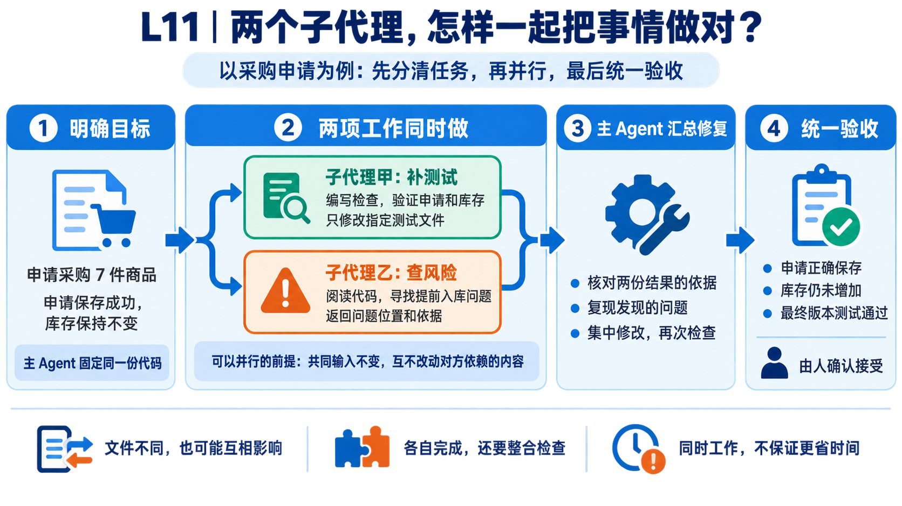
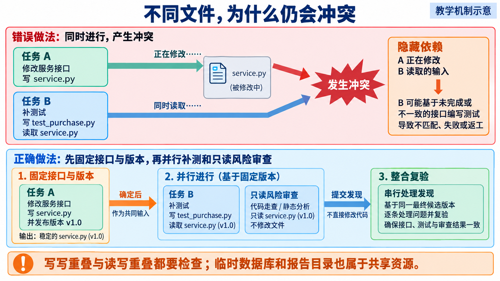
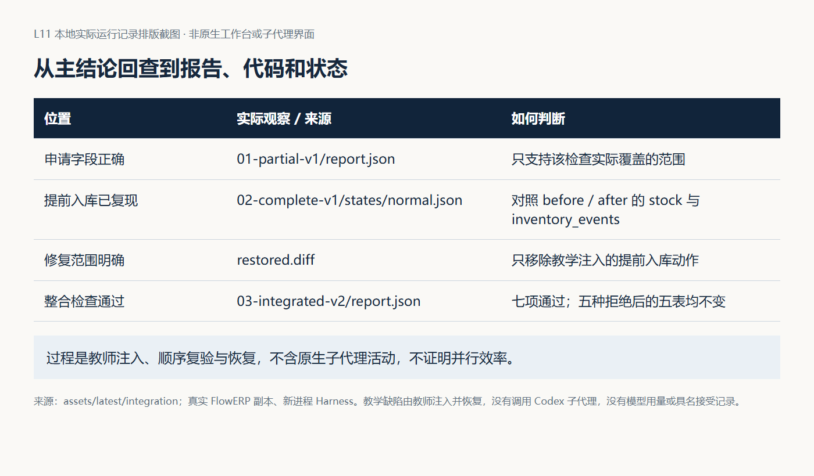
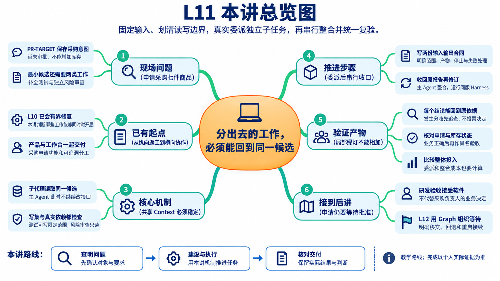

# L11｜参考详解

> 按需查阅：先读[辅导资料](辅导资料.md)，再按问题查询下面的原有实验、源码解释和进阶讨论。
>
> 本文件保留原详细材料及其图片、证据与来源。下文的章节编号独立于新版辅导资料；原核验日期和参考记录不表示本轮重新运行，更不代表学员已经通过。操作步骤以[实践操作手册](实践操作手册.md)为准。


> 本资料先解释问题、原理和判断方法；实际操作与提交按配套实践手册完成。



先从左到右看这张图：明确采购申请的目标后，两个子代理分别补测试、查风险，同时开展工作；两份结果汇合后，由主 Agent 核对依据、修复问题，对最终版本统一检查，再由人确认接受。下文沿这条流程解释每一步。

## 先看两项工作：能不能同时做

上一轮已准备采购申请功能：申请购买商品 A 七件，但尚未批准，也不能增加库存。你还要做两件事：补全测试，以及检查代码是否偷偷提前入库。

**Subagent（子代理）**就是由主 Agent 委派、负责一项明确子任务的 AI 执行者。两个子代理可以同时工作，但“任务名称不同”并不代表它们互不影响。

### 用一次文件改动判断能否并行

假设主 Agent 暂时固定采购实现，不再改接口。子代理甲只修改指定测试文件；子代理乙只读采购实现，返回风险报告。两者不写同一个文件，也不依赖对方正在变化的产物，才适合考虑并行。

反过来，若甲在改采购函数的参数，乙正按旧参数检查调用，两人即使没有同时写一个文件，乙的结论也可能很快失效。还要检查它们是否共用可变数据库、端口或其他资源。

所以本讲先列两张清单：**读集**是需要读取的文件，**写集**是允许修改的文件。清单帮助判断依赖；实际执行仍要检查有没有越界。

### 两份报告回来以后，还没结束

甲说测试通过，乙说可能提前入库，不应投票或把两句摘要拼起来。主 Agent 要核对它们检查的是不是同一个版本，复现风险，必要时依次修订，最后检查整合后的版本。

第 1 节先确认采购申请应改变什么；第 2～3 节判断独立性并写委托；第 4 节处理结果不一致；第 5～6 节计算代价、形成个人交付。你负责分工和接受决定，Codex 的主代理组织子任务，工作台保留委托与证据。产品成果仍是一张正确的采购申请，不是两份漂亮报告。

人物为虚构教学情境。真实并行需要实际子任务身份和活动记录，普通示例程序不能替代。操作见[实践操作手册](实践操作手册.md)，个人记录见[提交模板](SUBMISSION.md)；[29 页课件](slides/L11-用Codex原生Subagents并行处理独立任务-主线自学版-29页-定稿.pptx)供复习。

## 1 先确定共同目标：交付申请，不提前入库

林舟先与周宁确认七件申请意味着什么，再把同一预期交给测试与审查子代理。申请表达采购意图，审批授权业务决定，收货才记录实际到货；下面的正反路径都围绕这些差别。

### 1.1 申请、审批和收货分别承诺什么

申请表达意图：希望采购商品 A 七件，原因是低于补货点。审批表达授权：负责人接受了这项采购决定。收货表达已经发生的物理事实：商品到达，仓库可以增加在库数量。

把这三件事合为一个动作，会让未到货商品进入可用库存。系统可能继续接受订单，最后发现没有货可以发。因此，采购申请是否成功，不能只看数据库多了一行，还要看哪些状态应当保持不变。

本讲使用入门业务入口 `ERPService.propose_purchase`。它创建 `purchase_requests` 中的 proposed 记录，审批与入库的移交在 L12 继续处理。正式采购界面可能调用另一条服务路径；应追踪页面实际入口，再决定哪些检查可以复用，不能把入门方法的结果直接套到全部采购功能上。

### 1.2 一份可以手算的预期

商品 A 在库 10 件，OTHER 订单已预占 2 件，可用量为 8。系统已有另一张采购申请 PR-OTHER。现在创建 PR-TARGET，采购 A 七件，原因为“低于补货点”。


图 1｜创建的是采购意图，库存没有增加。除了核对申请字段，还要独立检查库存、流水和其他对象；否则提前入库的错误也可能通过字段检查。

| 观察对象 | 创建前 | 创建成功后 | 为什么 |
|---|---|---|---|
| PR-TARGET | 不存在 | proposed，A，7，保留原因 | 申请意图已持久化 |
| 审批人 | 无 | 无 | 本次没有审批 |
| 在库／预占／可用 | 10／2／8 | 10／2／8 | 申请没有收到货 |
| 库存流水 | 既有流水 | 不变 | 未发生库存动作 |
| OTHER 订单、PR-OTHER | 既有记录 | 不变 | 本次只处理目标申请 |

稳定身份使后续读取、审批、讨论能指向同一对象。本例主动给出 PR-TARGET，之后按这个编号读取同一张申请。**身份稳定不等于重复提交具有幂等语义。** 当前参考服务再次插入相同编号会触发数据库完整性错误；它不会自动把重复请求转换成第一次的成功响应。是否需要重试幂等，要在产品需求与接口合同中另外决定。

### 1.3 失败以后应留下什么

零数量、负数量、空白原因和不存在的 SKU 都应拒绝。拒绝之后，采购申请、库存、库存流水、订单及订单明细应与之前一致。只检查“抛出异常”不够，因为程序可能先写入部分数据才报错。

[采购申请实验](examples/purchase_request_lab.py)使用真实服务和临时数据库。normal 验证上述成功结果；另外五种模式分别验证零数量、负数量、空白原因、未知 SKU 和重复编号的失败后状态。premature-stock 则人为在申请后增加七件库存：申请字段依然正确，但独立的库存不变检查会失败。

这个反例提醒我们，测试补全应该从业务承诺寻找遗漏。只复制已有函数的字段赋值，很容易漏掉“没有发生什么”。默认 `purchase_request_preserves_reason` 已检查身份、状态、数量、原因以及零数量和空白原因拒绝，但没有直接比较完整库存和流水。阅读检查实际覆盖的断言，才能知道新增测试的价值。

读到这里，先用一句话写下两位子代理共同遵守的判断依据：PR-TARGET 应被保存为申请，但库存仍为 10／2／8；非法输入被拒绝且不残留业务变更。接下来的分工只能改变检查工作的安排，不能让各个执行者自行改写这个目标。

## 2 再固定共同输入：哪些任务可以并行

林舟列出两份任务会读写的文件，发现“一个补测试、一个查风险”还不够具体。如果它们依赖的申请接口仍在变化，返回结果就不能直接整合。他先固定候选，再检查文件之外是否还共享数据库或其他可变资源。

### 2.1 读集与写集

读集是任务执行时依赖的文件或目录，写集是任务可能改变的文件或目录。假设测试子代理只修改 `tests/test_l11_purchase.py`，风险子代理不修改任何文件，两者读取独立 FlowERP 候选中的同一份 `flowerp/service.py`。只要这份业务实现保持稳定，它们可以共同读取。

用 R 表示读集，W 表示写集，两个任务在声明的文件层面独立，需要三个交集都为空：W₁∩W₂、W₁∩R₂、W₂∩R₁。读与读的交集允许存在。前两个任务的分工如下：

| 子任务 | 读取 | 写入 | 返回 |
|---|---|---|---|
| 测试补全 | 固定实现、接口约定、数据结构 | 独立测试文件 | 测试 Diff、命令、结果和遗漏 |
| 风险审查 | 相同实现、数据结构、相关调用方 | 无 | 风险位置、依据、触发条件和未验证项 |

把交集翻成一次实际操作就容易理解：测试子代理刚读到接口接收 quantity，主 Agent 随后把参数改成 units，测试子代理仍按刚才看到的接口写入。两者没有覆盖同一文件，却交出了不能配合的产物。写写重叠会争抢输出，读写重叠会改变别人的判断依据，只有读读共享通常可以保留。



*读图：先看任务 B 读取了谁，再决定能否与任务 A 同时运行。下半部分把接口固定、并行调查、串行整合分开。*

本讲因此先完成并固定最小实现，再让测试补全与风险审查读取同一版业务代码；它们返回后，主 Agent 串行修订。固定版本不是要求永远不改，而是在这一段并行期间不改变共同输入。若必须先改接口，就通知受影响任务，保存已有产物，更新输入后重新判断哪些结论仍可使用。


图 2｜两项任务可以同时读取固定业务实现。测试文件、报告和临时库需要各自明确；主 Agent 也不能在这段时间改变子任务依赖的输入。箭头表示依赖，不代表已发生真实并行。

### 2.2 声明检查器能做什么

仓库的 `agent.schedule` 根据 `Subtask` 的读写声明比较路径。它会把反斜杠转为斜杠，保守地忽略大小写，检查文件相同与目录包含关系，拒绝父目录跳转、绝对路径和通配符等不明确范围。检测到共享写入或读写依赖时，`assert_parallel_safe` 抛出错误。

[调度实验](examples/schedule_lab.py)提供十种输入。same-write 检查同写一文件；read-write 检查实现被测试读取；directory 检查目录覆盖文件；path-alias 检查路径写法变化；shared-report 检查两个任务把报告写向同一路径。它们都应被拒绝。

undeclared-read 故意漏掉测试读取业务实现的声明。检查器返回允许，因为它看不到遗漏的依赖。这不是允许实际并行的理由，而是要求你修正输入。该函数不扫描真实工具行为，也不创建文件锁或沙箱；“声明通过”和“执行遵守声明”需要分别证明。

### 2.3 文件之外还有哪些依赖

两个任务可能写不同文件，却操作同一个数据库、占用同一端口、改写同一环境配置，或者把临时报告输出到默认路径。这些也是共享状态。运行测试不一定是只读动作：数据库夹具、缓存和报告都可能产生写入，应分配各自独立的运行目录或临时库。

还有语义依赖。例如，一个任务将 quantity 的含义从“件”改成“箱”，另一个在另一文件中计算采购金额。路径检查无法发现单位不一致。因此需要固定接口、单位、错误语义和输入版本；发生变更时，重新通知依赖任务，必要时重跑，而不是等整合报错才猜原因。

先问“是否依赖彼此尚未完成的结果”，再问“文件是否重叠”。如果测试必须等待一个未确定的接口，可以先只读设计测试场景，但实际写入测试应等待接口确定。

本例到此得到的安排是：固定采购候选 V1，测试子代理只写独立测试文件，风险子代理只读同一 V1，主 Agent 暂不修改共同输入。固定不是只给文件起名叫 V1，还要保留版本或文件指纹，使返回结果能核对到实际输入。如果发现必须先改接口，就回到串行准备阶段，形成新的共同输入后再委派。

## 3 把边界写进委托：启动两项独立工作

独立性确认后，林舟为两项工作分别写输入、产物、允许范围和停止条件。子代理没有参加前面的讨论，必要业务预期需要明确传入；执行记录还要能与这份委托对应。

### 3.1 上下文、文件和权限是三件事

Subagent 是由主 Agent 委派去处理某项工作的子执行者。分开的任务上下文有助于集中处理问题，但不能据此推断文件系统、数据库或权限也已经隔离。

上下文约定回答“它根据哪些事实判断”；工作区安排回答“它看见和修改的是哪份文件”；执行权限回答“工具实际允许它做什么”。一份只读提示词是行为约定，实际只读权限还要由客户端能力或执行环境落实。即使使用不同工作区，两个产物最终仍需在同一个候选版本上整合复验。

不要依赖子代理自动知道主任务中尚未落到文件的决定。给它任务需要的 Spec、版本、接口和相关业务规则，同时要求它回报缺少的上下文。把另一位审查者的初步结论提前塞给它，可能使两人重复同一假设，削弱独立调查的价值。

### 3.2 一份完整而精简的委托

测试任务需要的不只是“补一下测试”。下面是一份业务与执行都明确的约定，实际使用时把版本和路径替换成自己已确认的值：

```text
任务：补全采购申请测试。
共同输入：签字版 Spec、固定候选版本、propose_purchase 的接口约定。
目标：验证正常申请，拒绝非法输入；申请不能增加库存。
读取：指定业务实现、数据结构和现有测试约定。
写入：仅 tests/test_l11_purchase.py；运行数据使用独立临时目录。
输出：新增用例及其业务理由、Diff、实际命令与退出码、未覆盖问题。
接受：用例加载当前真实服务；合法申请通过；premature-stock 类错误会失败。
停止：接口不符、所需范围超出约定或发现共享写入时，回报依赖并停止冲突部分。
```

风险审查任务读取相同候选，检查创建申请是否改变库存、失败是否残留数据、身份是否被误认为幂等，以及其他真实风险。它返回每条发现的文件位置、触发条件、影响、依据和待验证项，不直接修改实现。两个任务的接受标准不同：测试任务交付可执行检查，风险任务交付可以回查的判断。

这样拆分不是让两位代理各自“完整做一遍采购功能”。测试任务把业务预期变成可重复执行的断言；风险任务从调用路径和失败后状态寻找遗漏，允许返回测试尚未覆盖的问题。两份结果互相补充，但不要求事先互相认同。风险审查者发现问题后也不应顺手修复，否则会改变测试任务正在观察的 V1。

### 3.3 不打开桌面 App 也能组织协作

项目中的规则、Spec 和材料提供持久上下文，客户端提供执行入口。官方文档说明，可在 Codex 交互式 CLI 中明确要求使用子代理，并用 `/agent` 查看子任务；每个子代理都会产生自己的模型与工具用量。功能以本机版本及实际可用入口为准。[OpenAI Subagents 文档](https://learn.chatgpt.com/docs/agent-configuration/subagents)

在项目目录启动 Codex 后，交付两个任务合同，明确要求并行、等待两者结果，再进行串行整合。这里不需要先打开桌面 App。仓库的 `assert_parallel_safe` 只是声明检查工具，不会自行启动原生子代理；一般 Python 并发也不能冒充本讲的原生 Subagents 演示。

如果当前客户端不能启动子代理，可以先完成业务与冲突实验，但真实协作记录应保留为未完成。不要把两段串行生成的摘要改名成“并行结果”。

两份委托只是执行前的约定。执行后还要保存主任务与子任务身份、共同输入版本、实际活动时间、各自产物和停止原因；判断确实并行，要有活动时间重叠的记录。若一个任务越界或输入变化，主 Agent 应暂停受影响工作，先重新约定边界，再决定续做或重跑。只有这些材料齐备，下一节的“汇总”才有可以回查的对象。

## 4 收回两份结果：串行修订，同版复验

两份子报告回到林舟手里时，他先看引用的候选和具体依据。一个说测试通过，另一个指出潜在提前入库，不能投票决定谁对；要沿原材料查清，再串行修订共同候选。

### 4.1 汇总不是拼接摘要

测试子代理说“全部通过”，风险子代理说“可能提前增加库存”，两句话未必矛盾。测试可能没有覆盖库存不变，也可能两者观察了不同版本。主 Agent 首先回查版本和范围，然后复现风险对应路径，再决定补测或修复。

| 原始结论 | 主 Agent 应回查 | 可以形成的判断 |
|---|---|---|
| 所有测试通过 | 实际命令、用例数量、退出码、版本 | 已执行范围通过 |
| 创建申请可能增加库存 | 调用位置、触发条件、状态对照 | 已复现缺陷或待验证风险 |
| 重复提交失败 | 同编号还是新编号、原记录是否变化 | 当前重复身份处理语义 |
| 没发现风险 | 看过哪些路径、遗漏哪些入口 | 在所述范围内未发现 |

每条主结论至少能回到一份原始子任务结果和对应文件或报告。无法确认的发现保留“待验证”，不要因为需要一个整齐的总分而强行变成通过或失败。


图 3｜测试通过与风险发现可能来自不同覆盖范围。先回查再复现，完成串行修订后，对最终同一个版本运行验收；主摘要不能替代任何一份原始结果。

### 4.2 串行整合与同版复验

两个子任务结束后，主 Agent 检查测试 Diff 是否在约定范围内，确认测试使用真实业务入口，再处理风险发现。如果需要修改接口，应同时更新受影响测试，并说明原子任务结论在哪个地方已经过时。

整合后的候选应运行新增测试、采购申请 Eval 和统一阻断套件。子任务各自通过，只说明各自观察范围；合在一起后，导入方式、共享夹具或调用契约仍可能改变。最终接受绑定整合版本，不能引用之前某个局部分支的绿色结果代替。

出现共享写集时，先停止冲突部分，保存各自产物，再决定由谁串行处理。不必真的制造两个 Agent 互相覆盖文件来证明风险，给声明检查器一个冲突输入就可以验证拒绝路径。冲突后的正常结果是边界被重新划分、产物来源仍在，随后复验；不是静默丢弃一方工作。

### 4.3 同版案例：为什么一份报告绿，另一份报告红

这次不先假设两份结果来自不同版本。运行[同版整合实验](examples/integration_lab.py)：教师复制真实服务，在 `propose_purchase` 保存申请后加入提前 `receive_stock` 的错误动作。既有 PR-OTHER 是固定夹具，目标 PR-TARGET 仍通过真实服务创建。检查进程分别加载同一份 V1；两个报告中的服务文件指纹相同。

第一份报告运行原 `purchase_request_preserves_reason`：身份、状态、数量、原因和两种拒绝检查通过。第二份报告按照业务承诺比较五表，六项检查只有正常申请失败，另外五种拒绝通过。正常申请的字段仍正确，但在库／预占／可用从 10／2／8 变为 17／2／15，还增加了一条库存事件。商品没有到货，系统却多出七件可售库存。


图 4｜先对照版本，再比较检查覆盖范围。这里的两份结果能够同时成立：字段检查通过，库存不变条件失败。报告来自真实进程，页面是记录排版，不是子代理界面。

主 Agent 此时不能任选一份结论，也不能把“1/1 通过”和“5/6 通过”平均成质量分。应引用第二份报告的正常申请状态快照，定位实际提前入库动作，再串行移除它。修订后的 V2 同时运行原检查与六项独立检查，得到 7/7 通过；正常申请仍保存 proposed，库存恢复为 10／2／8，OTHER 和 PR-OTHER 保持不变。


图 5｜修复改变服务文件，没有删除或放宽检查。三次运行的检查文件指纹相同；V2 服务文件指纹与 V1 不同。新的绿灯绑定 V2，不能回填成 V1 原本没有问题。

最后形成的主结论应能沿具体文件回查：申请字段正确对应原报告；提前入库对应 V1 状态快照；修复范围对应 `restored.diff`；当前七项通过对应 V2 新报告。原始过程保留，后来的结论才有依据。



图 6｜沿每一行回查到报告、差异或状态。实际实验是教师注入、顺序复验与恢复，没有原生子代理活动；它解释整合判断，不能代替本讲要求的真实并行委派。

将这个案例用于子代理协作时，测试子代理应交付实际新增检查，风险子代理应给出具体触发路径。两者读同一固定输入，主 Agent 等双方结束后处理实现。参考实验已经给出可复验问题，学生还须留下实际子任务身份、输入、活动、产物及主结论的对应关系。

### 4.4 什么时候可以形成主结论

回到 PR-TARGET，主 Agent 最终要交回的不是“两个子代理都完成了”，而是一项带依据的产品判断：当前整合候选能保存申请字段，拒绝约定的非法输入，并保持库存及其他对象不变。这个判断必须指向当前版本的实际检查；未验证入口和未解决风险另列，交由具名复验者决定是否接受。

如果整合后仍有失败，就沿 L09、L10 已学的方法，把失败变成范围明确的修复任务，并按有界 Loop 继续或停止。不能因为两位子代理都已返回，就跳过返工；也不能为了得到全绿而无限追加子任务。并行改变的是中间工作的安排，不改变交付终点和停止条件。

至此，业务目标、分工边界、原始结果、实际修订和最终验收连成了一条证据链。现在才能进一步问：为了取得同样的结果，这次并行安排是否值得？

## 5 回看完整交付：并行是否值得

先列出本次可以独立完成的调查与验证，再估计拆分、解释和整合的成本。若两个任务都依赖尚未确定的申请状态，应先确认状态合同，再并行；若共享写入不可避免，应串行整合。学生负责解释这种选择，Codex 提供工作量与依赖线索。FDE 要比较从提出需求到可接受结果的整体投入，子任务各自结束得快并不足以证明交付更快。

### 5.1 时间要算到可接受结果

假设测试补全需要 8 分钟，风险审查需要 6 分钟，两种安排最终都要花 4 分钟进行相同复验。串行执行合计为 8＋6＋4＝18 分钟。并行需要额外花 2 分钟委派、5 分钟汇总，任务同时运行 8 分钟，最终复验仍需 4 分钟，合计 2＋8＋5＋4＝19 分钟。共同的前期准备未列入，两侧输出与复验要求相同。子任务阶段缩短了，完整交付却更慢。这组数值是算例，不是本仓库测量结果。


图 7｜教学算例，单位为分钟。上方顺序执行两项工作，下方按最慢子任务计并行等待；两侧均包含最终复验。真正比较时还要用实际记录检查返工和额外用量。

近似计算是：并行总耗时＝准备与启动＋最慢子任务＋汇总、返工与统一复验。比较时，单 Agent 一侧也必须包含同样的验证和输出要求。任务范围不同、模型不同或后一次已经看过前一次答案，都会影响解释。

### 5.2 用量与质量需要单独比较

多个子代理会重复读取共同上下文，主 Agent 还需阅读它们的输出。墙钟时间下降，Token 仍可能增加。记录平台能提供的实际用量和口径；缺失就写缺失，不用输出字数反推精确 Token，也不要把主任务用量与已包含子任务的汇总再加一次。

质量看有效发现和最终行为。两个代理报告同一个问题，不能计为两项独立发现；一个代理快速给出五条猜测，可能不如一个可复现缺陷。对照实验可记录重复发现、经复核成立的发现、漏判、返工时间和最终验收结果。

单 Agent 与多 Agent 对照是本讲挑战任务。基础通过要求是任务边界、结论追溯和冲突处理。没有完成公平对照时，可以说明协作经过，但不能声称已经证明提效。即使并行更慢，只要你能用数据解释为什么下次选择串行，也形成了有效判断。

用采购申请回查这次 FDE 分工：谁确认“提交申请不增加库存”，哪份子报告提出反例，谁在整合候选上复验，最终由谁接受。把有效的分工理由提炼为候选方法，下一需求重新检查读写依赖；记录实际采用后的冲突或收益，尚无时间与质量对照时不声称并行提高了效率。

## 6 总结、个人实践与下一讲

### 6.1 用一张申请复述本讲方法

本讲从“采购 A 七件，但不能提前增加库存”出发。共同业务目标决定检查内容；固定输入与读写范围决定能否并行；任务合同决定子代理执行和返回的边界；主 Agent 回查分歧、串行修订、同版复验，才能得到一次可接受的交付。最后再比较完整耗时、用量和质量，决定是否复用这种安排。

请记住三个判断：**能同时启动，不等于任务独立；局部通过，不等于整合通过；子任务更快，不等于完整交付更快。** 本讲新增的工作台能力，是在一次交付中组织可追溯的分工，而不是用 Agent 数量替代工程判断。

### 6.2 个人交付与方法迁移

前面已经得到选择并行、写清委托和整合结果的方法。接下来要将它们用于本人交付，再换一个场景验证哪些条件仍成立；能运行参考实验与能独立组织协作是两项不同的证据。

先手写采购成功与失败后的状态预期，再运行两类实验。接着在个人隔离候选上固定最小实现，写两份子任务合同，检查读写声明，完成真实测试补全与风险审查并行。主 Agent 汇总时回查证据、处理分歧，并在整合版本统一复验。

请同伴检查一个你认为可以并行的安排，要求对方主动寻找隐藏读依赖、共享报告或接口变化。保留自己的第一次判断和修订理由。迁移练习选择“业务接口修改与页面实现”：明确哪些页面设计可以先做，哪些调用代码必须等待接口固定。

配套 [parallel-task-review Skill](skills/parallel-task-review/SKILL.md)审查任务合同和主结论。用漏报读取、共享报告、不同版本局部通过、同版不同覆盖、顺序进程冒充并行五个反例检验真实响应，记录漏判与改进。Skill 格式合格只是起点，真正的复用价值来自后续任务采用后仍然有效。

本次可提炼的协作方法是“固定共同输入—并行补测与审查—串行整合—同版复验”。把它与实际冲突、采用条件和原始证据一同保存，才能供下一需求使用。这对应工作台的 Harness＋记忆系统＋工作流蒸馏：Harness 保留受控交付证据，记忆提供有来源的经验，流程提炼形成经复验和具名审核的版本化步骤。只有后一事项实际召回并采用、留下复验和人审结果，才证明发生了复用；登记一个 Skill 不等于闭环完成。实现状态与建设要求见[工作台范式与闭环建设规格](../../architecture/工作台范式与闭环建设.md)。真实事项仍从工作台首页“事项与决策”进入。

### 6.3 思考：哪些决定不能交给并行本身

1. 测试子代理只写测试，主 Agent 只写业务代码，为什么仍可能不能并行？请指出谁读取了谁正在改变的输入，并给出可执行的先后安排。
2. 同一 V1 的字段测试通过，库存不变检查失败，主 Agent 应先做什么？为什么不能投票或平均两份报告的通过率？
3. 两位子代理均已返回，但整合候选复验失败，你会怎样接回 L10 的停止条件？需要保留哪些结果才能交接？
4. 并行比串行多花一分钟，却发现一个原方案遗漏的真实缺陷，这次是否值得？还缺哪些对照，才能区分协作收益与检查范围变化？

先写自己的判断，再请同伴用隐藏依赖或未覆盖路径反驳。保留初答与修订，评价的是你能否解释选择及其依据，而不是是否始终选择并行。

### 6.4 下一讲：申请之后，谁有权批准入库

L11 结束时，PR-TARGET 只是可查询的采购申请，库存仍未增加。接下来必须回答：谁批准、驳回后回到哪里、批准后如何移交入库、执行中断后从何处恢复？这些工作有先后条件与业务授权，不能把“审批”和“入库”当作两项独立任务一起启动。

这正是 L12 的起点：用 Graph 显式表达状态、回退和人工审核，在具名审批后入库的交付中验证。L10 管一条修复链何时停止，L11 管独立工作如何分工，L12 再把有依赖、有分支、有人类决策的步骤组织成可追踪的流程。

## 离开这一讲之前

林舟把申请功能交给陈珂复验，同时把 PR-TARGET 留在待审批状态。周宁随后问，负责人明天才能看，程序关掉后还能从这里继续吗？下一讲要把等待、打回、批准与恢复写成明确流程。

## 读完后回看：先回答，再看总览图

**两个子代理不写同一个文件，就一定能同时工作吗？**

不一定。一方可能修改另一方正在读取的接口，也可能共享数据库等可变资源。先固定输入并检查依赖。



这张图用于复习，不是阅读起点。先沿本讲案例的先后顺序回看，能解释上面的问题后，再查图中的分支和术语。

### 接下来到实践手册做什么

手册第 2～3 步是机制与业务实验，第 4～6 步才是准备真实委托、执行并行和整合复验。具体命令见[实践操作手册](实践操作手册.md)。实验示例用于理解；提交材料必须对应自己的输入、版本、实际结果和判断。

## 附录：课程合同与来源

本讲对应 CLO-5：跨角色协作与人审。以下四项保持正式大纲原文。

- **核心内容**：可并行任务识别、上下文隔离、结果汇总、冲突风险与额外 Token 成本。
- **演示结果**：测试补全与风险审查并行执行，由主 Agent 汇总结论。
- **课内增量**：为两个无文件写入冲突的任务定义清晰输入、输出和验收标准。
- **通过标准**：子任务边界清晰；主 Agent 能追溯每个结论；有写入冲突的任务不强行并行。

2026-09-09 重新核验了 [OpenAI Subagents 官方说明](https://learn.chatgpt.com/docs/agent-configuration/subagents)：本地 Codex 可根据明确委派要求或适用项目／技能指令启动子代理，CLI 使用 `/agent` 查看活动。仓库机制依据 [调度检查器](../../../agent/schedule.py)、[业务服务](https://github.com/congde/flowERP/blob/main/flowerp/service.py)和[默认 Eval](../../../eval/cases.py)。路径声明、真实采购和同版整合实验的结果，不代表已经完成原生子代理协作，也不代表学员学习达成。
