# L11 实践操作手册

> 本资料由 AI 辅助整理，为课程赠送资料，用来辅助你实践练习，非必读资料。

这次练习围绕一件事：**申请采购商品 A 七件，申请要保存下来，但库存不能增加。** 你要让 Codex 安排两个子代理同时检查这项功能：甲补测试，乙查风险。等两者结束，再由主 Agent 修复问题、统一检查，由你和复验者判断是否接受。

先分清前后两段。第 1～3 步及第 4.1 节运行课程提供的小实验，帮助你看懂“哪些工作能同时做”和“为什么测试通过仍可能有问题”；第 4.2 节开始，才准备自己的练习副本并组织真实子代理协作。前一段程序会自动演示，后一段需要你确认分工、发送提示词、查看实际结果。

本讲产品成果是正确的采购申请；工作台新增或验证的能力，是组织两项互不干扰的工作，并把各自发现带回最终验收。你的学习成果则是能说明为什么这样分工、怎样处理分歧，并在另一个场景重新作出判断。

本文统一用 **Windows PowerShell** 演示终端操作；macOS/Linux 的环境与退出码写法见下方排错说明。标为 `text` 的提示词要发给 Codex，标为 `powershell` 或 `bash` 的命令在终端执行。每次只执行一条命令，看完结果再继续。

第一次阅读只需认清三个称呼：**控制仓库**是你保存课程和工作台的 CodexFDE 文件夹；**客户仓库**是独立的 FlowERP 文件夹；**候选**是工作台为本次任务创建的练习副本。第 1～4 步的准备命令始终在控制仓库运行，第 5 步才明确切换到候选。

如果你只想先把练习跑通，按下面这条最短阅读线前进：

1. 每一步先看开头的“本步只做什么”；
2. 再看图，确认当前位置、输入和产出；
3. 一次只执行一个代码块；
4. 对照“看到什么算正常”；
5. 结果不符时停在本步，不用后面的绿灯覆盖当前异常。

> **最容易出错的边界：**第 1～4 步在控制仓库；第 5～6 步必须进入工作台返回的隔离候选。课程提供的实验只用于理解机制，不等于已经完成真实子代理协作。

开始操作前，遇到解释器、路径或输出问题，按[执行与排错说明](../../reference/实操手册执行与排错.md)核对。

### 本讲目录地图

```text
〈CodexFDE 控制仓库〉/                ← 声明实验、业务观察和任务提交
├─ .venv/
├─ agent/                            ← 调度能力来源
└─ .runtime/l11-…/                   ← 会话与证据

〈独立 FlowERP 仓库〉/               ← 采购业务源码来源
〈工作台返回的隔离候选〉/            ← 子代理协作和主任务整合的位置
├─ agent/、flowerp/
├─ eval/、tests/
└─ .course/experiment-source.json
```

两个子代理和主任务必须引用同一个候选绝对路径；允许文件可以不同，但不能一个改控制仓库、另一个改候选。只有手册明确要求进入候选后，才在该目录启动 Codex CLI。

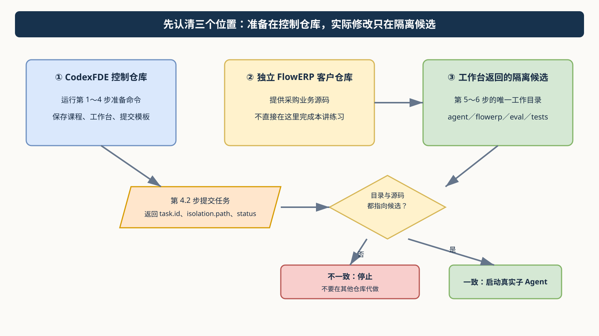

图 1｜先看位置，再执行命令。没有取得并核对 `isolation.path`，就不要启动真实子 Agent。可编辑源文件：[05-workspace-boundary.drawio](assets/diagrams/05-workspace-boundary.drawio)。

## 先看流程图，再开始操作

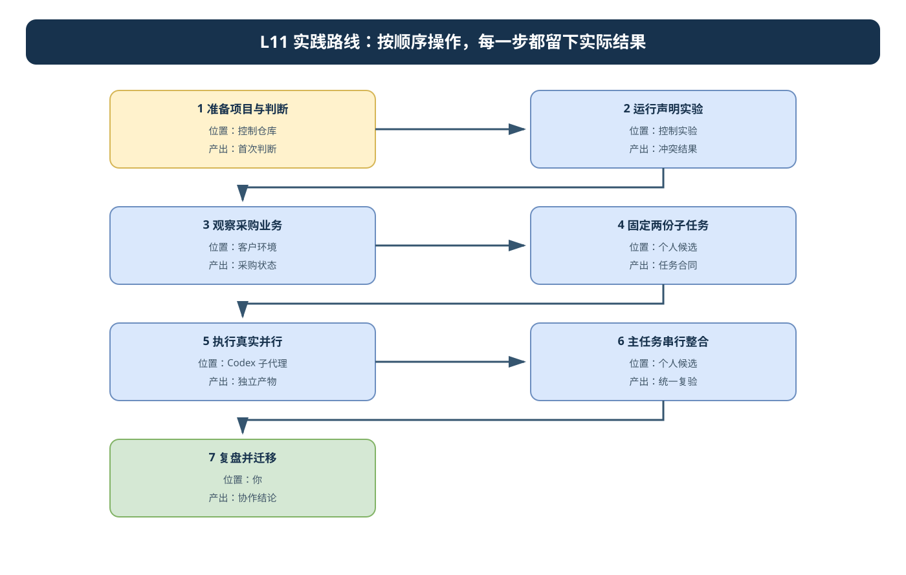

图 2｜两个子任务可以并行，主任务整合必须串行。所有角色都使用同一个候选绝对路径，并分别记录允许文件和实际改动。可编辑源文件：[l11-practice-flow.drawio](./assets/l11-practice-flow.drawio)。

### 按图执行的完成标志

| 步骤 | 在哪里操作 | 进入下一步前必须留下什么 |
|---|---|---|
| 1. 准备项目与判断 | 控制仓库 | 首次判断 |
| 2. 运行声明实验 | 控制仓库终端 | 哪些安排被允许或拒绝，以及你的解释 |
| 3. 观察采购业务 | 控制仓库终端，脚本自动调用客户环境 | 正常申请和错误申请的检查结果 |
| 4. 固定两份子任务 | 控制仓库提交，返回个人候选 | 候选绝对路径、两份任务说明 |
| 5. 执行真实并行 | Codex 子代理 | 独立产物 |
| 6. 主任务串行整合 | 个人候选 | 统一复验 |
| 7. 复盘并迁移 | 你 | 协作结论 |

## 第 1 步：准备项目与首次判断

<!-- step-guide-1 -->
> **一句话说明：**先确认自己站在正确的项目目录，再写下“实验前我认为会发生什么”。这一步不改业务代码。

### 本步只做什么

| 输入 | 动作 | 产出 |
|---|---|---|
| 控制仓库、辅导资料、提交模板 | 确认环境，留下实验前判断，读取课程合同与 Spec | 一份没有被后续实验覆盖的“首次判断” |

**不要做：**不要启动子 Agent，不要修改采购业务代码，不要把参考仓库已有功能写成本人的实现。

开始本讲 FDE 实践时，先在[提交模板](SUBMISSION.md)的首次判断与需求记录回答：采购申请涉及哪些业务与研发职责，哪两项工作确实独立，为什么本次值得并行？注明来源是实际观察、同伴试用还是教学设置，写下本次选择和暂缓范围，再请 Codex 协助调查。

在项目根目录使用已有 `.venv`。PowerShell 运行 `.\.venv\Scripts\Activate.ps1`；macOS/Linux 运行 `source .venv/bin/activate`。项目尚未安装时，激活环境后运行 `python -m pip install -e .`。下面的路径都以项目根目录为起点。

激活后先运行下面的检查。终端应显示你的 CodexFDE 根目录，Python 应来自该项目的 `.venv`。保留这个终端，后面继续使用。

```powershell
python -X utf8 -c "import sys; from pathlib import Path; print('当前目录:', Path.cwd()); print('Python:', sys.executable)"
```

如果当前目录不对，先用 `Set-Location -LiteralPath '你的 CodexFDE 绝对路径'` 切换；引号内替换为自己的路径。若激活失败或没有 `.venv`，按[环境准备](../../reference/实操手册执行与排错.md)处理后再继续。

先阅读[讲义](辅导资料.md)，在[提交模板](SUBMISSION.md)中写下三项判断：采购申请成功后库存是否变化；业务实现被修改时测试是否还能独立进行；两个局部测试都通过是否能直接接受整合版本。保留首次答案，实验后追加修订。

查看当前课程合同和建设范围：

```bash
python -X utf8 -m workbench.cli course-contract --lesson 11
python -X utf8 -m workbench.cli course-spec --lesson 11
```

第一条显示课程合同；第二条生成文件并返回 `spec_path`，不会执行交付。返回后在编辑器打开该路径阅读，再继续第 2 节。它不是本人已确认的 Spec；默认输出会写到固定路径，已有个人修改时先保留版本，再用 `--output` 指定新路径生成。

预期看到采购申请、读写冲突与串行集成目标。采购服务属于独立 FlowERP，调度能力属于工作台。当前课程组合候选中的 `flowerp/` 来自客户项目，`agent/` 来自工作台，`eval/`、`tests/` 按来源记录区分；路径相对于返回的候选目录，不是 CodexFDE 根目录。本次任务再收敛到实际需要的文件。不要用终态仓库已经具备的功能冒充个人实现；在工作台生成的隔离候选中保存本讲起点、目标失败和改动。

## 2 先学会判断：两项工作会不会互相干扰

<!-- step-guide-2 -->
> **一句话说明：**运行十个很小的例子，看看哪些任务可以同时做，哪些必须一个做完再做另一个。本步只是学习判断，不会真的启动子 Agent。

### 本步只做什么

运行十种“任务声明”小实验，学习判断能否并行。这里检查的是你申报的读写范围，**不会启动子 Agent，也不会自动锁文件**。

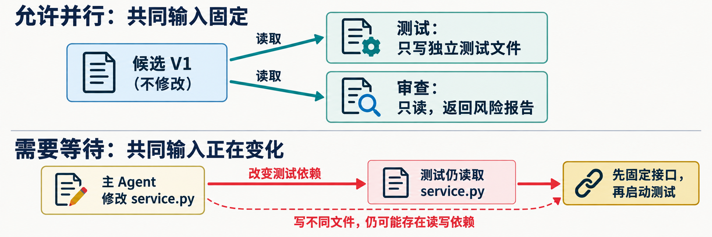

先只看这张图：上半部分可以同时做，因为两个任务只读取同一个不再变化的版本；下半部分必须等待，因为主 Agent 正在修改测试要读取的文件。**写不同的输出文件，不代表一定没有输入依赖。**

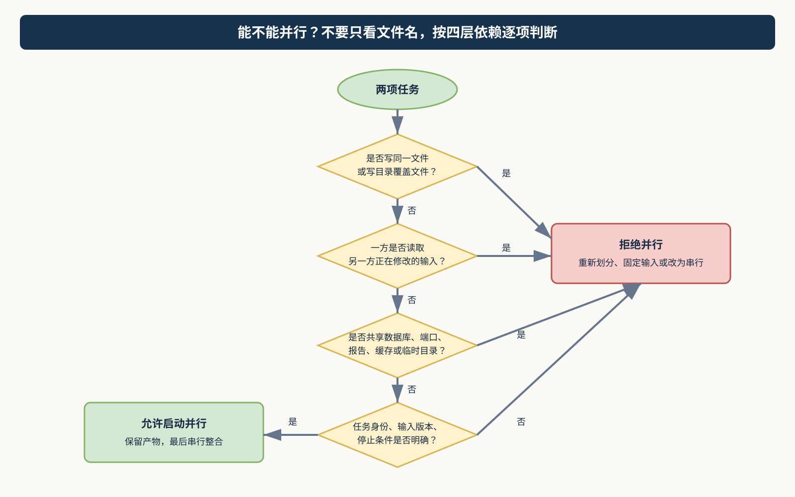

图 3｜从上到下逐项判断：文件写入、共同输入、共享运行资源、任务合同。任意一项不满足，就先拒绝并行。可编辑源文件：[06-parallel-decision.drawio](assets/diagrams/06-parallel-decision.drawio)。

### 十种模式先看这张速查表

| 模式 | 看到什么算正常 | 一句话理解 |
|---|---|---|
| independent | `allowed`，退出 0 | 固定共同输入，输出互不覆盖 |
| same-write | `rejected`，退出 0 | 两项任务写同一文件 |
| read-write | `rejected`，退出 0 | 一方读取另一方正在修改的输入 |
| directory | `rejected`，退出 0 | 写目录会覆盖目录内被读取文件 |
| path-alias | `rejected`，退出 0 | 路径写法不同也不能隐藏同一目标 |
| shared-report | `rejected`，退出 0 | 业务文件不同，但报告输出相同 |
| undeclared-read | `allowed`，退出 0，但不安全 | 漏报真实读取造成假安全 |
| read-only | `allowed`，退出 0 | 两边只读同一固定文件 |
| invalid-path | `rejected`，退出 0 | 路径越出明确项目范围 |
| duplicate-name | `rejected`，退出 0 | 子任务身份无法区分 |

> **如何读结果：**`observed` 回答“允许还是拒绝”；退出码 0 回答“实验是否按预期完成”。所以 `rejected + 退出 0` 是正确识别冲突，不是程序失败。

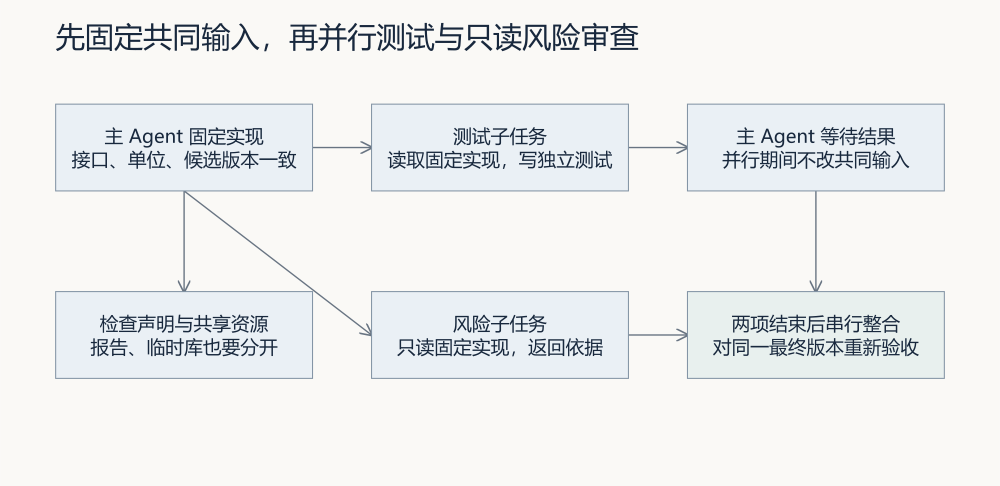

图 4｜对照图预测：测试与只读审查可以共享哪份输入，主 Agent 哪些修改必须等两者结束。

这里的“声明”就是告诉检查器：每项工作会看哪些文件、会改哪些文件。先做下面一例：测试只改自己的测试文件，审查者只读业务代码。你先猜它是否允许并行，再执行：

```bash
python -X utf8 docs/courses/L11/examples/schedule_lab.py independent
```

在输出里找到 `observed`。本例应为 `allowed`，表示检查器根据所填清单允许这种安排。然后再运行两条，比较区别：

```powershell
python -X utf8 docs/courses/L11/examples/schedule_lab.py read-write
$LASTEXITCODE
python -X utf8 docs/courses/L11/examples/schedule_lab.py undeclared-read
$LASTEXITCODE
```

`read-write` 应显示 `rejected`：一方要修改另一方正在读的代码。`undeclared-read` 却显示 `allowed`：因为清单漏填了读取关系，检查器不知道有冲突。这次“允许”不能作为真正执行的依据。

两条退出码都应为 0，意思是**实验观察符合预期**。判断能否并行要看 `observed`，不能只看退出码。程序只检查清单，不启动子代理，也不会替你锁住文件。接着把命令末尾的模式名换成下表其余七项，逐项记录到提交模板第 2 节。

| 模式 | 预期观察 | 你要解释的原因 |
|---|---|---|
| independent | 允许 | 测试独立写入，风险只读同一固定实现 |
| same-write | 拒绝 | 共享写文件 |
| read-write | 拒绝 | 测试读取正在修改的实现 |
| directory | 拒绝 | 写目录覆盖被读取文件 |
| path-alias | 拒绝 | 大小写、斜杠和点前缀不能隐藏重叠 |
| shared-report | 拒绝 | 业务文件不同，报告文件相同 |
| undeclared-read | 允许 | 声明漏报了真实读取，不能据此执行 |
| read-only | 允许 | 共同读取固定文件 |
| invalid-path | 拒绝 | 父目录跳转不是明确项目范围 |
| duplicate-name | 拒绝 | 子任务身份重复 |

到这里，你应能解释：忘记填写读取关系不会消除真实依赖。自己的两项任务将在第 4 步填入清单并检查；现在先保存十种实验的预测、输出与解释。

## 3 运行真实采购业务实验

<!-- step-guide-3 -->
> **一句话说明：**亲自验证采购申请的业务规则：申请可以保存，但商品还没到货，所以库存不能增加。

### 本步只做什么

| 先验证 | 再验证 | 故意制造的失败 |
|---|---|---|
| 正常申请被保存，但库存不增加 | 五种非法申请被拒绝，失败前后五表不变 | `premature-stock` 提前加库存，应退出 1 |

**不要误判：**前六项退出 0 是检查通过；最后一项退出 1 是检查成功发现故意注入的问题。它不证明个人候选真的存在该缺陷。

**运行前确认：** 采购观察自动使用独立 FlowERP 的解释器；整合实验从两个仓库创建隔离副本，并记录 `.course/experiment-source.json`。先完成[客户环境检查](../../reference/实操手册执行与排错.md#product-environment)，再按下面命令运行。整合实验使用副本内的业务检查；观察首次整合失败、修订后通过及工程范围违规，重复运行使用新目录。

在当前终端输入客户仓库的实际路径，再检查环境：

```powershell
$env:FLOWERP_PROJECT_ROOT = (Read-Host '独立 FlowERP 仓库绝对路径').Trim().Trim('"')
python -X utf8 -m workbench.cli environment-check --product
$LASTEXITCODE
```

看到 `ok: true` 且退出码为 0 后继续。接下来先在纸上写下预期：在库 10 件，已被订单预占 2 件，可用 8 件；申请再买 7 件之后，仍然是 10、2、8，因为货尚未收到。

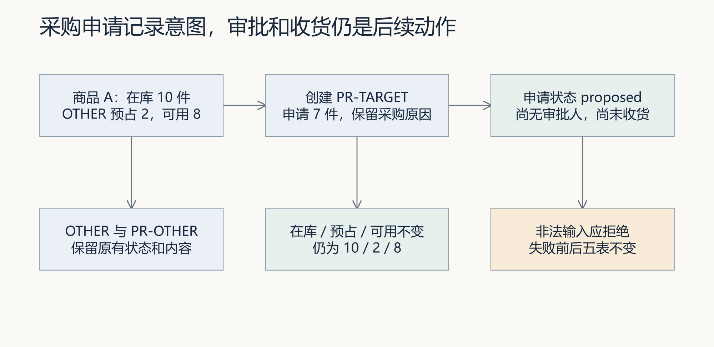

图 5｜先手算图中的库存不变条件，再对照实验报告。成功申请和收到货是两个不同的业务事实。

下面每条使用新报告路径；再次实验换目录，不覆盖旧报告。实验自动创建并清理临时数据库，不改个人产品候选。

```powershell
python -X utf8 docs/courses/L11/examples/purchase_request_lab.py normal --report-path .runtime/l11-purchase-01/normal.json
$LASTEXITCODE
python -X utf8 docs/courses/L11/examples/purchase_request_lab.py zero --report-path .runtime/l11-purchase-01/zero.json
$LASTEXITCODE
python -X utf8 docs/courses/L11/examples/purchase_request_lab.py negative --report-path .runtime/l11-purchase-01/negative.json
$LASTEXITCODE
python -X utf8 docs/courses/L11/examples/purchase_request_lab.py blank-reason --report-path .runtime/l11-purchase-01/blank-reason.json
$LASTEXITCODE
python -X utf8 docs/courses/L11/examples/purchase_request_lab.py unknown-sku --report-path .runtime/l11-purchase-01/unknown-sku.json
$LASTEXITCODE
python -X utf8 docs/courses/L11/examples/purchase_request_lab.py duplicate-id --report-path .runtime/l11-purchase-01/duplicate-id.json
$LASTEXITCODE
python -X utf8 docs/courses/L11/examples/purchase_request_lab.py premature-stock --report-path .runtime/l11-purchase-01/premature-stock.json
$LASTEXITCODE
```

每条之后立即记录退出码，PowerShell 用 `$LASTEXITCODE`，macOS/Linux 用 `$?`。前六条预期 0，premature-stock 预期 1。报告中的临时用例名是 `l11_teaching_purchase`，只在此实验进程注册，不是默认套件的永久新增项。

其中 `zero` 等五项是在检查“错误申请有没有被正确拒绝”，所以拒绝成功时测试通过、退出 0。最后的 `premature-stock` 故意制造提前入库，退出 1 才说明检查发现了问题；保留这份失败报告即可，不要为了把它变绿修改实验脚本。若最后一项退出 0，先核对是否选对模式，再检查报告实际运行了什么。

报告就在控制仓库的 `.runtime/l11-purchase-01/`。用编辑器打开对应 JSON，结合终端结果，将实际观察与退出码填入提交模板第 2 节；记录文字无法代替原报告。

normal 新增一张 proposed 申请，原因去掉首尾空白，编号可再次查询；库存仍为 10／2／8，OTHER 与 PR-OTHER 不变。五项失败检查比较采购申请、库存、库存流水、订单、订单明细五表；duplicate-id 的当前异常是 `sqlite3.IntegrityError`，不能把它描述为“幂等返回原成功结果”。

premature-stock 人为在申请后增加库存，证明独立业务预期能发现申请字段以外的错误。它没有证明个人候选存在这个缺陷，也没有调用 Codex 修复。自己的新增测试应加载实际候选的服务，并纳入统一验收。

## 4 固定候选与两份子任务合同

<!-- step-guide-4 -->
> **一句话说明：**创建一份只属于本次练习的隔离副本，并把“补测试”和“查风险”分别写成两张清楚的任务卡。

### 本步只做什么

```text
先观察“局部绿、完整红、修复后同版绿”
        ↓
提交本人的 L11 任务，取得 task.id 与 isolation.path
        ↓
固定两份子任务合同：甲补测试，乙只读查风险
        ↓
主 Agent 核对读写集和共享资源；通过后才进入真实并行
```

本步结束前必须能回答四个问题：候选在哪里？共同输入是哪一版？甲能写哪里？乙读哪些固定材料？其中任何一项不清楚，都不要进入第 5 步。

### 4.1 先观察一次“测试通过，业务仍有错误”

仍在控制仓库运行下面命令。它使用课程实验副本，还不是稍后要交给两个子代理的个人候选：

```bash
python -X utf8 docs/courses/L11/examples/integration_lab.py --run-dir .runtime/l11-integration-01
```

命令复制服务，教师脚本注入提前入库，再顺序运行三次检查并恢复；不启动原生子代理。每次重跑更换目录，不覆盖旧过程。包装程序预期退出 0，但内部三次检查的退出码依次为 0、1、0：原检查通过、补充业务检查失败、修复后的整合检查通过。

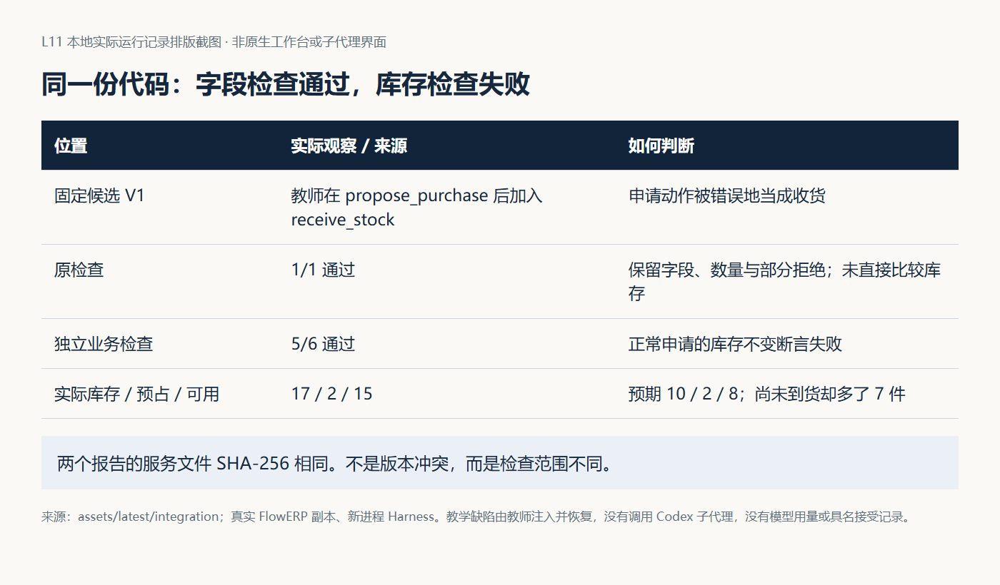

图 6｜先找两次 V1 的 `process.json`，比较服务指纹；再读检查内容。两份报告可以同时成立，不能把风险发现直接解释为“测试子代理出错”。

在 `02-complete-v1/states/normal.json` 对照库存与流水的 before／after。手写预期 10／2／8 与实际 17／2／15 的差异，指出哪一条新增动作使尚未到货商品进入库存。然后读 `restored.diff` 和 `03-integrated-v2/report.json`，确认实际修复以及七项检查通过。五种拒绝后的五表快照也要核对。

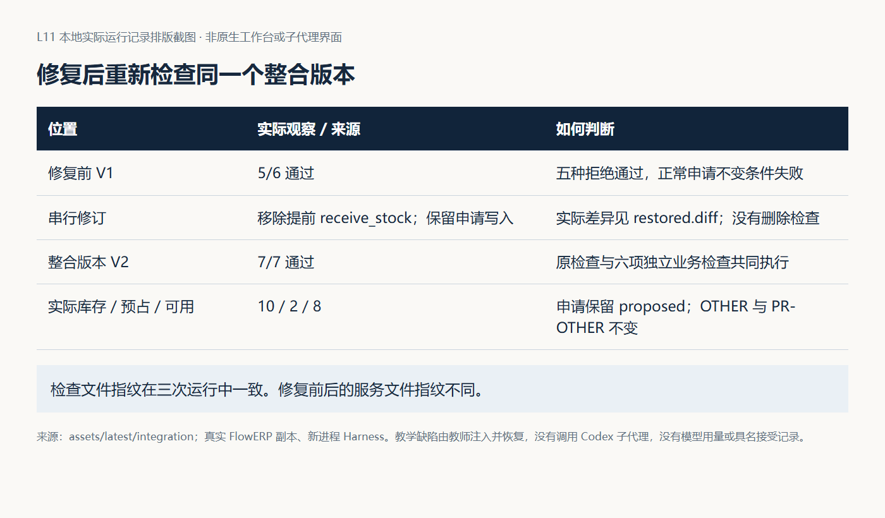

图 7｜服务版本变了，检查内容未变。先保存原始失败，再给修复后的 V2 新结论；不要把顺序复验截图写成真实子代理并行。

完成这个实验后，再进行以下本人建设与实际委派。实验给出“怎样回查”的支架，不替代子代理补测试与独立审查的产物。

### 4.2 通过工作台创建本人的交付任务

这一步会真实调用执行器，在本讲允许范围内修改隔离副本。先打开第 1 步生成的 Spec，核对采购申请与并行协作目标；再运行下面的提交命令。把姓名替换成自己的姓名；`.runtime/l04-learning` 沿用前讲工作台的运行目录，若你前讲使用了别的目录，这里也要换成那个目录。

```bash
python -X utf8 -m workbench.cli course-submit --lesson 11 --execute-code --actor "实际构建者姓名" --runtime-dir .runtime/l04-learning --execution-timeout 900
```

返回后按[提交结果与续做说明](../../reference/实操手册执行与排错.md#course-result)先保存退出码、任务编号和候选路径。退出 0 且状态为 `review` 才继续候选复验；非零先查原任务错误，不重复提交，不用控制仓库替代缺失候选。

这需要可用执行器与认证。记录实际任务编号和隔离候选路径，核对生成任务是否包含本次要求。课程提交命令本身不能证明已经启动原生子代理，协作需要下述显式委派与真实活动记录。

从输出抄下三个字段：`task.id` 是本次任务编号，`isolation.path` 是接下来实际工作的目录，`task.status` 是当前状态。将它们记入提交模板顶部。只有取得真实路径，才能安排后续工作；`review` 表示等待审核。

### 4.3 为两个子代理写清楚分工

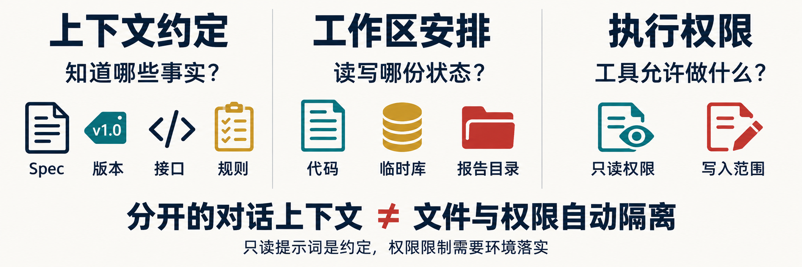

先看图中的三栏：两边要知道同一份 Spec、版本、接口和规则；运行数据与报告目录要分开；“只读”必须由实际文件权限和写入范围落实，不能只写在提示词里。

在第 5 步进入候选并启动 Codex 后，先发送[设计提示词](prompts/01-确定接口与读写集.md)的正文，并附上任务编号、候选绝对路径及确认后的 Spec。先让主 Agent 核对最小实现、给出以下两份任务说明，确认后再启动子代理。这里“固定输入”表示并行期间暂不修改双方要读取的代码，并保存当前版本和差异，方便核对。

| 要交代的内容 | 子代理甲：补测试 | 子代理乙：查风险 |
|---|---|---|
| 共同目标 | 保存采购申请，库存不变；非法输入拒绝后数据不变 | 同左 |
| 看哪些材料 | 固定业务代码、Spec、接口、既有测试约定 | 同一份业务代码、Spec、接口、指定调用方 |
| 可以修改哪里 | 确认后的独立测试文件，如 `tests/test_l11_purchase.py` | 不修改项目文件 |
| 交回什么 | 新增测试、修改差异、运行命令与结果 | 问题位置、触发条件、理由、待验证项 |
| 运行数据放哪里 | 独立临时数据库与报告目录 | 如需运行检查，也须独立临时目录 |
| 何时停下 | 需要改接口、超出范围或发现共享写入 | 同左；回报问题，由主 Agent 后续处理 |

把确认后的说明填入提交模板第 3 节。让主 Agent 按实际文件填写 `Subtask`，调用 `assert_parallel_safe` 检查，并返回原始输出；额外检查数据库、端口、报告和缓存是否共享。若检查拒绝，先调整范围或先后顺序，再检查。测试文件如果已存在且会被另一任务读取，须先调整安排。

填写两份合同：测试补全只写一个尚未被其他任务使用的测试文件；风险审查保持只读。它们读取相同固定实现。主 Agent 在并行期间负责观察任务状态、记录问题，不修改这两个任务正在读取的业务文件，也不读取一份尚在改写的测试文件并据此提前下结论。

合同写清目标、输入版本、接口、读写范围、运行副作用、输出、验收和停止条件。若风险审查要覆盖测试文件，必须等测试完成后再审，或仅审固定的既有测试，不能笼统声明“全部 tests/”后忽略读取冲突。

## 5 在 Codex 中执行真实并行

<!-- step-guide-5 -->
> **一句话说明：**现在才真正启动两个子 Agent：甲补测试，乙只读查风险；主 Agent 在旁边等待，不修改共同业务代码。

### 本步只做什么

```text
主 Agent：固定输入与任务合同，不改共同业务代码
          ├─ 子代理甲：只写指定测试文件 → 测试、命令、结果
          └─ 子代理乙：只读固定实现     → 风险、位置、依据
两者都完成 ─────────────────────────→ 主 Agent 收回原始产物
```

### 启动前四项检查

- 当前目录等于真实 `isolation.path`；
- `workbench`、`eval`、`flowerp` 都从该候选导入；
- 甲、乙引用同一输入版本，数据库与报告目录互相隔离；
- 主 Agent 承诺等待，不在并行期间修改共同业务实现。

只要有一项不成立，就停下修正，不要用“已经出现两个角色名”代替真实活动证据。

现在才切换目录。以下命令在当前 PowerShell 中输入：提示时粘贴第 4 步返回的 `isolation.path`，不用自己猜目录。先记住当前虚拟环境的 Python 路径，供后面复验使用。

```powershell
$l11Python = (Get-Command python).Source
$l11Candidate = (Read-Host '粘贴 isolation.path').Trim().Trim('"')
Set-Location -LiteralPath $l11Candidate
Get-Location
& $l11Python -X utf8 -c "import workbench,eval,flowerp; print(workbench.__file__); print(eval.__file__); print(flowerp.__file__)"
```

当前目录必须等于返回的候选路径，三个源码位置也应在该候选中。导入失败或指向参考仓库时，按[解释器与源码核对](../../reference/实操手册执行与排错.md)修正后再继续。候选里没有 `.venv` 时，可以使用刚才保存的控制环境解释器。

在这里启动已安装的 Codex CLI：

```bash
codex
```

进入 Codex 对话后，先完成第 4.3 节的任务说明，再将[并行提示词](prompts/02-并行测试与风险审查.md)正文复制到对话框，同时附上两份已确认的任务说明。也可使用下面这段入口提示；方括号内容要换成自己的真实值：

```text
本次候选绝对路径：[粘贴 isolation.path]
任务编号：[粘贴 task.id]
请依据我附上的两份任务说明，使用两个原生子代理并行工作。
甲只补指定测试；乙只读检查业务风险，不读取甲正在修改的测试。
你作为主 Agent，在两者工作期间不要修改它们依赖的业务代码。
等待两者完成，保留各自原始结果，逐条核对依据后串行整合。
若任务不独立或无法启动真实子代理，请报告具体原因。
下面是我确认的两份任务说明：
[粘贴提交模板第 3 节的完整内容]
```

在 Codex 对话中输入 `/agent` 查看子任务，不是在 PowerShell 中输入。此入口依据 [OpenAI 官方说明](https://learn.chatgpt.com/docs/agent-configuration/subagents)于 2026-09-19 核对；实际可用性以本机客户端为准。记录本机版本和实际入口。

保存子任务身份、开始结束时间、原始响应、命令和产物。界面出现两个角色名不足以证明原生并行，应能回查实际子任务活动及时间重叠。若客户端不支持、没有可用认证或无法取得活动记录，如实标明具体缺项，先保留已完成的本地实验。

把这些材料的实际位置填入提交模板第 4 节。离开本步前，应能分别打开甲的测试与运行结果、乙的原始风险说明，并看出两项工作的活动时间有重叠。主 Agent 口头说“已并行”还需对应这些记录。

发现接口变化、范围不足或共享状态冲突时，停止冲突部分，保留已产生文件和输出，重新划分。不要让两个任务同时修改同一文件来“演示冲突”。异常结束也不能被主摘要写成完成；应说明部分产物是否可接受，哪些仍需补做。

## 6 主 Agent 串行整合与复验

<!-- step-guide-6 -->
> **一句话说明：**两个子 Agent 完成后停止并行，由主 Agent 一个接一个地核对、修复和重新测试。

### 本步只做什么

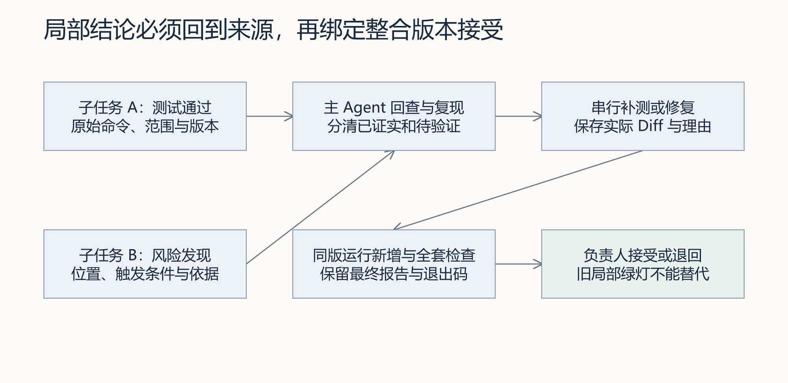

图 8｜两个局部结论先回到来源，再由主 Agent 串行补测或修复；最终接受只看同一整合版本的新增测试和全套检查。

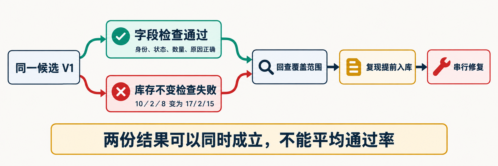

先不要争论“谁对谁错”。图中两个结果检查的范围不同，所以可以同时成立：字段检查通过，不代表库存不变也通过。主 Agent 要先复现两份结果，再决定补测试还是修业务。

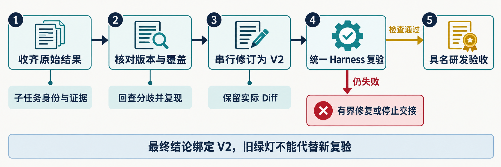

最终只认图中的完整链条：收齐原始结果 → 核对版本和覆盖范围 → 串行修订 → 统一复验 → 具名负责人决定接受或退回。

```text
子任务原始结果
    ↓ 回查命令、范围、输入版本
分成：已证实 / 待验证 / 需求未定
    ↓ 主 Agent 串行补测或修复
同一整合版本运行新增测试 + 指定 Eval + 全套阻断 Eval
    ↓
实际负责人：接受或退回
```

使用[汇总提示词](prompts/03-追溯结论与同版复验.md)，先核对两份结果属于哪个版本，再逐条回查发现。测试缺失、实现缺陷和需求未定要分别处理；需要修改接口时，由主 Agent 串行修改并更新受影响测试。

在整合候选中运行个人新增测试。例如实际文件为 `tests/test_l11_purchase.py` 时：

在另一个 PowerShell 中先重新激活第 1 步的控制仓库环境，再进入第 4 步返回的候选路径；或退出 Codex，回到刚才的终端。重新核对当前目录与源码位置，然后逐条执行：

```powershell
python -X utf8 -m unittest tests.test_l11_purchase -v
$LASTEXITCODE
python -X utf8 -m eval.harness --suite blocking --case purchase_request_preserves_reason --case write_sets_reject_conflict --report-path .runtime/l11-review-01/selected.json
$LASTEXITCODE
python -X utf8 -m eval.harness --suite blocking --report-path .runtime/l11-review-01/blocking.json
$LASTEXITCODE
```

第一条要求你已实际创建对应测试模块。运行前用 `Test-Path -LiteralPath tests/test_l11_purchase.py` 核对；若文件名不同，使用真实模块名。确认整合候选中包含测试补全者的文件和版本，再运行，不能在另一目录用旧测试代验。默认采购 Eval 和冲突 Eval 是课程入口；新增库存、流水、失败状态检查也必须实际执行，不能只检查默认绿灯。保存整合版本、命令、报告和退出码。运行全套阻断检查后，由实际负责人作接受或返工决定。

同伴复验请挑一条“测试通过”和一条“风险发现”，从主摘要回查子任务、文件和原始报告。再换一组库存与数量，先推导预期后复验。不能回查或结论超过覆盖范围时，补证据或缩小结论，而不是删除失败记录。

这三条都应退出 0，且第一条确实运行了新增测试。看到 `Ran 0 tests`、模块不存在或报告没有目标检查时，先修正测试入口。若有真实失败，把命令、退出码和失败报告交回同一主 Agent，限定范围修复后重新执行；复验使用新报告目录，如 `.runtime/l11-review-02/`。保留旧报告，把整合版本、最新结果和实际负责人的决定填入提交模板第 5 节。

## 7 复盘、挑战与 Skill 迁移

<!-- step-guide-7 -->
> **一句话说明：**最后用自己的实际记录回答：这次并行有没有帮助，下次哪些任务仍适合并行，哪些应该改成串行。

### 本步只做什么

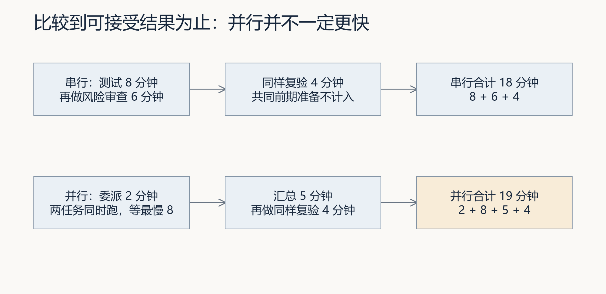

图 9｜比较必须算到可接受结果为止。委派、等待、汇总、返工和复验都属于并行成本；图中的分钟数只是教学算例，不是本次实测。

基础任务只要求保存真实协作证据并说明下次如何划分。单 Agent 耗时对照和 Token 对照属于挑战任务；没有真实测量就写“未测量”，不要估算效率提升。

基础提交保存个人判断、两份任务合同、冲突拒绝、真实子任务活动、原始结果、主 Agent 追溯与同版复验。单 Agent 对照属于挑战：对相同起点和范围运行一次单 Agent，再与并行的准备、执行、汇总、返工、复验总耗时及实际用量比较。没有真实用量就记缺失，不填估计值。

打开 [parallel-task-review Skill](skills/parallel-task-review/SKILL.md)，把其中的审查规则和反例逐个交给 Codex，记录实际回答：漏报读取、共享报告、不同版本局部通过、同版不同覆盖、顺序进程冒充并行。若回答漏掉问题，保留原回答，再修订自己的审查规则并重试。将改进后的规则保存到个人练习目录，记录文件位置。

接着换成自己项目中的“业务接口修改与页面实现”：先写哪些工作可同时做、哪些必须等接口确定，再请同伴指出隐藏依赖；保留初答、反馈和修订，填入提交模板第 6 节。完成后按[行动卡](行动卡.md)核对。第 7 节耗时与用量对照是挑战任务，可以明确标记未完成。

若进一步声称工作台已经形成跨事项闭环，还须保存来源事项、经验版本及有效状态、后续事项的召回与采用理由、流程版本、本次执行与 Eval、人审和复用失败的处置。真实需求仍从工作台首页“事项与决策”进入。当前[闭环建设规格](../../architecture/工作台范式与闭环建设.md)尚未完成实现，不能把手工登记或 Skill 格式通过写成已经自动贯通。

## 常见问题

先按下面的异常路线处理，再看详细表格：

```text
命令没有运行 → 查目录、解释器、导入路径
命令运行但结果不符 → 查模式、输入版本、报告内容
声明允许但实际覆盖 → 查漏报读取和共享数据库／报告／缓存
两个局部结果无法合并 → 查接口、版本、单位和隐含依赖
只有主摘要没有子任务记录 → 证据不足，如实标记缺项
```

| 现象 | 首先核对 | 下一步 |
|---|---|---|
| 测试文件不同仍被拒绝 | 是否读取另一任务正在改的实现 | 固定输入或调整顺序 |
| 声明通过，实际发生覆盖 | 是否漏报报告、缓存或写入 | 修正声明和实际执行边界 |
| 两份结果无法组合 | 输入版本、接口、单位是否一致 | 重跑受影响部分 |
| 子任务说全绿，整体失败 | 实际测试范围和整合后 Diff | 同版复现并定位交互 |
| 找不到子任务记录 | 本机能力、实际委派与活动入口 | 标明缺项，不用摘要充当记录 |
| 并行比串行更慢 | 启动、重复和汇总成本 | 依据任务规模决定下次安排 |

**交接时回到使用现场**：业务确认者核对申请与审批、入库的边界；主 Agent 整合后，同伴在同一候选复验，保留冲突、修订与实际人的决定。后续需求采用分工方法时重查读写依赖，记录来源版本、整合成本和实际冲突；未测量时不填写效率提升结论。沿用本讲已有证据位置，不另交重复表格。
