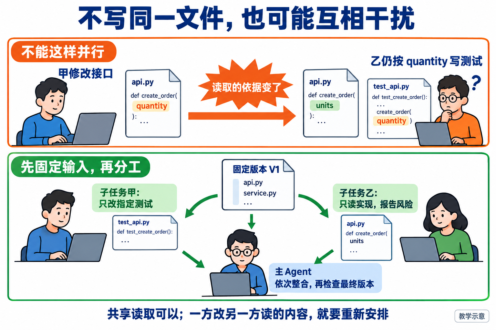
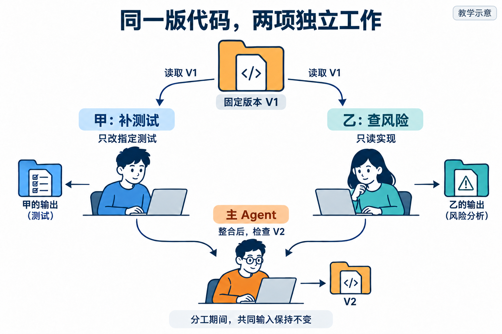
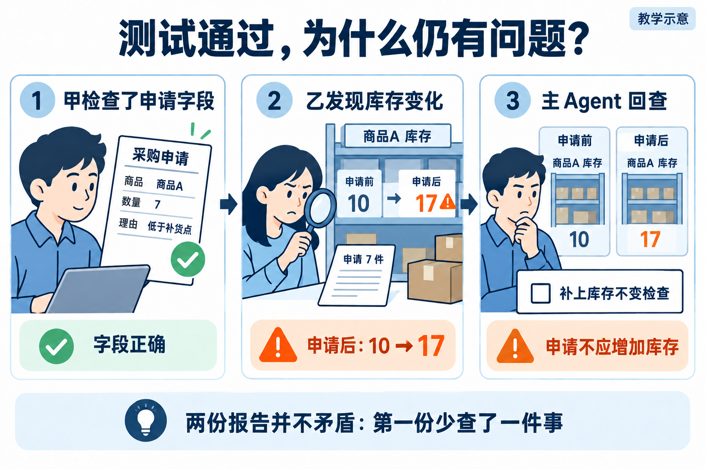

# L11｜用 Codex 原生 Subagents 并行处理独立任务

订单能够预占、发货之后，业务又提出补货需求。我们先在 FlowERP 中实现采购申请：把想买什么、买多少、为什么买保存下来；申请本身不增加库存，批准与实际收货留到下一讲。

本讲用一版待检查的采购申请实现作起点。假如接口尚未确定，就先由你与 Codex 把它确定下来，再分工。交付前有两件可以同时推进的事：补测试，以及只读审查实现风险。

L10 的多轮修复有先后依赖，下一轮必须等上一轮报告。**这里尝试并行的是互不改动对方依据的独立工作。** 主 Agent 负责整体交付，将清楚划界的任务委托给子 Agent（Subagents），收到结果后依次整合、复验，再交人决定。

## 1｜先让两位助手知道，我们共同要交付什么

商品 A 在库 10 件，已有订单 OTHER 预占 2 件，可用量为 8。业务人员决定补货 7 件，在申请 PR-TARGET 中填写理由“低于补货点”。本例检查决定能否正确保存；7 件是已经确认的输入，不是让程序从现有库存自动推导出的采购建议。

正确结果是多了一张待审批申请，库存仍为 10、预占仍为 2、可用仍为 8。申请只是提出“希望买”，货还没有到仓库，所以不能增加库存。

你把规则同时交给两位助手：申请要保存商品、数量和理由；数量为零或负数、理由全为空格、商品不存在时应拒绝；拒绝后不能留下申请或其他部分写入；已有申请不能被覆盖。

这时才有一个共同终点。测试助手负责把这些要求变成检查；风险助手沿实现寻找能破坏要求的路径。他们工作不同，但判断同一个产品结果。

## 2｜原本的分工为什么会打架

先排除一种还不能并行的安排：采购程序的调用方式尚未确定，甲继续修改接口，把表示数量的参数 quantity 改名为 units；乙却已经在另一文件里按旧参数 quantity 编写测试。两人虽没改同一文件，乙的测试已经跟不上甲的接口。

**图 11-1　一方修改接口时，另一方依据旧接口写测试会产生读写冲突**

*先看上排：冲突来自依据变化。下排再看修正办法：共同输入先固定，工作再分出去。*

这里需要两个很实用的词：**读集**是任务依赖的内容，**写集**是任务会修改的内容。判断能否同时做，就问：两人会不会写同一处？一人会不会改变另一人正在依赖的内容？

答案若是会，就先调整先后顺序。我们把修改接口的工作提前完成，固定为代码版本 V1，再重新分工：甲只补指定测试，乙只读实现。两人各有自己的输出目录和临时数据库，主 Agent 暂时也不改他们正在依赖的实现。

“固定 V1”要能找到实际提交，或记录文件内容的校验值，以便确认文件有没有改变。若还有未提交修改，也要记入这次起点，或另存一份明确的副本。否则提示词里都写 V1，两人实际读到的仍可能不同。

安排调整好之后，才真正启动子任务。

## 3｜怎样把工作交出去，才能接得回来

**图 11-2　两个子任务读取固定 V1，分别补测试与审查风险，返回后由主 Agent 整合并检查 V2**

*从顶端同一份 V1 顺着两条支路往下读，最后在主 Agent 处汇合。分出去的是工作，汇合的是可追溯的结果。*

给甲的委托可以这样写：

> 读取已固定的采购规则、V1 的实现和已有测试。只修改指定采购测试文件，使用自己的临时数据库和报告目录。
>
> 覆盖正常申请、非法输入拒绝，以及申请前后库存和其他单据保持不变。交回测试差异、实际命令、结果与未覆盖内容。若需要改实现，先返回说明。

给乙的委托则是：

> 读取同一规则与 V1 的实现、存储逻辑，不改项目代码。检查哪些路径可能提前入库、覆盖旧申请或留下部分写入。
>
> 每项发现给出位置、触发输入、预期与实际依据；尚未复现的标为待核实。报告写入独立路径，不读取甲尚在修改的测试作为稳定依据。

实际执行前，再填入这版代码所在的目录、允许读取和修改的文件、Python 命令与报告位置。两位助手拿到这些信息，才能在约定位置工作，并交回能核查的结果。

实际执行时，要能查到两个子 Agent 各自接到了什么任务、做了什么、返回了什么。同一条回答里写两段“专家认为”，不能代替这个过程。即便两位助手各自处理自己的任务材料，也可能访问同一工作区，所以仍要核对实际改动。

## 4｜一个说通过，一个说有问题，听谁的

甲实际交回的测试只覆盖了申请字段和理由，并报告：“这些测试全部通过。”乙说：“创建申请时，代码似乎还调用了入库。”

你不需要在两位助手之间投票。先确认它们看的都是 V1，再看甲到底检查了什么，并按乙给出的条件复现。

**图 11-3　甲验证字段正确，乙发现申请后库存从 10 变为 17，主 Agent 补查库存不变**

*左边的绿灯只覆盖字段；中间的橙色告警指向库存。两者一起看，才发现缺了一项检查。*

假设实际观察是：申请创建前库存 10，创建后变成 17。这说明产品确实提前入库。甲报告的局部结果可以成立，但它漏做了委托中要求的库存检查，任务还没有完成。乙的发现则补出了这个缺口。

主 Agent 接下来应做两件相连的事：确认修复范围，移除错误的提前入库行为；补上申请前后库存、预占与库存变动记录（流水）不变的检查。非法输入的失败路径则还要确认没有任何部分写入。仅仅“抛出了异常”，不能证明此前没写过数据库。

整合形成 V2 后，重新运行新增检查和既有相关检查，再按原验收要求交人接受。V1 的绿报告不替 V2 作证明；乙指出的风险，也要由复验结果确认关闭。

工作台保留两份原始结果、主 Agent 如何核实分歧、实际修改和最终报告。这样接手者能顺着结论找到依据，而不是只得到一篇拼接得很顺的摘要。

## 5｜这次并行究竟值不值得

假设补测试需要 12 分钟，风险审查需要 8 分钟，整合与复验合计需要 5 分钟。串行需要 25 分钟；并行若多花 3 分钟拆任务，约需 `3 + 12 + 5 = 20` 分钟，预计节省 5 分钟。

这是估算，不是实测。如果因输入变动又返工 7 分钟，并行反而更慢。它缩短的是从开始到完成的总历时，因为两项独立工作可以同时进行，不会自动减少工作总量；主任务与子任务处理输入输出的用量（Token）也都要计入。

因此，输入稳定、能独立完成的测试补全与只读审查值得尝试并行；两个任务都在修改同一接口时，先串行更容易控制。选择依据应是本次依赖与成本，而不是固定“每次开两个 Agent”。

现在按[实践操作手册](实践操作手册.md)第 1～3 步准备并观察采购行为，第 4 步固定候选和委托，第 5 步执行真实子任务，第 6 步整合复验，第 7 步复盘。手册中检查任务分工的程序，只能根据你填写的读写范围判断冲突，不会启动 Agent；依赖漏填了，它也可能漏判。另一个人为加入缺陷的参考实验用于练习核对报告，不能代替你实际完成两次委托。

将首次分工、被反例推翻后的调整、两个子任务记录、主 Agent 的最终判断与同伴反馈写进[提交模板](SUBMISSION.md)。做一次迁移：甲改导出字段、乙更新报表时是否能并行？先约定并固定导出的字段名、含义和格式，再安排报表开发，并说明乙为什么现在可以依赖这些字段。

**本讲要学会的能力：判断任务是否独立，明确委托，核实各方结果，并完成最终整合。**

需要填写具体路径、检查读写冲突或运行分工实验时，查[实现细节与扩展阅读](实现细节与扩展阅读.md)；完整案例见[参考详解](参考详解.md)。

## 本讲留下什么，下一讲怎样接着用

本讲交出采购申请与可追溯的分工结果，库存不因申请而增加。下一讲增加批准与收货；软件交付过程也需要在等人、打回和重启时记住当前对象，因此用状态图明确这些去向。

[课程蓝图与学习路线](../课程蓝图.md#l01l12-的连续学习路线) · [实践操作手册](实践操作手册.md) · [上一讲](../L10/辅导资料.md) · [下一讲](../L12/辅导资料.md)

## 课程大纲中的本讲要求

- **核心内容**：可并行任务识别、上下文隔离、结果汇总、冲突风险与额外 Token 成本。
- **演示结果**：测试补全与风险审查并行执行，由主 Agent 汇总结论。
- **课内增量**：为两个无文件写入冲突的任务定义清晰输入、输出和验收标准。
- **通过标准**：子任务边界清晰；主 Agent 能追溯每个结论；有写入冲突的任务不强行并行。

配图为教学示意；来源与提示词：[新增案例图](assets/reading-story-20260926/生成说明.md)。
