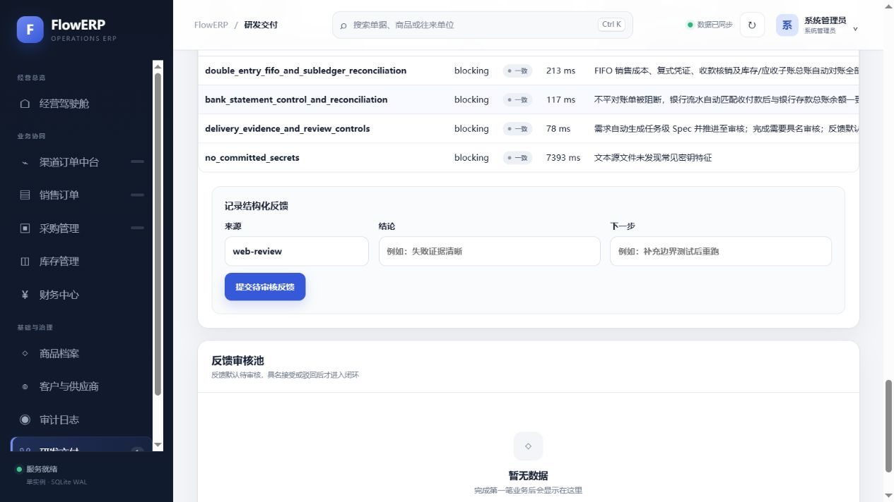
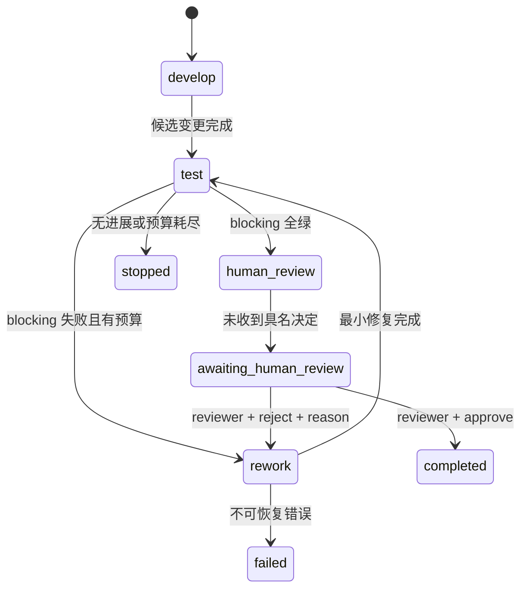
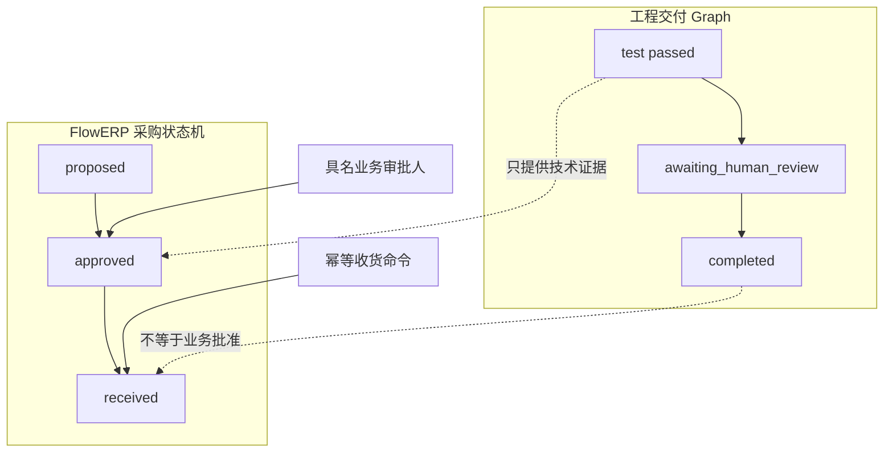
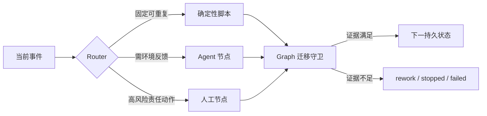
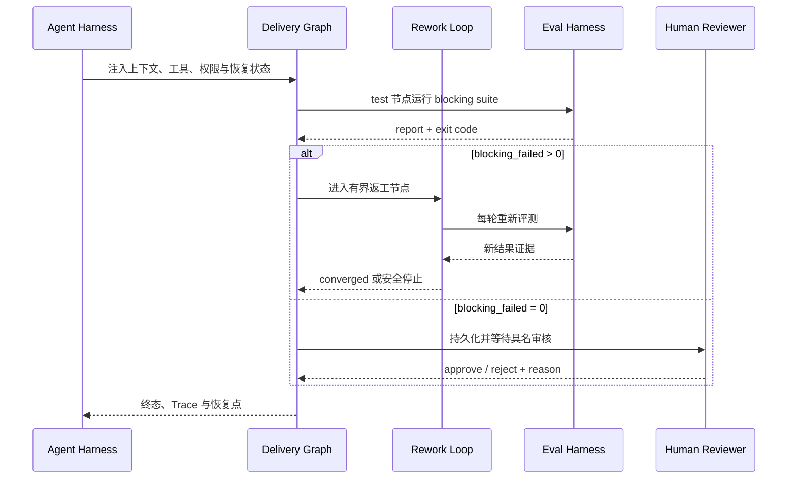
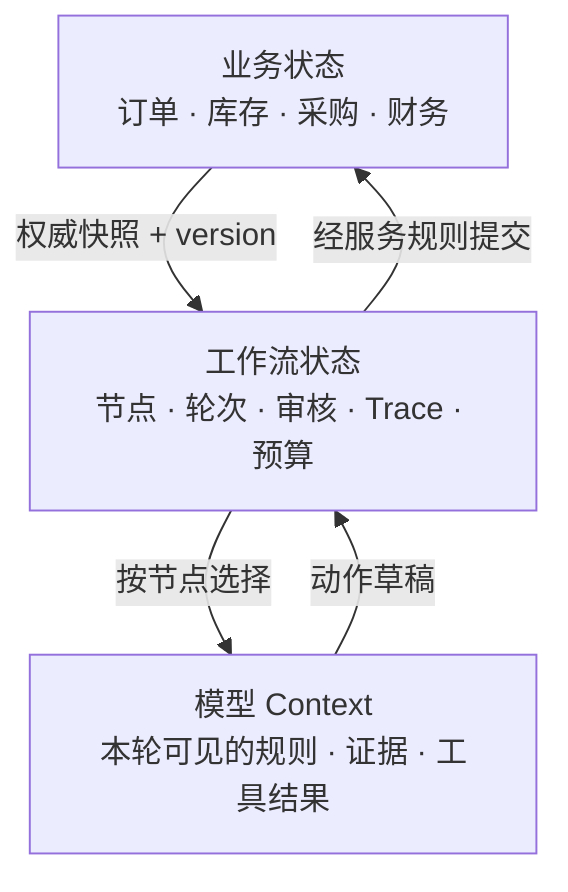
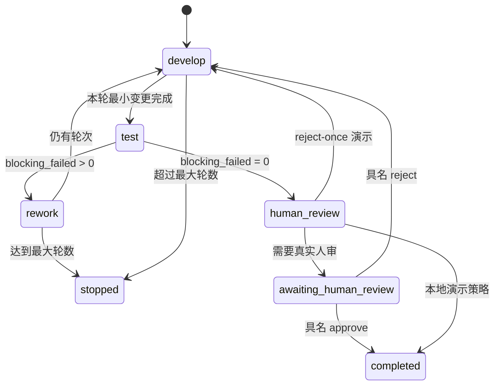
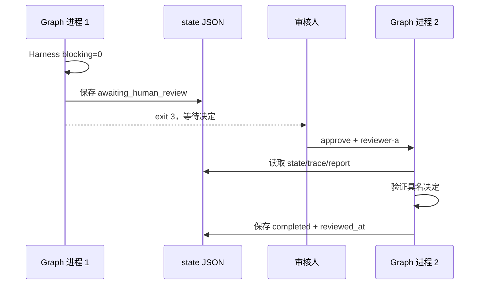

# L12｜用 Graph 显式表达状态、回退和人工审核

<details>
<summary>本讲课程合同与建设状态（教师/助教）</summary>

- **核心内容**：共享状态、条件分支、审核打回、异常路径和人工介入；原生 Subagents 与外部编排框架的边界。
- **演示结果**：开发 → 测试 → 审核；审核失败回到开发，关键决策等待人工确认。
- **课内增量**：用最小 Python 状态图实现移交、回退、状态保存和审核结论。
- **验收命令**：`python -X utf8 -m agent.graph --max-rounds 3`
- **通过标准**：状态变化可追踪；审核结果来自 Eval；循环有上限；异常不会被静默忽略。
- **挑战任务**：用 LangGraph 替换最小状态图，同时保持相同输入、输出与验收命令。

> 课程建设状态说明：本讲最小状态图、持久化样例、活动和评价规则属于已经形成的课程设计；学生边守卫、Trace、人审恢复和达成数据属于待真实开课采集。参考 Graph 能运行或流程图完整不能替代学生证明非法迁移、匿名审核和异常路径受到控制。

> **基础线唯一性**：本讲交付“采购申请经具名审批后才能入库”，并用 Graph 表达交付阶段的暂停、打回与恢复；业务审批状态机和工程审核 Graph 必须分离。

</details>

## 连续案例｜第三幕：流程通过了，采购却仍然不能入库

**时间**：第三周周三 14:00　**地点**：采购审批会

采购申请已经通过 Spec、实现和 Eval，工程 Graph 走到 `review_approved`。陈予据此准备收货入库，系统却拒绝了操作：业务采购单仍然没有具名审批。周岚困惑地问：“不是已经人工审核过了吗？”

林默在投影上画出两条看似相同的状态线。一条描述工程交付：任务何时评测、打回、恢复、等待人审；另一条描述 FlowERP 采购：谁提出申请、谁批准资金、谁确认收货。前者的审核者检查代码与证据，后者的审批者承担资金和库存责任。

如果把两个状态机合并，工程评审者会意外获得采购授权；如果完全割裂，又可能出现页面显示“可入库”而业务服务仍拒绝。Graph 必须明确暂停点、检查点和恢复输入，但不能替任何人签字。

唐禾要求现场演示三条路径：未审批直接入库必须失败；审批人和申请人相同必须失败；具名审批后入库成功，并能从业务账和 Graph Trace 分别追溯。

> **决策时刻**：请先画出两条状态线，并指出每个具名决定由谁承担。构造“工程审核通过、业务审批缺失”的反例；系统必须诚实停下，而不是让相似的状态名称掩盖授权缺口。

第三周结束时，工作台已经能暂停、打回和恢复，FlowERP 也守住了采购审批。但这些状态仍困在本地进程和页面里。客户、渠道和其他团队需要一个可持久查询的任务入口，第四周将从一次误读 `202 Accepted` 开始。

## 图文学习导航

### 先进入现场：系统可以暂停，但谁有权让采购真正入库



*观察重点：工程交付 Graph 的暂停/恢复与 FlowERP 采购审批是两个状态机。前者组织执行过程，后者承担业务授权；二者都要记录身份、原因、前态和后态。*

**先别看答案**：画两条互不混淆的状态线，并尝试构造“工程审核通过但采购未审批”的场景。系统必须拒绝入库，且不能用 Graph 节点名称掩盖业务授权缺失。

本讲按“双状态机 → 非法迁移 → 暂停与打回 → 具名恢复 → ERP 对账”学习。[LangGraph Human-in-the-loop](https://langchain-ai.github.io/langgraph/how-tos/human_in_the_loop/breakpoints/) 只用于理解检查点与恢复语义，[Codex Security](https://developers.openai.com/codex/security) 用于核对人审与权限边界；基础线仍实现本仓库的最小 Python 状态图。

## 学员正文｜质量可以自动判定，责任不能自动生成

采购申请的 Eval 全绿，Agent 也报告开发完成。陈予准备执行入库，唐禾却问：“谁批准了这笔采购？”事件记录里只有 `approved=true`，没有审核人、决定时间、证据版本和打回理由。流程走到了终点，责任链却从未开始。

一串嵌套 `if` 可以让演示通过，却无法回答崩溃恢复、重复审核和非法跳转。Graph 的用途不是把简单流程画复杂，而是显式表达状态、边、守卫和回退。这里必须分开三类事实：工作台处于 develop/evaluate/review；FlowERP 采购处于 draft/approved/received；Harness 报告具有独立身份和结论。任何一个绿色都不能替代另外两个。

先运行打回路径，再运行可暂停的人审路径：

```powershell
.\.venv\Scripts\python.exe -X utf8 -m agent.graph --max-rounds 3 --reject-once
.\.venv\Scripts\python.exe -X utf8 -m agent.graph --require-human-review --state-file .runtime/delivery-review.json
```

系统停在 review 后，关闭进程并重新启动。用具名审核者恢复：

```powershell
.\.venv\Scripts\python.exe -X utf8 -m agent.graph --state-file .runtime/delivery-review.json --review-decision approve --reviewer reviewer-a
```

### 把关键代码读懂｜全绿为什么仍然只进入人审

```python
if review_decision and not reviewer.strip():
    raise ValueError("提交人工审核决定时必须记录审核人")
if state.report["summary"]["blocking_failed"]:
    state.move("rework", "阻断级 Eval 失败")
else:
    state.move("human_review", "阻断项为零，进入人工决策点")
```

- 第一条守卫拒绝匿名决定，避免把责任压缩成一个布尔值。
- 有阻断失败时只能回到 `rework`，不能进入任何批准分支。
- 阻断数为零只证明质量门通过，所以状态移动到 `human_review`，而不是 `completed`。
- 业务采购审批仍由 FlowERP 自己的状态机负责；工程 Graph 的审核人不会因此获得采购权限。

行动课必须同时跑四条路径：证据不合格回到 develop；匿名审批被拒绝；具名批准后采购才允许入库；进程崩溃后恢复到同一审核对象。每条边都写守卫：谁可触发、消费哪个版本、失败后回到哪里、是否幂等。Graph Trace 只保存状态迁移证据，不把聊天全文当审计记录。

**看似合理的错误路线**是让模型在质量全绿后自动填写审核人，或用服务账号统一写 `system-approved`。这会把职责分离变成字符串装饰。模型可以准备材料、指出风险，不能承担采购批准责任；具名人审必须真实暂停流程，并且审核人不能与申请人混同。

**第二次签字**：这笔采购现在能否入库？请分别引用 Harness 报告、Graph 当前状态、具名审核决定和 ERP 采购状态。缺少其中任一项，都应明确停在哪个节点，而不是补写一个布尔值。

Graph 已经能暂停与恢复，但仍只能由本地进程理解。跨团队协作需要稳定 Task ID、状态事件和重启后的查询能力。下一讲把执行链封装为任务资源，同时守住 `202` 只代表“已接收”的语义。

<details>
<summary>附录：课程合同、教师活动、技术参考与证据模板</summary>

<details>
<summary>教师备课区：课程目标、评价与持续改进</summary>

## 三载体课堂交接

- **PPT 引导决策**：使用 [PPT 逐讲决策脚本](./PPT逐讲决策脚本.md) 的“L12”四个镜头；在学生提交第一次选择、依据和最大风险前，不揭示后果页。
- **Markdown 承载教材**：本讲连续案例、图文导航与学员正文/核心章节负责查证和建模；学生必须保留第一次判断与证据驱动的第二次签字。
- **VS Code 完成行动**：打开 [课程工作区](../../course/FlowERP-AI研发工作台.code-workspace)，先运行“查看本讲合同”，再按 [L12 行动卡](../../course/tasks/L12-Graph与人工审核.md) 构造失败、完成受控修改并复验。
- **回收证据**：命令、输入、退出码、报告 ID、权威状态、Diff 和剩余风险回写本讲提交包；只交投票、代码或绿色截图均退回。

> 载体顺序固定为：PPT 第一次签字 → Markdown 查证 → VS Code 行动 → Markdown 第二次签字。完整规则见 [三载体课程实施方案](./三载体课程实施方案.md)。

## 国家级一流本科课程教学设计卡

| 维度 | 本讲设计 |
|---|---|
| 对应课程目标 | CLO-5：设计可追踪、可回退、可暂停并保留具名人审的状态图 |
| 工作台主线增量 | 增加显式 Graph、状态保存、审核打回、异常路径和跨进程恢复 |
| FlowERP 的作用 | 交付采购申请—具名审批—审批后入库，并与交付 Graph 分离 |
| 高阶性 | 将隐式协作抽象为状态、边和守卫，评价异常、拒绝、恢复与重复审核语义 |
| 创新性 | 用最小 Python 状态图先理解编排本质，再以相同合同评价外部框架替换 |
| 挑战度 | 匿名、重复和非法迁移必须被阻断；进程退出后仍能从持久状态恢复 |
| 学生中心活动 | 学生先为边写判决规则，再进行状态机审判、故障注入和具名恢复 |
| 课程思政融入 | 关键决策保留人类责任主体和审计记录，防止以自动化之名消解责任 |
| 形成性评价 | 状态图 + 守卫表 + Graph Trace + 具名审核 + 异常恢复记录 |
| 持续改进数据 | 统计非法迁移识别率、匿名审核阻断率和恢复失败点，优化状态案例 |

</details>

<details>
<summary>课程合同、边界与前沿校准</summary>

## 本讲知识合同

| 合同项 | 本讲约定 |
|---|---|
| 主线起点 | L11 的并行结果仍依附一次会话，跨阶段回退和人工决定没有持久共同状态 |
| 唯一技术命题 | 如何用显式状态、守卫、checkpoint 和具名决定表达可恢复工作流 |
| 必须掌握 | 状态/边/守卫；Router 与 Graph；真实暂停；一次性具名审核；Agent Graph 与 ERP 状态机分离 |
| 能力判据 | 能复现打回、跨进程暂停恢复、匿名/重复审核失败和最大轮数终止，并逐边解释合法性 |
| 本讲不做 | 不用聊天记录充当 checkpoint，不自动越过人审，不把采购审批与代码审核合成一个状态机，不封装 HTTP |

## 大纲锚点与前沿校准（2026-08-19）

- **大纲锚点**：用最小 Python 状态图实现移交、回退、状态保存和审核结论，并保留相同验收命令。
- **前沿采用**：采用显式状态/边/守卫、durable checkpoint、安全重放和具名 HITL；框架替换只属挑战线。
- **不越界**：不让模型自批，不把 Agent Graph、订单状态机和采购审批状态机混成一张图，也不在本讲封装 HTTP。
- **链路交接**：向 L13 交付可恢复但仍只由本地进程操作的交付状态。详见[校准矩阵](./16讲主线与前沿校准矩阵.md)。

**主线坐标**：Loop 只知道一个目标是否继续返工，Graph 要接管跨阶段控制：开发、评测、返工、等待人审、完成与安全停止。业务账中的采购审批也在此重新出现，提醒学员工程审核与业务批准是两张不同的状态机。

**这一讲把系统推进到哪里**：FlowERP 的采购审批不会被“代码全绿”偷换；工作台获得持久化状态、守卫、回退和具名人审；匿名审批失败、合法审核迁移和完整 Trace 构成本讲证据。Graph 的核心价值不是画图，而是把原本藏在一串 `if` 里的权力与责任变成可检查的状态迁移。

### 产品化思考检查点 3：Graph 首先是风险路由，不是流程越长越专业

学生先把三个任务分别路由到不同路径，再画状态图：

| 路径 | 典型任务 | 必需控制 |
|---|---|---|
| 快速路径 | 已复现小 Bug、低风险可逆改动 | Work Item、自动检查、同行 Review |
| 标准路径 | 普通功能、API、可回滚 Schema 变化 | 决策简报、交付合同、分层验证、灰度 |
| 严格路径 | 库存、资金、权限、不可逆迁移 | PRD/RFC、影响分析、职责分离、独立验证、恢复演练 |

Graph 必须允许按风险跳过不适用状态，也必须允许回到需求补证、方案修订、返工、停止和结果复查。学生为每条跳过边写 `risk_level、guard、evidence、owner`；如果第二个低风险流程用简单状态足够，拒绝引入 Graph 并给出理由同样是正确设计。八道质量门是后台条件化政策，不是要求所有用户每次手工盖八个章。

</details>

## 本讲行动工单：让每条边在崩溃、越权和重复请求下接受审判

学员先为交付 Graph 和采购审批分别写状态、边与守卫表，再实现最小 Python Graph 与持久 checkpoint，并通过它交付采购申请—人工审批—审批后入库。必须运行批准、打回、匿名、重复、非法边、最大轮数和崩溃恢复路径；进入 `awaiting_human_review` 后由另一人跨进程具名恢复。

- **工作台增量**：显式 Graph、边守卫、checkpoint、Trace、回退与具名 HITL；
- **FlowERP 产品状态**：完成采购审批与审批后入库；模型不得代替审批人，匿名、重复或非法审批必须保持库存不变；
- **失败证据**：匿名、重复、非法或崩溃路径保持合法状态且可追溯；
- **迁移证据**：为第二流程判断是否值得用 Graph，拒绝过度设计同样可达成；
- **讲师硬门槛**：审核者必须换人/换进程，作者在同一会话自批不能评分。

详见[可执行任务卡](../../course/tasks/L12-Graph与人工审核.md)。

<details>
<summary>教师备课区：教学活动与达成度设计</summary>

## 本讲教学设计总览

| 项目 | 设计 |
|---|---|
| 建议学时 | 30 分钟线上精讲 + 70 分钟线下行动 + 45 分钟状态机评审 |
| 课堂类型 | **状态机审判**：每条边必须提交守卫、动作、证据、失败和责任人 |
| 核心问题 | 怎样让跨阶段流程可以暂停、回退、恢复和具名审核，而不把质量绿灯偷换成业务批准？ |
| 教学重点 | 有限状态、守卫、持久化、Trace、具名恢复、两张状态机分离 |
| 教学难点 | 区分 Agent State、业务状态和对话上下文；验证崩溃恢复后的单次迁移 |
| 课堂产出 | 边守卫表 + 三条 Graph Trace + 人审材料包 |
| 价值塑造 | 权力必须有身份、边界和记录；自动化不能匿名越过高风险决定 |

### 可测学习成果

| 编号 | 学习者能够 | 达成证据 | 达成标准 |
|---|---|---|---|
| L12-O1 | 将业务状态、工程编排状态和聊天上下文正确分层 | 状态归属题 | 10 个对象至少 9 个正确 |
| L12-O2 | 为每条 Graph 边写 source、target、guard、action、evidence、failure | 边守卫表 | 所有完成/回退边可判定 |
| L12-O3 | 复现批准、打回、匿名失败和最大轮数停止路径 | Trace 集 | 非法边无状态污染 |
| L12-O4 | 在进程退出后凭 run ID 和具名身份恢复 | 恢复记录 | 重启后历史连续且决定只生效一次 |

### 30 分钟线上精讲 + 70 分钟线下行动

| 场域与时间 | 学习活动 | 学生当场证据 |
|---|---|---|
| 线上 0–8 分钟 | 面对“质量全绿，自动批准采购吗”先作法庭表决 | AI 介入前责任判断 |
| 线上 8–20 分钟 | 区分业务状态、Task 状态、Graph 状态与聊天上下文 | 状态归属卡 |
| 线上 20–30 分钟 | 示范节点、边、守卫、持久化暂停和具名审核 | 边守卫草图与非法边预测 |
| 线下 0–18 分钟 | 为关键边补齐前置、动作、证据、失败、责任人和幂等字段 | 边守卫表 |
| 线下 18–34 分钟 | 运行全绿后停在人审，再跨进程具名批准 | Trace A 与 checkpoint |
| 线下 34–50 分钟 | 运行打回、匿名/重复审核，验证非法请求状态不变 | Trace B 与拒绝证据 |
| 线下 50–70 分钟 | 运行最大轮数、异常和崩溃恢复，同伴逐边审判 | Trace C、人审材料包与离场票 |

### 达成度与持续改进

采集状态归属正确率、非法迁移阻断率、匿名审核阻断率、重启恢复成功率和 Trace 完整率。匿名审核与非法边阻断必须为 100%；若超过 15% 学员把采购状态和工程审核状态合并，则增加双状态机对照；恢复成功但 Trace 断裂仍判未达成。

</details>

## 本讲现场｜质量全绿，为什么仍不能自动入库

12 台补货已经通过技术检查：采购单存在、幂等键唯一、库存不会为负。可业务规则仍要求采购负责人具名审批。在普通脚本里，“等待人审”常被写成一个日志提示，进程随即继续；在真正的 Graph 中，它必须是可持久化状态 `awaiting_human_review`。进程可以退出，明天由另一进程凭同一个 run ID 恢复。

真实采购页同时存在草稿、待审批和待收货；“代码通过审核”不会把待审批采购变成待收货。Graph 可以暂停并向有权限的人展示证据，但最终迁移必须由采购状态机在服务端执行。


采购状态机与交付 Graph 使用同一条设计原则：技术条件满足只允许进入“等待决定”，不会自动替人做决定。页面上的“待审核、接受、打回”正是 Graph 边的可操作投影，不是装饰按钮。



课堂审判题是：如果状态文件写着 `completed`，但没有 `reviewer`、`reviewed_at` 和决定理由，这次完成是否合法？答案是否定的。状态名只是结论，迁移证据才证明结论合法。我们会逐条审查每条边的守卫条件，并故意让匿名 approve 被拒绝。

## Graph 是两张状态机不能再被一串 `if` 混在一起后长出来的

此刻系统同时存在两种“等待审批”：工程交付等待代码审核，采购单等待业务审批。它们可以在同一页面出现，也可以由同一个人承担角色，但法律含义、权限和副作用完全不同。工作台 Graph 只能编排“下一步由谁处理”，不能直接替 FlowERP 业务状态机执行收货。

| 状态系统 | 典型状态 | 守卫证据 | 允许产生的副作用 |
|---|---|---|---|
| Delivery Graph | `test → awaiting_human_review → completed` | Harness 全绿、具名 reviewer、审核理由 | 交付任务状态与 Trace |
| Purchase State Machine | `proposed → approved → partially_received / received` | 有采购权限的身份、版本、审批记录、幂等入库键 | 采购状态、库存批次、库存流水 |
| Sales State Machine | `draft → confirmed → reserved → shipped` | 信用、库存、合法迁移、发货身份 | 预占、出库、应收与回传 |



禁止边必须明写：`test passed → received` 不存在；`delivery completed → purchase approved` 也不存在。Graph 可以在技术审核通过后生成“请采购负责人处理”的待办并暂停，但采购服务仍要重新检查身份、当前版本和合法迁移。这样，即使 Graph 状态文件被错误改成 `completed`，数据库的业务守卫仍不会允许匿名入库。

这一步让工作台从“循环执行一个目标”演化成“保存跨阶段控制权”。它第一次具备了暂停一天、跨进程恢复、被具名打回以及从证据继续的能力，同时保持工程状态和 ERP 业务状态的隔离。

## 为什么复杂 Agent 流程必须有显式状态

当系统同时包含 Harness、Loop 和 Subagents，仅看终端滚动很难回答：现在在第几轮；上一次为什么返工；质量是否已经通过；是否正在等人；谁批准；进程重启后从哪里继续。没有状态机，流程可能在运行，却没人能证明它合法。

Graph 不等于画一张流程图。真正的 Graph 有有限状态集合、合法迁移、边的条件与原因、共享状态、终态、循环上限和持久化。FlowERP 的最小实现用标准库 dataclass 与 JSON 文件表达这些合同。

Graph 也不是“更高级的 Loop”。Loop 管一个目标上的重复工作与停止；Graph 管此刻允许哪个组件运行。`rework → test` 这条边可以调用 Loop，`human_review` 节点可以等待人，`test` 节点可以调用确定性 Eval Harness。整张 Graph 则始终运行在提供工具、权限、状态和日志的 Agent Harness 内。

### Router 决定下一跳，Graph 证明这一步合法

Router 和 Graph 都会回答“下一步去哪”，但层次不同。Router 是一次局部选择：根据任务类型、风险、工具可用性或当前结果，把请求分到脚本、Agent、人工或某个专业节点；Graph 是持久控制结构：它记录当前状态、合法边、守卫、重试上限和恢复点。Router 可以是一个纯函数，Graph 必须能在进程重启后继续证明路径。



FlowERP 可把路由规则写成可测试的决策表：

| 输入事实 | Router 选择 | Graph 守卫 | 为什么不是别的路径 |
|---|---|---|---|
| 每日 02:00 导出库存，步骤固定 | script | 导出文件校验通过 | 不需要模型 |
| blocking Eval 失败且存在可写 Scope | repair agent | 预算、权限、报告仍新鲜 | 需要根据工具结果调整 |
| blocking 全绿但任务未审核 | human review | reviewer 非空、证据属于当前版本 | 模型不能自批 |
| 采购建议待审批 | purchase approver | 角色、四眼、对象版本 | Delivery Graph 无权批准业务单据 |
| MCP 渠道服务不可用 | stopped / manual | 记录连接错误与未执行副作用 | 不能把空结果当“无订单” |

一个危险实现是让模型自由生成节点名，例如返回 `"next": "completed"`，然后系统直接跳转。正确实现是模型最多给出路由建议，运行时只接受枚举值，并由确定性守卫检查当前状态、报告版本、权限和审核身份。**路由可以智能，迁移必须可判定。**



这张工作方式图同时暴露三条控制线：模型不能直接宣布 `completed`，Loop 的收敛只把控制权还给 Graph，人审消费的必须是当前候选的报告。任何组件都不能靠一句自然语言跨越另一组件的 Gate。

## Agent State 不是聊天记录：三类状态必须分开

“Agent 知道什么”不能只靠一段不断增长的对话回答。FlowERP 把运行中的事实分成三层，每层有不同的权威来源、保留时间和写入权限：



| 层次 | 权威载体 | 能回答什么 | 不能被什么替代 |
|---|---|---|---|
| 业务状态 | FlowERP SQLite 与领域服务 | 库存是否预占、采购是否批准、订单能否发货 | 模型摘要、页面缓存 |
| 工作流状态 | `DeliveryState`、任务事件和 Trace | 当前节点、轮次、预算、审核者、为何迁移 | 终端最后一行、聊天历史 |
| 本轮 Context | 从规则、Spec、报告和状态中选择的输入 | 模型此刻能基于哪些事实做判断 | 全量 State 的永久副本 |

这一区分直接决定恢复策略。进程重启后，应从持久化工作流状态恢复位置，再读取最新业务状态校验动作是否已经生效，最后为当前节点重建 Context；不能简单把旧对话重新发送一遍。Context 可以被压缩或丢弃，关键业务事实和迁移证据不能随之消失。

课堂进行一次“删聊天恢复”实验：在 `awaiting_human_review` 暂停，关闭进程并丢弃会话记录，只保留业务数据库、Graph State 和报告引用。重启后若仍能回答“当前在哪、为什么停、谁可以继续、库存实际是多少”，状态设计合格；若必须让原 Agent 回忆，系统就没有真正的断点续跑能力。

## 四个组件的职责分离

| 组件 | 核心问题 | 不负责什么 |
|---|---|---|
| Harness | 质量是否达标 | 怎么改代码 |
| Repair Task | 失败上下文如何压缩 | 是否继续循环 |
| Loop | 失败后如何在预算内重试 | 复杂角色与人审路由 |
| Graph | 状态往哪里迁移、何时暂停 | 自己重新实现业务 Eval |
| Subagents | 哪些独立任务并行 | 最终交付决策 |

Graph 可以在 test 节点调用 Harness，在 rework 节点消费 Repair Task，在某个节点调度 Subagents，但不能把它们的职责揉成一个不可解释函数。

设计一张可执行 Graph 时，必须逐项回答五个问题：节点是否代表可持久化的真实阶段；每条边由什么确定事实守卫；迁移动作失败时停在哪里；重复执行是否幂等；谁有权触发人工边。若只写节点名称、不写守卫、证据与失败动作，那仍是一张汇报用流程图，不是运行时控制结构。

## 当前状态图



异常从任何执行节点进入 `failed`，并记录 `TypeName: message`。`stopped` 表示在规则内安全停止但未完成；`failed` 表示执行异常；二者都不能当成功。

## `DeliveryState` 对象

```python
@dataclass
class DeliveryState:
    state: str = "develop"
    round_no: int = 0
    report: dict | None = None
    repair_task: dict | None = None
    trace: list[dict] = field(default_factory=list)
    error: str | None = None
    reviewer: str | None = None
    review_decision: str | None = None
    reviewed_at: str | None = None
```

`move` 每次追加 `from`、`to`、`reason`、`round`，再改变当前状态。先记录再改变很关键，否则 trace 的 from 可能丢失。共享状态只保存流程需要的信息，不能把整个仓库或无限日志塞入 JSON。

## 运行三种路径

自动演示：

```bash
python -X utf8 -m agent.graph --max-rounds 3
```

人工打回一次：

```bash
python -X utf8 -m agent.graph --max-rounds 3 --reject-once
```

真实暂停：

```bash
python -X utf8 -m agent.graph --require-human-review --state-file .runtime/delivery-review.json
```

若阻断为零，第三条命令进入 `awaiting_human_review` 并返回退出码 3。它不是失败，也不是完成，而是明确把控制权交给人。

## 跨进程具名恢复

批准：

```bash
python -X utf8 -m agent.graph --state-file .runtime/delivery-review.json --review-decision approve --reviewer reviewer-a
```

打回：

```bash
python -X utf8 -m agent.graph --state-file .runtime/delivery-review.json --review-decision reject --reviewer reviewer-a
```

恢复时必须同时提供决定和非空审核人，系统记录 UTC 时间。匿名 `approve` 会在进入运行前抛出 ValueError。具名不等于身份认证；课程最小 CLI 只记录字符串，正式系统还需会话、权限和审计防伪。



## 为什么真正的人审必须能暂停

如果所谓 human_review 在同一函数中立刻自动通过，只是一个命名节点，不是控制点。真实人审至少要：流程停止；状态持久化；外部人能查看证据；决定具名；批准或打回走不同边；恢复后保留原 trace。

`--require-human-review` 和 state file 实现了最小暂停/恢复。退出码 3 使上层系统能区分“等待输入”和“失败”。API 产品化时可以映射为 `review` 或 `awaiting_human_review` 状态，而不是让请求线程一直等待。

## Harness 证据如何进入审核

human_review 的前置条件是 `blocking_failed==0`。审核者查看报告摘要、关键 Diff、测试、风险和 Repair History。绿色 Harness 只能证明已声明规则，不替代业务判断。审核人仍需确认范围是否符合 Spec、是否有不必要改动、剩余风险是否可接受。

若报告有 blocking，Graph 直接进入 rework，不应允许人工强行批准为 completed。紧急例外若业务确实需要，应有独立、高权限、可审计的 waiver 流程，而不是复用普通 approve。

## 课内实验一：打回路径

运行 `--reject-once`。预期 trace 包含：`develop→test→human_review→develop`，reason 含“人工打回”，随后新一轮再评测并完成。检查 round 是否递增，打回不是简单重放同一 trace。

这个演示的目的不是假装有真人，而是证明回退边存在且不会跳过测试。真正人审用暂停/恢复命令。

## 课内实验二：匿名审核失败

执行带决定但无 reviewer 的调用，预期明确错误。然后检查 state file 没有被错误改成 completed。错误请求不能产生部分审核状态。

再尝试对已 completed 的 state 重复改变决定。当前实现只在 `awaiting_human_review` 时应用新决定，生产实现应返回显式冲突，防止操作者误以为修改成功。

## 课内实验三：最大轮数停止

通过测试替身让 Harness持续返回 blocking 失败，最大轮数 3。Graph 应在第三轮 rework 后进入 stopped，trace 保留原因，repair_task 保留剩余失败。退出码 2，不得 completed。

对比 Loop：两者都有最大轮数，但 Graph 还表达角色状态和人工决策；Loop 更专注资源与无进展控制。可以在 Graph 的 rework 子流程中调用更完整 Loop，但要避免两套轮数互相矛盾。

## 状态文件的完整性与并发

当前 `_save_state` 直接写 JSON，适合单进程课程演示。正式系统要考虑：写到一半崩溃；两个审核人同时提交；旧版本覆盖新版本；敏感报告进入文件；文件权限。

改进包括临时文件后原子替换、版本号或 ETag、数据库事务、唯一审核约束、访问控制和审计。不要把课程 JSON 文件夸大为分布式工作流引擎。

## 状态与退出码合同

| 状态 | 退出码 | 上层动作 |
|---|---:|---|
| completed | 0 | 可进入下一交付阶段 |
| awaiting_human_review | 3 | 通知审核人，等待恢复 |
| stopped | 2 | 保留证据，人工接管 |
| failed | 2 | 诊断异常，不自动改业务 |

API、CLI、CI 和 Web 应对这些语义保持一致。最常见错误是把 awaiting 当 failed 显示红色，或把 stopped 当 completed 显示绿色。

## Trace 不是聊天全文，而是迁移证据

Graph 不需要保存模型的全部自然语言推理。真正需要长期审计的是外部可验证骨架：`from`、`to`、`reason`、`round`、Harness 报告身份、Repair Task 身份、具名审核人与时间。聊天内容体积大、可能含敏感信息，也不能稳定证明状态迁移合法。

一次 `test → human_review` 至少要能回答：消费的是哪份 blocking 报告；报告属于哪个候选版本；`blocking_failed` 是否为 0；谁触发迁移。一次 `awaiting_human_review → completed` 还要回答：审核人是谁、决定是什么、依据什么、是否与当前版本一致。缺一项时，状态只能停在待核，而不能由一段“已经检查通过”的总结补齐。

这使 Trace 成为结果与轨迹双证据模型的控制骨架：Harness 证明节点条件，Trace 证明边为何被允许。结果证据可以否定不合格节点，轨迹证据可以发现越权边、匿名审批、旧报告和不合法回退；二者缺一，`completed` 都只是一个未经证明的字符串。

<details>
<summary>讲师用：验收、练习与评分</summary>

## 逐条边审判：谁允许它发生

### 验收

- [ ] trace 每步包含 from、to、reason、round；
- [ ] blocking 失败进入 rework，不绕过 Harness；
- [ ] 阻断为零才进入 human review；
- [ ] 真实人审可暂停并跨进程恢复；
- [ ] 审核决定必须具名并记录时间；
- [ ] reject 回到 develop 并重新评测；
- [ ] 最大轮数后 stopped，保留剩余失败；
- [ ] 异常显式进入 failed；
- [ ] 状态与退出码一致。

### 作业

提交三份 Trace：自动通过、具名打回后恢复、持续失败停止。画出自己的状态图并为每条边写条件和 reason。挑战题：设计并发审核的乐观锁合同。

### 评分

| 项目 | 分值 | 合格表现 |
|---|---:|---|
| 状态与边建模 | 25 | 三类状态分层，有限状态、边和守卫清晰 |
| 人审控制 | 25 | 可暂停、具名、权限受控、跨进程恢复且单次生效 |
| 失败、回退与停止 | 20 | 非法边无污染，打回和最大轮数不伪装成功 |
| Trace 与材料包 | 20 | 每次迁移的原因、证据、身份、时间和轮次可追溯 |
| 边界意识 | 10 | 说明单机 JSON/SQLite、并发和业务状态机边界 |

下一讲把这套状态封装成任务 API。API 不只是包一层 HTTP，而要成为任务身份、合法迁移、错误和持久化的权威入口。


</details>
## Graph 设计评审：逐条边写守卫条件

图画得漂亮不代表状态机正确。评审时为每条边填写 source、target、guard、action、evidence 和 failure。例如 `test→human_review` 的 guard 必须是当前报告 `blocking_failed==0`；action 是保存报告与 trace；failure 是报告缺失或 Schema 不支持时进入 failed，而不是默认通过。`awaiting_human_review→completed` 的 guard 是状态仍待审、决定 approve、审核人非空且有权限。

边的 reason 应描述事实，不写“下一步”。“阻断项为零，进入人工决策点”比“开始审核”更有审计价值；“审核人 reviewer-a 打回：多仓口径未定义”比“失败”更可行动。

## 进程崩溃恢复推演

分别在 Harness 运行前、报告生成后但状态保存前、进入 awaiting 后、审核写入一半时模拟崩溃。当前 JSON 基线只能保证已保存节点可恢复，无法天然处理写一半和重复动作。生产设计需要幂等 action、原子状态写、版本号和租约。

审核恢复尤其要防双击：两个请求都读取 awaiting，然后分别 approve/reject。数据库条件更新可用 `WHERE status='awaiting_human_review' AND version=?`，只有一个成功；另一个返回 409 并展示已生效决定。具名记录还应来自认证 Principal，而不是客户端自由填写字符串。

## 人审材料包

审核人不应只看到一个绿色按钮。最小材料包包括 Spec 来源与非目标、Diff 摘要、测试与 Harness 报告、失败/修复 History、剩余风险、部署影响和回滚路径。界面默认展示高风险变化和阻断证据，完整日志可展开。

审核决定建议包含结构化 reason code：approve、reject_scope、reject_evidence、reject_risk、needs_owner；再附自由说明。这样后续能统计返工根因，而不是从任意文本猜。

## Graph 与业务状态机不要混用

交付任务的 develop/test/review 是工程状态；销售订单的 draft/reserved/shipped 是业务状态；采购 proposed/approved/received 又是另一状态机。Graph 可以编排对业务状态的验证，但不能用“交付 completed”替代“订单 shipped”，也不能因代码审核 approve 就自动批准采购。

三套状态需要通过 ID 和事件关联，但权限、守卫和终态各自独立。明确这个边界，是避免 AI 编排绕过 ERP 人工控制点的关键。

## 什么时候 Graph 反而是过度设计

若流程只有一个执行者、三两个确定工具、没有分支、没有跨进程暂停，也不需要人工恢复，用一个有明确退出码的函数或有界 Loop 更容易验证。为了“看起来像 Agent 平台”把每条语句拆成节点，会制造状态迁移、序列化、版本兼容和恢复成本，却没有增加控制能力。

反过来，只要出现任意两个信号——需要人审、存在条件分支、任务跨进程、多个角色共享状态、返工路径不同、某些动作不可重复——就应认真考虑 Graph。选择标准不是节点数量，而是控制流是否已经复杂到无法仅凭调用栈回答“现在在哪、为什么到这里、谁能让它继续”。

## 状态图能恢复，却还只能被本地进程理解

### Durable Execution：别承诺“恰好一次”，要设计可安全重放

Graph 从 `awaiting_human_review` 恢复时，进程可能在“业务动作已成功、状态尚未保存”之间崩溃。现实系统很难保证跨网络和数据库的绝对 exactly-once；更可验证的设计是：动作有幂等键，状态有版本，Worker 有 fencing token，恢复时先读取权威业务结果，再决定重放、补写事件或转人工核对。

| 崩溃点 | 恢复风险 | 控制方法 |
|---|---|---|
| 调用收货前 | 重启后不知道是否已发请求 | 预先生成稳定 action ID |
| 收货提交后、Graph 保存前 | 盲目重试可能重复入库 | 业务幂等键 + 查询结果 |
| 审核写入一半 | 两名审核人竞争 | 条件更新 + version |
| 旧 Worker 恢复 | 覆盖新 Worker 状态 | lease + fencing token |

这张表比“工作流支持断点续跑”更有含金量，因为它逐个说明断点在哪里、怎样证明重放安全、什么情况下必须停给人。

Graph 的节点、边和审核记录已经真实存在，但 CLI 输出不是一个可长期查询、可并发控制、可被页面消费的资源。第 13 讲给每次执行分配稳定 Task ID，把状态迁移放进服务端事务，并用 404、409、422、500 区分缺失、冲突、合同错误和内部故障。HTTP 只是外壳；权威对象、合法迁移和重启后仍可查询，才是 API 化。

</details>
