# L12｜参考详解

> 按需查阅：先读[辅导资料](辅导资料.md)，再查下面的原有实验、源码解释、实现边界和课件对照。
>
> 本文件完整保留原详细材料。下文的“第几节”“讲义§”及课件对照均指本文件保留的原章节，不是新版辅导资料的章节号。原核验日期和参考记录不表示本轮重新运行，更不代表学员已经通过。操作步骤以[实践操作手册](实践操作手册.md)为准。

> 本资料先解释问题、原理和判断方法；实际操作与提交按配套实践手册完成。

## 先看一个等待：测试通过了，为什么还不能入库

商品 A 在库 10 件，其中 2 件已被订单预占，因此可用 8 件。现在申请采购 7 件。**提出申请不会增加库存，批准采购也不会增加库存；完成实际入库后，在库才变成 17，可用才变成 15。**

这里同时有两个“批准”，必须先分开：

- 审核者接受软件候选：说明这版软件的交付可以被接受。
- 业务负责人批准采购单：允许按这张单办理后续业务。

一份软件测试报告不能代替业务负责人批准采购；反过来，一张采购单被批准，也不能证明软件没有缺陷。

### Graph 先理解成“把下一步写清楚”

本讲的 **Graph（状态图）**用来明确：现在做什么，满足什么条件后去哪一步，不满足时是等待、返工还是停止。它不是统计图表，也不是知识图谱。

先用中文走一遍软件交付：

1. Codex 在授权范围内修改代码。
2. 检查失败：带着失败原因返回修改；没有剩余轮数就停止。
3. 检查通过：等待人审核，并不直接宣布完成。
4. 审核打回：按意见返工；审核接受且对应的版本未变，才结束这次交付。

你刚读到的“修改、检查、等待”是**节点**，“检查失败回到修改”是**边**，决定能否走这条边的要求是**条件**。程序还要保存当前版本、报告和人的决定，后文把这些合称为**共享状态**。

### 本讲怎么读

第 1 节先核对两类批准与库存数字，第 2 节把上述中文流程变成可执行规则，第 3～5 节处理等待、旧批准失效、重启与失败，第 6 节形成个人交付。完整的“领域本体”解释放在后面的选读部分；先懂对象与规则，再理解这个概念。

你确定流程、权限和停止条件，Codex 协助实现，真实审核人作具名决定。工作台新增状态保存、回退和人审能力，FlowERP 要做到批准后才能入库、同一入库重试不重复加账。

文中人物为虚构教学情境。参考控制实验、临时库采购实验和自己的真实交付是不同证据，具体入口见[实践操作手册](实践操作手册.md)及[课程入口](README.md)。

## 1 先明确对象：哪一种批准，允许七件库存增加

先不画节点。假设测试报告已经全绿，采购人员问：“现在能把这七件入库了吗？”你还不能回答能，因为绿报告说明的是软件候选的检查结果，并没有作出这张单据的采购决定。本节先分清这两个对象，再写出数量预期；后续状态图必须服务于这些事实。

### 1.1 研发交付审核批准什么

研发交付中，develop 表示准备或进行修改，test 表示运行检查，awaiting_human_review 表示检查结果已送交人判断，completed 表示按既定策略接受本次交付。审核应对应一个明确的软件候选、需求和验证材料。

采购业务中，proposed 表示提出申请，approved 表示采购决定获得批准，received 表示入库动作已完成。采购审批应对应单据、商品、数量和责任人。

| 决定 | 对象 | 依据 | 决定之后仍不能推断什么 |
|---|---|---|---|
| 交付审核 | 软件候选与任务 | Spec、Diff、Eval、风险及复验 | 某笔真实采购已经批准 |
| 采购审批 | 具体采购单据 | 商品、数量、原因与业务权限 | 软件的所有审批规则均已正确 |

软件通过“未经审批不能入库”的测试，不代表 PR-TARGET 已获批准。PR-TARGET 有批准记录，也不能证明另一个未批准的单据一定会被正确拦截。因此，Graph 审核记录与采购审批记录应分别保留，再通过任务与业务对象的引用联系起来。

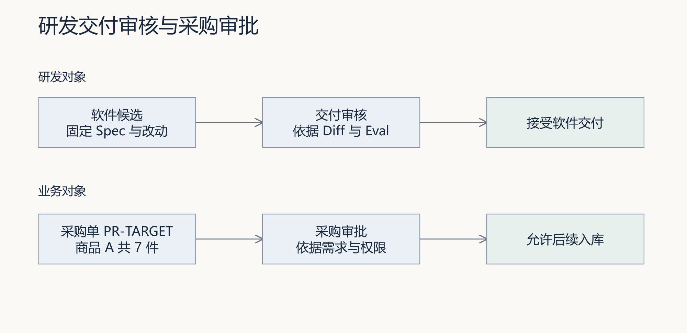

图 1｜研发交付审核与采购审批分别对应软件候选和业务单据。沿每一行检查批准依据，再说明两条记录怎样关联。

### 1.2 先把“谁批准了什么”写完整

有两张记录都写着“已批准”：一张批准软件候选 X，另一张批准采购单 PR-OTHER。它们能让 PR-TARGET 入库吗？都不能，因为批准的对象不是这张采购单。

因此，准备入库时至少要核对：这是采购批准，指向 PR-TARGET，批准人有权作决定，批准覆盖的商品与数量仍未改变。若原来批准七件，后来改成十件，不能只因单号没变就沿用旧决定。

把对象、身份、关系、允许动作和规则写清楚，就是本讲所说的**最小领域本体**。先把它理解为一份可核对的业务含义说明，不需要安装新框架。Graph 使用这些已确认的含义决定下一步，不能只检查一个含糊的“approved”字符串。

完整的两类对象表、六个设计问题及反例放在文末选读。现在先用数量检验：申请、批准与入库究竟分别改变了什么？

### 1.3 用数量校验状态名称

商品 A 在库 10 件，OTHER 已预占 2 件，可用量是 8。PR-TARGET 申请采购七件。创建申请和批准采购都不改变库存；真正入库以后，在库量应变为 17，预占仍为 2，可用量变为 15。

| 时点 | PR-TARGET 状态 | 在库／预占／可用 | 目标入库流水 |
|---|---|---|---|
| 提出申请 | proposed | 10／2／8 | 无 |
| 具名批准 | approved | 10／2／8 | 无 |
| 入库完成 | received | 17／2／15 | 一条 +7 |
| 同键重试 | received | 17／2／15 | 仍为同一条 |

OTHER 订单和另一张 PR-OTHER 不应被本次处理改变。若单据显示 received，却没有目标入库流水和七件库存增量，状态标签没有对应真实业务；若同键重试再次加七件，又破坏了幂等要求。

下面把正常结果与两种真实故障放在一起比较。三组实验各自使用相同起点的新数据库；截图不是同一采购单连续经历三个结果。先看目标状态，再看库存和属于 PR-TARGET 的流水，才有依据判断哪一步与约定不一致。

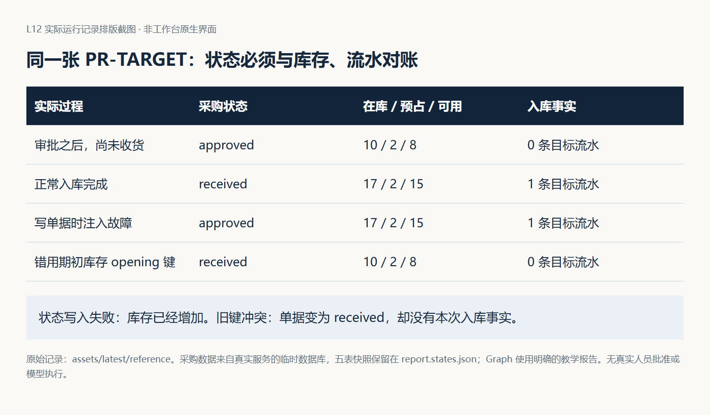

图 2｜真实服务实验的五表快照摘要。正常入库的三个观察点一致；部分提交与旧键冲突分别形成相反方向的不一致。原始数据见 `assets/latest/reference/business/` 各模式的 `report.states.json`，这不是工作台原生页面。

## 2 讲清 Graph：从一张流程设计到一次实际运行

林舟先画研发交付图：Codex 产生候选，Eval 给出检查结果，陈珂依据材料作接受或打回决定。图中的 test、completed 都指软件交付；PR-TARGET 的业务批准和入库仍由 FlowERP 单据规则控制。

### 2.1 Graph 由什么组成

先看最简单的顺序安排：开发完成后检查，检查完成后审核。它只能表达“先后”。一旦检查失败要返工、报告异常要停止、审核人未到要等待，就出现了多个可能去向。Graph 把这些可能的路径明确列出来，执行时依据事实选择，而不是每次都把所有步骤顺序跑一遍。

本讲的最小可执行 Graph 要分清五个部分：

| 部分 | 回答什么 | 本讲例子 |
|---|---|---|
| 节点（node） | 当前要执行哪个步骤，或停在哪里？ | develop 修改、test 检查、awaiting_human_review 等待 |
| 有向边（edge） | 允许从哪个节点去哪个节点？ | develop 到 test；rework 回 develop |
| 条件（guard / routing rule） | 当前事实满足哪条边的要求？ | 有效报告有阻断失败且仍有预算，才允许返工 |
| 共享状态（state） | 前一步留下什么，后一步据什么判断？ | 当前节点、轮数、候选版本、报告、决定、错误 |
| 执行器（runner） | 谁读取状态、调用动作并推动转移？ | 读取当前节点，执行对应函数，判断结果，记录下一节点的 Python 控制程序 |

要特别区分两种“状态”：`state.state = "test"` 这样的字段表示**当前所处节点**；整个 `DeliveryState` 对象表示**本次运行携带的共享数据**。前者只是后者的一部分。只知道“正在检查”，还不足以知道检查哪个候选、用了哪份报告、还剩几轮。

节点也不等于 Agent。test 可以调用普通检查程序，develop 可以接入受控的 Codex 执行，等待节点可以不执行任何自动动作。一个 Agent 可以参与多个步骤，一个步骤也可以在内部组织独立子任务。Graph 表达控制关系，不要求“每个框配一个 Agent”。

有向图也不一定是只能向前的 DAG（有向无环图）：本讲返工边会回到开发，因此允许环；环必须受 L10 的轮数与停止条件约束。Graph 能表达循环，但不会仅因画了回边就自动获得预算控制。

### 2.2 状态、动作、条件和转移怎样对应

状态描述当前已经知道的事实，动作改变事实，条件决定能否进入下一步，转移记录从哪里到了哪里及其原因。把四者分开，才能解释为什么某一步被允许。

例如检查得到有效报告且阻断失败为零，才可以把材料送入审核。审核者打回，需要保留意见，再进入修改；轮数已耗尽时，应停止并留下待办。检查本身发生异常，则缺少有效业务结论，应进入失败或明确的待处理状态。

| 当前状态 | 条件或动作结果 | 下一步 | 要保存什么 |
|---|---|---|---|
| develop | 完成一次受限修改 | test | 执行结果、候选和 Diff |
| test | 有效报告包含阻断失败 | rework | 原报告和失败任务 |
| rework | 尚有允许轮数 | develop | 范围与修订目标 |
| rework | 达到上限 | stopped | 剩余失败和停止原因 |
| test | 有效检查通过 | 等待具名审核 | 报告、审核对象和待决问题 |
| 等待具名审核 | 具名批准且对象仍有效 | completed | 决定、责任人、时间和依据 |
| 等待具名审核 | 具名打回 | develop 或 stopped | 意见、已有轮数和重新安排 |

读这张表时，先走通一次设计上的正常交付：学生限定“审批后入库”的修改范围，Codex 形成候选 X；Eval 检查正常入库、未经批准拒绝和重放等约定；有效检查通过后，把 X 与报告交给人审；审核人接受同一对象后，才完成本次软件交付。即使走完这条路径，某张真实采购单仍需另行获得业务批准。

再从 test 分叉：规则检查失败且还有预算，就把具体失败交回 develop；没有有效报告，就处理检查异常；检查通过但没有人的决定，就等待。这样，Graph 组织的是不同事实对应的下一步，不只是给顺序脚本加几个节点名称。

这张表是设计约定，不表示参考代码已经完整实现每一个条件。尤其“有效报告”和“对象仍有效”需要实际验证，不能靠状态名称默认成立。

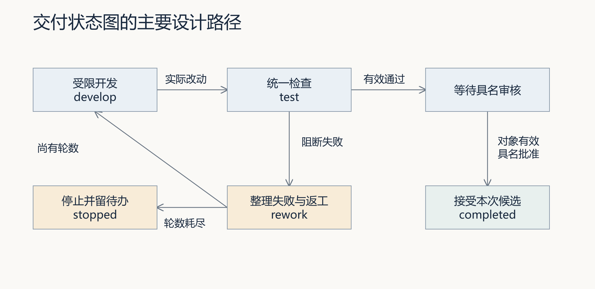

图 3｜主要设计路径。图中展示检查失败后的返工与停止，以及有效批准后的完成；人工打回返回开发，轮数耗尽则停止，执行异常另行保留失败。参考程序尚未强制所有条件。

### 2.3 一个合法状态名不代表合法转移

假设 completed 是允许的状态名，不等于任何状态都能直接跳到 completed。转移还要满足前置检查、授权和业务条件。应把允许边与条件放到可检查的位置，而不是让任意代码随手改变状态字段。

参考 `DeliveryState.move` 只追加轨迹并修改状态，没有自行校验允许边。unchecked-move 实验直接从 develop 调到 completed，观察到方法接受了这次跳转。这提示我们：轨迹记录与转移校验是两种能力。正常主循环按分支使用它，不代表其他调用者不能绕过分支。

### 2.4 共享状态怎样把节点接起来

跨节点共享的信息至少包括任务目标、当前节点、轮数、候选身份、实际执行结果、报告引用、修复范围、审核决定和错误。各节点负责更新自己产生的事实，后续节点依赖已验证的输入。

报告路径不够，因为文件可能被覆盖；一个“通过”字符串也不够，因为它没有说明用例和版本。L08、L09 的来源约定在这里继续发挥作用：报告身份、完整内容与候选要能对应，决定不能脱离证据存在。

共享状态不需要复制整份本体，但应保存足以固定语义的引用，例如采购申请 ID、候选版本、报告身份、审核类型和所采用的本体版本。状态字段仍表示本次运行事实，本体版本则说明这些字段按哪套业务含义解释。若“批准”或“同一次入库”的定义发生变化，应形成新版本并重新判断受影响的条件、Eval 与旧审核，不能静默改名后继续复用原结论。

以 test 到审核为例：开发步骤先留下候选 X 和 Diff；test 读取 X，写入检查 X 的报告 R-X；审核步骤读取 X 与 R-X，等待人的决定。它不是只接收上一个节点说的“成功”。如果返工产生 Y，当前审核依据就必须换成检查 Y 的报告，X 的材料留作历史，不能继续充当 Y 的绿灯。

因此，共享状态需要明确每项事实的生产者、消费者和失效条件。开发步骤产生候选，检查步骤产生该候选的报告，审核入口接收人的决定。若开发产生 Y，就应把旧报告和决定保留为 X 的历史，并等待 Y 的新检查；不能只把“当前候选”改成 Y，却继续沿用 X 的通过字段。恢复时同样先核对这些引用，再决定下一条边。持久化保存了错误关联，只会让错误在重启后继续存在，不能替代有效性检查。

### 2.5 执行器怎样跑出一条实际路径

图定义的是**所有允许路径**；一次运行形成的 trace（轨迹）只是**本次实际走过的路径**。同一张图，面对不同报告和决定，可以分别得到完成、等待、返工或停止的轨迹。看见一条成功轨迹，只能说明这条路径发生过，不能证明其他分支也正确。

执行器的基本过程是：读取共享状态，确定当前节点；调用该节点动作，把实际结果写回状态；检查条件，选择允许的下一节点；记录转移及原因。到达等待点时，把状态保存后交还控制权；到达完成、停止或失败终态时结束本次推进。再次启动时先加载原状态，而不是默认从 develop 开始。

下面是一条**用于推演的设计轨迹，不是实际运行记录**。假设预算允许两轮开发，启用了具名人审，真实开发与同版 Eval 都已接入：

1. **进入 develop**：第一轮受控修改形成候选 X，保存实际执行结果与 Diff，然后进入 test。仅把节点名改为 test 不算完成开发。
2. **执行 test**：有效报告 R-X 通过。执行器根据通过条件进入人工决策环节，而不是直接接受交付。
3. **停在 awaiting_human_review**：保存 X、R-X 和待决问题，本次推进结束。没有人的新决定时，再次读取仍应等待，不偷偷开一轮开发。
4. **收到具名 reject**：保留审核意见，确认还有预算，沿回退路径进入 develop。若预算不足，就停止并交代待办。
5. **再次 develop 与 test**：按意见形成候选 Y，重新检查得到 R-Y。当前审核材料换成 Y 与 R-Y，旧材料仍可回查。
6. **再次等待，收到有效 approve**：核对批准对象仍是 Y，记录决定与依据，进入 completed。这完成的是软件交付审核，不是替 PR-TARGET 作采购审批。

请沿这六步逐次回答：当前节点是什么？刚执行了什么？哪项状态改变了？凭哪条条件去下一步？如果四问答不上来，图中就可能仍有靠猜测交接的地方。

### 2.6 最小 Python Graph 与流程图、框架有什么区别

最小实现不必先安装编排框架。当前参考 `agent/graph.py` 用 `DeliveryState` 承载数据，用 `while` 和 `if/elif` 根据当前节点分派处理，用 `move(target, reason)` 更新节点并追加轨迹，用加载和保存函数读写 JSON。换言之，普通 Python 控制代码也能实现显式状态图；Graph 的关键不是特殊语法，而是状态、分支和交接规则能被检查。

但这份参考实现仍是控制支架：develop 只推进状态，没有实际调用 Codex 修改代码；`move` 没有独立检查允许边；候选与报告绑定等条件也未完整实现。读代码时，应分别找到“真正调用了什么动作”和“只更新了什么字段”，不能把图里写着开发解释成程序已经开发。

流程图是供人理解的表达，可执行 Graph 则必须把节点动作、条件判断与状态更新落实为程序。框架可以提供组织节点、路由或保存进度的机制，但不会替你决定采购权限、验证报告是否属于当前候选，或保证数据库事务。用最小 Python 还是换框架，最终都要接受相同反例检查。

至此，Graph 的骨架已经清楚。接下来的三节不是离开 Graph 去讲旁支：第 3 节补全**人工决策边的条件**，第 4 节补全**状态保存与动作恢复的关系**，第 5 节检查**分支和异常出口是否真实生效**。

## 3 到达人工决策点：等待谁，依据什么继续

流程来到等待节点，林舟要交出去的是可判断的材料：谁审核、审核哪个候选、检查覆盖什么。若等待期间对象变了，原决定还能否使用，也必须在这里规定。一个“同意”按钮本身回答不了这些问题。

### 3.1 等待也是正确结果

采购人员催促入库时，先核对缺少的是业务审批，还是研发候选的交付审核。前者决定这张采购单是否允许入库，后者决定这份实现是否可以接受。学生应指出当前等待对象及负责人，Codex 可以整理证据和准备后续动作，不能用模型意见补齐人的决定。被打回后，应根据理由修订并重新复验受影响对象；旧批准不能自动覆盖新版本。

当检查通过，但关键决策还没有发生时，停在等待是正确行为。若程序为了得到退出码 0 自动接受，就把缺少决定掩盖成了完成。

参考命令中，completed 对应退出码 0，awaiting_human_review 对应 3，其他停止或失败状态对应 2。调用方需要理解这些含义；退出码 3 在这里表示等待，不是已经交付失败，更不是完成。

默认不指定状态文件、也不要求人工审核的运行采用本地演示策略，可能自动完成。启用 `--require-human-review` 或状态文件以后，检查通过会停在 awaiting_human_review。这两个模式应明确区分，不能拿默认演示输出证明真实人审。

将等待、恢复、批准和打回实际运行一次，会看到“最终仍在等待”不等于“什么都没做”。resume 只是再次读取；reject 则经过回退与一次新检查，又回到等待。必须结合轨迹和检查次数解释最终状态。

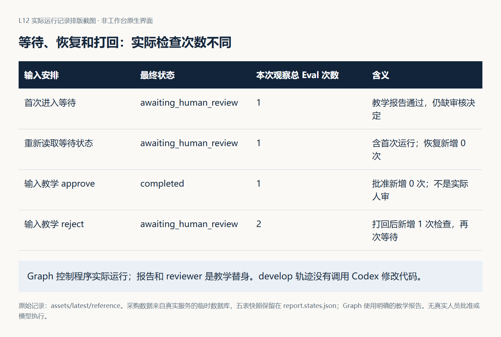

图 4｜Graph 控制程序的实际输出。次数包括每组实验的首次检查；报告与姓名均为教学输入。这里观察的是控制路径，develop 没有调用真实开发动作。

### 3.2 审核人字符串与身份认证

命令要求提交 approve 或 reject 时提供非空 reviewer。它能够留下署名字段，但字段本身不验证这个人是谁，也不能证明其具有采购或交付权限。真实系统需要从已认证身份和权限规则取得决定者，而不是让模型自行填写一个名字。

教学实验中的 `TEACHING reviewer` 是明确的测试输入。个人交付应由实际责任人阅读本次材料后作决定，不将测试字符串当签字，也不把交付审核人的署名复制成采购审批人。

### 3.3 审核必须绑定仍然有效的对象

候选 X 的检查通过以后，程序停下来等待。等待期间代码变成 Y，旧报告还能批准 Y 吗？如果二者差异影响被审核行为，答案不能仅由“已经有一份绿报告”决定。

stale-approval 实验先保存等待状态，再修改一个临时教学候选标记，最后批准。参考 Graph 没有绑定该候选标记，也没有再次调用 Eval，仍返回 completed。这个实验不是产品修复轨迹，却揭示了审核接口尚未验证候选身份。

个人实现应固定审核对象：任务、候选版本、报告和必要的输入快照。对象变化时使旧批准失效，或要求重新验证和审核。对于采用记忆和流程的后续事项，也要保存当时采用的快照和版本，避免经验更新后悄悄改变旧任务依据。

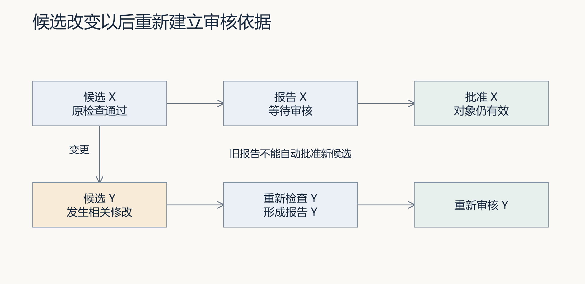

图 5｜审核对象变化后的设计要求。X 的报告支持 X；Y 发生相关修改后，需要重新建立报告和审核依据。对照 stale-approval 实验判断当前缺口。

## 4 决定跨越一次运行：中断后怎样安全接续

等待到了第二天，林舟要恢复流程，却不能只按文件里最后一个节点继续。若记录停在 approved，而数据库已经增加七件，再执行一次就会多记账。下面沿同一张 PR-TARGET 核对状态保存与外部动作，决定应该补哪一步。

### 4.1 保存文件与恢复动作不是一回事

持久化让进程退出后仍能读取状态。恢复则决定下一步做什么：继续等待、重新检查、再次执行动作，还是返回终态。后者决定是否会重复产生业务副作用。

参考 Graph 将状态、轮数、报告、轨迹和审核字段写为 JSON。resume 实验读取 awaiting_human_review，不重新执行检查；terminal-rerun 读取 completed，不重新运行。这样的行为能减少重复执行，但也意味着恢复本身不会确认外部代码和业务数据仍然符合旧结果。

设计时需要区分“最后记录在这里”和“外部动作确实在这里完成”。进程可能在动作完成、状态尚未保存的间隙退出。恢复时若直接重做，就可能重复写入；若直接跳过，又可能漏掉未完成动作。

### 4.2 事务与幂等分别解决什么

事务把需要共同成功或共同失败的数据库变化组织在一起。幂等让同一业务请求重试时不会重复生效。前者处理一次动作内部的一致性，后者处理不确定结果下的再次调用，两者不能互相代替。

本讲实际采购服务先调用 `receive_stock`，随后在另一个数据库连接中把采购状态改为 received。status-write-failure 用临时数据库触发器阻止第二步更新。结果是库存已经增加到 17，采购单仍为 approved。原子性检查因此失败。

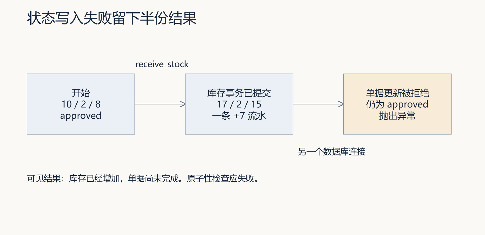

图 6｜status-write-failure 的实际故障位置。第一步已经提交，第二步抛错，因此库存与单据暂时不一致；不能把抛错理解为所有变化都已回滚。

recovery-same-key 在同样故障之后移除触发器，使用原入库键重试，观察到库存不再增加，单据状态最终补齐为 received。它说明这一恢复路径可收敛，不能倒推第一次操作具有原子性。个人实现应依据实际业务边界组织事务，并对退出与重试设计补偿或接续方式。

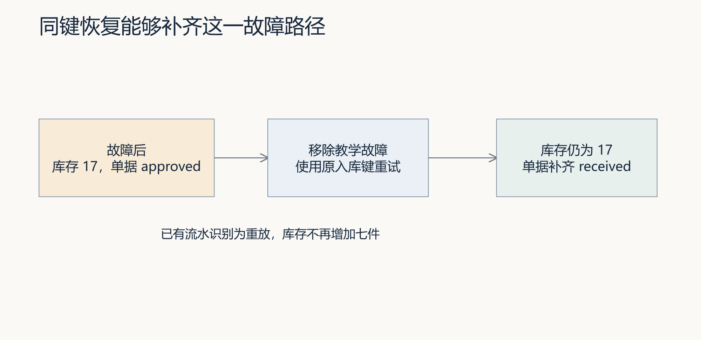

图 7｜recovery-same-key 的实际恢复路径。原键识别已有入库流水，重试只补齐后续单据状态。恢复成功不能证明第一次操作原子化。

同键恢复实验还保存了同一次运行的三个时点，便于核对“恢复了什么”。第一次异常后，目标流水已经存在；重试后的流水仍只有一条，数量仍为 17。变化的是采购单从 approved 补齐到 received，而不是再次增加七件。

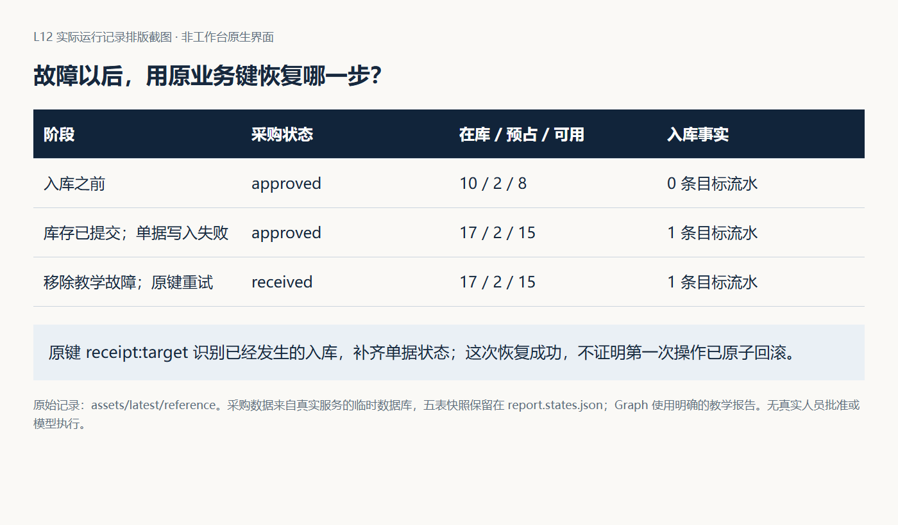

图 8｜读取 `recovery-same-key/report.states.json` 的 `before_receive`、`after_status_write_failure` 与 `after_receive` 三个阶段。教师仅移除故障触发器后重试，没有修复产品事务边界，也没有真实审批人签字。

### 4.3 幂等键需要对应业务身份

key-collision 使用已经属于期初库存的 opening 键尝试接收 PR-TARGET。当前入库方法遇到已存在键时按重放返回，采购方法随后把单据设为 received。结果没有新增七件库存，却出现了已收货单据，状态对账检查失败。

幂等不能只问“这个字符串见过没有”，还需要检查它对应的业务对象和请求内容是否一致。为不同业务生成明确身份，并对同键异请求拒绝或给出明确定义的处理；不能把其他事件的成功借给当前单据。

这也是本体不应退化为术语表的原因：`idempotency_key` 不只是一个字段名，它表达“某个业务动作身份”的一部分。需要明确该动作针对哪张采购单、哪种操作、什么请求内容以及在什么范围内唯一。Graph 负责决定何时调用，业务本体提供身份与约束，服务和数据库实现检查，Eval 再用重放与同键异对象反例验证；缺少其中任何一层，都不能从一个键名推断幂等已经成立。

## 5 用反例验收：不前进时，能否解释原因与下一步

陈珂没有只测一条顺利到达 completed 的路径。她要求林舟分别解释：正在等人、已经拒绝、需要返工和执行异常时，状态、次数与业务数据应是什么。每次先写预期，再运行和核对。

| 观察到的情况 | 应作出的判断 | 合理的下一步 |
|---|---|---|
| 有效检查通过，但负责人尚未决定 | 等待，不是完成 | 保留同版材料，交给相应审核人 |
| 未批准的 PR-TARGET 入库被拒绝，数据未变 | 业务保护生效 | 回到业务审批，不让 Codex 绕过规则 |
| 当前候选有明确阻断失败 | 实现需要返工 | 剩余预算内修订，再检查新候选 |
| 检查程序异常，没有有效报告 | 尚无可用的检查结论 | 排查执行条件，不能当作绿灯 |
| 库存已增、单据未更新 | 动作部分完成 | 对账后按同一业务身份接续 |
| 预算耗尽，或无法安全判定恢复动作 | 当前不能继续 | 保存实际证据与待办，明确停止或交人处理 |

### 5.1 区分业务拒绝与执行异常

未经审批入库被拒绝，是规则发挥作用。检查程序无法读取数据，是无法形成结论。两者都可能让流程不前进，但原因和下一步不同。

采购实验的 unapproved、rejected 和 blank-reviewer 分别验证未审批、已驳回和空白审核人的拒绝，比较五张表保持不变。Graph 的 eval-exception 则让检查生产者抛出异常，观察到 failed 和明确错误。将前者写成系统故障，会掩盖正常保护；将后者写成业务规则未通过，又可能让 Codex 修错方向。

### 5.2 异常处理只覆盖它实际包住的部分

参考 Graph 的 try 语句覆盖主循环，但状态文件加载在它之前，保存发生在它之后。因此 malformed-state 的 JSON 解析错误和 save-error 的写入错误会直接抛出，未被转换成主循环的结构化 failed。

这不要求把所有错误一律吞掉。需要保留实际错误、已有状态和未保存部分，使调用方知道能否接续。状态写入本身失败时，也不能声称已可靠持久化失败记录。异常出口应按读取、执行、检查、审核和保存分别验证。

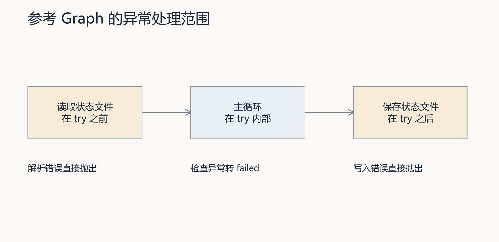

图 9｜当前参考 Graph 的异常处理范围。加载与保存不在主循环的 try 内，需分别检查；保存失败时，不能声称 failed 已经写入文件。

### 5.3 有上限还要解释计数

blocking-failure 在三轮检查均失败后停止，没有执行真实开发，因为参考 develop 节点只移动状态。它验证的是控制路径，不是“Codex 修复三次仍失败”。

reject-at-limit 把上限设为 1，在第一轮等待后打回。参考程序回到 develop 先递增轮数，随后发现超限，返回 stopped，结果中的 rounds 为 2，但没有第二次检查。这说明轮数字段、实际执行次数与检查次数可能不同。设计与提交应给出计数语义，不能只凭一个数字判断越界执行。

### 5.4 状态图不会自动获得正确反馈

empty-report 注入空结果、零阻断数的报告，参考 Graph 仍进入等待。真实 Harness 自身拒绝空套件，但消费者接口没有因此自动获得完整校验。更换报告生产者时，应继续检验报告有效性、必需用例、候选身份与结论一致性。

原生 Subagents 解决工作如何分派，Graph 解决状态与控制如何表达。两者可以结合，但子代理完成不等于图中业务节点完成；采用外部编排框架也不会自动提供业务事务、身份认证和审核对象绑定。L12 的基础要求用最小 Python 状态图实现，框架替换属于挑战，不能跳过同一输入、输出与验收标准。

## 6 总结、个人交付与下一讲

### 6.1 用同一张采购单复述本讲方法

先不看采购细节，用自己的话解释 Graph：它把工作拆成节点，用有向边表达允许去向，由条件根据共享状态选择路径，再由执行器调用动作、更新事实和记录轨迹。分支表达不同结果，回边表达返工，等待节点把决定交给人，持久化让后续运行能够读取原进度。这些机制合起来，才把一张设计图变成可推进的工作流。

本讲从“PR-TARGET 申请七件，但尚不能入库”出发。先明确采购单、批准、入库事件与软件候选各是什么，避免批错对象；再把研发交付写成有条件的移交，区分检查失败、等待与停止；在人工决策点固定候选、报告与决定者；中断后核对实际动作，用事务和业务幂等保障接续；最后用拒绝、打回、旧批准和部分提交等反例检验设计。

记住三个判断：**状态名称不等于业务事实，检查通过不等于获得人的批准，保存进度不等于能够安全恢复。** Graph 的作用是把交接依据显式化；真正接受结果，还要由有效报告、具名决定和业务对账共同支持。

这也是三讲能力的衔接：L10 解决失败后怎样有界重做，L11 解决独立工作怎样分派，L12 解决依赖、等待、回退与恢复怎样组织。学生先与 Codex 升级工作台，再通过工作台交付 FlowERP 的审批后入库能力。可复用的不是某张采购单，而是这套能说明“为什么允许下一步”的交付方法。

### 6.2 把设计落实为个人证据

前面的实验给出了判断状态图的依据，现在把这些依据用于本人实现。先固定采购规则与审核对象，再由工作台组织修改、故障复验和人工决定，最后换一组输入检验方法能否迁移。

先写一张最小本体卡，再写两套状态表。最小本体卡不求术语数量，至少列出采购申请、采购审批、入库事件、库存余额、软件候选、Eval 报告和交付审核七类对象；为每类对象写明身份、关键关系、允许动作、约束、来源和确认状态。由 Codex 从现有材料提取候选，学生逐项核对，业务含义与责任边界由实际人员确认。未确认项保留为待决定，不让 Codex 自动补齐。

随后用这张卡审查状态表：每个节点正在处理什么对象，每条条件引用哪项约束，每次审核指向哪个版本，每个终态需要哪些业务事实支持。为 PR-TARGET 推导成功和拒绝后的数量，再运行控制实验与真实采购实验。根据实际缺口，补齐受限执行、有效报告、状态保存、具名审核和业务对账，使自己的图与真实动作一致。本体卡是 Graph 设计支架，不新增独立产品功能，也不能替代本讲原有实现和验收命令。

完成后请同伴选择一条进入 completed 的路径，从审核记录回查候选、报告与原始需求；再选择一条异常或打回路径，检查已有修改、剩余轮数和下一步是否清楚。迁移练习选择发布流程：测试通过后等待负责人决定发布时间，恢复时哪些动作必须重验，哪些不能重复？

真实需求仍从工作台首页“事项与决策”进入。Graph 是工作台组织执行的能力，不是另一个日常研发入口。依据[工作台闭环建设规格](../../architecture/工作台范式与闭环建设.md)，前一事项的经验应在后一事项召回，后者明确采用流程版本，仍经 Harness 与具名审核；复用失败推动修订或停用。当前规格尚未完成实现，保存 Graph 状态或登记流程资产都不能单独证明跨事项闭环。

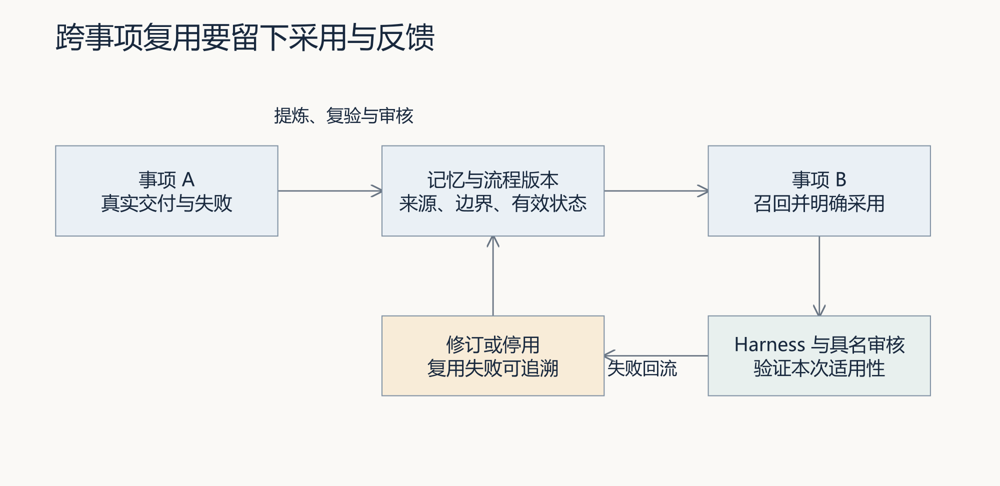

图 10｜工作台跨事项复用的建设目标。事项 B 明确采用经验和流程版本，再接受 Harness 与具名审核；失败推动修订或停用。当前建设规格尚未全部实现。

### 6.3 思考：哪一步不能仅凭状态继续

先独立写出判断和依据，再请同伴提供反例，保留首次答案与修订。

先做一个 Graph 自检：不使用“智能编排”这样的概括词，指出 test 的输入、动作、输出、可能去向与选择条件；再解释为什么“画出 develop 到 completed 的箭头”不代表这条转移应该被允许。

1. 候选 X 的 Eval 全绿，PR-TARGET 尚未批准。现在可以完成哪一种审核？为什么还不能增加七件库存？
2. 等待期间候选变成 Y，审核人批准了 X 的报告。Graph 应核对哪些对象和版本，才知道能否继续？
3. 数据显示库存为 17／2／15，但采购单仍为 approved。为什么既不能从头再入库，也不能直接宣布整条交付成功？应先回查什么？
4. 恢复后流程仍是 awaiting_human_review。怎样区分“只读取后继续等待”和“打回、修订、复验后重新等待”？只看最终状态为什么不够？
5. 将这套方法迁移到发布流程：负责人批准了发布时间，但部署中途断开。哪些证据需要重验，哪些动作不得盲目重复？请指出可复用的 Graph 机制与必须重新确认的业务语义。

### 6.4 下一讲：别人怎样提交任务并查询这条流程

L12 让工作台知道一次交付应该如何推进，但还留下一个使用问题：页面或其他程序不能靠读取终端输出，来确定“我提交的任务正在等待谁、为什么被打回、是否已经结束”。它们需要稳定的任务身份和查询入口。

L13 因此把执行链路封装成任务 API：提交需求后返回任务 ID，再按 ID 查询执行阶段、报告与结果。API 暴露本讲已经定义的状态和责任，不另造一套“成功”含义。收到任务不等于完成任务，查询到 completed 也必须能回到本讲的候选、Eval 与审核依据；这些约束将继续进入下一讲的接口设计。

## 离开这一讲之前

林舟现在能说明流程为什么等待、怎样恢复，但周宁不可能一直守着他的终端。她希望离开后还能查到那项补货工作。L13 将为工作对象保留稳定编号，让查询和接手不再依赖同一个窗口。

## 读完后回看：先回答，再看总览图

**软件检查全绿，是否意味着 PR-TARGET 可以入库？**

不意味着。软件交付审核与采购业务批准分别对应对象，还要确认这张采购单的有效批准和真实入库条件。

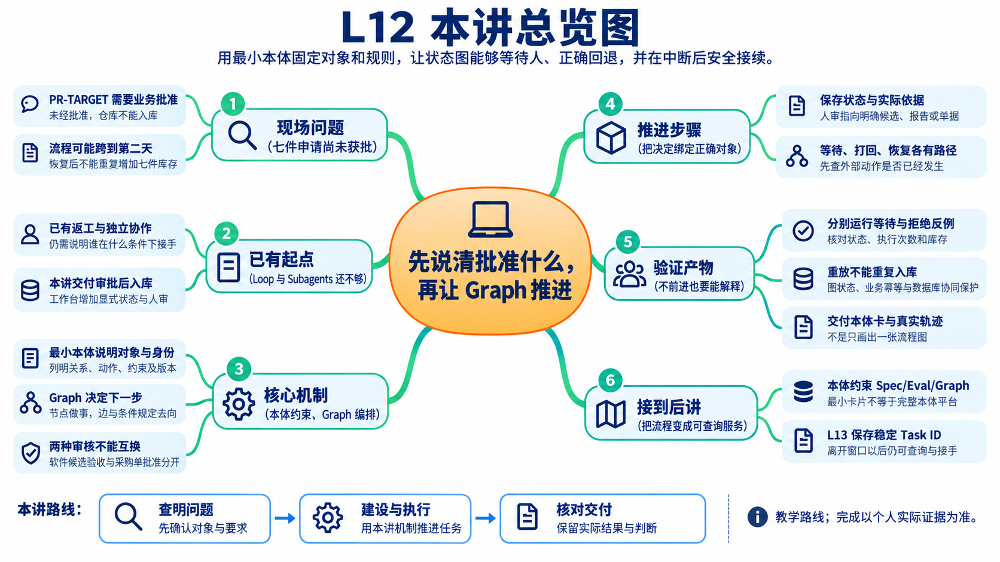

这张图用于复习，不是阅读起点。先沿本讲案例的先后顺序回看，能解释上面的问题后，再查图中的分支和术语。

### 接下来到实践手册做什么

先按手册第 2～3 步看控制与采购实验，再按第 4～6 步建设个人 Graph，完成等待、恢复和同版复验。具体命令见[实践操作手册](实践操作手册.md)。实验示例用于理解；提交材料必须对应自己的输入、版本、实际结果和判断。

## 附录：课程合同与实现依据

本讲对应 CLO-5：跨角色协作与人审。以下保留正式大纲原文。

- **核心内容**：共享状态、条件分支、审核打回、异常路径和人工介入；原生 Subagents 与外部编排框架的边界。
- **演示结果**：开发 → 测试 → 审核；审核失败回到开发，关键决策等待人工确认。
- **课内增量**：用最小 Python 状态图实现移交、回退、状态保存和审核结论。
- **验收命令**：`python -X utf8 -m agent.graph --max-rounds 3`
- **通过标准**：状态变化可追踪；审核结果来自 Eval；循环有上限；异常不会被静默忽略。

2026-09-09 复核并复跑[参考 Graph](../../../agent/graph.py)、[采购服务](https://github.com/congde/flowERP/blob/main/flowerp/service.py)、[默认 Eval](../../../eval/cases.py)，并运行[十六种控制实验](examples/graph_control_lab.py)与[九种业务实验](examples/purchase_approval_lab.py)。明确区分实际结果、教学替身、个人实现要求与尚未完成的闭环建设。领域本体的正式表示可参考 W3C [OWL 2 Web Ontology Language Primer](https://www.w3.org/TR/owl-primer/)；本讲只采用对象、类别、关系与数据值的基础建模思想，不要求实现 OWL，也不把课程中的轻量表格说成已经建成正式语义网本体。

## 课件对照

[29 页主线自学 PPT](slides/L12-用Graph显式表达状态回退和人工审核-主线自学版-29页-定稿.pptx)以 Graph 的组成和运行作为核心，六章开始均保留完整目录。方法图为 imagegen 教学示意，实验表格对应讲义已有记录。Word 与实践手册未随本次课件更新重新导出。旧版 30 页课件保留供历史查阅。

| 学习问题 | PPT 页码 | 讲义与实践对应 |
|---|---|---|
| 采购问题、批准对象与最小本体 | 2～4 | 讲义§1；实践§1、3 |
| Graph 的组成、条件、状态与执行器 | 5～10 | 讲义§2.1～2.5；实践§2、4 |
| 一次运行轨迹与最小 Python 实现 | 11～12 | 讲义§2.5～2.6；实践§2、4 |
| 等待、打回与审核对象变化 | 13～15 | 讲义§3；实践§2、5 |
| 部分提交、同键恢复与业务身份 | 16～19 | 讲义§4；实践§3、6 |
| 异常、计数、空报告与编排边界 | 20～23 | 讲义§5；实践§2、5 |
| 个人证据、总结、思考与迁移 | 24～28 | 讲义§6.1～6.3；实践§7 |
| L13 任务 API 衔接 | 29 | 讲义§6.4 |

逐页覆盖依据与图示说明见课件配套材料。第 26 页总结 Graph，第 27 页保留独立思考，第 28 页回到迁移与正式通过标准，第 29 页引出任务 API。

配套执行与个人提交见[实践操作手册](实践操作手册.md)。

## 选读：为什么对象与规则的说明叫作最小领域本体

Graph 回答的是“当前走到哪里，满足什么条件才能进入下一步”。它必须引用一些已经说清含义的对象和关系。例如“审批通过后入库”至少还要回答：批准的是软件候选还是采购申请，批准记录指向哪一个对象，谁有权批准，入库事件改变哪一笔库存，以及重复调用怎样识别为同一次业务动作。若这些语义没有先固定，流程图即使连线正确，也可能把错误对象送进正确节点。

本课程把**领域本体**理解为一份可核对的业务语义说明：重要对象是什么，怎样识别，彼此有什么关系，允许哪些动作，必须遵守哪些约束，以及这些含义由谁确认。这里不要求 OWL、RDF 或知识图谱平台。对 PR-TARGET 而言，先写清“批准记录指向这张申请，入库事件履行这次批准”，就比单独增加一个 approved 字段更有用。

L12 同时存在两个相互关联、但不能合并的最小本体：

| 语义范围 | 主要对象 | 关键关系 | 动作与约束 |
|---|---|---|---|
| FlowERP 采购业务 | 采购申请、商品、库存余额、采购审批、入库事件 | 申请针对商品和数量；审批指向一张申请；入库事件履行已批准申请并改变对应库存 | 只有已批准申请才能入库；同一业务入库只生效一次；库存、单据和流水必须对账 |
| 工作台研发交付 | 需求、任务、软件候选、Eval 报告、交付审核决定 | 候选实现任务；报告检查某个候选；审核决定指向该候选及报告 | 报告有效且阻断项通过后才能等待人审；候选改变后旧报告和旧批准不能自动沿用 |

两边都有“申请”“报告”“批准”“完成”之类的词，但身份和责任不同。`PR-TARGET` 是采购申请个体，候选 X 是软件候选个体；采购审批不能批准候选 X，交付审核也不能批准 `PR-TARGET` 入库。Graph 可以在一次交付中引用这两类对象，却不能因为它们共享一个 `approved` 字符串就把它们视为同一事实。

最小本体至少回答六个问题：

1. **对象是什么**：采购申请、库存余额、软件候选和报告分别代表什么。
2. **怎样识别同一个对象**：采购单号、候选版本、报告身份和幂等键各自绑定什么。
3. **对象怎样关联**：哪份批准指向哪张单，哪份报告检查哪个候选。
4. **允许什么动作**：批准、驳回、入库、复验和接受分别由谁触发。
5. **什么约束不可破坏**：未经审批不得入库、同一入库不得重复生效、候选变化后不得借用旧绿灯。
6. **语义由谁确认**：来源、适用范围、确认人和版本是什么；未确认的 Codex 建议仍是候选。

这六问最终要用于检查具体转移，而不是另交一份术语大全。本体说明“批准”的对象和含义，数据库承载相关数据，Graph 决定何时推进。比如准备进入入库动作时，应能沿引用找到 PR-TARGET 的批准；准备接受软件时，应能沿引用找到当前候选的报告。找不到，就还不能只凭状态词继续。

一个常见的错误条件是 `approval == "approved"`。林舟可以拿两张都写着“批准”的记录反驳它：一张批准软件候选 X，另一张批准采购单 PR-OTHER。两张都不能授权 PR-TARGET 入库。需要检查的是批准的类型、目标 ID、版本、决定者权限和当前有效性，而不仅是状态词。

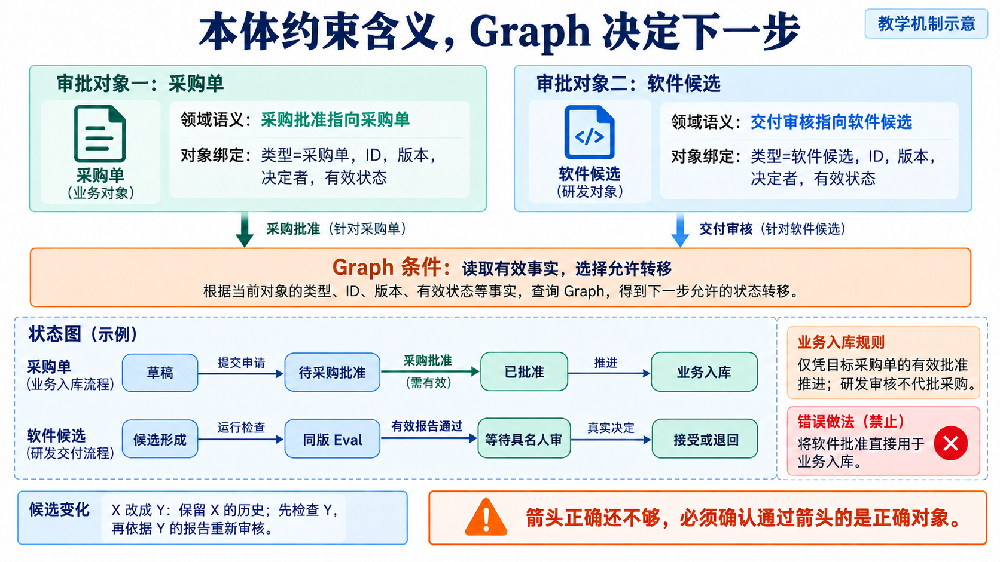

*读图：上方先分开软件与采购两类对象，下方再检查允许转移的条件。研发审核不能通过连线变成采购批准。*

这就是本讲“本体驱动”的具体做法：用语义说明约束状态字段、节点输入、转移条件和 Eval。准备入库时，条件应表达“存在对 PR-TARGET 当前版本仍有效的采购批准”；准备接受软件时，应查当前候选及其报告。参考程序尚未完整实现身份认证和全部对象绑定，这些条件是需要实现并用错误对象反证的设计要求。

最小本体也不只是数据库字段清单。数据表告诉程序怎样存储，语义说明还解释一条批准允许谁对什么作何种动作；同一业务含义可以由不同表结构承载。Graph 再使用这些含义安排等待、执行和回退。若数量从七件改为十件，即使采购单号没变，也应重新判断旧批准是否仍覆盖这个对象版本。
