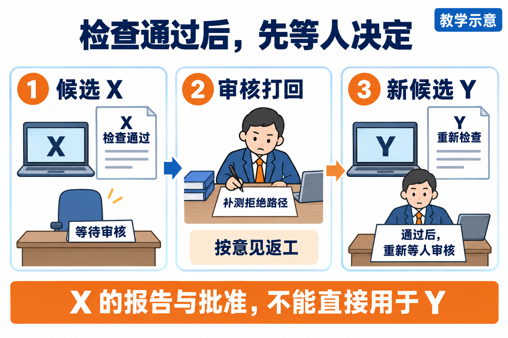
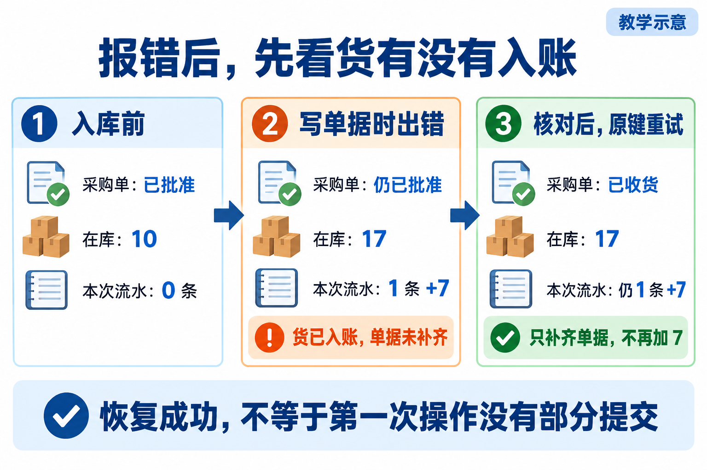
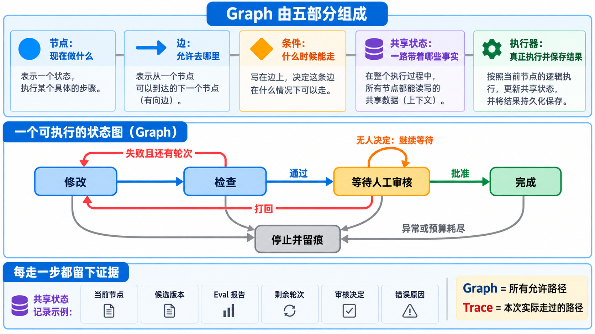

# L12 实现细节与扩展阅读

先读[辅导资料](辅导资料.md)，看懂本讲案例；准备实现或排查具体问题时，再按需查本文。这里保留控制规则、源码边界与实验入口，不要求先读完才能开始。

## 怎样写进程序：把“做事”和“决定去向”分开

一个节点里有两类工作：调用动作，例如修改代码或运行检查；读取结果并选择下一状态。把两者分开，比较容易发现哪里出了错。

以检查节点为例，先运行 Eval，取得原始报告和退出码；再校验报告及当前候选是否对应；最后根据校验后的结果决定去等待还是返工。这样，命令没启动、报告缺失与业务不通过就能得到不同处理。

实现可以先用普通 Python 函数，不必急着引入编排框架。下面是一个**独立的教学函数**，只展示“等待审核时怎样选择去向”。假定输入中的 `review` 已经过身份与权限校验，它不负责执行开发、保存文件或验证真实身份：

```python
def review_next(state, review, can_rework):
    if state["node"] != "awaiting_human_review":
        raise ValueError("当前不在审核等待点")
    if review is None:
        return "awaiting_human_review"
    report = state["report"]
    if (not report["valid"] or not report["passed"]
            or report["candidate"] != state["candidate"]):
        raise ValueError("当前候选没有有效的通过报告")
    if (review["candidate"] != state["candidate"]
            or review["report_id"] != report["id"]):
        raise ValueError("审核对象与当前材料不一致")
    if review["decision"] == "approve":
        return "completed"
    if review["decision"] == "reject":
        return "develop" if can_rework else "stopped"
    raise ValueError("未知审核决定")
```

这个函数最重要的地方不是英文名字，而是比较对象：报告检查的是哪版，决定接受的是哪版。若当前候选为 Y，审核还指向 X，就拒绝推进。只判断 `decision == "approve"`，会把旧批准套给新代码。

从这里也能看出状态图为什么需要一个统一的转移入口。调用方不能绕过条件，直接把 develop 改为 completed。最小实现应验证允许的起点、终点和条件，再记录转移原因。状态名只是位置，实际动作的结果才是进入下一步的依据。


## 被打回以后，新版本要带哪些材料回来

假设 Codex 形成候选 X，检查 X 通过，审核人却发现“没有验证未批准收货会被拒绝”，于是打回。

下一步先保留这个意见，再确定返工内容。如果原检查确实遗漏，就补检查；如果检查暴露产品缺陷，再在确认范围内修实现。不能预先把所有打回都理解为“必须修改业务代码”。



*读图：X 的材料留在历史里；形成 Y 后，Y 重新检查并再次等待审核。*

新候选 Y 要有自己的报告。旧报告和旧决定可以保留，但应标清它们属于 X。一个容易审查的更新方式是：形成 Y 时清空“当前有效报告”和“当前有效审核”，把旧材料移入历史引用；检查 Y 后再填入新报告。

等待期间也不应悄悄改代码。如果必须改，先结束当前等待或撤回当前审核请求，产生新候选后重新检查。这样审核人看到的材料与最终接受的文件一致。

### 共享状态究竟要保存什么

“共享状态”就是交给下一节点、也交给下一次运行的事实。可以从接手者会问的问题倒推字段：

| 接手者的问题 | 要保存的信息 |
|---|---|
| 这是哪项交付，做到哪里？ | 任务身份、当前节点、目标及范围引用 |
| 正在审核哪版？ | 当前候选身份及实际 Diff 引用 |
| 为什么可以审核？ | 报告身份、候选绑定、有效性与结果 |
| 谁作了什么决定？ | 决定者、决定对象、理由和时间 |
| 还能返工吗？ | 已用轮次、剩余预算 |
| 上一步失败在哪里？ | 错误、最后可靠转移、结果不确定的动作 |

原始报告和差异不必全部塞进一个大 JSON，可以保存引用与内容指纹。路径告诉你去哪里找，指纹帮助判断找到的是否仍是那份内容。个人实现还应能解释文件缺失或内容变化时怎样处理。

状态更新要与保存策略一起设计。若先在内存里宣布完成、保存却失败，重启后仍会读到旧等待状态。因此对外报告完成前应确认必要状态已可靠保存；失败时明确报告保存错误，不假装已经留下完整记录。


## 恢复前先核对事实：库存 17，单据却还写已批准

保存状态文件解决“程序记不记得上次停在哪里”；业务动作是否重复发生，还需要另外判断。

看一个故障推演：PR-TARGET 已获批，服务先增加 7 件库存并写流水，再把单据改为 received。第二步写单据失败，第一次写入却已经提交。于是库存是 17，单据仍是 approved。



*读图：先分别查看库存、流水与单据，再决定恢复动作；不能只凭报错或单据状态重做。*

如果重新打开程序后看见 approved 就再加 7，库存会变成 24。恢复时应该先对账：

| 当前事实 | 可以得出什么判断 | 下一步思路 |
|---|---|---|
| 在库 10，没有本次流水，单据 approved | 未看到本次收货生效 | 核对批准和业务键后，允许首次执行 |
| 在库 17，有一条属于本次的 +7，单据 approved | 曾发生部分写入 | 排除故障，按同一动作身份接续，避免再次加库存 |
| 在库 17，同一条 +7，单据 received | 本次收货已完成 | 同一请求重试应返回已有结果 |
| 已有相同键，但流水属于其他业务或内容不同 | 业务键冲突 | 拒绝或人工核查，不能当成本次已经完成 |

前提是例子没有其他并发业务；真实现场还要按目标单据与流水身份核对，不能只比较库存总数。

这里有两个互补机制。**事务**尽量让本次库存、流水、单据变化一起成功或一起回退，减少半成品状态。**幂等**让相同业务动作重试时不重复生效，处理“已经做过，但调用方没收到成功回应”的情况。事务不能替调用方消除所有网络不确定性，幂等也不能为不完整事务自动补齐一切。

业务键必须识别动作，而不是识别某一次点击。例如同一次收货超时后使用原键重试，系统还要核对对象和请求内容；不能每点一次就生成新键，也不能只发现字符串存在就宣布当前单据收货成功。

配套采购实验包含上述部分写入与键冲突情形，是为了暴露行为、练习判断。恢复脚本中的一条路径能接续，不说明最初操作就具有原子性，也不说明所有异常都可以直接重试。


## 怎样读参考源码，避免把支架当成完整系统

当前 [agent/graph.py](../../../agent/graph.py) 是最小教学支架。把源码与前面的设计表对照，恰好能发现需要建设的部分：

| 源码位置 | 当前做了什么 | 个人实现需要核对或补齐什么 |
|---|---|---|
| develop 分支 | 增加轮数，推进到 test | 接入真实受控修改，保存实际结果 |
| `DeliveryState.move` | 写入轨迹并改变状态 | 验证允许边与进入条件，拒绝跳步 |
| test 分支 | 根据报告摘要选返工或人审 | 校验报告完整性、当前候选和必需用例 |
| 等待点接收决定 | 记录姓名文字并批准或打回 | 核对真实责任人、权限、候选及报告身份 |
| 状态加载和保存 | 读写 JSON 文件 | 显式处理损坏、保存失败与不确定结果 |

这是源码核对所得的能力边界，不是让你一次重写大型平台。先把当前交付需要的路径补齐，再用明确反例检查。

可以先在课程根目录运行两个控制实验：

```powershell
.\.venv\Scripts\python.exe -X utf8 docs/courses/L12/examples/graph_control_lab.py wait
.\.venv\Scripts\python.exe -X utf8 docs/courses/L12/examples/graph_control_lab.py reject
```

wait 应停在 `result.status = awaiting_human_review`；reject 展示打回后重新经过检查，再回到等待。它们使用合成 Eval 报告和教学姓名，没有真实开发或真实审批。你应看 Trace 中实际转移与检查调用次数，不把脚本退出 0 当成采购已经获批。

接着提出三个反例：从 develop 直接跳 completed；把 Y 搭配 X 的旧批准；状态文件损坏后重新运行。分别说明希望程序拒绝什么、保留什么、返回什么，再检查自己的实现。参考支架的异常行为是学习输入，不能包装成已满足最终要求。

Subagents 解决独立任务如何同时做；Graph 解决这些动作何时允许开始、何时等待和怎样交回。一个节点可以调用一个动作，也可以组织多个独立子任务，不必一个节点硬配一个 Agent。更换外部编排框架也仍要保留同样的业务规则、对象绑定和验收条件。


## 对照完整状态图



先读正文中的等待与打回案例，再用本图对应节点、边、条件、共享状态和执行器。它是教学示意，不证明某条路径已实际执行。
