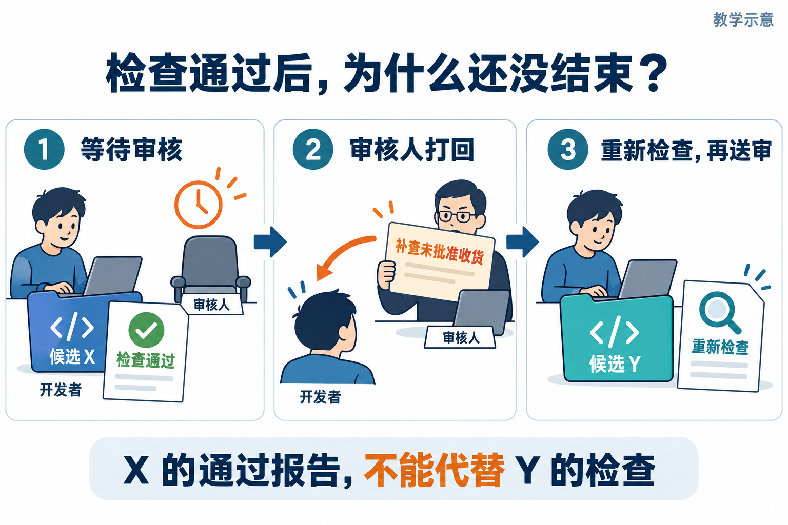
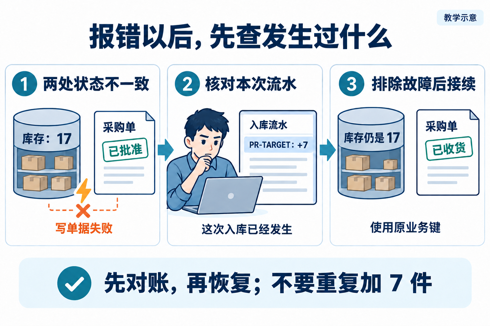

# L12｜用 Graph 显式表达状态、回退和人工审核

L11 交付了采购申请，但“提出想买”还没有完成补货。下一步，FlowERP 要支持负责人批准后收货，并保证同一次收货重试不重复加库存。

这次软件开发仍然需要分工、检查和人工决定。假设 Codex 改出一版，检查通过，交付审核人今天却不在；明天收到打回意见，又该从哪里继续？L04 就已经要求人审，本讲新增的是**把等待、打回、恢复变成工作台能够保存并执行的状态规则**。

你设计允许的去向，Codex 协助实现，工作台记录正在等谁、审核哪版、还剩多少预算。这些位置和去向组成 **Graph，状态图**。先沿一次软件交付理解它，再核对获准交付的软件是否遵守采购业务的批准与收货规则。

## 1｜先停下来：通过检查，不等于交付结束

把刚改好的软件叫作候选 X，意思是“这版准备接受检查与审核的代码”。X 通过自动检查（Eval）后，工作台把 X、它的报告和需要人判断的问题交给审核人，状态停在“等待人工审核”（程序中记为 `awaiting_human_review`）。

此时可以保存状态、结束本次执行。没有人的新决定，下次打开仍然是等待，不重复修改，也不自动接受。

**图 12-1　候选 X 检查通过后等待人审，被打回后形成 Y，再重新检查送审**

*沿着三格往后看：今天等人，明天收到打回意见，返工形成新版本。等待本身就是一个正常结果。*

这比 L10 的循环多了什么？Loop 决定是否再修一轮；这里还要等待外部决定，决定没来就不推进。工作台因此需要明确记录“现在在哪里”，而不只是执行完一条命令就接着执行下一条。

## 2｜审核人打回了，为什么必须再检查一次

第二天，审核人指出：“没有看到未经批准收货会被拒绝的检查。”于是打回 X。

负责这次交付的人与主 Agent 先保留意见，再确认要补做哪些工作。如果只是漏了检查，就补检查；检查若暴露实现缺陷，再修实现。修改后得到 Y，X 的通过报告仍留在历史里，但不能用它说明 Y 正确。

所以路径是：形成 Y，检查 Y，通过后重新等人审核 Y。如果预算已用完，就保存意见和剩余工作，停止自动返工。

把刚才发生的事写成表，就有了一个最小状态图：

| 现在在哪里 | 发生什么 | 接下来去哪里 |
|---|---|---|
| 修改 | 已形成新的代码版本 | 检查这版代码 |
| 检查 | 有效报告通过 | 等人审核 |
| 检查 | 失败且还有预算 | 返回修改 |
| 等人审核 | 没有新决定 | 保持等待 |
| 等人审核 | 接受当前版本 | 完成 |
| 等人审核 | 打回且还有预算 | 保留意见，返回修改 |
| 需要继续时 | 异常或预算不足 | 记录原因，停止或交回诊断 |

表中的位置是**节点**，允许的去向是**边**，“通过”“有预算”等是走这条边的条件。程序每次执行当前动作，再用实际结果决定下一步；不能从“修改”直接跳到“完成”。

这张表规定可以走哪些路线；每次运行还要记录实际从哪里走到哪里，叫作**运行轨迹（Trace）**。顺利完成过一次，只验证了其中一条路线；还要分别检查等待、打回和异常时程序怎样处理。

## 3｜重启以后，怎样知道上次在审核哪版

如果只保存“等待审核”，明天接手的人仍然不知道：等的是 X 还是 Y？对应哪份报告？已经返工几次？审核人为什么打回？

因此，工作台要把下面这些事实一起保存，交给下一次运行。它们合称共享状态：

> 任务：开发“采购批准后才能入库”的软件功能。
>
> 当前候选：Y。当前报告：检查 Y 的这份报告。
>
> 当前状态：等待审核。历史意见：X 曾因缺少拒绝路径检查被打回。
>
> 已用轮次、剩余预算，以及真实决定者的决定对象、理由与时间。

收到“同意”时，程序先比对：决定指向的是 Y 吗？所依据的报告也属于 Y 吗？若仍指向 X，就不能推进。还要确认决定确实来自有权审核的人。任何人都能随手填写的姓名文本，不能独自证明这一点。

形成新版本时，可以把旧报告和决定留到历史里，取消“当前版本已通过、已获批准”的标记，等新检查与新决定到来后再更新。这样换了代码，就不会继续沿用旧结论。保存若失败，也要明确报错，不能声称进度已经可靠记录。

普通 Python 的状态对象和条件分支就能实现这套规则。先把每条允许路径做对，再考虑框架。节点里做什么与何时允许往下走，是两个需要分别检查的问题。

## 4｜软件被接受了，采购单就能入库吗

沿着这条推演，Y 最终通过检查并被交付审核人接受，软件开发这件事结束了。接着让业务人员使用这版 FlowERP，处理采购申请 PR-TARGET：商品 A 申请采购 7 件，当前在库 10 件，其中 2 件已被其他订单预占。

可以立刻把库存加到 17 吗？还不行。刚才接受的是软件 Y，接下来需要采购负责人批准的是 PR-TARGET。这两项决定针对不同对象。

**图 12-2　软件交付审核与采购业务批准分别针对软件候选和采购单**

*上排看软件版本，下排看采购单号。即使同一个人承担两种职责，也要分别作出决定。*

负责人批准采购时，货还没有收到，在库仍是 10。实际收到 7 件并登记后，才变为在库 17、预占 2、可用 15，同时新增一条记录“PR-TARGET 入库 7 件”的库存流水。

这里可以看出，状态名本身还不够。即使两条记录都写着“已批准”，一条批准软件 Y，另一条批准别的采购单 PR-OTHER，也都不能授权 PR-TARGET 入库。我们必须先写清对象及关系：候选关联检查和交付审核；采购申请关联采购批准；收货关联指定采购单与库存流水。

这份业务含义说明叫**最小领域本体**。先用几行说明“是什么、用什么编号识别、与谁有关、允许做什么”即可。这给状态图提供了判断依据：批准的是哪张单、哪些内容、由谁确认；这些约定改变时，原来的决定还能不能用。例如数量从 7 改为 10，就要重新判断负责人对 7 件的批准是否仍有效。

## 5｜收货时报错，下一次能不能直接重做

先考虑一个没有正确覆盖全部写入的事务所造成的故障，用它说明为什么需要对账与原子提交：服务已经增加 7 件库存并写了流水，更新单据为“已收货”时却失败了。此时库存是 17，单据还写“已批准”。

若重启后只看单据，直接再加 7，就会变成 24。报错也不等于什么都没做，所以恢复的第一步，是把采购单、库存和属于本次收货的流水放在一起核对，这就是对账。

**图 12-3　库存已经增加且本次流水存在时，排除故障后使用原业务键接续，避免重复入账**

*从左到右：发现不一致，找到属于本次的 +7 流水，再决定怎样接续。不要跳过中间核对。*

先查这次收货的流水。如果没有本次流水、库存也未增加，还要确认原请求已经结束、不会延迟写入，再核对批准和请求，按原业务键重试；如果本次 +7 已存在，应暂停重复入账，核对是否存在受支持的恢复入口。只有查清故障、确认恢复范围后才接续单据更新，不能根据库存总数手工补一笔。

系统怎样认出“这次收货”？可以为它分配一个唯一标识，例如 `receipt:PR-TARGET:01`。这里是示例写法，表示 PR-TARGET 的这一次收货，通常称为**业务键**。失败后重试仍带这个标识，系统才有依据找到原来的操作。

这里有两项互补设计。把库存、流水和单据的修改放进一个正确的**事务**，成功时一起保存，失败时全部撤回，可以避免前面那种只写入一半的状态。**幂等**让同一业务动作重试时不重复生效，处理“可能已经做过，只是没有收到成功回应”的情况。

因此，同一次收货超时后应保留原业务键，并核对对象和请求内容。每点一次就换新键，会失去识别重试的依据；如果相同的键已经属于其他采购单或不同数量，必须拒绝或查明，不能只看“键存在”就宣布本次成功。

这张图是一种部分写入故障的教学推演，不是建议遇到任何异常都重试。安全恢复要核对实际流水和故障位置；真实环境有并发业务时，也不能仅看库存总数。

## 6｜实现并验收等待、打回和恢复

按[实践操作手册](实践操作手册.md)第 1～3 步观察等待、批准后入库与重试；第 4 步写自己的状态判断，第 5 步建立自己要修改和检查的代码版本；第 6 步验证真实等待与继续，第 7 步核对同一候选的采购规则，第 8 步完成对账。

参考程序 `agent/graph.py` 提供了观察流程的起点。例如，它可以记录从 develop（修改）走到 test（检查），但这条记录本身不代表它实际调用了 Codex 改代码。控制实验还用预先准备的报告与审核输入来演示流程；自己的交付需要接上真实修改、真实检查和责任人的决定，再核对采购结果。更详细的已有能力与缺口，放在扩展阅读中。

请同伴给你三个反例：直接从修改跳到完成；给 Y 提交 X 的旧批准；状态文件损坏后恢复。说明每种情况应拒绝什么、保留什么，再运行自己的实现。原始判断、失败、修订与反馈写入[提交模板](SUBMISSION.md)。

完成自己的实验后，把同样的问题迁移到软件发布：批准针对哪个构建版本？发布超时后先查当前版本，还是直接重发？对象、允许路径和已发生动作，是这套方法能复用的部分。

需要写代码时，查[实现细节与扩展阅读](实现细节与扩展阅读.md)中的审核函数、完整状态说明和故障实验；历史材料在[参考详解](参考详解.md)。

## 本讲留下什么，下一讲怎样接着用

本讲交出采购批准与收货能力，以及可记录等待、返工和恢复的状态图。回看前十二讲，需求、范围、检查和人审一直都在；新增的是让工作台逐步替你组织这些步骤，交接时仍能说清检查了哪版、谁作了什么决定。

[课程蓝图与学习路线](../课程蓝图.md#l01l12-的连续学习路线) · [实践操作手册](实践操作手册.md) · [上一讲](../L11/辅导资料.md)

## 课程大纲中的本讲要求

- **核心内容**：共享状态、条件分支、审核打回、异常路径和人工介入；原生 Subagents 与外部编排框架的边界。
- **演示结果**：开发 → 测试 → 审核；审核失败回到开发，关键决策等待人工确认。
- **课内增量**：用最小 Python 状态图实现移交、回退、状态保存和审核结论。
- **通过标准**：状态变化可追踪；审核结果来自 Eval；循环有上限；异常不会被静默忽略。

配图为教学示意；来源与提示词：[新增案例图与完整提示词](assets/reading-story-20260926/生成说明.md)、[两种批准](assets/reading-figures-v2/01-two-approvals.prompt.md)、[等待与打回](assets/reading-figures-v2/02-review-return.prompt.md)、[核对后接续](assets/reading-figures-v2/03-safe-retry.prompt.md)。
