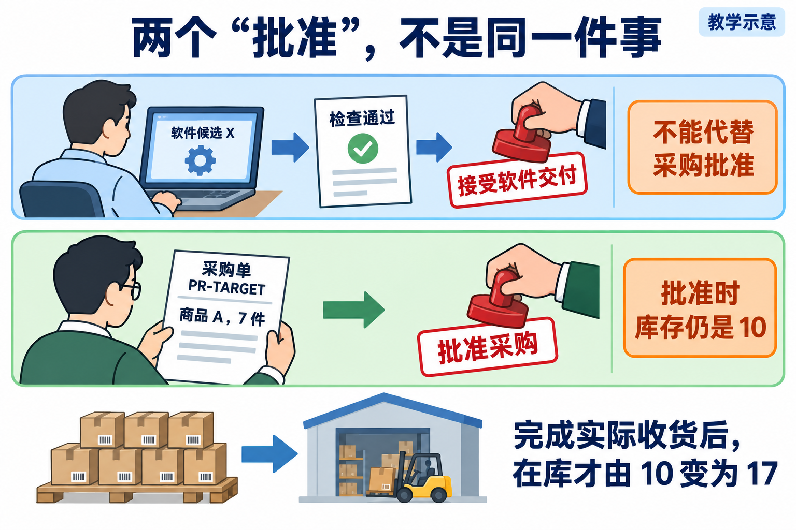

# L12｜用 Graph 显式表达状态、回退和人工审核

Graph 不是采购流程本身，也不是一张只供人看的流程图；它是一个会根据当前事实选择下一步、保存过程并控制停止或回退的程序。

*读图：上层看组成，中层看允许路径，下层看运行轨迹和共享状态。*

上层回答 Graph **由什么组成**：节点表示当前要做的事，边表示可以去哪里，条件决定哪条边能走，共享状态保存一路需要携带的事实，执行器真正运行节点并保存结果。中层回答 Graph **怎样控制流程**：检查失败返回修改，无人决定就继续等待，审核打回再次修改，批准后才能完成，异常或预算耗尽则停止并留痕。下层回答 Graph **怎样留下证据**：每走一步都更新当前节点、候选版本、Eval 报告、剩余轮次、审核决定和错误原因。整张 Graph 定义所有允许路径；一次实际执行留下的 Trace，只是其中真正走过的一条路径。

## 0｜Graph 控制推进，但不替人批准业务

**流程可以自动运行，但需要人的决定时必须停下来。**

> **案例｜申请补货 7 件，不等于已经批准**
>
> 仓库里有 10 件商品 A。有人提出“再买 7 件”，系统生成采购申请 PR-TARGET。此时只发生了申请，库存仍为 10 件。

请先记住：**采购申请只是“想买”，不是“已经同意购买”。** 所以此时库存还是 10，不能直接改成 17。

### 这件事为什么不能全部交给 Codex

Codex 可以帮助你修改程序，也可以运行检查，但它不能替公司负责人决定“这笔采购可以花钱”。这个决定必须由真实的人作出，并留下姓名和决定内容。

事情还可能不顺利：程序检查失败了，要回去修改；负责人不同意，要停下来等；程序运行到一半关闭了，下次打开后还要知道上次做到哪里。

因此，我们需要一个“流程管理员”。它不替任何人作决定，只负责记住：

1. 现在进行到哪一步；
2. 下一步能不能继续；
3. 出错以后应该退回哪一步；
4. 程序重新打开后应该从哪里接着做。

本讲把这个“流程管理员”叫作 **Graph**，中文可以先理解成“可执行的流程图”。它不是一张只供人看的图片，而是一段真正控制流程的 Python 程序。

### 这一讲你实际要做什么

先阅读本文理解路线，再打开[实践操作手册](实践操作手册.md)，按照下面六步操作：

| 第几步 | 在哪里做 | 你要做什么 | 正确结果 |
|---:|---|---|---|
| 1 | 个人研发工作台 | 让 Codex 修改“未经批准不能入库”的程序 | 得到一版等待检查的新程序 |
| 2 | 个人研发工作台 | 运行 Eval。Eval 就是课程提供的自动检查 | 检查失败就回到第 1 步；通过才继续 |
| 3 | 个人研发工作台 | 把这版程序和检查结果交给软件审核人 | 审核人打回就回到第 1 步；接受才结束软件修改 |
| 4 | FlowERP | 请采购负责人处理 PR-TARGET | 未批准就停下；批准后才允许收货 |
| 5 | FlowERP | 登记收到 7 件商品 A | 库存从 10 变成 17，并出现一条增加 7 件的记录 |
| 6 | FlowERP | 对同一次收货再操作一次 | 库存仍是 17，不能错误地变成 24 |

### 失败时应该看到什么

- 自动检查失败：流程显示“返回修改”，而不是假装完成。
- 软件审核人打回：保留打回理由，修改后重新检查新版本。
- 采购负责人没有批准：流程停在“等待批准”，库存仍是 10。
- 入库时程序中断：先查看库存和入库记录，确认有没有加过这 7 件，再决定是否重试。

### 看到什么才算完成

不能只看到页面上写着“完成”。你至少要看到：

- 工作台保存了“修改 → 检查 → 等人审核”的实际过程；
- 打回时确实回到修改，重新打开程序后还能接着做；
- PR-TARGET 上有真实负责人的批准记录；
- FlowERP 中库存是 17，并且只有一条属于本次收货的 +7 记录；
- 同一次收货再试一次，库存没有变成 24。

如果你现在只记住一句话，请记住：**L12 教你做一个会停下来等人、出错会退回、关闭后能接着运行的流程，最后安全完成一次需要真人批准的采购入库。**

下面第 1 节会解释一个最容易混淆的问题：为什么“程序检查通过”以后，仍然不能直接把商品加入库存。完整实验记录、源码分析和术语说明需要时再查[参考详解](参考详解.md)，现在不必先读。

## 1｜先分清两个“批准”，再谈下一步

**软件候选通过审核，不能替代具体采购单的业务批准。**

> **案例｜采购批准与软件验收不是一回事**
>
> 沿用 L11 的采购案例：商品 A 在库 10 件，其中 2 件已经被其他订单预占，所以可用量为 8。现在，采购单 PR-TARGET 申请补货 7 件。

如果“审批后才能入库”的软件已经测试通过，能直接把这 7 件加到库存吗？**不能。** 软件检查与这张采购单的批准，是两件事。

*读图：上排接受软件，下排批准采购；两种批准针对不同对象。*

审核人判断软件候选 X 是否符合需求，依据包括实际改动、检查报告和风险。接受的是这一版软件，不是替 PR-TARGET 作采购决定。

业务负责人批准的是 PR-TARGET 上的商品 A、7 件及相应采购事项。批准时货还没入库，因此在库仍是 10。只有按规则完成实际收货，才增加到 17。

数量也要跟着核对：

| 时点 | 在库 | 已预占 | 可用 | 属于本次收货的流水 |
|---|---:|---:|---:|---|
| 提出申请 | 10 | 2 | 8 | 无 |
| 批准采购 | 10 | 2 | 8 | 无 |
| 完成收货 | 17 | 2 | 15 | 一条 +7 |
| 同一次收货重试后 | 17 | 2 | 15 | 仍为同一条 |

表中只数本次收货的流水，不是整库流水总数。其他订单的预占和其他采购单不应被这次操作改动。

本讲用这次交付练习分工：你确认业务规则、允许修改范围和流程；Codex 协助建设工作台的状态控制，再在授权范围内修复 FlowERP；真实审核人依据同版材料作决定。示例数字和图用于教学，不代表已经发生真实审批或实际入库。

## 2｜Graph 不是再画一张总览图，而是把去向写清楚

L10 已经能安排有上限的重复修复，L11 能把独立任务分出去。现在遇到更多情况：检查失败要返工，检查通过要等人，审核打回要重新修改，异常时可能必须停止。

如果只有“开发完就检查，检查完就结束”的顺序脚本，它说不清这些分支。**Graph 在本讲指可执行的状态图**：列出当前在哪一步、允许去哪里、什么条件下才能过去。它不是统计图，也不是知识图谱。

先用一句中文说清，再认识术语：

> 这版修改完成后检查；有效检查通过就等人；检查失败且还有预算就返工；人接受当前版本才完成；异常或预算不足就留下原因并停止。

这句话里面有五个部分：

| 名称 | 用一句话理解 | 本讲例子 |
|---|---|---|
| 节点 | 现在做哪一步，或停在哪里 | 修改、检查、等待审核 |
| 边 | 允许从哪一步到哪一步 | 检查通过后进入等待 |
| 条件 | 凭什么允许走这条边 | 报告有效、对应当前版本、阻断项通过 |
| 共享状态 | 交给下一步一起带走的事实 | 候选版本、报告、轮数、人的决定 |
| 执行器 | 真正调用动作并推动流程的程序 | 运行检查、读取结果、记录下一步 |

**节点名只是一个位置，不是动作已经发生的证据。** 写着“开发”不代表 Codex 真改过代码；写着“完成”也不代表检查与审核已经发生。

执行器每次要做四件事：读取当前事实，执行该节点的动作，依据结果判断允许去向，保存转移及原因。到等待点就交还控制权，没有人的新决定就继续等待。

图规定的是所有允许路径；一次实际运行留下的**轨迹**，只是这次走过的路径。顺利走完一遍，不能证明打回、超时和恢复也正确。普通 Python 的状态对象和条件分支就能实现最小 Graph，不必先引入新框架。

## 3｜跟着候选 X，走完一次等待、打回与重新审核

**审核绑定具体版本；打回后的新候选必须重新取得检查和审核依据。**

> **案例｜候选 X 被打回，形成新候选 Y**
>
> 下面是一条设计推演，不是运行记录。假设已接入真实受控修改、有效 Eval 和具名人审，且预算允许返工。
>
> 第一步，Codex 按确认范围修改，形成候选 X，留下实际差异。
>
> 第二步，检查 X，得到属于 X 的报告。若阻断项通过，把 X、报告和待决问题交给审核人。此时状态是“等待审核”，不是“交付完成”。
>
> 第三步，审核人发现缺少某个拒绝路径的验证，提出“补测拒绝路径”，打回本次交付。保留意见和 X 的原报告，再确定返工范围。打回不是把失败历史删掉。
>
> 第四步，按意见形成新候选 Y，重新检查。这里可能只补测试，也可能发现问题后需要修实现；以实际差异为准，不能预先断言业务代码必然变化。

*读图：X 被打回后形成 Y，Y 必须重新检查和审核。*

第一栏 X 已检查但仍等人；第二栏是审核人提出返工意见；第三栏 Y 必须重新检查，通过后再次等待审核。图里的 X 和 Y 表示两个候选版本，不是要求你创建两个同名文件。

> **案例续｜重新审核 Y**
>
> 第五步，审核人确认当前对象确实是 Y，读取 Y 的材料后接受，才完成这次软件交付。若仍不接受，就按剩余预算决定再次返工或停止。

如果另一条路径中 X 曾被批准，后来又改成 Y，X 的旧批准也不能直接用于 Y。**审核要同时绑定任务、候选、报告和决定者，不能只留下“同意”两个字。**

### 其他结果怎样分流

- 检查有明确业务失败：在剩余预算和原授权内返工，再检查新候选。
- 检查异常、没有有效报告：先排查检查为何没完成，不能当作零失败。
- 检查通过、没人决定：保存材料并等待，不能替人批准。
- 人打回、预算已用完：留下意见和剩余工作，停止自动推进。

等待、停止、执行失败各有原因，不能统统写成“成功”，也不能把正常等待误说成业务失败。

## 4｜共享状态要保存“审核哪一版”，而不只是“等人”

**共享状态要保存当前对象和判断依据，而不只是阶段名称。**

> **案例｜只保存“等待审核”，别人接不上**
>
> 假设状态文件只有“等待审核”。第二天另一个人打开它，会问：等谁？检查的是哪个版本？用的哪份报告？为什么等？还剩几轮？文件回答不了，流程就接不上。

一份可接手的共享状态，至少要保留任务目标、当前节点、已用轮数、候选身份、报告引用、实际差异、审核决定和错误原因。报告所在路径只是线索，文件可能被覆盖，还应能核对内容和候选是否对应。

开发步骤产生 Y 后，应让旧报告和旧决定留在 X 的历史中，为 Y 重新取得依据。只改“当前候选”字段，却保留 X 的通过标记，会让流程拿旧绿灯批准新代码。

### 为什么这里还需要“最小领域本体”

> **案例｜同样写 approved，批准对象却不同**
>
> 先看一个反例：两条记录都写“approved”。一条批准软件 X，另一条批准采购单 PR-OTHER。哪条能授权 PR-TARGET 入库？**都不能，批准对象不对。**

因此，要先写清对象的含义、身份、关系、允许动作和约束，以及谁确认了这些规则。本讲把这份简短的业务含义说明称为**最小领域本体**，不用安装 OWL、RDF 或知识图谱平台。

可以先写这样一张小卡：

> PR-TARGET 是申请采购商品 A、7 件的单据，不是软件任务编号。采购批准必须指向这张单据及仍有效的内容。收货事件履行这次批准，改变对应库存。软件候选 X、检查 X 的报告和对 X 的交付审核，另行关联，不与采购批准混用。

实际作业再把采购申请、采购审批、入库事件、库存余额、软件候选、Eval 报告和交付审核分别列清。每类对象都有身份、关键关系、动作约束、来源和确认状态，未确认的建议就保留待决定。

本体回答“对象与规则是什么意思”，Graph 回答“据此允许怎样推进”。两者不是两套并列流程。采购数量由 7 改成 10，即使单号没变，也应重新判断旧批准是否覆盖新内容；语义或规则变化同样要有版本，不能静默改变旧任务依据。

## 5｜重启后，不要只看流程停在哪个词

**持久化**是把状态保存下来，进程退出后仍能读取。**安全恢复**则要判断哪些动作确实发生过，接下来可以做什么。能读文件，不等于能安全重做动作。

> **案例｜库存已增加，单据却未更新**
>
> 看一次具体故障：采购已经批准，服务先增加 7 件库存，再更新单据为“已收货”。第二步写单据时出错，程序报错退出。

*读图：比较故障后的库存与单据；按原业务键接续，不重复入账。*

出错后库存已经是 17，而且本次 +7 流水已经存在；单据却还写着“已批准”。核对事实、排除故障后，参考恢复路径使用原入库键重试，库存仍为 17，只补齐单据状态。

如果只看“已批准”就重新加 7，库存会错误地变成 24；如果只看报错就断言“什么都没发生”，也会错判。

这里需要两个不同机制：

- **事务**：让一次业务动作中应共同生效的数据库变化一起成功或一起失败，避免只完成一半。
- **幂等**：同一业务动作重试时不重复生效，帮助处理“可能已经做过”的不确定性。

图示对应原参考实验的一条恢复路径，不是建议遇到所有报错都直接重试。恢复成功，也不能倒推第一次操作没有部分提交。是否可以安全接续，要核对批准、库存、流水和真实故障点。

幂等键还要对应正确业务。若拿“期初入库”的旧键给 PR-TARGET 收货，服务只认“键存在”就当成功，可能导致库存没增加，单据却写成已收货。因此需要识别业务对象及请求内容，而不只是查一个字符串是否出现过。

同样，加载状态文件失败、执行异常、检查异常、保存状态失败，应分别验证。保存本身失败时，不能再声称失败记录已经可靠保存。无法确定动作是否完成时，保留事实并交人核对。

## 6｜课程支架能演示什么，你还要实现什么

[参考 Graph](../../../agent/graph.py)帮助观察控制路径，但不能当作所有交付能力已经完成：

- develop 节点目前主要推进状态，并没有实际调用 Codex 开发；需要在自己的候选中接上受控执行。
- 记录一次节点跳转，不等于已经独立校验所有允许边。应拒绝从开发直接跳到完成等越界转移。
- 空结果、旧报告和对象不匹配，应由消费者验证，不能只信“阻断数为零”。
- 非空 reviewer 字段能留下署名文字，不会自动验证真实身份和权限。
- 默认本地演示可能自动完成；验证真实人审时必须明确启用等待，取得实际责任人的决定。

这些是支架与个人实现的边界，不是让你绕过要求的理由。参考控制实验中的检查次数、轮数字段和真实开发次数也要分开；课程要求有上限，不代表某个 rounds 数字就证明真实修复了同样多次。

L11 的 Subagents 解决独立任务如何分派，Graph 解决步骤依赖、等待与回退；节点不必一一对应 Agent。外部编排框架可以帮助组织代码，但不会自动补齐采购权限、事务或审核对象绑定。基础交付仍按最小 Python 状态图及相同验收要求完成。

保存 Graph 进度也不是跨事项经验记忆。把这次方法提炼给下一项工作时，还需要记录来源、适用边界、采用版本和新的复验；不能因为有一个状态文件就宣布工作台已形成完整学习闭环。

## 7｜现在按什么顺序做实践

打开[实践操作手册](实践操作手册.md)：

| 手册位置 | 带着什么问题去做 | 应留下什么 |
|---|---|---|
| 第 1 步 | 软件审核与采购批准分别针对什么？ | 首次判断、两套状态表、数量预期 |
| 第 2～3 步 | 控制支架真做了什么，采购状态是否对账？ | 控制轨迹与业务前后状态，分开记录 |
| 第 4 步 | 怎样把自己的 Graph 接上真实动作？ | 授权范围、实际差异、个人候选 |
| 第 5～6 步 | 等待、打回、恢复是否作用于同一对象？ | 新旧版本报告、真实决定、异常与复验 |
| 第 7 步 | 换成发布流程，哪些机制可复用？ | 迁移判断、同伴反例与修订 |

FlowERP 要留下“审批后才能入库、同一次收货不重复入账”的可验证结果；工作台要留下显式状态、回退、保存和人审能力。不要只演示几个状态名，也不要拿讲师临时库实验替代个人交付。

先口头回答三题：

1. X 的软件检查全绿，但 PR-TARGET 未批准，能入库吗？——不能，两类决定不同。
2. 状态仍是 approved，库存却已为 17，能直接再加 7 吗？——不能，先核对本次流水和故障点。
3. 打回后形成 Y，能用 X 的绿报告结束交付吗？——不能，重新检查并审核 Y。

读懂这一讲，不在于记住所有英文状态，而在于能说明：**现在依据什么停在这里，什么条件才允许下一步，出错后凭什么安全接续。** L13 接着解决：别人如何提交这项工作，并在离开页面后继续查到它。

## 本讲合同（与课程大纲一致）

本讲对应 CLO-5：跨角色协作与人审。

- **核心内容**：共享状态、条件分支、审核打回、异常路径和人工介入；原生 Subagents 与外部编排框架的边界。
- **演示结果**：开发 → 测试 → 审核；审核失败回到开发，关键决策等待人工确认。
- **课内增量**：用最小 Python 状态图实现移交、回退、状态保存和审核结论。
- **通过标准**：状态变化可追踪；审核结果来自 Eval；循环有上限；异常不会被静默忽略。

本文未重新运行原实验，也未更新 PPT 或 Word。原核验日期、实验来源和课件页码说明见[参考详解](参考详解.md)。

配图使用内置 ImageGen，均为教学示意。图与提示词：[两种批准](assets/reading-figures-v2/01-two-approvals.prompt.md)、[等待与打回](assets/reading-figures-v2/02-review-return.prompt.md)、[核对后接续](assets/reading-figures-v2/03-safe-retry.prompt.md)。
