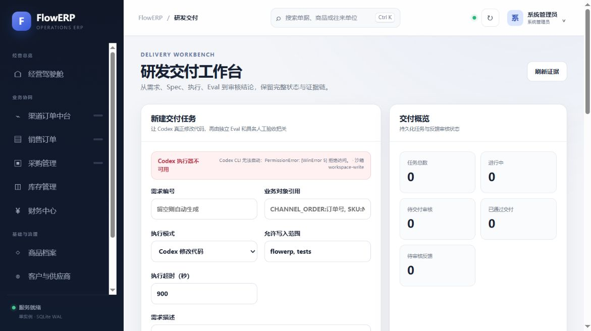
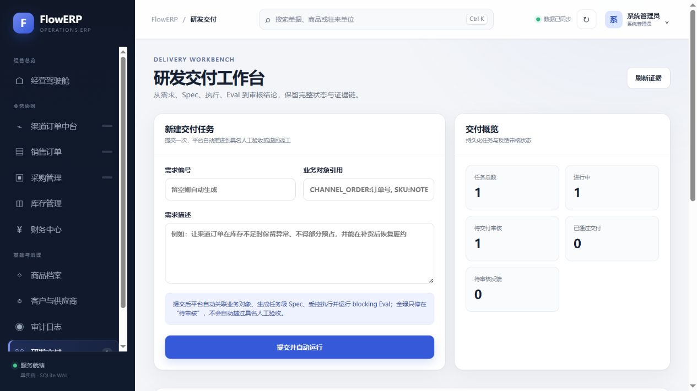
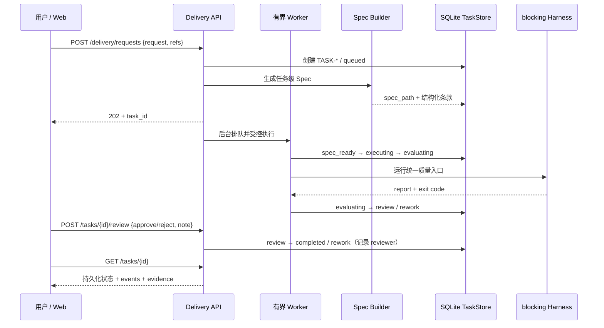
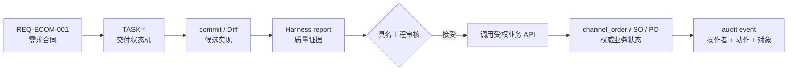
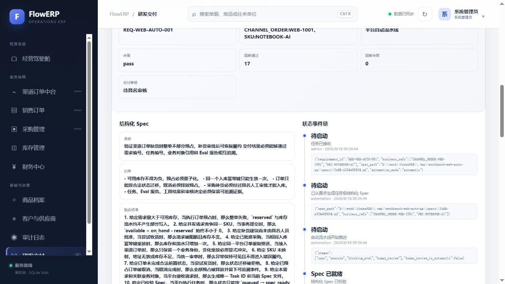
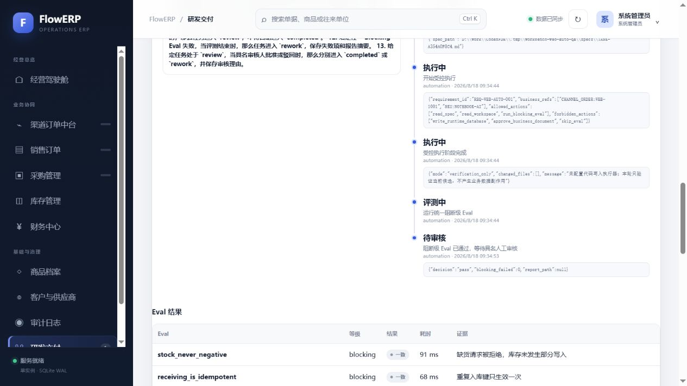
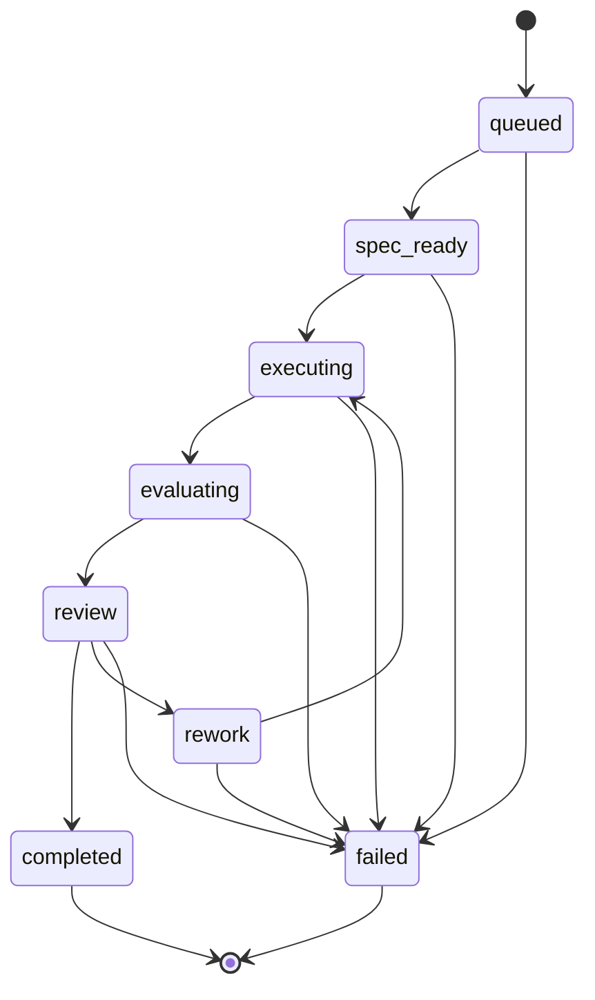
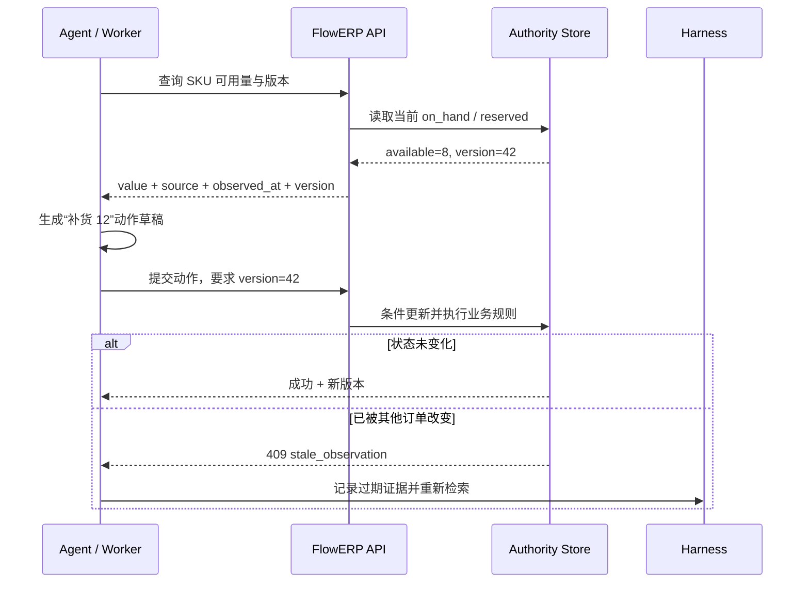
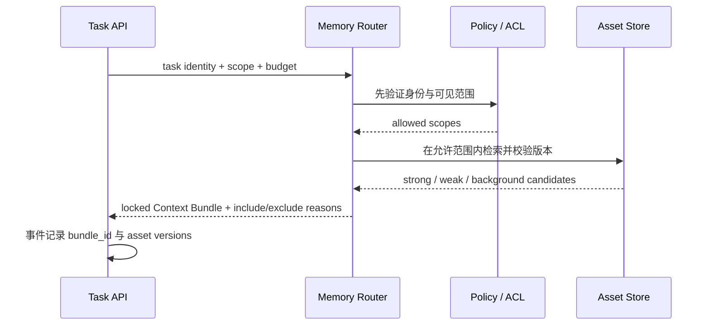
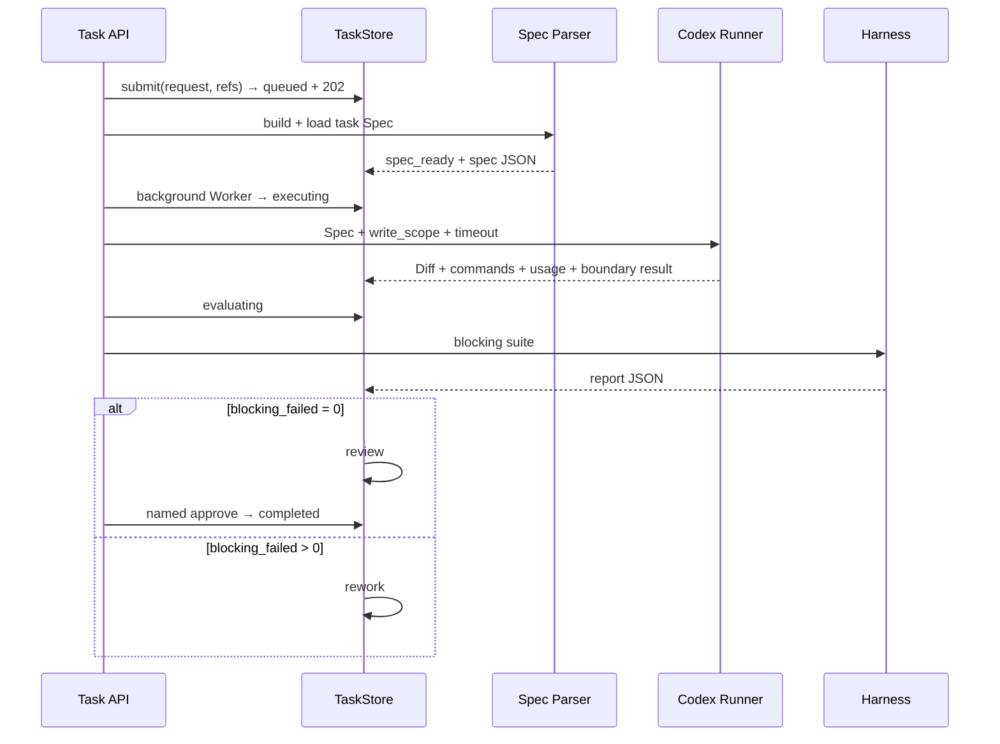

# L13｜把执行链路封装成任务 API

- **核心内容**：任务模型、异步执行边界、状态机、持久化和最小权限。
- **演示结果**：提交任务后获得 ID，并查询 Spec、执行阶段和最终结果。
- **课内增量**：实现任务提交与状态查询两个最小接口。
- **通过标准**：状态只按合法路径变化；失败原因可查询；已完成任务在服务重启后仍可读取。

> 课程建设状态说明：本讲 API 端点、状态模型、活动和评价规则属于已经形成的课程设计；学生资源草图、竞态实验、重启证据和达成数据属于待真实开课采集。参考服务能够响应不能替代学生对异步语义、原子迁移和错误合同的掌握。

## 国家级一流本科课程教学设计卡

| 维度 | 本讲设计 |
|---|---|
| 对应课程目标 | CLO-6：把本地执行链设计为有身份、可查询、可恢复的任务资源 |
| 工作台主线增量 | 建立任务提交、状态查询、持久化和最小权限 API |
| FlowERP 的作用 | 通过 Task API 提交并完成补货需求，检验结果与采购/库存对象回链 |
| 高阶性 | 分析同步调用与异步资源的边界，设计状态机、错误合同、持久化和最小权限 |
| 创新性 | API 不只是包装 CLI，而是把交付证据、状态与失败变成权威可查询对象 |
| 挑战度 | 并发竞争、非法迁移、失败查询和服务重启都要验证；`202` 不能冒充完成 |
| 学生中心活动 | 学生先设计资源合同，再用客户端竞态和重启实验反证 API 设计 |
| 课程思政融入 | 通过最小权限、稳定身份和不可伪造状态培养平台责任与数据治理意识 |
| 形成性评价 | API 设计表 + 请求响应矩阵 + 冲突实验 + 重启后同 Task 查询 |
| 持续改进数据 | 统计状态码误用率、非法迁移漏阻断率和重启丢失率，修订 API 支架 |

## 本讲知识合同

| 合同项 | 本讲约定 |
|---|---|
| 主线起点 | L12 的 Graph 状态可恢复，但仍只能由本地进程和状态文件操作 |
| 唯一技术命题 | 如何把交付生命周期建模为异步、并发安全、重启可恢复的 Task 资源 |
| 必须掌握 | 资源身份；`202` 异步语义；原子条件迁移；Worker 持久边界；稳定错误合同 |
| 能力判据 | 能用 API 创建、查询、竞争启动、具名审核并在重启后找回同一 Task 与事件 |
| 本讲不做 | 不设计 Web，不把 202 当完成，不把单机线程冒充队列，不承诺未实现的多实例租约和死信机制 |

## 大纲锚点与前沿校准（2026-08-19）

- **大纲锚点**：只实现任务提交和状态查询两个最小接口，并证明合法迁移、失败可查与重启后可读。
- **前沿采用**：采用资源身份、`202 Accepted` 异步语义、幂等、条件更新和稳定错误合同；callbacks/webhooks 与 Outbox 属增强。
- **不越界**：`202` 不等于完成，单机 Worker 不冒充分布式队列，本讲不设计 Web 或承诺未实现的多实例能力。
- **链路交接**：向 L14 交付权威、可查询、可恢复的 Task 状态及失败证据。详见[校准矩阵](./16讲主线与前沿校准矩阵.md)。

**主线坐标**：Graph 已有状态，却仍锁在本地进程和 JSON 文件里。工程账现在把执行变成有 Task ID、条件迁移、事件历史和持久化证据的服务端资源；业务账与工程账通过 ID 关联，但不合并权限和终态。

**这一讲把系统推进到哪里**：每项 ERP 需求获得稳定 Task ID，并能关联订单、SKU 或采购对象；工作台从一次性脚本升级为可查询、幂等、可恢复的任务资源；`202` 响应、事件链、重启后状态和重复请求结果构成本讲证据。平台化不是套一层 HTTP，而是让执行生命周期拥有权威状态和恢复语义。

## 本讲行动工单：让两个恶意客户端共同检验唯一事实

学员先写 Task 资源、状态和错误合同，再实现提交/查询端点与持久化，并通过 API 提交一项真实补货需求。两名同伴同时领取或审核同一 Task，只能一个成功；重复请求、非法迁移和陈旧版本必须得到稳定冲突且原状态不变。重启后用同一 Task ID 查回 Spec、阶段、事件、失败、reviewer 以及关联的采购/库存结果。

- **工作台增量**：通用 Task API、原子条件迁移、幂等、持久化和错误合同；
- **FlowERP 产品状态**：由工作台 Task API 完成一项真实补货交付；Task API 与 ERP 领域 API 分开建模；
- **失败证据**：并发双成功、`202` 冒充完成或重启丢失至少一项先失败后修订；
- **迁移证据**：为第二类长任务设计资源身份、幂等键和冲突语义；
- **讲师硬门槛**：必须真实并发和重启，顺序调用或进程内假重启不能评分。

详见[可执行任务卡](../../course/tasks/L13-任务API.md)。

## 本讲教学设计总览

| 项目 | 设计 |
|---|---|
| 建议学时 | 30 分钟线上精讲 + 70 分钟线下行动 + 45 分钟 API 合同测试 |
| 课堂类型 | **API 合同审查**：两个客户端同时敲门，服务端必须维护唯一合法事实 |
| 核心问题 | 怎样把一次命令升级为有身份、有状态、有错误语义、可重启恢复的任务资源？ |
| 教学重点 | 资源模型、原子迁移、幂等、事件历史、错误合同、Live Retrieval |
| 教学难点 | 区分 `202 Accepted` 与完成；处理重复请求、并发迁移和陈旧事实 |
| 课堂产出 | API 验收矩阵 + 并发/重启实验 + ID 追溯链 |
| 价值塑造 | 服务端对事实负责，不能信任客户端自报状态或隐藏冲突 |

### 可测学习成果

| 编号 | 学习者能够 | 达成证据 | 达成标准 |
|---|---|---|---|
| L13-O1 | 设计包含身份、状态、事件、结果和业务引用的 Task 资源 | 资源合同 | 字段责任完整，无一个总状态包办全部语义 |
| L13-O2 | 为每个端点规定成功、缺失、校验、冲突和内部错误 | API 验收矩阵 | HTTP/领域语义可区分 |
| L13-O3 | 证明非法与并发迁移只有一个合法结果 | 双客户端实验 | 状态与事件原子一致 |
| L13-O4 | 重启后沿 request/task/event/report ID 恢复同一任务 | 恢复与追溯记录 | 历史连续、无内存态冒充持久化 |

### 30 分钟线上精讲 + 70 分钟线下行动

| 场域与时间 | 学习活动 | 学生当场证据 |
|---|---|---|
| 线上 0–8 分钟 | CLI 关闭后要求另一用户继续审核，学生先列出缺失能力 | AI 介入前资源判断 |
| 线上 8–20 分钟 | 从使用者问题反推 Task 身份、状态、事件和最小端点 | 资源草图 |
| 线上 20–30 分钟 | 示范 `202`、原子 transition、冲突错误和重启持久化 | 状态—端点表与竞态预测 |
| 线下 0–18 分钟 | 创建任务并轮询到 review，核对 Spec、Eval 和事件 | 正常路径记录 |
| 线下 18–34 分钟 | 两个客户端并发启动或审核同一 Task | 409、唯一成功者和状态不变证据 |
| 线下 34–50 分钟 | 重启服务查询同一 Task，并注入陈旧事实验证实时读取边界 | 恢复与 Live Retrieval 记录 |
| 线下 50–70 分钟 | 同伴按状态码矩阵进行恶意客户端合同测试 | API 验收矩阵、ID 追溯链与离场票 |

### 达成度与持续改进

采集 HTTP/领域错误分类正确率、非法迁移阻断率、并发单胜者率、重启恢复率和 ID 回链率。非法迁移与并发单胜者必须 100%；若超过 15% 学员把 `202` 解释为完成，增加异步接受语义实验；恢复只读到快照而读不到事件的实现仍判未达成。

## 本讲现场｜一条命令变成一项可恢复的任务

此前的 Demo 都在终端发生。业务负责人关闭窗口后，不知道任务 ID，不知道运行到哪一步，也无法从另一台机器继续审核。第 13 讲把执行链改造成任务资源：产品入口 `POST /api/v1/delivery/requests` 接收一次请求便返回 `202`，后台自动生成任务级 Spec、关联业务对象并推进到 `review` 或 `rework`；`/tasks`、`prepare`、`start`、`evaluate` 仍作为逐阶段调试和恢复入口；事件链和证据落入 SQLite。客户端刷新或服务重启，都重新读取同一权威状态。







截图的重点不是页面好看，而是 `queued` 的真实语义：请求已经持久化，但 Worker 可能正在排队。自动化并不等于跳过授权；提交动作只授权技术流水线运行，采购批准、业务入库和最终交付审核仍是另一组具名权限。

这里还要区分两套 API：FlowERP 业务 API 操作商品、订单、库存、采购和财务等权威对象；Workbench Task API 操作 Spec、Eval、审核和交付任务。Agent 可以编排后者并在授权下调用前者，但 Task `completed` 不能替代采购 `approved`、订单 `shipped` 或凭证 `posted`。

| 边界 | FlowERP 业务 API | Workbench Task API |
|---|---|---|
| 权威对象 | 商品、库存流水、订单、采购、凭证 | Spec、执行任务、Eval 报告、交付审核 |
| 核心不变量 | 库存非负、幂等、业务状态机、审批分权 | 合法任务迁移、失败可追溯、报告与任务一致 |
| 典型调用者 | ERP 页面、受权业务服务、集成系统 | Codex 工作流、CI、交付面板、工程评审者 |
| `completed` 的含义 | 只对具体业务动作成立 | 只表示交付任务达到工程终态 |
| 不可替代对象 | 采购审批人、库存账、财务记账 | 业务审批、订单履约和会计凭证 |

API 化的价值不是让 Agent “什么都能调”，而是把能力切成可审计的资源与动作。读取库存、解释缺口、生成采购草稿可以是不同权限；批准采购与确认收货必须继续由服务端业务规则和具名 Principal 守卫。即使 Agent 的 Prompt 写着“经理已经同意”，服务端也只能相信认证身份、当前状态与合法迁移。

## Task API 是 FlowERP 开始被多人持续交付后长出来的

本地 Graph 能保存一次运行，却无法成为业务负责人、开发者和审核者共同引用的对象。FlowERP 进入持续迭代后，一项需求至少同时拥有四类身份；把它们混成一个 ID，会让技术完成被误解为业务完成。

| 身份 | 例子 | 回答的问题 | 权威来源 |
|---|---|---|---|
| 需求身份 | `REQ-ECOM-001` | 为什么做、验收什么 | Spec 与评审记录 |
| 交付身份 | `TASK-*` | 谁在何时执行、评测和审核 | Workbench TaskStore |
| 业务身份 | `shop_code + external_order_id`、`SO-*`、`PO-*` | ERP 中哪笔订单或采购发生变化 | FlowERP 业务库 |
| 证据身份 | Harness report、Graph run、commit SHA | 哪次运行证明了什么 | 报告、Trace 与版本库 |



这张时序图有两个不可省略的停顿：HTTP 入口返回 `202` 后由 Worker 接管，客户端不需要第二次点击；Blocking 全绿后只到 `review`，必须由具名审核接口决定 `completed` 或 `rework`。





API 必须保存这些关联，而不能把它们折叠成一个 `status=completed`。例如 TASK 完成只证明候选通过工程流程；渠道订单仍可能处于 `exception`，采购仍可能等待业务审批。页面要能从 TASK 下钻到报告，也能从 ERP 异常返回关联需求，但任何跨域动作都重新经过对应权限。

课堂新增一个并发实验：两个客户端读取同一 queued 任务并同时启动。服务端只能允许一个条件迁移成功，另一个得到冲突；不能因为 HTTP 请求都合法，就让同一 Codex 执行和 Harness 运行两次。这正是工作台从个人脚本演化为服务端资源时必须补上的一致性合同。

## API 不是给 CLI 套一层 HTTP

如果 `POST /tasks` 在请求线程中执行全部工作、超时后客户端不知道是否成功，前端只能显示假进度；如果任务只存在内存，服务重启后 completed 消失；如果客户端可以直接把 queued 改成 completed，Graph 的所有门禁都失去意义。

任务 API 首先是领域模型：任务有稳定 ID；请求经过校验；状态只走合法迁移；每次变化形成事件；Spec、Eval 结果和错误被持久化；重复启动有明确冲突语义。HTTP 只是这个模型的传输层。

## 当前任务状态机



`completed` 与 `failed` 是终态。当前 `TaskStore.VALID_TRANSITIONS` 不允许从 queued 直达 completed，也不允许 completed 再执行。状态表比散落的 if 更容易审查、测试和展示。

## Live Retrieval：关键决策必须读取“此刻的世界”

L03 的 Ontology 定义“库存、订单、采购分别是什么意思”；Live Retrieval 负责回答“此刻这个 SKU 有多少可用库存、这张采购单是否已经审批”。它比传统“任务开始前检索一批文档”更严格：Agent 在关键决策前按需读取权威系统，并把来源、版本和观测时间随证据一起带回。



一条可用于行动的检索结果至少包含：`source`、`subject_id`、`observed_at`、`version`、`value`、`authorization_scope`。只有相关文本而没有身份和新鲜度，最多能辅助解释，不能授权修改 ERP。对库存、金额、审核状态等易变事实，向量相似度不是最终裁判，权威事务查询才是。

课程将三类获取方式分开：静态规则由 `AGENTS.md` 和 Spec 提供；历史知识可用关键词、向量或图谱检索缩小范围；实时业务事实通过受权 API 查询。学员要故意制造竞态：Agent 读到可用量 8 后，另一订单先占用 2，再提交原动作。服务端必须因版本过期或业务不变量拒绝，而不是相信 Agent 曾经看到的 8。

当前 FlowERP 课程基线已经有权威业务 API 与状态迁移，但尚未把 `observed_at/version` 信封实现为完整通用检索层。这一节明确区分“已经实现的业务读取”与“生产化挑战线”，避免把架构图冒充现成功能。

## 资源与端点

课程目标端点：

```text
POST /api/v1/delivery/requests  自动生成 Task + Spec，后台推进，返回 202
POST /api/v1/tasks              创建 queued 任务，返回 Task ID
GET  /api/v1/tasks              查询任务列表
GET  /api/v1/tasks/{id}         查询 Spec、状态、结果、错误和事件
POST /api/v1/tasks/{id}/prepare 校验 Spec
POST /api/v1/tasks/{id}/start   开始受控执行
POST /api/v1/tasks/{id}/evaluate 运行 blocking Harness
POST /api/v1/tasks/{id}/run     同步串联前三步，停在 review / rework
POST /api/v1/tasks/{id}/review  由认证身份具名接受或打回
```

创建与启动分离很重要。客户端提交需求后先拿到 ID，即使运行失败也能查询。当前仓库还保留旧演示 `/api/tasks`，正式业务入口以 `/api/v1` 为准；课程正文应如实说明实际实现，不把同步 `run` 描述成成熟异步队列。

### Memory API 不能只是 `/search?q=`：还要返回为什么能用

Task API 解决任务持久化，Evolution API 解决经验晋级；团队 Memory 的生产化挑战线还需要两个独立资源：`MemoryAsset` 保存可继承经验，`ContextBundle` 保存某项 Task 实际获得了哪些经验。检索结果若只有文本和相似度，客户端无法判断权限、版本和适用范围。

```text
POST /api/v1/memory/assets/query       在 ACL 和作用域内查候选资产
GET  /api/v1/memory/assets/{id}        查看来源、版本、证据和生命周期
POST /api/v1/tasks/{id}/context-bundle 生成并锁定本任务上下文包
GET  /api/v1/context-bundles/{id}      查看采用项、排除项、预算和版本
POST /api/v1/memory/usages/{id}/review 记录帮助、无影响或负迁移
```

一个可审计的查询请求至少包含：

```json
{
  "task_id": "TASK-...",
  "team_id": "TEAM-FLOWERP",
  "repo": "CodexFDE",
  "branch": "release/2026-08",
  "business_refs": ["SKU:NOTEBOOK-AI"],
  "failure_signatures": ["stock_never_negative"],
  "asset_types": ["rule", "eval", "skill"],
  "token_budget": 6000,
  "as_of": "2026-08-18T08:00:00Z"
}
```

响应不只返回 `score`，还要返回 `relation=strong|weak|background`、`source_task_id`、`source_evolution_id`、`version`、`valid_from/valid_to`、`scope`、`evidence_refs` 和 `reason_included`。被排除的高相似资产也应以受控方式保留 `reason_excluded=branch_mismatch|expired|acl_denied|future_information`；但无权资产不能泄露正文、标题或存在性，只能在服务端审计中记录。



当前课程代码已经实现 Task、Feedback、Evolution、专属 Blocking 报告和具名验证，但尚未实现通用 `MemoryAsset/ContextBundle` 数据库与检索路由。课堂将上面的接口作为生产化设计与后续代码增量，不能在演示中声称已经具备向量检索、跨 Team ACL 或 CodeGraph 服务。这个边界本身就是 API 诚信的一部分。

## 持久化模型

`TaskStore` 使用两张表：

```sql
CREATE TABLE tasks(
  id TEXT PRIMARY KEY,
  request TEXT NOT NULL,
  status TEXT NOT NULL,
  spec_json TEXT,
  result_json TEXT,
  error TEXT,
  created_at TEXT NOT NULL DEFAULT CURRENT_TIMESTAMP,
  updated_at TEXT NOT NULL DEFAULT CURRENT_TIMESTAMP
);

CREATE TABLE task_events(
  id INTEGER PRIMARY KEY AUTOINCREMENT,
  task_id TEXT NOT NULL,
  from_status TEXT,
  to_status TEXT NOT NULL,
  detail TEXT,
  created_at TEXT NOT NULL DEFAULT CURRENT_TIMESTAMP
);
```

`tasks` 保存当前快照，`task_events` 保存演进轨迹。只有快照无法解释如何到达 completed；只有事件则每次查询需要重放。课程采用两者并存的简单模式，事务中同时更新，保证一致。

## 创建任务

产品化入口把“创建、生成 Spec、启动、评测”收敛为一次提交，但每个内部阶段仍有持久事件：

```json
POST /api/v1/delivery/requests
{
  "request": "处理 SKU:NOTEBOOK-AI 对应的 CHANNEL_ORDER:EC-20260817-1001",
  "requirement_id": "REQ-ECOM-001",
  "business_refs": ["SKU:NOTEBOOK-AI"]
}
```

平台会合并显式引用与正文中识别出的标准引用，生成 `.runtime/specs/TASK-*.md`，先解析六个必要章节，再交给后台 Worker。若需求编号为空，则生成 `REQ-AUTO-{日期}-{随机标识}`；若没有识别到 ERP 对象，则至少保留 `REQUIREMENT:{requirement_id}` 作为追溯锚点。自由文本不会直接变成 SQL、采购批准或库存写入。

手动 `POST /api/v1/tasks` 仍然只创建任务。它用于课堂逐阶段观察、故障恢复和外部编排器接管，不是 Web 的默认路径。

`create` 先拒绝空需求，生成 `TASK-{随机标识}`，在一个事务插入 task 与初始 event。返回值由 `get` 重新读取，而不是手工拼接，确保 API 看到持久化事实。

```python
task_id = f"TASK-{uuid.uuid4().hex[:10].upper()}"
conn.execute(
    "INSERT INTO tasks(id,request,status) VALUES(?,?,?)",
    (task_id, request.strip(), "queued")
)
conn.execute(
    "INSERT INTO task_events(task_id,to_status,detail) VALUES(?,?,?)",
    (task_id, "queued", "任务已接收")
)
```

任务 ID 是追溯主键，后续反馈、页面链接、日志和答辩证据都引用它。不要让前端用数组下标或临时时间戳代替。

## 原子状态迁移

`transition` 在事务中读取当前状态、检查目标是否在合法集合、更新快照、插入事件，再返回完整任务。非法迁移抛出明确错误：

```text
非法任务状态迁移：queued -> completed
```

这条检查必须在服务端。前端禁用按钮只是体验优化，不能作为安全边界。当前实现使用 `BEGIN IMMEDIATE` 锁定迁移事务，并以 `UPDATE ... WHERE status=?` 检查受影响行数；两个客户端竞争启动时只有一个可以提交，另一个得到状态冲突。`version` 随迁移递增，为后续 If-Match 或异步 Worker 扩展保留并发身份。

## 工作流如何消费 Harness

`DeliveryAutomation` 接收需求后写入任务级 Markdown Spec，并用有上限的后台 Worker 调用 `workbench.workflow.run_task`：校验工作区或受控运行目录内的 Spec；迁移到 `spec_ready`；进入 `executing` 和 `evaluating`；调用 blocking Harness；阻断为零进入 `review`，否则进入 `rework`。全绿不会自动完成；`TaskStore.review` 必须收到认证审核人、`approve/reject` 与理由，且只允许全绿报告被批准。任何流程异常进入 `failed` 并保存原因。

“受控执行”不是一句状态文案。`start_task` 把执行模式、写入白名单、超时、允许动作、禁止动作、需求 ID 和业务对象写入事件证据；`execute_task` 在 `execution_mode=codex` 时调用真实 `CodexExecutionRunner`。Runner 通过 stdin 交付任务上下文，使用 `workspace-write` 与 `--ephemeral`，用 `--output-schema` 固定最终摘要结构，再从 JSONL 提取 Thread ID、命令轨迹和 Token 用量。

平台不信任 Agent 自报的 `changed_files`。执行前后对工作区文件计算 SHA-256，差异由平台生成统一 Diff；实际路径超出 `write_scope`、执行超时、CLI 无法启动或退出码非零时，任务进入 `failed` 并保留证据，不能继续用全仓 Eval 绿灯粉饰执行失败。`execution_mode=verify` 仍可用于只验证已有候选，但页面和事件链会明确写成“只验证现有代码”。



这样 Task API 与 L12 的 Graph 使用同一审核语义：质量门负责给出证据，人负责接受或打回。即使有人直接调用 `transition(..., "completed")`，服务端仍会检查具名 reviewer、`approve` 决定和全绿结果，不能从底层接口绕过。

## 错误模型

API 错误至少区分：400 请求字段错误；401 未认证；403 无权限；404 任务不存在；409 重复运行或状态冲突；422 Spec 语义不满足；500 未知服务异常；503 就绪检查失败。错误体包含稳定 code、可读 message 和 request id，不能只返回堆栈。

课程旧接口将多类领域错误映射为 400，正式 `/api/v1` 路由更适合使用细分状态。教学时要指出这是演进边界，不应把最小基线宣传成完整 API 治理。

## 当前单机后台 Worker 与成熟异步系统

自动入口会在请求线程内持久化任务和 Spec，随后返回 `202`；后台 daemon Worker 继续执行，因此浏览器断开不会取消已接受任务。Worker 数量有上限，超出的任务保持 `queued` 并记录“等待可用 Worker”。进程启动时，自动恢复 queued 任务；中断在 `executing/evaluating` 的任务先进入带证据的 `rework`，再安全重放。这里的执行阶段没有直接业务副作用，才允许这样恢复。

它仍是单实例教学/演示基线，不是假装成分布式任务平台：没有跨实例任务租约、心跳、取消、优先级、指数退避和死信队列。多实例生产系统必须引入持久队列或数据库 claim、fencing token 和幂等执行器。

| 能力 | 当前单机自动基线 | 成熟异步服务 |
|---|---|---|
| 产品入口一次提交 | 有，返回 202 | 有 |
| 任务持久化 | SQLite | 数据库/队列 |
| 后台 Worker | 有，进程内且并发有上限 | 独立 Worker 池 |
| 请求断开后继续 | 同一进程内继续 | 跨进程保证 |
| 重启恢复 | queued 与中断评测可恢复 | 租约、claim 与幂等恢复 |
| 重试/死信 | 只安全重放中断评测，无通用死信 | 退避、死信、取消、优先级 |
| 多实例租约 | 尚未接入任务 Worker | 必须 |

诚实说明边界比在接口名里写 `async` 更重要。

## 重启持久化实验

启动服务：

```bash
python -X utf8 -m workbench.cli serve --port 8000
```

创建并运行任务，确认状态停在 `review`，再由具名审核人批准；记录需求 ID、业务对象、Task ID 和 events。停止进程，重新启动同一 `--runtime-dir`，再次 GET。预期 completed 任务、Spec、报告摘要、审核人与事件仍存在。若只在前端内存保存，重启后列表会消失，这属于硬性退回。

实验要区分应用数据库：`App` 将正式 ERP `flowerp.db`、课程演示 `flowerp-course.db` 和工作台 `workbench.db` 隔离，课程任务不能修改生产库存余额。这是一个重要边界。

## 非法迁移实验

直接使用 `TaskStore` 创建 queued 任务，然后调用 `transition(id, "completed")`。预期 ValueError，数据库状态仍 queued，事件中没有 completed。错误操作不能产生一半事件。

再测试空请求、不存在 ID、completed 重跑和两个并发 run。并发测试必须证明一个请求完成迁移，另一个因状态已变化被拒绝；事件链中不能出现两份 executing，也不能运行两次 Harness。

## API 安全与运行保障

正式 `/api/v1` 有认证、权限、CSRF/来源控制、请求大小、超时、限流、过载保护和结构化 request id。任务 API 同样不能因为“只是研发工具”绕过这些控制。Spec 可能包含敏感业务信息，报告可能暴露路径和错误，任务列表需要组织隔离。

前端不保存 API key；Cookie 使用 HttpOnly 等安全属性；写接口要求正确 Content-Type；日志不记录密码和完整敏感请求体。课程演示数据仍要遵循最小数据原则。

## 任务 API 验收矩阵

| 场景 | 预期 HTTP/状态 | 持久化证据 |
|---|---|---|
| 创建有效需求与业务引用 | 201 / queued | task + requirement/business refs + queued event |
| 空需求 | 422 | 无 task |
| 启动 queued | 200 / 流程推进 | 连续合法 events |
| 重复启动 completed | 409 | 状态与事件不变 |
| blocking 失败 | 200/业务状态 rework 或明确冲突 | result + reason |
| blocking 全绿但未审核 | 200 / review | result + awaiting-review event |
| 匿名或红灯批准 | 422 | 无 completed event |
| 具名批准 | 200 / completed | reviewer + decision + note + event actor |
| 任务不存在 | 404 | 无副作用 |
| 服务重启 | GET 仍返回原任务 | SQLite 快照与事件 |
| 非法跳转 | 409/400 | 无非法 event |

<details>
<summary>讲师用：验收、练习与评分</summary>

## 让两个恶意客户端同时敲门

### 验收

- [ ] 创建返回稳定 Task ID；
- [ ] 状态只走合法迁移；
- [ ] Spec、Eval、错误和事件可查询；
- [ ] 快照与事件在同一事务更新；
- [ ] completed/failed 不可重复运行；
- [ ] 重启后任务仍存在；
- [ ] 课程任务库与正式 ERP 库隔离；
- [ ] 同步基线不被宣称为异步队列；
- [ ] 客户端不自行决定状态。

### 作业

用 curl、PowerShell 或测试客户端提交任务、查询、运行、重启再查询，并保存请求/响应、Task ID 和事件链。再提交一次非法迁移和一次重复运行证据。

### 评分

| 项目 | 分值 | 合格表现 |
|---|---:|---|
| 资源与身份模型 | 20 | Task、业务引用、结果和事件身份完整 |
| 状态机与并发 | 30 | 服务端强制合法边，并发迁移只有一个合法结果 |
| 持久化与恢复 | 20 | 重启后可查，快照与事件一致且历史连续 |
| 错误与幂等合同 | 20 | 校验、冲突、缺失、内部错误和重复请求可区分 |
| 边界诚实 | 10 | 不把 `202` 当完成，不夸大当前单机异步能力 |

下一讲让 Web 读取这个权威状态。页面的首要责任不是漂亮，而是让 queued、evaluating、review、rework、failed 与 completed 诚实可见，并给用户可操作的下一步。


</details>
## API 合同加餐：幂等、并发与可观测

创建任务是否幂等要由产品决定。若客户端因超时重试 `POST /tasks`，没有幂等键可能创建两个任务。正式接口可以要求 `Idempotency-Key`，在组织与端点作用域内记录请求哈希和响应；同键同请求返回原结果，同键不同请求返回冲突。不要简单按 request 文本去重，因为两个相同需求可能是合法的独立运行。

并发启动使用条件迁移：只有 queued/spec_ready 等允许状态能获得执行租约；第二个调用返回 409 并携带当前状态。长任务还需 owner、lease_expires_at、heartbeat 和 fencing token，防止旧 Worker 恢复后覆盖新 Worker。课程同步基线尚未实现完整任务租约，所以答辩必须标注。

每个请求生成 Request ID，每次状态迁移保留 Task ID，日志同时带两者。用户报告“启动失败”时，支持人员可从 Request ID 找 HTTP 调用，再从 Task ID 找完整事件链。指标至少区分创建数、各状态停留时间、冲突、失败类型和待审积压；不要只统计 completed 总数。

最后，为 API 写消费者驱动的失败用例：旧客户端遗漏新字段是否仍能读；未知状态是否明确报错；报告很大时是否分页或摘要；组织 A 能否访问组织 B 任务；错误消息是否泄露路径或秘密。API 权威不仅是“数据库里有记录”，还包括身份、隔离和稳定语义。

## API 已经说真话，但大多数用户不会阅读 JSON

### Outbox 与事件版本：状态提交后，通知不能靠运气

任务从 `evaluating` 迁到 `review` 后，系统可能还要更新 Web、发送通知或触发审核队列。如果数据库已提交、消息发送前进程崩溃，直接“先写库再发消息”会丢事件；反过来先发消息又可能让消费者读不到新状态。生产化可在同一事务中写 Task 状态与 outbox event，由独立投递器重试发送，消费者按 event ID 幂等处理。

API 还要给事件 Schema 版本，而不只给资源版本。旧页面读到新增字段可以忽略，读到未知状态必须显式显示未知；破坏性变化采用新版本或兼容窗口。学员应能画出 `request_id → task_id → event_id → report_id` 的追溯链，并解释每个 ID 解决哪一种重复、并发或调查问题。

任务处于 `awaiting_human_review`，接口也返回了正确事件；如果页面只显示一个绿色进度条，用户仍会误以为系统完成。第 14 讲让 Web 成为观察仪表：每个状态词都映射权威字段，每个错误都有下一步，页面、API、SQLite 三方可抽样对账。图不是装饰——状态图、时间线和错误态正是用户理解工作方式的入口。
