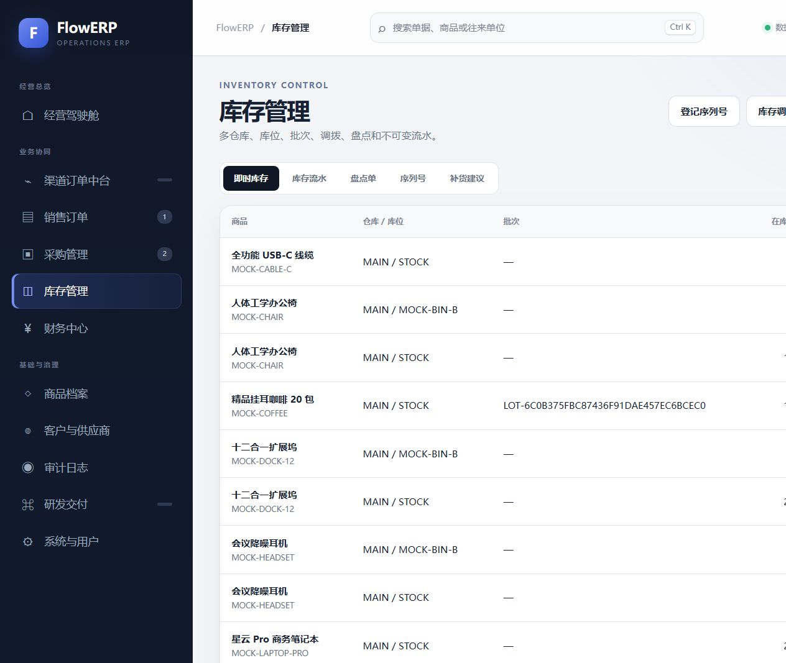
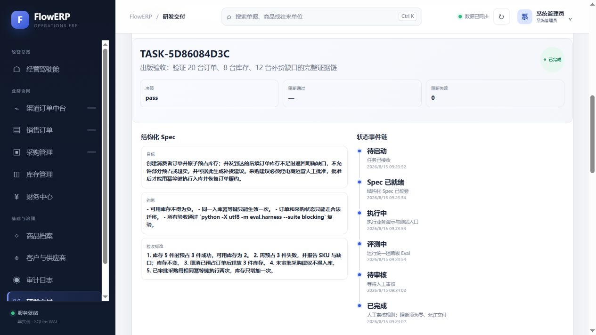
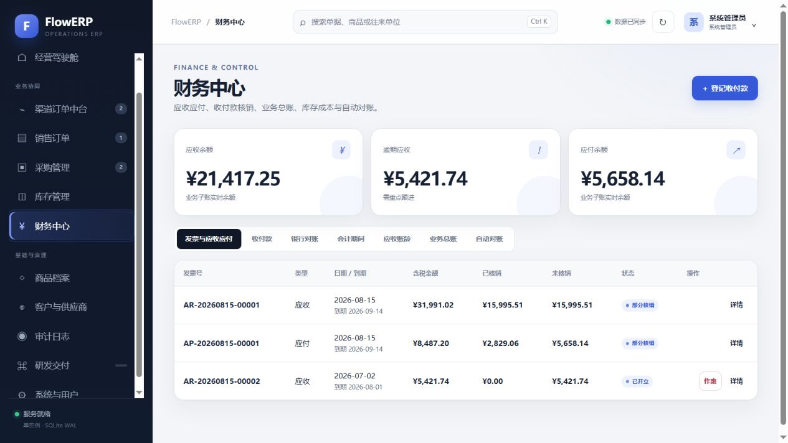
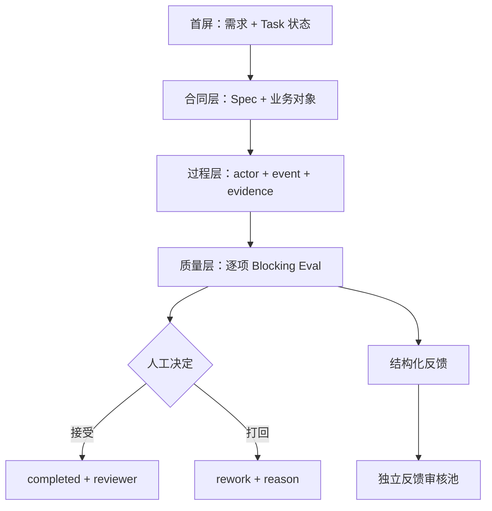
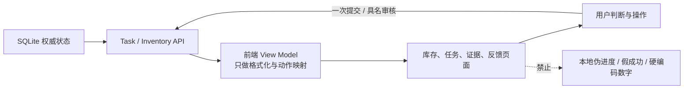
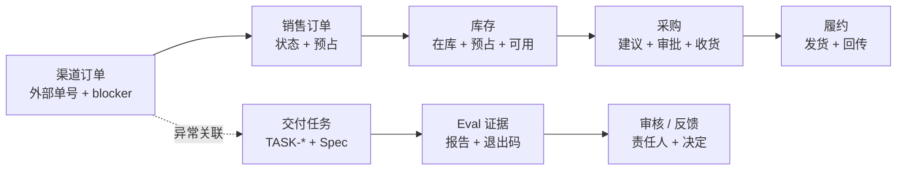
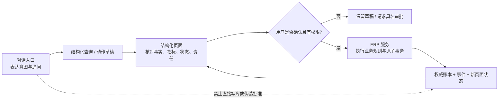
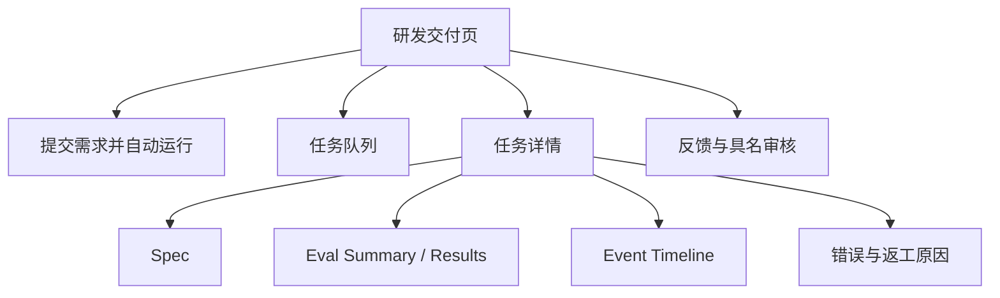
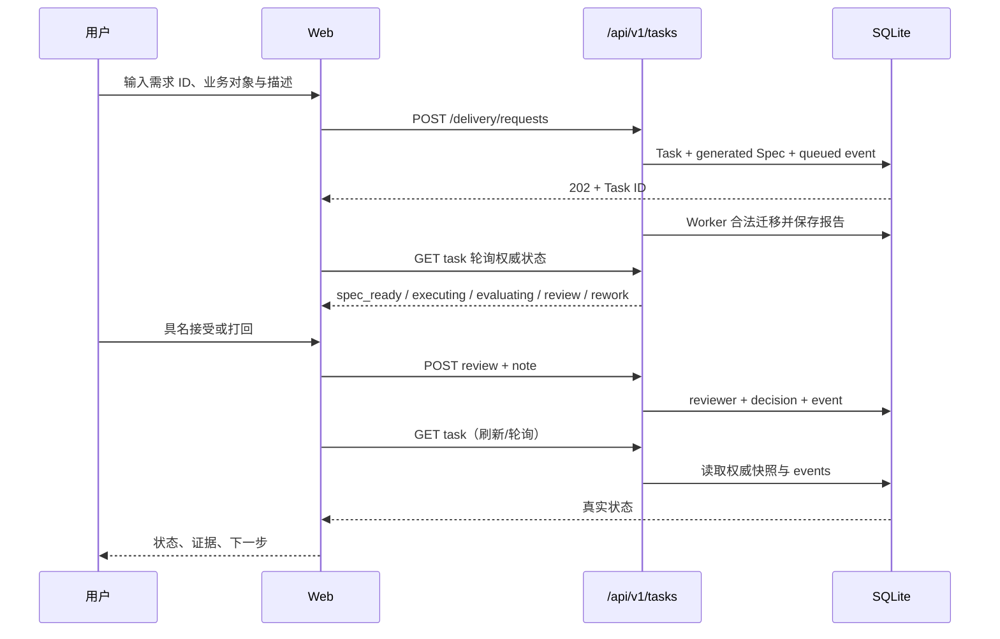
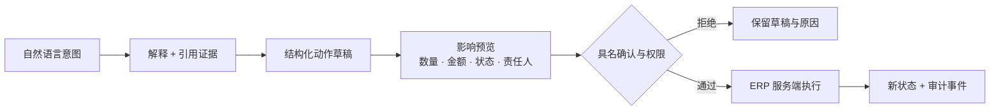

# L14｜让交付状态在 Web 面板可见

- **核心内容**：面板信息层级、轮询或推送、失败重试、结果下载和密钥边界。
- **演示结果**：从 Web 提交需求并查看阶段状态、Eval 报告和产出文件。
- **课内增量**：完成只覆盖一个任务主路径的最小面板。
- **通过标准**：状态与后端一致；失败路径明确；结果可追踪；前端和仓库中没有密钥。
- **挑战任务**：增加任务队列或多仓库隔离，不作为跟跑线结业要求。

> 课程建设状态说明：本讲页面、状态文案、走查脚本和评价规则属于已经形成的课程设计；学生首次判断、三方对账、陌生人走查和达成数据属于待真实开课采集。参考截图、静态页面或讲师演示不能替代学生证明页面与权威状态一致。

## 国家级一流本科课程教学设计卡

| 维度 | 本讲设计 |
|---|---|
| 对应课程目标 | CLO-6：让 Web 准确呈现后端任务、失败和证据状态 |
| 工作台主线增量 | 建立覆盖一个任务主路径的 Web 面板、轮询/重试和结果追踪 |
| FlowERP 的作用 | 提供真实业务操作页与权威状态，使页面、API、SQLite、业务对象四方对账 |
| 高阶性 | 对 DOM、API 和持久化状态进行三方对账，评价轮询新鲜度、错误恢复和密钥边界 |
| 创新性 | 把 UI 从美化作业转为可信状态投影实验，以真实错态驱动交互设计 |
| 挑战度 | 空、载入、失败、未知、陈旧和成功必须可区分；旧绿灯不能在断网后继续冒充当前状态 |
| 学生中心活动 | 学生提交真实任务、断网和注入未知状态，互换 Task ID 完成三方对账 |
| 课程思政融入 | 页面不知道就显示未知、失败就显示失败，训练诚实表达、用户责任和数据安全意识 |
| 形成性评价 | 状态文案合同 + DOM/API/SQLite 对账 + 失败重试 + 无密钥检查 |
| 持续改进数据 | 统计状态不一致率、陈旧绿灯率和用户误判点，推动下一轮界面改进 |

## 本讲知识合同

| 合同项 | 本讲约定 |
|---|---|
| 主线起点 | L13 的 API 能返回真实 JSON，但业务用户无法据此高效判断发生了什么和下一步由谁做 |
| 唯一技术命题 | 如何把权威 Task 状态忠实投影为可下钻、可对账、不会伪造成功的操作界面 |
| 必须掌握 | 状态文案合同；DOM/API/SQLite 三方对账；空载错态；轮询新鲜度；前端安全与可访问性 |
| 能力判据 | 同一 Task 在三层字段一致，断网、未知枚举和字段漂移都不会留下旧绿灯或吞错 |
| 本讲不做 | 不在前端重算权威金额，不用静态 JSON，不固定测试数量，不决定反馈是否晋级 |

## 大纲锚点与前沿校准（2026-08-19）

- **大纲锚点**：只覆盖一个任务主路径，准确展示阶段、失败、Eval 报告和产物，状态必须与后端一致。
- **前沿采用**：采用空/载入/错误/未知/陈旧态、可访问状态消息和安全渲染；Agentic UI 强调可审查动作与证据下钻。
- **不越界**：不加万能聊天框取代状态设计，不用静态假数据或计时器伪造进度，不在前端重算权威业务结果。
- **链路交接**：向 L15 交付真实用户走查发现的一条可追溯状态裂缝。详见[校准矩阵](./16讲主线与前沿校准矩阵.md)。

**主线坐标**：Task API 已经会说真话，现在要让不读 JSON 的业务用户看懂“发生了什么、为什么、下一步由谁做”。本讲把页面当成可操作的工作方式图，而不是在 ERP 旁边追加一个万能聊天框。

**这一讲把系统推进到哪里**：业务人员能在同一页面审查 ERP 变更、质量结论和下一责任人；工作台获得忠实投影权威状态、展开真实 Diff 和结构化 evidence 的交互层；页面、API 与 SQLite 三方对照构成本讲证据。Web 页当然是图，但它必须是一张由真实状态驱动、可下钻、不会撒谎的动态图。

## 本讲行动工单：让页面在断网、未知状态和旧数据面前仍然说真话

学员先分别写 ERP 业务状态和工作台 Task 状态的枚举→文案→责任人→下一步合同，再实现一个真实 ERP 操作主路径及其交付证据下钻。课堂主动断开服务、注入未知枚举/字段漂移和陈旧响应，页面必须清除旧绿灯；同伴用同一业务 ID 与 Task ID 对账 DOM、API、SQLite 和 ERP 权威状态。

- **工作台增量**：可信状态投影、证据下钻、轮询/重试、新鲜度、可访问性和三方对账；
- **FlowERP 产品状态**：交付一个真实业务页面主路径；页面从 ERP API 读取权威状态，并按 Task ID 下钻工作台证据；
- **失败证据**：静态假数据、断网旧绿灯或未知状态吞错至少一项先失败后修订；
- **迁移证据**：把状态合同用于第二种长任务，分离通用字段和适配字段；
- **讲师硬门槛**：必须使用真实 API/持久状态，截图和 mock JSON 只能作设计稿不能验收。

详见[可执行任务卡](../../course/tasks/L14-Web状态面板.md)。

## 本讲教学设计总览

| 项目 | 设计 |
|---|---|
| 建议学时 | 30 分钟线上精讲 + 70 分钟线下行动 + 30 分钟陌生人走查 |
| 课堂类型 | **三角测量**：用 DOM、API 与 SQLite 对同一 Task ID 交叉取证 |
| 核心问题 | 怎样让页面既帮助业务用户行动，又不美化、猜测或缓存错误的系统状态？ |
| 教学重点 | 状态文案、空/载/错/离线态、证据下钻、身份深链、可访问性 |
| 教学难点 | 区分观察面与权威源；发现静态假数据、吞错和陈旧详情 |
| 课堂产出 | 三方对账表 + 页面走查记录 + 可访问性/安全清单 |
| 价值塑造 | 不用“友好体验”掩盖未知和失败，保障不同能力用户平等获得真实信息 |

### 可测学习成果

| 编号 | 学习者能够 | 达成证据 | 达成标准 |
|---|---|---|---|
| L14-O1 | 将 Task 状态翻译为准确、可操作且不夸大的页面文案 | 状态文案表 | 每个状态都有原因、下一步与责任人 |
| L14-O2 | 用同一 Task ID 对账 DOM、API 与持久化状态 | 三方对账表 | 抽样字段全部一致 |
| L14-O3 | 复现并修正静态假数据、吞错或陈旧详情 | 失败走查记录 | 断网/未知状态不显示旧绿灯 |
| L14-O4 | 完成键盘、标签、响应式、密钥与渲染安全审查 | 验收清单 | 无阻断级可访问性或安全缺陷 |

### 30 分钟线上精讲 + 70 分钟线下行动

| 场域与时间 | 学习活动 | 学生当场证据 |
|---|---|---|
| 线上 0–8 分钟 | 只看页面判断任务是否完成并写下依据 | AI 介入前页面可信度判断 |
| 线上 8–20 分钟 | 建立状态文案、权威源、新鲜度和空/载/错/未知态合同 | 状态文案草图 |
| 线上 20–30 分钟 | 追踪浏览器请求、API Schema 和页面渲染数据流 | 字段映射与旧绿灯预测 |
| 线下 0–18 分钟 | 创建真实 Task，从空态观察到人审并展开证据 | 正常走查与 Network 记录 |
| 线下 18–34 分钟 | 断开服务、注入未知枚举或字段类型漂移 | 失败、离线和陈旧态证据 |
| 线下 34–50 分钟 | 用同一 Task ID 对质 DOM、API 与 SQLite | 三方对账表 |
| 线下 50–70 分钟 | 陌生人五问走查并抽检键盘、移动端、渲染和密钥边界 | 走查结论、修订记录与离场票 |

### 达成度与持续改进

采集三方字段一致率、五问独立完成率、错误态识别率、键盘任务完成率和页面误导事件数。字段一致率与旧绿灯阻断率必须 100%；陌生人独立完成率低于 80% 时优先修正信息架构而非增加讲解；可访问性问题按任务阻断程度进入下一轮 Spec。

## 本讲现场｜Web 页面本身就是观察仪表

当然，Web 页面是图，而且是这一讲最重要的图。流程图解释系统“应该怎样工作”，真实页面截图证明用户“此刻实际看到了什么”。先看业务账：库存页同时展示账面、预占、可用、库龄和库存价值；如果可用库存不是 `on_hand - reserved`，图表再漂亮也只是误导。



再看工程账：研发交付页展示任务总数、进行中、已交付、待审核反馈、任务编号与当前状态。页面只消费 API 返回的数据，不用定时器凭空把 `queued` 变成 `completed`。


同一个 Task ID 还要能还原 Spec 与状态迁移。下面不是手画时间线，而是 API 持久化事件在页面上的投影：`queued → spec_ready → executing → evaluating → review → completed`，每一步都有原因与时间。



经营页面也必须把“业务结果”和“治理证据”分层。财务中心展示应收、应付、银行流水与总账，不允许 Agent 在浏览器里重新计算权威金额；审计页则保留操作者、动作、对象和请求身份，帮助人从异常指标追到具体动作。




### 自动交付流水线五连拍

下面五张不是设计稿，而是同一个真实 `TASK-*` 的不同观察切面。讲师应按顺序讲：先看任务为何停住，再下钻合同、轨迹和评测，最后看反馈入口；不能先展示绿色表格再补讲需求。






课堂走查不以“肉眼看起来正常”为准，而是拿同一 Task ID 对比数据库、API JSON 与 DOM 文案。三者不一致，页面就已经发现了产品缺陷。

Agent 入口也不能把整套 ERP 缩成一个聊天框。自然语言适合表达“为什么这笔订单不能发货”“按缺口生成采购草稿”；结构化页面仍负责核对订单行、库存流水、审批人、凭证、权限和错误。对话负责意图，页面负责事实，ERP 服务负责合法执行。

## Web 是 FlowERP 与工作台共同演化出的操作驾驶舱

用户并不关心代码属于 `flowerp/` 还是 `workbench/`，但必须看得出自己正在操作哪一种事实。可信页面要把三条链并排连通，而不是做成互不相干的功能菜单：



第一条是业务事实链，第二条是工程证据链，虚线是二者的追溯关系。它们共享导航和关联 ID，却不共享权限：运营可以重审被阻断的渠道订单，不代表能审核代码；工程审核者可以接受 TASK，不代表能批准采购。

一次完整页面走查必须完成下列任务，而不是浏览截图：

| 用户问题 | 首屏必须看到 | 下钻后必须核对 | 合法下一步 |
|---|---|---|---|
| 为什么 20 台订单没发货 | 渠道状态 `exception`、缺口 12 | 销售单存在、`reserved` 未部分增加 | 生成采购建议或修复 blocker |
| 采购为什么不能收货 | 当前 `proposed`、待审批人 | 审批记录、版本和权限 | 具名审批后重新收货 |
| Agent 为什么没有完成 | TASK 当前状态、失败数量 | Spec、失败 Eval、事件时间线 | 修复、打回或安全停止 |
| 页面数字能不能信 | 数据时间、口径和服务状态 | API JSON 与权威账本 | 刷新、报告异常，不能本地改数 |

因此 Web 能力不是最后“补一个前端”，而是 FlowERP 进入真实协作后对可解释性提出的产品要求。页面把错误暴露出来，也会反向生成下一讲的反馈；这正是工作台继续演化的现场入口。

一个可信 ERP 工作页至少同时呈现四类信息：**事实**是原始单据、数量和流水；**指标**是按明确口径计算的可用库存、缺口和金额；**状态**说明对象当前处于 draft、approved 还是 awaiting review；**责任**说明谁能执行下一步、谁已经做了决定。聊天回答若缺少其中任何一类，就只能作为解释入口，不能成为业务账本。



所以“Web 页面是不是图”的答案不只是“是”。页面是可操作、会随权威状态变化的工作方式图；流程图解释规则，页面把规则映射为信息层级和可用动作，流水与事件再证明动作确实发生。三者共同出现，才叫图文并茂，而不是在文字旁边放一张装饰插画。

## 漂亮的假进度是最危险的 UX

AI 产品喜欢显示“正在思考 80%”“即将完成”，ERP 页面也容易在请求发出后立即显示成功。如果后端实际上 rework 或 failed，假进度会让用户做出错误业务决定。可信面板首先要诚实：不知道百分比就不要编；任务 queued 就显示未开始；服务不可用就显示不可用；失败要说明原因、影响和下一步。

FlowERP 的 `#delivery` 页面连接真实任务 API。用户提交需求后，平台自动归一业务引用、生成 Spec、受控执行并启动 Eval；页面轮询权威任务状态，只在状态实际变化时刷新详情。用户随后查看 Spec、报告和事件链，再进行具名审核。页面不是静态宣传页，也不会用前端计时器伪造流水线进度。

## 信息架构



首屏优先回答：现在发生什么；是否需要我操作；哪个任务受影响。二级详情再展示技术证据。不要让大图表挤掉失败原因和 Task ID。

## 状态文案合同

| 后端状态 | 用户文案 | 视觉语义 | 可用动作 |
|---|---|---|---|
| queued | 已接收，尚未启动 | 中性 | 启动、查看需求 |
| spec_ready | Spec 已校验 | 信息 | 查看 Spec |
| executing | 正在执行 | 进行中 | 查看事件，不重复启动 |
| evaluating | 正在运行阻断级 Eval | 进行中 | 查看等待说明 |
| review | 等待审核 | 提醒 | 查看证据、审核 |
| rework | 评测未通过，已退回 | 警告 | 查看失败、修复 |
| completed | 已通过交付门 | 成功 | 导出摘要、反馈 |
| failed | 工作流异常 | 错误 | 查看原因、重试策略 |

颜色只是辅助，文本和图标也要表达状态，满足色觉差异用户。`rework` 与 `failed` 必须区分：前者是质量检查正常工作并发现阻断；后者是流程异常。

## 数据流



前端可以缓存用于渲染，但不能把本地缓存当权威。刷新后应重新读取 API。失败请求不能乐观显示 completed；若采用乐观 UI，也必须只用于可逆、低风险动作，并在服务端冲突时回滚。

### 把 Live Retrieval 的新鲜度画给用户看

如果页面展示“可用库存 8”，用户还需要知道这是哪个仓库、何时观测、来自哪个权威接口，以及提交动作前是否重新校验。Agentic UI 不应把检索结果渲染成无来源的肯定句，而应把它包装成证据卡：

```text
SKU：LAPTOP-001              可用量：8
来源：FlowERP Inventory API  仓库：WH-SH-01
观测时间：2026-08-15 14:32   数据版本：42
状态：提交前需要重新校验
```

当版本过期时，页面显示“数据已变化，请刷新建议”，保留旧值用于解释，但禁用高影响提交；刷新后新旧值并列，说明建议数量为何变化。这样，Live Retrieval 才从后台技术变成用户可审查的工作方式：**Agent 可以提出基于当前事实的草稿，最终动作仍由服务端以最新状态和权限判定。**

## 任务身份与深链接

每张卡片和详情都显示 Task ID，复制操作保留完整 ID。URL 可包含任务锚点或查询参数，方便支持人员直达。截图若没有 Task ID、时间和版本，无法进入证据包。

用户提交后按钮暂时禁用，避免双击；服务端仍需幂等或冲突控制，因为禁用按钮不能阻止多标签页、网络重试和脚本调用。

## 空态、加载态、错误态

空态不应是一片空白。首次进入告诉用户“尚无交付任务”，说明可输入什么、创建后会发生什么。加载态使用明确文案，不显示虚构百分比。错误态至少包含：发生什么；是否影响数据；用户可以做什么；Request ID 或 Task ID。

示例：

```text
阻断级 Eval 未通过，任务已进入返工。
影响：当前版本不能交付；已完成的库存数据未被改写。
下一步：查看 2 个失败用例并生成修复任务。
任务：TASK-...
```

比“操作失败，请重试”更可操作，也避免用户无脑重复触发有副作用请求。

## 服务不可用与离线边界

若 `/api/v1/health/ready` 返回 503，页面应显示服务未就绪及组件原因，不继续伪造缓存状态。网络错误与任务 failed 不同：网络错误意味着当前无法确认权威状态，文案应说“状态未知，请稍后刷新”，而不是“任务失败”。

页面可保留上次数据，但必须标记时间和“非实时”。对 ERP 库存和审批，不应离线允许写入再悄悄同步。

## 课内演示

启动：

```bash
python -X utf8 -m workbench.cli serve --port 8000
```

打开 `http://127.0.0.1:8000/#delivery`，依次演示：无任务空态；填写 `REQ-ECOM-001`、渠道订单号和 SKU 后只提交一次；观察任务从 queued 自动经过 Spec、受控执行与 evaluating，并在当次报告全部 Blocking Eval 通过后停在 review；展开每条 Eval 的等级和 `evidence`；查看带 actor 与结构化 evidence 的事件链；最后由具名审核人接受或打回交付。另行记录一条反馈，再对反馈做独立审核，不能把两种审核混成一个按钮。

用浏览器开发工具确认数据来自 API，不是写死在 `app.js`。刷新页面，任务仍存在。移动窗口到窄屏，重要状态、Task ID 和操作按钮不应被截断。

## 失败实验一：静态假数据

临时断开 API，若页面仍显示“17/17 通过”且没有过期标记，说明它在使用静态或陈旧数据。正确页面应显示服务不可用或状态未知。

检查前端源码是否硬编码成功数字、completed 状态或假时间线。演示用 Mock 可以存在，但必须明确标识且与生产路径隔离；本讲验收不接受 Mock 作为真实证据。

## 失败实验二：错误被吞掉

让启动接口返回冲突，例如重复运行 completed 任务。页面应展示“任务已完成，不能重复启动”而不是无反应，也不应继续显示 spinner。按钮恢复可操作状态，错误与 Task ID 关联。

再模拟请求超时。用户需要知道请求可能已经到达服务端，应先查询任务而不是重复提交。对有副作用操作尤其重要。

## 安全边界

前端代码对所有用户可见，绝不能写 API key、数据库密码或管理员凭据。认证使用后端会话与安全 Cookie；页面按权限显示动作，但服务端仍做授权。CSP、X-Frame-Options、内容类型和来源控制由服务端设置。

Spec、报告和错误文本可能包含用户输入，渲染时使用安全文本 API，避免把字符串当 HTML。下载报告时设置正确类型与权限，避免跨组织泄露。

## 可访问性与响应式

每个表单有 label；键盘可以完成创建、选择和审核；焦点在弹窗关闭后回到触发按钮；错误与输入通过 `aria-describedby` 关联；状态变化用适当 live region 提示但不重复轰炸；表格在小屏可横向滚动或转卡片；颜色对比符合基本标准。

“图文并茂”不等于堆图。对任务状态，时间线比饼图更适合表达顺序；对 Eval，表格比装饰性仪表盘更适合精确比较；对单个当前状态，一张清晰状态卡优于多条曲线。

## 性能与轮询

挑战线可以轮询多任务，但要有退避、页面不可见时降频、终态停止轮询、请求取消和错误恢复。不要每秒刷新全部报告。更大系统可用 SSE/WebSocket，但仍以服务端状态为权威，并处理断线重连和事件去重。

轮询示意：queued/executing/evaluating 每 2–5 秒；review/rework 降到 10–30 秒或由用户刷新；completed/failed 停止。具体数字按负载测试决定，不是课程永久合同。

<details>
<summary>讲师用：验收、练习与评分</summary>

## 用同一个 Task ID 做三方对质

### 验收

- [ ] 数据来自真实 API，刷新后与 SQLite 一致；
- [ ] Task ID、Spec、Eval 和事件链可追溯；
- [ ] queued、运行、审核、返工、失败、完成有不同语义；
- [ ] 空态、加载、阻断、服务不可用均有明确文案；
- [ ] 不显示虚构百分比或成功数字；
- [ ] 重复提交被前后端共同控制；
- [ ] 前端无密钥，错误文本安全渲染；
- [ ] 键盘与移动端基本可用。

### 作业

提交五张带需求 ID、业务对象和 Task ID 的状态证据：空态、queued、evaluating/review、rework/failed、具名 completed；再提交一次服务不可用和一次重复启动的交互记录。每张图附对应 API 响应，证明不是静态数据；completed 图必须看得到审核身份与理由。

### 评分

| 项目 | 分值 | 合格表现 |
|---|---:|---|
| 状态诚实与三方对账 | 30 | DOM、API、SQLite 一致，未知和离线不显示旧绿灯 |
| 失败与行动体验 | 20 | 原因、影响、下一步和责任人清楚 |
| 追溯与证据下钻 | 20 | Task ID、事件、Diff、Eval 和报告可达 |
| 安全 | 15 | 无密钥，权限、输出编码和渲染边界正确 |
| 可访问性与响应式 | 15 | 键盘、标签、焦点、对比度和移动端任务可用 |

下一讲把一次完成任务导出为摘要，并把用户反馈存成默认待审核的数据。页面让过程看得见，反馈治理让现场经验进入下一轮而不放大噪声。


</details>
## 页面走查脚本：让另一个人不靠讲解完成任务

邀请一名未参与开发的人按任务完成创建、启动、定位失败、查看证据和提交反馈。观察他第一次点击哪里、在哪个状态停顿、是否能找到 Task ID、会不会把 rework 当系统崩溃。不要在走查中立即口头提示；提示本身会隐藏信息架构问题。

记录每个障碍的“可观察行为—可能原因—改进—验证”。例如用户连续点击启动，可能不是粗心，而是按钮没有禁用或缺少请求状态；用户看到 `blocking_failed=1` 不知道下一步，页面需要解释并提供生成 Repair Task 的入口；用户复制错误时丢失 Task ID，复制组件需要包含身份。

## 证据可视化的取舍

事件适合时间线，因为顺序和原因最重要；多条 Eval 适合可排序表格，因为要比较 name、level、duration、evidence；当前状态适合单一醒目卡；库存变化适合前后值与流水，不适合只有面积图。图表必须能回答决策问题。

一个合理详情页层级：顶部显示状态、Task ID、下一步；第二层显示业务结果和 blocking summary；第三层是事件时间线；最后展开技术报告。这样管理者能快速判断，工程师也能深入证据。若把所有 JSON 原样铺满，虽然“信息全”，但用户无法行动。

## 前后端一致性检查

为每个状态写一条 API fixture 和页面断言。后端新增状态时，前端未知状态必须显示“未知状态：值”和诊断入口，而不是默认绿色。日期统一按 ISO 时间传输，页面明确时区；金额和数量不在前端用浮点重新计算；错误 code 驱动稳定文案，message 用于细节。

刷新竞态也要处理：用户打开任务 A 后切到 B，A 的慢响应不能覆盖 B 的详情。可以用 AbortController 或请求序号丢弃过期响应。轮询同理，终态后停止；页面隐藏时降频；连续失败采用退避并告诉用户数据时间。

## 安全走查

在源码、Network、Local Storage、Session Storage 和错误面板中搜索 key、token、password 等敏感字段；确认认证 Cookie 不能由 JS 读取；对用户输入 `` 验证被当文本；在无权限角色下确认按钮隐藏且服务端仍返回 403；直接构造跨组织 Task ID 验证不可读取。

页面不应把完整堆栈展示给普通用户。用户看到稳定错误码、影响和下一步；详细堆栈进入受控日志并通过 Request ID关联。下载 JSON/CSV 时防公式注入、正确编码和内容类型，并遵循权限。

## 移动端与无障碍验收细表

使用 320px 宽度检查导航、状态卡、表单和表格；200% 缩放不丢关键操作；仅键盘完成主流程；Tab 顺序与视觉顺序一致；焦点轮廓可见；错误出现后焦点移到摘要；状态不是只靠红绿；加载动画尊重减少动态效果设置。

表格在小屏若改卡片，要保留列名语义。时间线图标带文字。复制 Task ID 有可感知成功提示。自动轮询更新时不要抢焦点，也不要每次朗读全部页面。可访问性不是发布后的装饰，而是让真实用户可靠理解系统状态的一部分。

## 页面审讯脚本：五问与七连测

让学员随机抽一条任务，只通过页面回答五问：当前状态；上一次迁移原因；blocking 结果；下一步动作；权威 Task ID。五问任一需要打开源码或问作者，页面信息仍不完整。随后对照 API 和 SQLite 抽样，页面数字必须一致。视觉美观可以加分，但不能抵消静态假数据、吞错、密钥或状态不一致。

交付前再做一次“断网、慢网、重复点击、刷新、后退、窄屏、无权限”七连测。每种场景都记录页面状态、API 事实和用户下一步；若系统无法确认事实，宁可明确显示未知，也不能用最后一次绿色结果填补空白。这条纪律是交付面板获得信任的底线。

## 页面终于暴露了一个真实裂缝

### Agentic UI 的前沿不是聊天框，而是可审查动作

一个成熟的人机界面把 Agent 输出拆成四层：解释层说明为何建议；证据层给出来源、口径与时间；草稿层显示即将改变的对象和 Diff；执行层由服务端权限、幂等和业务状态机决定是否生效。对高风险操作，再增加影响预览、审批人、撤销或补偿路径。



聊天适合降低表达门槛，不适合承载所有核对。订单行、库存流水、审批链、凭证和 Diff 应继续用表格、时间线、状态卡和对比视图呈现。页面不是 Agent 的包装，而是责任分配和证据消费的主界面。

现场走查时，页面把 Harness 的 `evidence` 字段显示为空，因为前端仍在读取旧字段名；另一次导出又因 Windows 上 SQLite 连接未关闭而失败。它们不是课程之外的尴尬，而是最有价值的用户证据。第 15 讲把这类观察保存为带 Task ID、复现步骤和审核状态的 Feedback，修复后再回到同一页面验证；没有来源和决策的“用户觉得不好用”不能直接升级成阻断规则。
