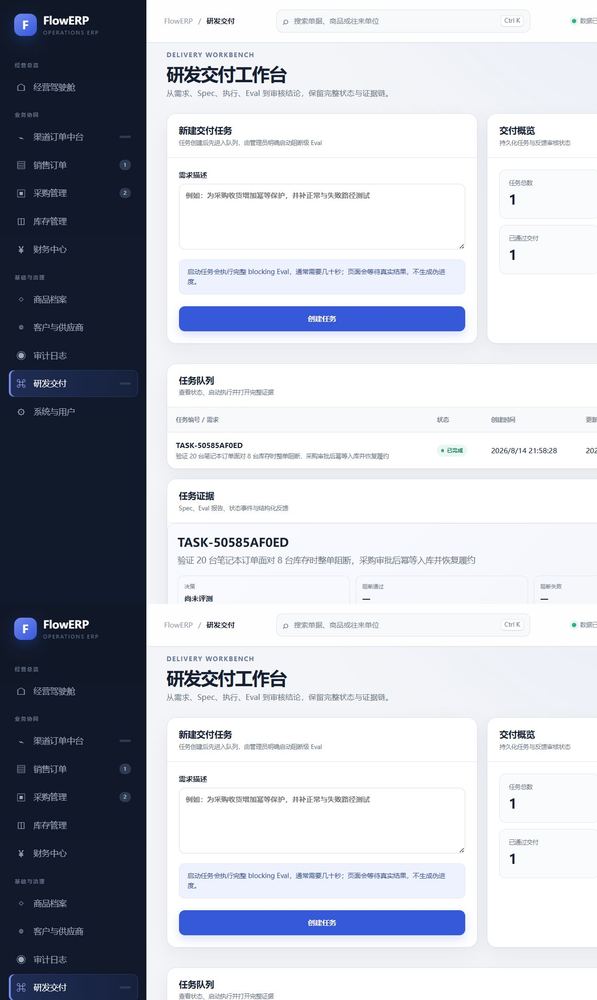
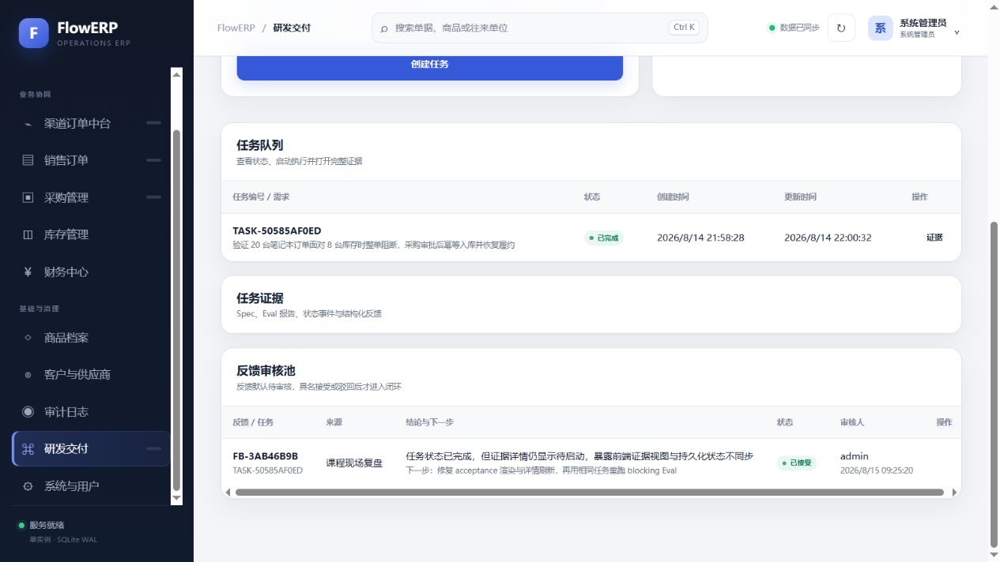
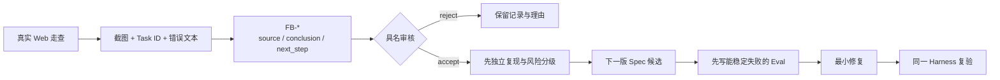
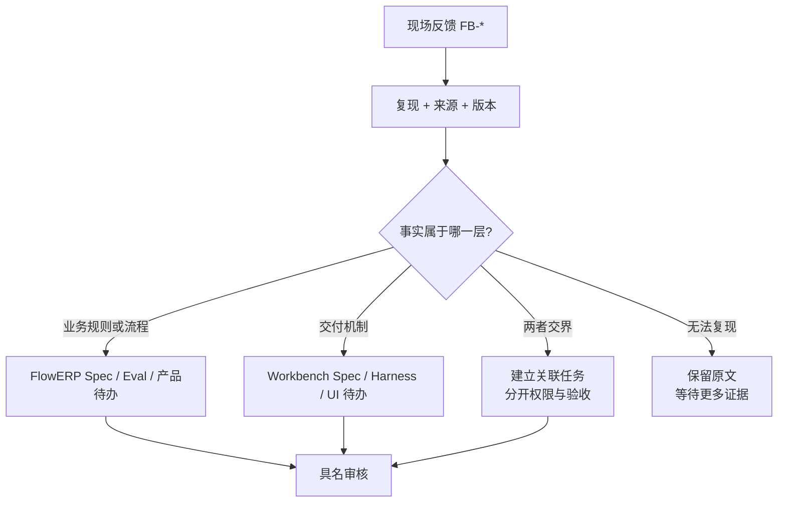
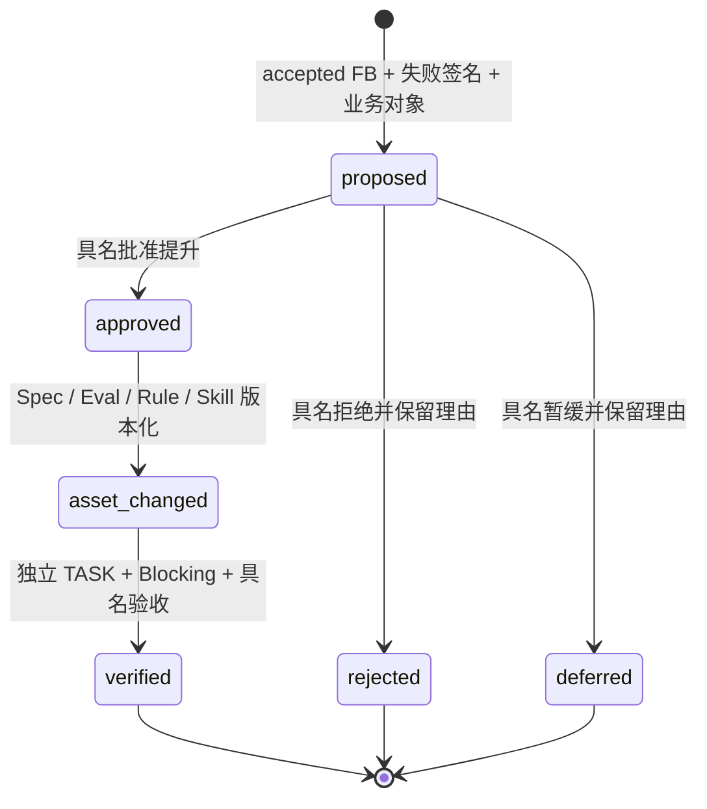
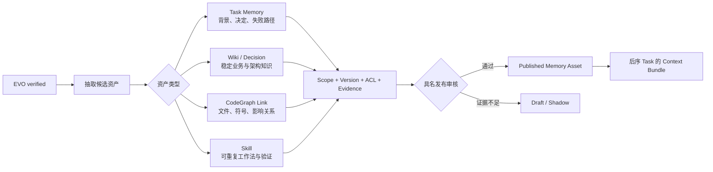
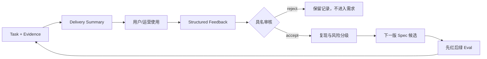
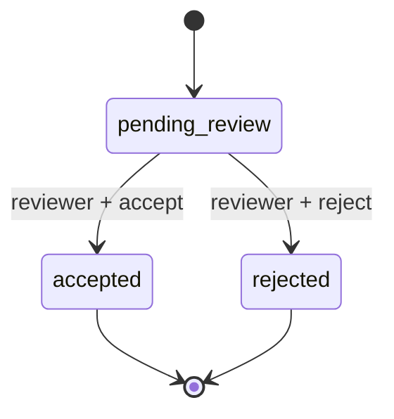
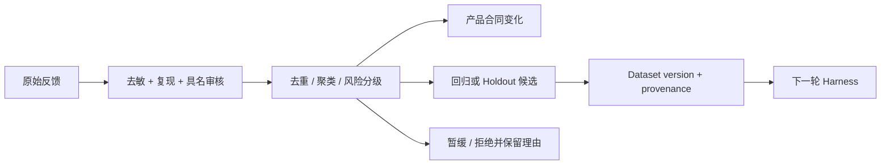

# L15｜生成交付摘要并采集真实反馈

<details>
<summary>本讲课程合同与建设状态（教师/助教）</summary>

- **核心内容**：文档和周报导出、运行反馈、失败样本回流，以及反馈与自动改代码之间的人工边界。
- **演示结果**：生成一次交付摘要并写入一条结构化反馈。
- **课内增量**：实现摘要导出和反馈记录，不在本节增加新的 Agent 编排。
- **通过标准**：摘要可追溯到任务和 Eval 报告；反馈包含来源、结论和下一步；原始反馈不会未经审核直接成为阻断 Eval。
- **挑战任务**：增加仓库问答 Bot 或脚手架生成器，作为独立扩展而非结业必做项。

> 课程建设状态说明：本讲摘要导出、反馈状态机、活动和评价规则属于已经形成的课程设计；学生真实反馈、分诊决定、独立后序验证和达成数据属于待真实开课采集。不得伪造用户反馈、审核身份或用参考闭环替代真实采用证据。

> **基础线唯一性**：本讲只从一条有来源的真实反馈形成新版 Spec/Eval，并用独立 Task 交付一个受控 ERP 改进；不新增 Agent 编排，反馈不得直达 Blocking Eval。

</details>

## 连续案例｜第四幕：一句“很难用”差点阻断所有发布

**时间**：第四周周三 11:40　**地点**：用户反馈评审

陈予在真实操作后提交反馈：“采购审核按钮很难用，经常找不到。”自动整理程序把它改写成“采购审核按钮必须固定在页面顶部”，并准备加入 Blocking Eval。这个规则具体、可测试，也忠实包含了“按钮”两个字，却未必解决原问题。

回看操作录像后，团队发现陈予使用的是仓库账号，本来就没有审批权限；页面隐藏按钮是正确行为。真正的问题是系统没有解释“你无权审批，应等待唐禾处理”。如果直接采纳原改写，工作台会把权限缺失伪装成布局问题，甚至诱导开发者向错误角色开放按钮。

林默把反馈拆回三层：用户事实是“找不到动作”；解释假设包括布局、权限和状态；改进建议需要新的证据。原文、来源和时间必须保留，接受、拒绝或待验证都要有具名决定。只有被接受的结论才能形成 Spec/Eval Diff，而且必须通过独立 Task 交付。

周岚担心这样的流程让反馈闭环太慢。顾宁回应：“未经治理的快速反馈，不是闭环，是把噪声写进质量门。”

> **决策时刻**：请将反馈标成“事实、假设、建议”，再决定接受、拒绝或待验证。你必须保留原文和判定人；不得让反馈直接修改 Blocking Eval，也不得用本讲顺手修复冒充下一次独立交付。

反馈最终升级了工作台和 FlowERP，但最后一个问题还没有答案：这一切是否只在作者熟悉的电脑上成立？结业当天，林默将在陌生环境里抽取一个此前未实现的小需求。

## 图文学习导航

### 先进入现场：一句“这个按钮不好用”，为什么不能直接变成阻断级规则


*观察重点：反馈先保留原文、来源、场景和影响，再经过接受/拒绝/待验证判定。只有被证据支持并签字的结论，才能形成新版 Spec 与 Eval。*

**先别看答案**：把同一条反馈分别改写成“用户事实”“解释假设”“改进建议”。三者不能混写；若无法找到来源与复现场景，就保留为待验证，而不是为了闭环强行接受。

本讲按“原始反馈 → 分诊 → 证据补充 → Spec/Eval Diff → 独立任务交付”学习。用 [Google SRE Postmortem Culture](https://sre.google/workbook/postmortem-culture/) 约束行动项与事实链，用 [GOV.UK Agile Governance](https://www.gov.uk/service-manual/agile-delivery/governance-principles-for-agile-service-delivery) 检查团队如何在授权边界内持续决策。

## 学员正文｜反馈必须被尊重，但不能未经审判就成为裁判

唐禾在走查中说：“财务页面很难用。”产品经理把这句话复制成需求，测试同学准备新增 blocking Eval，开发者则打算重做整个财务导航。三个人都在响应用户，却没有人知道“难用”发生在什么角色、任务、数据和后果中。

反馈是事实来源，不是自动授权。它至少需要保留原文、提交人或角色、场景、期望、实际、影响和可复现证据，再由具名责任人判定：接受、追问、拒绝、合并重复，还是只作为 observing 信号。最常见的错误路线是让高频抱怨自动提升为 blocking；频率可能来自同一来源重复提交，也可能把偏好问题污染成全局质量门。

本讲必须用一次真实反馈新增专属 Eval，而不是复用早已绿色的通用检查：

```powershell
.\.venv\Scripts\python.exe -X utf8 -m workbench.cli course-spec --lesson 15 --eval-case feedback_rule_is_enforced
.\.venv\Scripts\python.exe -X utf8 -m workbench.cli course-submit --lesson 15 --execute-code --eval-case feedback_rule_is_enforced --session-baseline-ref refs/heads/l15-session-red
```

先把“很难用”追问成可验证场景，例如：财务人员无法在应付账龄中从逾期供应商下钻到未结发票，导致付款优先级只能手工核对。再决定它改变的是 FlowERP 产品、工作台证据展示、课程材料，还是仅需帮助文档。签字版候选 Spec 必须写非目标；新增 Eval 先在会话基线稳定变红，随后才允许最小实现。

行动课保留一条完整 Evolution Record：原始反馈不可覆盖；具名评审说明接受/拒绝理由；Spec、Eval 和代码资产分别版本化；下一项独立任务在同一 Harness 下验证资产是否真的帮助交付。资产不能把“当前库存为 20”这类短期事实当长期经验，也不能跨组织复用越权方案。

### 把关键代码读懂｜自动观察为什么不能自动晋级

```python
if status not in {"rework", "failed", "dead_letter"}:
    raise ValueError("只有稳定失败任务可以沉淀失败反馈")
failed_cases = sorted({
    str(item.get("name", "unknown"))
    for item in result.get("results", [])
    if not item.get("passed", False) and item.get("level") == "blocking"
})
return add_feedback(..., next_step="由具名人员复核失败是否稳定")
```

- 第一条守卫只允许明确失败状态进入观察队列，普通抱怨不会伪装成系统失败。
- 第二段保留阻断 case 身份，避免摘要把“发生了什么”改写成未经证明的根因。
- `add_feedback` 创建的是待审核记录；自动化只负责保存事实，不负责接受结论。
- 真正晋级还需要具名审核和下一项独立 Task，因此源任务不能为自己的改进自证。

**看似合理的错误路线**是只保存最终摘要，例如“根据用户反馈优化财务”。摘要抹掉了原话、争议和拒绝理由，无法判断系统究竟学习了什么。自进化首先是可审计的版本升级，不是模型记住更多文字。

对反馈做去重时也要保留来源关系：两句相似的话可能来自不同角色和不同损失，不能只因向量接近就合并。涉及个人信息、客户数据或凭据的原文必须按权限和删除请求治理；教学证据不能成为无限期保存敏感材料的理由。

**第二次签字**：这条反馈现在属于哪一类决策，谁签字，改变哪个合同，新增什么失败证据，仍不做什么？若不能给出对应的下一验证任务，就不要宣称能力已经升级。

反馈闭环在作者电脑上成立，还不能证明系统可交付。下一讲将拿走旧运行目录、旧会话和作者口头解释，由陌生评审者抽取一项此前未实现的小需求，现场关闭新的红→绿链路。

<details>
<summary>附录：课程合同、教师活动、技术参考与证据模板</summary>

<details>
<summary>教师备课区：课程目标、评价与持续改进</summary>

## 三载体课堂交接

- **PPT 引导决策**：使用 [PPT 逐讲决策脚本](./PPT逐讲决策脚本.md) 的“L15”四个镜头；在学生提交第一次选择、依据和最大风险前，不揭示后果页。
- **Markdown 承载教材**：本讲连续案例、图文导航与学员正文/核心章节负责查证和建模；学生必须保留第一次判断与证据驱动的第二次签字。
- **VS Code 完成行动**：打开 [课程工作区](../../course/FlowERP-AI研发工作台.code-workspace)，先运行“查看本讲合同”，再按 [L15 行动卡](../../course/tasks/L15-摘要与反馈.md) 构造失败、完成受控修改并复验。
- **回收证据**：命令、输入、退出码、报告 ID、权威状态、Diff 和剩余风险回写本讲提交包；只交投票、代码或绿色截图均退回。

> 载体顺序固定为：PPT 第一次签字 → Markdown 查证 → VS Code 行动 → Markdown 第二次签字。完整规则见 [三载体课程实施方案](./三载体课程实施方案.md)。

## 国家级一流本科课程教学设计卡

| 维度 | 本讲设计 |
|---|---|
| 对应课程目标 | CLO-6：综合任务与 Eval 证据生成摘要，并让真实反馈受治理地回流 |
| 工作台主线增量 | 增加交付摘要导出和结构化反馈记录，不扩建新的 Agent 编排 |
| FlowERP 的作用 | 由真实反馈形成新版 Spec/Eval，并通过独立 Task 交付一个受控改进 |
| 高阶性 | 区分反馈原文、工程解释和审核决定，评价其是否进入 Spec、Eval 候选或产品待办 |
| 创新性 | 把交付摘要、运行反馈和失败样本接成持续改进数据源，但不新增 Agent 编排或自动改代码 |
| 挑战度 | 摘要每项结论必须可追到 Task 与报告；反馈必须有来源、结论、下一步和人工边界 |
| 学生中心活动 | 学生为真实 Task 写摘要、提交反馈、交叉分诊，并为错误自动晋级设计反例 |
| 课程思政融入 | 尊重用户原始声音、保护隐私、不篡改证词、不让高频意见绕过专业审核 |
| 形成性评价 | Delivery Summary + 结构化 Feedback + 来源追踪 + 人工审核边界说明 |
| 持续改进数据 | 统计无来源反馈率、待审积压、未经审核晋级数和摘要不可追溯项 |

> **跟跑线边界**：本讲只新增交付摘要与反馈记录。下文涉及 Evolution、Memory Asset 或 Context Bundle 的内容统一视为挑战阅读，不计入基础通过标准，也不得在本讲新增 Agent 编排。基础课堂在完成“摘要可追溯、反馈有来源/结论/下一步、原始反馈不直达 Blocking Eval”后结束。

</details>

<details>
<summary>课程合同、边界与前沿校准</summary>

## 本讲知识合同

| 合同项 | 本讲约定 |
|---|---|
| 主线起点 | L14 暴露了真实页面裂缝，但用户观察尚未经过复现、分诊和授权 |
| 唯一技术命题 | 如何把现场信号治理为可追溯改进资产，同时阻止噪声或意见直接篡改质量裁判 |
| 必须掌握 | 原文/解释/决定分离；反馈状态机；复现与分诊；具名晋级；源 Task 与独立后序验证分离 |
| 能力判据 | 能让 accepted、rejected、pending 各有证据，并从一条反馈追到新资产和独立 Task 的红绿或负迁移结论 |
| 本讲不做 | 不自动改代码，不把 accept 等同于用户方案正确，不让反馈直接变 blocking，不证明部署可靠性 |

## 大纲锚点与前沿校准（2026-08-19）

- **大纲锚点**：只新增摘要导出和反馈记录；摘要回指 Task/Eval，反馈包含来源、结论、下一步且须人工审核。
- **前沿采用**：采用原文/解释/决定分离、隐私最小化与版本化 Eval Dataset 候选；主动选样只服务于提高样本价值。
- **不越界**：不新增 Agent 编排，不自动改代码，不让 accepted 反馈直接篡改 blocking 标准，也不虚构用户采用。
- **链路交接**：向 L16 交付可由陌生人抽查的摘要、反馈、审核事件和技术债索引。详见[校准矩阵](./16讲主线与前沿校准矩阵.md)。

**主线坐标**：Web 已把状态和错误暴露给真实用户，工程账第一次接收运行现场的反证。反馈不会直接改代码，而要经过身份、复现、去重、风险分级和具名审核，再决定进入下一版 Spec、Eval 数据集或产品待办。

**这一讲把系统推进到哪里**：FlowERP 的现场问题第一次能进入下一版本，而不是停留在聊天和截图；工作台获得反馈候选池、分诊、具名提升和进化记录；一条 `FB-*` 最终关联到新版 Spec、先红 Eval、修复任务和复验报告，才构成本讲证据。这里是全书真正合上“自进化”开关的地方。

### 产品化思考检查点 5：进化也包括删除、隐藏和停止

反馈不能默认转化为新功能。学生对每条 accepted 产品反馈执行 `keep / add / merge / hide / remove / stop` 判定：保留现状、增加能力、合并重复对象、把复杂度移到后台、删除低价值流程，或停止错误方向。判断必须引用 L14 陌生人走查、任务数据或可复现失败，并写明预期收益、维护成本、风险和独立复验方法。

如果完整质量模型导致用户为低风险任务手工填写过多对象，正确升级可以是增加风险路由、自动收集证据和折叠后台 Gate，而不是再增加一个 Agent 或页面。能力升级只有在后序独立任务证明减少误判、返工或操作负担后才记为 verified；“功能更多”不构成进化证据。

</details>

## 本讲行动工单：让一句现场抱怨经过治理，而不是自动改写裁判

学员先实现可回链的摘要 Schema/导出器，再把一条真实走查反馈拆成不可覆盖原文、可修订解释和具名决定。必须运行 pending/accept/reject、匿名/重复审核、反馈直接晋级 blocking 和删除请求等路径；accepted 只产生候选，随后必须经过新版 Spec/Eval、独立候选 Task 和具名审核，才能交付一个受控 ERP 改进。

- **工作台增量**：交付摘要、反馈记录、审核状态机、来源追踪、隐私和改进候选入口；
- **FlowERP 产品状态**：源 Task 产生反馈，具名分诊后形成新版 Spec/Eval，再由独立候选 Task 交付一个可验收改进；
- **失败证据**：不可追溯摘要、原文覆盖或未经审核晋级至少一项先失败后修订；
- **迁移证据**：接入第二类反馈源仍保持相同治理合同，不新增 Agent 编排；
- **讲师硬门槛**：禁止模拟用户采用；没有真实反馈时只能完成机制实验，采用成效标“待采集”。

详见[可执行任务卡](../../course/tasks/L15-摘要与反馈.md)。

<details>
<summary>教师备课区：教学活动与达成度设计</summary>

## 本讲教学设计总览

| 项目 | 设计 |
|---|---|
| 建议学时 | 30 分钟线上精讲 + 70 分钟线下行动 + 一次独立后序 Task 验证 |
| 课堂类型 | **反馈评审会**：事实、解释、决定、资产和下一任务分栏审议 |
| 核心问题 | 怎样让真实反馈推动系统进化，又不把噪声、隐私和未经验证的意见写进裁判？ |
| 教学重点 | Feedback 状态机、EVO、资产晋级、独立复验、Context Bundle、隐私 |
| 教学难点 | 区分交付审核与反馈审核；区分已实现能力与 Memory 挑战线 |
| 课堂产出 | Delivery Summary + 三态反馈集 + 一条可追溯 Evolution Record |
| 价值塑造 | 尊重用户原话和数据权益；系统可以学习，但不能自行篡改规则和责任 |

### 可测学习成果

| 编号 | 学习者能够 | 达成证据 | 达成标准 |
|---|---|---|---|
| L15-O1 | 将反馈原文、工程解释和审核决定分开持久化 | Feedback 记录 | 三者不覆盖，身份和时间完整 |
| L15-O2 | 对反馈执行复现、去重、风险分级和 accept/reject/pending | 分诊表 | 每个决定有理由和下一步 |
| L15-O3 | 将 accepted 反馈推进为带资产和独立 Task 的 EVO | Evolution Record | 源 Task 不能冒充验证 Task |
| L15-O4 | 设计带来源、Scope、ACL、采用/排除理由的经验继承合同 | Asset/Bundle 卡 | 过期、弱相关和越权经验被正确处理 |

### 30 分钟线上精讲 + 70 分钟线下行动

| 场域与时间 | 学习活动 | 学生当场证据 |
|---|---|---|
| 线上 0–8 分钟 | 展示“任务已完成/详情待启动”的现场裂缝，学生先分开事实与解释 | AI 介入前分诊判断 |
| 线上 8–20 分钟 | 讲解反馈原文、工程解释、审核决定和交付审核的边界 | 状态—责任图 |
| 线上 20–30 分钟 | 示范摘要追溯、反馈三态和“原始反馈不能直达 blocking Eval” | 分诊卡与错误晋级预测 |
| 线下 0–18 分钟 | 为真实 Task 导出摘要，随机抽取结论回查 Task 与 Harness | Delivery Summary 和回链记录 |
| 线下 18–36 分钟 | 记录 pending 反馈，复现后具名 accept；另处理 reject/pending | 三态反馈集与审核事件 |
| 线下 36–52 分钟 | 注入直接晋级、重复审核和隐私过采集，验证状态不被篡改 | 失败证据与修订记录 |
| 线下 52–70 分钟 | 形成下一版 Spec/Eval 候选和独立后序 Task 计划 | 受治理证据链、隐私清单与离场票 |

### 达成度与持续改进

采集原文保真率、未经审核自动晋级次数、源/验证 Task 隔离率、反馈关闭周期、负迁移识别率和隐私字段最小化率。自动晋级与源 Task 自证必须为零；低质量反馈不能靠删除改善指标；独立复验率低于 90% 时暂停 Memory 自动化挑战线，先补齐资产来源和适用范围。

</details>

## 本讲现场｜一次真实页面走查抓到了状态裂缝

我们没有为课程伪造一张“全绿效果图”。在真实 Web 走查中，任务列表显示 `已完成`，任务详情却仍显示 `待启动`，页面同时抛出 `(spec.acceptance || []).join is not a function`。这说明至少有两个待核问题：详情使用了过期对象，且前端假定 `acceptance` 一定是数组。截图不是宣传材料，而是可复现的缺陷证据。



反馈被记录为：来源“课程现场复盘”；结论“任务状态已完成，但证据详情仍显示待启动”；下一步“修复 acceptance 渲染与详情刷新，再用相同任务重跑 blocking Eval”。它进入 `pending_review`，没有直接成为需求，更没有绕过人审改成 blocking 门禁。

出版审校的下一轮没有停在“已记录”：我们确认后端 Spec 的 `acceptance` 是字符串而非数组，修复前端错误的 `join` 假设；随后又从页面发现 Harness 的 `evidence` 字段没有被渲染，于是补齐证据映射，在全新运行目录创建新任务并重跑当次完整 Blocking Suite。最后由 `admin` 具名接受原反馈，形成可审查的关闭记录。




这张截图要提醒学员区分两个 Gate：交付审核决定当前候选是否完成；反馈审核决定一条观察能否进入下一轮工程输入。两者都要求具名，但对象、权限和状态机不同。



这就是全书的反馈闭环：不是把“不好用”直接丢给模型，而是把现场信号逐步升级为可追溯、可判定、可复验的工程资产。

## 真实贯穿案例｜从“优化财务”到可审核的应付账龄交付

2026-08-31，项目收到的原始信号只有一句：“通过工作台，完成 FlowERP 财务的优化，进行功能测试。”这不是可直接开发的需求。“财务优化”可以指应收、应付、预算、税务、自动付款、银企直连或法定报表；如果 Agent 直接选一个方向写代码，即使测试全绿，也没有证明做的是正确问题。

本案例先审计现有产品事实：`ReportService` 已有应收账龄，却没有应付账龄；Dashboard 只有应付余额，没有逾期应付；财务页只请求 `/api/v1/reports/ar-aging`。这些证据共同指向一个范围受控、能由现有发票与付款数据验证的决策缺口：财务人员看得到欠多少，却不能判断哪些供应商欠款已经逾期以及应先处理什么。于是本轮选择 **Build：应付账龄与逾期应付可视化**，明确不做自动付款、税务和预算改造。

### 从现场信号到交付证据

| 阶段 | 本次真实动作 | 可审核产物 | 为什么不能跳过 |
|---|---|---|---|
| 输入 | 保留“财务优化”原始表述 | 原始 Signal | 防止事后把解决方案改写成用户原话 |
| 判断 | 对照服务、API 和 Web，比较应付账龄、自动付款、预算/税务等方案 | Evidence + Alternatives + Non-goals | 先回答该不该做、做哪一小段 |
| 风险 | `money + api + ui` 自动进入 `strict` 通道 | 风险原因、Owner、`finance-reviewer` | 金额口径不能按普通页面文案快速放行 |
| Spec | 固定五档账龄、未结余额、状态排除、组织隔离和非法日期行为 | `REQ-FIN-AP-AGING` 交付合同 | “增加应付报表”仍无法判定对错 |
| Red | 先运行专属用例，得到缺少 `ReportService.ap_aging` 和 Web 未请求 AP API 的失败 | 首次失败输出 | 证明测试确实能发现能力缺口 |
| Build | 复用统一账龄计算，增加 AP API、逾期应付指标和双账龄页面 | 最小领域/API/Web Diff | 避免在前端重新计算权威金额 |
| Eval | 专项回归、全仓测试和统一 Blocking Harness 全绿 | 报告、退出码、报告哈希 | 单个页面或单个用例不能证明无回归 |
| Review | 自动流程停在 `review`，不代替财务审核人批准 | Task 事件链和待审状态 | 技术绿灯不等于业务签字 |

本次验收合同包含五条可执行口径：未到期、逾期 1–30、31–60、61–90、90 天以上五档分桶；部分付款只统计 `outstanding_cents`；`paid` 和 `void` 发票排除；`as_of` 非法日期返回 422；页面同时展示应收、应付账龄和逾期应付。实现分布在 `flowerp/reports.py`、`workbench/api_v2.py`、`web/app.js` 和 `web/index.html`，专属回归在 `tests/test_production_erp.py`，阻断裁判是 `payable_aging_tracks_open_supplier_exposure`。

### 本次参考结果与诚信边界

参考仓库当次运行结果为：财务相关回归 35/35、全仓测试 225/225、Blocking Eval 23/23；有效工作台记录为 `INIT-540CD7647D → TASK-CBFFBFF48C`，Task 停在 `review`，报告 SHA-256 为 `f0a1b072f373c29fef6bb1da604263b4f13fa25a4a237f6cba8271e1d2f6cde5`。这些数字和 ID 只说明本次参考实现曾产生该结果，不是学生证据，也不是课程固定常量；学员必须在自己的会话基线、Task 和报告上重新得到当次结果。

本次还暴露了一条比功能更有价值的失败：第一条事项经不正确的 PowerShell 编码提交后，中文合同变成问号。系统虽然跑出了绿灯，但该 Spec 已不可审计，因此没有静默修改历史或批准旧 Task，而是保留旧记录，写入待审反馈 `FB-1AE9D07F`，再用 UTF-8 创建复查事项和独立 Task。这个反例说明：**Eval 通过只能证明已运行的裁判通过，不能把损坏的需求证据变成可信合同。** 输入保真、Spec 可读性和人审仍是交付质量的一部分。

### 用本案例回答每讲四问

1. **ERP 交付了什么产品状态？** 财务人员能按供应商查看真实未结应付账龄，并从逾期应付指标进入付款优先级判断。
2. **暴露了什么可重复工程问题？** 模糊的“优化”容易变成无边界功能池；金额口径需要服务端权威计算；请求编码损坏会让证据链失真。
3. **工作台新增或验证了什么能力？** Decision-first 事项、严格风险路由、交付合同、专属 Blocking Eval、报告哈希、待审停点和失败反馈都在同一链路中接受验证。
4. **什么证明学生能够迁移？** 学生必须换一个未实现的财务或运营信号，独立完成证据审计、方案取舍、红灯、最小 Diff、失败路径、独立 Task 和具名审核；复述本案例 ID 或运行终态仓库不计分。

它也把前面课程能力重新串起来：L03 收敛 Spec，L05 先写失败，L06 把金额口径纳入唯一 Harness，L13 用 Task API 保留资源身份，L14 对账 API/Web/权威状态，L15 则治理真实反馈、错误证据和下一轮改进。工作台的价值不在替人多写一个接口，而在保证“为什么做、做了什么、如何证明、谁来承担决定”始终连得起来。

## 一条现场反馈，可能改变 ERP，也可能改变工作台

FlowERP 与工作台共同演化后，反馈分诊必须先判断问题属于哪一层。否则“页面看不到缺货原因”可能被错误处理成库存算法变更，“审批太慢”可能被错误处理成取消审批。

| 现场信号 | 核实后的事实 | 进入哪条演化线 | 下一资产 |
|---|---|---|---|
| 任务列表完成，详情仍待启动 | 同一 TASK 的前端 View Model 使用旧对象 | 工作台产品缺陷 | 前端 Spec、失败用例、最小修复 |
| 20 对 8 被部分预占 | 领域事务违背整单原子性 | FlowERP 业务缺陷，同时加固 Eval | Repair Task、blocking Eval |
| 运营希望先发 8 台 | 当前合同明确整单失败，这是策略变化 | FlowERP 产品需求 | 新需求编号、影响评估、新 Spec |
| Harness 绿但页面没有 evidence | 报告正确，证据映射遗漏 | 工作台可观测性缺陷 | API/Web 合同和渲染测试 |
| 采购审批等待太久 | 流程合法，但 SLA 和提醒不足 | ERP 工作方式优化 | 提醒/升级 Spec，不删除审批守卫 |



分开演化线不等于割裂。库存缺陷会促使工作台新增反例，页面证据缺失会影响 ERP 异常处理效率；但两者必须拥有各自的目标、写集和验收。只有关联，不混写，反馈飞轮才不会变成无边界需求池。

## 自进化的最小单位不是一次模型调用，而是一条 Evolution Record

“Agent 又跑了一轮”不代表系统进化了；“用户反馈已接受”也不代表产品变好了。只有现场事实推动了一项**版本化工程资产**发生变化，而且这项变化在下一次 ERP 交付中通过了反例与人审，才算完成一次进化。为防止团队用口号代替证据，每次提升都应形成一条 Evolution Record：

```json
{
  "id": "EVO-CE05E91217",
  "feedback_id": "FB-A3987297",
  "source_task_id": "TASK-...",
  "candidate_task_id": "TASK-7F9F0D9A01",
  "business_refs": ["SKU:NOTEBOOK-AI"],
  "failure_signature": "delivery-detail/status-drift",
  "classification": "workbench_observability",
  "status": "verified",
  "decision_by": "qa-governor",
  "decision_note": "页面状态与任务权威状态必须一致",
  "asset_changes": [
    {
      "type": "spec",
      "path": "task-spec:delivery-detail-contract",
      "reason": "固定详情页状态与证据合同"
    },
    {
      "type": "eval",
      "path": "tests/test_http_api.py",
      "reason": "阻断列表与详情状态漂移"
    },
    {
      "type": "implementation",
      "path": "web/app.js",
      "reason": "统一状态投影并展示 Harness evidence"
    }
  ],
  "blocking_report": "reports/TASK-7F9F0D9A01-harness-blocking.json",
  "human_acceptance": "qa-reviewer@2026-08-18T16:06:31+08:00",
  "verified_by": "qa-verifier"
}
```

这不是一张为课件准备的概念表。当前项目已经用 `workbench/evolution.py` 把它实现为 SQLite 持久化对象，并由 API、CLI 与 Web 读取同一份事实。创建时只能选择已经具名接受的 Feedback；系统自动锁定源 Task，并要求至少一个 ERP 业务对象。验证时必须换一项独立 Task，候选 Task 要与本记录共享业务对象，且已经完成、当次报告没有 Blocking 失败、经过具名交付验收。报告也不能手填：工作流为每个 Task 固化专属 JSON 快照和 SHA-256，验证阶段从 Task 自动取得并复核校验和。源任务冒充验证任务、无关任务借绿灯背书、报告被替换、未接受反馈直接提升、未登记资产就验证，都会被代码拒绝。


页面右上角的“已验证”不是前端自行计算的装饰。它来自 `/api/v1/evolutions` 返回的持久化状态；页面刷新后仍能从 `workbench.db` 重建。同一条记录还拥有只追加的 `evolution_events`，因此评审者可以区分“谁批准提升”和“谁验证下一版”，也可以看到每次迁移携带的证据。



这是代码实际执行的状态机，而不是愿景图。`accepted` 仍只是 Feedback 的审核终态；进入 `proposed` 后，Evolution 才开始独立治理；`asset_changed` 说明组织知识已进入版本化资产；`verified` 才说明下一版 FlowERP 或工作台真正吸收了这条知识。`rejected` 与 `deferred` 都保留事件，不会被伪装成成功。

## `EVO verified` 之后还差一步：把经验发布成可继承 Memory Asset

Evolution Record 证明“这次资产升级有效”，但下一项陌生任务还需要知道何时应该召回、谁可以看、在哪个版本成立、用错后怎样撤回。不能把整个 Trace 或一段模型总结直接塞进团队记忆。正确做法是从已验证 Evolution 中发布原子化 Memory Asset，并保留反向来源。



一项最小 Memory Asset 合同可以写成：

```json
{
  "id": "MEM-EVO-CE05E91217-01",
  "source_evolution_id": "EVO-CE05E91217",
  "source_task_id": "TASK-...",
  "type": "skill",
  "title": "交付详情状态投影复验",
  "scope": {
    "team": "FlowERP",
    "repo": "CodexFDE",
    "branches": ["main", "release/*"],
    "business_refs": ["DELIVERY_TASK:*"],
    "paths": ["web/app.js", "tests/test_http_api.py"]
  },
  "version": "1.0.0",
  "valid_from": "2026-08-18T08:00:00Z",
  "valid_to": null,
  "confidence": "strong",
  "status": "published",
  "evidence_refs": [
    "reports/TASK-7F9F0D9A01-harness-blocking.json",
    "tests/test_http_api.py"
  ],
  "trigger": "列表与详情状态或 evidence 渲染不一致",
  "procedure": "先对照 API/SQLite，再运行页面契约与 Blocking Harness",
  "owner": "delivery-platform",
  "acl": ["role:delivery-reviewer", "agent:workbench-maintainer"]
}
```

`confidence=strong` 不是模型给自己的高分，而是存在可追溯前序事实、已验证资产变化和后序任务结果。只有“可能相关”但尚未完成因果验证的内容标为 `weak`；原始轨迹或同仓库背景进入 `shadow/background`，可以帮助发现，不能自动驱动执行。

| 置信层 | 可以进入哪里 | 禁止做什么 | 升级条件 |
|---|---|---|---|
| Strong | 计划候选、必查反例、Skill 触发 | 绕过当前 Spec、实时状态和权限 | 已验证来源，且当前 Scope 匹配 |
| Weak | 风险提示、调查问题 | 自动扩大写集或修改合同 | 新任务复现并具名确认 |
| Background / Shadow | 帮助理解项目历史 | 直接生成动作或断言根因 | 提取原子事实并补证据 |
| Revoked / Expired | 审计与负例 | 再次装配给任务 | 新版本重新评审与验证 |

## Context Bundle：完整属于资产池，相关才属于当前任务

后序 Task 不应看到整个团队资产池。Context Builder 先根据身份与 ACL 剪掉无权内容，再按 Team、Repo、Branch、Path、业务对象、时间和版本缩小边界；固定绑定的 `AGENTS.md`、Spec 与必需 Eval 优先进入，最后才在剩余预算中召回历史 Memory。任务开始后锁定 `bundle_id` 和每项资产版本，避免执行中规则漂移。

```text
CB-TASK-002
├─ fixed
│  ├─ AGENTS.md@commit
│  ├─ FDE_SPEC.md@REQ-ECOM-001
│  └─ eval:stock_never_negative@v3
├─ recalled
│  └─ MEM-EVO-CE05E91217-01@1.0.0  [strong, adopted]
├─ excluded
│  ├─ MEM-OLD-BRANCH-02            [branch_mismatch]
│  └─ MEM-INVENTORY-20             [stale_live_fact]
└─ budget
   ├─ max_tokens: 6000
   └─ used_tokens: 4180
```

这个结构强制记录“为什么采用”和“为什么排除”。错误召回不能只靠下一次模型临场判断：使用后如果没有减少不确定性，就降权或缩小 Scope；如果引入新 blocking、越权动作或错误方案，就标记负迁移、撤回资产，并把失败变成检索负例。

当前课程代码已经真实实现 Feedback、Evolution Record、版本化资产登记、独立下一 Task、Task 专属报告 SHA-256 与具名验证；通用 Memory Asset、ACL Router、Context Bundle 和使用反馈表属于下一阶段代码增量。本讲给出的是可实现合同和验收方法，不把设计稿冒充已上线功能。

## 自进化宪法：系统可以学习，但不能自行篡改裁判

1. **反馈不能直达生产代码。** 必须先固定原文、来源、版本和复现证据。
2. **执行者不能通过降低门禁证明自己成功。** 修改业务实现与修改 blocking Eval 应分开审查；删测试、降等级、放宽断言都视为高风险变化。
3. **失败历史只追加，不覆盖。** 修复后的绿色报告不能抹掉修复前的红色基线。
4. **提升必须具名。** 从反馈到 Spec、从 observing Eval 到 blocking、从候选到完成都要知道是谁、凭什么决定。
5. **下一轮必须链接上一轮。** 新 Task 引用 Feedback ID、Evolution ID 与失败签名，避免“修好了”却无法说明修的是什么。
6. **任何升级都可回退。** Rule、Spec、Eval、Skill、Prompt 与模型配置都要有版本身份；新资产造成回归时能恢复上一套已验证配置。
7. **业务权威仍在服务端。** 工作台可以提出补货、生成 Diff、运行 Eval，却不能因为“进化”绕过库存事务、采购审批或财务控制。

这些约束不是给自动化踩刹车，而是让自动化积累的经验可以被团队信任。没有它们，系统只会越来越敢改；有了它们，系统才会越来越会判断。

## 用本讲真实缺陷走完一轮，而不是画一个飞轮

| 阶段 | 本轮实际事实 | 形成的资产或证据 |
|---|---|---|
| 观察 | 列表显示完成，详情仍待启动；`acceptance.join` 报错 | 截图、Task ID、错误文本、待审 FB |
| 复现 | 后端把 acceptance 保存为字符串，前端假定为数组 | 稳定失败签名与影响范围 |
| 分诊 | 不修改 ERP 库存口径，归类为工作台状态投影缺陷 | 分类结论、允许写集、非目标 |
| 资产升级 | 增加前端输入规范化、evidence 映射和相应测试 | Spec 约束、Eval、最小 Diff |
| 受控交付 | 在全新运行目录创建新任务并执行工作台 | 新 Task、执行事件、真实 Diff |
| 反证 | 展开当次全部 Blocking evidence，确认列表与详情一致 | 绿色报告、页面/API/SQLite 对照 |
| 提升 | `qa-governor` 批准资产升级，`qa-verifier` 用另一项 Task 验证 | `EVO-*`、事件链、两次具名决定和关闭记录 |

这一轮没有训练模型参数，却让整个研发系统获得了一条以后都能复用的新知识：任务详情不得假定 Spec 字段形状，状态与证据必须来自同一权威任务。**这就是本书所说的工程自进化。**

## 为什么“用户说不好用”还不是工程任务

用户抱怨、运营建议、销售承诺和告警都很重要，但它们是信号，不是已验证事实。一句“应该支持多仓”可能来自真实高频痛点，也可能只是单个客户的特殊流程；一句“审批太慢”不代表应该取消审批。

FDE 飞轮要求把现场知识沉淀为工程资产，但中间必须有治理：来源可追溯、事实可复现、影响已分级、具名人工决定是否进入 Spec 或 Eval。否则自动化只会更快地放大噪声。

## 反馈对象合同

`workbench.feedback.add_feedback` 要求四个非空字段：

```text
task_id     关联哪次交付
source      反馈来自 Demo、用户、运维还是评测
conclusion  观察到的结论
next_step   建议的下一步验证或调查
```

系统生成 `FB-*`，默认 `status=pending_review`。审核增加 `reviewed_by`、`reviewed_at`、`review_note`，决定只能是 accept 或 reject。已审核反馈不能再次改变结论。

## 飞轮图



接受反馈也不等于自动改代码。它只是允许进入进一步产品分析。高风险规则还要先建立失败基线。

## 操作命令

添加：

```bash
python -X utf8 -m workbench.feedback add --task TASK-ID --source demo --conclusion "审批边界有效" --next "增加多仓 Eval"
```

汇总：

```bash
python -X utf8 -m workbench.feedback summary
```

审核：

```bash
python -X utf8 -m workbench.feedback review --id FB-ID --reviewer reviewer-a --decision accept --note "证据有效，进入下一轮 Spec 评审"
```

API 也提供 GET/POST 反馈与 review 端点。CLI 和 Web 应读写同一 `workbench.db`，避免两套状态。

完成反馈审核后，用同一运行库推进真实进化状态：

```bash
python -X utf8 -m workbench.evolution --db .runtime/workbench.db create \
  --feedback FB-ID \
  --signature "delivery-detail/status-drift" \
  --classification workbench_observability \
  --business-ref "SKU:NOTEBOOK-AI" \
  --actor product-owner

python -X utf8 -m workbench.evolution --db .runtime/workbench.db review \
  --id EVO-ID --reviewer qa-governor --decision approve \
  --note "复现稳定，批准升级交付详情合同"

python -X utf8 -m workbench.evolution --db .runtime/workbench.db assets \
  --id EVO-ID --actor implementer \
  --asset-json '[{"type":"spec","path":"task-spec:delivery-detail-contract","reason":"固定状态合同"},{"type":"eval","path":"tests/test_http_api.py","reason":"阻断状态漂移"}]'

python -X utf8 -m workbench.evolution --db .runtime/workbench.db verify \
  --id EVO-ID --task NEXT-TASK-ID \
  --actor qa-verifier
```

`--report` 只保留为可选的交叉检查参数，不能改变权威证据；不传时系统直接读取候选 Task 中的 `report_path` 和 `report_sha256`。报告引用相对于工作台运行目录保存，例如 `reports/TASK-...-harness-blocking.json`，换机器后仍可解析；若手工传入另一条路径，验证必须失败。

四组正式 API 与页面使用同一状态机：

```text
GET  /api/v1/evolutions
POST /api/v1/evolutions
POST /api/v1/evolutions/{id}/review
POST /api/v1/evolutions/{id}/assets
POST /api/v1/evolutions/{id}/verify
```

这里故意把 `review`、`assets` 和 `verify` 分成三个动作。一个“万能完成按钮”无法表达权责分离，也无法阻止执行者跳过资产登记和下一任务复验。

## 数据库迁移与兼容

反馈表最初只有 `reviewed` 布尔，当前 `_connect` 会检查列并补充 status、reviewed_by、reviewed_at、review_note，再把旧的 reviewed=1 映射为 accepted。这是轻量兼容迁移。

生产环境不应在每次连接中任意执行 Schema 迁移；应有版本化迁移、备份与回滚。课程实现展示对象演进和旧数据兼容，但不等于成熟迁移框架。

## 审核状态机



accepted/rejected 都是终态。若审核结论后来需要改变，应创建新的复核事件或修正记录，而不是覆盖历史。当前实现拒绝重复审核，保护审计事实。

## 交付摘要应该写什么

推荐结构：

```markdown
# Delivery Summary

- Task ID / 需求来源 / 提交版本：
- 业务结果：成功、正确失败与保持不变的状态：
- 修改文件及原因：
- 验证命令、退出码、报告路径：
- Harness summary 与关键 evidence：
- Graph/Review：审核人、决定、时间：
- 运行与持久化证据：
- 已知限制与技术债：
- 回滚触发条件：
- 反馈入口与下一步：
```

摘要不是把全部日志复制一遍，而是建立索引。每个重要结论都链接到原始证据；每个剩余风险都说明影响和下一步。

## 课内主线反馈

L01–L14 已证明：20 台订单遇 8 台库存会整单失败；采购需要审批；入库幂等；任务状态可查询。Demo Day 用户提出“下一轮增加多仓隔离 Eval”。正确动作是记录：task_id；source=demo-day；conclusion=当前单仓审批/幂等已验证；next_step=调研多仓可售口径与隔离风险；status=pending_review。

不能直接新增 blocking `multi_warehouse_isolation`，因为需求口径尚未明确：跨仓是否共享库存、调拨在途怎么算、订单默认仓如何选。先接受反馈，再做 Spec 评审与失败基线。

## 反馈进入工程系统的四道门

| 门 | 问题 | 证据 |
|---|---|---|
| 来源 | 谁在何场景提出 | task/source/time |
| 复现 | 事实能否重复观察 | 命令、数据、截图、日志 |
| 分级 | 影响、频率、损失 | 风险评审 |
| 决策 | 是否进入 Spec/Eval | reviewer/decision/note |

同类反馈次数可以提高优先级，但不能自动决定解决方案。十个用户说“取消审批”仍不意味着可以破坏职责分离；可能要优化通知、批量审批或 SLA。

## 课内失败实验一：原始反馈直接变 blocking

模拟用户说“希望页面更快”。如果系统立即创建 blocking 性能 Eval，但没有数据量、环境和阈值，CI 会因不稳定指标反复阻断。要求学员补齐：页面/接口；样本规模；P95 指标；运行环境；可接受阈值；误报策略。未补齐前只能作为待审反馈或 observing 探索。

## 课内失败实验二：重复审核

添加一条反馈，由 reviewer-a accept；再由 reviewer-b reject。第二次应失败，原 `status`、`reviewed_by` 和 `reviewed_at` 保持不变。这个实验验证“审核是事件，不是随时可覆盖的字段”。

如果需要纠错，应新增“复核请求”对象并引用原反馈，而不是修改历史。这与 ERP 已过账记录只能冲销而不能直接改写是同一审计原则。

## 去重、聚类与隐私

反馈汇总可以按主题聚类，但不要丢失原始条目和来源。模型生成的聚类标签是辅助，应允许人核实。涉及客户数据时，记录最小必要信息，脱敏联系人和业务数据，设置保留期限与访问权限。

不要把完整客户数据库或秘密粘贴到反馈 conclusion。引用受控证据位置，摘要只保留复现所需事实。

## 反馈指标如何避免虚荣

`summary` 返回 total、reviewed、pending_review、accepted、rejected 和 items。总反馈数不是成功指标；大量 pending 可能表示治理积压。更有价值的是审核时长、可复现率、进入 Spec 后的解决率、重复根因和误报率。

接受率过高不一定好，可能审核形同虚设；拒绝率过高可能入口质量差或产品团队不回应。指标需要结合样本和具体记录解读。

<details>
<summary>讲师用：验收、练习与评分</summary>

## 从一句抱怨追到下一版合同

### 验收

- [ ] 反馈包含 task、来源、结论和下一步；
- [ ] 新反馈默认 pending_review；
- [ ] 审核必须具名、带时间和决定；
- [ ] 重复审核失败且历史不变；
- [ ] accepted 不自动修改代码或创建 blocking；
- [ ] accepted Feedback 能创建一条 `EVO-*`，且自动保留源 Task 与业务对象；
- [ ] `proposed → approved → asset_changed → verified` 每一步都有具名事件；
- [ ] 源 Task 不能冒充下一验证 Task，未全绿或未审核 Task 不能验证；
- [ ] 从 verified EVO 设计的 Memory Asset 包含来源、Scope、版本、置信度、证据和生命周期；
- [ ] Context Bundle 同时记录采用项、排除项及原因，不把弱提示当强经验；
- [ ] 交付摘要引用命令、报告、Trace 和风险；
- [ ] CLI、API、Web 使用同一持久化状态；
- [ ] 敏感信息最小化。

### 作业

为一次任务写交付摘要，添加三条不同来源反馈，完成一条 accept、一条 reject、保留一条 pending。把 accepted 反馈提升为 `EVO-*`：固定失败签名和业务对象，具名批准，登记至少一项 Spec 与一项 Eval 资产，再用另一项已通过 Blocking 和具名验收的 Task 将其推进到 verified。随后故意复用源 Task 验证，截图保存系统的拒绝证据。最后为该 EVO 写一张 Memory Asset 候选卡，并为第三项 Task 设计 Context Bundle：至少采用一项强经验、排除一项过期事实、保留一项弱提示。

### 评分

| 项目 | 分值 | 合格表现 |
|---|---:|---|
| 摘要与证据索引 | 10 | 结论可追到任务、报告、Diff 和剩余风险 |
| 反馈合同 | 10 | 原文、解释、决定分开并与任务关联 |
| 审核控制 | 15 | 默认待审、具名、不可改写，两个 Gate 不混用 |
| 进化状态机 | 20 | `EVO-*` 阶段清楚，非法迁移和源 Task 自证被阻断 |
| 记忆继承合同 | 15 | Asset 可溯源，Bundle 有采用、排除、版本和权限理由 |
| 独立复验 | 20 | 下一 Task 全绿且具名验收，源 Task 复用稳定失败 |
| 隐私与负迁移 | 10 | 数据最小、受控引用，并记录无效或有害经验 |

下一讲在干净环境重新证明全部资产：启动、健康、业务成功、业务阻断、任务持久化、反馈与回滚说明。冷启动会暴露前十五讲遗漏的所有隐式依赖。


</details>
## 反馈评审会：从句子走到决策

每条反馈用五分钟结构评审：先读原始表述，不立即给方案；定位来源任务和证据；区分事实、解释和建议；评估影响与频率；做 accept/reject/pending 决定并记录理由。比如“审批步骤导致活动订单延迟”是观察，“取消审批”是建议。可能的根因还包括通知慢、审批人不在线、批量操作缺失。直接采纳建议会把错误解法变成工程任务。

接受时的 note 应说明接受什么：“接受审批 SLA 问题进入需求调研”，而非“同意取消审批”。拒绝也要可执行：“样本来自测试数据且无法复现，补真实 Task ID 后重提”，而不是“暂不考虑”。pending 适合等待信息，但要有负责人和截止时间，否则成为永久积压。

## 从反馈到 Spec 的转换模板

```markdown
## 反馈事实
- Feedback ID / Task ID / 来源：
- 可复现现象与证据：
- 受影响角色、频率、损失：

## 决策
- 接受的问题：
- 不接受或尚未证明的方案：
- 审核人、时间、说明：

## 下一版 Spec 候选
- 目标结果：
- 非目标：
- 不可破坏规则：
- 正常/失败/边界样本：
- 需要先红的 Eval：
```

以多仓建议为例，目标可能是“订单按分配仓原子预占，组织间库存隔离”；非目标是不做自动跨仓拆单；失败样本是组织 A 不能消费组织 B 库存；边界是调拨在途不算可用。直到这些口径确认，反馈都不应该直接变代码。

## 摘要真实性校验

交付摘要中的每个数字都要能从权威源重算。测试数量来自当前命令，不从旧课件复制；blocking 结果来自与版本绑定的报告；审核人来自 Graph/Feedback 记录；任务状态来自 SQLite/API。若摘要说 completed，但任务库是 rework，摘要错误且必须阻断交付。

摘要还要记录未运行项。Docker 不可用时写“未完成容器冷启动，采用原生 Python 替代验证”，不能省略。备份在 Linux 通过、Windows 文件锁失败时分平台写。诚实的黄色项比伪造全绿更有价值。

## 反馈治理指标案例

假设本周 40 条反馈：20 条 pending、12 accepted、8 rejected。不能只说接受率 30%。进一步看 pending 中位时长、可复现率、同根因数量、accepted 到 Spec 的周期、进入 Eval 后误报率。若同一 S1 根因出现三次，应发布课程级勘误而不是逐个私聊。

定期抽样 rejected，检查是否因证据不足合理拒绝，还是团队在回避难题；抽样 accepted，检查是否真的进入后续资产，还是只改状态。指标的目的不是让数字好看，而是暴露飞轮是否堵塞。

## 隐私与删除请求

反馈可能含个人信息、客户订单和内部业务。采集前明确用途，字段最小化，访问按角色限制，展示时脱敏，导出记录审计。若需要删除或匿名化，保留必要的审计占位和合法依据，不把原文复制到多份摘要导致无法治理。

模型辅助总结时只提供完成任务所需内容，输出标为候选摘要并由人核实。不得把模型归纳自动写成用户原话，也不要把情绪强度当事实优先级。

## 讲师终审问题

1. 随机一条 accepted 反馈，能否回到原 Task 和证据？
2. 审核人是否真实身份，而非固定字符串演示？
3. 为什么接受它，为什么没有直接变 blocking？
4. 重复审核是否被拒绝且历史不变？
5. 下一步是否有负责人、验收和非目标？
6. 摘要的每个结论能否被当前命令推翻或证实？

这六问通过，反馈才从“意见收集”升级为受治理的工程输入。

最后，把本讲输出交给一名未参与项目的人。他应能从 Summary 找到 Task，从 Task 找到 Harness 与 Trace，从 Feedback 找到来源和审核决定，再说出下一版 Spec 仍缺什么。若链路中任何一跳只能靠作者口头解释，就继续补身份、链接或证据索引，而不是增加更多总结性形容词。

## 闭环在作者电脑上成立，还不能叫交付

### 从反馈池到 Eval Dataset：用主动学习控制样本价值

不是反馈越多越好。优先进入评测候选的样本通常满足至少一项：造成高业务损失；当前模型或规则不确定；与既有样本差异大；代表高频关键路径；能稳定复现。大量“很好用”或同义抱怨可以用于趋势，但不应挤占评测集。



每个样本要保存来源、同意范围、去敏动作、适用版本、预期结果和审核人；若用户请求删除或数据许可变化，数据集也要可定位和更新。反馈飞轮的前沿不在自动抓取更多文本，而在让高价值反例可治理、可撤回、可复验。

我们已经从页面错误回到代码修复、Eval、报告和 accepted Feedback，但整个链条仍可能依赖本机 Python、旧数据库、残留报告或作者脑中的启动顺序。第 16 讲会删除这些隐式帮助：在全新目录冷启动，制造一次受控失败，恢复一次备份，让陌生评审者随机抽查。只有当他不需要作者解释也能复现成功与失败，这门课的证据链才真正闭合。

</details>
