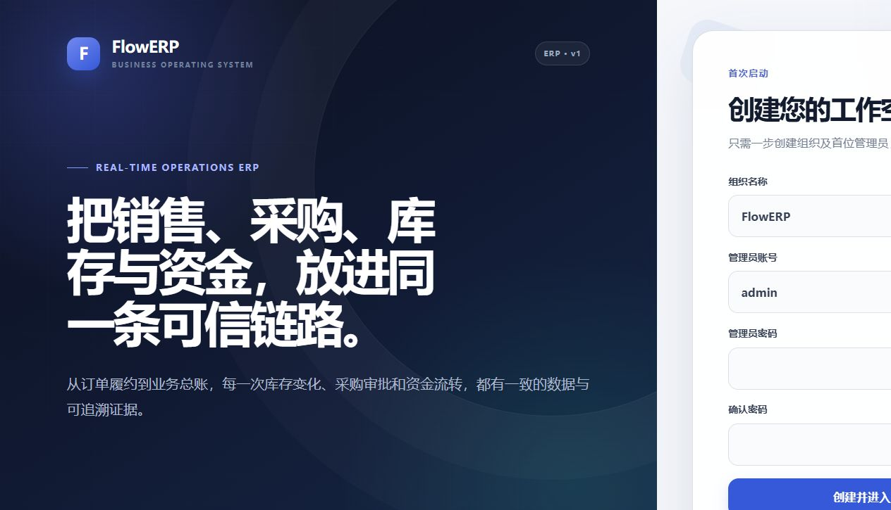
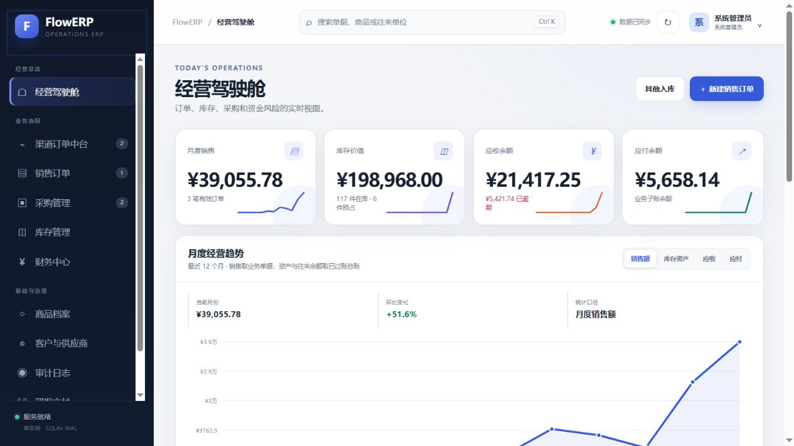
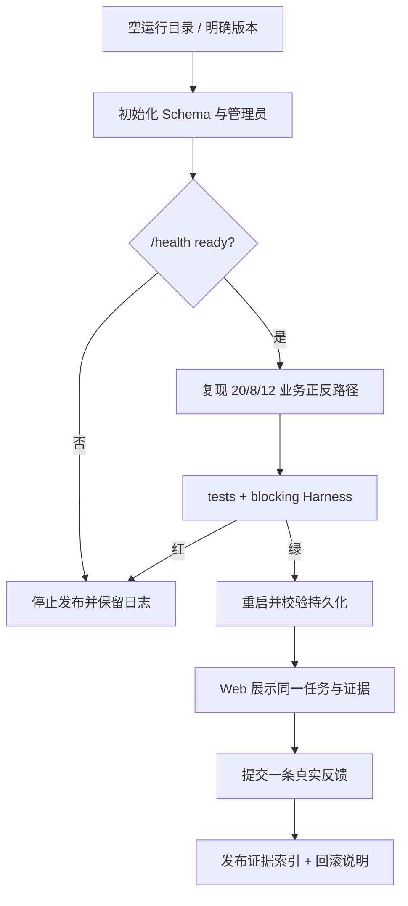
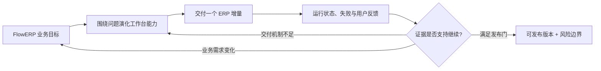
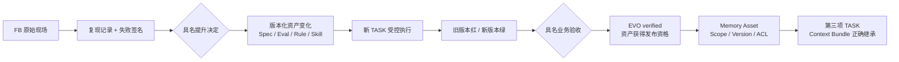
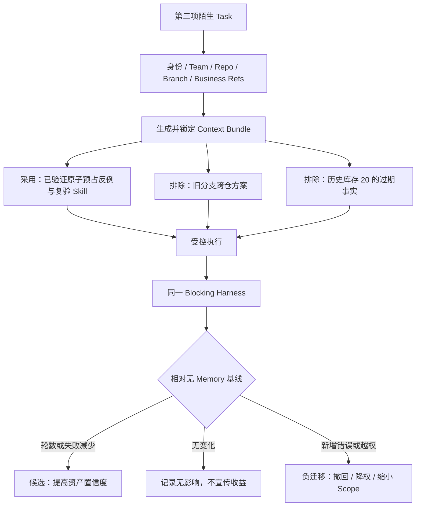
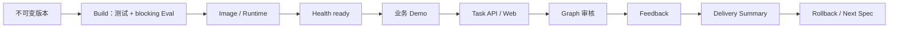
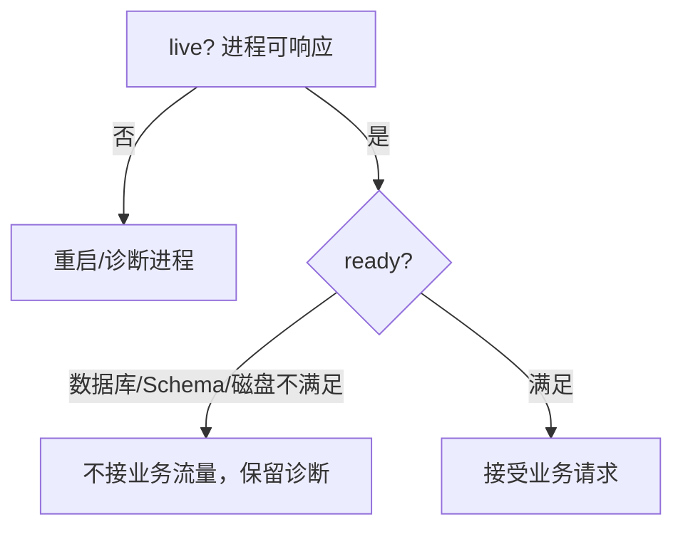
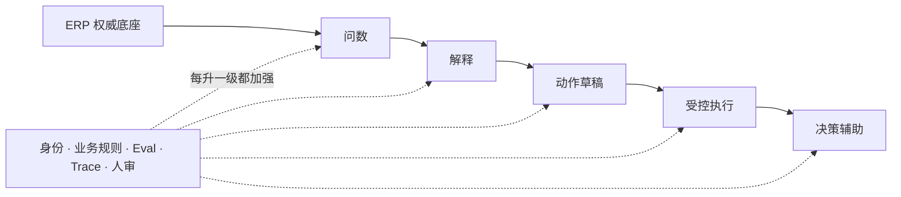

# L16｜冷启动发布与工程答辩

<details>
<summary>本讲课程合同与建设状态（教师/助教）</summary>

- **核心内容**：容器化、健康检查、回滚意识、演示叙事和技术债说明。
- **演示结果**：从干净环境启动系统，展示一次成功任务、一次失败打回、一次结果导出和一次反馈写入。
- **课内增量**：完成结业检查表与五分钟答辩稿。
- **最终验收命令**：

  ```bash
  python -X utf8 -m workbench.cli demo
  python -X utf8 -m eval.harness --suite blocking
  python -X utf8 -m agent.loop --max-rounds 3
  python -X utf8 -m agent.graph --max-rounds 3
  python -X utf8 -m workbench.feedback summary
  ```
- **通过标准**：需求能生成 Spec 和代码；阻断级 Eval 全部通过；Loop 收敛或如实安全退出；Graph 审核结论可追踪；摘要和反馈能够正确生成；干净环境可启动且仓库无密钥。
- **挑战任务**：部署到个人测试环境，提交健康检查、资源上限和回滚说明。

> 课程建设状态说明：本讲冷启动流程、答辩规则、证据索引模板和评价量规属于已经形成的课程设计；学生陌生环境记录、真实答辩表现、CLO 达成度和教学效果属于待真实开课采集。不得用讲师演示、预录视频、模拟评委结论或参考仓库全绿替代学生结业证据。

> **基础线唯一性**：本讲必须在陌生环境现场交付一个此前未实现、范围受控的 FlowERP 小需求；仅冷启动既有演示或复述历史证据不能通过答辩。

</details>

## 连续案例｜第四幕：当作者记忆被从系统里拿走

**时间**：第四周周五 13:30　**地点**：结业答辩现场

评审组提供一台干净电脑和一个此前没有参与项目的复验者。林默可以读取仓库文档和课程基线，但不能复制自己电脑上的数据库、报告或环境变量。第一项任务只是冷启动 FlowERP；页面成功出现后，评审没有给分。

随后抽到的新需求是：“在库存导出中增加一个明确的生成时间，并证明它不会改变排序和可用量口径。”需求很小，却此前没有实现。林默必须重新经历判断价值、澄清语义、签署 Spec、限制写集、运行 Eval、具名审核、生成摘要的完整链路。

现场最容易做的是回忆参考仓库里类似代码，最难的是承认未知：时间使用哪个时区、字段是否进入机器接口、旧消费者能否兼容。答辩者若用历史截图证明当前结果，或只冷启动既有演示，就没有证明工作台能够持续交付。

陌生复验者在最后阶段接过仓库，只根据文档和 Evidence Envelope 重跑命令。他不需要相信林默，也不需要理解全部实现；如果证据链完整，他应能得到同一结论，并指出尚未消除的风险。

> **决策时刻**：请在现场签署“做什么、不做什么、谁审核、如何证明”。需求实现后，主动交出一个仍未解决的风险。答辩通过不是因为系统没有未知，而是因为未知没有被伪装成成功。

故事在这里结束，系统运行并未结束。真实开课产生的首次判断、失败类型、修订幅度和迁移表现，将成为下一轮课程与工作台升级的输入；没有这些真实数据，任何“精品课程成效”都只能标记为待建设。

## 图文学习导航

### 先进入现场：清空本地记忆后，另一个人还能交付一个新需求吗



*观察重点：页面重新出现只证明部署基线可启动。结业要求还包括现场抽取此前未实现的小需求，完成判断、Spec、受控 Diff、Eval、证据、发布摘要和风险答辩。*

**先别看答案**：把所有只能依赖作者电脑、口头说明或历史截图的步骤圈出来。每圈出一项，就把它改造成仓库命令、版本化配置或可下载证据；未知项必须明确标记。

本讲按“陌生机冷启动 → 随机需求 → 全链交付 → 同伴复验 → 风险答辩”学习。用 [Google SRE Release Engineering](https://sre.google/sre-book/release-engineering/) 校准可复现发布和一致门禁，用 [GitHub Skills Quickstart](https://skills.github.com/quickstart) 借鉴由仓库事件推进、由工件反馈完成学习闭环的方式。

## 学员正文｜结业不是重播成功，而是在陌生条件下再次成功

答辩开始前，评审者要求林默离开操作位，并指定一个空运行目录。旧数据库、旧报告、旧会话和作者记忆都不能进入证据链。随后现场抽取一项此前未实现、范围受控的 FlowERP 小需求。终态仓库已有的绿色测试仍然有价值，却不能证明这项新需求经历了判断、合同、失败、实现和人审。

最诱人的错误路线是先写代码，再补一个能通过的测试；或者从预演题库中挑相似答案，展示熟练命令。这样可以完成演示，却无法证明工作台能消费新的输入。L16 的核心证据必须从本次动态 Eval 开始：它在会话基线稳定红，需求实现尚未发生；受控执行产生范围内 Diff；同一个 case 转绿；具名审核者批准；陌生人依据 Release Evidence Index 复验。

先确认16讲基线和机器合同：

```powershell
.\.venv\Scripts\python.exe -X utf8 -m workbench.cli course-status --require-baselines
.\.venv\Scripts\python.exe -X utf8 -m workbench.cli course-contract --lesson 16
```

抽题后，为本次需求登记新 case，并固定“新 Eval 已红、实现未开始”的会话提交：

```powershell
.\.venv\Scripts\python.exe -X utf8 -m workbench.cli course-spec --lesson 16 --eval-case live_draw_rule_is_enforced
.\.venv\Scripts\python.exe -X utf8 -m workbench.cli course-submit --lesson 16 --execute-code --eval-case live_draw_rule_is_enforced --session-baseline-ref refs/heads/l16-session-red
```

评审者不按作者剧本抽查：为什么是真需求；谁有签字权；允许写集为什么足够；哪条失败证明裁判有辨识力；失败后 ERP 状态是否保持；Diff 是否越界；为什么可以发布；还没有证明什么。随后从空目录冷启动服务，复现20台需求、8台可用、12台补货、具名批准、幂等入库与恢复履约，并验证重启、备份和错误路径。

**看似合理的错误路线**是把 Docker 启动成功当作冷启动完成。进程活着不等于数据库可迁移、任务可恢复、业务可对账、证据可下钻。健康检查必须覆盖真正依赖，Release Evidence Index 必须把需求、Spec、红灯、Diff、绿灯、人审、产品状态和剩余风险串到稳定身份。

### 把关键配置读懂｜容器边界证明了什么，又没有证明什么

```yaml
volumes:
  - flowerp-runtime:/app/.runtime
read_only: true
tmpfs:
  - /tmp
cap_drop:
  - ALL
```

- 持久卷把业务运行状态从容器生命周期中分离，容器重建后仍有恢复对象。
- `read_only: true` 限制镜像文件系统写入，迫使持久化位置显式化。
- `tmpfs` 只给临时文件一个可写位置；这里的数据不应被当成可恢复证据。
- `cap_drop: ALL` 收紧进程权限，但它不证明数据库可迁移、任务可恢复或业务规则正确；这些仍要由冷启动、备份恢复和阻断 Eval 分别证明。

**第二次签字**：是否批准发布？结论必须引用本次抽题的动态 case、会话基线、实际写集、阻断报告、具名审核与冷启动复验。任何旧绿色只能作为回归证据，不能代替新需求证据。

课程在这里没有“最后一个答案”。真正的结业成果是一套长期运行机制：新的需求、失败和反馈进入同一工作台，既推进 FlowERP，也升级 Spec、Eval、Harness、Loop、Graph、API 与 Web。下一次陌生需求不是课外题，而是系统继续生长的入口。

<details>
<summary>附录：课程合同、教师活动、技术参考与证据模板</summary>

<details>
<summary>教师备课区：课程目标、评价与持续改进</summary>

## 三载体课堂交接

- **PPT 引导决策**：使用 [PPT 逐讲决策脚本](./PPT逐讲决策脚本.md) 的“L16”四个镜头；在学生提交第一次选择、依据和最大风险前，不揭示后果页。
- **Markdown 承载教材**：本讲连续案例、图文导航与学员正文/核心章节负责查证和建模；学生必须保留第一次判断与证据驱动的第二次签字。
- **VS Code 完成行动**：打开 [课程工作区](../../course/FlowERP-AI研发工作台.code-workspace)，先运行“查看本讲合同”，再按 [L16 行动卡](../../course/tasks/L16-冷启动答辩.md) 构造失败、完成受控修改并复验。
- **回收证据**：命令、输入、退出码、报告 ID、权威状态、Diff 和剩余风险回写本讲提交包；只交投票、代码或绿色截图均退回。

> 载体顺序固定为：PPT 第一次签字 → Markdown 查证 → VS Code 行动 → Markdown 第二次签字。完整规则见 [三载体课程实施方案](./三载体课程实施方案.md)。

## 国家级一流本科课程教学设计卡

| 维度 | 本讲设计 |
|---|---|
| 对应课程目标 | CLO-1～CLO-6：综合创造、运行、解释并捍卫完整 AI 交付作品 |
| 工作台主线增量 | 完成容器化、健康检查、结业检查表、发布证据索引和五分钟答辩 |
| FlowERP 的作用 | 在陌生环境复验旧账，并现场抽取、交付一个此前未实现的小需求 |
| 高阶性 | 在陌生环境和随机追问下综合 Spec、代码、Eval、Loop、Graph、API、反馈与回滚作工程答辩 |
| 创新性 | 作者退场、评审者随机抽查，用冷启动和反证替代排练式功能演示 |
| 挑战度 | 成功、失败打回、结果导出、反馈写入、重启连续和技术债说明缺一不可 |
| 学生中心活动 | 学生担任作者与评审者交叉答辩，随机改变演示顺序并要求现场定位证据 |
| 课程思政融入 | 对发布后果、未证明边界、知识产权、安全和持续维护责任作具名承诺 |
| 形成性评价 | 结业检查表 + 冷启动记录 + 随机抽查 + 五分钟答辩 + 技术债清单 |
| 持续改进数据 | 统计独立复现率、口头补步骤数、风险识别率和各 CLO 达成度，形成下期改进项 |

</details>

<details>
<summary>课程合同、边界与前沿校准</summary>

## 本讲知识合同

| 合同项 | 本讲约定 |
|---|---|
| 主线起点 | L15 的业务与反馈闭环在作者当前环境成立，但仍可能依赖旧数据、旧会话和口头知识 |
| 唯一技术命题 | 如何证明系统在空环境中可启动、可质疑、可恢复、可交接，并诚实声明未证明边界 |
| 必须掌握 | 环境指纹与冷启动；健康检查；持久/备份/恢复；发布证据索引；正确失败与商用边界 |
| 能力判据 | 陌生评审者无需作者补步骤，即可复现业务正反路径、重启连续性、反馈追溯和恢复证据 |
| 本讲不做 | 不扩建抽题范围外的平台能力，不复用旧 `.runtime`，不把容器启动等同生产就绪，不用固定剧本代替随机抽查 |

## 大纲锚点与前沿校准（2026-08-19）

- **大纲锚点**：在干净环境随机展示成功、失败打回、导出和反馈，完成结业检查表与五分钟工程答辩。
- **前沿采用**：采用可重复构建、环境指纹、健康/恢复/回滚和证据索引；Attestation 与 SBOM 只增强来源核验。
- **不越界**：只允许评审者从受控候选池抽取一个小需求；不扩张范围，不复用旧运行目录，不把容器启动、签名或一次演示写成生产就绪和商用效果。
- **链路交接**：结业证据进入 CLO 达成分析与下期持续改进，不以模拟数据补齐教学效果。详见[校准矩阵](./16讲主线与前沿校准矩阵.md)。

**主线坐标**：业务账已经完成“缺货阻断—采购审批—幂等入库—恢复履约”，工程账也形成 Spec—Eval—Harness—Loop—Graph—API—Web—Feedback。最后一讲不仅复验旧账，还要回答：离开作者电脑，工作台能否继续交付一个此前未实现的小需求。

**这一讲把系统推进到哪里**：FlowERP 在复验旧账后，现场交付一个此前未实现、范围受控的小需求；工作台证明规则、评测、状态、反馈和恢复不依赖作者记忆。陌生人从空运行目录完成抽题、Spec、受控 Diff、新 Eval、人审和发布证据索引，或依据可复现证据诚实打回，才构成本讲证据。只冷启动既有演示不能通过。

</details>

## 本讲行动工单：作者退出操作位，让陌生人随机拆解整条证据链

学员冻结功能后清空运行目录，由陌生评审者按文档启动系统并随机指定成功、正确失败、导出、反馈、重启连续和恢复/回滚路径。作者只能通过证据索引回答，不能口头补步骤或调整抽题顺序；评审者再随机追问一个未证明边界和一项技术债，形成带条件通过或退回结论。

- **工作台增量**：可重复启动、健康检查、发布证据索引、恢复/回滚、交接与工程答辩；
- **FlowERP 产品状态**：抽样既有不变量后，由评审者抽取一个此前未实现、范围受控的小需求，现场交付或依据可复现证据诚实打回；
- **失败证据**：隐式依赖、口头补步骤、恢复失败或旧数据污染必须进入修订记录；
- **迁移证据**：作者退场后的陌生人独立复现率，而不是作者演示熟练度；
- **讲师硬门槛**：空目录、随机抽题、具名评审和未证明声明缺一不可。

### 产品化思考终验：不仅展示做了什么，还要解释为什么做减法

评审者从 L01、L03、L12、L14、L15 的产品化思考记录中随机抽取一条，学生必须沿版本说明：首次判断是什么、当时依据什么、哪条真实证据推翻或修正了判断、最终增加/合并/隐藏/删除了什么，以及什么新事实会再次触发复查。

答辩至少包含一次“没有增加功能”的正确决定，例如拒绝伪需求、让低风险任务走快速路径、把内部 Gate 折叠到后台或删除无价值菜单。评审不以对象、Agent、页面和流程数量评分，而以核心任务是否更容易完成、风险控制是否与任务相称、证据和责任是否仍然完整评分。该终验用于证明产品判断迁移，不修改大纲既定的冷启动、随机需求和工程证据基础通过线。

详见[可执行任务卡](../../course/tasks/L16-冷启动答辩.md)。

<details>
<summary>教师备课区：教学活动与达成度设计</summary>

## 本讲教学设计总览

| 项目 | 设计 |
|---|---|
| 建议学时 | 30 分钟线上答辩说明 + 100 分钟线下现场答辩 + 课前独立冷启动 |
| 课堂类型 | **陌生人答辩**：作者退场，评审者随机抽路径、改顺序、要求恢复 |
| 核心问题 | 去掉作者电脑、旧会话和固定剧本后，系统还能否被独立启动、质疑、恢复和继续演化？ |
| 教学重点 | 冷启动、健康、持久化、备份恢复、回滚、证据索引、商用边界 |
| 教学难点 | 识别隐式依赖、未来信息泄漏和“可安装即商用”的过度声明 |
| 课堂产出 | Release Evidence Index + 五分钟答辩 + 随机抽查记录 |
| 价值塑造 | 对发布后果和未证明边界负责，让陌生人能够复验而非依赖作者权威 |

### 可测学习成果

| 编号 | 学习者能够 | 达成证据 | 达成标准 |
|---|---|---|---|
| L16-O1 | 在空运行目录按文档完成初始化、健康检查和业务主线 | 冷启动记录 | 无口头补步骤，无旧数据依赖 |
| L16-O2 | 复现成功、正确失败、重启恢复和反馈进化四类证据 | 现场抽查 | 四类证据均可沿 ID 下钻 |
| L16-O3 | 执行备份验证并解释可触发、可负责的数据回滚方案 | 恢复记录 | 恢复后完整性与关键业务状态一致 |
| L16-O4 | 在五分钟内说明已证明、未证明、责任人和下一轮 | 答辩评分 | 不夸大商用能力，随机追问可回答 |

### 30 分钟线上说明 + 100 分钟线下答辩

线上只说明规则、随机抽查方式、数据与知识产权边界，不预演学生将被抽到的路径，也不替代现场操作。

| 场域与时间 | 评审活动 | 必须留下的证据 |
|---|---|---|
| 线上 0–10 分钟 | 发布冷启动、随机抽查和具名评审规则 | 学生风险预测与诚信承诺 |
| 线上 10–20 分钟 | 讲清 Release Evidence Index、已证明/未证明和技术债口径 | 证据索引草图 |
| 线上 20–30 分钟 | 示范一次失败证据定位，不透露正式抽查路径 | 个人冷启动计划 |
| 线下 0–10 分钟 | 评审者指定全新目录和版本，作者不得代操作 | 环境指纹与初始化日志 |
| 线下 10–25 分钟 | 冷启动并随机复现正确失败及合法恢复 | 业务状态与流水 |
| 线下 25–40 分钟 | 运行单测与 Blocking Harness，随机展开一项 evidence | 报告、退出码和用例证据 |
| 线下 40–55 分钟 | 重启服务，查询同一 Task、事件和人审状态 | 持久化连续性 |
| 线下 55–70 分钟 | 备份、校验、恢复或按预案进行桌面回滚 | 恢复证据 |
| 线下 70–85 分钟 | 抽查反馈到独立后序 Task 的闭环，并注入误导经验 | 改进与负迁移审计 |
| 线下 85–95 分钟 | 五分钟结论先行答辩和随机追问 | 结构化答辩记录 |
| 线下 95–100 分钟 | 评审者宣读通过、带条件通过或退回及复验入口 | 具名终审结论 |

### 达成度与持续改进

采集陌生人首次冷启动成功率、口头补步骤次数、随机抽查通过率、恢复时间、证据回链率和过度声明次数。冷启动与核心业务规则必须 100% 达成；任何伪造证据、匿名审批或 Blocking 红灯宣称通过均硬性退回；两轮答辩中同一隐式依赖重复出现时，必须进入安装脚本、文档或 Eval，不能只补答辩话术。

</details>

## 本讲现场｜把作者的电脑从证据链中移除

结业答辩不是从架构图开始，而是从一个全新的运行目录开始。初始化页面代表系统没有偷偷依赖旧数据库、旧会话或作者手工配置；初始化完成后，经营驾驶舱必须重新从持久化数据计算订单、库存、采购和履约状态。





前三张图形成冷启动证据序列：新环境可初始化、业务账套可运行、研发工作台可追溯。第四张再证明放行结论来自逐项质量证据。答辩时必须能从经营结果下钻到任务和 Eval，不能把页面演示与工程验收拆成两场互不关联的秀。



答辩时必须主动展示一次正确失败：库存不足时订单没有部分预占；未经审批的采购不能入库；服务异常时页面不显示假成功。能证明系统会拒绝错误，才比只展示 happy path 更接近出版级工程课程。

## 最终作品不是两个项目拼盘，而是一套受治理自进化的 ERP 交付系统

结业评审不分别问“ERP 有多少页面”和“工作台有多少 Agent”。评审者随机抽取一项业务事实，要求学员沿着完整因果链追到工程证据；再从一条失败证据反向说明工作台为什么演化出对应能力。

| 抽查起点 | 必须穿透的业务链 | 必须穿透的工程链 | 合格终点 |
|---|---|---|---|
| 渠道订单 `EC-20260817-1001` | 渠道接入→销售单→预占→异常/履约→回传 | REQ→Spec→TASK→Eval→审核 | 不丢单、不重复、不超卖，证据可回指 |
| 20 台需求、8 台可用 | 缺货 12→采购建议→具名审批→幂等收货 | 红色反例→Harness→Repair Task→Loop/Graph | 库存恢复且任何重放不重复入账 |
| 一次 Agent 修改 | 影响了哪笔 ERP 能力 | 写集→Diff→报告→Trace→reviewer | 技术完成不冒充业务完成 |
| 一条用户反馈 | 原始现场、业务影响、处理决定 | FB→EVO→资产变化→独立 TASK→Blocking→复验 | 原文、解释、提升决定和最终验证分离保存 |



答辩中有三句话必须说清：FlowERP 是工作台演化的原因和验收场；工作台是交付 FlowERP 的工程系统；二者通过需求 ID、任务 ID、业务 ID 和证据 ID 关联，但状态机与权限从不混用。能讲清并现场证明这三句话，才真正完成了 16 讲主线。

## 出版级终验：必须现场关闭一条进化循环

冷启动证明“这套系统能从零运行”，还不能单独证明“这套系统会进化”。结业终验必须再随机抽取一条已审核反馈，从旧版本失败一直追到新版本通过，完整展示下面这条链：



评审者要问的不是“飞轮图有没有画”，而是六个可以当场查证的问题：原始观察是否保留；失败能否稳定复现；为什么改变的是这项资产而不是另一项；谁批准了提升；工作台是否在原有写集和门禁下交付；下一版本是否用同一反例证明更好。任一链接缺失，只能叫一次人工修复，不能宣称建立了自进化系统。

建议把 L15 的页面状态裂缝作为标准样例，再由评审者随机替换成 ERP 业务缺陷，例如“20 对 8 被部分预占”。当缺陷属于 ERP 时，进化结果必须同时包含领域修复和阻断级反例；当缺陷属于工作台时，不得借机修改库存或审批口径。这个随机替换能证明方法可以迁移，而不是只背熟一个剧本。


终验不允许只展示这张截图。评审者先在页面随机选一条 `EVO-*`，再直接查询 API：

```text
GET /api/v1/evolutions/{EVO-ID}
```

然后完成六项对账：`feedback_id` 指向 accepted Feedback；`source_task_id` 与 `candidate_task_id` 不相同；两项 Task 至少共享一个 ERP 业务对象；`asset_changes` 每项都有 type、path、reason；候选 Task 的 `summary.decision=pass`、`blocking_failed=0` 且专属报告 SHA-256 可重算；`events` 中依次存在 proposed、approved、asset_changed、verified。最后尝试用源 Task、无关业务 Task 或另一条报告路径调用 verify，系统必须拒绝且原记录保持 verified。截图、API、报告文件和 SQLite 四者任何一处不一致，都视为终验失败。

## 最后一项陌生人测试：换 Session 后能否正确读档

前两项 Task 证明经验产生和资产升级，第三项陌生 Task 才证明经验可继承。评审者关闭原会话，不向新执行者口头解释历史，只提供当前需求、身份和业务对象。系统生成 Context Bundle 后，评审者同时检查“正确召回”和“正确拒绝”。



终场必须提交一张对照表，而不是一句“Agent 记住了”：

| 检查项 | 无 Memory 基线 | 有 Context Bundle | 判定 |
|---|---:|---:|---|
| 首次 Blocking 通过轮次 | 记录实测 | 记录实测 | 是否减少返工 |
| 重复失败签名 | 记录数量 | 记录数量 | 是否避免旧错 |
| Token / 墙钟时间 | 记录实测 | 记录实测 | 成本是否转移 |
| 人工打回 | 记录数量 | 记录数量 | Review 是否更容易 |
| 新增 blocking / 越界写 | 记录事实 | 记录事实 | 是否发生负迁移 |

为了避免“背答案”，后序 Task 必须晚于资产来源；不能把当前任务的修复结果或未来 Case 写进历史包。为了避免“相关即正确”，评审者故意放入一项高相似但分支不匹配的资产；系统若采用它，即使最终碰巧全绿，也不能通过记忆治理验收。为了避免权限泄漏，评审者再放入一项当前身份无权访问的客户资产；Context Bundle 不得暴露其正文、标题或存在性。

当前仓库已经能真实证明 `FB → EVO → 独立 Task → Blocking → 具名 verified`；通用 Memory Asset 和 Context Bundle API 仍是挑战线。因此基础结业要求学员提交可审查的数据合同和人工装配证据，挑战线才要求平台自动路由。课程宁可诚实标注实现边界，也不拿一张 Memory 架构图冒充产品能力。

## 冷启动是对隐式依赖的总审计

开发机长期运行会积累缓存、环境变量、登录会话、手工数据库、未提交文件和本地工具。一个系统在作者电脑上能跑，不能证明交付包完整。冷启动要求从明确版本和干净运行目录开始，只依赖文档声明的环境与配置，重新建立 Schema、启动服务并复现正反路径。

冷启动不是“再启动一次”。它审计安装、配置、数据初始化、健康检查、权限、持久化、备份、报告、秘密边界和回滚意识。任何需要作者口头补充的步骤都是隐式依赖候选。

## 最终交付图



每个箭头都有证据。镜像构建阶段运行完整测试与 blocking Eval；运行阶段使用 health ready；业务 Demo 证明订单/库存/审批；任务与反馈证明工程闭环；摘要和回滚说明完成交接。

## Docker 冷启动基线

准备配置模板，真实 `.env` 不提交：

```powershell
Copy-Item .env.example .env
docker compose -f deploy/docker-compose.yml up --build -d
```

Dockerfile 使用 Python 3.12 slim，复制仓库后在构建阶段执行 unittest 和 blocking Harness；任一失败，镜像不应构建成功。容器命令启动 `workbench.cli serve`，健康检查访问 `/api/v1/health/ready`。

Compose 默认只绑定 `127.0.0.1`，运行目录使用独立 volume，根文件系统只读，移除 Linux capabilities，启用 `no-new-privileges`，限制 PID，配置优雅停止和日志轮转。这些是良好基线，但不等于多节点高可用或完整生产安全认证。

## 健康检查不是“进程还活着”

`/api/v1/health/live` 回答进程存活；`/api/v1/health/ready` 检查数据库、Schema、磁盘、Outbox、备份要求和维护状态。存活但未就绪时，负载均衡不应继续送业务流量。



健康检查不能做破坏性修复，也不能因为页面能打开就返回 ready。生产配置若要求近期备份，缺少已验证备份应影响就绪。

## 最终验证命令

```bash
python -X utf8 -m workbench.cli demo
python -X utf8 -m eval.harness --suite blocking
python -X utf8 -m agent.loop --max-rounds 3
python -X utf8 -m agent.graph --max-rounds 3
python -X utf8 -m workbench.feedback summary
```

另运行完整测试：

```bash
python -X utf8 -m unittest discover -s tests -v
```

Loop 在全绿仓库应第一轮 converged；Graph 应 completed；Feedback 命令成功并报告真实数量。命令顺序不是魔法，关键是每条结论、退出码和报告一致。

## 五分钟答辩结构

### 0:00–0:30 业务痛点

20 台订单、8 台库存。不可接受结果是部分预占、未审批入库、重复到货和假成功。

### 0:30–1:30 架构

FlowERP 负责业务状态，FDE Workbench 负责 Spec、Eval、Harness、Repair、Loop、Graph、API、Web 和反馈。强调唯一质量入口与状态权威源。

### 1:30–4:00 成功与失败证据

演示缺货整单失败且库存不变；未审批收货失败；审批后幂等入库；恢复预占发货；Harness 报告；任务事件链；具名审核。

### 4:00–5:00 技术债与下一步

同步任务线程、单仓课程模型、SQLite 单写边界、真实平台授权未接、容灾与法定财税未覆盖。下一步从已审核多仓反馈建立 Spec，而不是现场许诺全部完成。

## 一次成功、一次失败、一次导出、一次反馈

答辩至少包含：成功——审批后补货并发货；失败——库存不足或未审批收货被可靠阻断；导出——交付摘要、Harness JSON 或业务 CSV；反馈——新增 pending_review，具名审核后进入 accepted/rejected。

失败演示不是临时制造崩溃，而是业务规则正常工作。讲师会追问失败后状态是否不变、证据在哪里、能否重放。只展示错误弹窗不够。

## 持久化与重启

创建任务和反馈后重启服务/容器，重新查询 Task ID、状态、events、review。业务数据库 volume 与镜像分离，应用升级不应丢数据。与此同时，不能把旧 volume 当冷启动的唯一证据：Schema 初始化还要在全新 volume 抽样。

建议做两类实验：全新 volume 证明可初始化；已有 volume 证明可升级/重启。二者回答不同问题。

## 备份与恢复验证

```bash
python -X utf8 -m workbench.cli backup --label before-release
python -X utf8 -m workbench.cli verify-backup .runtime/backups/<backup-file>
```

备份存在不等于可恢复。验证应检查校验和、解压、SQLite integrity 和 Schema。Windows 文件锁等平台问题必须如实记录；不能因为默认 Python 通过就忽略声明支持版本上的失败。

## 回滚意识

应用镜像可以回到上一个通过 blocking Eval 的 Tag，但数据库 Schema 可能不可逆。`deploy/ROLLBACK.md` 明确：数据卷与镜像分离；迁移前备份；使用向前兼容迁移；课程不演示破坏性数据库回滚。

回滚计划至少回答：触发条件；决策人；应用版本目标；数据是否兼容；如何进入维护模式；如何验证恢复；失败证据存哪里；如何通知用户。没有数据策略的“docker down/up”不叫回滚。

## 课内失败实验：隐式依赖

从干净目录检出指定版本，不复制作者 `.runtime`。若启动依赖已有数据库、未写明环境变量或本地登录状态，记录为失败。修正文档或初始化逻辑，再从头复验。

另一个实验是删除 `.env` 中可选值，确认默认值与生产必填项行为清楚。应用不会自行读取任意 `.env`；Compose 按自身规则读取。不要在课件里模糊这两种加载机制。

## 发布证据索引

```markdown
# Release Evidence Index

- Release tag / commit：
- OS / Python / Docker / Codex 版本：
- 安装与配置：
- 完整测试：命令、退出码、日志：
- Blocking Harness：报告、summary、退出码：
- Demo：订单、库存、采购、入库键：
- Loop / Graph：状态、Trace、审核人：
- API / Web：Task ID、重启证据：
- Feedback：FB ID、审核状态：
- Backup verify：
- 已知限制：
- 回滚步骤与触发条件：
```

索引不是复制所有文件，而是让陌生评审者在五分钟内定位证据。

## 商用边界必须诚实

当前 FlowERP 适合单组织或小团队、单实例、中低写入并发、人民币为主的贸易/电商/仓储试点。它不等于 PostgreSQL 集群、跨可用区容灾、真实电商平台授权、完整 WMS、法定财务申报或全部地区合规。

测试与 Eval 通过只证明当前版本、当前环境、当前题库覆盖的规则。答辩中夸大能力会破坏 FDE 最核心的结果责任。

## 故障答辩问题

准备回答：如果 blocking 报告缺失却 CI 绿，哪里错；如果 Loop 三轮未收敛能否发布；如果人审匿名能否完成；如果服务重启任务丢失说明什么；如果同一入库键结果不同如何处理；如果备份存在但无法恢复是否 ready；如果用户要求取消采购审批如何进入反馈治理。

回答必须引用机制与证据，不只说“我们会注意”。

## 随机抽查，不按作者剧本走

- [ ] 从明确版本和干净环境启动；
- [ ] 构建阶段完整测试与 blocking Eval 通过；
- [ ] live/ready 语义正确；
- [ ] 成功与正确失败都可复现；
- [ ] Task/Feedback 重启后可查；
- [ ] Loop 只有 converged 返回成功；
- [ ] Graph 审核具名且 Trace 完整；
- [ ] 备份完成恢复验证；
- [ ] 仓库无真实 `.env`、密钥、运行数据库和报告；
- [ ] 回滚触发与数据策略清楚；
- [ ] 技术债和商用边界如实说明。

<details>
<summary>讲师用：验收、练习与评分</summary>

## 结业作业与评分

提交冷启动录屏或现场记录、证据索引和五分钟答辩稿。评审者从干净环境抽样运行 L01、L08、L12、L16 关键路径。任何核心业务规则被破坏、blocking 失败仍宣称通过、匿名审批、伪造证据或无法启动，均为硬性退回。

| 项目 | 分值 | 合格表现 |
|---|---:|---|
| 冷启动 | 20 | 陌生环境按文档启动 |
| 业务正确性 | 20 | 库存、幂等、状态、审批 |
| 质量证据 | 20 | 测试、Harness、CI、失败保留 |
| 自动化控制 | 15 | Repair、Loop、Graph 边界 |
| API/Web/反馈 | 5 | 真实持久化与具名审核 |
| 自进化与经验继承 | 10 | FB→EVO→资产升级→独立 Task→Memory 候选→第三 Task 装配与负迁移检查 |
| 运行与回滚 | 5 | 健康、备份、恢复、回滚 |
| 表达诚实 | 5 | 限制、技术债、不夸大 |


</details>
## 结业后的下一轮

课程终点不是停止变化，而是获得一个可重复飞轮：现场反馈进入待审对象；有效反馈进入下一版 Spec；新规则先设计失败 Eval；Eval Harness 给统一质量结论；Repair、Loop、Subagents 和 Graph 在 Agent Harness 的权限与状态边界内推进；API/Web 交付；冷启动重新证明。业务对象可以换成支付、知识库或数据平台，这条纪律仍然成立。

对 FlowERP 而言，下一轮不是一口气把 Agent 放进所有业务动作，而是沿授权阶梯逐级扩大能力：

| 阶段 | Agent 能力 | 必须存在的控制 | 发布判据 |
|---|---|---|---|
| 0 权威底座 | 不能代替 ERP，只能读取课程材料 | 业务不变量、身份、状态机、审计先成立 | 人工操作链路已经可复验 |
| 1 问数 | 查询库存、订单、采购与交付证据 | 指标口径、权限过滤、来源与 `as_of` | 回答可追到具体单据和时间 |
| 2 解释 | 说明缺货、阻断和异常可能来自哪里 | 事实/推断分栏、禁止伪造唯一根因 | 用户能复现证据并质疑解释 |
| 3 草稿 | 生成补货建议、修复任务或审核摘要 | 草稿状态、Diff、写集和撤销路径 | 未确认前不改变权威业务状态 |
| 4 受控执行 | 在授权下创建订单、启动 Eval、提交审批 | 服务端校验、幂等、最小权限、具名人审 | 非法动作稳定失败且留下事件 |
| 5 决策辅助 | 比较方案、成本、风险和历史反馈 | 决策依据、反例、责任人、持续评测 | Agent 给建议，人对结果负责 |

这条路线刻意把“能生成”与“能生效”分开。越靠近资金、库存、发货和审批，要求的不是更长 Prompt，而是更强的服务端控制、轨迹证据和回滚能力。课程最终作品要证明的不是“Agent 已经接管 ERP”，而是“Agent 的每一级能力都有明确授权、证据和停止点”。



产品线因此与教学线汇合：业务侧从账本和规则走向可信的人机协作，工程侧从 `AGENTS.md`、Spec、Eval 走向 Harness、Loop、Graph、API、Web 与 Feedback。它们不是两门拼在一起的课，而是同一宗 20/8/12 事件的两本账——一边证明业务状态合法，一边证明 AI 参与过程受控。

## 答辩前 30 分钟排练清单

锁定 commit/tag，不在排练中继续加功能；确认工作区无未提交业务改动；准备全新运行目录或 volume；记录版本矩阵；按文档从第一条命令执行；每步保存退出码；打开 Harness JSON、任务详情和反馈审核页；准备一个可控失败；确认失败后数据库未污染；准备备份验证结果和回滚文档；关闭任何会泄露密钥、个人路径或客户数据的窗口。

演示失败时不要慌着跳过。先判断是预期业务阻断、代码缺陷、环境问题还是外部依赖；展示证据；说明是否影响交付；按预案决定继续、切换备用环境或停止。能够诚实、快速地处理失败，本身就是工程能力。

## 陌生评审者抽样脚本

评审者可不按讲师安排随机抽查：删除运行目录后执行 doctor；创建 20 对 8 订单；检查缺货后 reserved；重放同一 receipt key；尝试 draft 直接发货；尝试未审批采购收货；运行 blocking Harness；让 Graph暂停并匿名 approve；重启服务查询任务；重复审核反馈；验证备份。课程资产若只对固定录屏路径有效，会在抽样中暴露。

## 发布后的责任

发布不是把证据压缩包交出去就结束。需要版本变更日志、问题分级、勘误渠道、回滚负责人和下一次复验日期。Codex、Hooks、Subagents 等外部工具行为变化时，先判断是否影响课程合同；按钮位置变化可以勘误，命令、权限、Hook 协议或报告结构变化则必须重新验证相关讲次。

最终要让学员带走的不是一套固定截图，而是结果责任：知道什么必须被证明，什么尚未证明；知道自动化何时继续，何时停止；知道人在哪里批准，失败在哪里留下；知道怎样让下一位陌生人独立重现并质疑自己的结论。这才是 FlowERP 主线之外真正可迁移的作品。

## 把最后一个句号改成下一轮输入

### 发布不是一个 Gate，而是一组可比较的晋级证据

| 晋级对象 | 必须固定的身份 | 最低证据 | 失败时动作 |
|---|---|---|---|
| 代码候选 | commit / tag | tests、blocking Harness、Diff 审核 | 拒绝合并 |
| Agent 配置 | 模型、Prompt、工具与权限版本 | 回归集、holdout、Trace 规则 | 回退配置 |
| 运行镜像 | digest、依赖锁、Schema 版本 | 冷启动、健康、备份恢复 | 停止发布或回滚 |
| 业务账套 | organization、迁移版本、备份 ID | 对账、权限抽样、恢复演练 | 进入维护并人工核对 |
| 课程内容 | 讲次版本、命令与截图来源 | 陌生人跟跑、断链检查、勘误记录 | 暂缓出版 |

前沿系统必须承认模型、工具协议、Hooks、浏览器和依赖都会变化。因此发布证据不能只绑定代码：模型或工具版本升级后，即使业务代码没变，也要重跑受影响的 Eval、Trace 和冷启动路径。真正可持续的“AI Native”不是永远在线，而是每次变化都知道需要重证哪些承诺。

答辩通过并不意味着系统从此正确，只意味着这个版本、这套环境和这组已声明风险拥有足够证据。发布后的第一条真实反馈会重新进入 Spec，下一条新规则会先面对失败 Eval，下一次工具升级会重新触发冷启动验证。请在结业页写下一个可被未来事实推翻的承诺：**我交付的不是“AI 已经做完”，而是一条任何人都能检查、停止、恢复和继续改进的责任链。**

</details>
