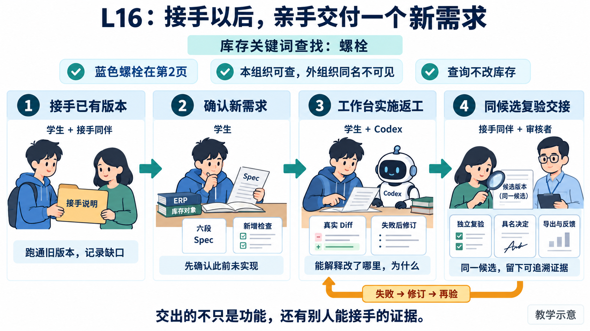
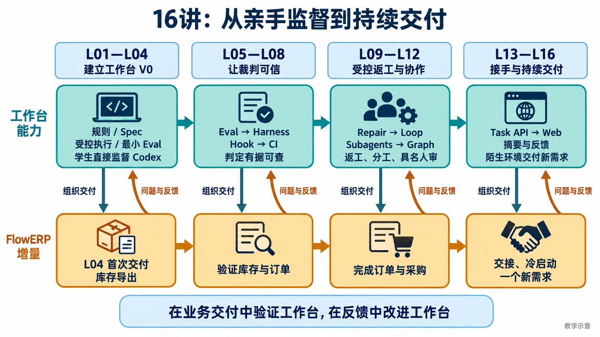
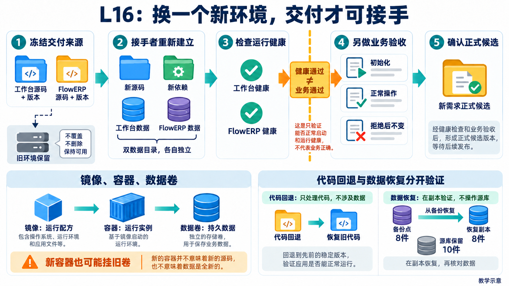
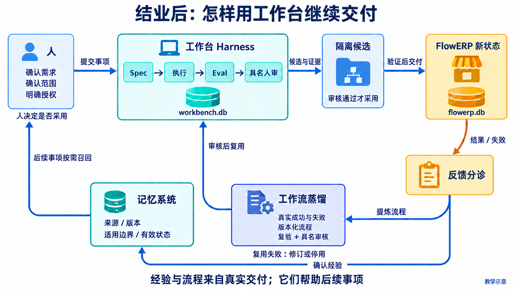
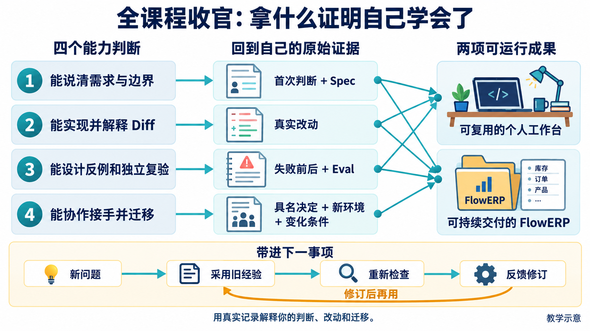

# L16｜在新环境接手，并完成现场新需求

**本讲要完成一件事：让另一位同伴在新环境接手已有系统，再通过工作台交付一个此前未实现的 FlowERP 小需求。** 最后，你要能解释：从哪个版本出发，为什么这样改，怎样证明结果，出错时怎样恢复。

我们沿用一个教学场景：林舟交出工作台与 FlowERP，陈珂负责接手；系统启动后，业务用户周宁提出：“接单前，能按商品名找到本组织所有符合条件的库存吗？”陈珂需要把这句话变成可检查的要求，再组织 Codex 实现。人物、商品和数量是教学设定。实际实践须先调查自己的版本；如果库存查找已经实现，就选择另一项真实缺口。

先抓住三个交付对象：**工作台负责组织交付，FlowERP 产生客户可见的变化，你负责判断与验证。** 工作台的新检验是换了环境与需求后，仍能限制改动范围、保存失败、组织复验和记录人的决定；FlowERP 的新结果是经过验收的小能力；学生的成果是接手记录、需求判断、真实改动与答辩。

三份材料沿同样的七步展开。本文解释为什么这样做，[实践操作手册](实践操作手册.md)给出操作，[提交模板](SUBMISSION.md)记录你的判断和结果。

## 结业实战：这一讲要亲手交出什么

前十五讲已经分开练过需求、检查、返工和协作。L16 把它们放到一件新事情中：接手者无法借用你的环境，需求方改变了条件，你仍要从确认问题走到可接受的代码版本。**本讲要有真实的新实现；启动现有页面、运行参考演示或整理旧截图，都只覆盖其中一部分。**

| 你要亲手做的工作 | 可以检查的产物 | 本例的具体动作 |
|---|---|---|
| 把已有交付交给别人 | 写好的接手说明，以及同伴首次操作与修订记录 | 写清双仓版本、依赖、数据目录；让同伴启动并抽查原业务 |
| 把新请求变成可判断的要求 | 本人确认的 Spec、新增检查和真实起始失败 | 决定查当前页还是全部库存；用第 2 页目标检验缺口 |
| 组织 Codex 实现并纠偏 | 工作台正式任务、源码 Diff、失败原因与修订结果 | 改对查询位置与权限边界，保持冻结检查，重新复验 |
| 将可接受的结果交出去 | 同候选复验、具名决定、导出、反馈和答辩稿 | 同伴亲自查询，核对外组织不可见及库存不变，再说明接受范围 |

**图 16-1　从接手到新交付，四件工作属于同一件事。**沿箭头读：已有版本提供起点，学生和需求方确定新要求，工作台组织 Codex 实施，同伴依据同一候选复验。每一栏下面是要交出的材料；人物与数据为教学示意，实际姓名、任务和结果来自自己的操作。

你需要保留的主干只有两条：**旧系统在新环境可重建，新需求在正式候选可交付。**下面七步把这两条接在一起。长命令在手册中按步骤查阅；在线精讲聚焦关键判断，完整实施、同伴复验和迁移在实践中完成。

## 先回看建设路线：为什么十六讲这样排列

**图 16-2　工作台的能力增长，用 FlowERP 的结果验证。**先看四个阶段的连续箭头，再对照上方工作台能力与下方产品变化。L04 是转折：先补齐工作台 V0，才首次通过它交付 ERP。此后 ERP 现场的失败与反馈回到工作台，推动下一轮建设。

第一阶段解决“怎样说清并完成一次交付”；第二阶段追问“检查为什么值得信任”；第三阶段处理“失败后怎样返工、分工和审核”；第四阶段检验“别人能否使用、接手并继续交付”。上一阶段留下的证据，是下一阶段作判断的起点。L16 的新环境与现场新题，正好让整条链接受一次综合检验。

| 步骤 | 这一刻要回答的问题 | 留下的产物 |
|---|---|---|
| 1. 交接已有版本 | 同伴究竟接到哪一版？ | 双仓版本与交接说明 |
| 2. 在新环境启动双系统 | 不依赖作者电脑，旧交付能否运行？ | 冷启动与业务抽查记录 |
| 3. 确认现场新需求并建立检查 | 缺什么能力，怎样识别正确结果？ | 确认版需求与实现前检查 |
| 4. 通过工作台实施与返工 | Codex 改了什么，失败怎样处理？ | 正式任务、候选与修订记录 |
| 5. 复验同一候选并由人决定 | 这份改动能否被接受？ | 独立复验与具名结论 |
| 6. 验证恢复、导出与反馈 | 接手者能否继续查证和维护？ | 恢复记录、导出、反馈与证据索引 |
| 7. 答辩并说明迁移 | 你能否解释判断，并用于下一项需求？ | 五分钟答辩与迁移说明 |

## 第 1 步：交接已有版本

林舟说“代码都在仓库里”，陈珂却仍可能无法重建：提交号没有包含未提交改动，运行数据库没有随源码交出，启动命令指向作者的虚拟环境。交接首先要回答的是“这些材料是否说明了同一个起点”。

工作台与 FlowERP 是两个独立仓库。分别记录源码版本、未提交改动、依赖安装方式、启动命令、数据目录和已知缺口。若本次交付包含未提交内容，就要保存那份内容的快照或差分，让接手者能核对；单独一个提交号无法代表它。

图中三层对象依次承担“说明原起点、验证重建、实施新需求”。实际命令还会把候选分为两份：**检查候选**用来新增验收、冻结检查；**正式交付候选**由工作台创建，供 Codex 实施及同伴复验。候选就是一份与日常源码隔离、等待检查的代码版本。后面每次操作都要确认是哪一份。

陈珂接到交接说明后，应能找到两个仓库、自己的安装步骤和证据位置。此时尚未证明冷启动成功，但已经有了可验证的起点。先写下你认为最容易遗漏的交接条件，下一步再拿实际观察检验这个判断。

**本步完成判断：**同伴知道重建哪一版、用什么命令、数据放在哪里，以及哪些项尚未验证。对应[手册第 1 步](实践操作手册.md#step-1)。

## 第 2 步：在新环境启动双系统

### 为什么要让同伴只按说明操作

作者熟悉自己的环境，会无意识地补上文档没有写出的条件。同伴只按说明操作，才会暴露这些缺口。新环境要有自己的源码、依赖与运行目录；同一台机器上的新目录只证明本机隔离重建，陌生机器和容器仍要各自取证。

遇到错误时，先保留命令、退出码和日志，再定位原因。例如[历史冷启动观察](examples/cold-start-observation.md)曾出现“FlowERP 已启动、工作台退出”，原因与源码缺少 Git 工作区信息有关。这个案例提供排查线索；你仍要依据自己的日志判断。给压缩源码补 Git 元数据，也不会恢复原课程标签与提交历史。

### 启动、健康、业务操作分别证明什么

工作台首页组织事项与决策，默认地址是 `http://127.0.0.1:8001/`，使用自己的 `workbench.db`；FlowERP 是客户操作界面，默认地址是 `http://127.0.0.1:8000/`，使用自己的 `flowerp.db`。实验换端口时，要同步核对工作台打开的是哪个客户实例。

先检查进程能启动，再检查工作台 `/api/health` 和 FlowERP `/api/v1/health/ready`，最后做一项原有业务。健康入口成功，只支持它所检查的条件满足；业务正确还需要实际输入与结果。

例如在新教学账套中新增 SKU `COLD-16`，再提交同一 SKU。第二次应被拒绝，刷新和重新登录后仍只有原记录，名称不变。这样同时检查了成功、拒绝以及数据持久化。它验证的是旧业务能在新环境运行，还没有完成周宁的新库存需求。

| 观察到的问题 | 先核对什么 |
|---|---|
| 服务没有响应 | 启动日志、进程、端口与当前路径 |
| 健康正常，但仍停在初始化页 | 组织与账号初始化是否完成 |
| 页面能操作，但对象不对 | 当前账号、组织、服务地址与数据目录 |
| 工作台找不到旧任务 | 旧证据是只供回查，还是已按备份方案恢复到该实例 |

空数据库不会因为源码相同而自动出现旧任务。旧任务可以从交接证据回查；若要恢复运行记录，应按第 6 步的工作台备份规则处理。

### 容器在这里解决什么

容器镜像把程序和运行条件打包，容器是按镜像启动的实例，数据卷保存实例之外的数据。新建容器仍可能挂着旧卷，所以验证空状态启动时，要同时核对镜像身份、项目名、数据卷和端口。

[部署说明](../../../deploy/ROLLBACK.md)使用 Compose 配置两套服务、端口和独立卷。当前容器部署用于运行验证；它没有自动携带课程 Git 历史、Codex 认证或可写的源码执行区。完整现场开发还需要手册规定的控制实例与隔离候选。没有可用容器引擎时，可以完成本机隔离重建，并将容器构建、空卷启动标为未验证。

**图 16-3　新环境交付有不同的核对关口。**按主箭头检查源码与依赖、两套数据归属、健康入口和真实业务；健康通过后仍要初始化并实际操作。侧栏的关系是：镜像启动容器，容器可以挂载数据卷。恢复例中的 8 件来自备份点。图解释检查对象，实际容器、候选和恢复是否通过，要查看自己的报告。

**本步完成判断：**同伴按说明启动正确实例，完成健康与业务抽查；保留实际失败、说明修订和再次操作结果。第一次就成功也照实记录。对应[手册第 2 步](实践操作手册.md#step-2)。

## 第 3 步：确认现场新需求并建立检查

### 先确定周宁究竟要找什么

“加一个搜索框”还不足以决定实现。陈珂要问清：查当前页还是本组织全部库存？完全匹配还是关键词匹配？空结果如何提示？其他组织的同名商品能否看到？查询会不会改变库存？

本例确认的要求是：**按商品名关键词查询本组织全部库存，包括当前页之外的结果；空结果有明确提示；保持原权限与只读性。** 不增加库存写入，不修改订单和采购流程。这些决定由需求方和学生确认，Codex 协助调查及表达。

把确认结果写成 Spec，也就是本次任务规格。六段依次说明来源、目标、非目标、约束、验收用例、完成定义。写集是其中批准修改的文件集合，需根据代码位置收窄，帮助后续审核判断是否越界。

### 怎样让检查识别错误方案

只有一页、一个组织的数据时，前端过滤当前页和正确的完整查询可能显示相同结果。为区分它们，本例安排有辨识力的检查。表中数据是教学预期，实际 ID 和数量来自自己的账套。

| 验收数据与输入 | 正确结果 | 可以发现的错误 |
|---|---|---|
| 本组织“蓝色螺栓”在第 2 页，当前只加载第 1 页；查询“螺栓” | 返回该商品 ID | 只过滤当前页数组 |
| 另一组织也有“蓝色螺栓”；用本组织账号查询 | API 原始响应和页面都没有外组织商品 ID | 丢失组织过滤，或只在页面隐藏泄漏数据 |
| 查询前后核对同一商品的库存、预占与账本 | 数量及账本不变 | 查询误写数据 |
| 输入无匹配关键词 | 明确显示空结果，没有旧列表残留 | 用旧结果伪装查询成功 |

图中的蓝色部分固定候选、账号和对象，红色部分给出容易假绿的反例，绿色部分把检查结果关联到同一候选。组织边界要核对 API 响应，因为被页面隐藏的数据仍可能已经发到浏览器。[可编辑源图](assets/reading-depth-20261003/mechanism.drawio)保留了检查布置。

这些针对本次需求新增的检查叫**动态 Eval**。Eval 是可重复执行、比较预期和实际的验收检查。它补充旧检查，帮助判断新要求；仅有旧的 blocking 检查全绿，还不足以证明新要求已满足。

先只建设检查，运行它们，再实现功能。应看到既有合同检查通过、新检查因为目标能力缺失而失败。缺依赖、模块无法加载、未知用例或端口冲突都要先排除；这些失败无法说明需求缺口。若新检查已绿，调查能力是否已存在或断言是否太弱，再决定换题或修订检查。

课程命令使用的起始标签可能包含历史组合源码，和你刚冷启动的当前双仓版本不同。正式执行前，须在将要实施的那份基线上再次确认缺口与检查结果。不能把当前客户仓库的失败拼到另一份候选上。

**本步完成判断：**需求方确认了六段 Spec；新增检查有真实名称、输入和预期；旧绿、新红的原因可解释；检查已冻结，尚未实施业务功能。对应[手册第 3 步](实践操作手册.md#step-3)。

## 第 4 步：通过工作台实施与返工

### 从准备检查进入正式实施

在工作台首页“事项与决策”记录这项需求。学生确认需求版本、实现写集与执行授权后，由工作台创建正式任务，调用 Codex 在正式交付候选中实施。准备检查的候选和正式实施的候选是两份源码，工作台返回的 `isolation.path` 才是这一轮正式实施与复验的位置。

第 3 步先把新增检查保存为一条 Git 提交。工作台以这条提交创建正式候选，先复现“旧绿、新红”，再实施功能；冻结的检查文件不在本轮实现写集中。复验时比较检查提交与最终候选，确认检查内容未被改动，这样前红与后绿才是在检验同一要求。

### 库存查找实际需要改哪一层

先用需求判断修改位置，再确定文件写集。若要求查到当前页之外的库存，仅修改页面数组过滤就无法交付。本例至少要检查以下职责；实际文件名由你调查该候选后填写。

| 实现位置 | 这层负责什么 | 为什么要这样安排 |
|---|---|---|
| 业务查询 | 在当前组织允许访问的数据中匹配关键词，再处理分页 | 先取一页再筛选会漏项；先读全库再在页面隐藏会泄漏数据 |
| HTTP 接口 | 接收约定查询条件，保留原身份与权限，返回结果或明确错误 | 页面与直接接口调用必须遵守同一业务规则 |
| 客户页面 | 展示查询中、结果、空结果与失败，避免旧列表冒充新结果 | 用户必须看出这次查询是否有效，才能据此接单 |
| 本次验收 | 用跨页、跨组织、空结果与只读输入观察同一候选 | 让错误实现产生不同结果，避免一个好看的搜索框就被接受 |

学生先解释这些职责怎样满足 Spec，再让 Codex 在正式任务的授权范围内实现。若本题只需要其中一层改动，就说明其他层已经怎样支持要求，保持最小范围。由实现者自行降低验收要求，会把真实问题藏到绿灯后面。

本例要求查询完整且受组织权限限制的数据。只对已加载列表筛选，可能找到第 1 页商品，却找不到第 2 页目标。若第一次候选这样实现，跨页检查应失败；保存它的报告与源码差分，再依据原要求返工。源码差分通常叫 Diff，它说明实际改了哪些文件和内容。

失败打回意味着这一候选没有被接受，要说明原因并进入修订。预算耗尽、授权不足或无法复验时，则保留最后状态，安全退出并交人决定。成功结果也要对应本轮任务、候选、检查与真实业务对象，不能只引用 Codex 的完成说明。

### 失败发生在哪个对象上

按图从上到下核对：

| 失败类型 | 本例发生了什么 | 失败后的正确处理 |
|---|---|---|
| 业务拒绝 | 重复 SKU 建档被拒绝 | 原商品记录不变，保存拒绝与数据核对结果 |
| 服务故障 | 库存读取失败 | 显示失败，旧余额不能冒充本次结果；查日志与服务状态 |
| 研发打回 | 候选未通过验收，或人审认为不能接受 | 保存候选和理由，修订后重新复验 |

前两项验证的是业务和页面的失败行为，第三项才进入研发返工。环境打不开先修环境，验收不满足则依据需求修实现；这些原因也要在原报告中说清。

如果周宁提出原 Spec 没有约定的新条件，先判断它是否改变本次目标，再更新需求和授权。不要把新条件悄悄塞进原检查，也不要降低原有检查来消除失败。返工后的新任务或候选应能回指原失败，重新复验；首页与命令行尚未自动贯通的关联，要显式记录。

**本步完成判断：**有真实调用、正式 Task ID、候选路径、范围内 Diff 和前后报告；失败与返工关系可回查。自动检查绿时，任务仍可能处于 `review`，等待人的决定。对应[手册第 4 步](实践操作手册.md#step-4)。

## 第 5 步：复验同一候选并由人决定

让没有参与实现的人拿到同一份候选、Spec 和操作条件，独立运行新增检查与阻断级 Eval，再实际操作客户页面。**具名人审**是实际复验者根据这些证据记录接受或打回的理由与范围，姓名来自真实参与者。

仍沿库存案例：新候选需要同时满足跨页查找、组织隔离、只读和空结果提示。不能拼接“旧版权限通过”和“新版跨页通过”得到全绿；候选一变，整组检查就要重新运行。页面、API 响应和业务数据库也必须对应这份候选及同一对象。

Loop 是有预算的修复循环，Graph 是用明确节点和状态组织执行与审核的流程。结业核对要解释 Loop 是否收敛或为什么安全退出，Graph 的决定来自谁、绑定哪个状态与报告。运行参考 Loop 或 Graph，可以检查入口与状态；它们并不会自动证明这一现场任务经历了真实修复和人的接受。Graph 等待人工审核也应保留待审状态。

这里有两个要分别说明的决定：正式 Task 的审核与接受，以及独立 Graph 运行的节点决定。记录了后者，并不自动接受前者；自动演示审批也不能代替实际复验者。

**本步完成判断：**同一候选通过本题检查与应有回归，实际用户路径可核对，具名决定可追踪。没有实际审核者时写“待审核”，继续保留缺项。对应[手册第 5 步](实践操作手册.md#step-5)。

## 第 6 步：验证恢复、导出与反馈

### 程序回退与数据恢复分别解决什么

程序回退是改用上一已验证版本，数据恢复是回到某个备份点。新版查询有错误，但业务数据没变时，可能只需程序回退；如果修改过表结构，旧程序是否能读当前数据库还要检查。保存确切源码版本或镜像 ID，才能定位要回到哪一版。

恢复实验先在独立副本做。假设备份时库存为 8 件，后来合法入库 2 件，源库为 10 件；从那份备份恢复的副本应为 8 件。这个结果证明备份点可恢复；后来 2 件是否需要补录或继续保留，要按真实账本与业务决定处理。

工作台与 FlowERP 使用各自的备份办法。工作台备份需包含数据库及相匹配的文件证据；当前恢复命令只支持本机原绝对路径，目标必须为空，恢复首启不自动重放旧任务。恢复旧记录后，仍要核对执行环境与授权。课堂 FlowERP 副本实验没有验证工作台恢复，也没有完成生产回滚。

### 导出、反馈、索引怎样帮助下一位接手者

结果导出让接手者读取本次任务与交付内容。真实反馈记录使用者在哪个版本、哪个场景遇到什么困难，你如何解释并决定修订或暂缓。证据索引再把需求、版本、Diff、失败、复验、人审、恢复和反馈的位置串起来。

索引是一份可回查的目录，生成它不会替你执行验收、导出结果、写反馈或发布。随机点开一个结论，应该能回到原报告或操作记录。`demo` 自动生成的示例审核和反馈，应按来源标为参考演示；本次实际反馈还要由真实使用者提供并记录到正确的工作台运行目录。

技术债说明以后可能需要支付的维护成本。例如本次只验证了约定数据规模，更大规模需要另测，可以写清触发条件与计划。跨组织泄漏、目标查不到或查询改了库存则是本次合同失败，需先修复。

**本步完成判断：**恢复点及限制说得清，实际导出能读取，反馈能回查，索引指向原材料，缺项与技术债均有下一步。对应[手册第 6 步](实践操作手册.md#step-6)。

## 第 7 步：答辩并说明迁移

五分钟按这件事的因果顺序讲：周宁为什么需要它，陈珂怎样从交接版本启动，怎样证明原能力缺失，Codex 如何在范围内实施，哪次失败改变了做法，最后谁接受、证据在哪里、还剩什么风险。

| 时间 | 要说明的判断 | 展示什么 |
|---|---|---|
| 0:00～0:45 | 为什么做，范围如何确认 | 请求来源与确认版 Spec |
| 0:45～1:30 | 别人能否接手，原版缺什么 | 冷启动记录与真实起始失败 |
| 1:30～2:30 | 为什么这样实现 | 正式任务、关键 Diff 与修订 |
| 2:30～3:30 | 怎样证明结果，谁作决定 | 同候选复验、失败打回与具名结论 |
| 3:30～5:00 | 出错如何恢复，下次复用什么 | 导出、反馈、风险与迁移说明 |

再把场景换成销售订单查询。可以复用“分页查询要安排当前页之外目标”的检查原则，以及工作台的授权、复验和人审流程；但要重新确认订单字段、状态与权限。引用 L15 的经验时，说明来源、版本、采用理由和本次复验。实际没有执行下一事项，就只写迁移设计，不能宣称跨事项闭环已经完成。

FDE 指 Forward-Deployed Engineering 的现场、交付、能力三循环：先理解周宁的工作，再交付并检验结果，最后把真实失败与反馈提炼为后续可复用经验。工作台能力从这些工程实践增长；它没有自动训练或更新模型权重。

**本步完成判断：**你能从原始证据解释一次纠偏、一个剩余风险及一个迁移判断；复验者能随机回查。对应[手册第 7 步](实践操作手册.md#step-7)，按[提交模板](SUBMISSION.md)整理个人记录。

## 全课程总结：从会提问，到能持续交付

### 十六讲分别给这次实战提供了什么

下表依据课程合同回看建设路线。表中的能力与产品状态是逐讲目标；你实际完成了哪些，需要回到自己的源码、失败记录和复验结果判断。

| 讲次与正式主题 | 工作台解决的困难 | FlowERP 用什么验证 |
|---|---|---|
| L01｜以终为始：一次可验证的 AI 交付怎样完成？ | 从需求、首份 Spec 和红灯测试出发，亲手建账本与证据记录，并用工作台记录自身建设 | 本讲尚未接入 ERP，先建立个人工作台起点 |
| L02｜把仓库规则写进 `AGENTS.md` | 把范围、数据边界与完成判断留下来，减少跨会话遗漏和越权 | 固化库存、订单、采购和审批规则，尚未交付 ERP 功能 |
| L03｜把模糊需求变成可验收 Spec | 把自然语言请求变成六段规格，识别缺项与歧义 | 确认库存导出的规格与用例 |
| L04｜委托 Codex 执行一次最小变更 | 补齐工作台 V0 的授权、隔离执行、写集、最小 Eval 与人审 | 首次通过工作台交付库存导出 |
| L05｜先设计失败，再编写 Eval | 先用能抓错的反例检查，再实现修复 | 幂等入库：重复请求只生效一次 |
| L06｜用 Harness 汇总证据和等级 | 将检查、报告、等级与退出码汇成一致结论 | 统一可用库存口径 |
| L07｜用 Codex Hooks 建立本地护栏 | 在本地关键操作中触发同一检查，保留护栏结果 | 销售订单创建的正常与失败路径 |
| L08｜把同一套 Eval 接入 CI | 在远程核对同入口检查、版本与报告，辨认假绿 | 独立复验原子预占，避免并发超卖 |
| L09｜把失败报告翻译成修复任务 | 从失败证据收窄修复目标和允许写集 | 取消订单后释放预占 |
| L10｜建立有停止条件的修复 Loop | 让返工有轮数、预算和退出理由 | 合法订单状态迁移 |
| L11｜用 Codex 原生 Subagents 并行处理独立任务 | 对独立任务明确输入、读写集与汇总责任 | 采购申请交付；同时核对实际分工证据 |
| L12｜用 Graph 显式表达状态、回退和人工审核 | 明确何时继续、等待、打回和恢复，保存人的决定 | 具名审批之后才能入库 |
| L13｜把执行链路封装成任务 API | 让提交、状态、事件与重启恢复可以被程序访问 | 通过 API 提交补货并追踪交付 |
| L14｜让交付状态在 Web 面板可见 | 将页面、API 与权威状态核对，显示真实失败和下一步 | 进货、销售、库存与财务入口的实际操作与对账 |
| L15｜生成交付摘要并采集真实反馈 | 从摘要回到原证据，治理反馈、记忆与检索采用 | 交付真实反馈驱动的小改进 |
| L16｜在新环境接手，并完成现场新需求 | 让交接、实施、复验和反馈在陌生条件下连起来 | 交付此前未实现、范围受控的现场小需求 |

回到库存查找：L02 的规则限定数据边界，L03 的 Spec 区分当前页与跨页，L05～L08 的检查识别错误结果，L09～L12 组织返工与决定，L13～L15 保存并呈现任务及反馈。你要说明本次实际采用了哪些；简单任务可以顺序完成，不能为了展示所有工具硬拆并行任务。

### 留下来的是一套工作方法

**图 16-4　工作台怎样支持下一次交付。**上排左侧说明工作台负责哪些环节，右侧的隔离候选是这些环节共同操作的源码对象：先在候选执行，再独立 Eval、具名人审，通过后才决定采用。随后看反馈怎样形成有来源的经验或流程候选，并在后续事项中被采用和复验。两套数据库分别保存研发记录与客户业务事实。图表达建设范式，具体已实现环节与缺口以本人实际系统为准。

**第一种方法：把“想要什么”变成“怎样才算对”。**一次请求先明确对象、范围、正常结果、拒绝条件和失败后状态，再形成 Spec。比如“能搜库存”要继续确认组织、分页、关键词与只读性，才有依据决定改哪里。

**第二种方法：让判断独立于实现者的自述。**Eval 检查行为，Harness 组织检查和报告，Hook 与 CI 在相应位置触发同一口径。实现者交出代码，复验者核对结果，人依据同一候选接受或打回。失败是真实输入，可以据此修订实现；检查不可信时先修检查。

**第三种方法：让协作有边界，也有停止点。**Repair 指明修什么，Loop 限定继续几轮，Subagents 只并行可独立的任务，Graph 保存状态与人的决定。有人负责范围，有人实施，有人复验；权限、预算或证据不够时明确停止，后续能够从保留的状态继续。

**第四种方法：让这次经历对下一件事有用。**Task API 与 Web 使交付可查询，摘要与反馈使问题可回查；记忆保留经验的来源、版本、适用边界和状态，工作流蒸馏把实际做法提炼为版本化步骤。经验和流程都要由后续事项明确采用、重新复验，失败时可以修订或停用。模型本身不会因为记录了反馈而自动升级。

这四种方法帮助你回答“现在该做什么、依据是什么、谁来决定、以后能复用什么”。工作台采用 Harness、记忆系统与工作流蒸馏来支持它们；FDE 的现场、交付、能力三循环说明如何在实践中持续增长，二者无需逐项对应。进一步的建设要求与缺口见[工作台范式与闭环建设](../../architecture/工作台范式与闭环建设.md)。

### 结业时怎样说明自己学会了什么

**图 16-5　能力、证据与两个成果怎样对应。**左侧是你要展示的判断与行动，中间是支撑它们的个人原始记录，右侧是可复用工作台和持续交付的 FlowERP。沿每条连线找到自己的材料。底部指向下一事项：采用旧经验以后仍需新的检查与反馈，无法由参考仓库的绿灯代替。

答辩最后请用自己的证据回答四件事：

1. **我亲手建成了什么？**指出工作台的本人实现、运行版本与复验；再指出通过它交付的 ERP 任务和可观察变化。
2. **哪次失败改变了我的做法？**展示首次判断、失败、修订与同一要求下的新结果，解释修改为何有效。
3. **还有什么不能证明？**把缺少真实执行、人审、环境或迁移的项目留下来，并说明补做位置与责任。
4. **下一件事怎样继续？**选择一个小问题，说明可用的旧经验、必须重新确认的业务条件和复验方法。

### 课程结束后，从下一项小需求继续

把下一项进货、销售、库存或财务问题登记到工作台首页“事项与决策”。先查看适用的旧经验及其状态，再确认新 Spec、写集与预算；实施后运行本题检查和受影响回归，让实际复验者决定是否接受，最后记录反馈。一次只选一个能说明变化、能实际验收的需求。

例如由“库存查找”迁移到“销售订单查找”，可以沿用跨页目标与组织隔离的反例设计，重新确定订单身份、状态和权限。先保存迁移判断，再做实际操作；只有真的发生了后续采用、执行、复验与审核，才报告跨事项复用结果。这就是把结业成果继续用于研发的下一步。

## 课程合同与查阅入口

本讲综合检验 CLO-1～6，课内形成结业检查表与五分钟答辩稿。配图为教学示意；实际冷启动、现场执行、失败与人的决定由学生采集。合同依据为[课程大纲](../../课程大纲-Codex-FDE行动营-个人研发自动化工作台.md)。

- **核心内容**：容器化、健康检查、回滚意识、演示叙事和技术债说明。
- **演示结果**：从干净环境启动系统，展示一次成功任务、一次失败打回、一次结果导出和一次反馈写入。
- **课内增量**：完成结业检查表与五分钟答辩稿。
- **通过标准**：需求能生成 Spec 和代码；阻断级 Eval 全部通过；Loop 收敛或如实安全退出；Graph 审核结论可追踪；摘要和反馈能够正确生成；干净环境可启动且仓库无密钥。

需要排错时，再查[参考说明](reference/参考说明.md)。开始实践回到[手册的目标与完成判断](实践操作手册.md#lesson-goals)，每做完一步就填写模板对应一节。
