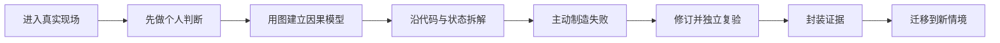

# 16 讲教材化与图文升级规范

> 本文件是课程大纲的教材化投影，不是第二份课程合同。讲次标题、核心内容、演示结果、课内增量和通过标准仍以 [`课程大纲`](../课程大纲-Codex-FDE行动营-个人研发自动化工作台.md) 为唯一事实源。

## 一、为什么“内容很多”仍然像大纲

当前 16 讲已经有完整合同、CLO、行动工单、验收门槛和证据要求，但学生打开讲义时，首先看到的仍是教学设计表和概念清单。这些内容适合教师备课和课程治理，却不能代替学习体验。

教材化要解决的不是“再加几页文字”，而是让学生进入一个连续项目、在答案揭示前承担决定，再把每一讲改造成一次完整的工程认知循环。16 讲的人物、事故、时间线和结尾钩子统一遵循 [`FlowERP连续案例叙事圣经`](./FlowERP连续案例叙事圣经.md)：

学生不是“读完一讲”，而是留下首次判断、操作过程、失败、修订、复验和迁移六类可追溯证据。教师治理信息继续保留，但放进折叠区或讲师手册，不再抢占学生的第一屏。

## 二、每讲统一采用“七幕教材结构”

| 幕 | 学生面对的问题 | 必须出现的教材对象 | 不能退化成 |
|---|---|---|---|
| 1. 现场 | 现在到底发生了什么？ | FlowERP 页面、终端、报告或数据状态截图 | 一段虚构故事 |
| 2. 预判 | 在看答案前，我认为该不该做、哪里危险？ | 1～3 个可提交的判断题 | 阅读理解题 |
| 3. 建模 | 输入、状态、裁决和责任怎样连接？ | 原创流程图、状态图或因果图 | 装饰性插图 |
| 4. 拆解 | 哪个文件、函数、数据表真正决定结果？ | 可运行代码片段、定位命令、状态对照 | 大段源码粘贴 |
| 5. 失败 | 错误怎样稳定出现，损失是什么？ | 受控故障、预期/实际、退出码、失败后状态 | 教师口述“这里会失败” |
| 6. 交付 | 怎样证明不是自报成功？ | Evidence Envelope、同伴反证、权威复验 | 最终截图或模型总结 |
| 7. 迁移 | 换一个需求还能做吗？ | 新情境、小范围迁移任务、反思 | 重做原题 |

推荐阅读顺序为“现场 → 预判 → 模型 → 代码 → 实验 → 证据 → 迁移”。CLO、课程思政、形成性评价和持续改进数据是教师必须掌握的设计依据，但不应阻断这一学习顺序。

## 三、图文不是装饰：五类视觉证据

每讲至少有一张真实项目图和一幅结构图；其余按本讲需要选择。

| 视觉类型 | 回答的问题 | 合格标准 |
|---|---|---|
| 现场截图 | 学生正在解决什么真实状态？ | 来自本仓库可复现页面或命令，图注注明观察点 |
| 因果/流程图 | 为什么这样设计？ | 图中每条边有业务或工程含义，正文解释至少一个分支 |
| 状态对照 | 修复前后什么发生了变化？ | 同时展示输入、预期、实际和权威状态 |
| 代码导航图 | 页面、API、服务、数据库如何贯通？ | 指向真实文件和入口，不虚构组件 |
| 证据信封 | 第三方怎样复验？ | 包含身份、命令、退出码、时间、产物和状态摘要 |

课程不复制外部文章或产品的配图。外部资料用链接、观点转化和课堂实验引用；课程图使用本项目截图、原创 Mermaid 图和可编辑源文件，降低版权和版本漂移风险。

## 四、一讲的最低出版门槛

每篇详细讲义在发布前必须满足：

- 有一个来自 FlowERP 或工作台的真实现场，不用抽象概念开场；
- 有一个“先判断再揭示”的认知冲突；
- 有一张带图注的项目截图和一幅可编辑结构图；
- 有一段可以定位到真实文件的代码或命令拆解；
- 有一个学生主动制造、能够清理、能够复现的失败；
- 有正常路径和失败路径，并核对失败后的业务状态；
- 有首次版本与修订版本，不只提交最终答案；
- 有至少两项一手资料，说明“借鉴什么、怎样转化”，而非堆链接；
- 有一项陌生情境迁移任务；
- 有可由同伴或教师独立执行的验收命令。

篇幅、截图数量、术语数量和参考仓库测试通过都不能单独证明达到上述门槛。

L01～L05 作为首批出版级样章，进一步遵循 [`前5讲出版级样章审校表`](./前5讲出版级样章审校表.md)：学生正文与教师附录彻底分开，正文必须包含操作前决定、可观察的错误路线、真实调查命令和证据后的第二次签字。其余讲次只有达到同一门槛后，才能标记为“出版级精修完成”。

## 五、外部优秀做法如何转化为课堂动作

| 外部做法 | 一手来源 | 课程中的具体转化 |
|---|---|---|
| 主角视角与未揭示决策点 | [HBS Case Method Teaching](https://www.hbs.edu/case-method-project/about/Pages/case-method-teaching.aspx) | 每讲先给学生当时可见的证据和压力，停在决策点；提交首次判断后才进入技术拆解 |
| 问题先于知识 | [Cornell Problem-Based Learning](https://teaching.cornell.edu/teaching-resources/active-collaborative-learning/problem-based-learning) | 先呈现真实、开放的 FlowERP 问题，由学生界定问题、知识缺口和方案，再引入工具 |
| 仓库事件驱动学习 | [GitHub Skills Quickstart](https://skills.github.com/quickstart) | 学生提交 Spec、测试或 PR 后触发检查；反馈落到本次工件，不单独做随堂问卷 |
| 主动学习与预测—观察—解释 | [CMU Active Learning](https://www.cmu.edu/teaching/resources/instructionalstrategies/activelearningstrategies/index.html) | 每讲先写判断，再运行失败实验，最后用证据解释判断如何改变 |
| 目标—活动—评价一致 | [CMU Course Alignment](https://www.cmu.edu/teaching/assessment/basics/alignment.html) | 每个 CLO 都映射到可观察动作和直接证据，不用“理解、掌握”作唯一目标 |
| 构思—设计—实现—运行 | [CDIO Standards](https://cdio.org/implementing-cdio/standards/12-cdio-standards) | L01～L16 不是工具目录，而是一条从问题判断到现场运行的产品生命周期 |
| 先理解问题再建设 | [GOV.UK Discovery](https://www.gov.uk/service-manual/agile-delivery/how-the-discovery-phase-works) | L03 在写 Spec 前先确认用户、约束、现状和不做范围；发现阶段不偷跑成实现 |
| 可复现发布和一致门禁 | [Google SRE: Release Engineering](https://sre.google/sre-book/release-engineering/) | L04、L08、L16 用同一入口、固定环境和可审计产物复验，不接受“我电脑上可以” |
| 从失败中形成系统改进 | [Google SRE: Postmortem Culture](https://sre.google/workbook/postmortem-culture/) | L05、L09、L15 保留失败事实与行动项，不删红灯、不把责任推给个人 |
| 任务相关的评价集 | [OpenAI Evaluation Best Practices](https://developers.openai.com/api/docs/guides/evaluation-best-practices) | L05～L08 先定义失败样本、通过阈值和分级，再讨论优化 |

## 六、两种阅读入口

### 学生入口

先阅读 `连续案例` 并在 `决策时刻` 停下，提交自己的批准、拒绝或证据需求；然后依次寻找 `先进入现场`、`先别看答案`、`看图建模`、`动手制造失败`、`带走证据`。课程合同与教师设计卡默认折叠，不参与学生的首次判断。

### 教师入口

先检查课程合同与 CLO，再用七幕结构组织课堂：线上精讲只负责现场、概念模型和关键示范；线下完成预判公开、故障实验、同伴反证、修订和迁移。线上线下不重复讲同一段内容。

## 七、发布前图文审校清单

- 截图中的状态与当前代码一致，图注指出要观察的字段；
- 图中的组件在仓库真实存在，箭头方向和代码调用方向一致；
- 外部资料优先引用官方文档、标准、论文或机构教学资源；
- 技术事实注明核对日期，易变产品能力不写成永久承诺；
- 外部观点附近给出链接，不把参考资料集中成无法对应正文的书目墙；
- 图片有替代文本，颜色不是表达成功/失败的唯一手段；
- 学生能从讲义直接找到文件、命令、预期结果和清理方式；
- 最终图不能替代原始日志、退出码和业务状态。

本轮资料核对日期：**2026-09-01**。涉及 Codex、Hooks、Subagents、API、申报政策等易变内容，开课前必须再次核对官方资料。
