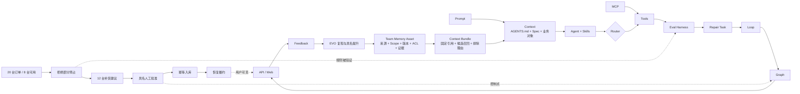

# 《让 Agent 真正交付》｜讲师手册

> 这不是第 17 讲，而是 16 讲的导演台。学员正文负责制造冲突、拆代码、运行失败并建立证据；本手册负责课前装置、时间控制、提问、验收和退稿。不要把评分表重新讲成正文。

## 一条不可剪断的教学主线

课程大纲是每讲目标的唯一事实源；课程先在 L01～L04 构建 Workbench V0，再通过它逐讲构建 FlowERP。最终作品是**工作台驱动的电商 ERP 持续交付系统**。Harness Workbench 是独立平台，必须以独立进程、端口、API、Web、项目注册表和数据目录运行；FlowERP 只是它管理的目标项目，不得把工作台重新塞回 ERP 菜单或业务数据库。工程侧把 ERP 交付暴露的问题沉淀为 Spec、Eval Harness、Repair、Loop、Subagents、Graph、API/Web 和 Feedback，再由升级后的工作台完成或修复当讲 ERP 增量。讲师既不能把课程写成 ERP 功能目录，也不能让 FlowERP 退化为冻结夹具。

每讲开场先回答四问：本讲 ERP 权威产品状态怎样变化；该交付暴露什么可重复工程问题；工作台因此新增或验证什么能力；学生提交什么证据证明本人能迁移。四问缺一，本讲不能进入录制。

讲师备课须同时打开 [`16讲主线与前沿校准矩阵.md`](./16讲主线与前沿校准矩阵.md)。稳定基础可以进入线上精讲和基础验收；当前增强只进入对照实验、挑战或迁移；观察项只讲如何评估与替换。若前沿功能不能直接解释本讲大纲增量，或其通过只能由“使用了某工具”证明，就从主课移出。

同时使用 [`16讲行动密度审计与优化记录.md`](./16讲行动密度审计与优化记录.md) 检查课堂是否值得学生付费：必须有学生亲手构造、主动失败、因果隔离、陌生人复验、迁移证据和 ERP/工作台双增量。六项任缺一项，先修教学装置，不进入录制。

讲师每一讲都要能回答三个问题：现在业务账新增或修复了什么；现在工程账多了哪个可执行对象；本讲留下的哪项矛盾迫使我们进入下一讲。L01～L03 允许业务账保持不变但必须为 L04 首次交付消除前置风险；L05～L15 不得连续两讲没有 ERP 增量。

每讲备课先运行 `python -X utf8 -m workbench.cli course-contract --lesson N`，L03 起用 `course-spec` 生成局部合同，L04 起用 `course-submit --execute-code` 推进真实交付并用 `course-eval` 精确复验本讲规则。真实执行必须在课次标签生成的 detached Worktree 中完成，并保留执行前红灯、Codex Diff、越界检查和执行后绿灯；任一项缺失都不进入人工审核。L15/L16 必须用 `--eval-case` 登记本次反馈/抽题新增 Eval，并用 `--session-baseline-ref` 固定“新 Eval 已红、实现尚未开始”的会话提交。`--verify-only` 只能检查已有候选，不计作学生实现证据。录制或发布整套课程前必须让 `course-status --require-baselines` 通过；若逐讲起始标签缺失，只能标记“课程基线待建设”，不能让终态仓库的绿灯代替学习过程。

逐讲分支、标签语义和红绿矩阵统一执行 [`逐讲代码基线建设方案.md`](./逐讲代码基线建设方案.md)。使用 `course-baseline-audit/publish` 审计并发布标签，使用 `course-candidate-export/promote` 提升具名审核通过的候选；历史中的批量同 HEAD 标签脚本不得作为课程发布依据。自动流水线未在 3 次内收敛时进入 `dead_letter`，必须由人查看完整事件链，禁止改写为成功。

## 每讲的混合式教学节奏

每讲由两部分组成：30 分钟以内的线上精讲负责建立问题框架、关键概念和操作示范；60–100 分钟线下行动课或课后项目实践负责判断、故障实验、同伴评审和修订。线上线下不能重复讲同一内容。

### 线上精讲（不超过 30 分钟）

1. **0–5 分钟：制造矛盾。** 展示会造成错误决策的页面、日志、状态或请求，要求学生提交首次判断。
2. **5–15 分钟：建立模型。** 只解释解决本讲问题所需的核心概念与边界。
3. **15–25 分钟：演示关键证据。** 展示一个真实命令、Diff、协议或状态迁移，以及失败如何呈现。
4. **25–30 分钟：发布行动任务。** 明确产物、评价量规、硬性退回项和线下需要验证的争议。

### 线下行动课或课后项目实践

1. 学生先独立运行正常与失败路径，记录命令、退出码和不变状态。
2. 小组交换产物进行反证，不由执行者给自己判定成功。
3. 学生依据证据修订并提交前后两个版本，教师按错误类型提供分层支架。
4. 课堂结束前形成未解决问题和教学数据，推向下一讲与下一轮改进。

连续 10 分钟只有讲师说话而没有学生判断、文件、命令或状态时，应删减讲述。连续两讲使用相同活动形式时，应重写其中一讲的线下任务。

## 16 讲导演表

| 讲次 | 课前装置 | 现场冲突与讲法 | 必须演示的失败 | 本讲收件物 | 推向下一讲的断点 |
|---:|---|---|---|---|---|
| L01 | 准备一个小型需求的 Spec、Diff、测试和摘要，以及可运行环境 | 终局导览：四周最终做成什么，生成完成为何不等于验收完成 | 环境检查失败或接手报告引用不存在的命令 | 环境检查记录与“结构、约束、验证命令、风险”四段式接手报告 | 下一次会话怎样继承规则 |
| L02 | 准备越界请求与一条已过期历史经验 | 规则法庭：区分 AGENTS.md 长期禁区、Memory 候选经验和真实权限 | 请求撞上约束后是否给出合法替代；过期经验是否被拒绝 | 五段式规则、L0–L3 证据层级与生命周期卡 | 长期禁区和历史经验都无法定义本次结果 |
| L03 | 只给“库存导出”模糊需求 | 合同谈判：压成机器可检、人能签字的首个 ERP Spec | 删除非目标或失败后不变状态 | 库存导出 Spec、用例矩阵、来源签字 | L04 必须消费合同实现，不许换题 |
| L04 | 固定库存导出 Spec 和允许写集 | 外科手术：用 Workbench V0 完成首个真实增量 | 顺手重构、白名单外写入、写失败 | 能力信封、Diff、最小 Eval、独立复验 | 真实增量可能与测试共享错误假设 |
| L05 | 准备重复入库错误实现 | 对抗实验：先红后绿交付幂等入库 | 重复键导致库存二次增加 | 幂等入库 Diff、两次红灯和同命令绿灯 | 多个业务 Eval 需要统一判决 |
| L06 | 准备幂等、非负、可用库存和 observing 用例 | 质量控制台：构建 Harness 并交付统一可用库存口径 | observing 误阻断、异常被记 pass | 可用库存 Diff、Harness JSON、退出码对照 | 权威入口仍可能被忘记运行 |
| L07 | 准备销售订单 Spec 与 Hook 协议夹具 | 在交付订单创建时建立本地结束门 | 缺货订单改变状态；Hook 重入或超时 | 订单 Diff、Hook 消息、前后状态 | 本地证据不能约束远程合并 |
| L08 | 准备原子预占缺陷和吞退出码 Workflow | A 假绿 → B 只修门禁诚实红 → C 交付原子预占可信绿 | 部分预占、缺报告、身份错配 | 原子预占 Diff、门禁 Spec、A/B/C、同伴法证 | 取消订单可能未释放预占 |
| L09 | 提供取消未释放预占的真实报告 | 先压缩为 Repair Task，再执行一次受控修复 | observing 误纳、过期报告、越界写集 | `repair-task.json`、取消修复 Diff、复验 | 下一类状态缺陷可能需要多轮 |
| L10 | 准备非法状态迁移及稳定 Eval | 用有界 Loop 修复订单状态机，并诚实演示未收敛 | 无进展、振荡、预算耗尽 | 订单状态修复、Loop History、stop reason | 采购需求适合拆分调查 |
| L11 | 准备采购需求、读写集和冲突反例 | 并行规格/Eval/风险审查，主 Agent 串行集成采购申请 | 两 Agent 同写、无引用结论、版本漂移 | 采购申请、子任务合同、原始报告、主结论 | 采购入库仍需持久人审 |
| L12 | 准备待审批采购申请和相反审核请求 | 同时审判交付 Graph 与采购状态机 | 匿名/重复 approve、未审批入库、崩溃恢复 | 采购审批入库、Graph Trace、具名决定 | 可恢复流程还不是可查询资源 |
| L13 | 准备补货需求和两个并发客户端 | 通过 Task API 提交并完成补货交付 | 双领取、非法迁移、重启丢任务 | Task ID、补货结果、事件和错误合同 | JSON 正确不等于用户理解正确 |
| L14 | 打开真实 ERP 页面、交付页和 Network 面板 | 四方测量：DOM、API、SQLite、ERP 权威状态 | 旧字段、断网旧绿灯、业务/任务状态混用 | ERP 操作页、证据下钻和对账记录 | 页面错误成为受治理反馈 |
| L15 | 使用 L14 真实走查反馈 | 反馈评审：原文→分诊→新版 Spec/Eval→独立 Task 改进 | 原始反馈直变 blocking；源 Task 自证 | Feedback、资产 Diff、独立任务和 ERP 改进 | 新环境还可能依赖作者记忆 |
| L16 | 准备全新目录、受控新需求池和备份 | 陌生人抽题，现场走完 Spec—Diff—Eval—人审 | 旧数据污染、固定答案、口头补步骤 | 冷启动、现场新增量、发布证据索引 | 真实反馈重新进入下一轮 |

## 讲师只验四类东西

不要按“术语说得是否流利”评分。只验以下四类可反驳对象：

- **合同**：规则、Spec、Schema、状态边是否明确说明允许与禁止；
- **运行**：命令、退出码、前后状态和失败后的不变状态是否真实；
- **证据**：报告、Trace、Task、Feedback 是否有稳定身份并能互相回指；
- **责任**：谁授权、谁审核、哪里停止、哪些风险仍未证明是否写清楚。

一个作品即使页面朴素，只要四类对象完整，可以通过；页面精美但读取静态数据、吞错或无法追溯，必须退回。学员如展示模型总结，讲师只问：“哪条命令能推翻这句话？”答不出时，把它标为解释而非证据。

## 失败实验的安全边界

所有故障注入在临时分支、临时工作树、临时数据库或专用测试替身中进行。讲师课前写清恢复动作，确认没有密钥、客户数据和正式服务。库存失败实验必须同时检查 `on_hand`、`reserved` 和事件历史，不能只等异常；幂等实验必须重放同一键，不是创建两个不同键；审批实验必须验证持久状态没有被越权推进。

修复后保留四件证据：缺陷版本与最小复现、失败输出、修复 Diff、同一命令恢复绿色。不要只保留最终截图，也不要为了课程效果把已知失败标为通过。现场出现非预期错误时，先分类为业务阻断、代码缺陷、环境问题或外部依赖，再决定继续、切换备用环境或停止。

## 退稿规则

出现以下任一项，整讲退回，不用字数补救：

1. 开头先定义三个以上名词，却没有一个会造成损失的现场冲突；
2. 图只能装饰页面，无法回答对象、方向、守卫或反馈关系；
3. 代码块没有说明它在主线中的输入、状态变化和失败语义；
4. “运行成功”没有命令、退出码、报告身份或权威状态；
5. 课末用学习总结封口，没有留下下一讲必须处理的未结案问题；
6. 同一套学习目标、步骤、作业、评分连续复制到多讲；
7. 把 Codex、Loop、Graph 或多 Agent 描述成能替人承担最终结果责任；
8. 用过时截图或固定测试数量冒充当前版本事实。

## 试讲记录

每次试讲只记五项：学员第一次做出错误判断的位置；最晚在哪一分钟运行了第一个失败；哪张图真正帮助了推理；哪段代码讲解没有改变判断；结尾断点是否让学员自然追问下一讲。根据这些记录删改正文，不以“讲完了所有页”作为成功指标。

课程版本发布时，把代码 tag、文档版本、环境矩阵、16 讲收件物抽样结果和已知勘误放入同一发布包。讲师手册可以继续迭代，但任何改变业务口径、命令、Hook 协议、Schema 或验收结果的修改，都必须回到仓库重新验证。
