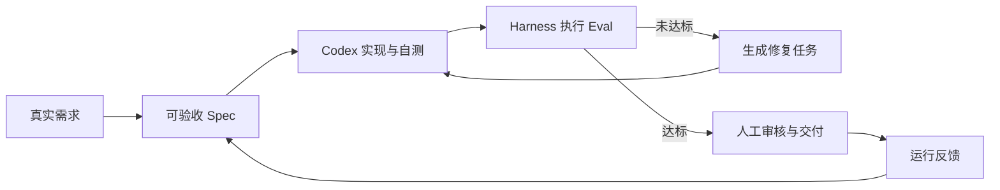

# 课程大纲｜Codex + FDE 全链路 AI 交付实战

> 四周行动营版：16 节精讲 + 4 场项目诊所，搭建一套自己真正能持续使用的《个人研发自动化工作台》

## 一、选题信息

| 字段 | 内容 |
|---|---|
| 暂定名称 | Codex 高价值交付实战课（个人研发自动化工作台） |
| 作者 | 袁从德 |
| 交付形态 | 极客时间训练营 / 行动营 / 企业内训 |
| 预计体量 | 开篇词 + 16 节精讲视频（30 分钟/节）+ 4 场项目诊所直播（每周 1 场）+ 结束语 |
| 配套仓库 | `https://github.com/congde/CodexFDE.git` |
| 关联图书 | 《Codex：AI 驱动的智能编程时代》（人民邮电出版社） |
| 主线项目 | **《个人研发自动化工作台》**：面向个人技术交付的全链路 AI 助手平台，把需求澄清、实现、验证、评审、文档和发布串成可重复工作流 |

**一句话定位**：面向**需要参与技术交付的开发者、测试工程师、架构师、技术负责人、独立开发者，以及具备基础编程能力的产品和解决方案人员**，用 Codex 作为执行工具、FDE 作为工程护栏，在 4 周内建立一条可重复、可验证、可持续改进的个人 AI 交付链路，并完成一套能够继续扩展的个人研发自动化工作台。

## 二、为什么选择“个人研发自动化工作台”

本训练营以 **Codex + FDE 双驱动**为核心方法论，并用**一条从零到可运营的真实主线项目**贯穿全程。选择“个人研发自动化工作台”，是因为需求澄清、实现、验证、评审和文档并不只属于程序员，而是广泛存在于技术交付工作的重复链路中——场景覆盖广、缺陷样本充足、多 Agent 分工贴合真实协作、结业作品可以直接复用。

- **Codex**：以 CLI / IDE / App 完成仓库理解、代码修改和验证，以原生 Subagents 委托边界清晰的并行任务；需要程序化调用时使用 Codex SDK，需要连接外部系统时使用 MCP——**课程中的核心代码均在 Codex 协助下完成并由可重复命令验收**；
- **FDE（Forward-Deployed Engineering）**：深度嵌入业务，识别重复工程痛点，构建 Eval 评估集，形成“需求 → 编码 → 校验 → 反馈 → 模型迭代”的三级飞轮闭环，让工作台从一次性 Demo 变成可持续进化的自研产品。

课程不按 Codex 的产品功能逐项讲解，而是让学员沿着一条真实交付链路——也就是工作台自身的研发链路——完成训练：

```text
接到需求 → 标准化 SPEC → 委托 Codex → 编码自测 → 自动化质检
→ 多 Agent 协作 → 预算与安全约束 → 服务化部署 → 运行反馈闭环
```

**单一主线、四周递进**：四周全部围绕《个人研发自动化工作台》这一套系统，从 V0 单 Agent 最小交付骨架 → V1 全自动质量流水线 → V2 多 Agent 研发团队 → V3 可运营产品化工作台。不是每周另起一个 Demo，而是让同一套系统逐层长大——这正是“完整工程闭环，而非零散 Demo”的价值，也是学员结业时能够完整展示的项目作品。



## 三、学员画像与前置要求

| 维度 | 要求 |
|---|---|
| 适合人群 | 需要提升技术交付效率的开发、测试、架构、DevOps、技术管理和独立开发者；以及具备基础编程能力的产品经理、解决方案顾问与技术创业者 |
| 技术基础 | 能阅读并修改一段小型代码，能够使用命令行和 Git；不了解测试或 CI/CD 的学员可通过课程基线模板跟跑 |
| 必备环境 | Python 3.10+、Git、可用的 Codex 客户端；跟跑线默认使用 GitHub Actions，企业环境可替换为现有 CI |
| 建议经验 | 完成过一个小型开发、测试、数据处理或流程自动化任务；工作岗位和年限不作为门槛 |
| 环境边界 | 课程提供 Windows 与 macOS 的基线说明；Linux 可参考 macOS 命令，企业代理和私有 CI 在诊所中按个案处理 |

## 四、四周项目路线

| 周次 | 项目版本 | 本周核心问题 | 主要产出 | 退出门槛 |
|---|---|---|---|---|
| 第一周 | V0 单 Agent 最小交付 | 怎样把模糊需求变成可验收任务 | 仓库约束、结构化 Spec、Codex 本地执行入口、结果汇总 | 从自然语言需求生成 Spec，完成一次代码变更并通过基础测试；密钥不入库 |
| 第二周 | V1 自动质量流水线 | 怎样让关键质量要求自动复验 | Eval 题库、Harness 报告、Codex Hooks、本地与远程 CI 门禁 | 缺陷基线能稳定失败、修复后稳定通过；阻断级 Eval 可以阻止不合格变更进入候选分支 |
| 第三周 | V2 可控的多 Agent 协作 | 怎样并行协作且避免失控 | 有界 Loop、预算约束、Codex 原生 Subagents、可观察状态图 | 循环在限定轮数和预算内停止；并行任务边界清楚；审核结论来自 Eval；异常不会被静默忽略 |
| 第四周 | V3 可演示、可继续使用的工作台 | 怎样把研发链路服务化并留下反馈 | 任务 API、状态持久化、Web 面板、结果导出、反馈记录、容器化 | 干净环境可启动；任务状态与失败可追踪；阻断级 Eval 全部通过；服务重启后已完成任务仍可查询 |

三大热点在课程中的职责保持简单一致：

| 热点 | 核心问题 | 项目落点 |
|---|---|---|
| Harness | 怎么验 | 执行 Eval、评分、生成报告、阻断不合格变更 |
| Loop | 怎么改 | 把失败用例翻译成修复任务，并限制迭代轮数 |
| Graph | 怎么协作 | 编排角色、状态、分支、回退和人工审核节点；跟跑线使用最小 Python 状态图，挑战线可替换为 LangGraph |

## 五、详细课表

### 第一周｜从对话写代码到 Spec 驱动交付

**周目标**：建立仓库约束，完成结构化 Spec 和 Codex 本地执行入口，跑通 V0 首条可验证交付链路。

#### 第 1 讲｜先看终局：一次可验证的 AI 交付怎样完成

- **核心内容**：课程最终成品、四周路线、生成完成与验收完成的区别。
- **演示结果**：输入一个小型真实需求，依次看到 Spec、代码变更、测试结果和交付摘要。
- **课内增量**：运行环境检查，并让 Codex 输出“结构、约束、验证命令、风险”四段式接手报告。
- **通过标准**：环境检查通过；接手报告能指出真实的仓库命令和一项风险。

#### 第 2 讲｜把仓库规则写进 `AGENTS.md`

- **核心内容**：Prompt、`AGENTS.md`、Skill、Hook、MCP 的职责边界；最小而有效的项目约束。
- **演示结果**：同一任务在缺少约束与加入约束后产生不同结果。
- **课内增量**：补齐目录结构、禁止事项、验证命令和 Definition of Done。
- **通过标准**：新会话能够读取约束；错误命令或越界修改能被明确拒绝或纠正。
- **挑战任务**：为子目录增加更具体的 `AGENTS.md`，验证就近规则生效。

#### 第 3 讲｜把模糊需求变成可验收 Spec

- **核心内容**：目标与非目标、正常与错误路径、边界条件、可执行验收项、最小变更原则。
- **演示结果**：把“增加导出功能”拆成结构化 `FDE_SPEC.md`。
- **课内增量**：实现 Spec 模板与最小解析器，只负责生成和校验结构，不执行编码。
- **通过标准**：Spec 至少包含目标、非目标、约束、验收用例和来源；缺失必要字段时返回明确错误。
- **挑战任务**：从 Issue 或需求文档导入并保留来源追踪信息。

#### 第 4 讲｜委托 Codex 执行一次最小变更

- **核心内容**：非交互执行、工作目录、权限边界、结果采集与人工确认点。
- **演示结果**：读取第 3 讲 Spec，委托 Codex 完成一个小型代码变更并运行测试。
- **课内增量**：完成执行入口和结果摘要；仓库文件由 Codex 在授权工作区直接处理，不额外包装为文件读写 MCP。
- **通过标准**：变更能够运行；基础测试通过；摘要包含修改文件、验证命令和剩余风险；密钥和环境文件未提交。

**项目诊所 1｜环境与 Spec 门诊**：处理 Windows 编码、路径、依赖安装、约束未生效和验收项不可执行。诊所输出第一周常见错误清单与 V0 基线标签。

### 第二周｜用 Harness 建立可量化的质量门禁

**周目标**：完成 V1 自动质量流水线，让每项阻断级要求都有可重复执行的证据。

#### 第 5 讲｜先设计失败，再编写 Eval

- **核心内容**：示例测试与 Eval 的区别；逻辑错误、边界缺失、规范违规和危险修改四类失败模式。
- **演示结果**：一个故意带缺陷的基线稳定触发失败。
- **课内增量**：编写一个业务结果 Eval 和一个工程约束 Eval。
- **通过标准**：缺陷基线连续运行两次均失败；失败信息能够定位到具体要求。

#### 第 6 讲｜用 Harness 汇总证据和等级

- **核心内容**：用例发现、统一退出码、阻断级与观察级指标、机器可读报告。
- **演示结果**：Harness 输出分项结果、阻断结论和 JSON 报告。
- **课内增量**：实现最小 Harness，将第 5 讲用例纳入统一执行。
- **通过标准**：阻断用例失败时返回非零退出码；观察项失败只记录告警；报告保留运行时间和失败原因。
- **挑战任务**：增加跨项目回归用例并说明其适用边界。

#### 第 7 讲｜用 Codex Hooks 建立本地护栏

- **核心内容**：生命周期 Hook、信任边界、超时、失败策略，以及 Hook 与 Git Hook 的区别。
- **演示结果**：Codex 在关键生命周期节点运行质量检查并反馈失败。
- **课内增量**：配置一个项目级质量 Hook，调用统一 Harness，而不是复制另一套质量逻辑。
- **通过标准**：Hook 来源可检查；故意引入违规时流程被阻断；恢复后重新通过。

#### 第 8 讲｜把同一套 Eval 接入 CI

- **核心内容**：本地快速反馈与远程可信复验；候选分支、报告归档和人工合并。
- **演示结果**：不合格变更在 CI 中失败，修复后生成通过报告。
- **课内增量**：配置 CI 工作流并上传 Harness 报告。
- **通过标准**：本地与 CI 使用同一入口；非零退出码阻断候选变更；自动修复不直接合并主分支。
- **挑战任务**：失败后只创建候选分支或草稿 PR，并附上失败证据。

**项目诊所 2｜Eval 设计评审**：检查学员用例是否验证业务结果而非仅验证函数调用；标记哪些指标可以阻断、哪些只能观察。诊所输出 V1 基线标签。

### 第三周｜用 Loop、Subagents 与 Graph 编排协作

**周目标**：完成 V2 可控协作闭环，明确什么时候循环修复、什么时候并行委托、什么时候必须人工介入。

#### 第 9 讲｜把失败报告翻译成修复任务

- **核心内容**：从失败证据提取范围、复现命令、目标状态和禁止变更。
- **演示结果**：Harness 失败报告生成一个只针对失败项的修复任务。
- **课内增量**：实现失败报告到修复任务的映射器。
- **通过标准**：任务包含复现步骤和验收命令；不把观察级告警误判为阻断任务。

#### 第 10 讲｜建立有停止条件的修复 Loop

- **核心内容**：最大轮数、达标即停、无进展检测、时间与 Token 预算、安全退出。
- **演示结果**：修复循环成功收敛一次，并展示一次未收敛退出。
- **课内增量**：串联“执行 → Eval → 生成修复任务 → 再执行”。
- **验收命令**：`python -X utf8 -m agent.loop --max-rounds 3`
- **通过标准**：最多三轮；达标即停止；无进展或预算耗尽时输出剩余失败，不宣称成功。

#### 第 11 讲｜用 Codex 原生 Subagents 并行处理独立任务

- **核心内容**：可并行任务识别、上下文隔离、结果汇总、冲突风险与额外 Token 成本。
- **演示结果**：测试补全与风险审查并行执行，由主 Agent 汇总结论。
- **课内增量**：为两个无文件写入冲突的任务定义清晰输入、输出和验收标准。
- **通过标准**：子任务边界清晰；主 Agent 能追溯每个结论；有写入冲突的任务不强行并行。
- **挑战任务**：比较单 Agent 与 Subagents 在耗时、Token 和结果质量上的差异。

#### 第 12 讲｜用 Graph 显式表达状态、回退和人工审核

- **核心内容**：共享状态、条件分支、审核打回、异常路径和人工介入；原生 Subagents 与外部编排框架的边界。
- **演示结果**：开发 → 测试 → 审核；审核失败回到开发，关键决策等待人工确认。
- **课内增量**：用最小 Python 状态图实现移交、回退、状态保存和审核结论。
- **验收命令**：`python -X utf8 -m agent.graph --max-rounds 3`
- **通过标准**：状态变化可追踪；审核结果来自 Eval；循环有上限；异常不会被静默忽略。
- **挑战任务**：用 LangGraph 替换最小状态图，同时保持相同输入、输出与验收命令。

**项目诊所 3｜多 Agent 设计评审**：排查角色重叠、无限循环、共享状态污染、并行写冲突和“多个 Agent 只是多个提示词”。诊所输出 V2 基线标签。

### 第四周｜从代码仓库到可运行的演示产品

**周目标**：完成 V3 服务化、可视化和反馈闭环，并用可重复证据完成结业答辩。

#### 第 13 讲｜把执行链路封装成任务 API

- **核心内容**：任务模型、异步执行边界、状态机、持久化和最小权限。
- **演示结果**：提交任务后获得 ID，并查询 Spec、执行阶段和最终结果。
- **课内增量**：实现任务提交与状态查询两个最小接口。
- **通过标准**：状态只按合法路径变化；失败原因可查询；已完成任务在服务重启后仍可读取。

#### 第 14 讲｜让交付状态在 Web 面板可见

- **核心内容**：面板信息层级、轮询或推送、失败重试、结果下载和密钥边界。
- **演示结果**：从 Web 提交需求并查看阶段状态、Eval 报告和产出文件。
- **课内增量**：完成只覆盖一个任务主路径的最小面板。
- **通过标准**：状态与后端一致；失败路径明确；结果可追踪；前端和仓库中没有密钥。
- **挑战任务**：增加任务队列或多仓库隔离，不作为跟跑线结业要求。

#### 第 15 讲｜生成交付摘要并采集真实反馈

- **核心内容**：文档和周报导出、运行反馈、失败样本回流，以及反馈与自动改代码之间的人工边界。
- **演示结果**：生成一次交付摘要并写入一条结构化反馈。
- **课内增量**：实现摘要导出和反馈记录，不在本节增加新的 Agent 编排。
- **通过标准**：摘要可追溯到任务和 Eval 报告；反馈包含来源、结论和下一步；原始反馈不会未经审核直接成为阻断 Eval。
- **挑战任务**：增加仓库问答 Bot 或脚手架生成器，作为独立扩展而非结业必做项。

#### 第 16 讲｜冷启动发布与工程答辩

- **核心内容**：容器化、健康检查、回滚意识、演示叙事和技术债说明。
- **演示结果**：从干净环境启动系统，展示一次成功任务、一次失败打回、一次结果导出和一次反馈写入。
- **课内增量**：完成结业检查表与五分钟答辩稿。
- **最终验收命令**：

  ```bash
  python -X utf8 -m workbench.cli demo
  python -X utf8 -m eval.harness --suite blocking
  python -X utf8 -m agent.loop --max-rounds 3
  python -X utf8 -m agent.graph --max-rounds 3
  python -X utf8 -m workbench.feedback summary
  ```

- **通过标准**：需求能生成 Spec 和代码；阻断级 Eval 全部通过；Loop 收敛或如实安全退出；Graph 审核结论可追踪；摘要和反馈能够正确生成；干净环境可启动且仓库无密钥。
- **挑战任务**：部署到个人测试环境，提交健康检查、资源上限和回滚说明。

**项目诊所 4 / Demo Day｜成果展示**：随机抽取冷启动演示；学员展示完整交付链路，并说明一个失败案例、一次纠偏和一个仍未解决的技术债。

## 六、技术路线与术语边界

| 能力 | 课程中的用法 |
|---|---|
| Codex CLI / IDE / App | 交互式理解仓库、修改代码、运行验证和审查结果 |
| AGENTS.md | 保存仓库级约束、命令、目录结构和交付要求 |
| Codex Hooks | 在生命周期节点运行校验、日志或安全检查 |
| Codex Subagents | 并行处理边界清晰的探索、测试或审查子任务 |
| Codex SDK | 以编程方式启动、继续和管理 Codex 编码任务；作为扩展内容 |
| OpenAI Agents SDK | 当 Codex 作为更大业务工作流中的专业节点时用于编排；不与 Codex SDK 混称 |
| MCP | 连接需要授权或独立运行的外部工具与数据源，不把本地文件读写强行包装成 MCP |
| Python 状态图 / LangGraph | 跟跑线用最小 Python 状态图理解 Graph 语义；挑战线再用 LangGraph 替换实现，保持验收接口不变 |
| Eval Harness | 执行题库、汇总结果并为交付提供一致的质量门槛 |

课程主仓库使用 Python 3.10+。跟跑线的核心执行链路保持依赖可控，第三周先使用最小 Python 状态图；LangGraph 作为挑战线实现，避免框架安装或版本问题阻断主线学习。

## 七、配套交付物

- `AGENTS.md`：项目记忆、编码规范、禁止事项和验证命令；
- `FDE_SPEC.md`：目标、非目标、功能需求和验收标准；
- `workbench/`：Spec 解析、Codex 执行、任务调度、反馈与服务接口；
- `eval/`：Harness 与工作台 Eval 题库；
- `agent/`：Loop、Graph 与多角色协作逻辑；
- `hooks/`：本地质量门禁；
- `.github/workflows/`：远程自动复验；
- `web/`：管理面板；
- `deploy/`：Docker、Compose、健康检查与回滚示例；
- 每讲目标卡、命令卡、验收卡和常见错误清单。
- 每周可继续学习的 V0～V3 基线标签，以及对应的升级说明和常见失败样本。
