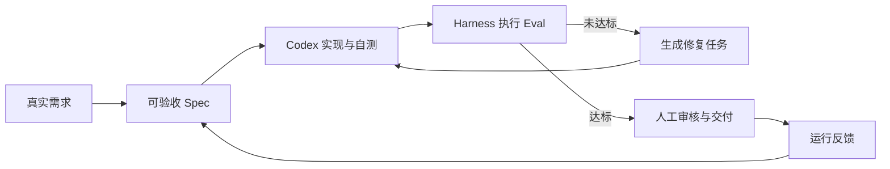

# 设计稿｜Codex 编程与 FDE 全链路交付行动营

> 黄佳行动营页面参考：https://u.geekbang.org/subject/intro/101164201

# 1、长图

角标：重磅上新

### **Codex 编程与 FDE 全链路交付行动营**

Harness + Loop + Graph，4 周落地可扩展的研发自动化工作台

关键数据量化

| **4 周** 专家带练 | **16 个** 实战任务 | **8+ 小时** 视频精讲 | **4 场** 干货直播 + 在线答疑 |
|-|-|-|-|
| **Codex + FDE** 双驱动核心方法论 | **项目成长** 三级飞轮闭环 | **低门槛上手** 核心思想 可迁移至其他模型 | **专属社群** 高质量答疑与技术交流 |

---

### **AI 时代，** 你需要怎样的工程交付能力？

AI 赛道竞争日趋白热化，行业竞争重心正从单纯比拼大模型能力，转向真实场景的落地交付。

随着 Codex 应用边界不断拓宽，FDE 前沿部署模式也成为各大 AI 企业重点布局方向，市场相关工程人才缺口持续扩大。

但多数开发者都卡在落地这一关：即便会用 Codex 生成代码，也搭建不出可直接上线的完整方案；能看懂 FDE 交付理念，却缺少一套稳定、可复用的 AI 自动化开发工作流。

本行动营融合 Codex 与 FDE 两大技术体系，以实战训练，帮你建立完整的 AI 工程交付能力。

---

### 4 周搭建一个 研发自动化工作台

**你将获得：**

工具底座：吃透 LLM 编程，掌握 Codex 类工具高级能力

能力升级：摆脱浅层次对话写代码，建立工程化 AI 编程能力

架构认知：吃透 Agent 工程思想，具备多 Agent 系统设计能力

项目积累：从 0 打造可运营的个人研发自动化工作台

认知沉淀：获得一条可复用、可持续优化的 FDE 落地路径

**你会做出一个怎样的作品？**

以 Codex + FDE 双驱动为核心方法论，并用一个真实项目贯穿全程。

| 项目版本 | 核心问题 | 主要产出 | 阶段收获 |
|-|-|-|-|
| 第一周 V0：构建单 Agent，完成最小可交付工程原型 | 怎样把模糊需求变成可验收任务 | - 仓库约束 - 结构化 Spec - Codex 本地执行入口 - 结果汇总 | - 从自然语言需求生成 Spec，完成一次代码变更并通过基础测试 - 密钥不入库 |
| 第二周 V1：自动质量流水线 | 怎样让关键质量要求自动复验 | - Eval 题库 - Harness 报告 - Codex Hooks - 本地与远程 CI 门禁 | - 缺陷基线能稳定失败、修复后稳定通过 - 阻断级 Eval 可以阻止不合格变更进入候选分支 |
| 第三周 V2：可控的多 Agent 协作 | 怎样并行协作且避免失控 | - 有界 Loop - 预算约束 - Codex 原生 Subagents - 可观察状态图 | - 循环在限定轮数和预算内停止 - 并行任务边界清楚 - 审核结论来自 Eval - 异常不会被静默忽略 |
| 第四周 V3：可演示、可持续使用的自动化工作台 | 怎样把研发链路服务化并留下反馈 | - 任务 API - 状态持久化 - Web 面板 - 结果导出 - 反馈记录 - 容器化 | - 干净环境可启动 - 任务状态与失败可追踪 - 阻断级 Eval 全部通过 - 服务重启后已完成任务仍可查询 |

不是每周另起一个案例，而是让同一套系统逐层长大。这正是"完整工程闭环，而非零散案例"的价值，也是你结业时能够完整展示和自用的项目作品。

---

### 不止做项目 高阶能力融会贯通

- **Harness：**解决"怎么验"，执行 Eval、评分、生成报告、阻断不合格变更。
- **Loop：**解决"怎么改"，把失败用例翻译成修复任务，并限制迭代轮数。
- **Graph：**解决"怎么协作"，编排角色、状态、分支、回退和人工审核节点。
- **Codex 开发**：以 CLI / IDE / App 完成仓库理解、代码修改和验证，以原生 Subagents 委托边界清晰的并行任务；需要程序化调用时使用 Codex SDK，需要连接外部系统时使用 MCP——**课程中的核心代码均在 Codex 协助下完成，并由可重复命令验收。**
- **FDE 落地**：深度嵌入业务，识别重复工程痛点，构建 Eval 评估集，形成"需求 → 编码 → 校验 → 反馈 → 模型迭代"的三级飞轮闭环，让工作台从一次性 Demo 变成可持续进化的自研产品。

---

### 名师带路，快人一步

袁从德，AI 创业公司 CTO，畅销书《Codex 快速入门》作者

拥有 9 年一线互联网大厂技术研发与团队管理经验。曾在交易所担任算法负责人，也曾任职于腾讯、阿里巴巴。多篇成果发表国际顶会，并获中国及中国香港地区发明专利 5 项。著有图书《大语言模型全链路解析》《在线广告全链路解析》《Codex 快速入门》等，也是极客时间《强化学习快速入门与实战》《大模型应用一站式开发》《Codex 与 LLM 量化交易实战课》专栏作者，广受用户好评。

---

### 课程目录

#### 第一周｜从对话式写代码到 Spec 驱动交付

**目标**：建立仓库约束，完成结构化 Spec 和 Codex 本地执行入口，跑通 V0 首条可验证交付链路。

| 讲次 | 主题 | 核心内容 | 演示结果 | 课内增量 | 验收标准 |
|-|-|-|-|-|-|
| 01 | 以终为始：一次可验证的 AI 交付怎样完成？ | 行动营最终成果演示；四周学习路线拆解；明确生成完成与验收完成的区别。 | 输入一个小型真实需求（ERP 需求），依次看到 Spec、代码变更、测试结果和交付摘要。 | 运行环境检查，并让 Codex 输出"结构、约束、验证命令、风险"四段式接手报告。 | 环境检查通过；接手报告能指出真实的仓库命令和一项风险。 |
| 02 | 把仓库规则写进 `AGENTS.md` | Prompt、`AGENTS.md`、Skill、Hook、MCP 的职责边界；最小而有效的项目约束。 | 同一任务在缺少约束与加入约束后产生不同结果。 | 补齐目录结构、禁止事项、验证命令和 Definition of Done。 | 新会话能够读取约束；错误命令或越界修改能被明确拒绝或纠正。 |
| 03 | 把模糊需求变成可验收 Spec | 目标与非目标、正常与错误路径、边界条件、可执行验收项、最小变更原则。 | 把"增加导出功能"拆成结构化 `FDE_SPEC.md`。 | 实现 Spec 模板与最小解析器，只负责生成和校验结构，不执行编码。 | Spec 至少包含目标、非目标、约束、验收用例和来源；缺失必要字段时返回明确错误。 |
| 04 | 委托 Codex 执行一次最小变更 | 非交互执行、工作目录、权限边界、结果采集与人工确认点。 | 读取第 03 讲 Spec，委托 Codex 完成一个小型代码变更并运行测试。 | 完成执行入口和结果摘要；仓库文件由 Codex 在授权工作区直接处理，不额外包装为文件读写 MCP。 | 变更能够运行；基础测试通过；摘要包含修改文件、验证命令和剩余风险；密钥和环境文件未提交。 |

**直播课程｜**环境与 Spec 诊断：处理 Windows 编码、路径、依赖安装、约束未生效和验收项不可执行等问题。输出第一周常见错误清单与 V0 基线标签。

#### 第二周｜用 Harness 建立可量化的质量门禁

**目标**：完成 V1 自动质量流水线，让每项阻断级要求都有可重复执行的证据。

| 讲次 | 主题 | 核心内容 | 演示结果 | 课内增量 | 验收标准 |
|-|-|-|-|-|-|
| 05 | 先设计失败，再编写 Eval | 示例测试与 Eval 的区别；逻辑错误、边界缺失、规范违规和危险修改四类失败模式。 | 一个故意带缺陷的基线稳定触发失败。 | 编写一个业务结果 Eval 和一个工程约束 Eval。 | 缺陷基线连续运行两次均失败；失败信息能够定位到具体要求。 |
| 06 | 用 Harness 汇总证据和等级 | 用例发现、统一退出码、阻断级与观察级指标、机器可读报告。 | Harness 输出分项结果、阻断结论和 JSON 报告。 | 实现最小 Harness，将第 05 讲用例纳入统一执行。 | 阻断用例失败时返回非零退出码；观察项失败只记录告警；报告保留运行时间和失败原因。 |
| 07 | 用 Codex Hooks 建立本地护栏 | 生命周期 Hook、信任边界、超时、失败策略，以及 Hook 与 Git Hook 的区别。 | Codex 在关键生命周期节点运行质量检查并反馈失败。 | 配置一个项目级质量 Hook，调用统一 Harness，而不是复制另一套质量逻辑。 | Hook 来源可检查；故意引入违规时流程被阻断；恢复后重新通过。 |
| 08 | 把同一套 Eval 接入 CI | 本地快速反馈与远程可信复验；候选分支、报告归档和人工合并。 | 不合格变更在 CI 中失败，修复后生成通过报告。 | 配置 CI 工作流并上传 Harness 报告。 | 本地与 CI 使用同一入口；非零退出码阻断候选变更；自动修复不直接合并主分支。 |

**直播课程｜**Eval 设计评审：检查用例是否验证业务结果而非仅验证函数调用；标记哪些指标可以阻断、哪些只能观察。输出 V1 基线标签。

#### 第三周｜用 Loop、Subagents 与 Graph 编排协作

**目标：**完成 V2 可控协作闭环，明确什么时候循环修复、什么时候并行委托、什么时候必须人工介入。

| 讲次 | 主题 | 核心内容 | 演示结果 | 课内增量 | 验收标准 |
|-|-|-|-|-|-|
| 09 | 把失败报告翻译成修复任务 | 从失败证据提取范围、复现命令、目标状态和禁止变更。 | Harness 失败报告生成一个只针对失败项的修复任务。 | 实现失败报告到修复任务的映射器。 | 任务包含复现步骤和验收命令；不把观察级告警误判为阻断任务。 |
| 10 | 建立有停止条件的修复 Loop | 最大轮数、达标即停、无进展检测、时间与 Token 预算、安全退出。 | 修复循环成功收敛一次，并展示一次未收敛退出。 | 串联"执行 → Eval → 生成修复任务 → 再执行"。 | 最多三轮；达标即停止；无进展或预算耗尽时输出剩余失败，不宣称成功。 |
| 11 | 用 Codex 原生 Subagents 并行处理独立任务 | 可并行任务识别、上下文隔离、结果汇总、冲突风险与额外 Token 成本。 | 测试补全与风险审查并行执行，由主 Agent 汇总结论。 | 为两个无文件写入冲突的任务定义清晰输入、输出和验收标准。 | 子任务边界清晰；主 Agent 能追溯每个结论；有写入冲突的任务不强行并行。 |
| 12 | 用 Graph 显式表达状态、回退和人工审核 | 共享状态、条件分支、审核打回、异常路径和人工介入；原生 Subagents 与外部编排框架的边界。 | 开发 → 测试 → 审核；审核失败回到开发，关键决策等待人工确认。 | 用最小 Python 状态图实现移交、回退、状态保存和审核结论。 | 状态变化可追踪；审核结果来自 Eval；循环有上限；异常不会被静默忽略。 |

**直播课程**｜多 Agent 设计评审：排查角色重叠、无限循环、共享状态污染、并行写冲突和"多个 Agent 只是多个提示词"。输出 V2 基线标签。

#### 第四周｜从代码仓库到可运行的演示产品

**目标**：完成 V3 服务化、可视化和反馈闭环，并用可重复证据完成结业答辩。

| 讲次 | 主题 | 核心内容 | 演示结果 | 课内增量 | 验收标准 |
|-|-|-|-|-|-|
| 13 | 把执行链路封装成任务 API | 任务模型、异步执行边界、状态机、持久化和最小权限。 | 提交任务后获得 ID，并查询 Spec、执行阶段和最终结果。 | 实现任务提交与状态查询两个最小接口。 | 状态只按合法路径变化；失败原因可查询；已完成任务在服务重启后仍可读取。 |
| 14 | 让交付状态在 Web 面板可见 | 面板信息层级、轮询或推送、失败重试、结果下载和密钥边界。 | 从 Web 提交需求并查看阶段状态、Eval 报告和产出文件。 | 完成只覆盖一个任务主路径的最小面板。 | 状态与后端一致；失败路径明确；结果可追踪；前端和仓库中没有密钥。 |
| 15 | 生成交付摘要并采集真实反馈 | 文档和周报导出、运行反馈、失败样本回流，以及反馈与自动改代码之间的人工边界。 | 生成一次交付摘要并写入一条结构化反馈。 | 实现摘要导出和反馈记录，不在本节增加新的 Agent 编排。 | 摘要可追溯到任务和 Eval 报告；反馈包含来源、结论和下一步；原始反馈不会未经审核直接成为阻断 Eval。 |
| 16 | 冷启动发布与工程答辩 | 容器化、健康检查、回滚意识、演示叙事和技术债说明。 | 从干净环境启动系统，展示一次成功任务、一次失败打回、一次结果导出和一次反馈写入。 | 完成结业检查表与五分钟答辩稿。 | 需求能生成 Spec 和代码；阻断级 Eval 全部通过；Loop 收敛或如实安全退出；Graph 审核结论可追踪；摘要和反馈能够正确生成；干净环境可启动且仓库无密钥。 |

**直播课程**｜成果展示：冷启动演示；邀请同学展示完整交付链路，并分享一个失败案例、一次纠偏和一个仍未解决的技术债。

---

### 技术栈 & 可迁移场景

**技术栈**：Codex CLI / IDE / App、AGENTS.md、Codex Hooks、Codex Subagents、Codex SDK、OpenAI Agents SDK、MCP、Python 状态图 / LangGraph、Eval Harness

**可迁移场景**：

开发侧：

- 个人研发效能：Codex 代码生成 + FDE 端到端 AI 交付流水线
- 研发团队效能：自动化代码审查、测试、持续交付多 Agent 工具链
- 需求自动化落地：业务需求拆解、代码实现、验证上线一体化链路

业务侧：

- 数据与业务分析：定向数据采集、自动分析，输出标准化洞察报告
- 企业知识库问答：私有知识库构建，搭建领域 AI 对话系统
- 内容生产运营：技术专栏、自媒体自动采编、多渠道内容分发

---

### 这门课适合谁？

| 维度 | 要求 |
|-|-|
| 适合人群 | 需要提升技术交付效率的开发、测试、架构、DevOps、技术管理和独立开发者；以及具备基础编程能力的产品经理、解决方案顾问与技术创业者 |
| 技术基础 | 能阅读并修改一段小型代码，能够使用命令行和 Git；不了解测试或 CI/CD 的同学可通过课程基线模板跟跑 |
| 必备环境 | Python 3.10+、Git、可用的 Codex 客户端；跟跑线默认使用 GitHub Actions，企业环境可替换为现有 CI |
| 建议经验 | 完成过一个小型开发、测试、数据处理或流程自动化任务；工作岗位和年限不作为门槛 |
| 环境边界 | 课程提供 Windows 与 macOS 的基线说明；Linux 可参考 macOS 命令，企业代理和私有 CI 在诊所中按个案处理 |

---

### 重磅上新，享最低价

> 含价格趋势图（sheet token: Jbp1suOhch3iSrtEHo6cfkHkn0b，sheet-id: QZ9inY），X 轴日期，Y 轴价格

⚠️：极客时间 VIP 用户和训练营用户，购买行动营畅享**原价 5 折**优惠，可联系班主任购买

按钮：戳此购买👆~~原价 ¥699~~

关于课程有任何问题，欢迎扫码咨询

（二维码/路娟联系方式需要更新）

---

### **帮助与常见问题**

复用这个模块，哪里需要调整需要更新

> 此处为帮助中心截图（图片已归档）

---

# 2、长图延展

### 编辑侧配置素材

课程横图、课程竖图（用讲师头像，不要用文件夹）、课程方图、讲师横图

### 运营侧站内延展

- banner（APP、PC）
- 插屏（APP、PC）
- 消息中心
- PC 顶图
- 我的页
- 微信呼起海报

#### 延展文案

重磅上新🔥

**多 Agent 设计与工程化行动营**

按钮：早鸟特惠 ¥399  ~~¥699~~

# 3、海报

### 微信呼起海报1（售前）

火热招生中🔥

**多 Agent 设计与工程化行动营**

你将获得

- 用 OpenClaw 实现知识库二创与分发
- 告别"对话式写代码"，解锁 8 大 AI 编程技能
- 一套可复用的 AI 工程化方法论
- 玩转多 Agent 设计，实现自动化工程系统

早鸟特惠 ¥399

即将恢复原价 ¥699

扫码立抢

### 微信呼起海报2（售后）

添加班主任老师

拉你进学习交流群

多 Agent 设计与工程化行动营

识别二维码｜一对一沟通

## 4、视频号商品（2张）

**课程名称：多 Agent 设计与工程化行动营**

**Slogan：OpenClaw + OpenCode ，4 周打造你的 AI 知识库助手系统**

滑动查看学习方式或联系客服

下单后请留意短信通知，根据短信指引激活课程

### 你将获得

- 用 OpenClaw 实现知识库二创与分发
- 告别"对话式写代码"，解锁 8 大 AI 编程技能
- 一套可复用的 AI 工程化方法论
- 玩转多 Agent 设计，实现自动化工程系统